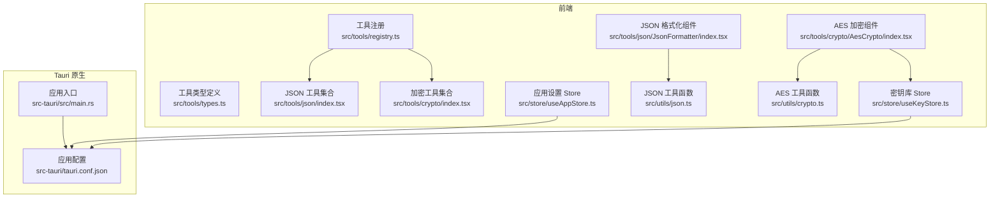
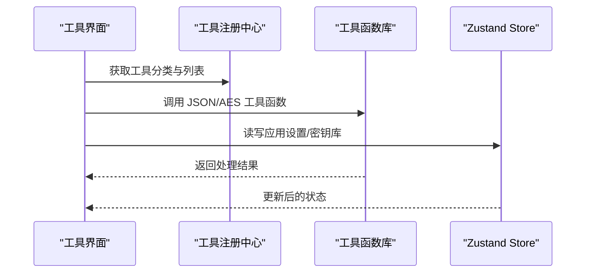
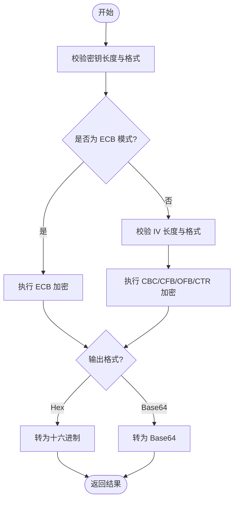
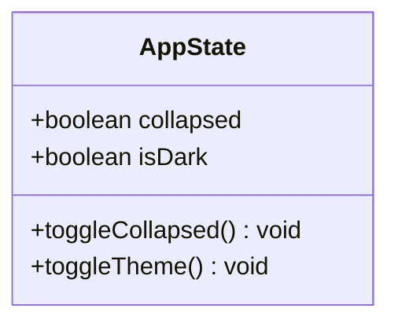
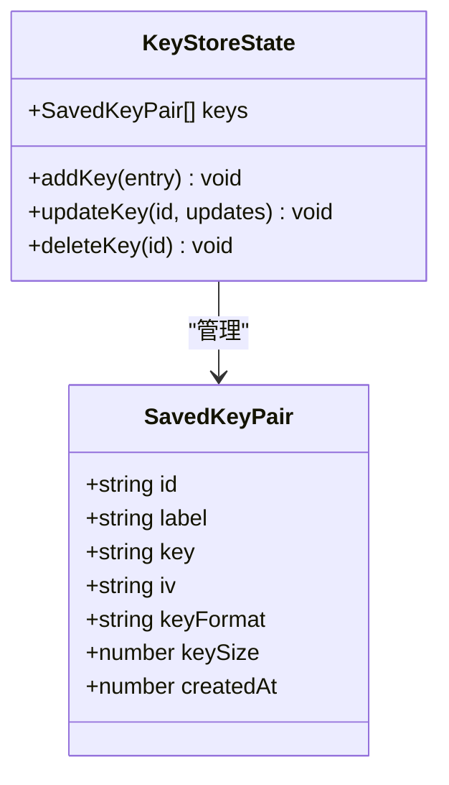
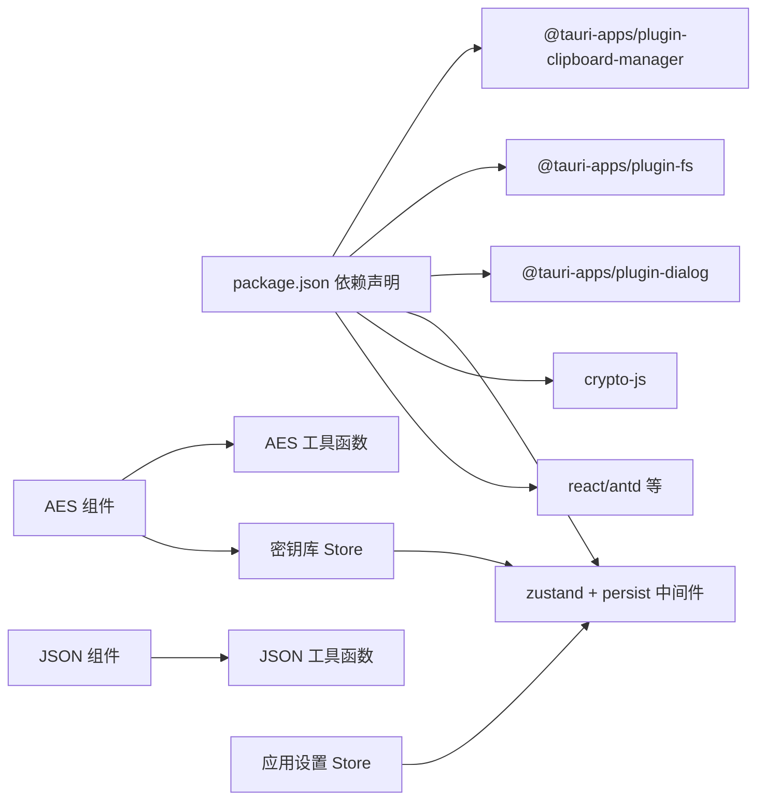

# API参考

<cite>
**本文引用的文件**
- [src/store/useAppStore.ts](file://src/store/useAppStore.ts)
- [src/store/useKeyStore.ts](file://src/store/useKeyStore.ts)
- [src/utils/crypto.ts](file://src/utils/crypto.ts)
- [src/utils/json.ts](file://src/utils/json.ts)
- [src/tools/types.ts](file://src/tools/types.ts)
- [src/tools/registry.ts](file://src/tools/registry.ts)
- [src/tools/json/index.tsx](file://src/tools/json/index.tsx)
- [src/tools/crypto/index.tsx](file://src/tools/crypto/index.tsx)
- [src/tools/json/JsonFormatter/index.tsx](file://src/tools/json/JsonFormatter/index.tsx)
- [src/tools/crypto/AesCrypto/index.tsx](file://src/tools/crypto/AesCrypto/index.tsx)
- [src/tools/crypto/AesCrypto/ConfigPanel.tsx](file://src/tools/crypto/AesCrypto/ConfigPanel.tsx)
- [src/tools/crypto/AesCrypto/KeyPanel.tsx](file://src/tools/crypto/AesCrypto/KeyPanel.tsx)
- [src/tools/crypto/AesCrypto/KeystoreDrawer.tsx](file://src/tools/crypto/AesCrypto/KeystoreDrawer.tsx)
- [package.json](file://package.json)
- [src-tauri/src/main.rs](file://src-tauri/src/main.rs)
- [src-tauri/tauri.conf.json](file://src-tauri/tauri.conf.json)
</cite>

## 目录
1. [简介](#简介)
2. [项目结构](#项目结构)
3. [核心组件](#核心组件)
4. [架构总览](#架构总览)
5. [详细组件分析](#详细组件分析)
6. [依赖关系分析](#依赖关系分析)
7. [性能考虑](#性能考虑)
8. [故障排除指南](#故障排除指南)
9. [结论](#结论)
10. [附录](#附录)

## 简介
本文件为 XKUtil 的全面 API 参考文档，覆盖以下方面：
- 工具接口与分类注册：工具定义、分类聚合与路由路径
- 状态管理 API：应用设置 Store 与密钥库 Store 的接口、状态更新与本地持久化
- 工具函数库 API：JSON 处理与 AES 加密工具函数的接口规范、参数与返回值
- Tauri 插件 API 参考：剪贴板、文件系统与对话框能力的集成方式
- 调用示例、错误处理与性能建议

## 项目结构
XKUtil 采用前端与原生桥接相结合的结构：
- 前端工具与状态管理位于 src 目录，包含工具注册、JSON/AES 工具实现与 Zustand 状态存储
- Tauri 原生侧位于 src-tauri，负责应用入口与打包配置

图表来源
- [src/tools/registry.ts:1-39](file://src/tools/registry.ts#L1-L39)
- [src/tools/types.ts:1-20](file://src/tools/types.ts#L1-L20)
- [src/tools/json/index.tsx:1-27](file://src/tools/json/index.tsx#L1-L27)
- [src/tools/crypto/index.tsx:1-17](file://src/tools/crypto/index.tsx#L1-L17)
- [src/tools/json/JsonFormatter/index.tsx:1-267](file://src/tools/json/JsonFormatter/index.tsx#L1-L267)
- [src/tools/crypto/AesCrypto/index.tsx:1-310](file://src/tools/crypto/AesCrypto/index.tsx#L1-L310)
- [src/store/useAppStore.ts:1-24](file://src/store/useAppStore.ts#L1-L24)
- [src/store/useKeyStore.ts:1-47](file://src/store/useKeyStore.ts#L1-L47)
- [src/utils/json.ts:1-116](file://src/utils/json.ts#L1-L116)
- [src/utils/crypto.ts:1-222](file://src/utils/crypto.ts#L1-L222)
- [src-tauri/src/main.rs:1-6](file://src-tauri/src/main.rs#L1-L6)
- [src-tauri/tauri.conf.json:1-39](file://src-tauri/tauri.conf.json#L1-L39)

章节来源
- [src/tools/registry.ts:1-39](file://src/tools/registry.ts#L1-L39)
- [src/tools/types.ts:1-20](file://src/tools/types.ts#L1-L20)
- [src-tauri/src/main.rs:1-6](file://src-tauri/src/main.rs#L1-L6)
- [src-tauri/tauri.conf.json:1-39](file://src-tauri/tauri.conf.json#L1-L39)

## 核心组件
本节概述工具与状态管理的核心 API。

- 工具注册与分类
  - 工具定义接口：包含 id、name、description、category、icon、path、component、keywords 等字段
  - 分类聚合：根据 category 将工具归类，并提供分类名称映射
  - 工具集合：JSON 工具与加密工具分别导出 ToolDefinition 数组

- 状态管理
  - 应用设置 Store：提供 collapsed、isDark、toggleCollapsed、toggleTheme 等状态与切换方法；使用持久化中间件，键名为固定字符串
  - 密钥库 Store：提供 keys 数组及 addKey、updateKey、deleteKey 方法；使用持久化中间件，键名为固定字符串

章节来源
- [src/tools/types.ts:1-20](file://src/tools/types.ts#L1-L20)
- [src/tools/registry.ts:1-39](file://src/tools/registry.ts#L1-L39)
- [src/tools/json/index.tsx:1-27](file://src/tools/json/index.tsx#L1-L27)
- [src/tools/crypto/index.tsx:1-17](file://src/tools/crypto/index.tsx#L1-L17)
- [src/store/useAppStore.ts:1-24](file://src/store/useAppStore.ts#L1-L24)
- [src/store/useKeyStore.ts:1-47](file://src/store/useKeyStore.ts#L1-L47)

## 架构总览
前端通过工具注册中心统一管理工具分类与路由；各工具组件消费通用工具函数库完成具体功能；状态管理通过 Zustand 提供跨组件共享的状态与持久化。

图表来源
- [src/tools/registry.ts:1-39](file://src/tools/registry.ts#L1-L39)
- [src/utils/json.ts:1-116](file://src/utils/json.ts#L1-L116)
- [src/utils/crypto.ts:1-222](file://src/utils/crypto.ts#L1-L222)
- [src/store/useAppStore.ts:1-24](file://src/store/useAppStore.ts#L1-L24)
- [src/store/useKeyStore.ts:1-47](file://src/store/useKeyStore.ts#L1-L47)

## 详细组件分析

### 工具接口与分类注册
- 工具定义接口
  - 字段：id、name、description、category、icon、path、component、keywords
  - 用途：描述单个工具的能力、图标、路由路径与组件懒加载
- 工具分类注册
  - getToolCategories：按 category 聚合工具，生成分类对象数组
  - getAllTools：返回所有工具定义
  - 分类名称映射：json、encoding、text、network、crypto 等类别名

章节来源
- [src/tools/types.ts:1-20](file://src/tools/types.ts#L1-L20)
- [src/tools/registry.ts:1-39](file://src/tools/registry.ts#L1-L39)
- [src/tools/json/index.tsx:1-27](file://src/tools/json/index.tsx#L1-L27)
- [src/tools/crypto/index.tsx:1-17](file://src/tools/crypto/index.tsx#L1-L17)

### JSON 工具 API
- JSON 解析
  - 函数：parseJson(input)
  - 参数：input（字符串）
  - 返回：成功时返回 { success: true, data: unknown }，失败时返回 { success: false, message: string, position?: { line, column } }
  - 行列定位：当解析异常时，从错误消息中提取位置信息并换算为行列
- JSON 格式化
  - 函数：formatJson(data, indent = 2 | "tab", sortKeys = false)
  - 参数：data（任意 JSON 兼容数据）、indent（缩进空格数或 Tab）、sortKeys（是否按键排序）
  - 返回：格式化后的字符串
- JSON 压缩
  - 函数：compressJson(data)
  - 参数：data（任意 JSON 兼容数据）
  - 返回：去除多余空白的字符串
- JSON 统计
  - 函数：getJsonStats(data)
  - 参数：data（任意 JSON 兼容数据）
  - 返回：{ type, keys, depth, size }，其中 type 为 "Array"/"Null"/"Object"/"其他"，keys 为键总数，depth 为最大嵌套深度，size 为序列化后的字节数
- JSON 树形视图
  - 工具：json-tree（树形可视化）

章节来源
- [src/utils/json.ts:1-116](file://src/utils/json.ts#L1-L116)
- [src/tools/json/index.tsx:1-27](file://src/tools/json/index.tsx#L1-L27)

### AES 加密工具 API
- 配置类型
  - AesMode："ECB" | "CBC" | "CFB" | "OFB" | "CTR"
  - AesPadding："Pkcs7" | "ZeroPadding" | "NoPadding"
  - OutputFormat："Base64" | "Hex"
  - KeyFormat："Hex" | "UTF-8"
  - KeySize：128 | 192 | 256
  - AesConfig：包含 mode、padding、outputFormat、keyFormat、keySize
  - AesResult：{ success: boolean, data?: string, error?: string }
- 加密流程
  - 函数：aesEncrypt(plaintext, key, iv, config)
  - 参数校验：key 长度需符合 keySize 与 keyFormat；非 ECB 模式下 IV 长度需符合 keyFormat
  - 输出格式：根据 outputFormat 返回 Hex 或 Base64
  - 异常：返回 { success: false, error } 包含明确错误信息
- 解密流程
  - 函数：aesDecrypt(ciphertext, key, iv, config)
  - 参数校验：同加密
  - 输入格式：根据 outputFormat 解析密文
  - 结果校验：若解密结果为空或包含替换字符，判定失败
- 密钥与 IV 生成
  - generateRandomKey(size, format)：生成指定长度的随机密钥
  - generateRandomIV(format)：生成 16 字节随机 IV
- 密钥有效性判断
  - isValidDecryption(output)：基于可打印字符比例与替换字符检测，判断解密结果是否有效
- 暴力破解
  - 遍历密钥库中的密钥对，尝试解密并使用 isValidDecryption 判定成功

图表来源
- [src/utils/crypto.ts:59-105](file://src/utils/crypto.ts#L59-L105)

章节来源
- [src/utils/crypto.ts:1-222](file://src/utils/crypto.ts#L1-L222)
- [src/tools/crypto/AesCrypto/index.tsx:1-310](file://src/tools/crypto/AesCrypto/index.tsx#L1-L310)
- [src/tools/crypto/AesCrypto/ConfigPanel.tsx:1-95](file://src/tools/crypto/AesCrypto/ConfigPanel.tsx#L1-L95)
- [src/tools/crypto/AesCrypto/KeyPanel.tsx:1-114](file://src/tools/crypto/AesCrypto/KeyPanel.tsx#L1-L114)
- [src/tools/crypto/AesCrypto/KeystoreDrawer.tsx:1-185](file://src/tools/crypto/AesCrypto/KeystoreDrawer.tsx#L1-L185)

### 状态管理 API

#### 应用设置 Store（useAppStore）
- 状态字段
  - collapsed: boolean（侧边栏折叠状态）
  - isDark: boolean（主题状态）
- 方法
  - toggleCollapsed(): 切换 collapsed
  - toggleTheme(): 切换 isDark
- 持久化
  - 使用持久化中间件，存储键名为固定字符串

图表来源
- [src/store/useAppStore.ts:4-18](file://src/store/useAppStore.ts#L4-L18)

章节来源
- [src/store/useAppStore.ts:1-24](file://src/store/useAppStore.ts#L1-L24)

#### 密钥库 Store（useKeyStore）
- 状态字段
  - keys: SavedKeyPair[]（密钥对数组）
- 方法
  - addKey(entry): 新增密钥对（自动生成 id 与 createdAt）
  - updateKey(id, updates): 更新指定密钥对
  - deleteKey(id): 删除指定密钥对
- 数据模型
  - SavedKeyPair：包含 id、label、key、iv、keyFormat、keySize、createdAt
- 持久化
  - 使用持久化中间件，存储键名为固定字符串

图表来源
- [src/store/useKeyStore.ts:5-20](file://src/store/useKeyStore.ts#L5-L20)

章节来源
- [src/store/useKeyStore.ts:1-47](file://src/store/useKeyStore.ts#L1-L47)

### Tauri 插件 API 参考
- 剪贴板管理
  - 依赖：@tauri-apps/plugin-clipboard-manager
  - 用途：在工具组件中进行复制/粘贴操作
- 文件系统
  - 依赖：@tauri-apps/plugin-fs
  - 用途：文件读写与对话框交互（结合对话框插件）
- 对话框
  - 依赖：@tauri-apps/plugin-dialog
  - 用途：打开/保存文件等用户交互
- 应用入口与配置
  - 入口：src-tauri/src/main.rs 调用库运行函数
  - 配置：src-tauri/tauri.conf.json 定义窗口尺寸、安全策略与打包图标等

章节来源
- [package.json:12-25](file://package.json#L12-L25)
- [src-tauri/src/main.rs:1-6](file://src-tauri/src/main.rs#L1-L6)
- [src-tauri/tauri.conf.json:1-39](file://src-tauri/tauri.conf.json#L1-L39)

## 依赖关系分析

图表来源
- [package.json:12-25](file://package.json#L12-L25)
- [src/tools/crypto/AesCrypto/index.tsx:1-310](file://src/tools/crypto/AesCrypto/index.tsx#L1-L310)
- [src/tools/json/JsonFormatter/index.tsx:1-267](file://src/tools/json/JsonFormatter/index.tsx#L1-L267)
- [src/utils/crypto.ts:1-222](file://src/utils/crypto.ts#L1-L222)
- [src/utils/json.ts:1-116](file://src/utils/json.ts#L1-L116)
- [src/store/useKeyStore.ts:1-47](file://src/store/useKeyStore.ts#L1-L47)
- [src/store/useAppStore.ts:1-24](file://src/store/useAppStore.ts#L1-L24)

章节来源
- [package.json:12-25](file://package.json#L12-L25)
- [src/store/useKeyStore.ts:1-47](file://src/store/useKeyStore.ts#L1-L47)
- [src/store/useAppStore.ts:1-24](file://src/store/useAppStore.ts#L1-L24)
- [src/utils/crypto.ts:1-222](file://src/utils/crypto.ts#L1-L222)
- [src/utils/json.ts:1-116](file://src/utils/json.ts#L1-L116)

## 性能考虑
- JSON 处理
  - 大对象格式化与统计会递归遍历，建议对超大 JSON 进行分块或延迟计算
  - sortKeys=true 会额外进行键排序，仅在需要稳定输出时启用
- AES 加密
  - 非 ECB 模式需要校验 IV 长度，避免无效 IV 带来的重复开销
  - 输出格式选择 Base64 与 Hex 的性能差异较小，按需求选择
- 状态持久化
  - Store 使用持久化中间件，注意键名与存储大小，避免频繁写入导致性能抖动
- 组件渲染
  - 使用 useCallback 缓解事件回调重渲染
  - 使用懒加载组件减少首屏体积

## 故障排除指南
- JSON 解析失败
  - 现象：parseJson 返回错误并携带位置信息
  - 处理：根据行列定位修正语法错误
- AES 密钥/IV 长度错误
  - 现象：aesEncrypt/aesDecrypt 返回错误，提示期望长度与实际长度
  - 处理：检查 keyFormat 与 keySize，确保密钥与 IV 符合要求
- 解密结果为空或包含替换字符
  - 现象：isValidDecryption 返回 false
  - 处理：确认密钥、模式、填充与输出格式一致
- 剪贴板读写失败
  - 现象：复制/粘贴操作抛错
  - 处理：检查权限与运行环境（开发/打包），确保插件已正确引入

章节来源
- [src/utils/json.ts:14-38](file://src/utils/json.ts#L14-L38)
- [src/utils/crypto.ts:59-105](file://src/utils/crypto.ts#L59-L105)
- [src/utils/crypto.ts:107-162](file://src/utils/crypto.ts#L107-L162)
- [src/utils/crypto.ts:202-221](file://src/utils/crypto.ts#L202-L221)
- [src/tools/json/JsonFormatter/index.tsx:132-156](file://src/tools/json/JsonFormatter/index.tsx#L132-L156)
- [src/tools/crypto/AesCrypto/index.tsx:114-122](file://src/tools/crypto/AesCrypto/index.tsx#L114-L122)

## 结论
XKUtil 提供了清晰的工具注册体系、完善的 JSON/AES 工具函数与状态管理方案，并通过 Tauri 插件扩展了系统级能力。遵循本文档的接口规范与最佳实践，可在保证安全性与易用性的前提下高效使用各项工具。

## 附录

### 工具调用示例（步骤说明）
- JSON 格式化
  - 步骤：输入原始 JSON → 调用 parseJson → 成功则 formatJson → 显示结果
  - 参考路径：[src/tools/json/JsonFormatter/index.tsx:53-78](file://src/tools/json/JsonFormatter/index.tsx#L53-L78)
- AES 加密
  - 步骤：设置配置 → 输入明文/密文 → 调用 aesEncrypt/aesDecrypt → 校验结果
  - 参考路径：[src/tools/crypto/AesCrypto/index.tsx:55-85](file://src/tools/crypto/AesCrypto/index.tsx#L55-L85)
- 暴力破解
  - 步骤：准备密钥库 → 输入密文 → 遍历密钥对解密 → 使用 isValidDecryption 判定
  - 参考路径：[src/tools/crypto/AesCrypto/index.tsx:87-112](file://src/tools/crypto/AesCrypto/index.tsx#L87-L112)
- 剪贴板操作
  - 步骤：点击复制/粘贴按钮 → 调用浏览器剪贴板 API → 提示成功/失败
  - 参考路径：[src/tools/json/JsonFormatter/index.tsx:132-140](file://src/tools/json/JsonFormatter/index.tsx#L132-L140), [src/tools/crypto/AesCrypto/index.tsx:114-122](file://src/tools/crypto/AesCrypto/index.tsx#L114-L122)