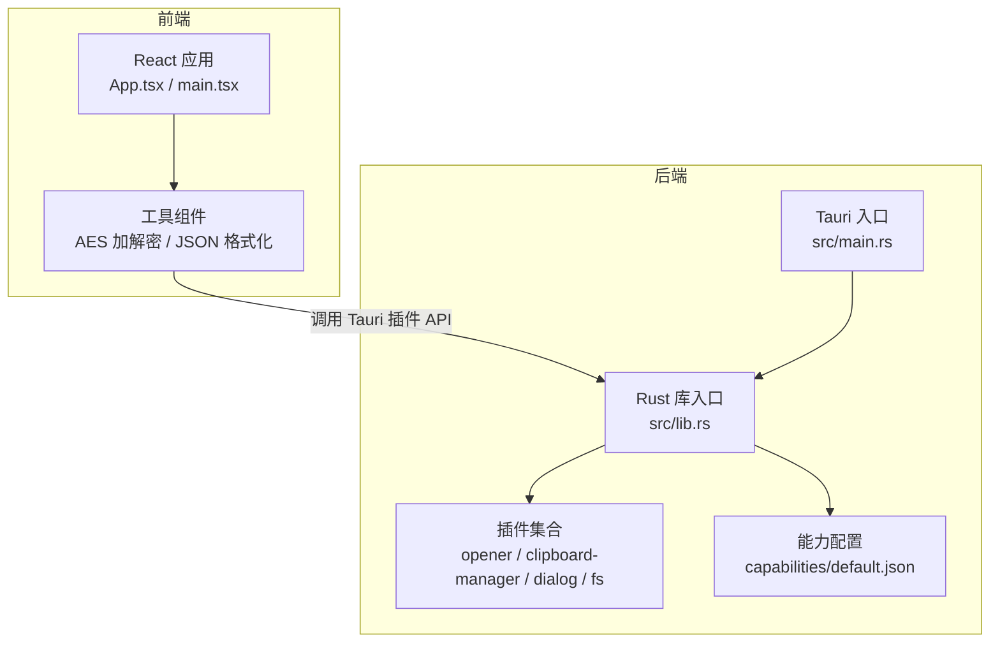
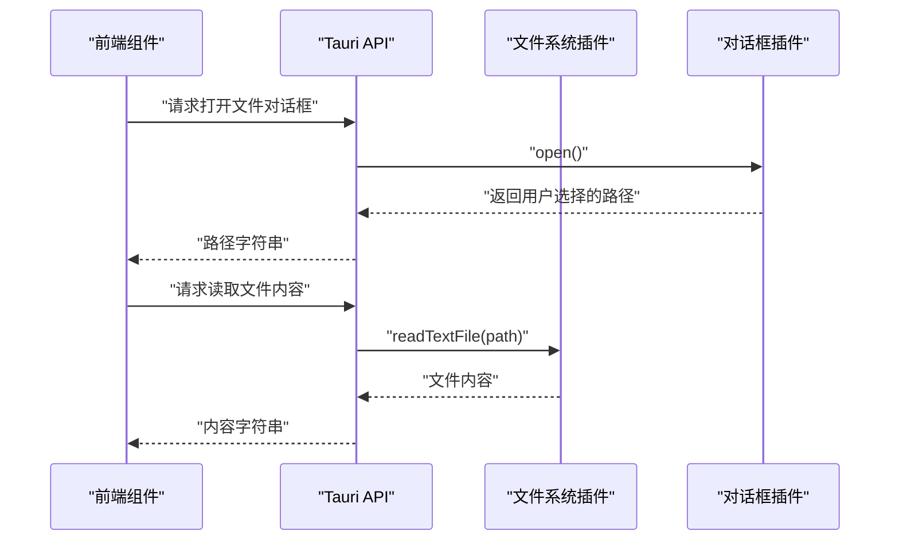
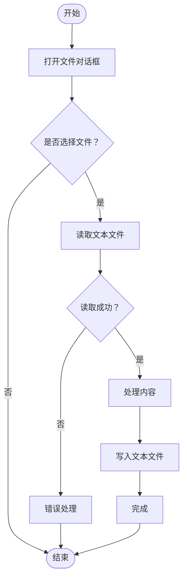
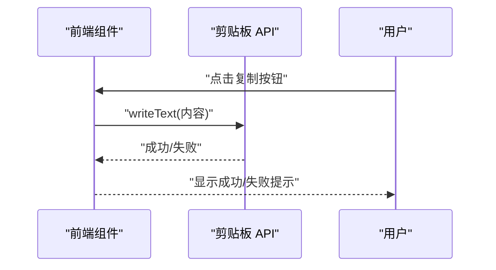
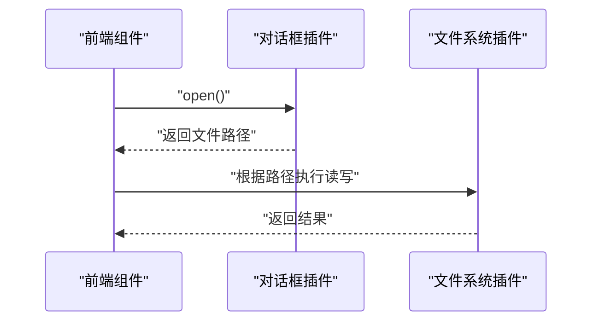
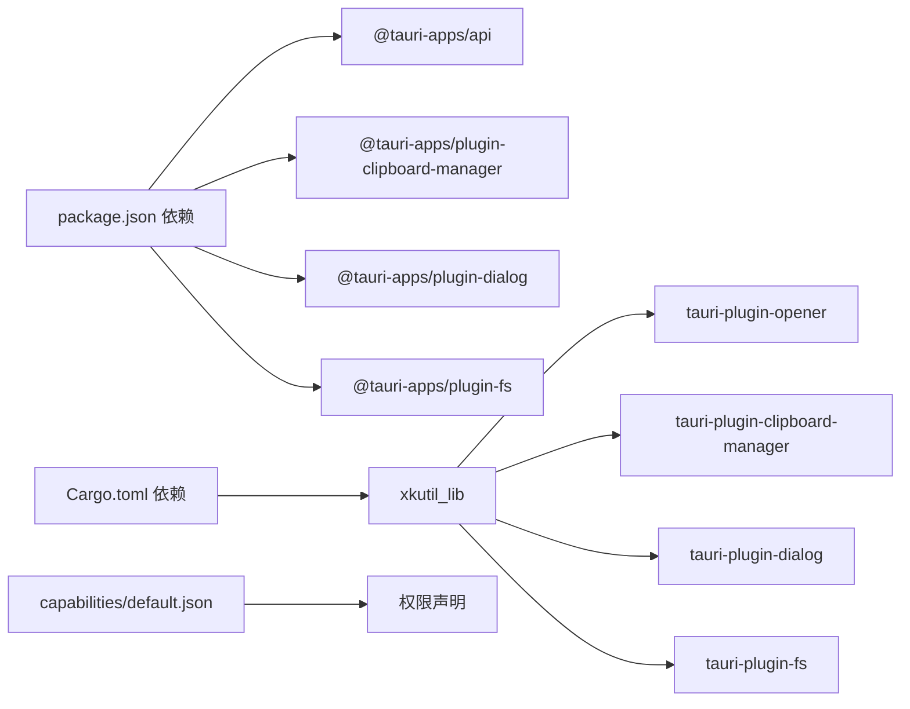

# Tauri插件API

<cite>
**本文档引用的文件**
- [src-tauri/src/lib.rs](file://src-tauri/src/lib.rs)
- [src-tauri/src/main.rs](file://src-tauri/src/main.rs)
- [src-tauri/tauri.conf.json](file://src-tauri/tauri.conf.json)
- [src-tauri/Cargo.toml](file://src-tauri/Cargo.toml)
- [src-tauri/capabilities/default.json](file://src-tauri/capabilities/default.json)
- [package.json](file://package.json)
- [src/tools/crypto/AesCrypto/index.tsx](file://src/tools/crypto/AesCrypto/index.tsx)
- [src/tools/json/JsonFormatter/index.tsx](file://src/tools/json/JsonFormatter/index.tsx)
</cite>

## 目录
1. [简介](#简介)
2. [项目结构](#项目结构)
3. [核心组件](#核心组件)
4. [架构总览](#架构总览)
5. [详细组件分析](#详细组件分析)
6. [依赖关系分析](#依赖关系分析)
7. [性能考虑](#性能考虑)
8. [故障排除指南](#故障排除指南)
9. [结论](#结论)
10. [附录](#附录)

## 简介
本文件为 XKUtil 的 Tauri 插件系统提供完整的 API 参考文档，覆盖以下方面：
- 文件系统 API：文件读写、目录操作与权限管理
- 剪贴板管理 API：文本复制粘贴、格式处理与安全考虑
- 对话框 API：文件选择、消息提示与确认对话框
- 原生功能集成：系统托盘、窗口管理与通知
- 跨平台兼容性与安全最佳实践

该应用通过 Tauri v2 集成多个官方插件，并在能力配置中精确授予所需权限，确保最小权限原则与安全运行。

## 项目结构
XKUtil 采用前端（React + Ant Design）与后端（Rust + Tauri）分离的架构。前端负责用户界面与交互逻辑；后端通过 Tauri 插件提供系统级能力。

图表来源
- [src-tauri/src/lib.rs:1-11](file://src-tauri/src/lib.rs#L1-L11)
- [src-tauri/src/main.rs:1-6](file://src-tauri/src/main.rs#L1-L6)
- [src-tauri/capabilities/default.json:1-16](file://src-tauri/capabilities/default.json#L1-L16)

章节来源
- [src-tauri/src/lib.rs:1-11](file://src-tauri/src/lib.rs#L1-L11)
- [src-tauri/src/main.rs:1-6](file://src-tauri/src/main.rs#L1-L6)
- [src-tauri/tauri.conf.json:1-39](file://src-tauri/tauri.conf.json#L1-L39)
- [src-tauri/Cargo.toml:1-23](file://src-tauri/Cargo.toml#L1-L23)
- [src-tauri/capabilities/default.json:1-16](file://src-tauri/capabilities/default.json#L1-L16)

## 核心组件
- 插件初始化与运行
  - 在库入口中注册并启动插件：opener、clipboard-manager、dialog、fs
  - 通过生成的上下文运行应用
- 能力与权限
  - 默认能力授予：读写剪贴板、打开/保存对话框、读写文本文件
  - 严格遵循最小权限原则，避免授予不必要的系统权限
- 前端依赖
  - 使用 @tauri-apps/api 与各插件 JS 绑定进行调用
  - 通过 Ant Design 提供 UI 与交互反馈

章节来源
- [src-tauri/src/lib.rs:1-11](file://src-tauri/src/lib.rs#L1-L11)
- [src-tauri/capabilities/default.json:1-16](file://src-tauri/capabilities/default.json#L1-L16)
- [package.json:12-25](file://package.json#L12-L25)

## 架构总览
下图展示前端调用后端插件的典型流程，以文件系统与对话框为例：

图表来源
- [src-tauri/src/lib.rs:1-11](file://src-tauri/src/lib.rs#L1-L11)
- [src-tauri/capabilities/default.json:10-13](file://src-tauri/capabilities/default.json#L10-L13)

## 详细组件分析

### 文件系统 API
- 功能范围
  - 文本文件读取与写入
  - 目录浏览与文件选择（通过对话框）
  - 权限控制：仅允许读写文本文件
- 典型调用流程
  - 打开文件对话框选择目标文件
  - 读取文件内容并进行处理
  - 将处理结果写回文件
- 安全与权限
  - 能力配置中明确授予“读取/写入文本文件”权限
  - 未授予二进制文件访问权限，降低风险面

图表来源
- [src-tauri/capabilities/default.json:12-13](file://src-tauri/capabilities/default.json#L12-L13)

章节来源
- [src-tauri/src/lib.rs:7](file://src-tauri/src/lib.rs#L7)
- [src-tauri/capabilities/default.json:12-13](file://src-tauri/capabilities/default.json#L12-L13)

### 剪贴板管理 API
- 功能范围
  - 读取与写入文本内容
  - 支持复制/粘贴操作（前端使用 Web Clipboard API）
- 使用场景
  - AES 工具：将加密/解密结果复制到剪贴板
  - JSON 工具：将格式化/压缩后的 JSON 复制到剪贴板
- 安全考虑
  - 仅读写文本内容，避免敏感二进制数据
  - 建议在用户主动触发时执行复制/粘贴
  - 对异常进行捕获并给出用户反馈

图表来源
- [src/tools/crypto/AesCrypto/index.tsx:114-122](file://src/tools/crypto/AesCrypto/index.tsx#L114-L122)
- [src/tools/json/JsonFormatter/index.tsx:132-140](file://src/tools/json/JsonFormatter/index.tsx#L132-L140)

章节来源
- [src-tauri/src/lib.rs:5](file://src-tauri/src/lib.rs#L5)
- [src-tauri/capabilities/default.json:8-9](file://src-tauri/capabilities/default.json#L8-L9)
- [src/tools/crypto/AesCrypto/index.tsx:114-122](file://src/tools/crypto/AesCrypto/index.tsx#L114-L122)
- [src/tools/json/JsonFormatter/index.tsx:132-140](file://src/tools/json/JsonFormatter/index.tsx#L132-L140)

### 对话框 API
- 功能范围
  - 打开文件对话框（选择文件）
  - 保存文件对话框（另存为）
  - 消息提示与确认对话框
- 能力授权
  - 明确授予“打开/保存”权限
- 使用建议
  - 在用户交互事件中触发对话框
  - 对返回路径进行校验后再进行文件操作

图表来源
- [src-tauri/capabilities/default.json:10-11](file://src-tauri/capabilities/default.json#L10-L11)

章节来源
- [src-tauri/src/lib.rs:6](file://src-tauri/src/lib.rs#L6)
- [src-tauri/capabilities/default.json:10-11](file://src-tauri/capabilities/default.json#L10-L11)

### 原生功能集成
- 系统托盘
  - 当前未启用系统托盘功能
- 窗口管理
  - 在配置中定义主窗口属性（标题、尺寸、最小尺寸、居中）
- 通知
  - 当前未集成系统通知功能
- 建议
  - 如需托盘与通知，可在后续版本中按需添加能力与权限

章节来源
- [src-tauri/tauri.conf.json:12-22](file://src-tauri/tauri.conf.json#L12-L22)

## 依赖关系分析
- 前端依赖
  - @tauri-apps/api：Tauri 核心 API
  - 各插件 JS 绑定：@tauri-apps/plugin-clipboard-manager、@tauri-apps/plugin-dialog、@tauri-apps/plugin-fs
- 后端依赖
  - tauri-plugin-opener、tauri-plugin-clipboard-manager、tauri-plugin-dialog、tauri-plugin-fs
- 能力配置
  - 通过 capabilities/default.json 明确授予权限，避免过度授权

图表来源
- [package.json:12-25](file://package.json#L12-L25)
- [src-tauri/Cargo.toml:15-23](file://src-tauri/Cargo.toml#L15-L23)
- [src-tauri/capabilities/default.json:5-14](file://src-tauri/capabilities/default.json#L5-L14)

章节来源
- [package.json:12-25](file://package.json#L12-L25)
- [src-tauri/Cargo.toml:15-23](file://src-tauri/Cargo.toml#L15-L23)
- [src-tauri/capabilities/default.json:5-14](file://src-tauri/capabilities/default.json#L5-L14)

## 性能考虑
- 最小权限原则：仅授予必要权限，减少潜在攻击面
- 异步操作：文件读写与对话框调用应异步处理，避免阻塞 UI
- 缓存与复用：对频繁使用的文件路径与配置进行缓存
- 错误快速失败：对无效输入与异常路径及时中断并提示

## 故障排除指南
- 无权限错误
  - 现象：调用文件/对话框/剪贴板 API 抛出权限异常
  - 排查：检查 capabilities/default.json 中权限是否授予
  - 处理：补充相应权限或调整调用逻辑
- 对话框未响应
  - 现象：打开对话框后无返回
  - 排查：确认调用时机（需在用户交互事件中触发）
  - 处理：在按钮点击等事件中调用
- 剪贴板读写失败
  - 现象：复制/粘贴抛出异常
  - 排查：浏览器/系统剪贴板权限与安全策略
  - 处理：捕获异常并提示用户授权或重试

章节来源
- [src-tauri/capabilities/default.json:8-13](file://src-tauri/capabilities/default.json#L8-L13)
- [src/tools/crypto/AesCrypto/index.tsx:114-122](file://src/tools/crypto/AesCrypto/index.tsx#L114-L122)
- [src/tools/json/JsonFormatter/index.tsx:132-140](file://src/tools/json/JsonFormatter/index.tsx#L132-L140)

## 结论
XKUtil 的 Tauri 插件系统通过明确的能力配置与严格的权限控制，实现了文件系统、剪贴板与对话框等核心功能的安全与稳定运行。建议在后续迭代中按需扩展托盘与通知能力，并持续遵循最小权限原则与安全最佳实践。

## 附录
- 关键实现位置
  - 插件初始化：[src-tauri/src/lib.rs:1-11](file://src-tauri/src/lib.rs#L1-L11)
  - 应用入口：[src-tauri/src/main.rs:1-6](file://src-tauri/src/main.rs#L1-L6)
  - 能力配置：[src-tauri/capabilities/default.json:1-16](file://src-tauri/capabilities/default.json#L1-L16)
  - 前端依赖：[package.json:12-25](file://package.json#L12-L25)
  - AES 工具中的剪贴板使用：[src/tools/crypto/AesCrypto/index.tsx:114-122](file://src/tools/crypto/AesCrypto/index.tsx#L114-L122)
  - JSON 工具中的剪贴板使用：[src/tools/json/JsonFormatter/index.tsx:132-140](file://src/tools/json/JsonFormatter/index.tsx#L132-L140)