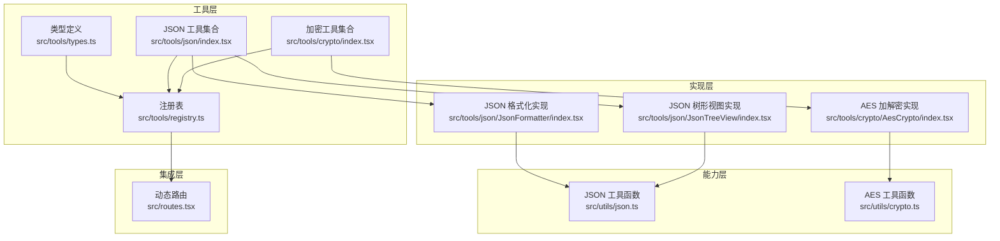
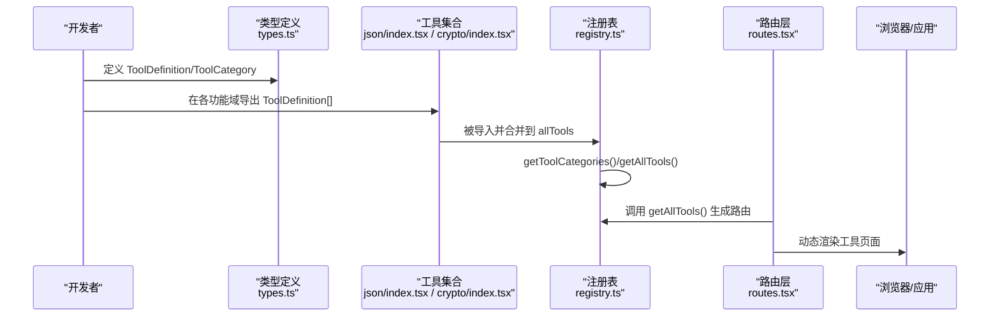
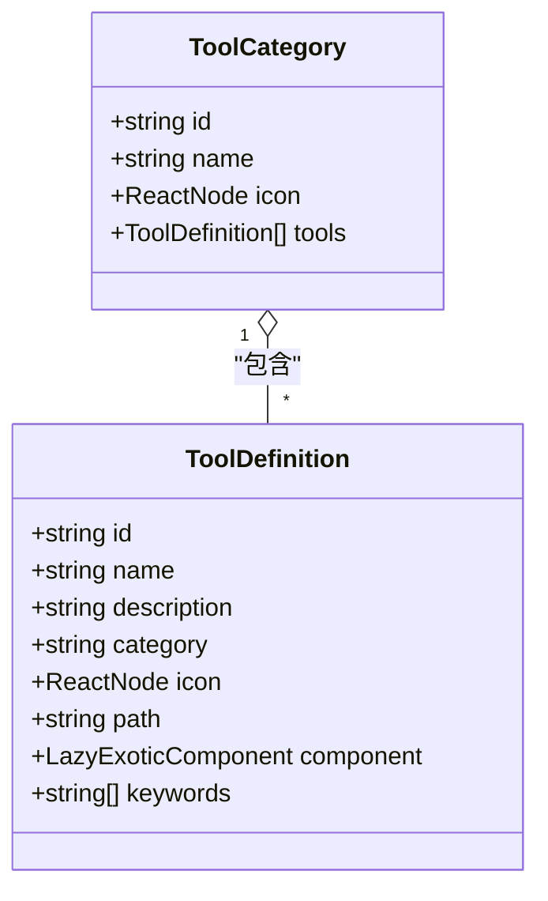
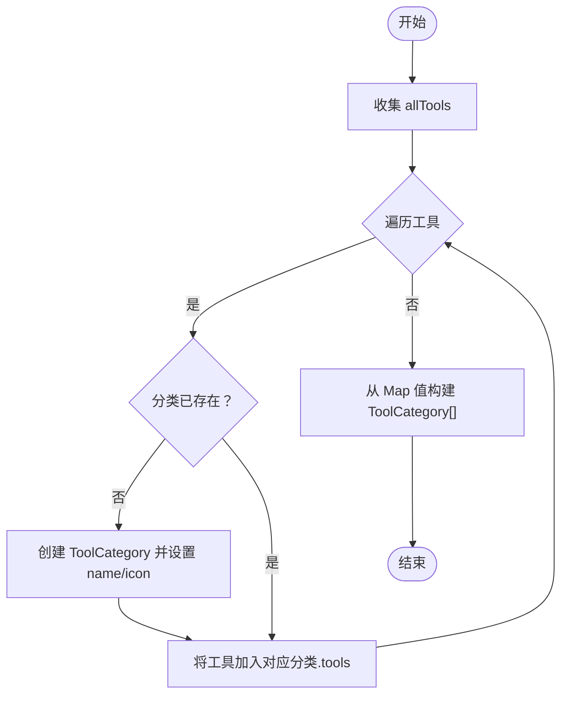
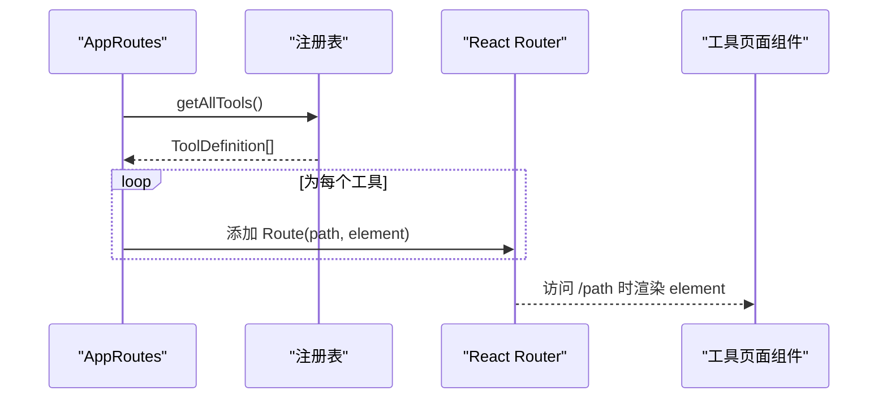
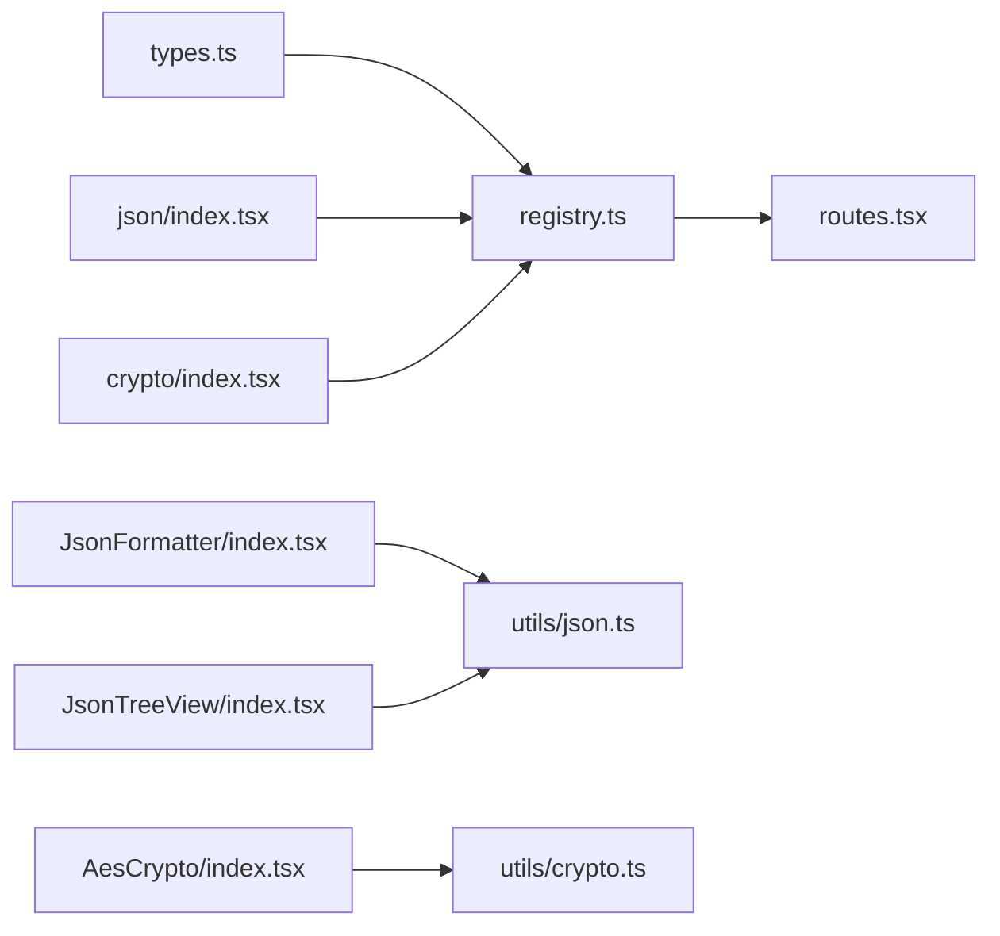

# 工具API

<cite>
**本文引用的文件**
- [src/tools/types.ts](file://src/tools/types.ts)
- [src/tools/registry.ts](file://src/tools/registry.ts)
- [src/tools/json/index.tsx](file://src/tools/json/index.tsx)
- [src/tools/crypto/index.tsx](file://src/tools/crypto/index.tsx)
- [src/tools/json/JsonFormatter/index.tsx](file://src/tools/json/JsonFormatter/index.tsx)
- [src/tools/json/JsonTreeView/index.tsx](file://src/tools/json/JsonTreeView/index.tsx)
- [src/tools/crypto/AesCrypto/index.tsx](file://src/tools/crypto/AesCrypto/index.tsx)
- [src/utils/crypto.ts](file://src/utils/crypto.ts)
- [src/utils/json.ts](file://src/utils/json.ts)
- [src/routes.tsx](file://src/routes.tsx)
- [package.json](file://package.json)
</cite>

## 目录
1. [简介](#简介)
2. [项目结构](#项目结构)
3. [核心组件](#核心组件)
4. [架构总览](#架构总览)
5. [详细组件分析](#详细组件分析)
6. [依赖关系分析](#依赖关系分析)
7. [性能考量](#性能考量)
8. [故障排查指南](#故障排查指南)
9. [结论](#结论)
10. [附录：工具开发指南与最佳实践](#附录工具开发指南与最佳实践)

## 简介
本文件为 XKUtil 工具系统提供的工具API文档，聚焦于工具接口定义与工具注册表API，帮助开发者理解工具模型、分类体系、注册与路由集成方式，并提供自定义工具开发的步骤与最佳实践。文档内容基于仓库中实际实现进行归纳总结，避免臆造信息，确保可操作性与一致性。

## 项目结构
XKUtil 的工具系统位于 src/tools 目录下，采用“按功能域分组 + 注册表聚合”的组织方式：
- 类型定义：src/tools/types.ts 定义工具与分类的数据模型。
- 工具注册表：src/tools/registry.ts 聚合各工具模块，提供分类与全量工具查询。
- 工具实现：src/tools/json 与 src/tools/crypto 下分别包含具体工具的定义与实现。
- 路由集成：src/routes.tsx 使用注册表生成动态路由，实现工具页面的自动挂载。
- 工具能力：src/utils 提供工具所需的底层能力（如 JSON 解析/格式化、AES 加解密）。

图表来源
- [src/tools/types.ts:1-20](file://src/tools/types.ts#L1-L20)
- [src/tools/registry.ts:1-39](file://src/tools/registry.ts#L1-L39)
- [src/tools/json/index.tsx:1-27](file://src/tools/json/index.tsx#L1-L27)
- [src/tools/crypto/index.tsx:1-17](file://src/tools/crypto/index.tsx#L1-L17)
- [src/tools/json/JsonFormatter/index.tsx:1-267](file://src/tools/json/JsonFormatter/index.tsx#L1-L267)
- [src/tools/json/JsonTreeView/index.tsx:1-248](file://src/tools/json/JsonTreeView/index.tsx#L1-L248)
- [src/tools/crypto/AesCrypto/index.tsx:1-310](file://src/tools/crypto/AesCrypto/index.tsx#L1-L310)
- [src/utils/json.ts:1-116](file://src/utils/json.ts#L1-L116)
- [src/utils/crypto.ts:1-222](file://src/utils/crypto.ts#L1-L222)
- [src/routes.tsx:1-28](file://src/routes.tsx#L1-L28)

章节来源
- [src/tools/types.ts:1-20](file://src/tools/types.ts#L1-L20)
- [src/tools/registry.ts:1-39](file://src/tools/registry.ts#L1-L39)
- [src/routes.tsx:1-28](file://src/routes.tsx#L1-L28)

## 核心组件
本节聚焦工具接口定义与注册表API，明确字段语义、返回结构与使用方式。

- 工具接口定义 ToolDefinition
  - 必需字段
    - id: 工具唯一标识符，字符串，用于路由与状态管理。
    - name: 工具名称，字符串，用于UI展示。
    - description: 工具描述，字符串，用于工具卡片/列表说明。
    - category: 所属分类ID，字符串，决定工具归类与导航。
    - icon: ReactNode，Ant Design 图标组件，用于工具入口图标。
    - path: 路由路径，字符串，形如 "/json/formatter"。
    - component: React 组件（懒加载），通过 lazy 引入。
  - 可选字段
    - keywords: 字符串数组，用于搜索与过滤。

- 工具分类接口定义 ToolCategory
  - 必需字段
    - id: 分类ID，通常与工具 category 对应。
    - name: 分类名称，字符串，用于UI展示。
    - icon: ReactNode，Ant Design 图标组件，用于分类入口图标。
    - tools: ToolDefinition 数组，该分类下的所有工具。

- 注册表API
  - getToolCategories(): 返回 ToolCategory[]，根据工具的 category 进行分组，生成分类列表；分类名通过内部映射转换为中文名称。
  - getAllTools(): 返回 ToolDefinition[]，返回所有已注册工具的扁平列表。

- 分类ID映射与工具分组机制
  - 分类ID映射：注册表内部维护 categoryId -> 中文名称的映射，未命中时回退为原始ID。
  - 工具分组：遍历 allTools，按 category 构建 Map，首次出现时创建 ToolCategory，随后将工具追加到对应分类的 tools 列表中。

- 路由集成
  - 动态路由：AppRoutes 通过 getAllTools() 获取工具列表，为每个工具生成对应的 Route，实现按工具定义自动挂载页面。

章节来源
- [src/tools/types.ts:3-12](file://src/tools/types.ts#L3-L12)
- [src/tools/types.ts:14-19](file://src/tools/types.ts#L14-L19)
- [src/tools/registry.ts:7-27](file://src/tools/registry.ts#L7-L27)
- [src/tools/registry.ts:29-38](file://src/tools/registry.ts#L29-L38)
- [src/routes.tsx:6-27](file://src/routes.tsx#L6-L27)

## 架构总览
工具系统采用“声明式定义 + 注册表聚合 + 动态路由”的架构：
- 工具定义：在各功能域目录下导出 ToolDefinition[]。
- 注册表：统一收集工具，按分类构建 ToolCategory 列表。
- 路由层：读取注册表，动态生成路由，实现工具页面的自动挂载。
- 能力层：工具实现依赖 utils 层的解析/加密等能力。

图表来源
- [src/tools/types.ts:1-20](file://src/tools/types.ts#L1-L20)
- [src/tools/json/index.tsx:1-27](file://src/tools/json/index.tsx#L1-L27)
- [src/tools/crypto/index.tsx:1-17](file://src/tools/crypto/index.tsx#L1-L17)
- [src/tools/registry.ts:1-39](file://src/tools/registry.ts#L1-L39)
- [src/routes.tsx:1-28](file://src/routes.tsx#L1-L28)

## 详细组件分析

### 工具接口定义与数据模型
- ToolDefinition 字段语义
  - id: 唯一标识，用于路由与状态管理，建议遵循域名反写或功能域前缀。
  - name/description: UI 展示与可访问性友好。
  - category: 决定分类归属，需与注册表映射一致。
  - icon: 使用 Ant Design 图标组件，保持风格一致。
  - path: 形如 "/功能域/子路径"，与路由约定一致。
  - component: 使用 React.lazy 按需加载，提升首屏性能。
  - keywords: 便于搜索与过滤，建议覆盖核心关键词。

- ToolCategory 字段语义
  - id/name/icon: 与工具保持一致的视觉与语义风格。
  - tools: 该分类下的工具清单，由注册表自动填充。

图表来源
- [src/tools/types.ts:3-12](file://src/tools/types.ts#L3-L12)
- [src/tools/types.ts:14-19](file://src/tools/types.ts#L14-L19)

章节来源
- [src/tools/types.ts:1-20](file://src/tools/types.ts#L1-L20)

### 工具注册表API与分类系统
- getToolCategories()
  - 参数：无
  - 返回：ToolCategory[]，按 category 分组后的分类列表
  - 行为：遍历 allTools，首次遇到某分类时创建 ToolCategory，后续将工具加入该分类的 tools 列表；分类名通过映射转换为中文名称。
  - 时间复杂度：O(n)，n 为工具总数。
  - 空间复杂度：O(n)。

- getAllTools()
  - 参数：无
  - 返回：ToolDefinition[]，所有工具的扁平列表
  - 行为：直接返回 allTools。
  - 时间复杂度：O(n)。

- 分类ID映射
  - 内置映射：json、encoding、text、network、crypto 映射为中文分类名；未命中则回退为原始ID。
  - 作用：保证 UI 展示的本地化与一致性。

图表来源
- [src/tools/registry.ts:7-27](file://src/tools/registry.ts#L7-L27)
- [src/tools/registry.ts:29-38](file://src/tools/registry.ts#L29-L38)

章节来源
- [src/tools/registry.ts:1-39](file://src/tools/registry.ts#L1-L39)

### 路由集成与动态页面挂载
- AppRoutes 通过 getAllTools() 获取工具列表，为每个工具生成 Route，实现按工具定义自动挂载页面。
- 优点：新增工具无需手动修改路由配置，降低维护成本。
- 注意：确保工具的 path 与组件懒加载路径一致，避免运行时错误。

图表来源
- [src/routes.tsx:6-27](file://src/routes.tsx#L6-L27)
- [src/tools/registry.ts:25-27](file://src/tools/registry.ts#L25-L27)

章节来源
- [src/routes.tsx:1-28](file://src/routes.tsx#L1-L28)
- [src/tools/registry.ts:25-27](file://src/tools/registry.ts#L25-L27)

### 工具实现示例与能力调用

#### JSON 工具
- JSON 格式化
  - 关键能力：parseJson、formatJson、compressJson、getJsonStats。
  - 错误处理：解析失败时返回带行列位置的错误信息，便于用户定位问题。
  - UI 交互：支持美化、压缩、验证、复制、清空、粘贴等常用操作。

- JSON 树形视图
  - 关键能力：parseJson、递归构建树节点、复制路径。
  - 错误处理：解析失败时显示错误提示。
  - UI 交互：支持全部展开/折叠、复制节点路径、自动展开根节点。

章节来源
- [src/tools/json/JsonFormatter/index.tsx:1-267](file://src/tools/json/JsonFormatter/index.tsx#L1-L267)
- [src/tools/json/JsonTreeView/index.tsx:1-248](file://src/tools/json/JsonTreeView/index.tsx#L1-L248)
- [src/utils/json.ts:14-116](file://src/utils/json.ts#L14-L116)

#### 加密工具
- AES 加解密
  - 关键能力：aesEncrypt、aesDecrypt、generateRandomKey、generateRandomIV、isValidDecryption。
  - 错误处理：密钥/IV 长度校验、解密失败提示、暴力破解匹配提示。
  - UI 交互：配置面板（模式、填充、输出格式、密钥格式、密钥长度）、密钥面板（密钥/IV 输入、保存/加载）、操作按钮（加密、解密、暴力破解、复制、清空）。

章节来源
- [src/tools/crypto/AesCrypto/index.tsx:1-310](file://src/tools/crypto/AesCrypto/index.tsx#L1-L310)
- [src/utils/crypto.ts:59-162](file://src/utils/crypto.ts#L59-L162)

## 依赖关系分析
- 工具定义依赖类型定义：ToolDefinition/ToolCategory 来源于 types.ts。
- 注册表依赖工具集合：从 json/index.tsx 与 crypto/index.tsx 导入工具定义。
- 路由层依赖注册表：通过 getAllTools() 生成动态路由。
- 工具实现依赖能力层：JSON 工具依赖 utils/json.ts，加密工具依赖 utils/crypto.ts。
- 第三方依赖：React、Ant Design、crypto-js、@tauri-apps 等。

图表来源
- [src/tools/types.ts:1-20](file://src/tools/types.ts#L1-L20)
- [src/tools/registry.ts:1-39](file://src/tools/registry.ts#L1-L39)
- [src/tools/json/index.tsx:1-27](file://src/tools/json/index.tsx#L1-L27)
- [src/tools/crypto/index.tsx:1-17](file://src/tools/crypto/index.tsx#L1-L17)
- [src/routes.tsx:1-28](file://src/routes.tsx#L1-L28)
- [src/utils/json.ts:1-116](file://src/utils/json.ts#L1-L116)
- [src/utils/crypto.ts:1-222](file://src/utils/crypto.ts#L1-L222)

章节来源
- [package.json:12-25](file://package.json#L12-L25)

## 性能考量
- 懒加载组件：工具页面通过 React.lazy 按需加载，减少初始包体与首屏渲染时间。
- 注册表计算：getToolCategories() 为 O(n) 遍历，n 为工具数量，开销可控。
- JSON 工具：parseJson/formatJson/compressJson 为纯内存操作，复杂度与输入大小线性相关。
- AES 工具：加密/解密涉及密码学库，注意避免在主线程长时间阻塞，必要时拆分任务或使用 Web Worker（当前实现未使用）。

## 故障排查指南
- 工具未出现在导航/页面
  - 检查工具是否正确导出 ToolDefinition[] 并被注册表导入。
  - 确认工具的 path 是否与路由约定一致。
  - 确认 component 是否为 lazy 组件且路径正确。

- 分类名显示异常
  - 检查工具的 category 是否在注册表映射范围内；未命中将回退为原始ID。

- JSON 工具报错
  - parseJson 返回错误时会包含行列位置信息，优先检查输入格式与转义字符。

- AES 工具报错
  - 密钥/IV 长度不符合预期会触发错误提示；确认 keyFormat 与 keySize 匹配。
  - 解密失败时检查输出格式（Base64/Hex）与模式（ECB/CBC等）是否一致。

章节来源
- [src/tools/registry.ts:29-38](file://src/tools/registry.ts#L29-L38)
- [src/utils/json.ts:14-38](file://src/utils/json.ts#L14-L38)
- [src/utils/crypto.ts:68-104](file://src/utils/crypto.ts#L68-L104)
- [src/utils/crypto.ts:116-162](file://src/utils/crypto.ts#L116-L162)

## 结论
XKUtil 的工具系统通过清晰的接口定义、集中式的注册表与动态路由集成，实现了“声明式工具 + 自动挂载”的开发模式。开发者只需关注工具定义与实现，即可快速扩展新的工具模块。配合完善的错误处理与能力层封装，系统具备良好的可维护性与可扩展性。

## 附录：工具开发指南与最佳实践

- 新增工具步骤
  1) 在对应功能域目录（如 src/tools/json 或 src/tools/crypto）新增工具定义文件，导出 ToolDefinition[]。
  2) 在该功能域的 index.tsx 中导出工具集合，并在注册表中导入该集合。
  3) 在工具实现文件中编写 UI 逻辑与能力调用，必要时引入 utils 层能力。
  4) 在路由层无需改动，AppRoutes 将自动读取注册表生成路由。

- 接口规范
  - ToolDefinition 必填字段必须完整，id 唯一且稳定，path 符合路由约定。
  - ToolDefinition 可选字段 keywords 建议补充，提升搜索体验。
  - ToolCategory 的 icon 与 name 应与工具风格一致。

- 错误处理机制
  - JSON 工具：parseJson 返回带行列位置的错误信息，UI 展示错误提示并清空输出。
  - AES 工具：密钥/IV 长度校验、解密失败提示、暴力破解匹配提示。
  - 通用建议：对用户输入进行前置校验，及时反馈错误原因，避免静默失败。

- 最佳实践
  - 使用 React.lazy 按需加载工具页面，优化首屏性能。
  - 工具路径与组件路径保持一致，避免运行时错误。
  - 分类 ID 与映射保持一致，确保 UI 展示正确。
  - 工具实现中尽量复用 utils 层能力，避免重复实现。
  - 为工具提供示例输入，便于用户快速上手。

章节来源
- [src/tools/json/index.tsx:1-27](file://src/tools/json/index.tsx#L1-L27)
- [src/tools/crypto/index.tsx:1-17](file://src/tools/crypto/index.tsx#L1-L17)
- [src/tools/registry.ts:1-39](file://src/tools/registry.ts#L1-L39)
- [src/routes.tsx:1-28](file://src/routes.tsx#L1-L28)
- [src/utils/json.ts:14-116](file://src/utils/json.ts#L14-L116)
- [src/utils/crypto.ts:59-162](file://src/utils/crypto.ts#L59-L162)