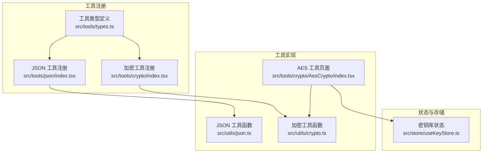
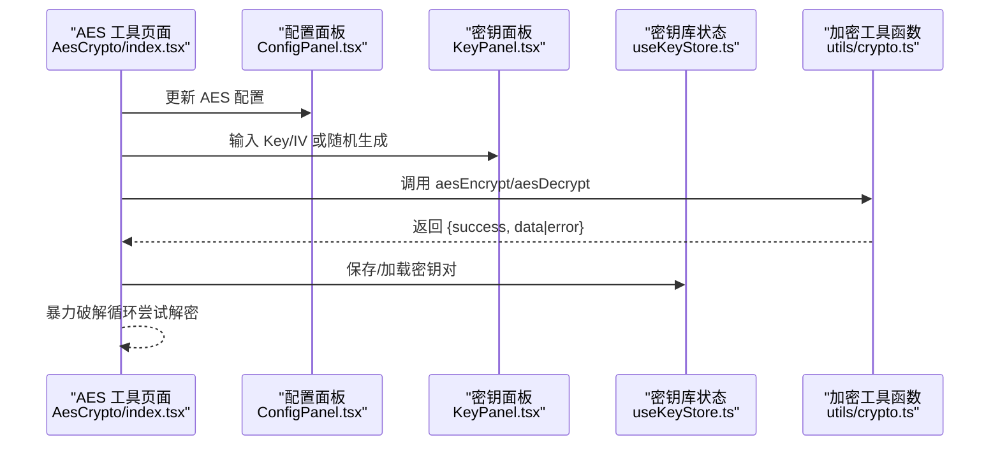
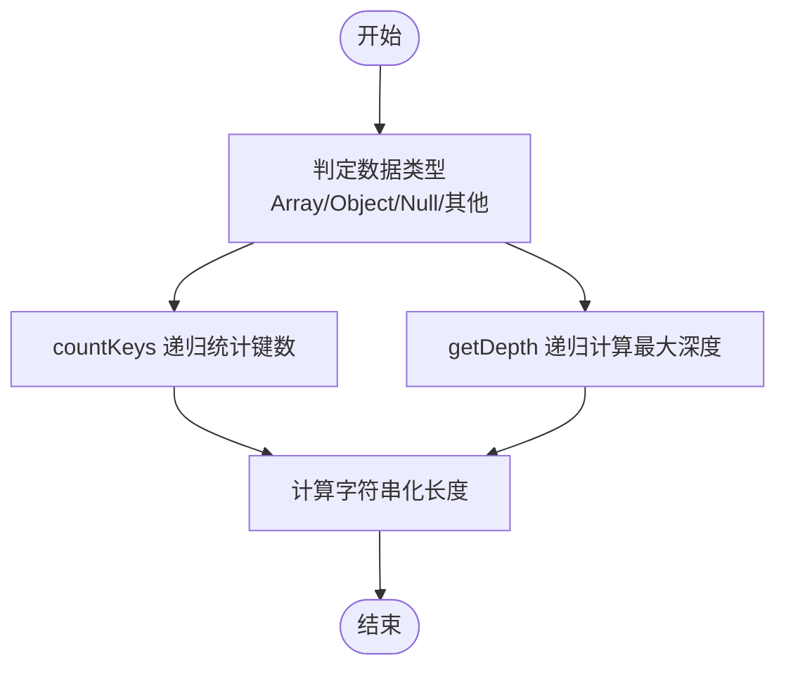
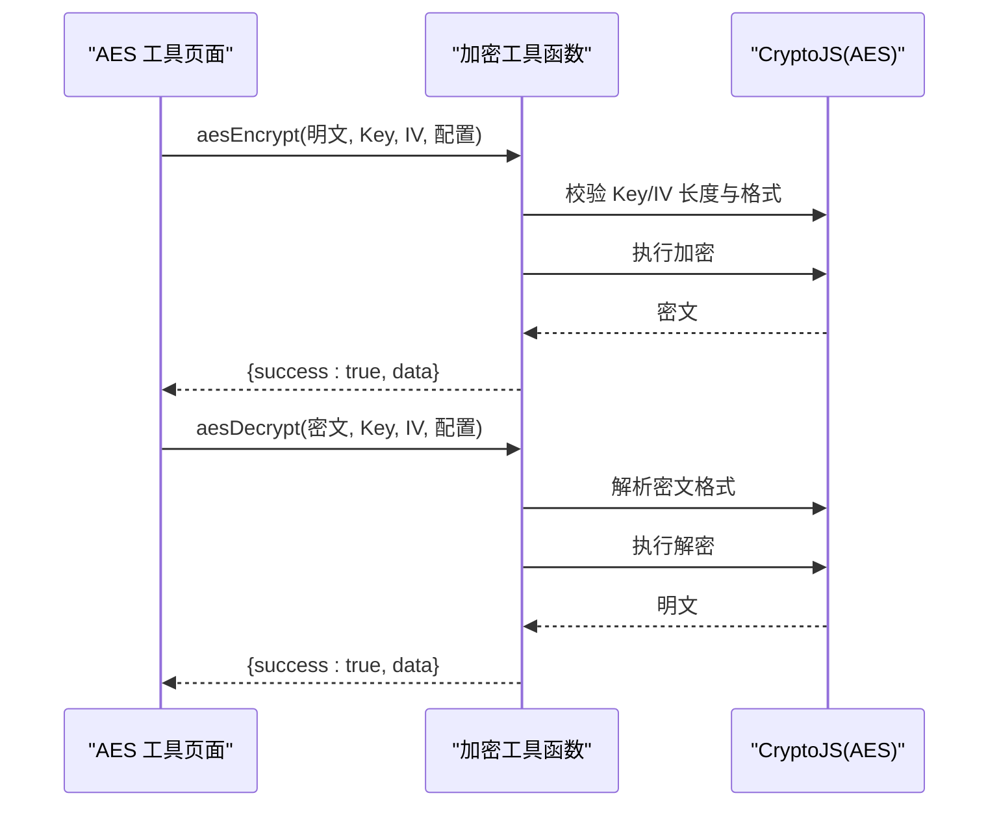
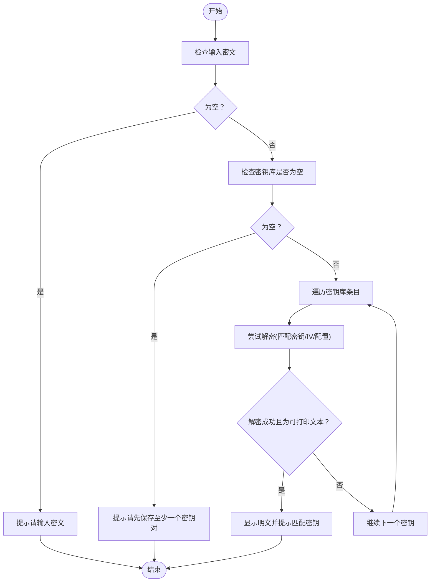
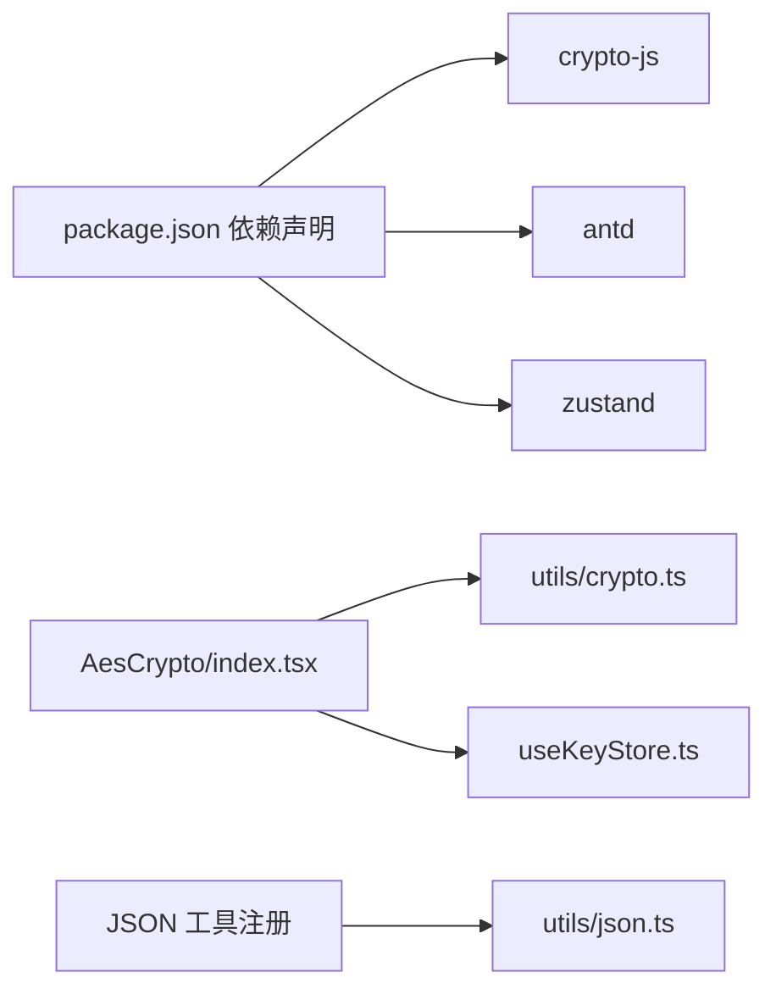

# 工具函数API

<cite>
**本文引用的文件**
- [src/utils/json.ts](file://src/utils/json.ts)
- [src/utils/crypto.ts](file://src/utils/crypto.ts)
- [src/tools/json/index.tsx](file://src/tools/json/index.tsx)
- [src/tools/crypto/index.tsx](file://src/tools/crypto/index.tsx)
- [src/tools/crypto/AesCrypto/index.tsx](file://src/tools/crypto/AesCrypto/index.tsx)
- [src/tools/crypto/AesCrypto/ConfigPanel.tsx](file://src/tools/crypto/AesCrypto/ConfigPanel.tsx)
- [src/tools/crypto/AesCrypto/KeyPanel.tsx](file://src/tools/crypto/AesCrypto/KeyPanel.tsx)
- [src/tools/crypto/AesCrypto/KeystoreDrawer.tsx](file://src/tools/crypto/AesCrypto/KeystoreDrawer.tsx)
- [src/store/useKeyStore.ts](file://src/store/useKeyStore.ts)
- [src/tools/types.ts](file://src/tools/types.ts)
- [package.json](file://package.json)
</cite>

## 目录
1. [简介](#简介)
2. [项目结构](#项目结构)
3. [核心组件](#核心组件)
4. [架构总览](#架构总览)
5. [详细组件分析](#详细组件分析)
6. [依赖分析](#依赖分析)
7. [性能考虑](#性能考虑)
8. [故障排查指南](#故障排查指南)
9. [结论](#结论)
10. [附录](#附录)

## 简介
本文件为 XKUtil 工具函数库的 API 文档，聚焦两类核心能力：
- JSON 处理工具：解析、格式化、压缩、校验与统计分析。
- 加密工具：AES 加密/解密、密钥与 IV 生成、长度与格式校验、暴力破解辅助与密钥库管理。

文档面向不同技术背景的读者，既提供接口规范与参数说明，也包含使用场景、错误处理与性能建议，并通过图示展示函数间依赖与组合使用模式。

## 项目结构
XKUtil 采用前端工具集合的组织方式，核心逻辑位于 src/utils 下，配套的工具页面在 src/tools 中，状态管理使用 zustand 的本地持久化存储。

**图表来源**
- [src/tools/types.ts:1-20](file://src/tools/types.ts#L1-L20)
- [src/tools/json/index.tsx:1-27](file://src/tools/json/index.tsx#L1-L27)
- [src/tools/crypto/index.tsx:1-17](file://src/tools/crypto/index.tsx#L1-L17)
- [src/utils/json.ts:1-116](file://src/utils/json.ts#L1-L116)
- [src/utils/crypto.ts:1-222](file://src/utils/crypto.ts#L1-L222)
- [src/tools/crypto/AesCrypto/index.tsx:1-310](file://src/tools/crypto/AesCrypto/index.tsx#L1-L310)
- [src/store/useKeyStore.ts:1-47](file://src/store/useKeyStore.ts#L1-L47)

**章节来源**
- [src/tools/types.ts:1-20](file://src/tools/types.ts#L1-L20)
- [src/tools/json/index.tsx:1-27](file://src/tools/json/index.tsx#L1-L27)
- [src/tools/crypto/index.tsx:1-17](file://src/tools/crypto/index.tsx#L1-L17)

## 核心组件
- JSON 工具函数模块：提供 JSON 解析、格式化、压缩、键统计与深度统计等能力。
- 加密工具函数模块：提供 AES 加密/解密、密钥与 IV 生成、长度与格式校验、解密有效性判断等能力。
- AES 工具页面：封装配置面板、密钥面板、密钥库抽屉与暴力破解流程，调用加密工具函数完成端到端加解密体验。

**章节来源**
- [src/utils/json.ts:1-116](file://src/utils/json.ts#L1-L116)
- [src/utils/crypto.ts:1-222](file://src/utils/crypto.ts#L1-L222)
- [src/tools/crypto/AesCrypto/index.tsx:1-310](file://src/tools/crypto/AesCrypto/index.tsx#L1-L310)

## 架构总览
下图展示了从 UI 到工具函数的调用链路，以及 AES 页面与密钥库的状态交互。

**图表来源**
- [src/tools/crypto/AesCrypto/index.tsx:33-310](file://src/tools/crypto/AesCrypto/index.tsx#L33-L310)
- [src/tools/crypto/AesCrypto/ConfigPanel.tsx:39-95](file://src/tools/crypto/AesCrypto/ConfigPanel.tsx#L39-L95)
- [src/tools/crypto/AesCrypto/KeyPanel.tsx:23-114](file://src/tools/crypto/AesCrypto/KeyPanel.tsx#L23-L114)
- [src/store/useKeyStore.ts:22-47](file://src/store/useKeyStore.ts#L22-L47)
- [src/utils/crypto.ts:59-162](file://src/utils/crypto.ts#L59-L162)

## 详细组件分析

### JSON 工具函数 API
本模块提供 JSON 的解析、格式化、压缩与统计分析能力，所有函数均以纯函数形式导出，便于在任意上下文中复用。

- 接口与类型
  - 解析结果类型：包含成功与失败两种分支，失败时可携带行列位置信息。
  - 统计结果类型：包含数据类型、键总数、最大嵌套深度、字符串化后的字节数。

- 函数清单与行为
  - parseJson(input: string): 解析输入字符串为 JSON，若解析失败则返回错误信息及位置；成功则返回解析后的数据。
  - formatJson(data: unknown, indent: number | "tab", sortKeys: boolean): 将数据格式化为字符串；indent 支持数字或 "tab"；sortKeys 为 true 时递归按键名排序。
  - compressJson(data: unknown): 压缩 JSON，去除多余空白字符。
  - getJsonStats(data: unknown): 计算 JSON 的类型、键数量、最大深度与字符串化长度。

- 参数与返回值
  - parseJson
    - 参数：input: string
    - 返回：JsonParseResult，包含 success: true 且 data: unknown，或 success: false 且 message: string，可选 position: {line, column}
  - formatJson
    - 参数：data: unknown；indent: number | "tab"；sortKeys: boolean
    - 返回：string
  - compressJson
    - 参数：data: unknown
    - 返回：string
  - getJsonStats
    - 参数：data: unknown
    - 返回：{ type: string; keys: number; depth: number; size: number }

- 使用示例与场景
  - 校验 JSON 合法性：调用 parseJson，根据 success 判断是否继续处理。
  - 美化与压缩：结合 formatJson/compressJson 在开发调试与传输优化之间切换。
  - 可视化前的预处理：使用 getJsonStats 获取键数与深度，指导树形视图渲染策略。

- 错误处理与边界
  - parseJson 对语法错误进行捕获，并尝试解析错误位置，便于定位问题。
  - formatJson 与 compressJson 依赖 JSON.stringify，对不可序列化对象会抛错，需在外层捕获。

- 性能与复杂度
  - sortObjectKeys 与 getJsonStats 为递归遍历，时间复杂度 O(N)，N 为键值对数量；空间复杂度与递归深度相关。
  - formatJson 与 compressJson 时间复杂度近似 O(N)。

**章节来源**
- [src/utils/json.ts:1-116](file://src/utils/json.ts#L1-L116)

#### JSON 统计算法流程

**图表来源**
- [src/utils/json.ts:71-115](file://src/utils/json.ts#L71-L115)

### 加密工具函数 API
本模块基于 crypto-js 提供 AES 加密/解密与密钥/IV 管理能力，统一返回结构体，便于 UI 层一致处理。

- 类型与配置
  - AesMode: "ECB" | "CBC" | "CFB" | "OFB" | "CTR"
  - AesPadding: "Pkcs7" | "ZeroPadding" | "NoPadding"
  - OutputFormat: "Base64" | "Hex"
  - KeyFormat: "Hex" | "UTF-8"
  - KeySize: 128 | 192 | 256
  - AesConfig: 组合上述配置项
  - AesResult: { success: boolean; data?: string; error?: string }

- 函数清单与行为
  - aesEncrypt(plaintext, key, iv, config): 根据配置执行加密，自动校验 key/iv 长度与格式，返回加密结果或错误。
  - aesDecrypt(ciphertext, key, iv, config): 根据配置执行解密，支持 Hex/Base64 输入，返回明文或错误。
  - generateRandomKey(size, format): 生成指定长度与格式的随机密钥。
  - generateRandomIV(format): 生成 16 字节随机 IV。
  - validateKeyLength(key, expectedSize): 校验十六进制密钥长度是否符合预期。
  - validateIV(iv): 校验十六进制 IV 长度是否为 32。
  - isValidDecryption(output): 判断解密结果是否为可打印文本，用于暴力破解辅助。

- 参数与返回值
  - aesEncrypt/aesDecrypt
    - 参数：plaintext/ciphertext: string；key/iv: string；config: AesConfig
    - 返回：AesResult
  - generateRandomKey
    - 参数：size: KeySize；format: KeyFormat
    - 返回：string
  - generateRandomIV
    - 参数：format: KeyFormat
    - 返回：string
  - validateKeyLength
    - 参数：key: string；expectedSize: KeySize
    - 返回：boolean
  - validateIV
    - 参数：iv: string
    - 返回：boolean
  - isValidDecryption
    - 参数：output: string
    - 返回：boolean

- 使用示例与场景
  - 基础加解密：准备 AesConfig，调用 aesEncrypt/aesDecrypt，读取 AesResult。
  - 随机密钥与 IV：使用 generateRandomKey/generateRandomIV 生成安全材料。
  - 暴力破解辅助：在 AES 页面中遍历密钥库条目，逐个尝试解密并用 isValidDecryption 过滤有效明文。
  - 参数校验：在 UI 输入框中使用 validateKeyLength/validateIV 辅助即时反馈。

- 错误处理与边界
  - aesEncrypt/aesDecrypt 内部捕获异常并返回错误信息；当 key/iv 长度不符合预期时直接返回错误。
  - 解密结果为空或包含替换字符时，isValidDecryption 返回 false，避免误判。

- 性能与复杂度
  - AES 加解密复杂度由底层库决定；本层主要为参数校验与格式转换，开销较小。
  - isValidDecryption 遍历输出字符串，时间复杂度 O(L)，L 为输出长度。

**章节来源**
- [src/utils/crypto.ts:1-222](file://src/utils/crypto.ts#L1-L222)

#### AES 加解密调用时序

**图表来源**
- [src/tools/crypto/AesCrypto/index.tsx:55-85](file://src/tools/crypto/AesCrypto/index.tsx#L55-L85)
- [src/utils/crypto.ts:59-162](file://src/utils/crypto.ts#L59-L162)

### AES 工具页面与密钥库
- 功能概览
  - 配置面板：选择 AES 模式、填充、输出格式、密钥格式与密钥长度。
  - 密钥面板：输入/生成 Key/IV，支持 Hex/UTF-8 格式与 ECB 模式的 IV 禁用。
  - 暴力破解：遍历密钥库条目，尝试解密并用 isValidDecryption 过滤有效结果。
  - 密钥库抽屉：增删改查密钥对，支持导入加载。

- 关键交互
  - 用户输入明文/密文与密钥材料后，页面调用 aesEncrypt/aesDecrypt 并处理返回结果。
  - 暴力破解流程：遍历密钥库，逐个尝试解密，成功即停止并提示匹配密钥。
  - 密钥库持久化：使用 zustand 的持久化中间件，确保刷新后仍可用。

- 依赖关系
  - 依赖 utils/crypto.ts 的 aesEncrypt/aesDecrypt 与 isValidDecryption。
  - 依赖 store/useKeyStore.ts 的密钥对 CRUD 与持久化。

**章节来源**
- [src/tools/crypto/AesCrypto/index.tsx:33-310](file://src/tools/crypto/AesCrypto/index.tsx#L33-L310)
- [src/tools/crypto/AesCrypto/ConfigPanel.tsx:39-95](file://src/tools/crypto/AesCrypto/ConfigPanel.tsx#L39-L95)
- [src/tools/crypto/AesCrypto/KeyPanel.tsx:23-114](file://src/tools/crypto/AesCrypto/KeyPanel.tsx#L23-L114)
- [src/tools/crypto/AesCrypto/KeystoreDrawer.tsx:26-185](file://src/tools/crypto/AesCrypto/KeystoreDrawer.tsx#L26-L185)
- [src/store/useKeyStore.ts:22-47](file://src/store/useKeyStore.ts#L22-L47)

#### AES 暴力破解流程

**图表来源**
- [src/tools/crypto/AesCrypto/index.tsx:87-112](file://src/tools/crypto/AesCrypto/index.tsx#L87-L112)
- [src/utils/crypto.ts:202-222](file://src/utils/crypto.ts#L202-L222)

## 依赖分析
- 外部依赖
  - crypto-js：提供 AES 加密/解密与编码转换。
  - antd：提供 UI 组件与表单校验。
  - zustand：提供轻量状态管理与持久化。
- 内部依赖
  - JSON 工具函数被 UI 组件间接使用（通过路由注册与页面导入）。
  - AES 工具函数被 AES 工具页面直接调用，密钥库状态通过 store/useKeyStore.ts 提供。

**图表来源**
- [package.json:12-25](file://package.json#L12-L25)
- [src/tools/crypto/AesCrypto/index.tsx:24-29](file://src/tools/crypto/AesCrypto/index.tsx#L24-L29)
- [src/store/useKeyStore.ts:1-47](file://src/store/useKeyStore.ts#L1-L47)
- [src/utils/json.ts:1-116](file://src/utils/json.ts#L1-L116)

**章节来源**
- [package.json:12-25](file://package.json#L12-L25)

## 性能考虑
- JSON 工具
  - formatJson/compressJson 的时间复杂度近似 O(N)，N 为键值对数量；在超大 JSON 上应避免频繁重排与重复 stringify。
  - getJsonStats 递归遍历，深度过大可能导致栈溢出风险，建议对极深结构提前评估。
- 加密工具
  - aesEncrypt/aesDecrypt 的性能主要受底层库影响；本层的格式转换与校验开销较小。
  - isValidDecryption 对输出字符串做线性扫描，建议仅在必要时调用，避免在高频路径中重复执行。

[本节为通用性能建议，无需特定文件来源]

## 故障排查指南
- JSON 解析失败
  - 现象：parseJson 返回失败，且包含错误位置。
  - 处理：根据 position 定位行/列，修正语法错误后再试。
- AES 密钥/IV 长度错误
  - 现象：aesEncrypt/aesDecrypt 返回错误，提示期望长度与实际长度。
  - 处理：确认 KeyFormat 与 KeySize，Hex 模式下长度为字节数×2；ECB 模式无需 IV。
- 解密结果为空或乱码
  - 现象：解密成功但结果为空，或包含替换字符。
  - 处理：检查密钥、IV、模式与填充是否一致；使用 isValidDecryption 判断是否为可打印文本。
- 暴力破解无结果
  - 现象：尝试完所有密钥后仍无法解密。
  - 处理：核对密文格式（Hex/Base64）、配置项与密钥库内容，必要时重新生成密钥/IV。

**章节来源**
- [src/utils/json.ts:14-38](file://src/utils/json.ts#L14-L38)
- [src/utils/crypto.ts:68-104](file://src/utils/crypto.ts#L68-L104)
- [src/utils/crypto.ts:116-161](file://src/utils/crypto.ts#L116-L161)
- [src/utils/crypto.ts:202-222](file://src/utils/crypto.ts#L202-L222)

## 结论
XKUtil 的工具函数库以清晰的类型约束与统一的返回结构，提供了可靠的 JSON 处理与 AES 加解密能力。通过 UI 组件与状态管理的配合，用户可以便捷地完成加密实验、密钥管理与批量解密尝试。建议在生产环境中严格校验输入参数与输出结果，并根据数据规模选择合适的 JSON 处理策略。

[本节为总结性内容，无需特定文件来源]

## 附录
- 工具注册与分类
  - JSON 工具：格式化、树形视图。
  - 加密工具：AES 加解密。
- 常用组合模式
  - JSON：parseJson → formatJson/compressJson → getJsonStats。
  - AES：generateRandomKey/IV → aesEncrypt → aesDecrypt → isValidDecryption。

**章节来源**
- [src/tools/json/index.tsx:5-26](file://src/tools/json/index.tsx#L5-L26)
- [src/tools/crypto/index.tsx:5-16](file://src/tools/crypto/index.tsx#L5-L16)