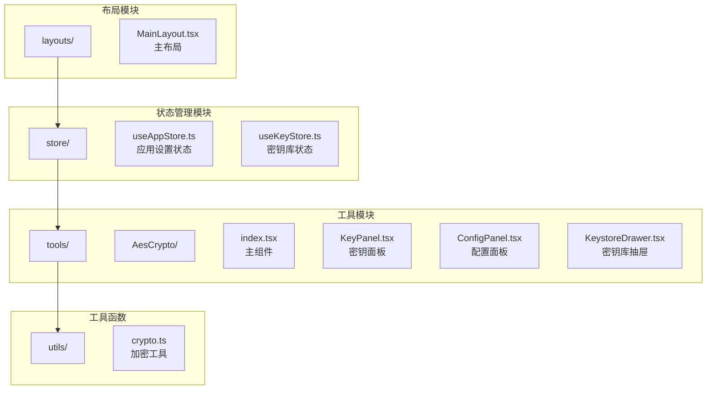
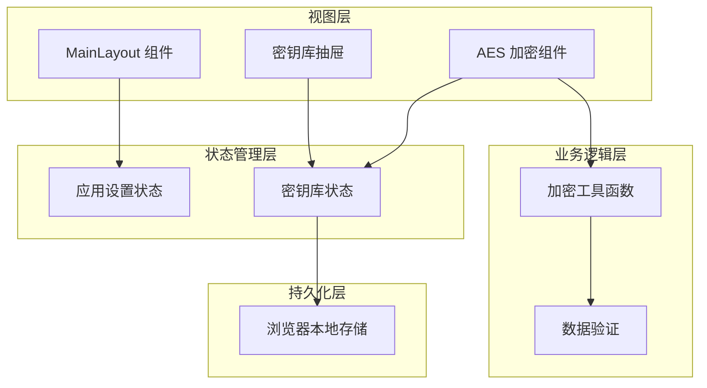
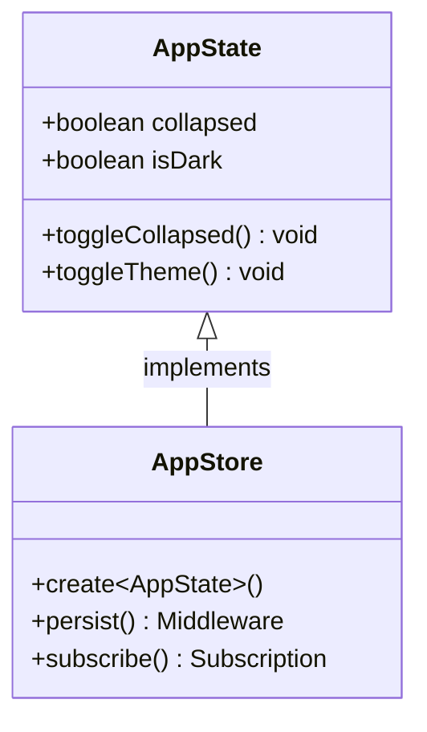
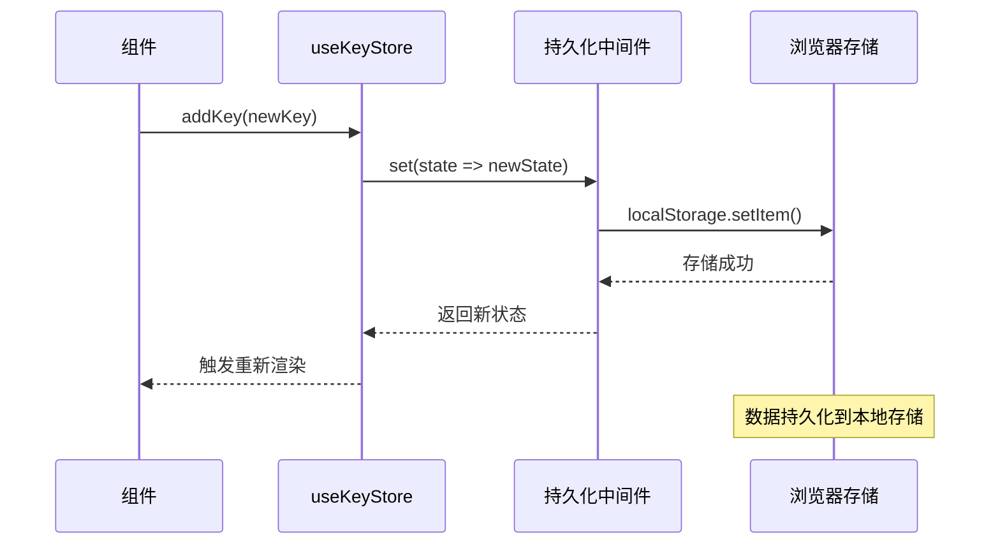
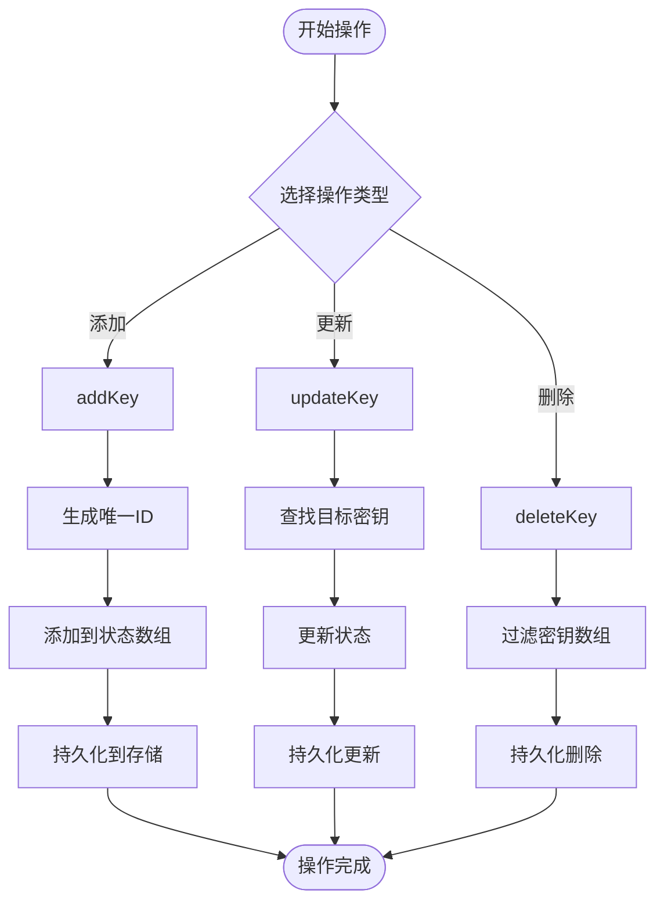
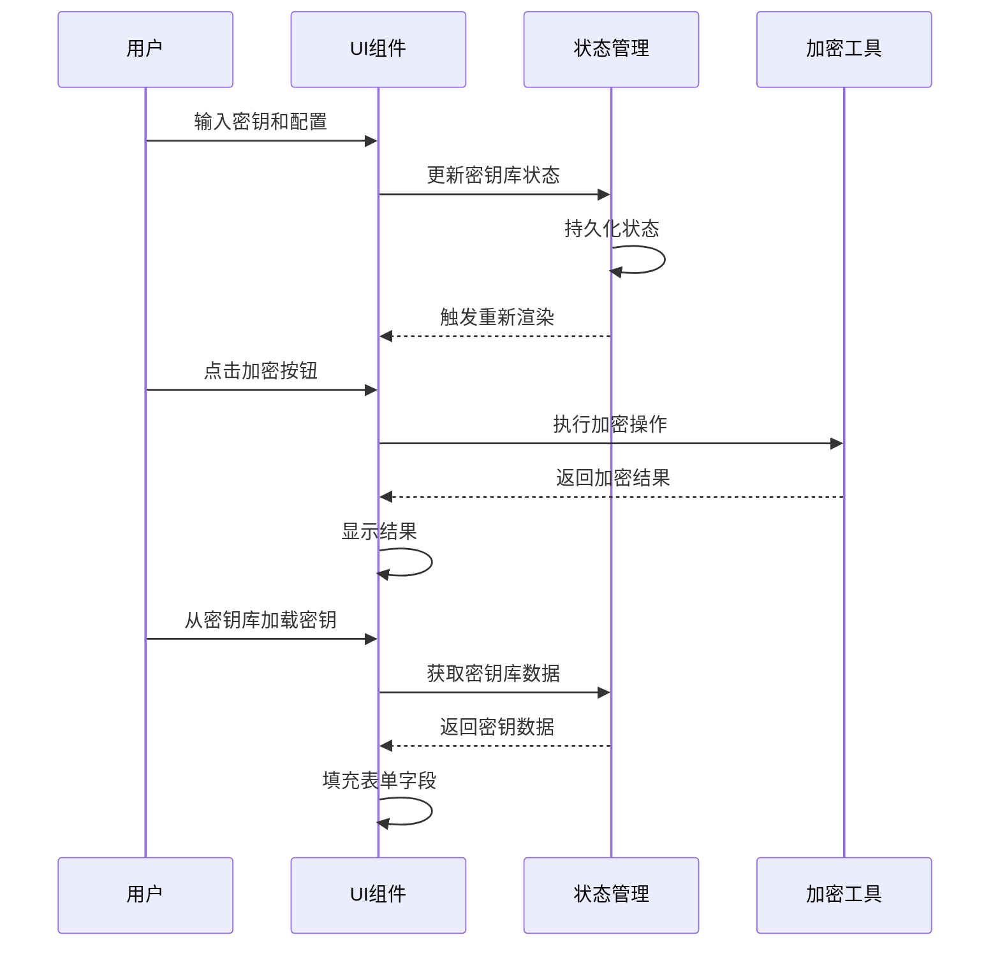
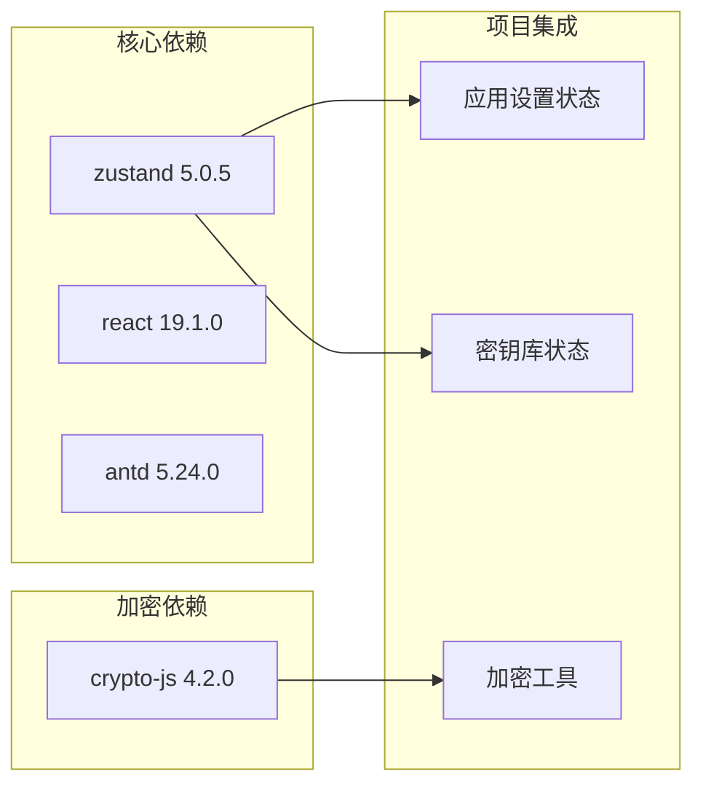
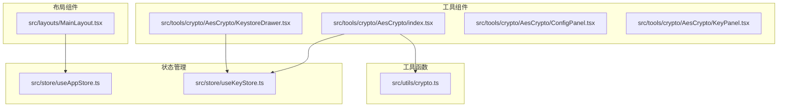

# 状态管理API

<cite>
**本文档引用的文件**
- [useAppStore.ts](file://src/store/useAppStore.ts)
- [useKeyStore.ts](file://src/store/useKeyStore.ts)
- [MainLayout.tsx](file://src/layouts/MainLayout.tsx)
- [AesCrypto/index.tsx](file://src/tools/crypto/AesCrypto/index.tsx)
- [KeystoreDrawer.tsx](file://src/tools/crypto/AesCrypto/KeystoreDrawer.tsx)
- [ConfigPanel.tsx](file://src/tools/crypto/AesCrypto/ConfigPanel.tsx)
- [KeyPanel.tsx](file://src/tools/crypto/AesCrypto/KeyPanel.tsx)
- [crypto.ts](file://src/utils/crypto.ts)
- [types.ts](file://src/tools/types.ts)
- [package.json](file://package.json)
</cite>

## 目录
1. [简介](#简介)
2. [项目结构](#项目结构)
3. [核心组件](#核心组件)
4. [架构概览](#架构概览)
5. [详细组件分析](#详细组件分析)
6. [依赖关系分析](#依赖关系分析)
7. [性能考虑](#性能考虑)
8. [故障排除指南](#故障排除指南)
9. [结论](#结论)

## 简介

XKUtil是一个基于React和Zustand的状态管理系统，提供了两个主要的store：应用设置状态管理和密钥库状态管理。该系统采用轻量级的状态管理模式，通过Zustand实现高效的状态共享和响应式更新。

本项目的核心目标是为用户提供一个功能完整的密码学工具集，其中状态管理扮演着至关重要的角色。应用设置状态管理负责UI主题切换、侧边栏折叠等界面状态，而密钥库状态管理则专门处理AES加密所需的密钥对数据。

## 项目结构

项目采用模块化的文件组织方式，状态管理相关的代码集中在`src/store/`目录下：

**图表来源**
- [useAppStore.ts:1-24](file://src/store/useAppStore.ts#L1-L24)
- [useKeyStore.ts:1-47](file://src/store/useKeyStore.ts#L1-L47)
- [MainLayout.tsx:1-168](file://src/layouts/MainLayout.tsx#L1-L168)

**章节来源**
- [useAppStore.ts:1-24](file://src/store/useAppStore.ts#L1-L24)
- [useKeyStore.ts:1-47](file://src/store/useKeyStore.ts#L1-L47)
- [MainLayout.tsx:1-168](file://src/layouts/MainLayout.tsx#L1-L168)

## 核心组件

### 应用设置状态管理 (useAppStore)

应用设置状态管理负责维护用户界面的全局状态，包括侧边栏折叠状态和主题切换状态。

#### 状态定义

应用状态接口包含以下属性：
- `collapsed`: boolean - 控制侧边栏是否折叠
- `isDark`: boolean - 控制当前主题是否为深色模式

#### 动作方法

- `toggleCollapsed()`: 切换侧边栏折叠状态
- `toggleTheme()`: 切换主题模式

#### 订阅机制

使用Zustand的订阅模式，组件可以通过选择器函数精确订阅所需的状态变化。

**章节来源**
- [useAppStore.ts:4-9](file://src/store/useAppStore.ts#L4-L9)
- [useAppStore.ts:11-23](file://src/store/useAppStore.ts#L11-L23)

### 密钥库状态管理 (useKeyStore)

密钥库状态管理专门处理AES加密所需的密钥对数据，提供完整的CRUD操作能力。

#### 数据模型

密钥对数据结构：
- `id`: string - 唯一标识符
- `label`: string - 用户自定义标签
- `key`: string - 加密密钥
- `iv`: string - 初始化向量
- `keyFormat`: KeyFormat - 密钥格式（Hex/UTF-8）
- `keySize`: KeySize - 密钥长度（128/192/256位）
- `createdAt`: number - 创建时间戳

#### 动作方法

- `addKey(entry)`: 添加新的密钥对
- `updateKey(id, updates)`: 更新指定密钥对
- `deleteKey(id)`: 删除指定密钥对

#### 订阅机制

支持多种订阅模式：
- 全部状态订阅
- 部分状态订阅（如仅订阅keys数组）

**章节来源**
- [useKeyStore.ts:5-13](file://src/store/useKeyStore.ts#L5-L13)
- [useKeyStore.ts:15-20](file://src/store/useKeyStore.ts#L15-L20)
- [useKeyStore.ts:22-46](file://src/store/useKeyStore.ts#L22-L46)

## 架构概览

系统采用分层架构设计，状态管理层与业务逻辑层分离：

**图表来源**
- [MainLayout.tsx:22-25](file://src/layouts/MainLayout.tsx#L22-L25)
- [AesCrypto/index.tsx:33-50](file://src/tools/crypto/AesCrypto/index.tsx#L33-L50)
- [useKeyStore.ts:22-46](file://src/store/useKeyStore.ts#L22-L46)

## 详细组件分析

### 应用设置状态管理详解

#### 状态结构分析

应用状态采用简洁的数据结构设计，确保最小化状态更新开销：

**图表来源**
- [useAppStore.ts:4-9](file://src/store/useAppStore.ts#L4-L9)
- [useAppStore.ts:11-23](file://src/store/useAppStore.ts#L11-L23)

#### 订阅机制实现

应用设置状态通过多种方式被组件订阅：

1. **全状态订阅**：直接解构所有状态属性
2. **选择性订阅**：仅订阅特定状态属性
3. **计算属性订阅**：基于状态派生的计算值

**章节来源**
- [MainLayout.tsx:25](file://src/layouts/MainLayout.tsx#L25)
- [useAppStore.ts:11-23](file://src/store/useAppStore.ts#L11-L23)

### 密钥库状态管理详解

#### 数据持久化机制

密钥库状态通过Zustand的persist中间件实现数据持久化：

**图表来源**
- [useKeyStore.ts:22-46](file://src/store/useKeyStore.ts#L22-L46)

#### CRUD操作流程

密钥库支持完整的CRUD操作，每种操作都有明确的执行流程：

**图表来源**
- [useKeyStore.ts:26-42](file://src/store/useKeyStore.ts#L26-L42)

**章节来源**
- [useKeyStore.ts:22-46](file://src/store/useKeyStore.ts#L22-L46)

### AES加密组件集成

#### 状态与UI的交互

AES加密组件通过状态管理实现复杂的用户交互：

**图表来源**
- [AesCrypto/index.tsx:55-112](file://src/tools/crypto/AesCrypto/index.tsx#L55-L112)
- [KeystoreDrawer.tsx:27-52](file://src/tools/crypto/AesCrypto/KeystoreDrawer.tsx#L27-L52)

**章节来源**
- [AesCrypto/index.tsx:33-310](file://src/tools/crypto/AesCrypto/index.tsx#L33-L310)
- [KeystoreDrawer.tsx:26-185](file://src/tools/crypto/AesCrypto/KeystoreDrawer.tsx#L26-L185)

## 依赖关系分析

### 外部依赖

项目使用Zustand作为核心状态管理库，版本为5.0.5：

**图表来源**
- [package.json:12-24](file://package.json#L12-L24)

### 内部依赖关系

状态管理模块之间的依赖关系清晰明确：

**图表来源**
- [useAppStore.ts:11](file://src/store/useAppStore.ts#L11)
- [useKeyStore.ts:22](file://src/store/useKeyStore.ts#L22)

**章节来源**
- [package.json:12-24](file://package.json#L12-L24)

## 性能考虑

### 状态更新优化

1. **选择性订阅**：使用选择器函数避免不必要的重渲染
2. **状态分割**：将大对象拆分为独立的状态片段
3. **批量更新**：在单个回调中进行多个状态更新

### 内存管理

1. **自动清理**：Zustand自动处理组件卸载后的状态清理
2. **持久化优化**：只存储必要的状态数据
3. **垃圾回收**：及时释放不再使用的状态引用

### 数据持久化策略

1. **增量持久化**：仅持久化状态变更部分
2. **存储限制**：合理控制存储数据大小
3. **备份机制**：定期备份重要状态数据

## 故障排除指南

### 常见问题及解决方案

#### 状态不同步问题

**症状**：UI状态与实际状态不一致

**解决方案**：
1. 检查状态订阅是否正确
2. 确认状态更新函数的调用时机
3. 验证状态持久化配置

#### 性能问题

**症状**：应用运行缓慢或内存占用过高

**解决方案**：
1. 使用选择性订阅减少重渲染
2. 优化状态数据结构
3. 实施状态缓存策略

#### 数据丢失问题

**症状**：刷新页面后状态丢失

**解决方案**：
1. 检查localStorage权限
2. 验证持久化配置
3. 实施数据恢复机制

**章节来源**
- [useAppStore.ts:11-23](file://src/store/useAppStore.ts#L11-L23)
- [useKeyStore.ts:22-46](file://src/store/useKeyStore.ts#L22-L46)

## 结论

XKUtil的状态管理系统展现了现代前端应用的最佳实践。通过精心设计的Zustand store架构，实现了：

1. **清晰的职责分离**：应用设置状态与业务数据状态分离
2. **高效的性能表现**：通过选择性订阅和状态优化确保流畅体验
3. **可靠的持久化机制**：确保用户数据的安全存储和恢复
4. **良好的扩展性**：模块化设计便于功能扩展和维护

该系统为AES加密工具提供了坚实的状态管理基础，支持复杂的用户交互和数据操作，同时保持了代码的可读性和可维护性。通过遵循本文档中的最佳实践和性能优化建议，开发者可以进一步提升系统的稳定性和用户体验。