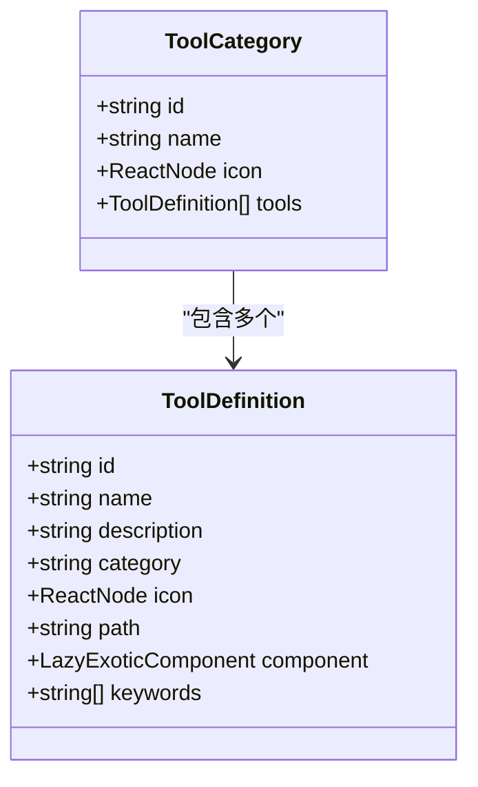
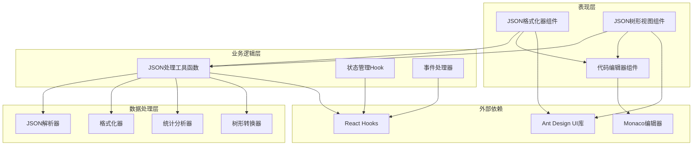
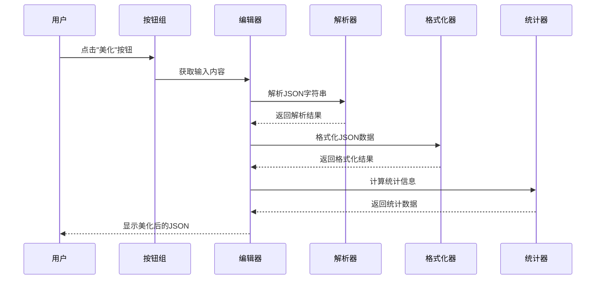
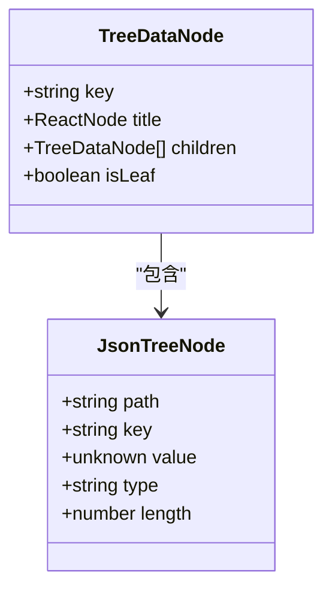
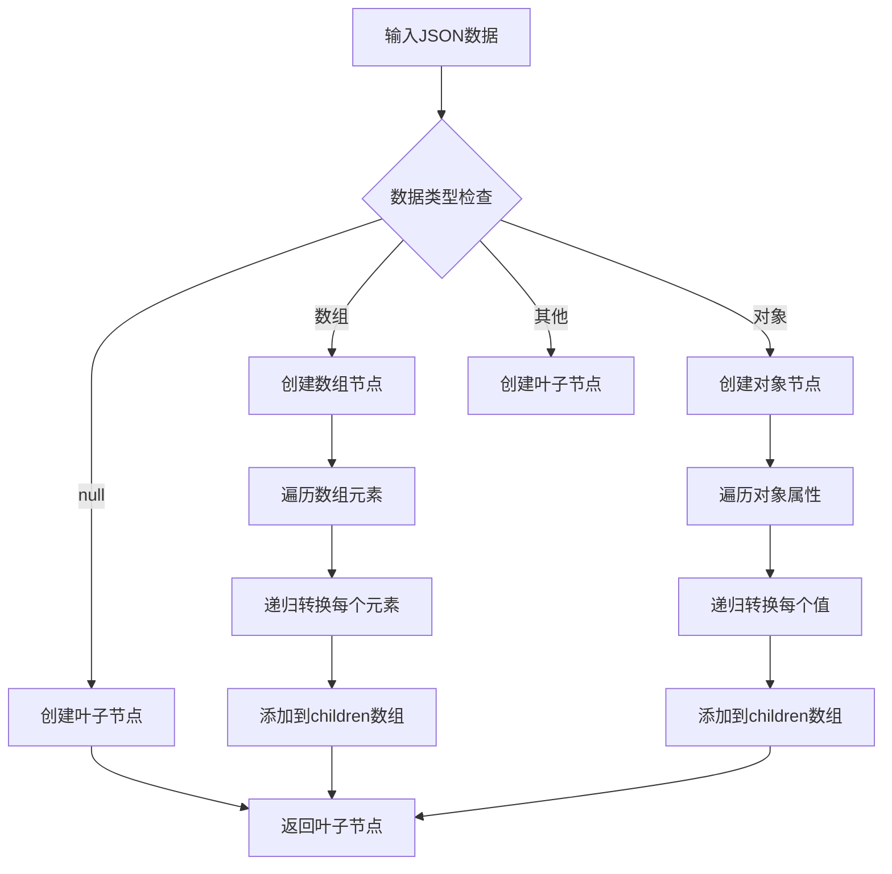
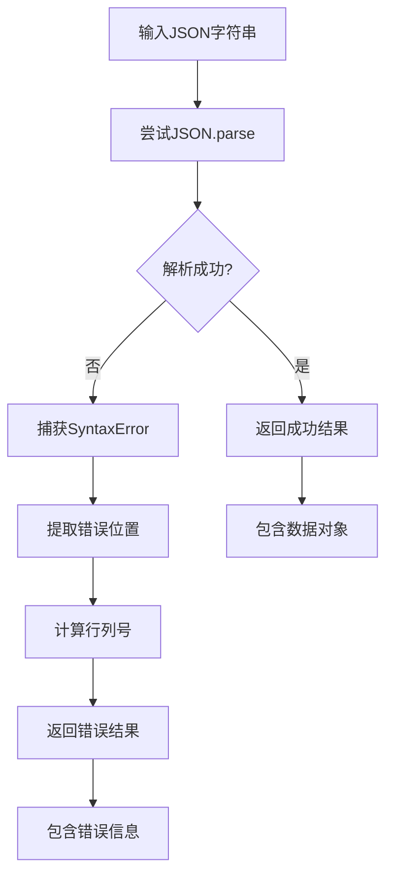
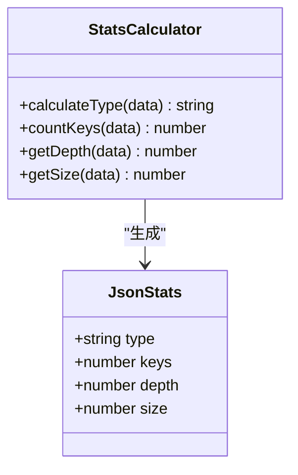

# JSON工具模块

<cite>
**本文档引用的文件**
- [src/tools/json/index.tsx](file://src/tools/json/index.tsx)
- [src/utils/json.ts](file://src/utils/json.ts)
- [src/tools/json/JsonFormatter/index.tsx](file://src/tools/json/JsonFormatter/index.tsx)
- [src/tools/json/JsonTreeView/index.tsx](file://src/tools/json/JsonTreeView/index.tsx)
- [src/components/CodeEditor/index.tsx](file://src/components/CodeEditor/index.tsx)
- [src/tools/types.ts](file://src/tools/types.ts)
- [src/tools/registry.ts](file://src/tools/registry.ts)
- [src/styles/theme.ts](file://src/styles/theme.ts)
- [package.json](file://package.json)
</cite>

## 目录
1. [简介](#简介)
2. [项目结构](#项目结构)
3. [核心组件](#核心组件)
4. [架构概览](#架构概览)
5. [详细组件分析](#详细组件分析)
6. [依赖关系分析](#依赖关系分析)
7. [性能考虑](#性能考虑)
8. [故障排除指南](#故障排除指南)
9. [结论](#结论)

## 简介

JSON工具模块是XKUtil开发者工具箱中的重要组成部分，提供了完整的JSON数据处理解决方案。该模块包含两个主要功能：JSON格式化器和JSON树形视图组件。格式化器支持JSON美化、压缩、验证和统计信息计算，而树形视图组件则提供了直观的JSON数据结构可视化。

该模块采用React Hooks和Ant Design组件库构建，集成了Monaco编辑器提供专业的代码编辑体验，并通过TypeScript确保类型安全。模块设计遵循单一职责原则，将业务逻辑与UI组件分离，便于维护和扩展。

## 项目结构

JSON工具模块位于`src/tools/json/`目录下，采用清晰的功能分层架构：

```mermaid
graph TB
subgraph "JSON工具模块结构"
A[src/tools/json/] --> B[src/tools/json/index.tsx]
A --> C[src/utils/json.ts]
A --> D[src/tools/json/JsonFormatter/]
A --> E[src/tools/json/JsonTreeView/]
D --> F[index.tsx - 格式化器组件]
E --> G[index.tsx - 树形视图组件]
H[src/utils/] --> C
I[src/components/] --> J[src/components/CodeEditor/]
J --> K[index.tsx - 代码编辑器]
L[src/tools/] --> M[src/tools/types.ts]
L --> N[src/tools/registry.ts]
</subgraph>
```

**图表来源**
- [src/tools/json/index.tsx:1-27](file://src/tools/json/index.tsx#L1-L27)
- [src/utils/json.ts:1-116](file://src/utils/json.ts#L1-L116)
- [src/tools/json/JsonFormatter/index.tsx:1-267](file://src/tools/json/JsonFormatter/index.tsx#L1-L267)
- [src/tools/json/JsonTreeView/index.tsx:1-248](file://src/tools/json/JsonTreeView/index.tsx#L1-L248)

**章节来源**
- [src/tools/json/index.tsx:1-27](file://src/tools/json/index.tsx#L1-L27)
- [src/tools/types.ts:1-20](file://src/tools/types.ts#L1-L20)
- [src/tools/registry.ts:1-39](file://src/tools/registry.ts#L1-L39)

## 核心组件

### JSON工具注册表

JSON工具模块通过工具注册表统一管理所有JSON相关工具。当前包含两个核心工具：
- **JSON格式化器**：提供美化、压缩、验证功能
- **JSON树形视图**：以树形结构可视化展示JSON数据

每个工具都实现了标准化的接口，包含工具标识符、名称、描述、图标、路由路径等元数据信息。

### 工具类型定义

工具系统基于统一的类型定义，确保所有工具具有一致的接口规范：



**图表来源**
- [src/tools/types.ts:3-19](file://src/tools/types.ts#L3-L19)

**章节来源**
- [src/tools/types.ts:1-20](file://src/tools/types.ts#L1-L20)
- [src/tools/registry.ts:1-39](file://src/tools/registry.ts#L1-L39)

## 架构概览

JSON工具模块采用分层架构设计，从上到下分为表现层、业务逻辑层和数据处理层：



**图表来源**
- [src/tools/json/JsonFormatter/index.tsx:1-267](file://src/tools/json/JsonFormatter/index.tsx#L1-L267)
- [src/tools/json/JsonTreeView/index.tsx:1-248](file://src/tools/json/JsonTreeView/index.tsx#L1-L248)
- [src/utils/json.ts:1-116](file://src/utils/json.ts#L1-L116)

## 详细组件分析

### JSON格式化器组件

JSON格式化器是一个功能完整的JSON处理界面，提供以下核心功能：

#### 主要功能特性

1. **美化功能**：将压缩的JSON格式化为易读的结构
2. **压缩功能**：移除所有空白字符，减小JSON体积
3. **验证功能**：检查JSON语法的有效性
4. **键排序**：可选的按键排序功能
5. **统计信息**：显示JSON数据的类型、键数、深度和大小

#### 用户界面设计



**图表来源**
- [src/tools/json/JsonFormatter/index.tsx:53-78](file://src/tools/json/JsonFormatter/index.tsx#L53-L78)
- [src/utils/json.ts:14-38](file://src/utils/json.ts#L14-L38)

#### 状态管理机制

格式化器组件使用React状态管理来跟踪用户输入、输出结果、错误状态和配置选项：

| 状态变量 | 类型 | 描述 | 默认值 |
|---------|------|------|--------|
| input | string | 用户输入的JSON字符串 | 示例JSON |
| output | string | 处理后的JSON输出 | 空字符串 |
| error | string \| null | 错误消息 | null |
| indent | 2 \| 4 \| "tab" | 缩进空格数 | 2 |
| sortKeys | boolean | 是否按键排序 | false |
| stats | string | 统计信息字符串 | 空字符串 |

#### 错误处理策略

格式化器采用多层次的错误处理机制：

1. **输入验证**：检查空输入和空白字符
2. **解析错误**：捕获JSON.parse异常并提取位置信息
3. **UI反馈**：使用Alert组件显示错误消息
4. **用户引导**：提供清除和粘贴功能

**章节来源**
- [src/tools/json/JsonFormatter/index.tsx:1-267](file://src/tools/json/JsonFormatter/index.tsx#L1-L267)

### JSON树形视图组件

JSON树形视图组件提供了一个交互式的JSON数据可视化界面，支持完整的树形导航和操作功能。

#### 核心数据结构

树形视图使用递归的数据结构来表示JSON对象：



**图表来源**
- [src/tools/json/JsonTreeView/index.tsx:19-24](file://src/tools/json/JsonTreeView/index.tsx#L19-L24)

#### 树形转换算法

树形视图的核心是将JSON数据转换为Ant Design Tree组件所需的格式：



**图表来源**
- [src/tools/json/JsonTreeView/index.tsx:54-101](file://src/tools/json/JsonTreeView/index.tsx#L54-L101)

#### 节点类型标签系统

树形视图为不同类型的JSON值显示相应的颜色标签：

| JSON类型 | 标签颜色 | 显示内容 | 特殊属性 |
|---------|---------|---------|---------|
| null | default | null | 基础类型 |
| Array | blue | Array[n] | 显示数组长度 |
| string | green | string | 包裹引号 |
| number | orange | number | 数字值 |
| boolean | purple | true/false | 文本化布尔值 |
| object | cyan | Object{n} | 显示键数量 |
| 其他 | 默认 | typeof值 | 原始类型名 |

#### 交互功能实现

树形视图提供多种用户交互功能：

1. **展开/折叠控制**：一键展开或折叠所有节点
2. **路径复制**：复制节点的JSONPath表达式
3. **自动展开**：首次加载时自动展开根节点
4. **实时验证**：输入变化时即时验证JSON有效性

**章节来源**
- [src/tools/json/JsonTreeView/index.tsx:1-248](file://src/tools/json/JsonTreeView/index.tsx#L1-L248)

### JSON处理工具库

JSON工具库提供了独立的纯函数，用于执行各种JSON处理任务。这些函数设计为无副作用，便于测试和复用。

#### 解析器功能

解析器负责将JSON字符串转换为JavaScript对象，同时提供详细的错误信息：



**图表来源**
- [src/utils/json.ts:14-38](file://src/utils/json.ts#L14-L38)

#### 格式化器功能

格式化器支持多种格式化选项：

| 参数 | 类型 | 描述 | 默认值 |
|------|------|------|--------|
| data | unknown | 要格式化的数据 | 必需 |
| indent | number \| "tab" | 缩进空格数或制表符 | 2 |
| sortKeys | boolean | 是否按键排序 | false |

#### 压缩器功能

压缩器移除所有不必要的空白字符，生成最紧凑的JSON表示。

#### 统计分析器功能

统计分析器提供JSON数据的多维度分析：



**图表来源**
- [src/utils/json.ts:71-91](file://src/utils/json.ts#L71-L91)

**章节来源**
- [src/utils/json.ts:1-116](file://src/utils/json.ts#L1-L116)

### 代码编辑器集成

JSON工具模块集成了Monaco编辑器，提供专业的代码编辑体验：

#### 编辑器配置

编辑器采用响应式主题切换，根据系统主题自动调整配色方案：

| 配置项 | 明亮主题值 | 暗黑主题值 |
|-------|-----------|-----------|
| 主题 | light | vs-dark |
| 字体大小 | 13px | 13px |
| 行号 | 显示 | 显示 |
| 缩进 | 2空格 | 2空格 |
| 自动换行 | 启用 | 启用 |

#### 功能特性

1. **语法高亮**：支持JSON语法高亮显示
2. **智能提示**：提供基本的代码补全功能
3. **主题适配**：自动适配系统暗黑/明亮模式
4. **性能优化**：禁用不必要的功能以提升性能

**章节来源**
- [src/components/CodeEditor/index.tsx:1-57](file://src/components/CodeEditor/index.tsx#L1-L57)

## 依赖关系分析

JSON工具模块的依赖关系相对简单，主要依赖于React生态系统和Ant Design组件库。

```mermaid
graph LR
subgraph "核心依赖"
A[React 19.1.0]
B[Ant Design 5.24.0]
C[Monaco Editor 4.7.0]
end
subgraph "工具依赖"
D[TypeScript 5.8.3]
E[Vite 6.3.5]
F[React Router DOM 7.6.0]
end
subgraph "开发依赖"
G[@types/react 19.1.0]
H[@types/crypto-js 4.2.2]
I[@vitejs/plugin-react 4.4.1]
end
subgraph "JSON工具模块"
J[JSON格式化器]
K[JSON树形视图]
L[JSON处理工具]
end
A --> J
A --> K
B --> J
B --> K
C --> J
C --> K
D --> L
E --> J
E --> K
F --> J
F --> K
```

**图表来源**
- [package.json:12-34](file://package.json#L12-L34)

### 外部库集成

模块集成了多个外部库来增强功能：

1. **Ant Design**：提供丰富的UI组件和主题系统
2. **Monaco Editor**：提供专业级代码编辑体验
3. **React Router**：支持单页应用路由导航
4. **Zustand**：提供轻量级状态管理

**章节来源**
- [package.json:1-36](file://package.json#L1-L36)

## 性能考虑

### 内存优化策略

1. **懒加载组件**：使用React.lazy实现按需加载，减少初始包大小
2. **状态最小化**：仅存储必要的状态数据，避免重复计算
3. **Memo化优化**：使用useMemo缓存计算结果，避免重复渲染

### 渲染性能优化

1. **虚拟滚动**：对于大型JSON数据，考虑实现虚拟滚动
2. **增量更新**：只更新发生变化的部分DOM节点
3. **防抖处理**：对频繁触发的操作进行防抖处理

### 网络和I/O优化

1. **剪贴板API**：使用原生剪贴板API进行高效的数据传输
2. **异步处理**：避免阻塞主线程的长时间操作
3. **内存泄漏防护**：及时清理事件监听器和定时器

## 故障排除指南

### 常见问题及解决方案

#### JSON解析错误

**问题症状**：格式化器显示解析错误消息

**可能原因**：
1. JSON语法不正确
2. 包含注释或尾随逗号
3. 使用了非标准的JSON特性

**解决方法**：
1. 使用在线JSON验证器检查语法
2. 移除所有注释和尾随逗号
3. 确保使用标准JSON格式

#### 性能问题

**问题症状**：处理大型JSON数据时出现卡顿

**优化建议**：
1. 分批处理大型数据
2. 实现进度指示器
3. 考虑使用Web Workers

#### 剪贴板访问失败

**问题症状**：复制功能无法正常工作

**解决方法**：
1. 确保HTTPS环境
2. 检查浏览器权限设置
3. 尝试手动选择复制

**章节来源**
- [src/tools/json/JsonFormatter/index.tsx:132-140](file://src/tools/json/JsonFormatter/index.tsx#L132-L140)
- [src/tools/json/JsonTreeView/index.tsx:144-152](file://src/tools/json/JsonTreeView/index.tsx#L144-L152)

## 结论

JSON工具模块是一个设计精良、功能完整的JSON处理解决方案。它成功地将复杂的JSON处理任务封装为直观易用的界面，同时保持了良好的性能和可维护性。

### 主要优势

1. **功能完整性**：涵盖了JSON处理的所有核心需求
2. **用户体验优秀**：提供直观的界面和流畅的交互
3. **代码质量高**：采用TypeScript和现代React最佳实践
4. **可扩展性强**：模块化设计便于功能扩展

### 技术亮点

1. **纯函数设计**：工具函数无副作用，便于测试和复用
2. **类型安全**：完整的TypeScript类型定义
3. **响应式设计**：适应不同屏幕尺寸和设备
4. **主题适配**：支持暗黑/明亮两种主题模式

### 改进建议

1. **性能监控**：添加性能指标收集和分析
2. **国际化支持**：添加多语言本地化功能
3. **导出功能**：支持将处理结果导出为文件
4. **历史记录**：保存最近使用的JSON数据

该模块为开发者提供了一个强大而易用的JSON处理工具，是XKUtil工具箱中的重要组成部分。