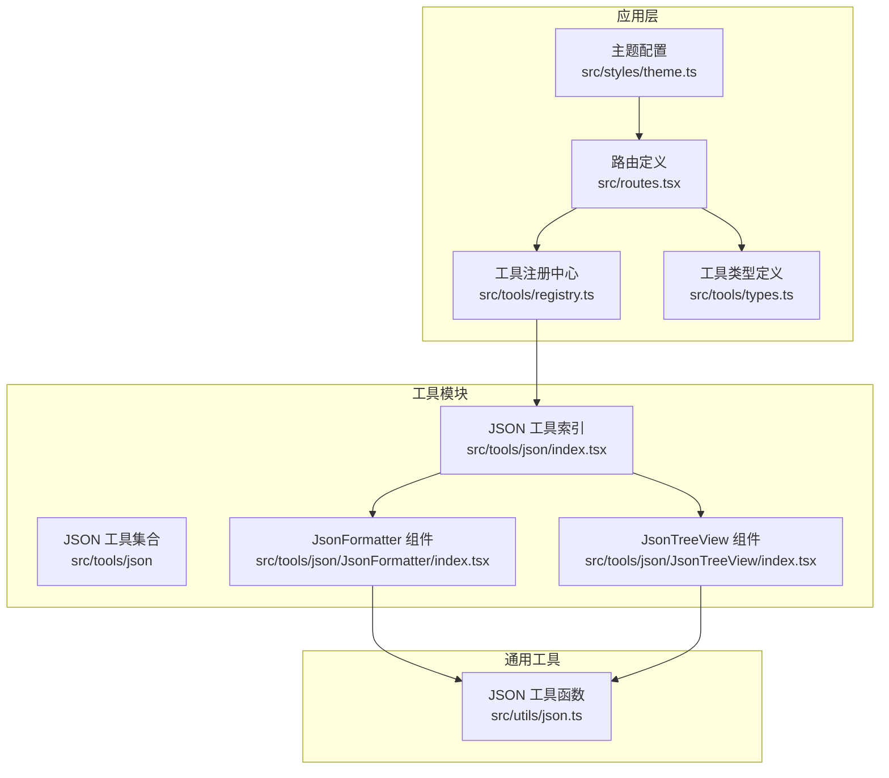
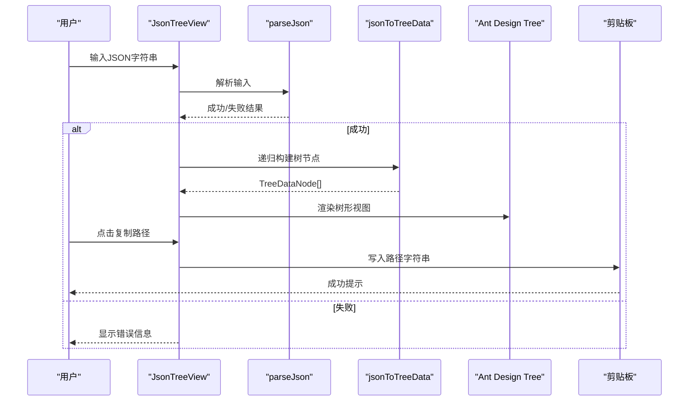
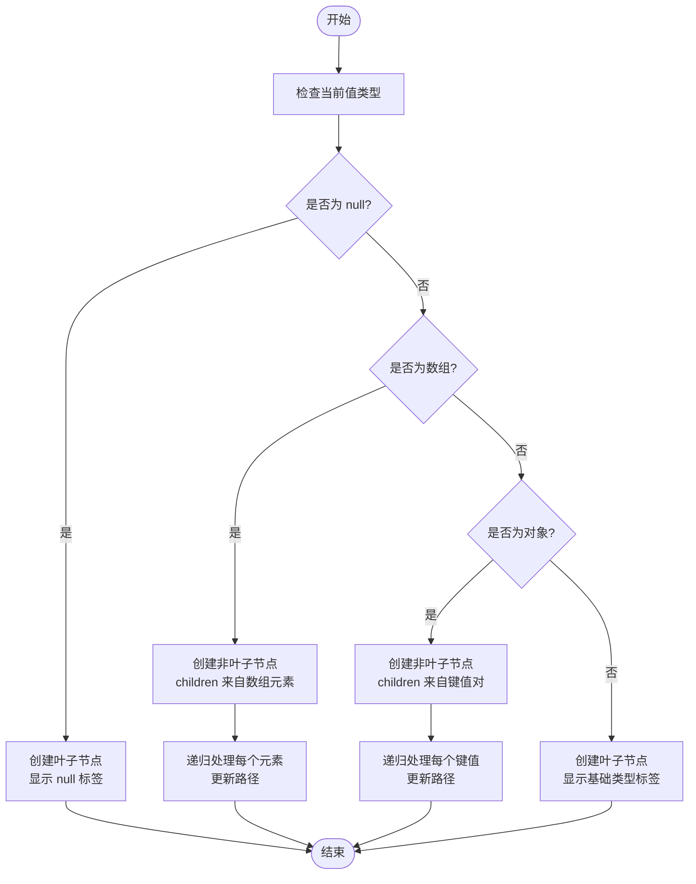
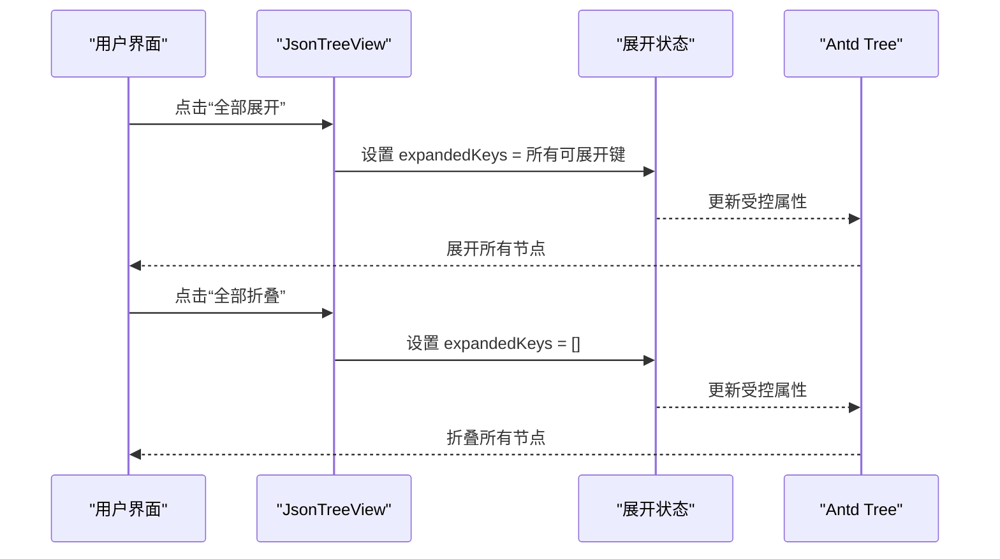
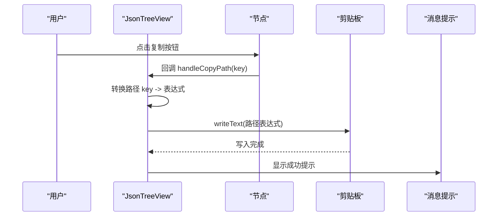
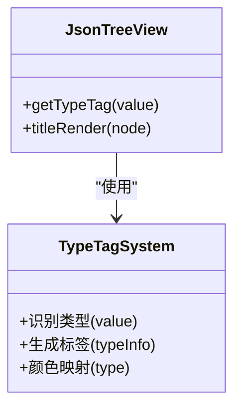
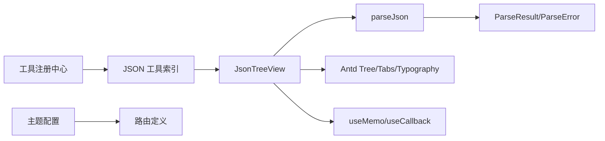

# JSON树形视图

<cite>
**本文引用的文件**
- [src/tools/json/JsonTreeView/index.tsx](file://src/tools/json/JsonTreeView/index.tsx)
- [src/utils/json.ts](file://src/utils/json.ts)
- [src/tools/json/JsonFormatter/index.tsx](file://src/tools/json/JsonFormatter/index.tsx)
- [src/tools/json/index.tsx](file://src/tools/json/index.tsx)
- [src/tools/registry.ts](file://src/tools/registry.ts)
- [src/routes.tsx](file://src/routes.tsx)
- [src/tools/types.ts](file://src/tools/types.ts)
- [src/styles/theme.ts](file://src/styles/theme.ts)
- [package.json](file://package.json)
</cite>

## 目录
1. [简介](#简介)
2. [项目结构](#项目结构)
3. [核心组件](#核心组件)
4. [架构总览](#架构总览)
5. [详细组件分析](#详细组件分析)
6. [依赖关系分析](#依赖关系分析)
7. [性能考虑](#性能考虑)
8. [故障排查指南](#故障排查指南)
9. [结论](#结论)
10. [附录](#附录)

## 简介
本文件为“JSON树形视图”组件的详细技术文档，聚焦于以下方面：
- 树形结构生成算法：递归遍历、节点层级计算、类型判断与标签渲染
- 节点展开/折叠：状态管理、交互行为与性能优化策略
- 路径复制功能：路径生成算法、剪贴板写入与用户体验优化
- 类型标签显示系统：数据类型识别、图标映射与颜色编码
- 使用示例与API参考：包含大数据集处理与内存优化建议

该组件基于React与Ant Design实现，采用受控组件模式管理树节点展开状态，并通过自定义解析器与类型标签系统提供直观的数据结构可视化。

## 项目结构
JSON树形视图位于工具模块的JSON子目录中，配合通用JSON工具与路由注册机制共同构成工具集合。

图表来源
- [src/tools/json/JsonTreeView/index.tsx:1-248](file://src/tools/json/JsonTreeView/index.tsx#L1-L248)
- [src/tools/json/JsonFormatter/index.tsx:1-267](file://src/tools/json/JsonFormatter/index.tsx#L1-L267)
- [src/tools/json/index.tsx:1-27](file://src/tools/json/index.tsx#L1-L27)
- [src/tools/registry.ts:1-39](file://src/tools/registry.ts#L1-L39)
- [src/routes.tsx:1-29](file://src/routes.tsx#L1-L29)
- [src/tools/types.ts:1-20](file://src/tools/types.ts#L1-L20)
- [src/styles/theme.ts:1-12](file://src/styles/theme.ts#L1-L12)

章节来源
- [src/tools/json/JsonTreeView/index.tsx:1-248](file://src/tools/json/JsonTreeView/index.tsx#L1-L248)
- [src/tools/json/JsonFormatter/index.tsx:1-267](file://src/tools/json/JsonFormatter/index.tsx#L1-L267)
- [src/tools/json/index.tsx:1-27](file://src/tools/json/index.tsx#L1-L27)
- [src/tools/registry.ts:1-39](file://src/tools/registry.ts#L1-L39)
- [src/routes.tsx:1-29](file://src/routes.tsx#L1-L29)
- [src/tools/types.ts:1-20](file://src/tools/types.ts#L1-L20)
- [src/styles/theme.ts:1-12](file://src/styles/theme.ts#L1-L12)

## 核心组件
- JsonTreeView：负责将任意JSON数据转换为树形结构，支持展开/折叠、复制节点路径、错误提示与自动展开根节点。
- JsonFormatter：提供JSON美化、压缩、校验与统计信息展示，作为对比参考。
- JSON工具索引与注册：声明工具元数据、路由路径与懒加载组件，统一接入应用路由。
- 通用JSON工具函数：提供安全解析、格式化、压缩与统计能力。

章节来源
- [src/tools/json/JsonTreeView/index.tsx:117-248](file://src/tools/json/JsonTreeView/index.tsx#L117-L248)
- [src/tools/json/JsonFormatter/index.tsx:45-267](file://src/tools/json/JsonFormatter/index.tsx#L45-L267)
- [src/tools/json/index.tsx:5-26](file://src/tools/json/index.tsx#L5-L26)
- [src/utils/json.ts:14-116](file://src/utils/json.ts#L14-L116)

## 架构总览
下图展示了从用户输入到树形渲染的端到端流程，以及与通用工具函数的协作关系。

图表来源
- [src/tools/json/JsonTreeView/index.tsx:117-248](file://src/tools/json/JsonTreeView/index.tsx#L117-L248)
- [src/utils/json.ts:14-38](file://src/utils/json.ts#L14-L38)

## 详细组件分析

### 树形结构生成算法
- 递归遍历与节点层级计算
  - 对任意值进行类型判断：null、数组、对象、基本类型
  - 数组与对象分别递归其元素/键值对，形成层级路径
  - 叶子节点标记为isLeaf，非叶子节点包含children
- 路径生成规则
  - 根节点key为固定标识；数组元素使用“[索引]”形式，对象键使用“.键名”形式
  - 路径用于展开状态管理、复制路径与定位节点
- 类型标签渲染
  - 通过类型判断函数生成带颜色的标签，直观显示数据类型与长度（如数组长度）

图表来源
- [src/tools/json/JsonTreeView/index.tsx:54-101](file://src/tools/json/JsonTreeView/index.tsx#L54-L101)

章节来源
- [src/tools/json/JsonTreeView/index.tsx:36-101](file://src/tools/json/JsonTreeView/index.tsx#L36-L101)

### 节点展开/折叠功能
- 状态管理
  - 使用受控属性控制expandedKeys，确保展开状态与UI一致
  - 提供“全部展开/全部折叠”快捷操作
- 自动展开根节点
  - 首次有效解析成功时自动展开根节点，提升初始体验
- 性能优化策略
  - 使用useMemo缓存解析结果与树数据，避免重复计算
  - 使用useCallback缓存事件处理器，减少子组件重渲染
  - 仅在树数据变化时重新计算所有可展开键列表

图表来源
- [src/tools/json/JsonTreeView/index.tsx:117-160](file://src/tools/json/JsonTreeView/index.tsx#L117-L160)
- [src/tools/json/JsonTreeView/index.tsx:136-142](file://src/tools/json/JsonTreeView/index.tsx#L136-L142)

章节来源
- [src/tools/json/JsonTreeView/index.tsx:117-160](file://src/tools/json/JsonTreeView/index.tsx#L117-L160)
- [src/tools/json/JsonTreeView/index.tsx:134-142](file://src/tools/json/JsonTreeView/index.tsx#L134-L142)

### 路径复制功能
- 路径生成算法
  - 将内部路径key转换为用户友好的表达式：去除前缀“root.”，空路径表示根节点“$”
- 剪贴板写入
  - 使用浏览器剪贴板API写入路径字符串
  - 成功后通过消息提示反馈用户
- 用户体验优化
  - 在树节点标题右侧提供复制按钮，点击不触发节点展开
  - 提供明确的成功提示，便于用户确认

图表来源
- [src/tools/json/JsonTreeView/index.tsx:144-152](file://src/tools/json/JsonTreeView/index.tsx#L144-L152)
- [src/tools/json/JsonTreeView/index.tsx:226-233](file://src/tools/json/JsonTreeView/index.tsx#L226-L233)

章节来源
- [src/tools/json/JsonTreeView/index.tsx:144-152](file://src/tools/json/JsonTreeView/index.tsx#L144-L152)
- [src/tools/json/JsonTreeView/index.tsx:226-233](file://src/tools/json/JsonTreeView/index.tsx#L226-L233)

### 类型标签显示系统
- 数据类型识别
  - null、数组、对象、基本类型（string/number/boolean）分别识别
  - 数组与对象显示长度或键数量，增强信息密度
- 图标映射与颜色编码
  - 不同类型对应不同颜色标签，便于快速区分
  - 标签内包含类型名称与附加信息（如数组长度）
- 视觉设计
  - 标签与键名、值文本组合在同一行，保持紧凑布局
  - 使用Ant Design的Typography组件保证一致性

图表来源
- [src/tools/json/JsonTreeView/index.tsx:36-52](file://src/tools/json/JsonTreeView/index.tsx#L36-L52)
- [src/tools/json/JsonTreeView/index.tsx:221-234](file://src/tools/json/JsonTreeView/index.tsx#L221-L234)

章节来源
- [src/tools/json/JsonTreeView/index.tsx:36-52](file://src/tools/json/JsonTreeView/index.tsx#L36-L52)
- [src/tools/json/JsonTreeView/index.tsx:221-234](file://src/tools/json/JsonTreeView/index.tsx#L221-L234)

### API参考与使用示例
- 组件入口
  - 工具注册：在JSON工具索引中声明“JSON 树形视图”，设置路由路径与懒加载组件
  - 路由接入：通过工具注册中心与路由定义统一挂载
- 关键属性与方法
  - 输入框：支持多行文本输入，Monospace字体便于对齐
  - 树形视图：支持展开/折叠、线性连接、自定义标题渲染
  - 操作按钮：全部展开、全部折叠
  - 错误提示：语法错误时显示错误信息与位置
- 使用示例
  - 在左侧输入框粘贴任意JSON，右侧树形视图自动渲染
  - 点击节点标题右侧复制按钮，复制对应的路径表达式
  - 使用“全部展开/全部折叠”快速浏览大结构

章节来源
- [src/tools/json/index.tsx:16-26](file://src/tools/json/index.tsx#L16-L26)
- [src/tools/registry.ts:25-27](file://src/tools/registry.ts#L25-L27)
- [src/routes.tsx:6-28](file://src/routes.tsx#L6-L28)
- [src/tools/json/JsonTreeView/index.tsx:117-248](file://src/tools/json/JsonTreeView/index.tsx#L117-L248)

## 依赖关系分析
- 组件依赖
  - JsonTreeView依赖parseJson进行安全解析，依赖Ant Design Tree与Typography组件
  - 通过useMemo/useCallback优化渲染与事件处理
- 工具函数依赖
  - parseJson返回统一的结果接口，包含成功/失败与位置信息
  - formatJson/compressJson用于对比与统计
- 应用集成
  - 工具索引与注册中心统一管理工具元数据与路由
  - 主题配置影响整体视觉风格

图表来源
- [src/tools/json/JsonTreeView/index.tsx:1-24](file://src/tools/json/JsonTreeView/index.tsx#L1-L24)
- [src/utils/json.ts:1-38](file://src/utils/json.ts#L1-L38)
- [src/tools/registry.ts:1-39](file://src/tools/registry.ts#L1-L39)
- [src/tools/json/index.tsx:1-27](file://src/tools/json/index.tsx#L1-L27)
- [src/styles/theme.ts:1-12](file://src/styles/theme.ts#L1-L12)

章节来源
- [src/tools/json/JsonTreeView/index.tsx:1-24](file://src/tools/json/JsonTreeView/index.tsx#L1-L24)
- [src/utils/json.ts:1-38](file://src/utils/json.ts#L1-L38)
- [src/tools/registry.ts:1-39](file://src/tools/registry.ts#L1-L39)
- [src/tools/json/index.tsx:1-27](file://src/tools/json/index.tsx#L1-L27)
- [src/styles/theme.ts:1-12](file://src/styles/theme.ts#L1-L12)

## 性能考虑
- 计算复杂度
  - 树构建：O(N)，N为节点总数（键值对与数组元素之和）
  - 展开状态：使用键列表维护，展开/折叠为O(M)，M为当前展开节点数
- 内存优化
  - 使用useMemo缓存解析与树数据，避免重复解析与重建
  - 仅在输入变化时重新计算expandedKeys与树数据
  - 对超大JSON建议先压缩或分页展示，必要时采用虚拟滚动（当前实现未包含）
- 交互优化
  - 受控组件避免状态漂移
  - 事件处理器使用useCallback减少重渲染
  - 错误信息即时清除，避免阻塞后续输入

[本节为通用性能讨论，无需特定文件引用]

## 故障排查指南
- JSON解析失败
  - 现象：右侧显示错误信息，无树形结构
  - 处理：根据错误位置信息修正JSON语法；可使用“JSON 格式化”工具辅助校验
- 路径复制失败
  - 现象：复制按钮点击无响应或提示失败
  - 处理：检查浏览器剪贴板权限；确保在受支持的上下文中运行
- 展开/折叠异常
  - 现象：点击无效或状态不同步
  - 处理：确认expandedKeys受控属性是否被正确更新；避免直接修改内部状态

章节来源
- [src/tools/json/JsonTreeView/index.tsx:174-183](file://src/tools/json/JsonTreeView/index.tsx#L174-L183)
- [src/utils/json.ts:14-38](file://src/utils/json.ts#L14-L38)

## 结论
JSON树形视图组件通过简洁的递归构建算法与受控状态管理，实现了对任意JSON数据的高效可视化。结合类型标签系统与路径复制功能，显著提升了调试与分析效率。配合工具注册与路由机制，可无缝融入应用生态。对于超大JSON，建议结合压缩、分页或虚拟滚动等策略进一步优化性能。

[本节为总结性内容，无需特定文件引用]

## 附录
- 相关工具对比
  - “JSON 格式化”提供美化、压缩与统计，适合预处理与验证
  - “JSON 树形视图”强调结构化浏览与路径导航
- 依赖项
  - Ant Design、@ant-design/icons、React、React Router等

章节来源
- [src/tools/json/JsonFormatter/index.tsx:1-267](file://src/tools/json/JsonFormatter/index.tsx#L1-L267)
- [package.json:12-24](file://package.json#L12-L24)