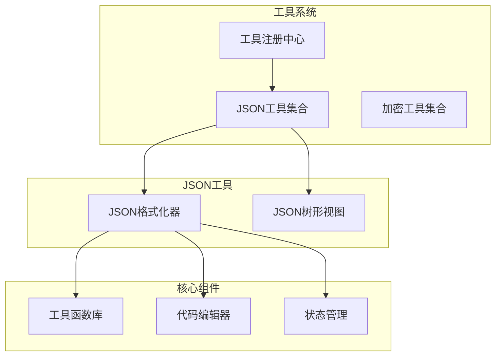
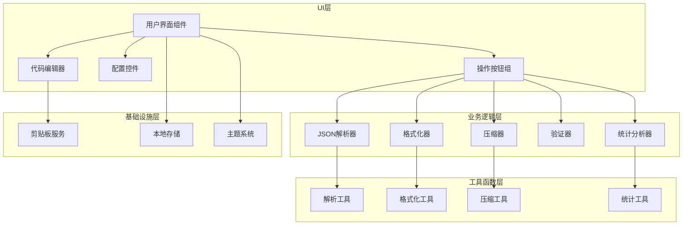
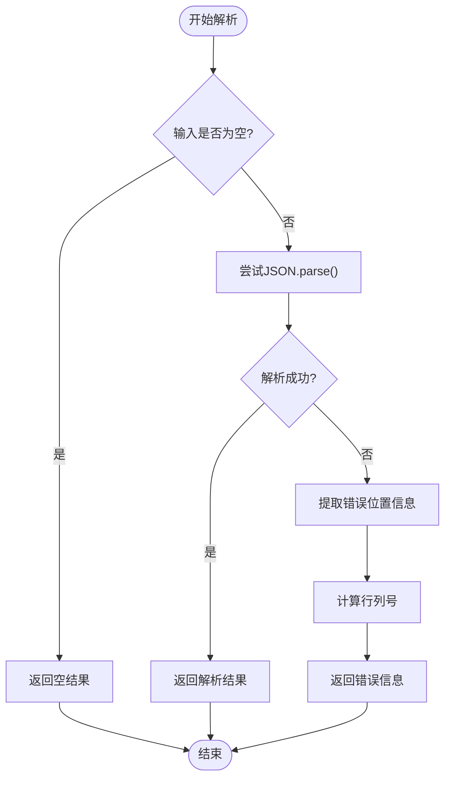
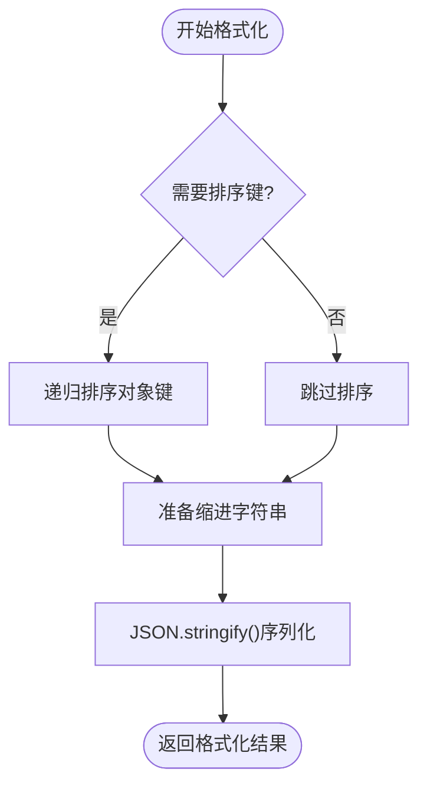
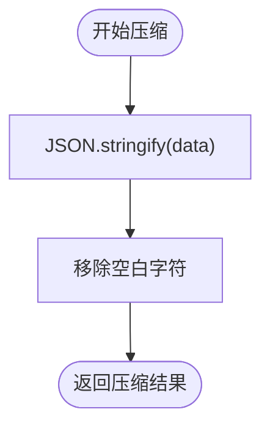
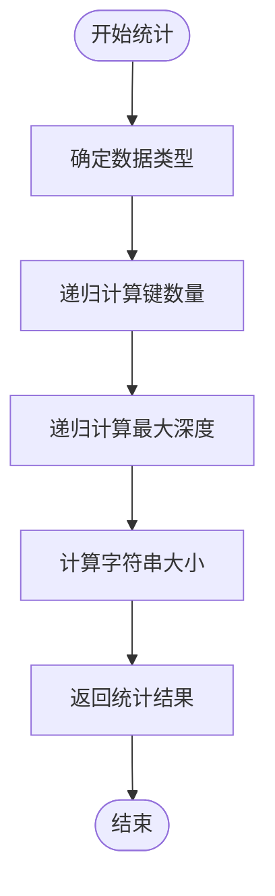
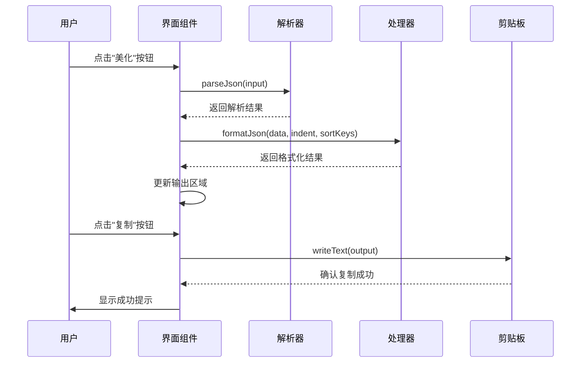
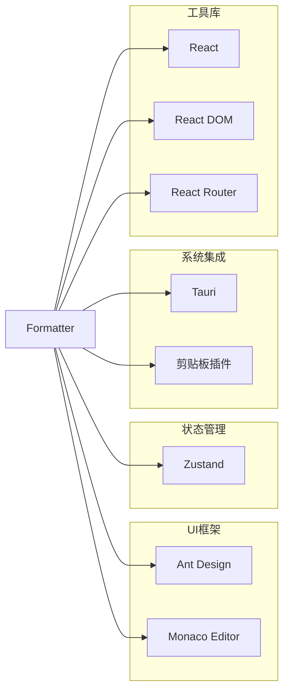
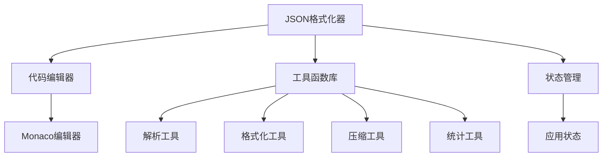
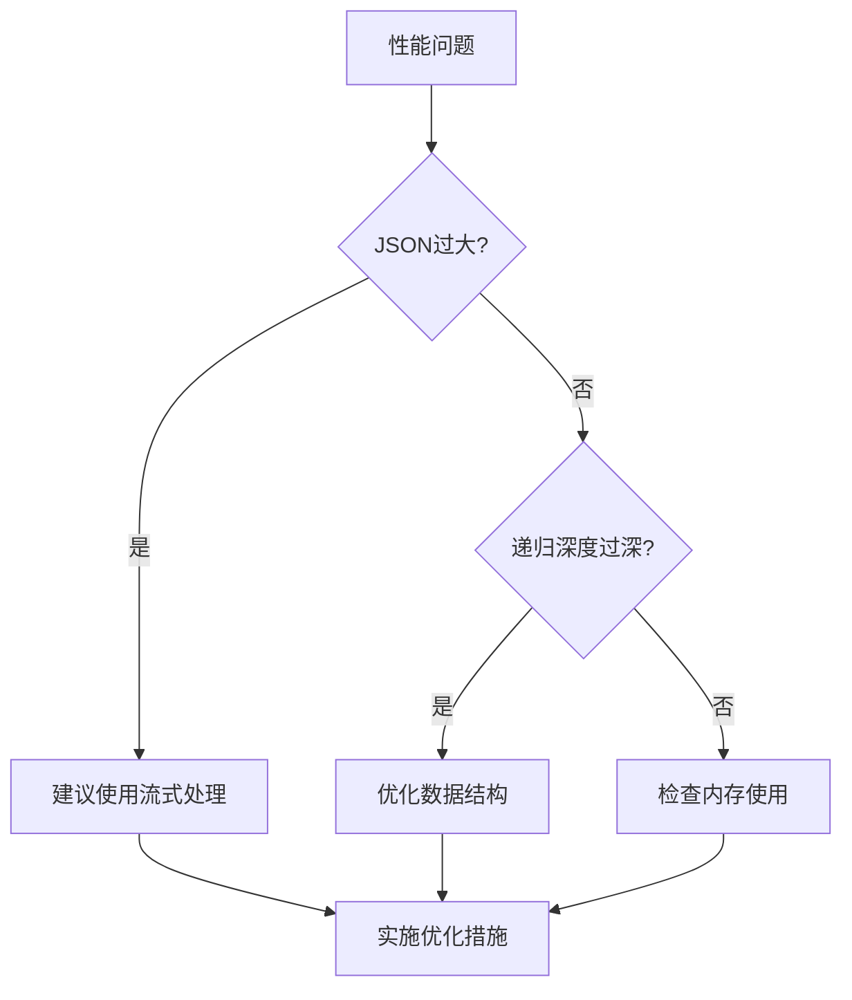

# JSON格式化器

<cite>
**本文档引用的文件**
- [src/tools/json/JsonFormatter/index.tsx](file://src/tools/json/JsonFormatter/index.tsx)
- [src/utils/json.ts](file://src/utils/json.ts)
- [src/components/CodeEditor/index.tsx](file://src/components/CodeEditor/index.tsx)
- [src/tools/json/index.tsx](file://src/tools/json/index.tsx)
- [src/routes.tsx](file://src/routes.tsx)
- [src/store/useAppStore.ts](file://src/store/useAppStore.ts)
- [package.json](file://package.json)
</cite>

## 目录
1. [简介](#简介)
2. [项目结构](#项目结构)
3. [核心组件](#核心组件)
4. [架构概览](#架构概览)
5. [详细组件分析](#详细组件分析)
6. [依赖关系分析](#依赖关系分析)
7. [性能考虑](#性能考虑)
8. [故障排除指南](#故障排除指南)
9. [结论](#结论)
10. [附录](#附录)

## 简介

JSON格式化器是一个功能完整的JSON数据处理工具，提供美化、压缩、验证三大核心功能。该组件基于React和Ant Design构建，集成了Monaco编辑器提供专业的代码编辑体验，并支持剪贴板集成、统计信息显示等高级特性。

该工具的主要目标是为开发者提供一个直观、高效的JSON数据处理解决方案，支持多种缩进格式、键排序选项，并提供详细的错误处理和统计信息反馈。

## 项目结构

JSON格式化器位于工具系统的核心位置，采用模块化的组织方式：



**图表来源**
- [src/tools/registry.ts:1-39](file://src/tools/registry.ts#L1-L39)
- [src/tools/json/index.tsx:1-27](file://src/tools/json/index.tsx#L1-L27)

**章节来源**
- [src/tools/registry.ts:1-39](file://src/tools/registry.ts#L1-L39)
- [src/tools/json/index.tsx:1-27](file://src/tools/json/index.tsx#L1-L27)

## 核心组件

### JSON格式化器组件

JSON格式化器组件是整个工具的核心，负责协调所有功能模块的工作。该组件使用React Hooks进行状态管理，提供了完整的用户交互界面。

#### 主要功能特性

1. **多模式处理能力**：支持美化、压缩、验证三种不同的JSON处理模式
2. **灵活的缩进控制**：支持2空格、4空格、Tab三种缩进格式
3. **键排序选项**：可选的键值排序功能，便于数据比较和版本控制
4. **实时统计信息**：显示JSON数据的类型、键数量、深度和大小信息
5. **剪贴板集成**：一键复制处理结果到系统剪贴板
6. **错误处理机制**：提供详细的语法错误定位和友好提示

#### 组件状态管理

组件维护以下关键状态：

- `input`: 用户输入的原始JSON字符串
- `output`: 处理后的JSON输出结果
- `error`: 错误信息状态
- `indent`: 缩进类型选择（2、4或Tab）
- `sortKeys`: 键排序开关状态
- `stats`: 统计信息显示内容

**章节来源**
- [src/tools/json/JsonFormatter/index.tsx:45-147](file://src/tools/json/JsonFormatter/index.tsx#L45-L147)

## 架构概览

JSON格式化器采用分层架构设计，各层职责明确，耦合度低：



**图表来源**
- [src/tools/json/JsonFormatter/index.tsx:1-267](file://src/tools/json/JsonFormatter/index.tsx#L1-L267)
- [src/utils/json.ts:1-116](file://src/utils/json.ts#L1-L116)

## 详细组件分析

### 解析器组件 (parseJson)

解析器负责将输入的JSON字符串转换为JavaScript对象，同时提供详细的错误信息。

#### 实现原理

解析器使用原生的`JSON.parse()`方法进行解析，并通过正则表达式提取错误位置信息：



**图表来源**
- [src/utils/json.ts:14-38](file://src/utils/json.ts#L14-L38)

#### 错误处理机制

解析器能够捕获并处理各种JSON解析错误，包括：
- 语法错误：提供精确的行列号定位
- 格式错误：友好的错误消息提示
- 编码错误：字符编码问题处理

**章节来源**
- [src/utils/json.ts:14-38](file://src/utils/json.ts#L14-L38)

### 格式化器组件 (formatJson)

格式化器负责将JavaScript对象转换为美观的JSON字符串，支持多种缩进格式和键排序选项。

#### 实现原理

格式化器的核心逻辑包括键排序和字符串化两个步骤：



**图表来源**
- [src/utils/json.ts:40-48](file://src/utils/json.ts#L40-L48)

#### 缩进类型支持

格式化器支持三种缩进类型：
- 数字缩进：2或4个空格
- Tab缩进：单个制表符
- 自动检测：根据用户偏好设置

**章节来源**
- [src/utils/json.ts:40-48](file://src/utils/json.ts#L40-L48)

### 压缩器组件 (compressJson)

压缩器负责移除JSON中的空白字符，生成最紧凑的JSON表示形式。

#### 实现原理

压缩器使用`JSON.stringify()`的默认行为，不传递任何参数来移除所有不必要的空白字符：



**图表来源**
- [src/utils/json.ts:50-52](file://src/utils/json.ts#L50-L52)

#### 性能特点

压缩器具有以下性能优势：
- 时间复杂度：O(n)，其中n为JSON数据的长度
- 空间复杂度：O(n)，用于存储压缩后的字符串
- 内存效率：直接使用原生JSON序列化，避免额外的内存分配

**章节来源**
- [src/utils/json.ts:50-52](file://src/utils/json.ts#L50-L52)

### 统计分析器组件 (getJsonStats)

统计分析器提供JSON数据的详细分析信息，包括类型、键数量、深度和大小等指标。

#### 实现原理

统计分析器通过递归遍历JSON数据结构来收集统计信息：



**图表来源**
- [src/utils/json.ts:71-91](file://src/utils/json.ts#L71-L91)

#### 统计指标说明

统计分析器提供以下关键指标：
- **类型识别**：区分Object、Array、Null、基本类型
- **键数量**：统计所有嵌套对象的键总数
- **最大深度**：计算JSON结构的最大嵌套层级
- **字符串大小**：测量JSON字符串的字节数

**章节来源**
- [src/utils/json.ts:71-116](file://src/utils/json.ts#L71-L116)

### 用户界面组件

用户界面采用现代化的设计理念，提供直观的操作体验：

#### 按钮操作流程



**图表来源**
- [src/tools/json/JsonFormatter/index.tsx:53-140](file://src/tools/json/JsonFormatter/index.tsx#L53-L140)

#### 交互特性

界面组件提供以下交互特性：
- **实时预览**：输入变化时自动更新统计信息
- **错误高亮**：语法错误时提供视觉反馈
- **快捷操作**：支持键盘快捷键和鼠标操作
- **响应式设计**：适配不同屏幕尺寸

**章节来源**
- [src/tools/json/JsonFormatter/index.tsx:158-266](file://src/tools/json/JsonFormatter/index.tsx#L158-L266)

## 依赖关系分析

### 外部依赖

JSON格式化器依赖以下关键外部库：



**图表来源**
- [package.json:12-25](file://package.json#L12-L25)

### 内部依赖关系

组件间的依赖关系清晰明确：



**图表来源**
- [src/tools/json/JsonFormatter/index.tsx:1-30](file://src/tools/json/JsonFormatter/index.tsx#L1-L30)
- [src/utils/json.ts:1-116](file://src/utils/json.ts#L1-L116)

**章节来源**
- [package.json:12-25](file://package.json#L12-L25)

## 性能考虑

### 时间复杂度分析

- **解析阶段**：O(n)，其中n为输入字符串长度
- **格式化阶段**：O(n)，需要遍历整个JSON结构
- **压缩阶段**：O(n)，与格式化相同
- **统计分析**：O(n)，需要访问每个节点

### 空间复杂度分析

- **内存使用**：O(n)，存储解析后的JavaScript对象
- **输出缓冲**：O(n)，存储最终的字符串结果
- **递归深度**：O(d)，其中d为JSON的最大嵌套深度

### 优化策略

1. **增量更新**：仅在输入变化时重新计算
2. **缓存机制**：对重复的计算结果进行缓存
3. **流式处理**：对于超大JSON文件考虑流式处理方案
4. **虚拟滚动**：在大量数据情况下使用虚拟滚动优化渲染

## 故障排除指南

### 常见问题及解决方案

#### 解析错误处理

当遇到JSON解析错误时，系统会提供详细的错误信息：

| 错误类型 | 可能原因 | 解决方案 |
|---------|---------|---------|
| 语法错误 | 缺少引号、逗号、括号不匹配 | 使用编辑器的语法高亮功能检查 |
| 编码错误 | 包含非法Unicode字符 | 检查字符编码设置 |
| 超长字符串 | JSON过大导致内存不足 | 分批处理或使用流式解析 |

#### 性能问题诊断



#### 用户界面问题

- **编辑器无响应**：检查浏览器兼容性和内存限制
- **按钮点击无效**：确认网络权限和剪贴板访问权限
- **样式显示异常**：检查主题设置和CSS加载状态

**章节来源**
- [src/tools/json/JsonFormatter/index.tsx:217-226](file://src/tools/json/JsonFormatter/index.tsx#L217-L226)

## 结论

JSON格式化器是一个设计精良、功能完整的工具组件，具有以下显著特点：

1. **功能完整性**：提供美化、压缩、验证三大核心功能
2. **用户体验优秀**：直观的界面设计和流畅的交互体验
3. **技术实现先进**：采用现代React开发模式和最佳实践
4. **扩展性强**：模块化设计便于功能扩展和维护

该组件为开发者提供了一个高效、可靠的JSON数据处理解决方案，适用于各种应用场景，从简单的数据格式化到复杂的批量处理任务。

## 附录

### API参考

#### 核心函数接口

| 函数名 | 参数类型 | 返回值 | 描述 |
|-------|---------|--------|------|
| `parseJson` | `string` | `JsonParseResult` | 解析JSON字符串 |
| `formatJson` | `unknown, number \| "tab", boolean` | `string` | 格式化JSON对象 |
| `compressJson` | `unknown` | `string` | 压缩JSON对象 |
| `getJsonStats` | `unknown` | `StatsResult` | 获取JSON统计信息 |

#### 状态类型定义

```typescript
interface ParseResult {
  success: true;
  data: unknown;
}

interface ParseError {
  success: false;
  message: string;
  position?: { line: number; column: number };
}

interface StatsResult {
  type: string;
  keys: number;
  depth: number;
  size: number;
}
```

### 使用示例

#### 基本用法

```javascript
// 美化JSON
const input = '{"name":"test","value":123}';
const result = formatJson(JSON.parse(input), 2, true);
console.log(result);

// 压缩JSON
const compressed = compressJson(JSON.parse(input));
console.log(compressed.length); // 输出压缩后的长度
```

#### 错误处理示例

```javascript
const input = '{"invalid":json}';
const result = parseJson(input);

if (!result.success) {
  console.log(`解析错误: ${result.message}`);
  if (result.position) {
    console.log(`位置: 第${result.position.line}行, 第${result.position.column}列`);
  }
}
```

### 最佳实践

1. **输入验证**：始终先验证输入的有效性
2. **错误处理**：妥善处理解析和格式化过程中的异常
3. **性能监控**：对大型JSON数据进行性能监控
4. **用户体验**：提供清晰的反馈和进度指示
5. **安全性**：注意处理不受信任的JSON输入