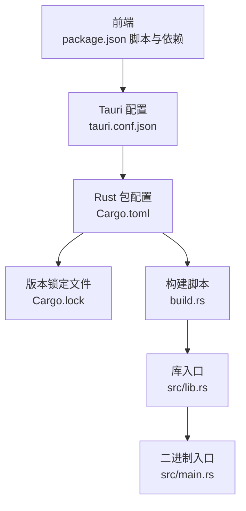
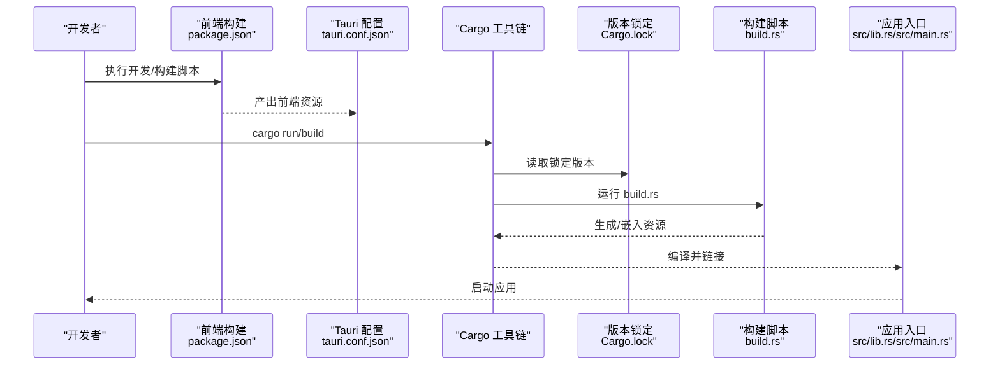
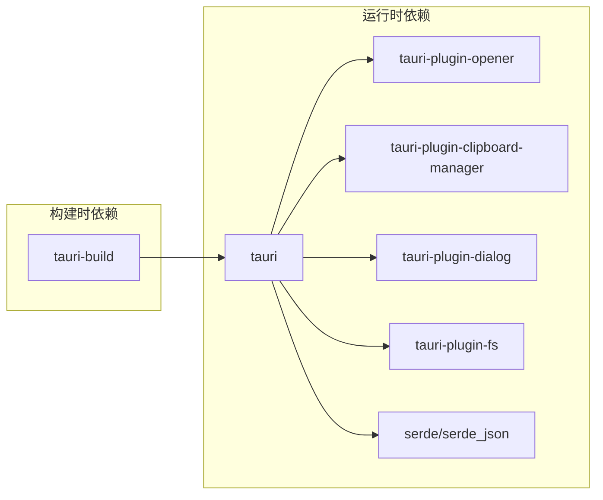

# Cargo依赖管理

<cite>
**本文引用的文件**
- [Cargo.toml](file://src-tauri/Cargo.toml)
- [Cargo.lock](file://src-tauri/Cargo.lock)
- [build.rs](file://src-tauri/build.rs)
- [lib.rs](file://src-tauri/src/lib.rs)
- [main.rs](file://src-tauri/src/main.rs)
- [tauri.conf.json](file://src-tauri/tauri.conf.json)
- [package.json](file://package.json)
</cite>

## 目录
1. [简介](#简介)
2. [项目结构](#项目结构)
3. [核心组件](#核心组件)
4. [架构总览](#架构总览)
5. [详细组件分析](#详细组件分析)
6. [依赖分析](#依赖分析)
7. [性能考虑](#性能考虑)
8. [故障排除指南](#故障排除指南)
9. [结论](#结论)
10. [附录](#附录)

## 简介
本文件系统性梳理了本项目中基于 Tauri 的 Rust 后端（src-tauri）的 Cargo 依赖管理体系，重点覆盖以下方面：
- Cargo.toml 中依赖分类与配置：必需依赖、可选依赖、构建时依赖与开发时依赖的边界与作用。
- Cargo.lock 的版本锁定机制与一致性保障。
- build.rs 构建脚本的功能与条件编译实践。
- 依赖更新策略、版本管理最佳实践与构建优化建议。
本指南兼顾工程落地与可操作性，帮助读者在不深入阅读源码的前提下掌握关键流程与注意事项。

## 项目结构
本项目采用“前端 + Tauri/Rust 后端”的双层架构。与 Cargo 依赖管理直接相关的关键位置如下：
- 前端：package.json 定义了前端依赖与脚本，用于开发与打包。
- 后端：src-tauri 下包含 Cargo.toml、Cargo.lock、build.rs、src/lib.rs、src/main.rs 等，负责应用的原生能力与打包。
- 配置：tauri.conf.json 提供应用窗口、安全策略、打包目标等配置，间接影响后端构建行为。

图表来源
- [package.json:1-36](file://package.json#L1-L36)
- [tauri.conf.json:1-39](file://src-tauri/tauri.conf.json#L1-L39)
- [Cargo.toml:1-23](file://src-tauri/Cargo.toml#L1-L23)
- [Cargo.lock:1-800](file://src-tauri/Cargo.lock#L1-L800)
- [build.rs:1-4](file://src-tauri/build.rs#L1-L4)
- [lib.rs:1-11](file://src-tauri/src/lib.rs#L1-L11)
- [main.rs:1-6](file://src-tauri/src/main.rs#L1-L6)

章节来源
- [package.json:1-36](file://package.json#L1-L36)
- [tauri.conf.json:1-39](file://src-tauri/tauri.conf.json#L1-L39)
- [Cargo.toml:1-23](file://src-tauri/Cargo.toml#L1-L23)

## 核心组件
- Cargo.toml：定义包元数据、库类型、依赖分类与版本约束；声明构建时依赖（build-dependencies）与运行时依赖（dependencies）。
- Cargo.lock：记录所有依赖的精确版本与校验和，确保跨环境一致的构建结果。
- build.rs：最小化构建脚本，委托 tauri_build 完成资源嵌入与能力生成。
- src/lib.rs 与 src/main.rs：库入口导出 run 函数，二进制入口调用该函数启动应用。

章节来源
- [Cargo.toml:1-23](file://src-tauri/Cargo.toml#L1-L23)
- [Cargo.lock:1-800](file://src-tauri/Cargo.lock#L1-L800)
- [build.rs:1-4](file://src-tauri/build.rs#L1-L4)
- [lib.rs:1-11](file://src-tauri/src/lib.rs#L1-L11)
- [main.rs:1-6](file://src-tauri/src/main.rs#L1-L6)

## 架构总览
下图展示了从前端到后端、再到构建与锁定的整体流程：

图表来源
- [package.json:6-11](file://package.json#L6-L11)
- [tauri.conf.json:5-10](file://src-tauri/tauri.conf.json#L5-L10)
- [Cargo.toml:12-23](file://src-tauri/Cargo.toml#L12-L23)
- [Cargo.lock:1-800](file://src-tauri/Cargo.lock#L1-L800)
- [build.rs:1-4](file://src-tauri/build.rs#L1-L4)
- [lib.rs:2-10](file://src-tauri/src/lib.rs#L2-L10)
- [main.rs:3-5](file://src-tauri/src/main.rs#L3-L5)

## 详细组件分析

### Cargo.toml 依赖配置解析
- 包元数据与库类型
  - 包名、版本、描述、作者、发布版式等元信息。
  - 库类型包含 staticlib、cdylib、rlib，便于多场景复用与打包。
- 构建时依赖（build-dependencies）
  - 使用 tauri-build，用于在构建阶段生成/嵌入能力与资源，避免运行时开销。
- 运行时依赖（dependencies）
  - tauri：框架核心。
  - tauri-plugin-*：按需启用功能插件（如 opener、clipboard-manager、dialog、fs）。
  - serde/serde_json：序列化与反序列化支持。
- 版本约束策略
  - 大版本固定（如 "2"），保持兼容的同时允许小版本更新；对 serde 使用语义化版本约束并开启 derive 特性。

章节来源
- [Cargo.toml:1-23](file://src-tauri/Cargo.toml#L1-L23)

### Cargo.lock 锁定机制与一致性
- 自动生成与不可手动编辑
  - 文件头部注释明确由 Cargo 自动生成，用于保证跨主机、跨 CI 的可重复构建。
- 结构要点
  - version 字段标识锁文件格式版本。
  - [[package]] 条目记录名称、版本、来源索引与校验和，确保依赖完整性与防篡改。
- 与 Cargo.toml 的协作
  - Cargo 在解析依赖时会根据 Cargo.toml 的约束选择满足条件的版本，并写入 Cargo.lock 的精确版本与依赖树。
  - 本地与 CI 均使用 Cargo.lock 进行安装，避免“依赖漂移”。

章节来源
- [Cargo.lock:1-800](file://src-tauri/Cargo.lock#L1-L800)

### build.rs 构建脚本与条件编译
- 最简实现
  - 仅一行调用 tauri_build::build，完成资源嵌入、能力生成与平台适配。
- 条件编译与平台特定配置
  - 通过 tauri_build 的特性与配置，自动处理不同平台（Windows/macOS/Linux）下的资源打包与能力清单。
- 自定义构建逻辑
  - 可扩展为读取环境变量、注入构建标志、生成/拷贝资源文件等，但当前仓库未实现额外逻辑。

章节来源
- [build.rs:1-4](file://src-tauri/build.rs#L1-L4)

### 应用入口与插件加载
- 库入口 run 函数
  - 默认构建器初始化，按顺序注册各插件（opener、clipboard-manager、dialog、fs）。
- 二进制入口
  - 调用 run 并传入上下文，启动应用生命周期。
- 插件与能力
  - 插件来源于 Cargo.toml 的运行时依赖，构建阶段由 build.rs 注入到最终二进制中。

章节来源
- [lib.rs:1-11](file://src-tauri/src/lib.rs#L1-L11)
- [main.rs:1-6](file://src-tauri/src/main.rs#L1-L6)

### 与前端及打包配置的协同
- 前端脚本
  - package.json 中的 dev/build 脚本分别对应开发服务器与产物构建，输出目录与 tauri.conf.json 的 frontendDist 对齐。
- Tauri 配置
  - tauri.conf.json 指定开发前命令、前端产物目录、窗口尺寸与打包图标等，直接影响构建流程与最终产物。

章节来源
- [package.json:6-11](file://package.json#L6-L11)
- [tauri.conf.json:5-10](file://src-tauri/tauri.conf.json#L5-L10)

## 依赖分析

### 依赖分类与职责
- 必需依赖（运行时）
  - tauri：应用框架与系统集成。
  - tauri-plugin-*：按需功能插件，减少主框架体积。
  - serde/serde_json：数据序列化与 JSON 互操作。
- 构建时依赖
  - tauri-build：在构建期生成/嵌入资源与能力清单。
- 开发时依赖（前端）
  - CLI、TypeScript、Vite 等，用于前端开发与打包。

图表来源
- [Cargo.toml:15-23](file://src-tauri/Cargo.toml#L15-L23)

章节来源
- [Cargo.toml:15-23](file://src-tauri/Cargo.toml#L15-L23)

### 依赖树与版本锁定
- 锁定文件内容结构
  - 每个 [[package]] 记录名称、版本、来源与校验和，形成完整的依赖树快照。
- 与 Cargo.toml 的关系
  - Cargo.toml 决定“可接受范围”，Cargo.lock 决定“最终版本”。
  - 更新依赖时应先修改 Cargo.toml，再执行更新命令生成新的 Cargo.lock。

章节来源
- [Cargo.lock:1-800](file://src-tauri/Cargo.lock#L1-L800)

## 性能考虑
- 依赖精简
  - 仅启用必要的 tauri-plugin-*，降低二进制体积与启动时间。
- 特性开关
  - serde 的 derive 特性可减少样板代码，同时保持序列化性能。
- 构建缓存
  - 充分利用 Cargo 的增量编译与 Cargo.lock 的一致性，避免重复下载与重编译。
- 资源嵌入
  - 通过 tauri_build 将前端产物与资源嵌入二进制，减少运行时 IO 与路径解析成本。

## 故障排除指南
- 依赖冲突或版本不匹配
  - 症状：构建失败或运行时报错。
  - 排查：核对 Cargo.toml 的版本约束与 Cargo.lock 的实际版本是否一致；必要时清理缓存并重新生成锁文件。
- 构建脚本异常
  - 症状：资源未嵌入或能力未生成。
  - 排查：确认 build.rs 是否被正确执行；检查 tauri-build 的版本与配置；验证 tauri.conf.json 的前端产物路径。
- 插件未生效
  - 症状：功能不可用。
  - 排查：确认插件已在 src/lib.rs 中注册；检查 Cargo.toml 中的依赖版本与插件初始化参数。
- 前后端联调问题
  - 症状：开发模式下页面无法访问或构建产物缺失。
  - 排查：核对 package.json 的 dev/build 脚本与 tauri.conf.json 的 beforeDevCommand/beforeBuildCommand、frontendDist 是否一致。

章节来源
- [Cargo.toml:12-23](file://src-tauri/Cargo.toml#L12-L23)
- [build.rs:1-4](file://src-tauri/build.rs#L1-L4)
- [lib.rs:2-10](file://src-tauri/src/lib.rs#L2-L10)
- [tauri.conf.json:5-10](file://src-tauri/tauri.conf.json#L5-L10)
- [package.json:6-11](file://package.json#L6-L11)

## 结论
本项目的 Cargo 依赖管理遵循“最小化构建时依赖、按需启用运行时插件、严格版本锁定”的原则。通过 tauri_build 的自动化能力与 Cargo.lock 的一致性保障，实现了跨环境稳定的构建与部署。建议在后续迭代中持续：
- 保持依赖更新的可控性，优先更新补丁版本，谨慎升级主版本。
- 在 CI 中强制使用 Cargo.lock，确保构建一致性。
- 根据功能演进动态增删插件，避免不必要的体积与启动开销。

## 附录

### 依赖更新与版本管理流程
- 步骤概览
  - 在 Cargo.toml 中调整版本约束或新增依赖。
  - 执行更新命令生成新的 Cargo.lock。
  - 在本地与 CI 中验证构建与功能。
- 注意事项
  - 优先使用语义化版本范围，避免锁定过死导致无法获得安全更新。
  - 对关键依赖进行回归测试，确保兼容性。

章节来源
- [Cargo.toml:15-23](file://src-tauri/Cargo.toml#L15-L23)
- [Cargo.lock:1-800](file://src-tauri/Cargo.lock#L1-L800)