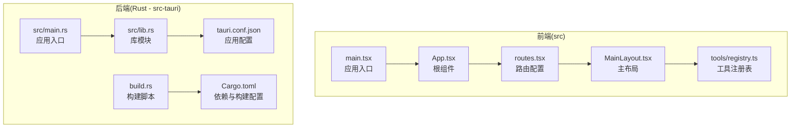
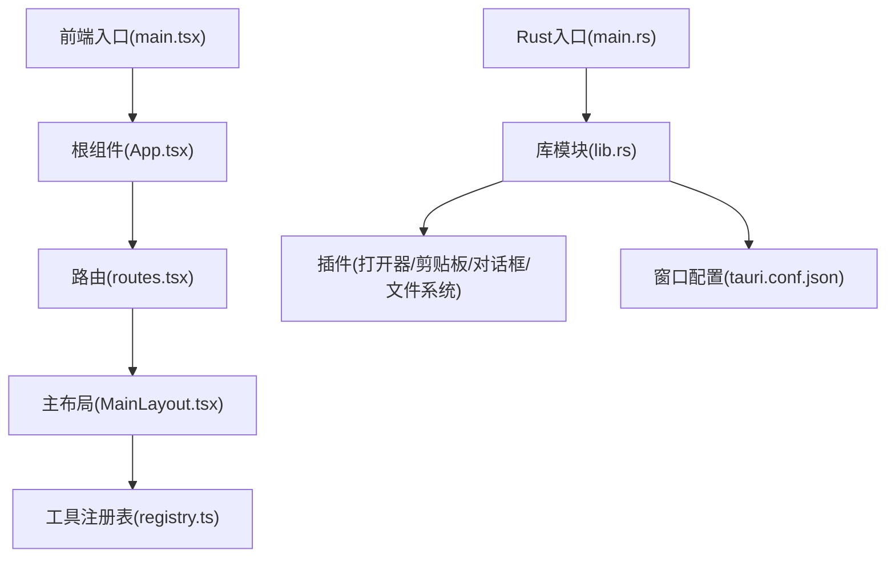
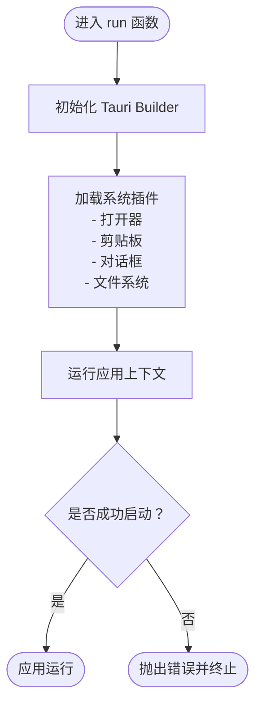
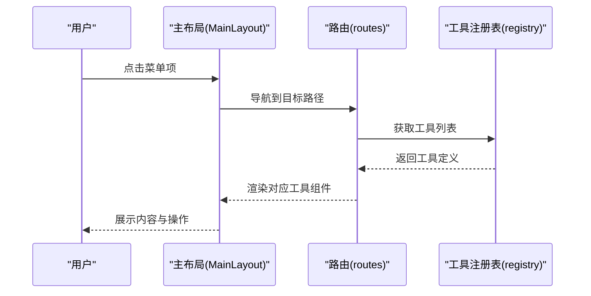
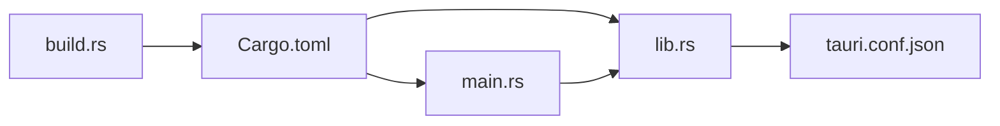

# Rust源代码实现

<cite>
**本文档引用的文件**
- [src-tauri/src/main.rs](file://src-tauri/src/main.rs)
- [src-tauri/src/lib.rs](file://src-tauri/src/lib.rs)
- [src-tauri/Cargo.toml](file://src-tauri/Cargo.toml)
- [src-tauri/tauri.conf.json](file://src-tauri/tauri.conf.json)
- [src-tauri/build.rs](file://src-tauri/build.rs)
- [src/main.tsx](file://src/main.tsx)
- [src/App.tsx](file://src/App.tsx)
- [src/routes.tsx](file://src/routes.tsx)
- [src/layouts/MainLayout.tsx](file://src/layouts/MainLayout.tsx)
- [src/tools/registry.ts](file://src/tools/registry.ts)
</cite>

## 目录
1. [简介](#简介)
2. [项目结构](#项目结构)
3. [核心组件](#核心组件)
4. [架构总览](#架构总览)
5. [详细组件分析](#详细组件分析)
6. [依赖关系分析](#依赖关系分析)
7. [性能考虑](#性能考虑)
8. [故障排除指南](#故障排除指南)
9. [结论](#结论)
10. [附录](#附录)

## 简介
本项目是一个基于 Tauri v2 的跨平台开发者工具箱桌面应用，采用 Rust 实现后端逻辑与系统级能力，前端使用 React + Ant Design 构建用户界面。Rust 模块负责应用初始化、窗口配置与插件加载；前端通过路由与布局组件组织工具页面；工具注册表统一管理各类工具分类与导航。

## 项目结构
项目采用前后端分离的目录组织方式：
- 前端位于 src/ 目录，包含 React 应用、路由、布局、样式与工具集合。
- 后端（Rust）位于 src-tauri/ 目录，包含 Tauri 应用入口、库模块、构建脚本与配置文件。
- 前端开发服务器地址与打包输出路径在 Tauri 配置中定义，确保开发与生产流程一致。

**图表来源**
- [src/main.tsx:1-11](file://src/main.tsx#L1-L11)
- [src/App.tsx:1-24](file://src/App.tsx#L1-L24)
- [src/routes.tsx:1-29](file://src/routes.tsx#L1-L29)
- [src/layouts/MainLayout.tsx:1-168](file://src/layouts/MainLayout.tsx#L1-L168)
- [src/tools/registry.ts:1-39](file://src/tools/registry.ts#L1-L39)
- [src-tauri/src/main.rs:1-6](file://src-tauri/src/main.rs#L1-L6)
- [src-tauri/src/lib.rs:1-11](file://src-tauri/src/lib.rs#L1-L11)
- [src-tauri/tauri.conf.json:1-39](file://src-tauri/tauri.conf.json#L1-L39)
- [src-tauri/build.rs:1-4](file://src-tauri/build.rs#L1-L4)
- [src-tauri/Cargo.toml:1-23](file://src-tauri/Cargo.toml#L1-L23)

**章节来源**
- [src/main.tsx:1-11](file://src/main.tsx#L1-L11)
- [src/App.tsx:1-24](file://src/App.tsx#L1-L24)
- [src/routes.tsx:1-29](file://src/routes.tsx#L1-L29)
- [src/layouts/MainLayout.tsx:1-168](file://src/layouts/MainLayout.tsx#L1-L168)
- [src/tools/registry.ts:1-39](file://src/tools/registry.ts#L1-L39)
- [src-tauri/src/main.rs:1-6](file://src-tauri/src/main.rs#L1-L6)
- [src-tauri/src/lib.rs:1-11](file://src-tauri/src/lib.rs#L1-L11)
- [src-tauri/tauri.conf.json:1-39](file://src-tauri/tauri.conf.json#L1-L39)
- [src-tauri/build.rs:1-4](file://src-tauri/build.rs#L1-L4)
- [src-tauri/Cargo.toml:1-23](file://src-tauri/Cargo.toml#L1-L23)

## 核心组件
- Rust 应用入口：负责调用库模块的 run 函数以启动 Tauri 应用。
- 库模块：集中初始化 Tauri Builder，注册系统级插件（打开器、剪贴板、对话框、文件系统），并运行应用上下文。
- 前端入口：创建 React 根节点并渲染应用。
- 应用根组件：配置 Ant Design 国际化与主题，并包裹路由与布局。
- 路由与布局：动态生成工具路由，提供侧边栏导航与内容区域展示。
- 工具注册表：聚合 JSON 工具与加密工具，按分类组织菜单项。

**章节来源**
- [src-tauri/src/main.rs:3-5](file://src-tauri/src/main.rs#L3-L5)
- [src-tauri/src/lib.rs:2-10](file://src-tauri/src/lib.rs#L2-L10)
- [src/main.tsx:6-10](file://src/main.tsx#L6-L10)
- [src/App.tsx:9-21](file://src/App.tsx#L9-L21)
- [src/routes.tsx:6-28](file://src/routes.tsx#L6-L28)
- [src/layouts/MainLayout.tsx:22-167](file://src/layouts/MainLayout.tsx#L22-L167)
- [src/tools/registry.ts:5-27](file://src/tools/registry.ts#L5-L27)

## 架构总览
下图展示了从前端到后端的关键交互路径：前端通过路由与布局组织页面，工具注册表提供动态菜单；Rust 后端负责窗口初始化与插件加载，最终运行 Tauri 应用。

**图表来源**
- [src/main.tsx:1-11](file://src/main.tsx#L1-L11)
- [src/App.tsx:1-24](file://src/App.tsx#L1-L24)
- [src/routes.tsx:1-29](file://src/routes.tsx#L1-L29)
- [src/layouts/MainLayout.tsx:1-168](file://src/layouts/MainLayout.tsx#L1-L168)
- [src/tools/registry.ts:1-39](file://src/tools/registry.ts#L1-L39)
- [src-tauri/src/main.rs:1-6](file://src-tauri/src/main.rs#L1-L6)
- [src-tauri/src/lib.rs:1-11](file://src-tauri/src/lib.rs#L1-L11)
- [src-tauri/tauri.conf.json:1-39](file://src-tauri/tauri.conf.json#L1-L39)

## 详细组件分析

### Rust 应用入口（src-tauri/src/main.rs）
- 入口函数负责调用库模块的 run 函数，从而启动 Tauri 应用。
- 在非调试模式下设置 Windows 子系统为“windows”，避免控制台窗口弹出。

**章节来源**
- [src-tauri/src/main.rs:1-6](file://src-tauri/src/main.rs#L1-L6)

### 库模块（src-tauri/src/lib.rs）
- 使用默认的 Tauri Builder 初始化应用。
- 注册以下插件：
  - 打开器插件：用于调用系统默认程序或打开外部链接。
  - 剪贴板管理插件：读取/写入系统剪贴板。
  - 对话框插件：显示系统级对话框（如确认、错误提示等）。
  - 文件系统插件：提供安全的文件读写能力。
- 通过生成的应用上下文运行应用，并对错误进行预期处理。

**图表来源**
- [src-tauri/src/lib.rs:2-10](file://src-tauri/src/lib.rs#L2-L10)

**章节来源**
- [src-tauri/src/lib.rs:1-11](file://src-tauri/src/lib.rs#L1-L11)

### 前端入口与根组件（src/main.tsx, src/App.tsx）
- 前端入口负责创建 React 根节点并渲染应用。
- 根组件配置 Ant Design 的中文本地化与主题，包裹路由与主布局，实现全局样式与主题切换。

**章节来源**
- [src/main.tsx:6-10](file://src/main.tsx#L6-L10)
- [src/App.tsx:9-21](file://src/App.tsx#L9-L21)

### 路由与布局（src/routes.tsx, src/layouts/MainLayout.tsx）
- 路由根据工具注册表动态生成页面路径与组件，支持懒加载与回退到首个工具。
- 主布局提供侧边栏导航、头部操作按钮（折叠/展开、明暗主题切换）、内容区与更新日志弹窗。

**图表来源**
- [src/routes.tsx:6-28](file://src/routes.tsx#L6-L28)
- [src/layouts/MainLayout.tsx:31-82](file://src/layouts/MainLayout.tsx#L31-L82)
- [src/tools/registry.ts:5-27](file://src/tools/registry.ts#L5-L27)

**章节来源**
- [src/routes.tsx:1-29](file://src/routes.tsx#L1-L29)
- [src/layouts/MainLayout.tsx:22-167](file://src/layouts/MainLayout.tsx#L22-L167)
- [src/tools/registry.ts:1-39](file://src/tools/registry.ts#L1-L39)

### 工具注册表（src/tools/registry.ts）
- 聚合 JSON 工具与加密工具，按分类构建菜单树。
- 提供分类名称映射与工具列表查询接口，便于前端渲染与导航。

**章节来源**
- [src/tools/registry.ts:5-39](file://src/tools/registry.ts#L5-L39)

## 依赖关系分析
- Rust 依赖通过 Cargo.toml 管理，包含 Tauri 核心、多个官方插件与序列化库。
- 构建脚本通过 tauri_build::build 驱动 Tauri 编译流程。
- 前端与后端通过 Tauri 配置建立开发与打包桥接：开发前命令、前端构建产物目录与窗口尺寸等。

**图表来源**
- [src-tauri/Cargo.toml:1-23](file://src-tauri/Cargo.toml#L1-L23)
- [src-tauri/build.rs:1-4](file://src-tauri/build.rs#L1-L4)
- [src-tauri/src/lib.rs:1-11](file://src-tauri/src/lib.rs#L1-L11)
- [src-tauri/src/main.rs:1-6](file://src-tauri/src/main.rs#L1-L6)
- [src-tauri/tauri.conf.json:1-39](file://src-tauri/tauri.conf.json#L1-L39)

**章节来源**
- [src-tauri/Cargo.toml:1-23](file://src-tauri/Cargo.toml#L1-L23)
- [src-tauri/build.rs:1-4](file://src-tauri/build.rs#L1-L4)
- [src-tauri/src/lib.rs:1-11](file://src-tauri/src/lib.rs#L1-L11)
- [src-tauri/src/main.rs:1-6](file://src-tauri/src/main.rs#L1-L6)
- [src-tauri/tauri.conf.json:1-39](file://src-tauri/tauri.conf.json#L1-L39)

## 性能考虑
- 插件选择性启用：仅加载必要的系统级插件，减少启动开销与内存占用。
- 前端懒加载：路由组件使用 Suspense 与延迟加载，提升首屏渲染速度。
- 窗口最小尺寸限制：在配置中设置最小宽高，避免小窗口导致的重绘与布局抖动。
- 主题与国际化：集中配置 Ant Design 主题与本地化，减少重复计算与切换成本。

## 故障排除指南
- 应用无法启动
  - 检查 Rust 入口是否正确调用库模块 run 函数。
  - 确认插件初始化顺序与版本兼容性。
  - 查看运行时错误信息并定位具体插件问题。
- 前端路由异常
  - 核对工具注册表返回的工具列表与路径是否正确。
  - 确保路由组件与布局组件正确包裹。
- 开发环境无法热更新
  - 检查 Tauri 配置中的开发前命令与前端构建目录是否匹配。
  - 确认前端开发服务器端口未被占用。

**章节来源**
- [src-tauri/src/main.rs:3-5](file://src-tauri/src/main.rs#L3-L5)
- [src-tauri/src/lib.rs:2-10](file://src-tauri/src/lib.rs#L2-L10)
- [src/routes.tsx:6-28](file://src/routes.tsx#L6-L28)
- [src-tauri/tauri.conf.json:5-10](file://src-tauri/tauri.conf.json#L5-L10)

## 结论
本项目通过清晰的前后端分层与模块化设计，实现了简洁高效的开发者工具箱桌面应用。Rust 后端专注于系统能力与窗口生命周期管理，前端负责丰富的交互与工具页面展示。建议后续扩展命令系统与状态管理，进一步完善跨平台能力与用户体验。

## 附录
- 最佳实践
  - 将系统级能力封装在 Rust 插件中，前端通过轻量 API 调用。
  - 使用工具注册表统一管理页面与导航，便于新增工具与维护。
  - 在 Tauri 配置中明确窗口尺寸与最小尺寸，保证跨平台一致性。
  - 对错误进行集中处理与反馈，提升应用稳定性与可维护性。