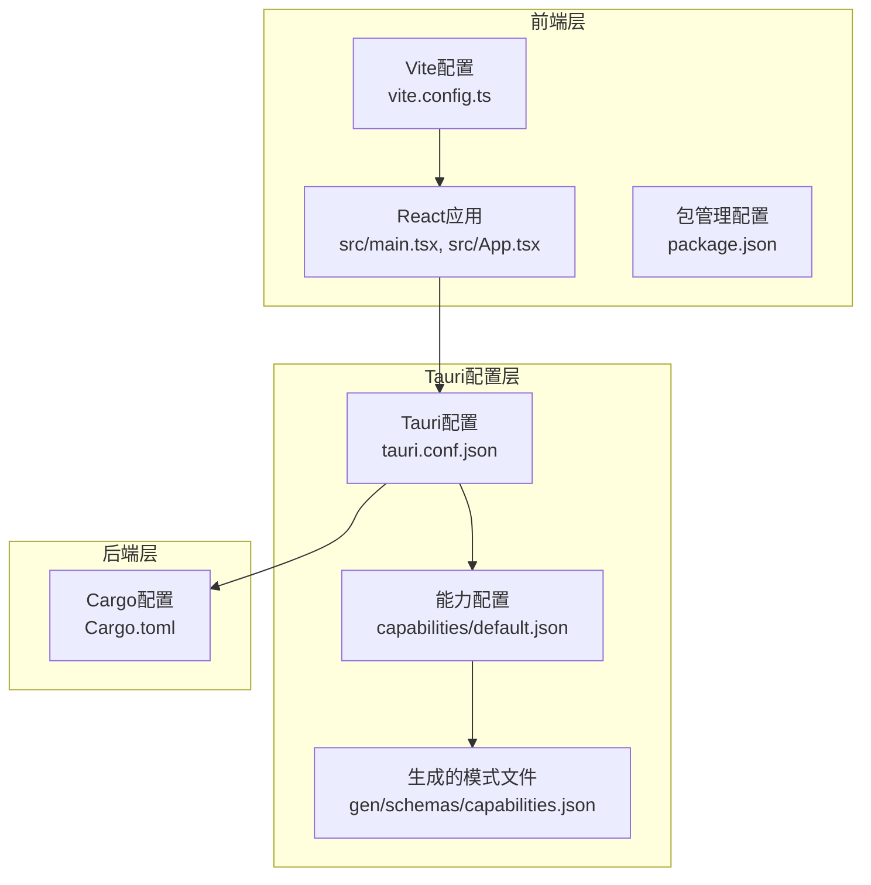
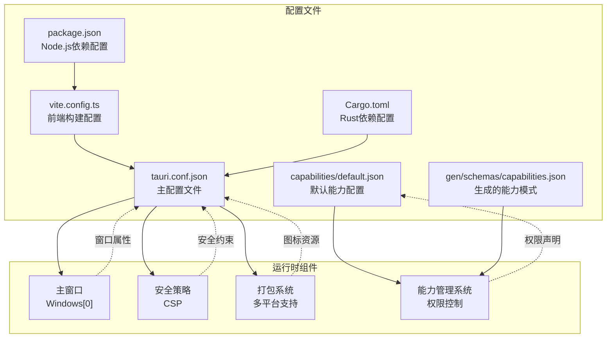
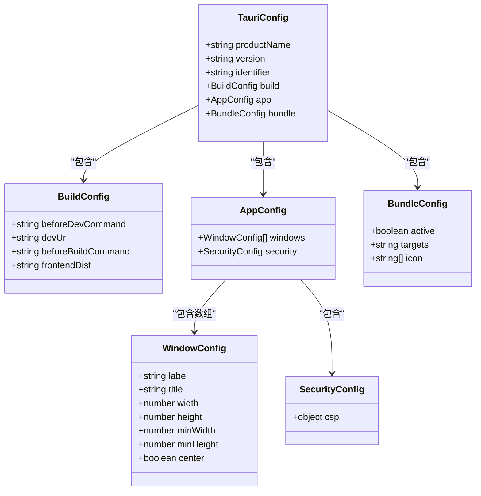
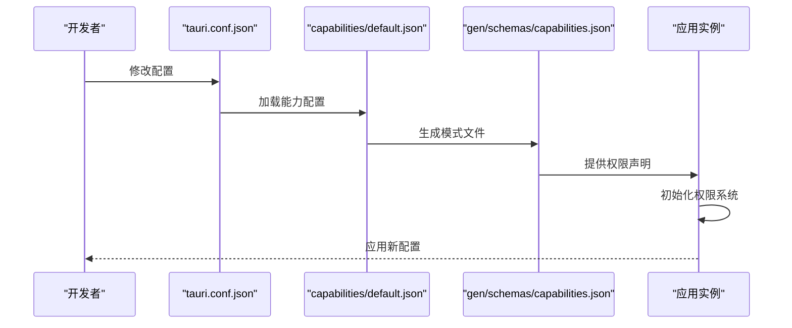
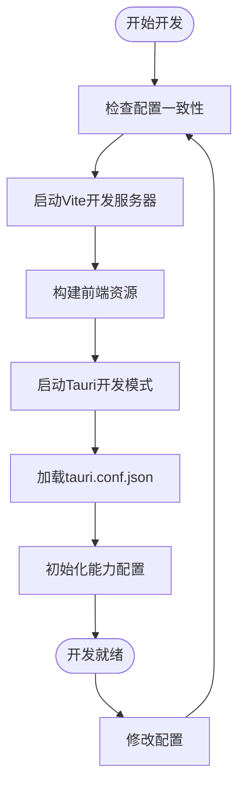
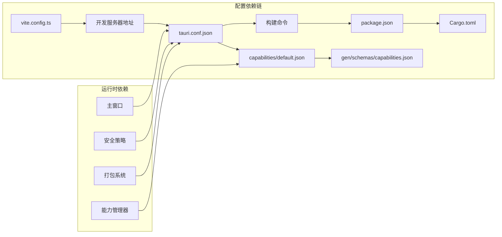

# Tauri应用配置

<cite>
**本文档引用的文件**
- [tauri.conf.json](file://src-tauri/tauri.conf.json)
- [default.json](file://src-tauri/capabilities/default.json)
- [capabilities.json](file://src-tauri/gen/schemas/capabilities.json)
- [package.json](file://package.json)
- [vite.config.ts](file://vite.config.ts)
- [Cargo.toml](file://src-tauri/Cargo.toml)
- [main.tsx](file://src/main.tsx)
- [App.tsx](file://src/App.tsx)
</cite>

## 目录
1. [简介](#简介)
2. [项目结构概览](#项目结构概览)
3. [核心配置组件](#核心配置组件)
4. [架构总览](#架构总览)
5. [详细组件分析](#详细组件分析)
6. [依赖关系分析](#依赖关系分析)
7. [性能考虑](#性能考虑)
8. [故障排除指南](#故障排除指南)
9. [结论](#结论)

## 简介
本文件为XKUtil项目的Tauri应用配置详细文档，重点解析tauri.conf.json配置文件的各项设置，涵盖应用基本信息、构建配置、窗口配置、打包配置以及安全策略与能力配置。同时提供配置修改的最佳实践和常见问题解决方案，帮助开发者快速理解并高效维护Tauri应用的配置体系。

## 项目结构概览
XKUtil采用前端React + 后端Rust的跨平台桌面应用架构，配置集中在src-tauri目录下的tauri.conf.json文件中，并通过Vite进行前端开发与构建。

**图表来源**
- [vite.config.ts:1-31](file://vite.config.ts#L1-L31)
- [tauri.conf.json:1-39](file://src-tauri/tauri.conf.json#L1-L39)
- [default.json:1-16](file://src-tauri/capabilities/default.json#L1-L16)
- [Cargo.toml:1-23](file://src-tauri/Cargo.toml#L1-L23)

**章节来源**
- [vite.config.ts:1-31](file://vite.config.ts#L1-L31)
- [tauri.conf.json:1-39](file://src-tauri/tauri.conf.json#L1-L39)
- [Cargo.toml:1-23](file://src-tauri/Cargo.toml#L1-L23)

## 核心配置组件
本节深入解析tauri.conf.json中的关键配置项及其作用机制。

### 应用基本信息配置
应用基本信息定义了应用的标识符、版本号和产品名称，这些信息在打包和运行时被系统使用。

- **productName**: 应用显示名称，用于用户界面展示
- **version**: 应用版本号，支持语义化版本控制
- **identifier**: 应用唯一标识符，遵循反向域名命名规范

### 构建配置详解
构建配置定义了开发和生产环境的构建流程，确保前后端协同工作。

- **beforeDevCommand**: 开发前执行命令，启动前端开发服务器
- **devUrl**: 开发服务器地址，与Vite配置保持一致
- **beforeBuildCommand**: 构建前执行命令，编译TypeScript并构建前端资源
- **frontendDist**: 前端构建输出目录，指向Vite的dist目录

### 窗口配置参数
窗口配置定义了主窗口的外观和行为特性。

- **label**: 窗口标签，用于程序内部识别
- **title**: 窗口标题，支持国际化文本
- **width/height**: 初始窗口尺寸
- **minWidth/minHeight**: 最小窗口尺寸限制
- **center**: 窗口居中显示

### 安全策略配置
安全策略通过内容安全策略(CSP)控制应用的安全边界。

- **csp**: 当前配置为null，表示禁用CSP检查

### 打包配置参数
打包配置定义了应用的图标资源和目标平台。

- **active**: 是否启用打包功能
- **targets**: 目标平台，"all"表示支持所有平台
- **icon**: 图标集合，包含不同分辨率的PNG图标和平台特定图标

**章节来源**
- [tauri.conf.json:1-39](file://src-tauri/tauri.conf.json#L1-L39)

## 架构总览
下图展示了Tauri应用配置的完整架构，包括配置文件之间的依赖关系和数据流向。

**图表来源**
- [tauri.conf.json:1-39](file://src-tauri/tauri.conf.json#L1-L39)
- [default.json:1-16](file://src-tauri/capabilities/default.json#L1-L16)
- [capabilities.json:1-1](file://src-tauri/gen/schemas/capabilities.json#L1-L1)
- [vite.config.ts:1-31](file://vite.config.ts#L1-L31)
- [Cargo.toml:1-23](file://src-tauri/Cargo.toml#L1-L23)
- [package.json:1-36](file://package.json#L1-L36)

## 详细组件分析

### 配置文件类关系图

**图表来源**
- [tauri.conf.json:1-39](file://src-tauri/tauri.conf.json#L1-L39)

### 能力配置管理流程

**图表来源**
- [default.json:1-16](file://src-tauri/capabilities/default.json#L1-L16)
- [capabilities.json:1-1](file://src-tauri/gen/schemas/capabilities.json#L1-L1)
- [tauri.conf.json:1-39](file://src-tauri/tauri.conf.json#L1-L39)

### 开发构建流程

**图表来源**
- [vite.config.ts:15-29](file://vite.config.ts#L15-L29)
- [tauri.conf.json:5-10](file://src-tauri/tauri.conf.json#L5-L10)
- [package.json:6-11](file://package.json#L6-L11)

**章节来源**
- [tauri.conf.json:1-39](file://src-tauri/tauri.conf.json#L1-L39)
- [default.json:1-16](file://src-tauri/capabilities/default.json#L1-L16)
- [capabilities.json:1-1](file://src-tauri/gen/schemas/capabilities.json#L1-L1)
- [vite.config.ts:1-31](file://vite.config.ts#L1-L31)
- [package.json:1-36](file://package.json#L1-L36)

## 依赖关系分析
配置文件之间存在紧密的依赖关系，形成完整的配置生态系统。

**图表来源**
- [vite.config.ts:5-25](file://vite.config.ts#L5-L25)
- [tauri.conf.json:5-37](file://src-tauri/tauri.conf.json#L5-L37)
- [package.json:6-11](file://package.json#L6-L11)
- [Cargo.toml:15-23](file://src-tauri/Cargo.toml#L15-L23)
- [default.json:1-16](file://src-tauri/capabilities/default.json#L1-L16)
- [capabilities.json:1-1](file://src-tauri/gen/schemas/capabilities.json#L1-L1)

**章节来源**
- [vite.config.ts:1-31](file://vite.config.ts#L1-L31)
- [tauri.conf.json:1-39](file://src-tauri/tauri.conf.json#L1-L39)
- [package.json:1-36](file://package.json#L1-L36)
- [Cargo.toml:1-23](file://src-tauri/Cargo.toml#L1-L23)
- [default.json:1-16](file://src-tauri/capabilities/default.json#L1-L16)
- [capabilities.json:1-1](file://src-tauri/gen/schemas/capabilities.json#L1-L1)

## 性能考虑
基于当前配置，以下是一些性能优化建议：

### 构建性能优化
- **并行构建**: 利用Vite的并行处理能力，减少开发等待时间
- **缓存策略**: 合理配置浏览器缓存和应用缓存
- **资源压缩**: 在生产环境中启用资源压缩和代码分割

### 运行时性能
- **窗口尺寸**: 合理设置最小窗口尺寸，避免频繁的窗口调整
- **图标优化**: 使用合适分辨率的图标，平衡显示质量和内存占用
- **能力精简**: 仅声明必要的权限，减少运行时开销

### 安全与性能平衡
- **CSP配置**: 在生产环境中启用适当的CSP策略
- **权限控制**: 严格控制文件系统访问权限
- **网络请求**: 限制不必要的网络访问

## 故障排除指南

### 常见配置问题及解决方案

#### 开发服务器连接问题
**问题症状**: 开发模式无法连接到前端服务器
**可能原因**:
- 开发服务器端口冲突
- devUrl配置不正确
- 环境变量设置错误

**解决方案**:
1. 检查Vite配置中的端口号是否与tauri.conf.json一致
2. 验证开发服务器是否正常启动
3. 确认环境变量TAURI_DEV_HOST设置正确

#### 打包失败问题
**问题症状**: 应用无法正常打包或图标缺失
**可能原因**:
- 图标文件路径错误
- 图标格式不支持
- 权限配置不完整

**解决方案**:
1. 确保所有图标文件都存在于指定路径
2. 验证图标文件格式符合要求
3. 检查能力配置中的权限声明

#### 窗口显示异常
**问题症状**: 窗口尺寸不符合预期或无法居中
**可能原因**:
- 窗口尺寸设置过小
- 屏幕分辨率不匹配
- 多显示器配置问题

**解决方案**:
1. 调整最小窗口尺寸设置
2. 测试不同屏幕分辨率下的表现
3. 检查多显示器环境下的居中逻辑

### 配置验证工具
建议使用以下方法验证配置的有效性：
- JSON语法检查：确保配置文件语法正确
- 路径验证：确认所有文件路径存在且可访问
- 权限测试：验证能力配置的权限声明
- 平台兼容性：测试不同操作系统下的表现

**章节来源**
- [vite.config.ts:15-29](file://vite.config.ts#L15-L29)
- [tauri.conf.json:11-25](file://src-tauri/tauri.conf.json#L11-L25)
- [default.json:5-14](file://src-tauri/capabilities/default.json#L5-L14)

## 结论
XKUtil项目的Tauri配置展现了现代桌面应用开发的最佳实践。通过合理的配置分离、严格的权限管理和完善的打包策略，该配置体系为应用提供了稳定可靠的运行基础。

关键优势包括：
- **配置清晰**: 各配置文件职责明确，便于维护
- **开发友好**: 完善的开发工具链支持
- **安全可靠**: 严格的能力配置和权限控制
- **跨平台支持**: 统一的配置实现多平台部署

建议在后续开发中继续遵循现有的配置模式，定期审查和优化配置，以适应应用的发展需求。