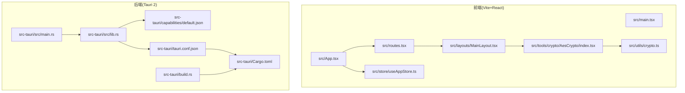
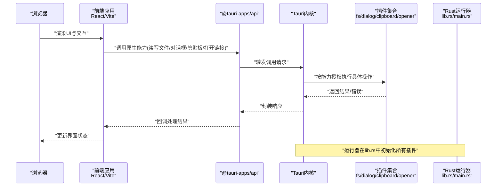
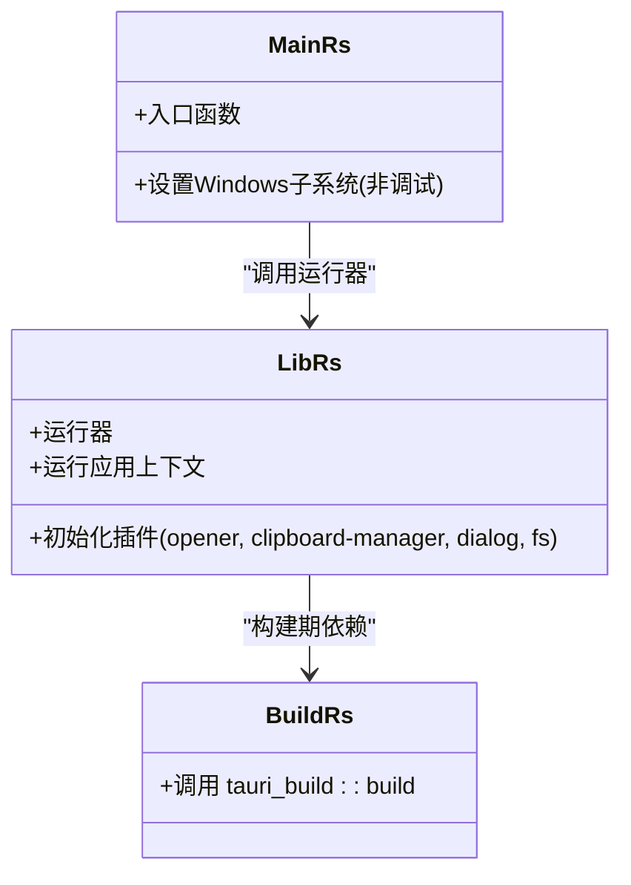
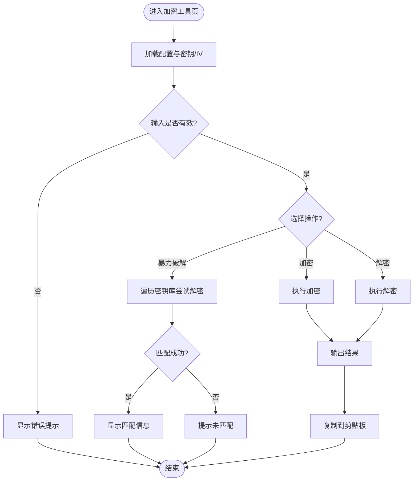
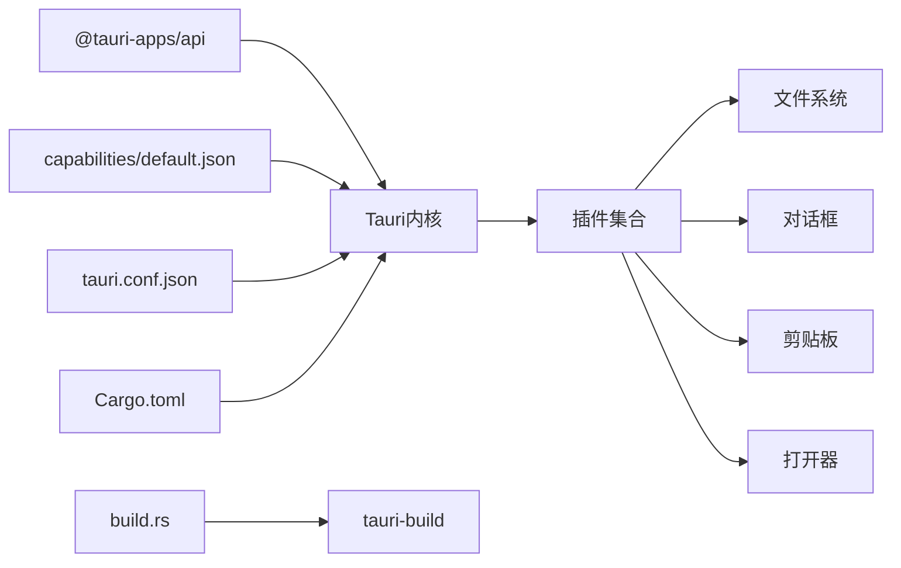

# Tauri集成

<cite>
**本文引用的文件**
- [src-tauri/tauri.conf.json](file://src-tauri/tauri.conf.json)
- [src-tauri/Cargo.toml](file://src-tauri/Cargo.toml)
- [src-tauri/src/main.rs](file://src-tauri/src/main.rs)
- [src-tauri/src/lib.rs](file://src-tauri/src/lib.rs)
- [src-tauri/build.rs](file://src-tauri/build.rs)
- [src-tauri/capabilities/default.json](file://src-tauri/capabilities/default.json)
- [package.json](file://package.json)
- [vite.config.ts](file://vite.config.ts)
- [src/main.tsx](file://src/main.tsx)
- [src/App.tsx](file://src/App.tsx)
- [src/routes.tsx](file://src/routes.tsx)
- [src/layouts/MainLayout.tsx](file://src/layouts/MainLayout.tsx)
- [src/store/useAppStore.ts](file://src/store/useAppStore.ts)
- [src/utils/crypto.ts](file://src/utils/crypto.ts)
- [src/tools/crypto/AesCrypto/index.tsx](file://src/tools/crypto/AesCrypto/index.tsx)
</cite>

## 目录
1. [简介](#简介)
2. [项目结构](#项目结构)
3. [核心组件](#核心组件)
4. [架构总览](#架构总览)
5. [详细组件分析](#详细组件分析)
6. [依赖关系分析](#依赖关系分析)
7. [性能考虑](#性能考虑)
8. [故障排查指南](#故障排查指南)
9. [结论](#结论)
10. [附录](#附录)

## 简介
本文件为该Tauri项目的集成与实现文档，聚焦以下目标：
- 深入解析Tauri应用配置文件的各项选项：窗口设置、安全策略、权限配置与打包设置。
- 详解Rust源码实现：应用入口点、插件初始化与原生功能集成。
- 构建配置与依赖管理：Cargo依赖、构建脚本与版本控制。
- 跨平台打包流程与部署指南：Windows、macOS、Linux平台的特定配置要点。
- Tauri插件系统使用：文件系统、剪贴板与对话框功能的集成方式。

## 项目结构
该项目采用前端与后端分离的典型Tauri架构：
- 前端基于Vite + React，位于 src/ 目录，通过 @tauri-apps/api 与后端通信。
- 后端基于Tauri 2，位于 src-tauri/ 目录，包含 Rust 应用入口、插件初始化、能力与打包配置等。
- 核心工具与业务逻辑在前端模块中组织，例如加密工具、路由与布局等。

图表来源
- [src/main.tsx:1-11](file://src/main.tsx#L1-L11)
- [src/App.tsx:1-24](file://src/App.tsx#L1-L24)
- [src/routes.tsx:1-29](file://src/routes.tsx#L1-L29)
- [src/layouts/MainLayout.tsx:1-168](file://src/layouts/MainLayout.tsx#L1-L168)
- [src/store/useAppStore.ts:1-24](file://src/store/useAppStore.ts#L1-L24)
- [src/utils/crypto.ts:1-222](file://src/utils/crypto.ts#L1-L222)
- [src/tools/crypto/AesCrypto/index.tsx:1-310](file://src/tools/crypto/AesCrypto/index.tsx#L1-L310)
- [src-tauri/src/main.rs:1-6](file://src-tauri/src/main.rs#L1-L6)
- [src-tauri/src/lib.rs:1-11](file://src-tauri/src/lib.rs#L1-L11)
- [src-tauri/tauri.conf.json:1-39](file://src-tauri/tauri.conf.json#L1-L39)
- [src-tauri/capabilities/default.json:1-16](file://src-tauri/capabilities/default.json#L1-L16)
- [src-tauri/Cargo.toml:1-23](file://src-tauri/Cargo.toml#L1-L23)
- [src-tauri/build.rs:1-4](file://src-tauri/build.rs#L1-L4)

章节来源
- [src/main.tsx:1-11](file://src/main.tsx#L1-L11)
- [src/App.tsx:1-24](file://src/App.tsx#L1-L24)
- [src/routes.tsx:1-29](file://src/routes.tsx#L1-L29)
- [src/layouts/MainLayout.tsx:1-168](file://src/layouts/MainLayout.tsx#L1-L168)
- [src/store/useAppStore.ts:1-24](file://src/store/useAppStore.ts#L1-L24)
- [src/utils/crypto.ts:1-222](file://src/utils/crypto.ts#L1-L222)
- [src/tools/crypto/AesCrypto/index.tsx:1-310](file://src/tools/crypto/AesCrypto/index.tsx#L1-L310)
- [src-tauri/src/main.rs:1-6](file://src-tauri/src/main.rs#L1-L6)
- [src-tauri/src/lib.rs:1-11](file://src-tauri/src/lib.rs#L1-L11)
- [src-tauri/tauri.conf.json:1-39](file://src-tauri/tauri.conf.json#L1-L39)
- [src-tauri/capabilities/default.json:1-16](file://src-tauri/capabilities/default.json#L1-L16)
- [src-tauri/Cargo.toml:1-23](file://src-tauri/Cargo.toml#L1-L23)
- [src-tauri/build.rs:1-4](file://src-tauri/build.rs#L1-L4)

## 核心组件
- 应用入口与运行器
  - Rust入口：负责调用应用运行器，启动Tauri应用生命周期。
  - 运行器：集中初始化各Tauri插件，并注入能力与上下文。
- 配置与打包
  - tauri.conf.json：定义产品元数据、开发/构建命令、窗口与安全策略、打包目标与图标。
  - capabilities/default.json：声明默认能力集，限定可访问的原生命令范围。
  - Cargo.toml：声明Rust依赖与构建特性，含插件与序列化库。
  - build.rs：桥接Tauri构建阶段，确保资源与Schema生成。
- 前端集成
  - package.json：定义前端脚本与依赖，包含 @tauri-apps/api 与各插件前端包。
  - Vite配置：开发服务器端口、热更新与路径别名，避免监听后端目录。
  - React应用：路由、布局、主题与状态管理，工具页面通过动态注册加载。

章节来源
- [src-tauri/src/main.rs:1-6](file://src-tauri/src/main.rs#L1-L6)
- [src-tauri/src/lib.rs:1-11](file://src-tauri/src/lib.rs#L1-L11)
- [src-tauri/tauri.conf.json:1-39](file://src-tauri/tauri.conf.json#L1-L39)
- [src-tauri/capabilities/default.json:1-16](file://src-tauri/capabilities/default.json#L1-L16)
- [src-tauri/Cargo.toml:1-23](file://src-tauri/Cargo.toml#L1-L23)
- [src-tauri/build.rs:1-4](file://src-tauri/build.rs#L1-L4)
- [package.json:1-36](file://package.json#L1-L36)
- [vite.config.ts:1-31](file://vite.config.ts#L1-L31)
- [src/main.tsx:1-11](file://src/main.tsx#L1-L11)
- [src/App.tsx:1-24](file://src/App.tsx#L1-L24)
- [src/routes.tsx:1-29](file://src/routes.tsx#L1-L29)
- [src/layouts/MainLayout.tsx:1-168](file://src/layouts/MainLayout.tsx#L1-L168)
- [src/store/useAppStore.ts:1-24](file://src/store/useAppStore.ts#L1-L24)

## 架构总览
下图展示从浏览器到Rust后端的调用链路，以及关键配置如何影响行为。

图表来源
- [src-tauri/src/lib.rs:1-11](file://src-tauri/src/lib.rs#L1-L11)
- [src-tauri/capabilities/default.json:1-16](file://src-tauri/capabilities/default.json#L1-L16)
- [package.json:12-34](file://package.json#L12-L34)

## 详细组件分析

### Tauri应用配置详解
- 产品与版本
  - 产品名称、版本号与标识符用于打包与系统识别。
- 开发与构建
  - beforeDevCommand/beforeBuildCommand：分别在开发与构建前执行前端脚本。
  - devUrl：前端开发服务器地址；frontendDist：构建产物目录。
- 窗口设置
  - 窗口标签、标题、尺寸、最小尺寸与居中策略，确保用户体验一致。
- 安全策略
  - 当前CSP设为禁用，便于开发调试；生产环境建议明确配置以增强安全性。
- 打包设置
  - targets设为“全部”，自动为目标平台生成安装包；icon列表包含多分辨率图标与平台专用格式。

章节来源
- [src-tauri/tauri.conf.json:1-39](file://src-tauri/tauri.conf.json#L1-L39)

### 能力与权限配置
- 能力标识与描述
  - identifier/description：能力集标识与说明，便于维护与审计。
- 窗口绑定
  - windows字段将能力绑定到指定窗口标签，限制作用域。
- 权限清单
  - core:default：基础能力。
  - opener:default：打开外部链接/文件。
  - clipboard-manager:allow-read-text/allow-write-text：读写剪贴板文本。
  - dialog:allow-open/allow-save：打开/保存对话框。
  - fs:allow-read-text-file/allow-write-text-file：读写文本文件。

章节来源
- [src-tauri/capabilities/default.json:1-16](file://src-tauri/capabilities/default.json#L1-L16)

### Rust后端实现与插件初始化
- 入口点
  - main.rs：在非调试模式下设置Windows子系统，随后调用运行器。
- 运行器
  - lib.rs：默认构建器，依次初始化各插件并运行应用上下文。
  - 插件包括：opener、clipboard-manager、dialog、fs。
- 构建脚本
  - build.rs：调用 tauri_build::build，确保Schema与资源在构建期生成。

图表来源
- [src-tauri/src/main.rs:1-6](file://src-tauri/src/main.rs#L1-L6)
- [src-tauri/src/lib.rs:1-11](file://src-tauri/src/lib.rs#L1-L11)
- [src-tauri/build.rs:1-4](file://src-tauri/build.rs#L1-L4)

章节来源
- [src-tauri/src/main.rs:1-6](file://src-tauri/src/main.rs#L1-L6)
- [src-tauri/src/lib.rs:1-11](file://src-tauri/src/lib.rs#L1-L11)
- [src-tauri/build.rs:1-4](file://src-tauri/build.rs#L1-L4)

### 前端集成与工具页面
- 应用根节点与主题
  - main.tsx：挂载React根节点，引入全局样式。
  - App.tsx：配置国际化与主题，包裹主布局与路由。
- 路由与布局
  - routes.tsx：动态注册工具页面，支持懒加载与骨架屏。
  - MainLayout.tsx：侧边菜单、头部按钮、版本信息弹窗与主题切换。
- 状态管理
  - useAppStore.ts：应用设置持久化存储，包括折叠状态与深色模式。
- 加密工具示例
  - AesCrypto/index.tsx：提供AES加解密、暴力破解、密钥库管理与复制输出。
  - utils/crypto.ts：实现AES加密/解密、随机密钥/IV生成、长度校验与有效性判断。

图表来源
- [src/tools/crypto/AesCrypto/index.tsx:55-122](file://src/tools/crypto/AesCrypto/index.tsx#L55-L122)
- [src/utils/crypto.ts:59-162](file://src/utils/crypto.ts#L59-L162)

章节来源
- [src/main.tsx:1-11](file://src/main.tsx#L1-L11)
- [src/App.tsx:1-24](file://src/App.tsx#L1-L24)
- [src/routes.tsx:1-29](file://src/routes.tsx#L1-L29)
- [src/layouts/MainLayout.tsx:1-168](file://src/layouts/MainLayout.tsx#L1-L168)
- [src/store/useAppStore.ts:1-24](file://src/store/useAppStore.ts#L1-L24)
- [src/utils/crypto.ts:1-222](file://src/utils/crypto.ts#L1-L222)
- [src/tools/crypto/AesCrypto/index.tsx:1-310](file://src/tools/crypto/AesCrypto/index.tsx#L1-L310)

### 构建配置与依赖管理
- 前端
  - scripts：dev/build/preview/tauri，分别对应开发、类型检查与构建、预览与Tauri CLI。
  - 依赖：@tauri-apps/api 与各插件前端包，开发依赖包含 @tauri-apps/cli。
  - Vite：端口1420、严格端口、HMR主机配置、忽略 src-tauri 目录监听。
- Rust
  - crate类型：staticlib、cdylib、rlib，便于跨平台共享与嵌入。
  - 依赖：tauri、tauri-plugin-opener、tauri-plugin-clipboard-manager、tauri-plugin-dialog、tauri-plugin-fs、serde/serde_json。
  - 构建依赖：tauri-build。
  - build.rs：调用 tauri_build::build。

章节来源
- [package.json:1-36](file://package.json#L1-L36)
- [vite.config.ts:1-31](file://vite.config.ts#L1-L31)
- [src-tauri/Cargo.toml:1-23](file://src-tauri/Cargo.toml#L1-L23)
- [src-tauri/build.rs:1-4](file://src-tauri/build.rs#L1-L4)

### 跨平台打包与部署指南
- 通用步骤
  - 在各平台安装Tauri CLI与对应签名工具。
  - 准备平台证书与签名材料（Windows代码签名、macOS公证与notarization、Linux打包）。
  - 使用 tauri.conf.json 中的打包配置生成安装包。
- Windows
  - 使用MSVC工具链与SignTool进行代码签名。
  - 图标需包含 .ico 文件，符合Windows任务栏与安装程序显示要求。
- macOS
  - 使用codesign与notarytool完成签名与公证。
  - 图标需包含 .icns 文件，确保Dock与Finder显示效果。
- Linux
  - 生成AppImage或deb/rpm包，准备desktop文件与图标。
  - 注意权限与沙箱策略，结合 capabilities/default.json 控制能力范围。

章节来源
- [src-tauri/tauri.conf.json:27-37](file://src-tauri/tauri.conf.json#L27-L37)
- [src-tauri/capabilities/default.json:1-16](file://src-tauri/capabilities/default.json#L1-L16)

### Tauri插件系统使用
- 文件系统(fs)
  - 允许读取/写入文本文件，结合对话框选择路径。
- 对话框(dialog)
  - 提供打开/保存对话框，配合文件系统实现用户交互。
- 剪贴板(clipboard-manager)
  - 支持读取/写入文本，常用于复制输出结果。
- 打开器(opener)
  - 打开外部链接或本地文件，提升用户体验。

章节来源
- [src-tauri/capabilities/default.json:5-14](file://src-tauri/capabilities/default.json#L5-L14)
- [src-tauri/src/lib.rs:4-8](file://src-tauri/src/lib.rs#L4-L8)
- [package.json:15-18](file://package.json#L15-L18)

## 依赖关系分析
- 前后端耦合
  - 前端通过 @tauri-apps/api 与后端通信，能力受 capabilities/default.json 限制。
  - Rust运行器集中初始化插件，降低前端分散配置带来的风险。
- 构建期依赖
  - build.rs 与 tauri-build 协作，确保Schema与资源生成。
- 第三方库
  - 前端：React、Ant Design、Zustand、crypto-js。
  - 后端：tauri、serde、serde_json、各插件。

图表来源
- [src-tauri/src/lib.rs:1-11](file://src-tauri/src/lib.rs#L1-L11)
- [src-tauri/capabilities/default.json:1-16](file://src-tauri/capabilities/default.json#L1-L16)
- [src-tauri/tauri.conf.json:1-39](file://src-tauri/tauri.conf.json#L1-L39)
- [src-tauri/Cargo.toml:1-23](file://src-tauri/Cargo.toml#L1-L23)
- [src-tauri/build.rs:1-4](file://src-tauri/build.rs#L1-L4)
- [package.json:12-18](file://package.json#L12-L18)

章节来源
- [src-tauri/src/lib.rs:1-11](file://src-tauri/src/lib.rs#L1-L11)
- [src-tauri/capabilities/default.json:1-16](file://src-tauri/capabilities/default.json#L1-L16)
- [src-tauri/tauri.conf.json:1-39](file://src-tauri/tauri.conf.json#L1-L39)
- [src-tauri/Cargo.toml:1-23](file://src-tauri/Cargo.toml#L1-L23)
- [src-tauri/build.rs:1-4](file://src-tauri/build.rs#L1-L4)
- [package.json:12-18](file://package.json#L12-L18)

## 性能考虑
- 前端
  - 使用懒加载与骨架屏减少首屏压力；合理拆分工具组件，按需渲染。
  - 避免在渲染路径中执行重计算，将复杂逻辑移至后台线程或缓存。
- 后端
  - 插件初始化集中在运行器，避免重复初始化；仅启用必要插件以降低内存占用。
  - 文件读写尽量批量处理，避免频繁I/O。
- 构建
  - 利用Vite快速冷启动与HMR；Cargo增量编译与最小化插件数量。

## 故障排查指南
- 开发联调
  - 确认Vite端口与HMR配置一致；避免监听后端目录导致循环触发。
  - 若能力调用失败，检查 capabilities/default.json 是否授予相应权限。
- 打包问题
  - Windows：确认签名证书与时间戳服务可用；图标路径与分辨率满足要求。
  - macOS：公证失败时检查团队ID、Bundle ID与权限；确保所有二进制均被签名。
  - Linux：确认desktop文件与图标路径；deb/rpm依赖与权限配置正确。
- 常见错误定位
  - 剪贴板/文件读写异常：检查权限与路径；确认插件初始化顺序。
  - 对话框无响应：确认窗口标签与能力绑定一致。

章节来源
- [vite.config.ts:15-29](file://vite.config.ts#L15-L29)
- [src-tauri/capabilities/default.json:4-14](file://src-tauri/capabilities/default.json#L4-L14)
- [src-tauri/tauri.conf.json:27-37](file://src-tauri/tauri.conf.json#L27-L37)

## 结论
本项目采用清晰的前后端分离架构，借助Tauri 2实现跨平台原生体验。通过集中式能力配置与插件初始化，既保证了功能扩展性，也维持了安全边界。结合完善的构建与打包配置，可在Windows、macOS与Linux上稳定交付应用。

## 附录
- 关键文件索引
  - 配置：tauri.conf.json、capabilities/default.json
  - 后端：src/main.rs、src/lib.rs、Cargo.toml、build.rs
  - 前端：package.json、vite.config.ts、src/main.tsx、src/App.tsx、src/routes.tsx、src/layouts/MainLayout.tsx、src/store/useAppStore.ts、src/utils/crypto.ts、src/tools/crypto/AesCrypto/index.tsx