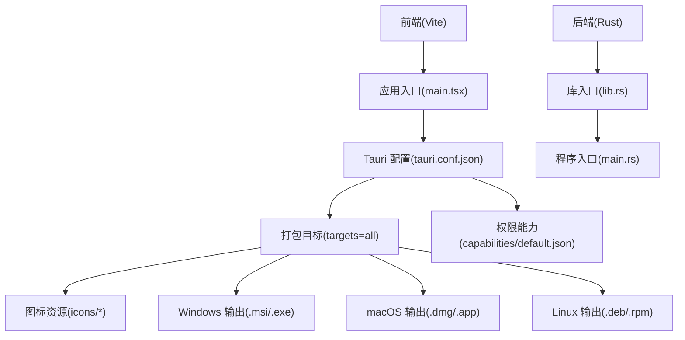
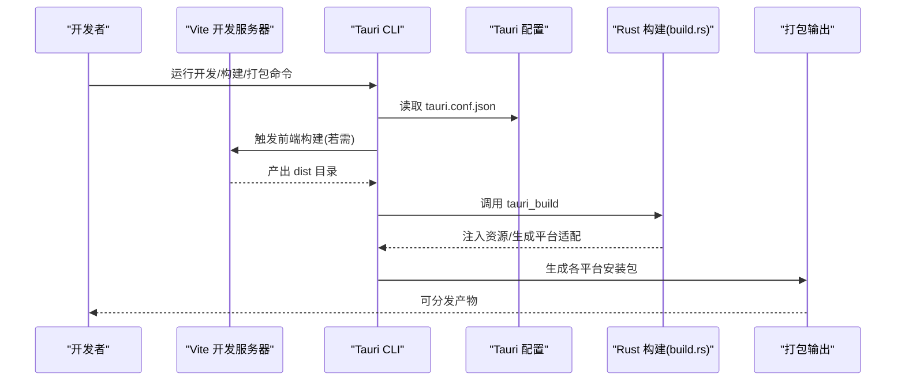
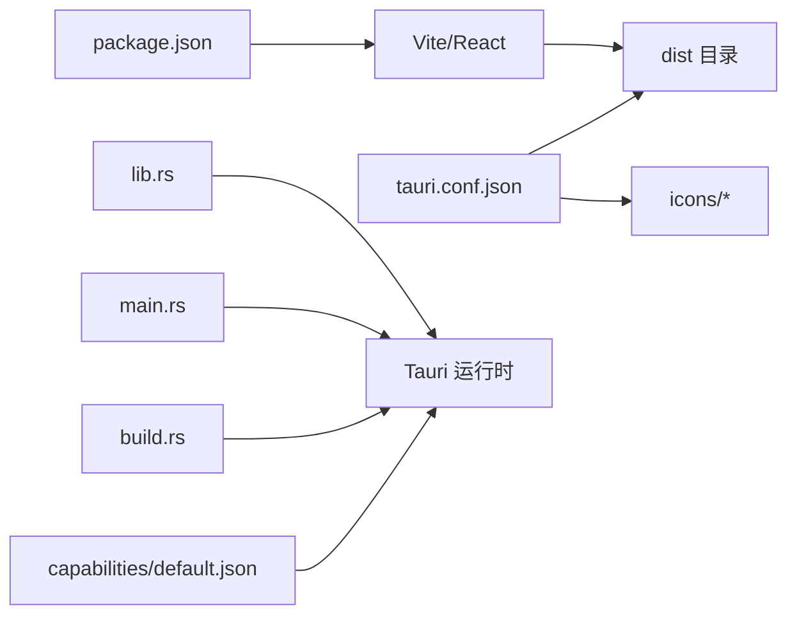

# 跨平台打包

<cite>
**本文引用的文件**
- [tauri.conf.json](file://src-tauri/tauri.conf.json)
- [package.json](file://package.json)
- [Cargo.toml](file://src-tauri/Cargo.toml)
- [vite.config.ts](file://vite.config.ts)
- [main.rs](file://src-tauri/src/main.rs)
- [lib.rs](file://src-tauri/src/lib.rs)
- [build.rs](file://src-tauri/build.rs)
- [default.json](file://src-tauri/capabilities/default.json)
</cite>

## 目录
1. [简介](#简介)
2. [项目结构](#项目结构)
3. [核心组件](#核心组件)
4. [架构总览](#架构总览)
5. [详细组件分析](#详细组件分析)
6. [依赖关系分析](#依赖关系分析)
7. [性能考虑](#性能考虑)
8. [故障排查指南](#故障排查指南)
9. [结论](#结论)
10. [附录](#附录)

## 简介
本文件面向需要为 Tauri 应用进行跨平台打包（Windows、macOS、Linux）的开发者与运维人员，系统性梳理从开发构建到生产发布的完整流程，并结合本仓库的实际配置，给出可操作的步骤、关键配置项说明、图标资源准备清单以及常见问题排查建议。读者无需深入掌握 Rust 或前端工程细节，也可按步骤完成打包。

## 项目结构
该仓库采用“前端 + Tauri 后端”的双层结构：前端使用 Vite + React，后端使用 Rust + Tauri。打包相关的关键位置如下：
- 前端构建与开发服务器：Vite 配置与脚本
- 应用元数据与打包目标：Tauri 配置
- 后端入口与插件注册：Rust 入口与库实现
- 构建桥接：Rust build.rs 调用 tauri_build
- 权限与能力：capabilities 配置

图表来源
- [tauri.conf.json:27-37](file://src-tauri/tauri.conf.json#L27-L37)
- [package.json:6-11](file://package.json#L6-L11)
- [vite.config.ts:1-31](file://vite.config.ts#L1-L31)
- [lib.rs:1-11](file://src-tauri/src/lib.rs#L1-L11)
- [main.rs:1-6](file://src-tauri/src/main.rs#L1-L6)
- [default.json:1-16](file://src-tauri/capabilities/default.json#L1-L16)

章节来源
- [tauri.conf.json:1-39](file://src-tauri/tauri.conf.json#L1-L39)
- [package.json:1-36](file://package.json#L1-L36)
- [vite.config.ts:1-31](file://vite.config.ts#L1-L31)
- [Cargo.toml:1-23](file://src-tauri/Cargo.toml#L1-L23)
- [lib.rs:1-11](file://src-tauri/src/lib.rs#L1-L11)
- [main.rs:1-6](file://src-tauri/src/main.rs#L1-L6)
- [build.rs:1-4](file://src-tauri/build.rs#L1-L4)
- [default.json:1-16](file://src-tauri/capabilities/default.json#L1-L16)

## 核心组件
- 打包配置中心：Tauri 配置文件定义产品名、版本、开发/构建前置命令、前端产物目录、窗口属性、安全策略与打包目标及图标集合。
- 前端构建链路：Vite 提供开发服务器与构建输出，配合 package.json 的脚本完成前端产物生成。
- 后端运行时：Rust 程序入口调用库入口，统一初始化插件（剪贴板、对话框、文件系统、打开器等），并在非调试模式下设置 Windows 子系统。
- 构建桥接：Rust build.rs 调用 tauri_build 完成资源嵌入与平台适配。
- 权限与能力：通过 capabilities/default.json 明确默认能力与所需权限，影响打包后的沙箱与功能可用性。

章节来源
- [tauri.conf.json:1-39](file://src-tauri/tauri.conf.json#L1-L39)
- [package.json:6-11](file://package.json#L6-L11)
- [lib.rs:1-11](file://src-tauri/src/lib.rs#L1-L11)
- [main.rs:1-6](file://src-tauri/src/main.rs#L1-L6)
- [build.rs:1-4](file://src-tauri/build.rs#L1-L4)
- [default.json:1-16](file://src-tauri/capabilities/default.json#L1-L16)

## 架构总览
下图展示从开发到打包的关键流程与组件交互：

图表来源
- [tauri.conf.json:5-10](file://src-tauri/tauri.conf.json#L5-L10)
- [package.json:6-11](file://package.json#L6-L11)
- [build.rs:1-4](file://src-tauri/build.rs#L1-L4)

## 详细组件分析

### 打包配置与目标
- 产品与版本：在配置中定义产品名、版本与标识符，用于生成安装包与系统识别。
- 前端集成：配置开发前命令、开发地址、构建前命令与前端产物目录，确保打包时能正确引用构建结果。
- 窗口与安全：定义主窗口尺寸、最小尺寸、居中显示；安全策略字段可按需调整。
- 打包目标：开启打包并将 targets 设为 all，表示同时为目标平台生成安装包。
- 图标集合：指定一组 PNG 与 ICNS/ICO 文件路径，覆盖不同平台与分辨率需求。

章节来源
- [tauri.conf.json:2-39](file://src-tauri/tauri.conf.json#L2-L39)

### 前端构建与开发服务器
- 开发命令：启动 Vite 开发服务器，默认端口与热更新配置，支持远程主机联调。
- 构建命令：先执行 TypeScript 编译，再执行 Vite 构建，生成 dist 目录供 Tauri 使用。
- 预览命令：本地预览打包后的产物。
- 脚本与别名：提供统一的命令入口与模块别名，便于开发与 CI。

章节来源
- [package.json:6-11](file://package.json#L6-L11)
- [vite.config.ts:1-31](file://vite.config.ts#L1-L31)

### 后端入口与插件初始化
- 程序入口：在非调试模式下设置 Windows 子系统，避免控制台闪烁。
- 库入口：统一初始化多个插件（打开器、剪贴板管理、对话框、文件系统），并运行 Tauri 上下文。
- 插件来源：在 Cargo.toml 中声明，确保编译期可用。

章节来源
- [main.rs:1-6](file://src-tauri/src/main.rs#L1-L6)
- [lib.rs:1-11](file://src-tauri/src/lib.rs#L1-L11)
- [Cargo.toml:15-22](file://src-tauri/Cargo.toml#L15-L22)

### 构建桥接与资源注入
- build.rs：调用 tauri_build::build，完成资源嵌入、能力文件处理与平台适配。
- 与 Cargo.toml 的关系：通过 tauri-build 作为构建依赖参与编译期处理。

章节来源
- [build.rs:1-4](file://src-tauri/build.rs#L1-L4)
- [Cargo.toml:12-13](file://src-tauri/Cargo.toml#L12-L13)

### 权限与能力
- 默认能力：定义窗口映射与权限列表，涵盖核心能力与各插件所需的最小权限。
- 影响范围：决定最终安装包在各平台上的功能可用性与沙箱行为。

章节来源
- [default.json:1-16](file://src-tauri/capabilities/default.json#L1-L16)

## 依赖关系分析
- 前端依赖：React 生态与 Ant Design 组件库，构建工具链由 Vite 与 TypeScript 支持。
- 后端依赖：Tauri 框架与若干插件，通过 Cargo 管理。
- 构建依赖：tauri-build 在构建阶段发挥作用。
- 关键耦合点：前端产物目录需与 tauri.conf.json 中的 frontendDist 对齐；图标集合需与打包目标匹配。

图表来源
- [package.json:1-36](file://package.json#L1-L36)
- [tauri.conf.json:5-10](file://src-tauri/tauri.conf.json#L5-L10)
- [lib.rs:1-11](file://src-tauri/src/lib.rs#L1-L11)
- [main.rs:1-6](file://src-tauri/src/main.rs#L1-L6)
- [build.rs:1-4](file://src-tauri/build.rs#L1-L4)
- [default.json:1-16](file://src-tauri/capabilities/default.json#L1-L16)

章节来源
- [package.json:1-36](file://package.json#L1-L36)
- [tauri.conf.json:1-39](file://src-tauri/tauri.conf.json#L1-L39)
- [Cargo.toml:1-23](file://src-tauri/Cargo.toml#L1-L23)
- [lib.rs:1-11](file://src-tauri/src/lib.rs#L1-L11)
- [main.rs:1-6](file://src-tauri/src/main.rs#L1-L6)
- [build.rs:1-4](file://src-tauri/build.rs#L1-L4)
- [default.json:1-16](file://src-tauri/capabilities/default.json#L1-L16)

## 性能考虑
- 构建时间优化：减少不必要的前端依赖与大体积资源，合理拆分代码与懒加载。
- 打包体积优化：在保证功能的前提下，精简图标集与资源文件；利用 Tauri 的最小权限原则减少能力文件大小。
- 平台差异：Windows 与 macOS 的打包产物体积通常高于 Linux，注意针对目标用户场景选择合适的压缩与签名策略。

## 故障排查指南
- 前端产物缺失或路径不正确
  - 现象：打包时报找不到 dist 目录或页面空白。
  - 排查：确认前端构建命令已成功执行，且 tauri.conf.json 中的 frontendDist 与实际输出一致。
  - 参考
    - [tauri.conf.json:8-10](file://src-tauri/tauri.conf.json#L8-L10)
    - [package.json:8](file://package.json#L8)
- 图标未生效或分辨率异常
  - 现象：应用图标模糊、缺失或平台不一致。
  - 排查：检查 icons 列表中的路径是否真实存在，确保包含各平台常用尺寸与格式（PNG、ICNS、ICO）。
  - 参考
    - [tauri.conf.json:30-36](file://src-tauri/tauri.conf.json#L30-L36)
- 权限不足导致功能不可用
  - 现象：剪贴板、文件读写、对话框弹窗等功能异常。
  - 排查：核对 capabilities/default.json 中的权限声明是否满足当前功能需求。
  - 参考
    - [default.json:5-14](file://src-tauri/capabilities/default.json#L5-L14)
- Windows 控制台闪烁或启动异常
  - 现象：Windows 下启动出现黑框控制台。
  - 排查：确认非调试模式下设置了正确的子系统。
  - 参考
    - [main.rs:1](file://src-tauri/src/main.rs#L1)
- Linux 打包失败（缺少依赖）
  - 现象：在 Linux 环境下无法生成 .deb/.rpm。
  - 排查：安装对应打包工具（如 dpkg-deb、rpm），并确保系统具备必要依赖。
  - 参考
    - [tauri.conf.json:29](file://src-tauri/tauri.conf.json#L29)

## 结论
本项目已具备跨平台打包的基础配置：明确的前端构建链路、统一的 Tauri 配置、完善的图标资源与权限能力声明。按照本文提供的流程与排错建议，可在 Windows、macOS、Linux 上稳定生成可分发的安装包。建议在 CI 环境中固化命令与依赖，以提升一致性与可重复性。

## 附录

### 打包命令与流程说明
- 开发构建
  - 步骤：启动前端开发服务器，等待 Tauri 读取 devUrl。
  - 参考
    - [tauri.conf.json:6-8](file://src-tauri/tauri.conf.json#L6-L8)
    - [package.json:7](file://package.json#L7)
- 生产构建
  - 步骤：先执行 TypeScript 编译，再执行 Vite 构建，生成 dist 目录。
  - 参考
    - [package.json:8](file://package.json#L8)
    - [tauri.conf.json:8](file://src-tauri/tauri.conf.json#L8)
- 发布准备（跨平台打包）
  - 步骤：启用打包并设置 targets 为 all，触发多平台安装包生成。
  - 参考
    - [tauri.conf.json:27-37](file://src-tauri/tauri.conf.json#L27-L37)
- 常见命令入口
  - 参考
    - [package.json:10](file://package.json#L10)

### 图标资源准备与配置
- 资源类型与用途
  - PNG：通用位图图标，建议包含标准分辨率与高 DPI @2x。
  - ICNS：macOS 应用图标。
  - ICO：Windows 应用图标。
- 准备要点
  - 确保尺寸覆盖常见显示密度与平台要求。
  - 将图标文件放置于 tauri.conf.json 指定的 icons 目录，并在 icon 数组中声明。
- 参考
  - [tauri.conf.json:30-36](file://src-tauri/tauri.conf.json#L30-L36)