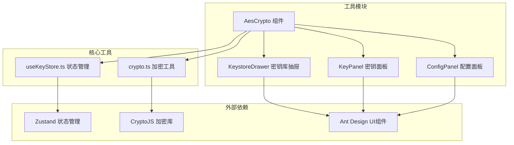
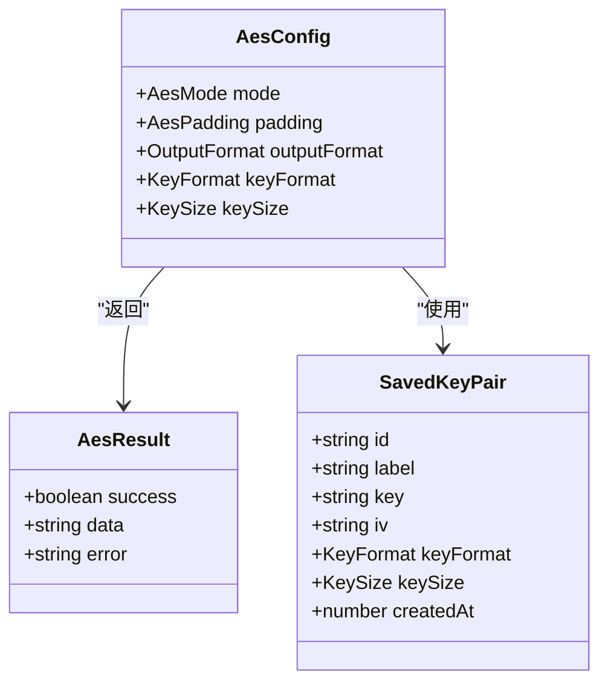
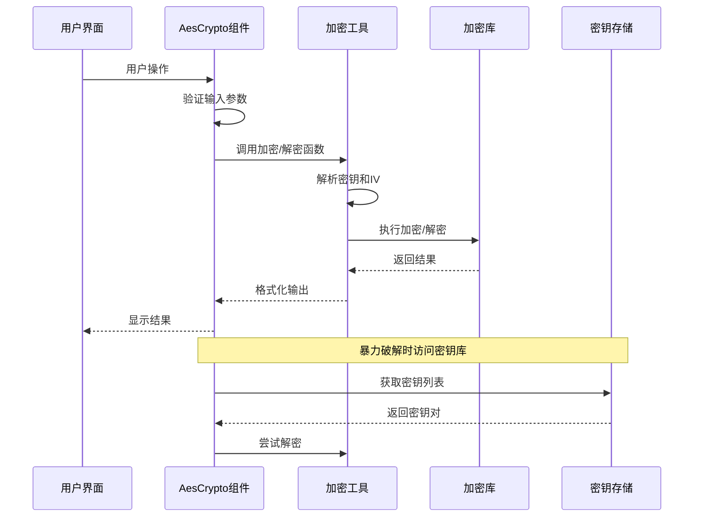
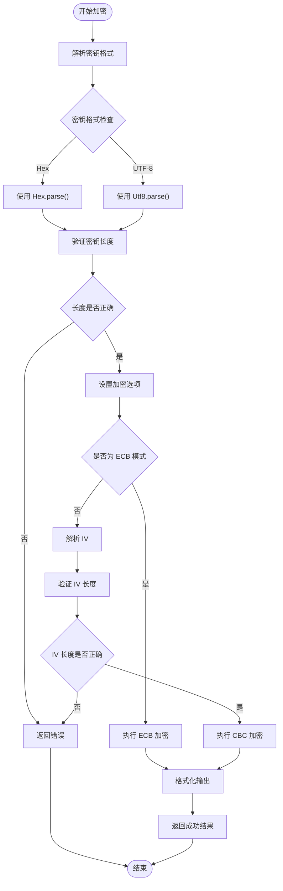
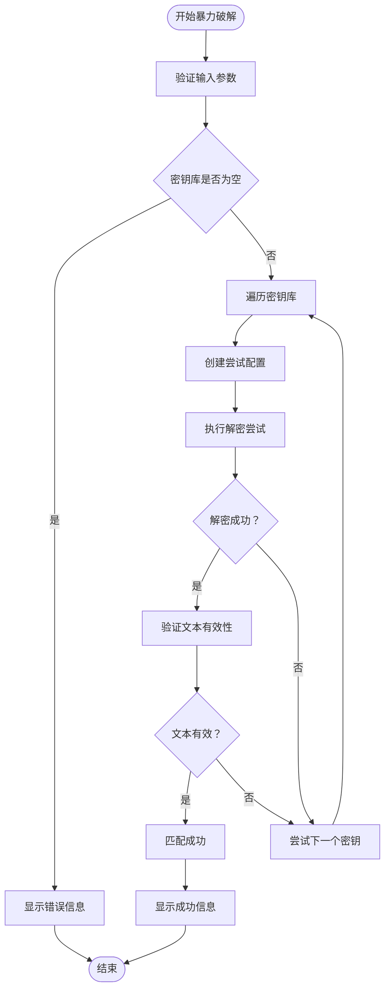
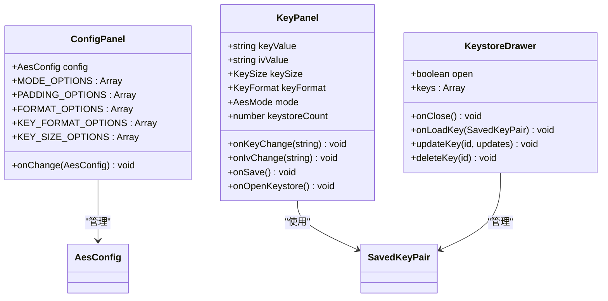
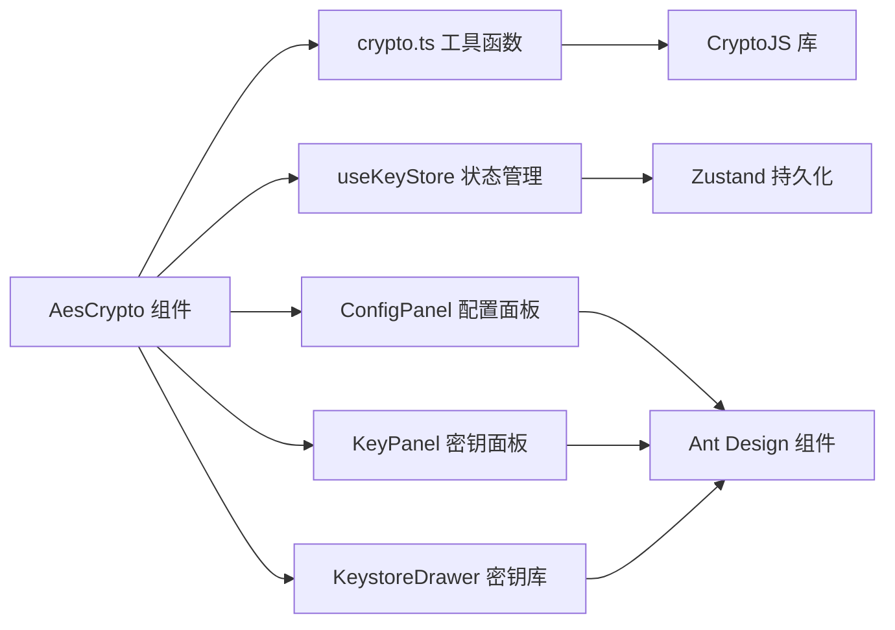

# AES加密解密核心

<cite>
**本文档引用的文件**
- [src/tools/crypto/AesCrypto/index.tsx](file://src/tools/crypto/AesCrypto/index.tsx)
- [src/utils/crypto.ts](file://src/utils/crypto.ts)
- [src/store/useKeyStore.ts](file://src/store/useKeyStore.ts)
- [src/tools/crypto/AesCrypto/ConfigPanel.tsx](file://src/tools/crypto/AesCrypto/ConfigPanel.tsx)
- [src/tools/crypto/AesCrypto/KeyPanel.tsx](file://src/tools/crypto/AesCrypto/KeyPanel.tsx)
- [src/tools/crypto/AesCrypto/KeystoreDrawer.tsx](file://src/tools/crypto/AesCrypto/KeystoreDrawer.tsx)
- [package.json](file://package.json)
</cite>

## 目录
1. [简介](#简介)
2. [项目结构](#项目结构)
3. [核心组件](#核心组件)
4. [架构概览](#架构概览)
5. [详细组件分析](#详细组件分析)
6. [依赖关系分析](#依赖关系分析)
7. [性能考虑](#性能考虑)
8. [故障排除指南](#故障排除指南)
9. [结论](#结论)

## 简介

XKUtil 是一个基于 React 和 Tauri 的多功能开发工具集，其中的 AES 加密解密核心功能提供了完整的对称加密解决方案。该模块实现了多种加密模式、填充方式和输出格式，支持密钥库管理和暴力破解功能，为开发者提供了灵活且安全的加密工具。

本技术文档深入解析 AES 加密算法的实现原理，包括：
- 加密模式（CBC、ECB、CFB、OFB、CTR）
- 填充方式（Pkcs7、ZeroPadding、NoPadding）
- 输出格式（Base64、Hex）
- 密钥大小选择（128、192、256位）
- 密钥格式转换（UTF-8、Hex）

## 项目结构

XKUtil 采用模块化架构设计，AES 加密解密功能位于 `src/tools/crypto/AesCrypto/` 目录下，核心加密逻辑封装在 `src/utils/crypto.ts` 中。



**图表来源**
- [src/tools/crypto/AesCrypto/index.tsx:1-310](file://src/tools/crypto/AesCrypto/index.tsx#L1-L310)
- [src/utils/crypto.ts:1-222](file://src/utils/crypto.ts#L1-L222)
- [src/store/useKeyStore.ts:1-47](file://src/store/useKeyStore.ts#L1-L47)

**章节来源**
- [src/tools/crypto/AesCrypto/index.tsx:1-310](file://src/tools/crypto/AesCrypto/index.tsx#L1-L310)
- [package.json:1-36](file://package.json#L1-L36)

## 核心组件

### 加密配置系统

AES 加密配置通过类型安全的接口定义，确保参数的有效性和一致性：



**图表来源**
- [src/utils/crypto.ts:9-21](file://src/utils/crypto.ts#L9-L21)
- [src/store/useKeyStore.ts:5-13](file://src/store/useKeyStore.ts#L5-L13)

### 加密模式映射

系统支持五种标准 AES 模式，每种模式都有其特定的安全特性和适用场景：

| 模式 | 描述 | 适用场景 | 安全特性 |
|------|------|----------|----------|
| CBC | 密码块链接 | 通用数据加密 | 需要初始化向量，抗重放攻击 |
| ECB | 电子密码本 | 固定长度数据 | 简单但安全性较低 |
| CFB | 密码反馈 | 流式数据传输 | 可处理任意长度数据 |
| OFB | 输出反馈 | 流式加密 | 抗传输错误 |
| CTR | 计数器模式 | 并行处理 | 支持并行计算 |

**章节来源**
- [src/utils/crypto.ts:3-35](file://src/utils/crypto.ts#L3-L35)
- [src/tools/crypto/AesCrypto/ConfigPanel.tsx:9-15](file://src/tools/crypto/AesCrypto/ConfigPanel.tsx#L9-L15)

## 架构概览

AES 加密解密系统采用分层架构设计，确保功能模块的职责分离和可维护性。



**图表来源**
- [src/tools/crypto/AesCrypto/index.tsx:55-112](file://src/tools/crypto/AesCrypto/index.tsx#L55-L112)
- [src/utils/crypto.ts:59-162](file://src/utils/crypto.ts#L59-L162)

## 详细组件分析

### 加密工具实现

加密工具模块是整个 AES 功能的核心，负责处理密钥解析、参数验证和实际的加密解密操作。

#### 密钥解析机制



**图表来源**
- [src/utils/crypto.ts:37-105](file://src/utils/crypto.ts#L37-L105)

#### 参数验证系统

系统实现了多层次的参数验证机制，确保加密过程的安全性和正确性：

1. **密钥长度验证**：根据密钥大小（128/192/256位）和格式（Hex/UTF-8）计算期望长度
2. **IV 长度验证**：所有非 ECB 模式都需要 16 字节的 IV
3. **输出格式验证**：确保解密时使用的输出格式与加密时一致

**章节来源**
- [src/utils/crypto.ts:44-57](file://src/utils/crypto.ts#L44-L57)
- [src/utils/crypto.ts:107-162](file://src/utils/crypto.ts#L107-L162)

### 暴力破解功能实现

暴力破解功能是该模块的独特特性，通过遍历密钥库中的所有密钥对来尝试解密给定的密文。



**图表来源**
- [src/tools/crypto/AesCrypto/index.tsx:87-112](file://src/tools/crypto/AesCrypto/index.tsx#L87-L112)
- [src/utils/crypto.ts:202-221](file://src/utils/crypto.ts#L202-L221)

#### 解密结果验证机制

为了确保暴力破解的准确性，系统实现了智能的结果验证：

1. **替换字符检测**：检查输出中是否存在无效 UTF-8 替换字符
2. **可打印字符比率**：确保大部分字符都是可读的
3. **Unicode 支持**：支持中文、日文等多语言字符

**章节来源**
- [src/utils/crypto.ts:202-221](file://src/utils/crypto.ts#L202-L221)

### 用户界面组件

#### 配置面板

配置面板提供了直观的参数设置界面，支持实时预览和参数验证。



**图表来源**
- [src/tools/crypto/AesCrypto/ConfigPanel.tsx:39-94](file://src/tools/crypto/AesCrypto/ConfigPanel.tsx#L39-L94)
- [src/tools/crypto/AesCrypto/KeyPanel.tsx:23-113](file://src/tools/crypto/AesCrypto/KeyPanel.tsx#L23-L113)
- [src/tools/crypto/AesCrypto/KeystoreDrawer.tsx:26-184](file://src/tools/crypto/AesCrypto/KeystoreDrawer.tsx#L26-L184)

**章节来源**
- [src/tools/crypto/AesCrypto/ConfigPanel.tsx:1-95](file://src/tools/crypto/AesCrypto/ConfigPanel.tsx#L1-L95)
- [src/tools/crypto/AesCrypto/KeyPanel.tsx:1-114](file://src/tools/crypto/AesCrypto/KeyPanel.tsx#L1-L114)
- [src/tools/crypto/AesCrypto/KeystoreDrawer.tsx:1-185](file://src/tools/crypto/AesCrypto/KeystoreDrawer.tsx#L1-L185)

## 依赖关系分析

### 外部依赖

系统依赖于多个成熟的开源库来实现核心功能：

```mermaid
graph TB
subgraph "加密库"
A[CryptoJS 4.2.0]
end
subgraph "UI框架"
B[Ant Design 5.24.0]
C[React 19.1.0]
end
subgraph "状态管理"
D[Zustand 5.0.5]
end
subgraph "系统集成"
E[@tauri-apps/api 2.5.0]
F[@tauri-apps/plugin-clipboard-manager 2.2.1]
end
A --> B
B --> C
D --> C
E --> C
F --> C
```

**图表来源**
- [package.json:12-25](file://package.json#L12-L25)

### 内部依赖关系



**图表来源**
- [src/tools/crypto/AesCrypto/index.tsx:23-29](file://src/tools/crypto/AesCrypto/index.tsx#L23-L29)
- [src/utils/crypto.ts:1](file://src/utils/crypto.ts#L1)

**章节来源**
- [package.json:12-25](file://package.json#L12-L25)

## 性能考虑

### 加密性能优化

1. **内存管理**：使用 CryptoJS 的 WordArray 对象进行高效的字节操作
2. **缓存策略**：避免重复解析相同的密钥和 IV
3. **异步处理**：长耗时的暴力破解操作采用异步执行

### 内存使用优化

- **WordArray 随机数生成**：使用 `CryptoJS.lib.WordArray.random()` 生成高效随机字节
- **字符串处理**：避免不必要的字符串复制和转换
- **状态管理**：使用 Zustand 的轻量级状态管理减少内存开销

### 安全性考虑

1. **密钥存储**：使用浏览器持久化存储，支持本地加密
2. **输入验证**：严格的参数验证防止恶意输入
3. **错误处理**：统一的错误处理机制避免敏感信息泄露

## 故障排除指南

### 常见问题及解决方案

#### 加密失败

**症状**：加密操作返回错误信息
**可能原因**：
- 密钥长度不正确
- IV 格式错误（非 ECB 模式）
- 输出格式不匹配

**解决方法**：
1. 检查密钥格式（Hex/UTF-8）与配置是否一致
2. 验证密钥长度符合预期（128/192/256位）
3. 确认 IV 格式和长度正确

#### 解密失败

**症状**：解密返回空结果或错误信息
**可能原因**：
- 使用了错误的密钥或配置
- 输出格式不匹配
- 密文格式错误

**解决方法**：
1. 确认加密和解密使用相同的配置
2. 检查密文格式与输出格式设置一致
3. 验证密钥库中的密钥信息

#### 暴力破解无结果

**症状**：尝试所有密钥都未能解密
**可能原因**：
- 密钥不在密钥库中
- 密文已被重新编码
- 配置不正确

**解决方法**：
1. 检查密钥库完整性
2. 确认密文来源和格式
3. 验证配置参数

**章节来源**
- [src/utils/crypto.ts:102-104](file://src/utils/crypto.ts#L102-L104)
- [src/utils/crypto.ts:159-161](file://src/utils/crypto.ts#L159-L161)
- [src/tools/crypto/AesCrypto/index.tsx:87-112](file://src/tools/crypto/AesCrypto/index.tsx#L87-L112)

## 结论

XKUtil 的 AES 加密解密核心功能提供了完整而强大的对称加密解决方案。通过模块化的架构设计、严格的安全验证机制和用户友好的界面，该系统能够满足从个人开发者到企业应用的各种加密需求。

### 主要优势

1. **功能完整性**：支持多种加密模式、填充方式和输出格式
2. **安全性保障**：严格的参数验证和错误处理机制
3. **易用性**：直观的用户界面和智能的配置管理
4. **扩展性**：模块化设计便于功能扩展和维护

### 技术特色

- **暴力破解功能**：独特的密钥库遍历机制
- **智能验证**：解密结果的有效性检测
- **多格式支持**：灵活的密钥和输出格式处理
- **状态持久化**：密钥库的本地存储和管理

该系统为开发者提供了一个可靠、安全且易于使用的 AES 加密工具，适用于各种数据保护场景。