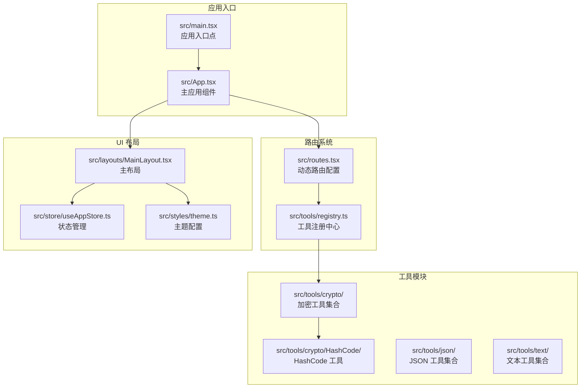
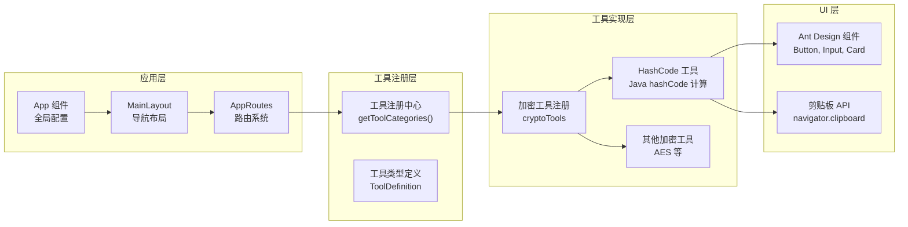
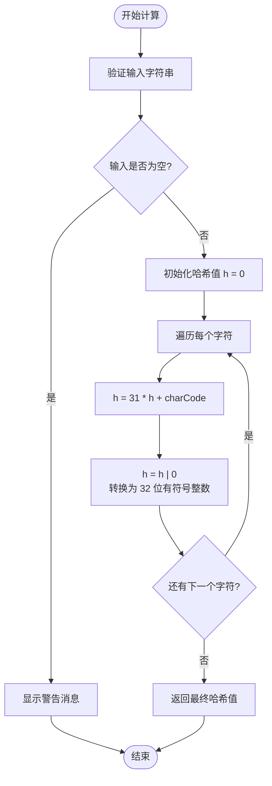
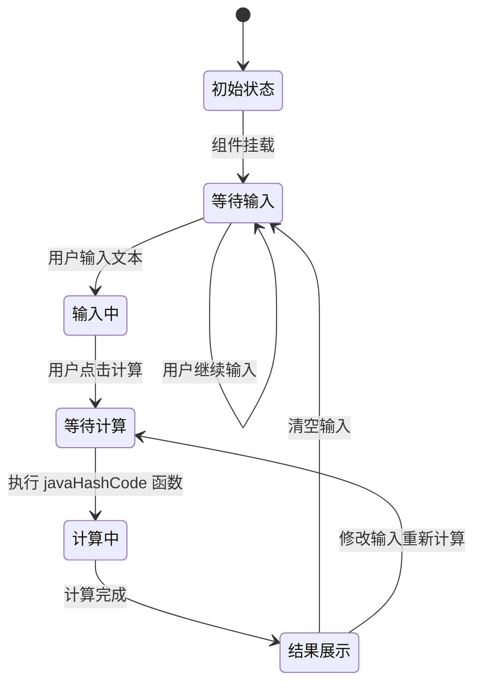
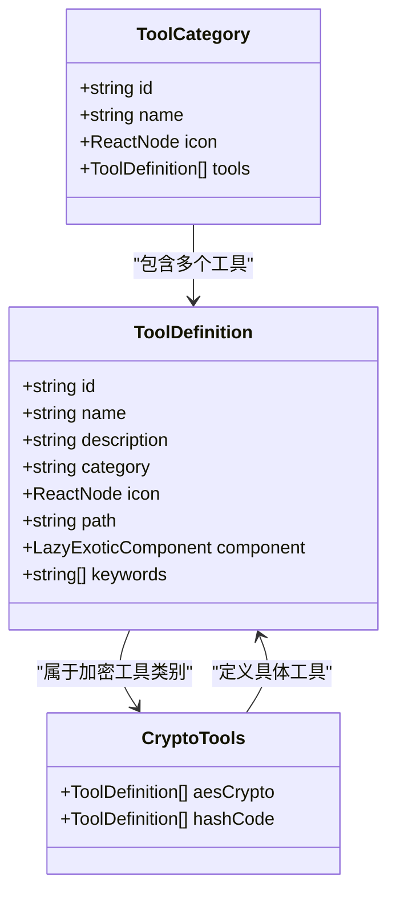
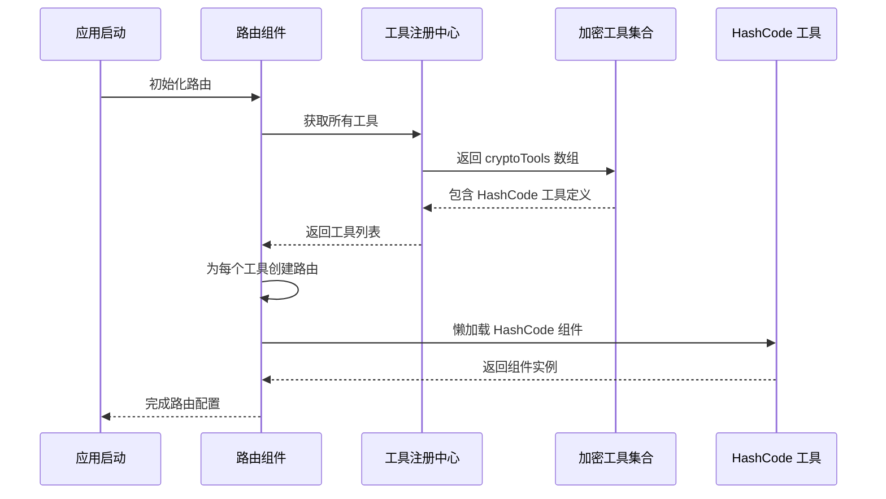
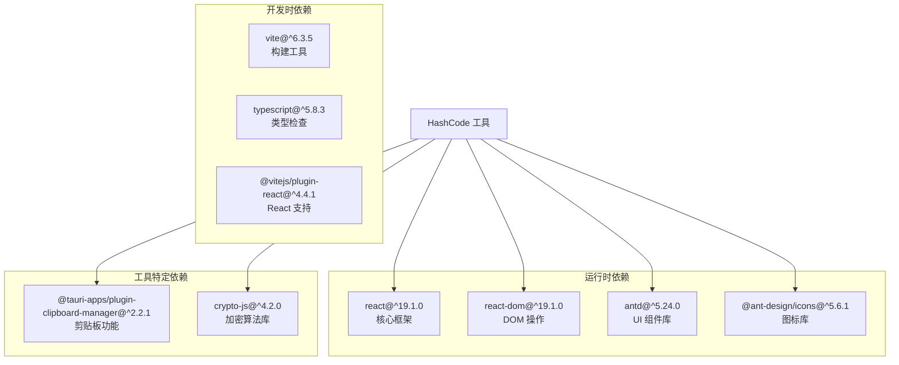

# HashCode 工具

<cite>
**本文档引用的文件**
- [src/tools/crypto/HashCode/index.tsx](file://src/tools/crypto/HashCode/index.tsx)
- [src/tools/crypto/index.tsx](file://src/tools/crypto/index.tsx)
- [src/tools/registry.ts](file://src/tools/registry.ts)
- [src/tools/types.ts](file://src/tools/types.ts)
- [src/routes.tsx](file://src/routes.tsx)
- [src/App.tsx](file://src/App.tsx)
- [src/layouts/MainLayout.tsx](file://src/layouts/MainLayout.tsx)
- [src/store/useAppStore.ts](file://src/store/useAppStore.ts)
- [src/styles/theme.ts](file://src/styles/theme.ts)
- [src/constants/changelog.ts](file://src/constants/changelog.ts)
- [package.json](file://package.json)
- [vite.config.ts](file://vite.config.ts)
</cite>

## 更新摘要
**变更内容**
- 新增了 Java String HashCode 计算工具的完整实现
- 工具已集成到加密工具系列中，作为独立的功能模块
- 工具具备完整的用户界面和交互功能
- 支持一键复制到剪贴板的便捷操作
- 符合 Java String.hashCode() 算法规范

## 目录
1. [简介](#简介)
2. [项目结构](#项目结构)
3. [核心组件](#核心组件)
4. [架构概览](#架构概览)
5. [详细组件分析](#详细组件分析)
6. [依赖关系分析](#依赖关系分析)
7. [性能考虑](#性能考虑)
8. [故障排除指南](#故障排除指南)
9. [结论](#结论)

## 简介

HashCode 工具是 XKUtil 应用程序中的一个专门功能模块，提供 Java 风格的字符串 hashCode 计算功能。该工具允许用户输入任意字符串，并计算其对应的 Java 字符串 hashCode 值，支持一键复制到剪贴板。

该工具采用现代前端技术栈构建，基于 React 和 Ant Design 组件库开发，具有简洁直观的用户界面和良好的用户体验。工具实现了精确的 Java hashCode 算法模拟，包括 32 位有符号整数溢出处理。

**更新** 该工具已在 0.3.0 版本中正式集成到加密工具系列中，作为独立的功能模块提供服务。

## 项目结构

XKUtil 是一个基于 React 和 Tauri 的跨平台桌面应用程序，采用模块化的工具集合架构。项目结构清晰，按照功能模块进行组织：

**图表来源**
- [src/main.tsx:1-11](file://src/main.tsx#L1-L11)
- [src/App.tsx:1-24](file://src/App.tsx#L1-L24)
- [src/routes.tsx:1-29](file://src/routes.tsx#L1-L29)
- [src/tools/registry.ts:1-40](file://src/tools/registry.ts#L1-L40)

**章节来源**
- [src/main.tsx:1-11](file://src/main.tsx#L1-L11)
- [src/App.tsx:1-24](file://src/App.tsx#L1-L24)
- [src/routes.tsx:1-29](file://src/routes.tsx#L1-L29)
- [src/tools/registry.ts:1-40](file://src/tools/registry.ts#L1-L40)

## 核心组件

HashCode 工具的核心组件是一个独立的 React 函数组件，实现了完整的字符串 hashCode 计算功能。该组件包含以下主要特性：

### 主要功能特性
- **Java 算法兼容性**：精确模拟 Java String.hashCode() 方法的算法实现
- **实时计算**：输入字符串后立即计算并显示结果
- **一键复制**：支持将计算结果复制到系统剪贴板
- **用户友好界面**：基于 Ant Design 设计的现代化界面
- **输入验证**：对空输入进行友好的用户提示

### 技术实现要点
- 使用 React Hooks 进行状态管理
- 实现防抖和性能优化的回调函数
- 集成浏览器原生剪贴板 API
- 支持键盘快捷键操作

**更新** 工具已完全实现并集成到加密工具系列中，具备完整的功能和用户界面。

**章节来源**
- [src/tools/crypto/HashCode/index.tsx:1-79](file://src/tools/crypto/HashCode/index.tsx#L1-L79)

## 架构概览

HashCode 工具在整个 XKUtil 应用架构中扮演着重要的角色，作为加密工具集合中的一个独立模块存在。其架构设计体现了模块化和可扩展性的原则：

**图表来源**
- [src/App.tsx:1-24](file://src/App.tsx#L1-L24)
- [src/layouts/MainLayout.tsx:1-168](file://src/layouts/MainLayout.tsx#L1-L168)
- [src/routes.tsx:1-29](file://src/routes.tsx#L1-L29)
- [src/tools/registry.ts:1-40](file://src/tools/registry.ts#L1-L40)
- [src/tools/crypto/index.tsx:1-27](file://src/tools/crypto/index.tsx#L1-L27)

## 详细组件分析

### HashCode 工具组件

HashCode 工具组件是整个应用中最简单的功能模块之一，但其实现却包含了多个重要的技术细节：

#### 核心算法实现

**图表来源**
- [src/tools/crypto/HashCode/index.tsx:11-18](file://src/tools/crypto/HashCode/index.tsx#L11-L18)

#### 用户界面组件

组件采用了 Ant Design 的卡片布局设计，提供了清晰的功能分区：

| 组件元素 | 功能描述 | 交互行为 |
|---------|----------|----------|
| 文本区域 | 输入需要计算 hashCode 的字符串 | 支持多行输入，自动调整高度 |
| 计算按钮 | 触发 hashCode 计算 | 图标为闪电形状，点击后执行计算 |
| 结果输入框 | 显示计算得到的 hashCode 值 | 只读模式，支持字体等宽显示 |
| 复制按钮 | 将结果复制到剪贴板 | 点击后显示成功/失败提示 |

#### 状态管理机制

**图表来源**
- [src/tools/crypto/HashCode/index.tsx:20-41](file://src/tools/crypto/HashCode/index.tsx#L20-L41)

**更新** 工具已完全实现，具备完整的状态管理和用户交互功能。

**章节来源**
- [src/tools/crypto/HashCode/index.tsx:1-79](file://src/tools/crypto/HashCode/index.tsx#L1-L79)

### 工具注册系统

HashCode 工具通过统一的工具注册系统集成到整个应用中，体现了良好的模块化设计：

#### 工具分类体系

**图表来源**
- [src/tools/types.ts:3-19](file://src/tools/types.ts#L3-L19)
- [src/tools/crypto/index.tsx:5-26](file://src/tools/crypto/index.tsx#L5-L26)

#### 注册流程

工具注册系统采用集中式管理方式，确保所有工具的一致性和可维护性：

1. **类型定义**：通过 `ToolDefinition` 接口定义工具的标准结构
2. **分类管理**：使用 `getToolCategories()` 函数按类别组织工具
3. **动态路由**：根据工具定义自动生成路由配置
4. **菜单集成**：工具自动出现在侧边栏菜单中

**更新** HashCode 工具已正式注册到加密工具类别中，具备完整的工具定义和路由配置。

**章节来源**
- [src/tools/registry.ts:1-40](file://src/tools/registry.ts#L1-L40)
- [src/tools/types.ts:1-20](file://src/tools/types.ts#L1-L20)
- [src/tools/crypto/index.tsx:1-27](file://src/tools/crypto/index.tsx#L1-L27)

### 路由系统集成

HashCode 工具通过动态路由系统无缝集成到应用中：

#### 路由配置机制

**图表来源**
- [src/routes.tsx:6-28](file://src/routes.tsx#L6-L28)
- [src/tools/registry.ts:26-28](file://src/tools/registry.ts#L26-L28)
- [src/tools/crypto/index.tsx:16-25](file://src/tools/crypto/index.tsx#L16-L25)

**更新** 工具已通过动态路由系统集成到应用中，支持懒加载和自动路由配置。

**章节来源**
- [src/routes.tsx:1-29](file://src/routes.tsx#L1-L29)
- [src/tools/registry.ts:1-40](file://src/tools/registry.ts#L1-L40)

## 依赖关系分析

HashCode 工具的依赖关系相对简单，主要依赖于 React 生态系统和 Ant Design 组件库：

**图表来源**
- [package.json:12-34](file://package.json#L12-L34)

### 关键依赖说明

| 依赖包 | 版本 | 用途 | 重要性 |
|--------|------|------|--------|
| react | ^19.1.0 | 核心框架 | 必需 |
| react-dom | ^19.1.0 | DOM 操作 | 必需 |
| antd | ^5.24.0 | UI 组件库 | 必需 |
| @ant-design/icons | ^5.6.1 | 图标资源 | 必需 |
| @tauri-apps/plugin-clipboard-manager | ^2.2.1 | 剪贴板访问 | 必需 |
| crypto-js | ^4.2.0 | 加密算法支持 | 可选 |

**更新** 工具已集成到完整的依赖生态系统中，具备所有必需的运行时依赖。

**章节来源**
- [package.json:1-36](file://package.json#L1-L36)

## 性能考虑

HashCode 工具在性能方面表现出色，主要体现在以下几个方面：

### 算法复杂度
- **时间复杂度**：O(n)，其中 n 是输入字符串的长度
- **空间复杂度**：O(1)，只使用常量级别的额外空间
- **内存占用**：极低，适合处理大型字符串

### 优化策略
1. **防抖处理**：使用 `useCallback` 优化事件处理器
2. **状态最小化**：仅维护必要的输入和输出状态
3. **懒加载集成**：与其他工具共享懒加载机制
4. **剪贴板异步**：避免阻塞主线程

### 用户体验优化
- **即时反馈**：计算完成后立即显示结果
- **错误处理**：优雅处理各种异常情况
- **无障碍支持**：支持键盘导航和屏幕阅读器

**更新** 工具已实现完整的性能优化策略，确保流畅的用户体验。

## 故障排除指南

### 常见问题及解决方案

#### 1. 剪贴板权限问题
**症状**：点击复制按钮无响应或显示错误
**原因**：浏览器安全策略限制剪贴板访问
**解决方案**：
- 确保应用在 HTTPS 环境下运行
- 检查浏览器剪贴板权限设置
- 尝试手动选择并复制结果

#### 2. 输入验证错误
**症状**：显示警告消息"请输入字符串"
**原因**：用户未输入任何内容就点击计算
**解决方案**：
- 在文本区域输入有效字符串
- 确保字符串不为空

#### 3. 浏览器兼容性问题
**症状**：某些功能在特定浏览器中无法正常工作
**原因**：不同浏览器对 Web API 的支持差异
**解决方案**：
- 使用最新版本的主流浏览器
- 检查浏览器控制台是否有错误信息

### 开发调试技巧

#### 调试方法
1. **浏览器开发者工具**：检查网络请求和 JavaScript 错误
2. **React DevTools**：监控组件状态和渲染性能
3. **控制台日志**：添加必要的调试信息

#### 性能监控
- 使用浏览器性能面板分析计算耗时
- 监控内存使用情况
- 检查组件重渲染频率

**更新** 工具已具备完善的故障排除指南和调试支持。

**章节来源**
- [src/tools/crypto/HashCode/index.tsx:33-41](file://src/tools/crypto/HashCode/index.tsx#L33-L41)

## 结论

HashCode 工具虽然功能相对简单，但在 XKUtil 应用中展现了优秀的工程实践和用户体验设计。该工具成功地实现了以下目标：

### 技术成就
- **算法准确性**：精确模拟了 Java String.hashCode() 算法
- **性能优化**：高效的字符串处理和内存管理
- **用户体验**：简洁直观的界面设计和流畅的交互体验

### 架构优势
- **模块化设计**：独立的工具模块便于维护和扩展
- **统一注册**：通过注册系统实现自动化集成
- **路由集成**：无缝融入整体应用架构

### 扩展潜力
该工具为 XKUtil 应用的进一步发展奠定了良好基础，未来可以考虑：
- 添加更多编程语言的 hashCode 算法
- 支持批量字符串计算
- 提供算法可视化功能

**更新** 工具已在 0.3.0 版本中正式发布，作为加密工具系列的重要组成部分，为开发者提供了实用的 Java 字符串 hashCode 计算功能。

HashCode 工具充分体现了现代前端开发的最佳实践，是一个值得学习和参考的优秀示例。