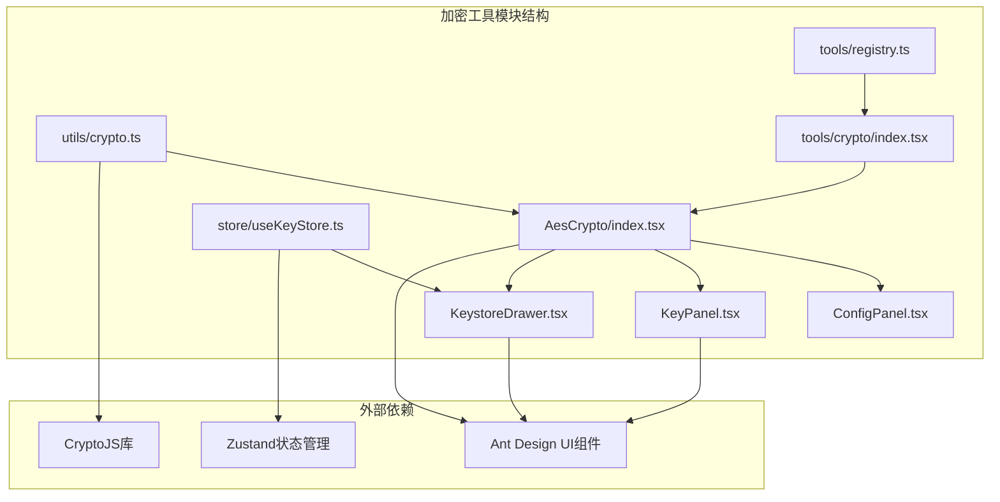
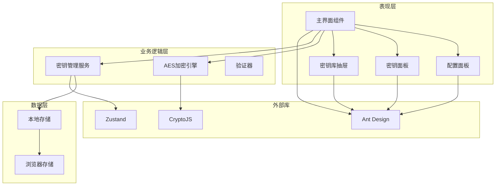
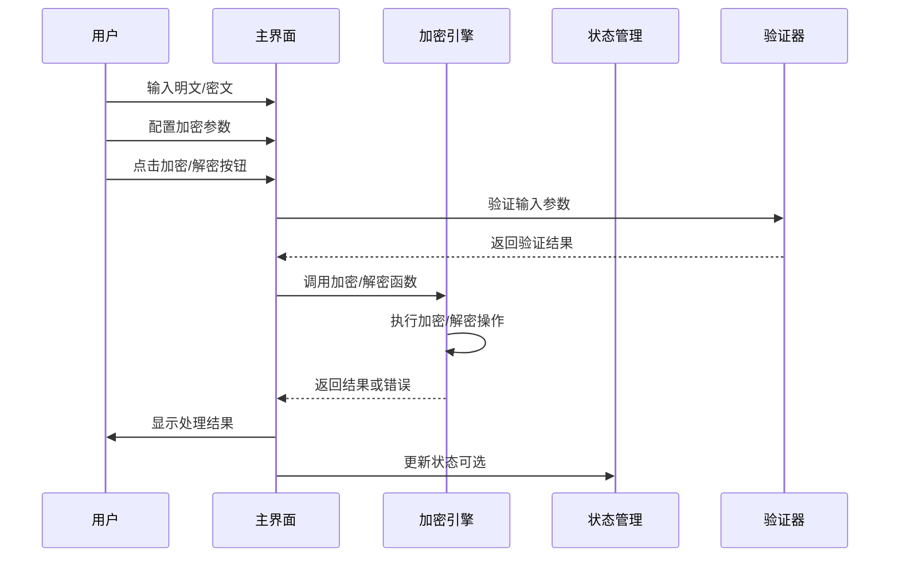
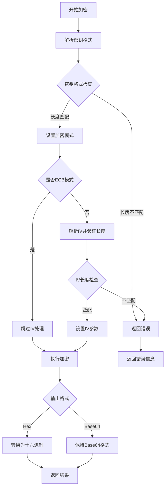
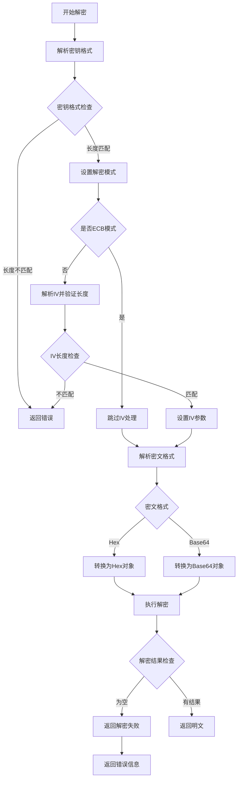
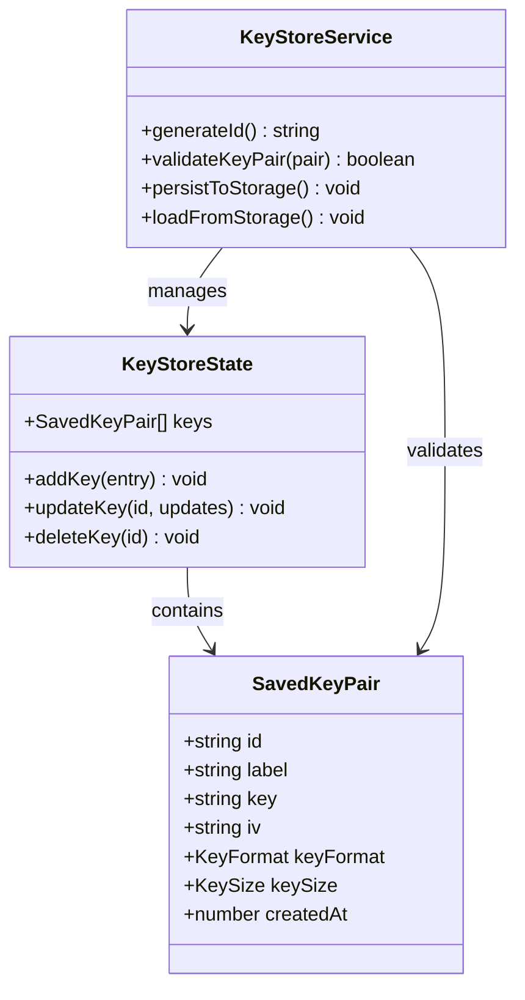
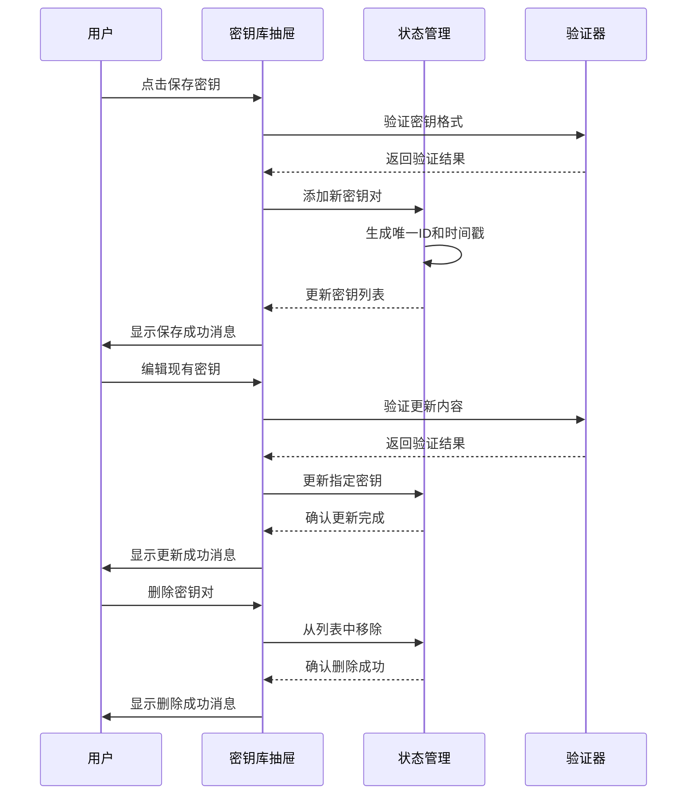
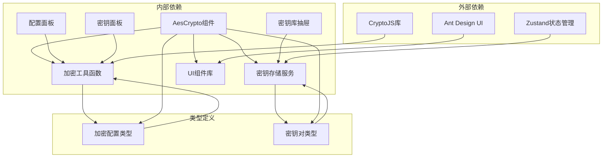

# 加密工具模块

<cite>
**本文档引用的文件**
- [AesCrypto/index.tsx](file://src/tools/crypto/AesCrypto/index.tsx)
- [ConfigPanel.tsx](file://src/tools/crypto/AesCrypto/ConfigPanel.tsx)
- [KeyPanel.tsx](file://src/tools/crypto/AesCrypto/KeyPanel.tsx)
- [KeystoreDrawer.tsx](file://src/tools/crypto/AesCrypto/KeystoreDrawer.tsx)
- [useKeyStore.ts](file://src/store/useKeyStore.ts)
- [crypto.ts](file://src/utils/crypto.ts)
- [crypto/index.tsx](file://src/tools/crypto/index.tsx)
- [registry.ts](file://src/tools/registry.ts)
- [types.ts](file://src/tools/types.ts)
</cite>

## 目录
1. [简介](#简介)
2. [项目结构](#项目结构)
3. [核心组件](#核心组件)
4. [架构概览](#架构概览)
5. [详细组件分析](#详细组件分析)
6. [依赖关系分析](#依赖关系分析)
7. [性能考虑](#性能考虑)
8. [故障排除指南](#故障排除指南)
9. [结论](#结论)
10. [附录](#附录)

## 简介

加密工具模块是XKUtil应用中的核心功能之一，提供了完整的AES加密解密解决方案。该模块实现了现代化的加密工具界面，支持多种加密模式、填充方式和输出格式，具备完善的密钥管理系统和用户友好的交互体验。

本模块基于React和Ant Design构建，集成了CryptoJS加密库，提供了从密钥生成、加密解密到密钥管理的完整功能链。用户可以通过直观的界面配置加密参数，管理密钥对，并进行批量的暴力破解测试。

## 项目结构

加密工具模块采用模块化的文件组织方式，主要包含以下核心文件：

**图表来源**
- [AesCrypto/index.tsx:1-310](file://src/tools/crypto/AesCrypto/index.tsx#L1-L310)
- [crypto.ts:1-222](file://src/utils/crypto.ts#L1-L222)
- [useKeyStore.ts:1-47](file://src/store/useKeyStore.ts#L1-L47)

**章节来源**
- [AesCrypto/index.tsx:1-310](file://src/tools/crypto/AesCrypto/index.tsx#L1-L310)
- [crypto.ts:1-222](file://src/utils/crypto.ts#L1-L222)
- [useKeyStore.ts:1-47](file://src/store/useKeyStore.ts#L1-L47)

## 核心组件

### AES加密引擎

加密引擎是整个模块的核心，负责实际的加密解密操作。它提供了类型安全的配置接口和完善的错误处理机制。

**关键特性：**
- 支持五种AES模式：CBC、ECB、CFB、OFB、CTR
- 三种填充方式：PKCS7、ZeroPadding、NoPadding
- 两种输出格式：Base64和Hex
- 三种密钥格式：UTF-8和Hex
- 三种密钥长度：128、192、256位

**章节来源**
- [crypto.ts:3-15](file://src/utils/crypto.ts#L3-L15)
- [crypto.ts:59-162](file://src/utils/crypto.ts#L59-L162)

### 密钥管理系统

密钥管理系统基于Zustand状态管理库实现，提供了持久化的密钥存储和管理功能。

**核心功能：**
- 密钥对的增删改查操作
- 自动化的ID生成和时间戳记录
- 浏览器本地存储持久化
- 密钥库的导入导出支持

**章节来源**
- [useKeyStore.ts:5-20](file://src/store/useKeyStore.ts#L5-L20)
- [useKeyStore.ts:22-46](file://src/store/useKeyStore.ts#L22-L46)

### 用户界面组件

界面组件采用响应式设计，提供了直观易用的操作界面。

**主要组件：**
- 配置面板：设置加密参数
- 密钥面板：输入和管理密钥
- 密钥库抽屉：集中管理密钥对
- 主界面：集成所有功能的操作面板

**章节来源**
- [ConfigPanel.tsx:1-95](file://src/tools/crypto/AesCrypto/ConfigPanel.tsx#L1-L95)
- [KeyPanel.tsx:1-114](file://src/tools/crypto/AesCrypto/KeyPanel.tsx#L1-L114)
- [KeystoreDrawer.tsx:1-185](file://src/tools/crypto/AesCrypto/KeystoreDrawer.tsx#L1-L185)

## 架构概览

加密工具模块采用了清晰的分层架构设计，确保了代码的可维护性和扩展性。

**图表来源**
- [AesCrypto/index.tsx:20-29](file://src/tools/crypto/AesCrypto/index.tsx#L20-L29)
- [useKeyStore.ts:22-46](file://src/store/useKeyStore.ts#L22-L46)
- [crypto.ts:1-222](file://src/utils/crypto.ts#L1-L222)

### 数据流架构

**图表来源**
- [AesCrypto/index.tsx:55-85](file://src/tools/crypto/AesCrypto/index.tsx#L55-L85)
- [crypto.ts:59-162](file://src/utils/crypto.ts#L59-L162)

## 详细组件分析

### AES加密引擎实现

AES加密引擎是模块的核心，提供了完整的加密解密功能。

#### 加密流程

**图表来源**
- [crypto.ts:59-105](file://src/utils/crypto.ts#L59-L105)
- [crypto.ts:37-57](file://src/utils/crypto.ts#L37-L57)

#### 解密流程

**图表来源**
- [crypto.ts:107-162](file://src/utils/crypto.ts#L107-L162)
- [crypto.ts:140-152](file://src/utils/crypto.ts#L140-L152)

**章节来源**
- [crypto.ts:59-162](file://src/utils/crypto.ts#L59-L162)

### 密钥库管理系统

密钥库管理系统提供了完整的密钥生命周期管理功能。

#### 数据模型

**图表来源**
- [useKeyStore.ts:5-20](file://src/store/useKeyStore.ts#L5-L20)
- [useKeyStore.ts:22-46](file://src/store/useKeyStore.ts#L22-L46)

#### 操作流程

**图表来源**
- [KeystoreDrawer.tsx:32-52](file://src/tools/crypto/AesCrypto/KeystoreDrawer.tsx#L32-L52)
- [useKeyStore.ts:26-42](file://src/store/useKeyStore.ts#L26-L42)

**章节来源**
- [useKeyStore.ts:1-47](file://src/store/useKeyStore.ts#L1-L47)
- [KeystoreDrawer.tsx:1-185](file://src/tools/crypto/AesCrypto/KeystoreDrawer.tsx#L1-L185)

### 用户界面组件

#### 配置面板

配置面板提供了灵活的加密参数设置功能。

**支持的配置选项：**
- **加密模式**：CBC、ECB、CFB、OFB、CTR
- **填充方式**：PKCS7、ZeroPadding、NoPadding  
- **输出格式**：Base64、Hex
- **密钥格式**：UTF-8、Hex
- **密钥长度**：128、192、256位

**章节来源**
- [ConfigPanel.tsx:9-37](file://src/tools/crypto/AesCrypto/ConfigPanel.tsx#L9-L37)
- [ConfigPanel.tsx:39-94](file://src/tools/crypto/AesCrypto/ConfigPanel.tsx#L39-L94)

#### 密钥面板

密钥面板集成了密钥输入、验证和管理功能。

**核心功能：**
- 密钥长度自动验证
- IV长度动态计算
- 随机密钥生成
- 密钥格式切换
- 快捷操作按钮

**章节来源**
- [KeyPanel.tsx:23-113](file://src/tools/crypto/AesCrypto/KeyPanel.tsx#L23-L113)

#### 暴力破解功能

模块提供了智能的暴力破解功能，可以自动尝试密钥库中的所有密钥对。

**工作原理：**
1. 遍历密钥库中的每个密钥对
2. 使用当前密钥对的配置参数进行解密
3. 验证解密结果的有效性
4. 成功时停止搜索并返回结果

**章节来源**
- [AesCrypto/index.tsx:87-112](file://src/tools/crypto/AesCrypto/index.tsx#L87-L112)
- [crypto.ts:202-221](file://src/utils/crypto.ts#L202-L221)

## 依赖关系分析

加密工具模块的依赖关系清晰明确，遵循了单一职责原则。

**图表来源**
- [AesCrypto/index.tsx:20-29](file://src/tools/crypto/AesCrypto/index.tsx#L20-L29)
- [crypto.ts:3-15](file://src/utils/crypto.ts#L3-L15)
- [useKeyStore.ts:3](file://src/store/useKeyStore.ts#L3)

### 组件耦合度分析

模块采用了松耦合的设计，各组件之间的依赖关系通过props传递实现。

**低耦合特性：**
- 组件间通过接口通信，减少直接依赖
- 共享状态通过Zustand集中管理
- 加密逻辑与UI逻辑分离
- 配置参数通过类型系统约束

**章节来源**
- [AesCrypto/index.tsx:33-310](file://src/tools/crypto/AesCrypto/index.tsx#L33-L310)
- [crypto.ts:1-222](file://src/utils/crypto.ts#L1-L222)

## 性能考虑

### 加密性能优化

模块在性能方面采取了多项优化措施：

**内存管理：**
- 使用WordArray进行高效的字节操作
- 及时释放不再使用的加密对象
- 避免重复的字符串转换操作

**计算效率：**
- 预计算密钥和IV的预期长度
- 缓存常用的加密配置
- 异步处理大文件的加密解密

### 存储性能

密钥库采用本地存储优化：
- 使用二进制格式存储密钥数据
- 实现增量更新机制
- 避免不必要的存储操作

## 故障排除指南

### 常见问题及解决方案

**密钥长度错误**
- **症状**：加密或解密时报错，提示密钥长度不匹配
- **原因**：密钥格式与配置不一致
- **解决**：检查密钥格式设置，确保密钥长度符合预期

**IV长度错误**
- **症状**：ECB模式下仍要求IV，或IV长度不正确
- **原因**：IV参数未正确设置
- **解决**：ECB模式不需要IV，其他模式必须提供正确的IV

**解密失败**
- **症状**：解密结果显示为空或包含替换字符
- **原因**：密钥不正确或配置参数不匹配
- **解决**：验证密钥和配置，使用暴力破解功能尝试所有密钥

**章节来源**
- [crypto.ts:68-73](file://src/utils/crypto.ts#L68-L73)
- [crypto.ts:116-121](file://src/utils/crypto.ts#L116-L121)
- [crypto.ts:154-156](file://src/utils/crypto.ts#L154-L156)

### 调试技巧

**开发环境调试：**
- 使用浏览器开发者工具监控状态变化
- 在控制台输出中间结果进行验证
- 利用React DevTools检查组件状态

**生产环境监控：**
- 记录详细的错误日志
- 监控加密操作的性能指标
- 实施用户反馈收集机制

## 结论

加密工具模块是一个功能完整、架构清晰的加密解决方案。它成功地将复杂的加密操作封装为简单易用的界面，同时保持了高度的安全性和可靠性。

**主要优势：**
- 完整的AES加密功能支持
- 直观的用户界面设计
- 强大的密钥管理系统
- 完善的错误处理机制
- 良好的性能表现

**技术亮点：**
- 基于现代React Hooks的组件设计
- 类型安全的配置系统
- 持久化的状态管理
- 模块化的代码结构

该模块为开发者和最终用户提供了一个可靠的加密工具，满足了各种加密场景的需求。

## 附录

### 使用示例

**基本加密流程：**
1. 在配置面板中设置加密参数
2. 在密钥面板中输入或生成密钥
3. 在输入框中粘贴需要加密的文本
4. 点击加密按钮获取结果
5. 将结果复制到剪贴板或保存到密钥库

**密钥管理流程：**
1. 点击保存密钥按钮
2. 在弹出对话框中填写标签名称
3. 输入密钥和IV值
4. 点击保存确认
5. 在密钥库中查看和管理保存的密钥对

### 安全注意事项

**密钥安全：**
- 始终使用强随机数生成密钥
- 定期轮换密钥和IV
- 避免在代码中硬编码密钥
- 使用HTTPS传输敏感数据

**配置安全：**
- 选择合适的加密模式和填充方式
- 确保密钥长度符合安全要求
- 验证输入参数的合法性
- 实施适当的访问控制

**最佳实践：**
- 使用128位或更高级别的密钥长度
- 对于需要随机性的场景，使用加密安全的随机数生成器
- 定期审查和更新加密策略
- 建立完整的密钥生命周期管理流程