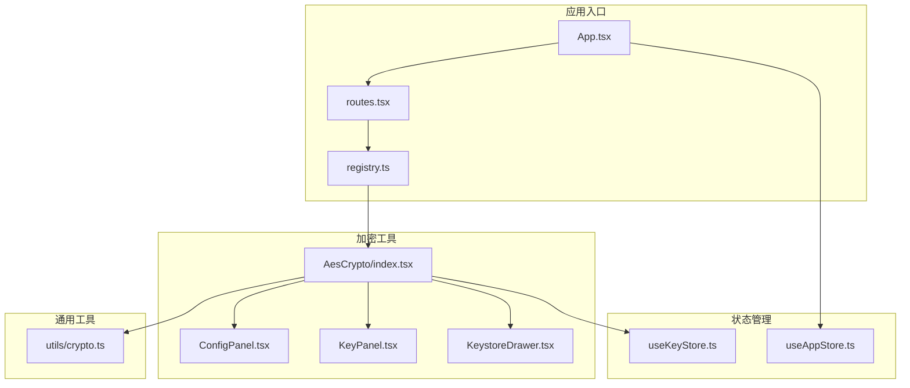
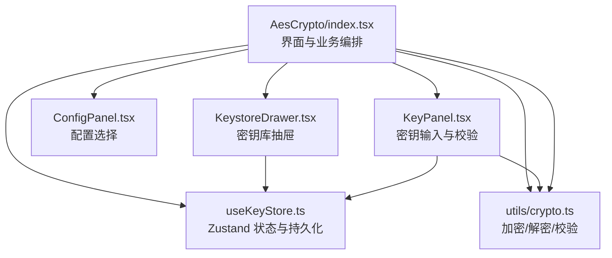
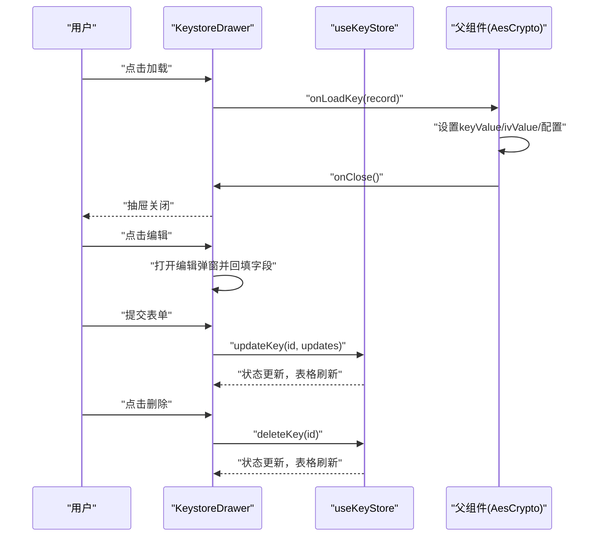
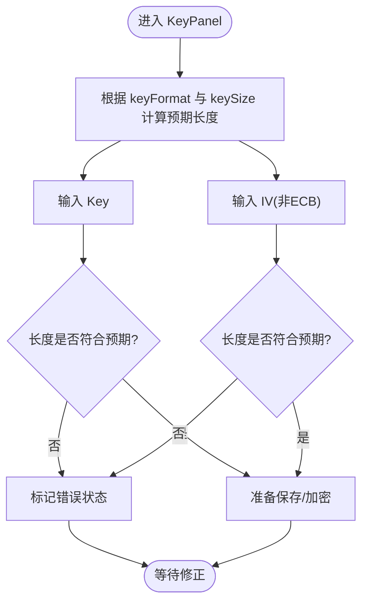
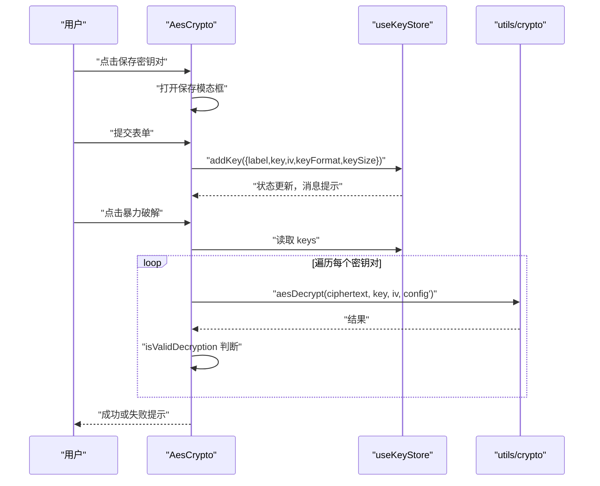
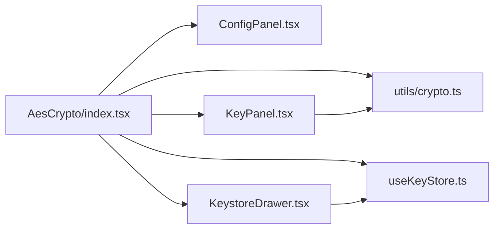

# 密钥库管理

<cite>
**本文引用的文件**
- [src/store/useKeyStore.ts](file://src/store/useKeyStore.ts)
- [src/tools/crypto/AesCrypto/KeystoreDrawer.tsx](file://src/tools/crypto/AesCrypto/KeystoreDrawer.tsx)
- [src/tools/crypto/AesCrypto/KeyPanel.tsx](file://src/tools/crypto/AesCrypto/KeyPanel.tsx)
- [src/tools/crypto/AesCrypto/ConfigPanel.tsx](file://src/tools/crypto/AesCrypto/ConfigPanel.tsx)
- [src/tools/crypto/AesCrypto/index.tsx](file://src/tools/crypto/AesCrypto/index.tsx)
- [src/utils/crypto.ts](file://src/utils/crypto.ts)
- [src/store/useAppStore.ts](file://src/store/useAppStore.ts)
- [src/App.tsx](file://src/App.tsx)
- [src/routes.tsx](file://src/routes.tsx)
- [src/tools/registry.ts](file://src/tools/registry.ts)
</cite>

## 目录
1. [简介](#简介)
2. [项目结构](#项目结构)
3. [核心组件](#核心组件)
4. [架构总览](#架构总览)
5. [详细组件分析](#详细组件分析)
6. [依赖关系分析](#依赖关系分析)
7. [性能考量](#性能考量)
8. [故障排除指南](#故障排除指南)
9. [结论](#结论)
10. [附录](#附录)

## 简介
本技术文档围绕密钥库管理系统展开，重点覆盖以下方面：
- 密钥对的存储机制：密钥、IV、标签与配置信息的数据结构设计与持久化策略
- 密钥库抽屉组件的实现：密钥列表展示、密钥加载、编辑与删除流程
- 状态管理：Zustand Store 的使用、数据持久化与状态同步机制
- 密钥导入导出与批量操作：数据格式转换与批量尝试解密能力
- 安全性考虑：数据加密存储与访问控制建议
- 使用示例与故障排除指南

## 项目结构
本项目采用按功能域划分的目录组织方式，加密工具模块位于 tools/crypto/AesCrypto 下，状态管理位于 store，通用加密逻辑位于 utils/crypto.ts。

图表来源
- [src/App.tsx:1-24](file://src/App.tsx#L1-L24)
- [src/routes.tsx:1-29](file://src/routes.tsx#L1-L29)
- [src/tools/registry.ts:1-39](file://src/tools/registry.ts#L1-L39)
- [src/tools/crypto/AesCrypto/index.tsx:1-310](file://src/tools/crypto/AesCrypto/index.tsx#L1-L310)
- [src/store/useKeyStore.ts:1-47](file://src/store/useKeyStore.ts#L1-L47)
- [src/store/useAppStore.ts:1-24](file://src/store/useAppStore.ts#L1-L24)
- [src/utils/crypto.ts:1-222](file://src/utils/crypto.ts#L1-L222)

章节来源
- [src/App.tsx:1-24](file://src/App.tsx#L1-L24)
- [src/routes.tsx:1-29](file://src/routes.tsx#L1-L29)
- [src/tools/registry.ts:1-39](file://src/tools/registry.ts#L1-L39)

## 核心组件
本节聚焦密钥库管理的核心数据模型与状态管理。

- 数据模型：SavedKeyPair
  - 字段：id、label、key、iv、keyFormat、keySize、createdAt
  - 作用：统一描述一个可持久化的密钥对及其元信息
- 状态容器：useKeyStore
  - 职责：维护密钥对列表，提供新增、更新、删除操作
  - 持久化：通过 persist 中间件以本地存储命名空间“xkutil-aes-keystore”进行持久化
  - 同步：组件通过选择器订阅 keys 变更，自动重渲染

章节来源
- [src/store/useKeyStore.ts:5-20](file://src/store/useKeyStore.ts#L5-L20)
- [src/store/useKeyStore.ts:22-46](file://src/store/useKeyStore.ts#L22-L46)

## 架构总览
密钥库管理的整体架构由“界面层（React 组件）—状态层（Zustand）—工具层（加密算法）”构成，界面层负责用户交互与展示，状态层负责数据持久化与共享，工具层提供加密/解密与随机数生成等能力。

图表来源
- [src/tools/crypto/AesCrypto/index.tsx:33-310](file://src/tools/crypto/AesCrypto/index.tsx#L33-L310)
- [src/tools/crypto/AesCrypto/KeyPanel.tsx:1-114](file://src/tools/crypto/AesCrypto/KeyPanel.tsx#L1-L114)
- [src/tools/crypto/AesCrypto/ConfigPanel.tsx:1-95](file://src/tools/crypto/AesCrypto/ConfigPanel.tsx#L1-L95)
- [src/tools/crypto/AesCrypto/KeystoreDrawer.tsx:1-185](file://src/tools/crypto/AesCrypto/KeystoreDrawer.tsx#L1-L185)
- [src/store/useKeyStore.ts:1-47](file://src/store/useKeyStore.ts#L1-L47)
- [src/utils/crypto.ts:1-222](file://src/utils/crypto.ts#L1-L222)

## 详细组件分析

### 密钥库抽屉组件（KeystoreDrawer）
- 功能概览
  - 展示密钥列表：标签、密钥（截断显示）、密钥长度、创建时间
  - 操作列：加载、编辑、删除
  - 编辑弹窗：支持修改标签、密钥、IV、密钥长度
- 关键流程
  - 列表渲染：基于 useKeyStore 的 keys
  - 加载：调用父组件回调 onLoadKey，关闭抽屉
  - 编辑：打开弹窗，回填当前值，保存后通过 updateKey 更新
  - 删除：确认后通过 deleteKey 移除

图表来源
- [src/tools/crypto/AesCrypto/KeystoreDrawer.tsx:26-185](file://src/tools/crypto/AesCrypto/KeystoreDrawer.tsx#L26-L185)
- [src/store/useKeyStore.ts:15-20](file://src/store/useKeyStore.ts#L15-L20)

章节来源
- [src/tools/crypto/AesCrypto/KeystoreDrawer.tsx:20-122](file://src/tools/crypto/AesCrypto/KeystoreDrawer.tsx#L20-L122)
- [src/tools/crypto/AesCrypto/KeystoreDrawer.tsx:142-181](file://src/tools/crypto/AesCrypto/KeystoreDrawer.tsx#L142-L181)

### 密钥面板（KeyPanel）
- 功能概览
  - 提供密钥与 IV 的输入框，并根据配置计算预期长度与占位提示
  - 支持随机生成密钥与 IV
  - 提供保存密钥对与打开密钥库按钮
- 校验逻辑
  - 基于 keyFormat 与 keySize 计算预期字符数
  - 对 ECB 模式禁用 IV 输入
  - 通过 status 展示输入有效性

图表来源
- [src/tools/crypto/AesCrypto/KeyPanel.tsx:35-59](file://src/tools/crypto/AesCrypto/KeyPanel.tsx#L35-L59)
- [src/utils/crypto.ts:44-57](file://src/utils/crypto.ts#L44-L57)

章节来源
- [src/tools/crypto/AesCrypto/KeyPanel.tsx:10-34](file://src/tools/crypto/AesCrypto/KeyPanel.tsx#L10-L34)
- [src/tools/crypto/AesCrypto/KeyPanel.tsx:61-112](file://src/tools/crypto/AesCrypto/KeyPanel.tsx#L61-L112)

### 配置面板（ConfigPanel）
- 功能概览
  - 选择 AES 模式（CBC/ECB/CFB/OFB/CTR）
  - 选择填充方式（Pkcs7/ZeroPadding/NoPadding）
  - 选择输出格式（Base64/Hex）
  - 选择密钥格式（UTF-8/Hex）
  - 选择密钥长度（128/192/256）
- 交互
  - onChange 回调将新配置合并到父组件状态

章节来源
- [src/tools/crypto/AesCrypto/ConfigPanel.tsx:39-94](file://src/tools/crypto/AesCrypto/ConfigPanel.tsx#L39-L94)

### 主界面（AesCrypto）
- 功能概览
  - 配置面板与密钥面板组合，提供加密、解密、暴力破解、复制输出、清空等操作
  - 保存密钥对：打开模态框，收集标签、密钥、IV，调用 addKey 持久化
  - 打开密钥库：打开抽屉，加载密钥对到当前界面
  - 暴力破解：遍历密钥库中的密钥对，尝试解密并验证输出可读性
- 关键流程
  - 加密/解密：调用 aesEncrypt/aesDecrypt，返回结果或错误
  - 暴力破解：逐个尝试，使用 isValidDecryption 过滤无效解密

图表来源
- [src/tools/crypto/AesCrypto/index.tsx:131-155](file://src/tools/crypto/AesCrypto/index.tsx#L131-L155)
- [src/tools/crypto/AesCrypto/index.tsx:87-112](file://src/tools/crypto/AesCrypto/index.tsx#L87-L112)
- [src/store/useKeyStore.ts:26-42](file://src/store/useKeyStore.ts#L26-L42)
- [src/utils/crypto.ts:107-162](file://src/utils/crypto.ts#L107-L162)
- [src/utils/crypto.ts:202-221](file://src/utils/crypto.ts#L202-L221)

章节来源
- [src/tools/crypto/AesCrypto/index.tsx:33-310](file://src/tools/crypto/AesCrypto/index.tsx#L33-L310)

### 加密工具（utils/crypto）
- 类型与配置
  - AesMode、AesPadding、OutputFormat、KeyFormat、KeySize
  - AesConfig：集中管理加密参数
- 核心函数
  - aesEncrypt/aesDecrypt：执行加解密，支持多种模式与填充
  - generateRandomKey/generateRandomIV：生成随机密钥与 IV
  - validateKeyLength/validateIV：基础格式校验
  - isValidDecryption：判断解密结果是否可读（过滤乱码）

章节来源
- [src/utils/crypto.ts:3-15](file://src/utils/crypto.ts#L3-L15)
- [src/utils/crypto.ts:59-162](file://src/utils/crypto.ts#L59-L162)
- [src/utils/crypto.ts:164-200](file://src/utils/crypto.ts#L164-L200)
- [src/utils/crypto.ts:202-221](file://src/utils/crypto.ts#L202-L221)

## 依赖关系分析
- 组件依赖
  - AesCrypto 依赖 ConfigPanel、KeyPanel、KeystoreDrawer、useKeyStore、utils/crypto
  - KeystoreDrawer 依赖 useKeyStore 与 Ant Design 组件
  - KeyPanel 依赖 utils/crypto 的随机生成与长度计算
- 状态依赖
  - useKeyStore 通过 persist 中间件与浏览器本地存储交互
  - useAppStore 管理应用主题与侧边栏折叠状态，与密钥库无直接耦合

图表来源
- [src/tools/crypto/AesCrypto/index.tsx:20-29](file://src/tools/crypto/AesCrypto/index.tsx#L20-L29)
- [src/tools/crypto/AesCrypto/KeystoreDrawer.tsx:16](file://src/tools/crypto/AesCrypto/KeystoreDrawer.tsx#L16)
- [src/tools/crypto/AesCrypto/KeyPanel.tsx:7-8](file://src/tools/crypto/AesCrypto/KeyPanel.tsx#L7-L8)

章节来源
- [src/store/useKeyStore.ts:1-47](file://src/store/useKeyStore.ts#L1-L47)
- [src/store/useAppStore.ts:1-24](file://src/store/useAppStore.ts#L1-L24)

## 性能考量
- 状态粒度
  - useKeyStore 将 keys 作为单一状态，适合中小规模密钥集；若密钥数量增长，可考虑分页或虚拟化列表优化渲染
- 计算复杂度
  - 暴力破解为线性遍历，复杂度 O(n)，n 为密钥数量；可通过索引或预筛选（如按 keySize/keyFormat）降低尝试次数
- I/O 与持久化
  - persist 中间件在每次变更写入本地存储，频繁更新可能带来抖动；可在批量操作时减少触发频率
- UI 交互
  - 表格列宽与 ellipsis 配置有助于提升可读性；对于超长密钥展示，建议采用点击复制或分段显示

## 故障排除指南
- 常见错误与定位
  - “密钥长度错误”：检查 keyFormat 与 keySize 是否一致，Hex 模式下长度应为字节数×2
  - “IV 长度错误”：非 ECB 模式下 IV 必须为 16 字节（Hex 模式为 32 字符）
  - “解密失败：结果为空”：确认密钥、IV、模式、填充与输出格式一致
  - “暴力破解失败”：确认密钥库中存在匹配的密钥对，且输出通过 isValidDecryption 校验
- 用户操作建议
  - 在 Hex 模式下确保输入仅包含十六进制字符
  - ECB 模式无需 IV，禁用 IV 输入
  - 使用“保存密钥对”前先生成随机密钥与 IV，避免手动输入错误
- 环境与权限
  - 浏览器需允许本地存储；若隐私模式或受限环境可能导致持久化失败

章节来源
- [src/utils/crypto.ts:64-105](file://src/utils/crypto.ts#L64-L105)
- [src/utils/crypto.ts:112-162](file://src/utils/crypto.ts#L112-L162)
- [src/tools/crypto/AesCrypto/index.tsx:87-112](file://src/tools/crypto/AesCrypto/index.tsx#L87-L112)

## 结论
本密钥库管理系统以清晰的模块划分与简洁的状态管理实现了密钥对的存储、展示与使用。通过 Zustand 的 persist 中间件，密钥信息得以持久化；通过 KeystoreDrawer 与 AesCrypto 的协作，用户可以高效地管理密钥并进行批量尝试解密。未来可在大规模场景下引入分页、索引与更细粒度的状态拆分，以进一步提升性能与可维护性。

## 附录
- 使用示例（步骤说明）
  - 新增密钥对
    - 在 KeyPanel 生成随机密钥与 IV，填写标签，点击“保存密钥对”
    - 在弹窗中确认保存，消息提示“密钥对已保存”
  - 加载密钥对
    - 打开密钥库抽屉，点击“加载”，当前界面自动填充密钥与 IV，并同步配置
  - 暴力破解
    - 准备密文与至少一个密钥对，点击“暴力破解”，系统逐个尝试并提示匹配结果
- 安全性建议
  - 本地存储未加密：当前实现仅持久化明文密钥与 IV，建议在生产环境中结合平台级安全存储或应用内加密后再持久化
  - 访问控制：建议在应用层面增加登录态与权限校验，限制对密钥库的访问
  - 日志与审计：记录关键操作（新增、删除、加载）以便审计