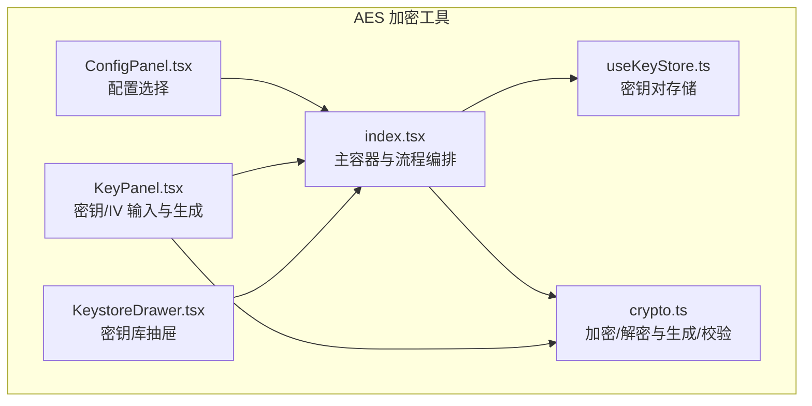
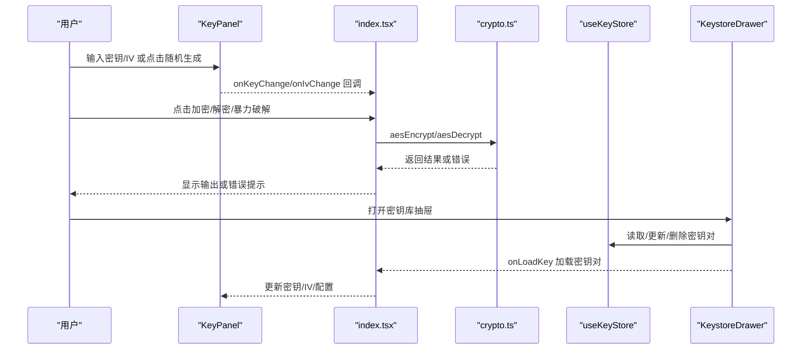
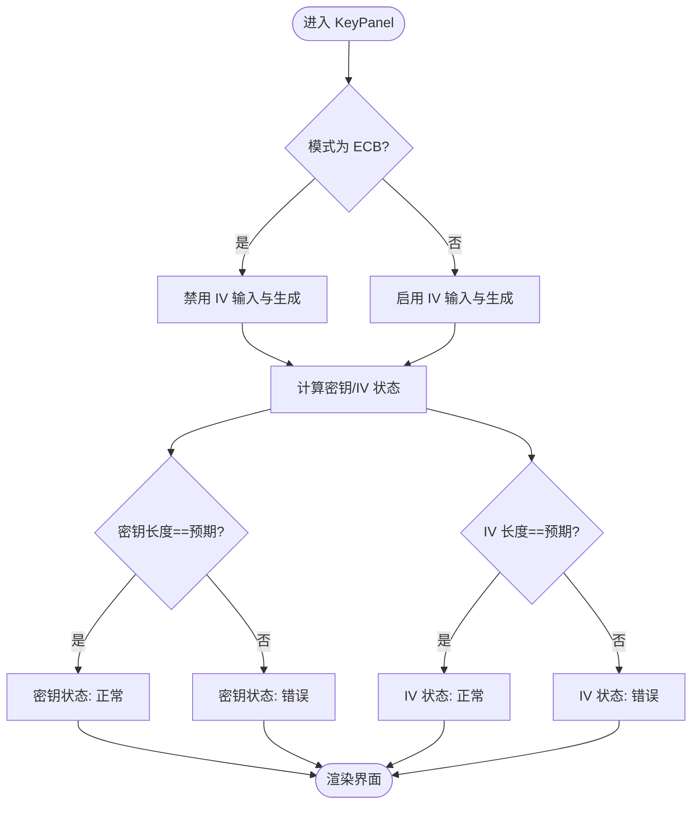
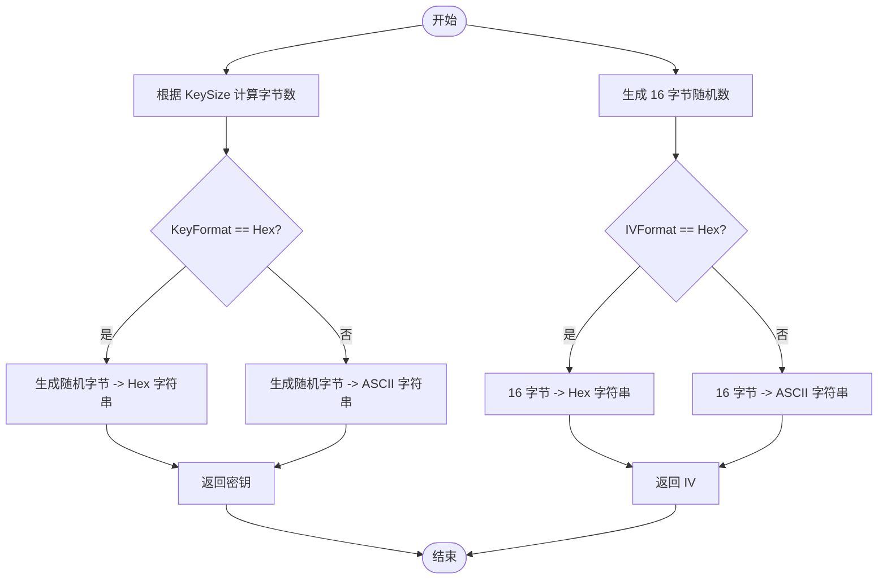
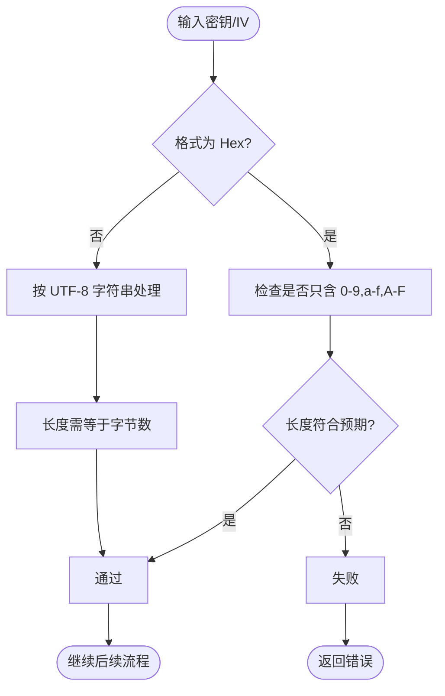
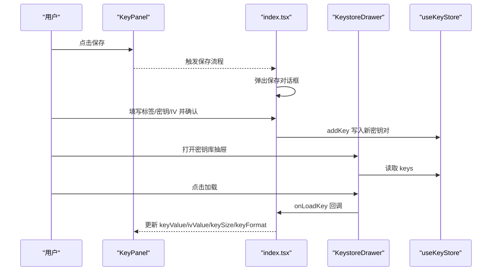
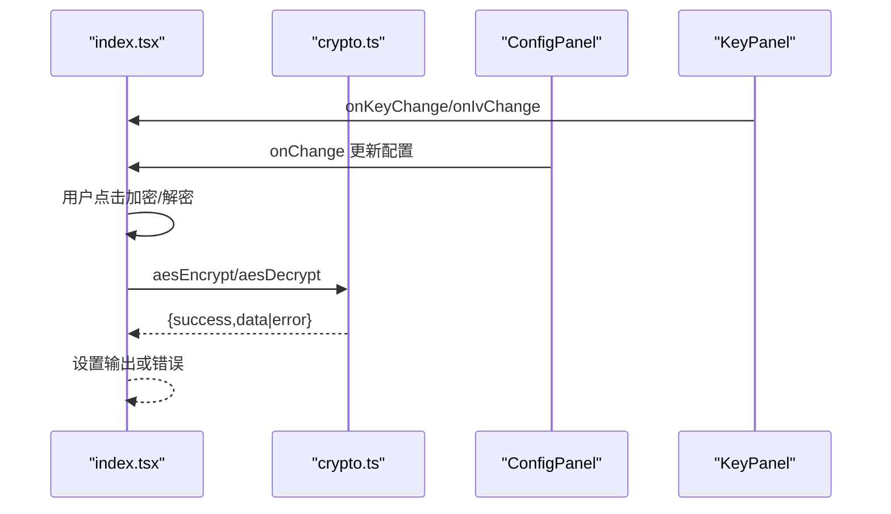
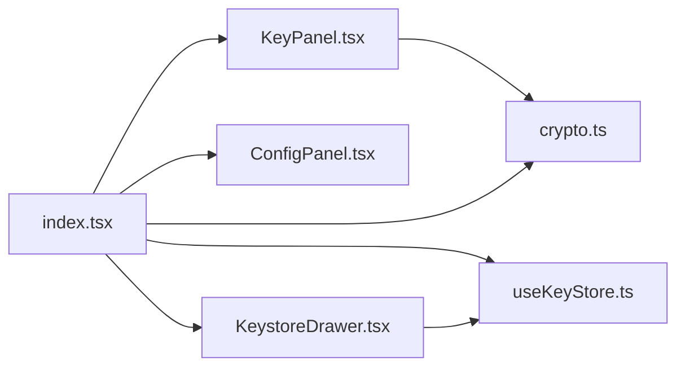

# 密钥面板

<cite>
**本文引用的文件**
- [KeyPanel.tsx](file://src/tools/crypto/AesCrypto/KeyPanel.tsx)
- [useKeyStore.ts](file://src/store/useKeyStore.ts)
- [crypto.ts](file://src/utils/crypto.ts)
- [KeystoreDrawer.tsx](file://src/tools/crypto/AesCrypto/KeystoreDrawer.tsx)
- [index.tsx](file://src/tools/crypto/AesCrypto/index.tsx)
- [ConfigPanel.tsx](file://src/tools/crypto/AesCrypto/ConfigPanel.tsx)
</cite>

## 目录
1. [简介](#简介)
2. [项目结构](#项目结构)
3. [核心组件](#核心组件)
4. [架构总览](#架构总览)
5. [详细组件分析](#详细组件分析)
6. [依赖关系分析](#依赖关系分析)
7. [性能考量](#性能考量)
8. [故障排查指南](#故障排查指南)
9. [结论](#结论)
10. [附录：使用示例与最佳实践](#附录使用示例与最佳实践)

## 简介
本文件面向“密钥面板”组件，系统性阐述其在 AES 加密工具中的作用与实现细节，重点覆盖：
- 密钥输入处理机制：长度验证、Hex 格式校验与密钥生成
- IV（初始化向量）管理：生成、验证与与密钥的配对使用
- 随机密钥生成算法：安全随机数生成与密钥格式转换
- 密钥面板与密钥库的交互：密钥加载、保存与编辑
- 使用示例与最佳实践：安全性考虑与错误处理策略

## 项目结构
密钥面板位于 AES 加密工具模块中，围绕密钥输入、配置选择、密钥库交互与加解密流程展开。关键文件与职责如下：
- KeyPanel.tsx：密钥与 IV 的输入、占位提示、状态提示与随机生成按钮
- ConfigPanel.tsx：AES 模式、填充、输出格式、密钥格式与密钥长度的选择
- index.tsx：主容器，协调配置、密钥、输入输出、错误提示与密钥库抽屉
- KeystoreDrawer.tsx：密钥库抽屉，支持查看、编辑、删除与加载密钥对
- useKeyStore.ts：基于 Zustand 的本地持久化存储，管理密钥对集合
- crypto.ts：核心加密/解密逻辑、密钥/IV 生成、长度与格式校验

图表来源
- [index.tsx:33-309](file://src/tools/crypto/AesCrypto/index.tsx#L33-L309)
- [KeyPanel.tsx:23-114](file://src/tools/crypto/AesCrypto/KeyPanel.tsx#L23-L114)
- [ConfigPanel.tsx:39-94](file://src/tools/crypto/AesCrypto/ConfigPanel.tsx#L39-L94)
- [KeystoreDrawer.tsx:26-184](file://src/tools/crypto/AesCrypto/KeystoreDrawer.tsx#L26-L184)
- [useKeyStore.ts:22-46](file://src/store/useKeyStore.ts#L22-L46)
- [crypto.ts:59-162](file://src/utils/crypto.ts#L59-L162)

章节来源
- [index.tsx:33-309](file://src/tools/crypto/AesCrypto/index.tsx#L33-L309)
- [KeyPanel.tsx:23-114](file://src/tools/crypto/AesCrypto/KeyPanel.tsx#L23-L114)
- [ConfigPanel.tsx:39-94](file://src/tools/crypto/AesCrypto/ConfigPanel.tsx#L39-L94)
- [KeystoreDrawer.tsx:26-184](file://src/tools/crypto/AesCrypto/KeystoreDrawer.tsx#L26-L184)
- [useKeyStore.ts:22-46](file://src/store/useKeyStore.ts#L22-L46)
- [crypto.ts:59-162](file://src/utils/crypto.ts#L59-L162)

## 核心组件
- 密钥面板（KeyPanel）
  - 负责密钥与 IV 的输入、占位提示、状态提示（长度是否正确）、随机生成按钮
  - 支持 Hex 与 UTF-8 两种密钥格式，自动根据密钥长度与格式计算预期字符数
  - 在非 ECB 模式下启用 IV 输入与随机生成
- 配置面板（ConfigPanel）
  - 提供 AES 模式、填充方式、输出格式、密钥格式与密钥长度的选择
- 主容器（index.tsx）
  - 组织配置、密钥、输入输出、错误提示与密钥库抽屉
  - 执行加密/解密与暴力破解流程，并与密钥库交互
- 密钥库抽屉（KeystoreDrawer）
  - 展示、编辑、删除与加载密钥对
- 存储（useKeyStore）
  - 基于持久化状态管理密钥对集合，提供增删改查能力
- 加密工具（crypto.ts）
  - 实现 AES 加解密、密钥/IV 生成、长度与格式校验、解密有效性判断

章节来源
- [KeyPanel.tsx:23-114](file://src/tools/crypto/AesCrypto/KeyPanel.tsx#L23-L114)
- [ConfigPanel.tsx:39-94](file://src/tools/crypto/AesCrypto/ConfigPanel.tsx#L39-L94)
- [index.tsx:33-309](file://src/tools/crypto/AesCrypto/index.tsx#L33-L309)
- [KeystoreDrawer.tsx:26-184](file://src/tools/crypto/AesCrypto/KeystoreDrawer.tsx#L26-L184)
- [useKeyStore.ts:22-46](file://src/store/useKeyStore.ts#L22-L46)
- [crypto.ts:59-162](file://src/utils/crypto.ts#L59-L162)

## 架构总览
密钥面板作为用户输入与生成的入口，与配置面板共同决定加密参数；主容器负责调用加密工具执行加解密与暴力破解；密钥库通过抽屉提供持久化的密钥对管理；存储层负责本地持久化。

图表来源
- [KeyPanel.tsx:23-114](file://src/tools/crypto/AesCrypto/KeyPanel.tsx#L23-L114)
- [index.tsx:55-112](file://src/tools/crypto/AesCrypto/index.tsx#L55-L112)
- [crypto.ts:59-162](file://src/utils/crypto.ts#L59-L162)
- [useKeyStore.ts:22-46](file://src/store/useKeyStore.ts#L22-L46)
- [KeystoreDrawer.tsx:26-184](file://src/tools/crypto/AesCrypto/KeystoreDrawer.tsx#L26-L184)

## 详细组件分析

### 密钥面板（KeyPanel）
- 输入与占位提示
  - 密钥与 IV 的占位提示会根据当前密钥格式与密钥长度动态生成预期字符数
  - Hex 格式下，密钥长度为字节数×2；IV 长度固定为 32（16 字节）
  - UTF-8 格式下，密钥与 IV 的预期长度为字节数
- 状态提示
  - 当输入长度等于预期长度时显示正常状态；否则显示错误状态
  - ECB 模式下禁用 IV 输入与随机生成按钮
- 随机生成
  - 点击随机生成按钮会调用工具函数生成新的密钥或 IV，并回填到输入框
- 保存与打开密钥库
  - 保存按钮触发保存对话框，打开密钥库按钮打开抽屉以进行加载/编辑/删除

图表来源
- [KeyPanel.tsx:35-51](file://src/tools/crypto/AesCrypto/KeyPanel.tsx#L35-L51)

章节来源
- [KeyPanel.tsx:23-114](file://src/tools/crypto/AesCrypto/KeyPanel.tsx#L23-L114)

### 随机密钥与 IV 生成算法
- 密钥生成
  - 基于安全随机数生成指定长度的字节序列
  - Hex 格式：直接转为十六进制字符串
  - UTF-8 格式：生成可打印 ASCII 字符串（包含字母、数字与部分符号），长度等于密钥字节数
- IV 生成
  - 固定 16 字节长度
  - Hex 格式：十六进制字符串
  - UTF-8 格式：可打印 ASCII 字符串，长度为 16
- 安全性说明
  - 使用安全随机源生成密钥与 IV，满足 AES 密钥强度要求
  - UTF-8 模式下的字符集限制为可打印 ASCII，便于人工输入与展示

图表来源
- [crypto.ts:164-191](file://src/utils/crypto.ts#L164-L191)

章节来源
- [crypto.ts:164-191](file://src/utils/crypto.ts#L164-L191)

### 密钥与 IV 的长度验证与格式校验
- 密钥长度验证
  - Hex 格式：仅允许十六进制字符，且长度必须等于期望长度（字节数×2）
- IV 验证
  - Hex 格式：仅允许十六进制字符，且长度必须为 32
- 解密有效性判断
  - 判断结果是否为空
  - 排除替换字符（无效 UTF-8 占位符）
  - 计算可打印字符比例，阈值高于 0.9 以确保可读性

图表来源
- [crypto.ts:192-200](file://src/utils/crypto.ts#L192-L200)
- [crypto.ts:202-221](file://src/utils/crypto.ts#L202-L221)

章节来源
- [crypto.ts:192-200](file://src/utils/crypto.ts#L192-L200)
- [crypto.ts:202-221](file://src/utils/crypto.ts#L202-L221)

### 密钥面板与密钥库的交互机制
- 保存密钥对
  - 从密钥面板点击保存，弹出对话框输入标签、密钥与 IV，确认后写入密钥库
- 加载密钥对
  - 在密钥库抽屉中点击“加载”，主容器更新密钥、IV 与配置（密钥长度与格式）
- 编辑与删除
  - 支持编辑标签、密钥与 IV，以及删除密钥对
- 持久化
  - 使用持久化中间件，数据保存在本地存储中

图表来源
- [index.tsx:131-155](file://src/tools/crypto/AesCrypto/index.tsx#L131-L155)
- [KeystoreDrawer.tsx:26-184](file://src/tools/crypto/AesCrypto/KeystoreDrawer.tsx#L26-L184)
- [useKeyStore.ts:22-46](file://src/store/useKeyStore.ts#L22-L46)

章节来源
- [index.tsx:131-155](file://src/tools/crypto/AesCrypto/index.tsx#L131-L155)
- [KeystoreDrawer.tsx:26-184](file://src/tools/crypto/AesCrypto/KeystoreDrawer.tsx#L26-L184)
- [useKeyStore.ts:22-46](file://src/store/useKeyStore.ts#L22-L46)

### 加密/解密流程与错误处理
- 加密流程
  - 校验密钥长度与格式
  - 若非 ECB 模式，校验 IV 长度与格式
  - 选择模式与填充，执行加密
  - 根据输出格式返回 Base64 或 Hex
- 解密流程
  - 校验密钥长度与格式
  - 若非 ECB 模式，校验 IV 长度与格式
  - 解析密文（Base64 或 Hex），执行解密
  - 将结果转为 UTF-8 文本，进行有效性判断
- 错误处理
  - 长度/格式错误：明确提示期望长度与实际长度
  - 解密失败：提示结果为空或异常消息
  - 暴力破解：遍历密钥库尝试解密，使用可读性判断筛选有效结果

图表来源
- [index.tsx:55-85](file://src/tools/crypto/AesCrypto/index.tsx#L55-L85)
- [crypto.ts:59-162](file://src/utils/crypto.ts#L59-L162)

章节来源
- [index.tsx:55-85](file://src/tools/crypto/AesCrypto/index.tsx#L55-L85)
- [crypto.ts:59-162](file://src/utils/crypto.ts#L59-L162)

## 依赖关系分析
- KeyPanel 依赖 crypto.ts 中的随机生成函数
- 主容器 index.tsx 依赖 ConfigPanel、KeyPanel、KeystoreDrawer、useKeyStore、crypto.ts
- KeystoreDrawer 依赖 useKeyStore
- crypto.ts 依赖第三方库进行加密/解密与字节转换

图表来源
- [KeyPanel.tsx:7-8](file://src/tools/crypto/AesCrypto/KeyPanel.tsx#L7-L8)
- [index.tsx:20-29](file://src/tools/crypto/AesCrypto/index.tsx#L20-L29)
- [KeystoreDrawer.tsx:16](file://src/tools/crypto/AesCrypto/KeystoreDrawer.tsx#L16)
- [useKeyStore.ts:3](file://src/store/useKeyStore.ts#L3)
- [crypto.ts:1](file://src/utils/crypto.ts#L1)

章节来源
- [KeyPanel.tsx:7-8](file://src/tools/crypto/AesCrypto/KeyPanel.tsx#L7-L8)
- [index.tsx:20-29](file://src/tools/crypto/AesCrypto/index.tsx#L20-L29)
- [KeystoreDrawer.tsx:16](file://src/tools/crypto/AesCrypto/KeystoreDrawer.tsx#L16)
- [useKeyStore.ts:3](file://src/store/useKeyStore.ts#L3)
- [crypto.ts:1](file://src/utils/crypto.ts#L1)

## 性能考量
- 随机生成
  - 密钥与 IV 生成使用安全随机源，时间复杂度低，适合频繁调用
- 长度与格式校验
  - 正则与长度比较为 O(n) 操作，n 为输入长度，开销极小
- 解密暴力破解
  - 遍历密钥库进行尝试，时间复杂度与密钥库大小线性相关；建议控制密钥库规模或增加索引策略（当前未实现）

## 故障排查指南
- 密钥/IV 长度错误
  - 现象：输入框状态标红
  - 处理：根据提示调整为期望长度（Hex 模式下为字节数×2；IV 为 32）
- Hex 格式非法
  - 现象：校验失败
  - 处理：仅允许 0-9、a-f、A-F 字符
- ECB 模式下 IV 不生效
  - 现象：IV 输入被禁用
  - 处理：切换到非 ECB 模式或保持 IV 空值
- 解密结果为空或乱码
  - 现象：解密失败或出现替换字符
  - 处理：检查密钥/IV 是否正确、配置是否一致、输出格式是否匹配
- 暴力破解无结果
  - 现象：尝试多个密钥均失败
  - 处理：确认密文来源、输出格式与密钥库中记录一致

章节来源
- [KeyPanel.tsx:39-51](file://src/tools/crypto/AesCrypto/KeyPanel.tsx#L39-L51)
- [crypto.ts:68-88](file://src/utils/crypto.ts#L68-L88)
- [crypto.ts:116-136](file://src/utils/crypto.ts#L116-L136)
- [crypto.ts:154-156](file://src/utils/crypto.ts#L154-L156)
- [index.tsx:87-112](file://src/tools/crypto/AesCrypto/index.tsx#L87-L112)

## 结论
密钥面板通过直观的输入与状态提示，结合随机生成与密钥库持久化，为 AES 加密工具提供了易用且安全的密钥管理入口。配合严格的长度与格式校验、解密有效性判断与暴力破解辅助，能够显著提升用户体验与安全性。

## 附录：使用示例与最佳实践
- 使用示例
  - 生成密钥：在密钥面板点击“随机生成”按钮，自动填充 Hex 格式的密钥
  - 生成 IV：在非 ECB 模式下点击“随机生成”按钮，自动填充 Hex 格式的 IV
  - 保存密钥对：填写标签并点击保存，随后可在密钥库中查看与加载
  - 加载密钥对：在密钥库抽屉中点击“加载”，主容器自动同步密钥、IV 与配置
- 最佳实践
  - 密钥格式优先使用 Hex，便于传输与存储
  - 非 ECB 模式务必提供正确的 IV，长度固定为 32（Hex）
  - 保存密钥对时添加有意义的标签，便于识别用途与环境
  - 定期清理密钥库，避免泄露风险
  - 解密前确保输出格式与加密时一致，避免 Base64 与 Hex 混用导致失败
  - 对于敏感场景，建议使用 256 位密钥并采用 CBC/PKCS7 填充