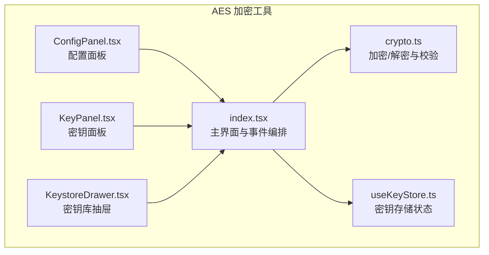
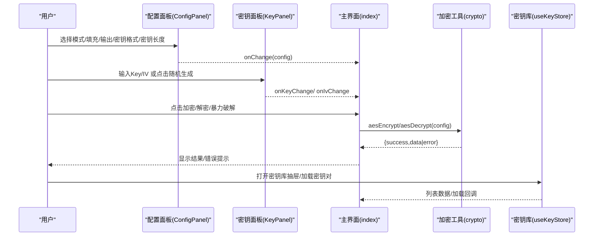
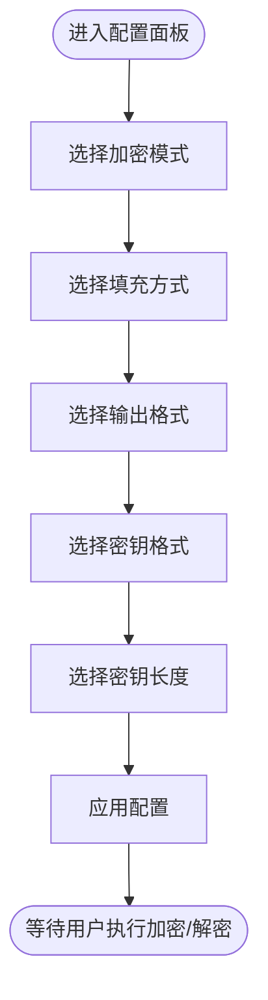
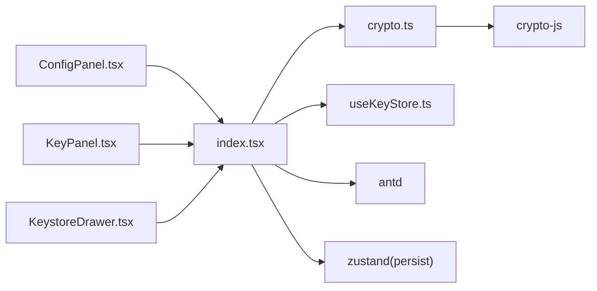

# 配置面板

<cite>
**本文引用的文件列表**
- [ConfigPanel.tsx](file://src/tools/crypto/AesCrypto/ConfigPanel.tsx)
- [crypto.ts](file://src/utils/crypto.ts)
- [index.tsx](file://src/tools/crypto/AesCrypto/index.tsx)
- [KeyPanel.tsx](file://src/tools/crypto/AesCrypto/KeyPanel.tsx)
- [KeystoreDrawer.tsx](file://src/tools/crypto/AesCrypto/KeystoreDrawer.tsx)
- [useKeyStore.ts](file://src/store/useKeyStore.ts)
- [package.json](file://package.json)
</cite>

## 目录
1. [简介](#简介)
2. [项目结构](#项目结构)
3. [核心组件](#核心组件)
4. [架构总览](#架构总览)
5. [详细组件分析](#详细组件分析)
6. [依赖关系分析](#依赖关系分析)
7. [性能与安全考量](#性能与安全考量)
8. [故障排查指南](#故障排查指南)
9. [结论](#结论)
10. [附录：配置示例与最佳实践](#附录配置示例与最佳实践)

## 简介
本文件面向“配置面板”组件，系统性说明 AES 加密配置项的设计与实现，涵盖：
- 加密模式选择（CBC、ECB、CFB、OFB、CTR）
- 填充方式配置（Pkcs7、ZeroPadding、NoPadding）
- 输出格式设置（Base64、Hex）
- 密钥格式选择（UTF-8、Hex）
- 各配置组合的使用建议与注意事项
- 与密钥库、密钥/IV 生成、暴力破解流程的集成

目标是帮助用户在不同场景下选择最合适的加密配置，并理解各选项对安全性与兼容性的权衡。

## 项目结构
配置面板位于工具模块的 AES 加密子模块中，配合密钥面板、密钥库抽屉与全局状态管理共同构成完整的加密工作流。

图表来源
- [ConfigPanel.tsx:1-95](file://src/tools/crypto/AesCrypto/ConfigPanel.tsx#L1-L95)
- [KeyPanel.tsx:1-114](file://src/tools/crypto/AesCrypto/KeyPanel.tsx#L1-L114)
- [KeystoreDrawer.tsx:1-185](file://src/tools/crypto/AesCrypto/KeystoreDrawer.tsx#L1-L185)
- [index.tsx:1-310](file://src/tools/crypto/AesCrypto/index.tsx#L1-L310)
- [crypto.ts:1-222](file://src/utils/crypto.ts#L1-L222)
- [useKeyStore.ts:1-47](file://src/store/useKeyStore.ts#L1-L47)

章节来源
- [ConfigPanel.tsx:1-95](file://src/tools/crypto/AesCrypto/ConfigPanel.tsx#L1-L95)
- [index.tsx:1-310](file://src/tools/crypto/AesCrypto/index.tsx#L1-L310)

## 核心组件
- 配置面板（ConfigPanel）：提供模式、填充、输出格式、密钥格式、密钥长度的选择器，驱动全局配置变更。
- 密钥面板（KeyPanel）：负责密钥与 IV 的输入、占位提示、长度校验、随机生成按钮。
- 主界面（index.tsx）：聚合配置面板、密钥面板、输入输出区、错误提示、暴力破解、复制与清空等交互。
- 加密工具（crypto.ts）：封装 AES 加密/解密、密钥/IV 长度计算、输出格式转换、解密有效性判断等。
- 密钥库（KeystoreDrawer + useKeyStore）：持久化保存密钥对，支持加载、编辑、删除与批量暴力破解。

章节来源
- [ConfigPanel.tsx:1-95](file://src/tools/crypto/AesCrypto/ConfigPanel.tsx#L1-L95)
- [KeyPanel.tsx:1-114](file://src/tools/crypto/AesCrypto/KeyPanel.tsx#L1-L114)
- [index.tsx:1-310](file://src/tools/crypto/AesCrypto/index.tsx#L1-L310)
- [crypto.ts:1-222](file://src/utils/crypto.ts#L1-L222)
- [KeystoreDrawer.tsx:1-185](file://src/tools/crypto/AesCrypto/KeystoreDrawer.tsx#L1-L185)
- [useKeyStore.ts:1-47](file://src/store/useKeyStore.ts#L1-L47)

## 架构总览
配置面板通过受控组件与回调函数将用户选择的配置传递给主界面；主界面根据配置调用加密工具执行加/解密，并将结果回显到输出区。密钥库用于保存多组密钥对，支持一键加载与暴力破解。

图表来源
- [ConfigPanel.tsx:39-94](file://src/tools/crypto/AesCrypto/ConfigPanel.tsx#L39-L94)
- [KeyPanel.tsx:23-113](file://src/tools/crypto/AesCrypto/KeyPanel.tsx#L23-L113)
- [index.tsx:55-112](file://src/tools/crypto/AesCrypto/index.tsx#L55-L112)
- [crypto.ts:59-162](file://src/utils/crypto.ts#L59-L162)
- [useKeyStore.ts:22-46](file://src/store/useKeyStore.ts#L22-L46)

## 详细组件分析

### 配置面板（ConfigPanel）
- 功能要点
  - 模式：CBC、ECB、CFB、OFB、CTR
  - 填充：Pkcs7、ZeroPadding、NoPadding
  - 输出：Base64、Hex
  - 密钥格式：UTF-8、Hex
  - 密钥长度：128、192、256 位
- 设计模式
  - 受控组件：通过 props 接收当前配置与变更回调，保证状态集中管理。
  - 下拉选择器：统一的 Ant Design Select 组件，尺寸与样式一致。
- 数据流
  - 用户选择 -> onChange -> 上层组件更新全局配置 -> 影响后续加密/解密行为。

图表来源
- [ConfigPanel.tsx:9-37](file://src/tools/crypto/AesCrypto/ConfigPanel.tsx#L9-L37)

章节来源
- [ConfigPanel.tsx:1-95](file://src/tools/crypto/AesCrypto/ConfigPanel.tsx#L1-L95)

### 密钥面板（KeyPanel）
- 功能要点
  - Key/IV 输入框，带占位提示与长度状态（error/ok）。
  - 随机生成按钮：调用工具函数生成符合当前密钥格式与长度的随机 Key/IV。
  - ECB 模式禁用 IV 输入。
- 长度计算
  - Key 长度：按密钥位数除以 8 得到字节数；若为 Hex 格式则乘以 2。
  - IV 长度：固定 16 字节（Hex 为 32 字符，UTF-8 为 16 字符）。
- 交互体验
  - 即时长度校验，错误状态高亮，提升输入准确性。

章节来源
- [KeyPanel.tsx:1-114](file://src/tools/crypto/AesCrypto/KeyPanel.tsx#L1-L114)
- [crypto.ts:44-57](file://src/utils/crypto.ts#L44-L57)

### 主界面（index.tsx）
- 功能要点
  - 初始化默认配置（CBC/Pkcs7/Base64/UTF-8/128）。
  - 提供加密、解密、暴力破解、复制输出、清空等操作按钮。
  - 集成密钥库抽屉与保存密钥对弹窗。
  - 错误与成功提示，暴力破解结果反馈。
- 关键流程
  - 加密/解密：读取输入文本、Key/IV、配置，调用加密工具，展示结果或错误。
  - 暴力破解：遍历密钥库中的密钥对，尝试解密并使用有效性判断函数筛选正确结果。

章节来源
- [index.tsx:33-112](file://src/tools/crypto/AesCrypto/index.tsx#L33-L112)
- [crypto.ts:202-221](file://src/utils/crypto.ts#L202-L221)

### 加密工具（crypto.ts）
- 类型与映射
  - 模式映射：将字符串模式映射到 CryptoJS 对应模式对象。
  - 填充映射：将字符串填充映射到 CryptoJS 对应填充对象。
- 核心函数
  - aesEncrypt：校验 Key/IV 长度，构造 CryptoJS.AES.encrypt 参数，按输出格式返回 Base64 或 Hex。
  - aesDecrypt：根据输出格式解析 CipherParams，执行 CryptoJS.AES.decrypt 并转回 UTF-8 文本。
  - generateRandomKey/IV：按格式生成随机 Key/IV。
  - validateKeyLength/validateIV：正则与长度校验。
  - isValidDecryption：基于替换字符与可打印字符比例的解密结果有效性判断。
- 安全注意
  - ECB 模式不使用 IV，且存在语义可预测风险，不推荐用于一般场景。
  - Pkcs7 填充在大多数场景下更通用；NoPadding 要求明文长度严格对齐。
  - Base64 输出便于网络传输与存储；Hex 输出便于调试与一致性比对。

章节来源
- [crypto.ts:1-222](file://src/utils/crypto.ts#L1-L222)

### 密钥库（KeystoreDrawer + useKeyStore）
- 功能要点
  - 列表展示：标签、Key（截断显示）、长度、创建时间。
  - 操作：导入（加载到当前配置）、编辑、删除。
  - 状态持久化：基于 zustand 的持久化中间件。
- 与暴力破解的协作
  - 主界面遍历密钥库，按每条记录的 keyFormat 与 keySize 尝试解密，结合有效性判断快速定位正确密钥。

章节来源
- [KeystoreDrawer.tsx:1-185](file://src/tools/crypto/AesCrypto/KeystoreDrawer.tsx#L1-L185)
- [useKeyStore.ts:1-47](file://src/store/useKeyStore.ts#L1-L47)
- [index.tsx:87-112](file://src/tools/crypto/AesCrypto/index.tsx#L87-L112)

## 依赖关系分析
- 外部依赖
  - crypto-js：提供 AES 加密/解密、编码/解码、随机数生成与 CipherParams。
  - antd：提供 Select、Input、Button、Alert、Modal、Drawer 等 UI 组件。
  - zustand：轻量状态管理，配合 persist 实现本地持久化。
- 内部依赖
  - ConfigPanel -> index.tsx（通过 onChange 回调）
  - KeyPanel -> crypto.ts（generateRandomKey/IV）
  - index.tsx -> crypto.ts（aesEncrypt/aesDecrypt）、useKeyStore（读取/写入）
  - KeystoreDrawer -> useKeyStore（读取/更新/删除）

图表来源
- [ConfigPanel.tsx:1-95](file://src/tools/crypto/AesCrypto/ConfigPanel.tsx#L1-L95)
- [KeyPanel.tsx:1-114](file://src/tools/crypto/AesCrypto/KeyPanel.tsx#L1-L114)
- [KeystoreDrawer.tsx:1-185](file://src/tools/crypto/AesCrypto/KeystoreDrawer.tsx#L1-L185)
- [index.tsx:1-310](file://src/tools/crypto/AesCrypto/index.tsx#L1-L310)
- [crypto.ts:1-222](file://src/utils/crypto.ts#L1-L222)
- [useKeyStore.ts:1-47](file://src/store/useKeyStore.ts#L1-L47)
- [package.json:12-25](file://package.json#L12-L25)

章节来源
- [package.json:12-25](file://package.json#L12-L25)

## 性能与安全考量
- 性能
  - 加密/解密为 CPU 密集型操作，建议在较短文本上测试；长文本建议分块处理或在后台线程执行。
  - 输出格式选择对性能影响较小，Base64 与 Hex 在内存占用与 CPU 时间上差异不大。
- 安全
  - 模式选择
    - CBC：推荐用于大多数场景，需正确提供 IV。
    - ECB：不推荐，易暴露明文统计特征。
    - CFB/OFB/CTR：流式模式，适合流式数据，需确保 IV/nonce 不重用。
  - 填充方式
    - Pkcs7：通用、安全，推荐。
    - ZeroPadding：简单但不安全，仅在明确需求时使用。
    - NoPadding：要求明文长度严格对齐，否则会出错。
  - 输出格式
    - Base64：便于网络传输与存储，兼容性好。
    - Hex：便于调试与一致性比对，但体积较大。
  - 密钥格式
    - Hex：便于程序间传递与校验，长度固定。
    - UTF-8：便于人类可读，但需注意编码与长度换算。
  - IV 与密钥
    - IV 必须随机且不可重用；密钥必须足够随机且保密。
    - 使用随机生成器生成 Key/IV，避免硬编码。

[本节为通用指导，无需特定文件来源]

## 故障排查指南
- 常见错误与定位
  - 密钥长度错误：检查密钥位数与密钥格式是否匹配（Hex 需要双倍字符数）。
  - IV 长度错误：ECB 模式不需要 IV；非 ECB 模式 IV 必须为 16 字节（Hex 32 字符）。
  - 解密失败：确认密钥、IV、模式、填充、输出格式完全一致；检查密文来源与编码。
  - 暴力破解无结果：确认密钥库中存在正确的密钥对，且 keyFormat 与 keySize 匹配。
- 建议步骤
  - 先用默认配置（CBC/Pkcs7/Base64/UTF-8/128）验证流程。
  - 使用密钥库保存多组配置，便于快速切换与暴力破解。
  - 使用随机生成器生成 Key/IV，避免手动输入错误。

章节来源
- [crypto.ts:68-73](file://src/utils/crypto.ts#L68-L73)
- [crypto.ts:83-88](file://src/utils/crypto.ts#L83-L88)
- [crypto.ts:116-121](file://src/utils/crypto.ts#L116-L121)
- [crypto.ts:131-136](file://src/utils/crypto.ts#L131-L136)
- [index.tsx:87-112](file://src/tools/crypto/AesCrypto/index.tsx#L87-L112)

## 结论
配置面板提供了直观、可控的 AES 加密参数选择，结合密钥面板与密钥库，能够满足从开发调试到生产使用的多种需求。合理选择模式、填充、输出格式与密钥格式，是获得安全、稳定、可维护加密方案的关键。

[本节为总结，无需特定文件来源]

## 附录：配置示例与最佳实践

- 示例一：Web 应用前后端通信
  - 模式：CBC
  - 填充：Pkcs7
  - 输出：Base64（便于 JSON/HTTP 传输）
  - 密钥格式：UTF-8（便于人类可读与运维）
  - 密钥长度：256 位
  - 说明：通用、安全，适合大多数场景。

- 示例二：日志/审计数据存储
  - 模式：CBC
  - 填充：Pkcs7
  - 输出：Hex（便于数据库/文件存储与比对）
  - 密钥格式：Hex（便于程序间传递）
  - 密钥长度：256 位
  - 说明：Hex 输出便于审计与一致性校验。

- 示例三：流式数据传输
  - 模式：CTR
  - 填充：NoPadding
  - 输出：Base64
  - 密钥格式：UTF-8
  - 密钥长度：256 位
  - 说明：CTR 适合流式数据，但需确保 nonce 不重用。

- 示例四：调试与兼容性测试
  - 模式：CBC
  - 填充：ZeroPadding
  - 输出：Hex
  - 密钥格式：Hex
  - 密钥长度：128 位
  - 说明：便于观察明文与密文对应关系，不建议用于生产。

- 最佳实践清单
  - 优先使用 CBC 或 CTR，避免 ECB。
  - 默认选择 Pkcs7 填充，除非有特殊需求。
  - 输出格式优先 Base64，Hex 仅用于调试。
  - 密钥格式建议使用 Hex，便于程序处理；必要时使用 UTF-8。
  - 使用随机生成器生成 Key/IV，避免硬编码。
  - 通过密钥库保存多组配置，便于快速切换与暴力破解验证。

[本节为概念性内容，无需特定文件来源]