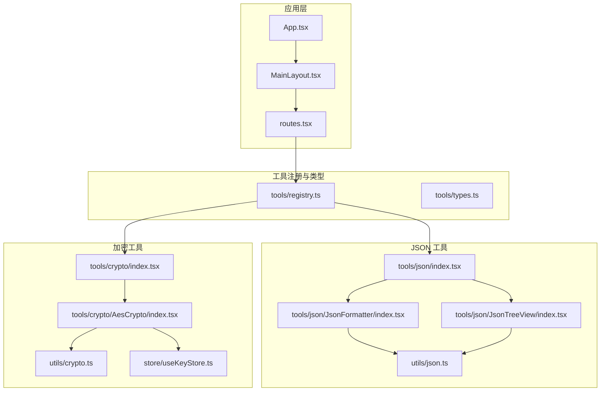
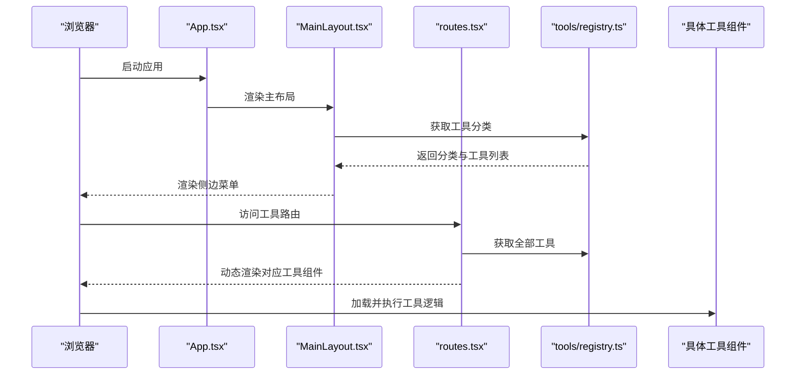
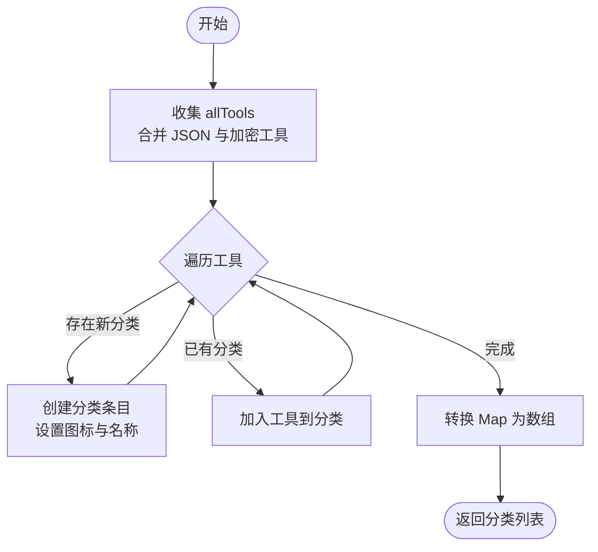
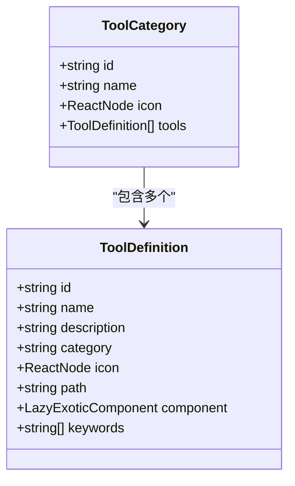
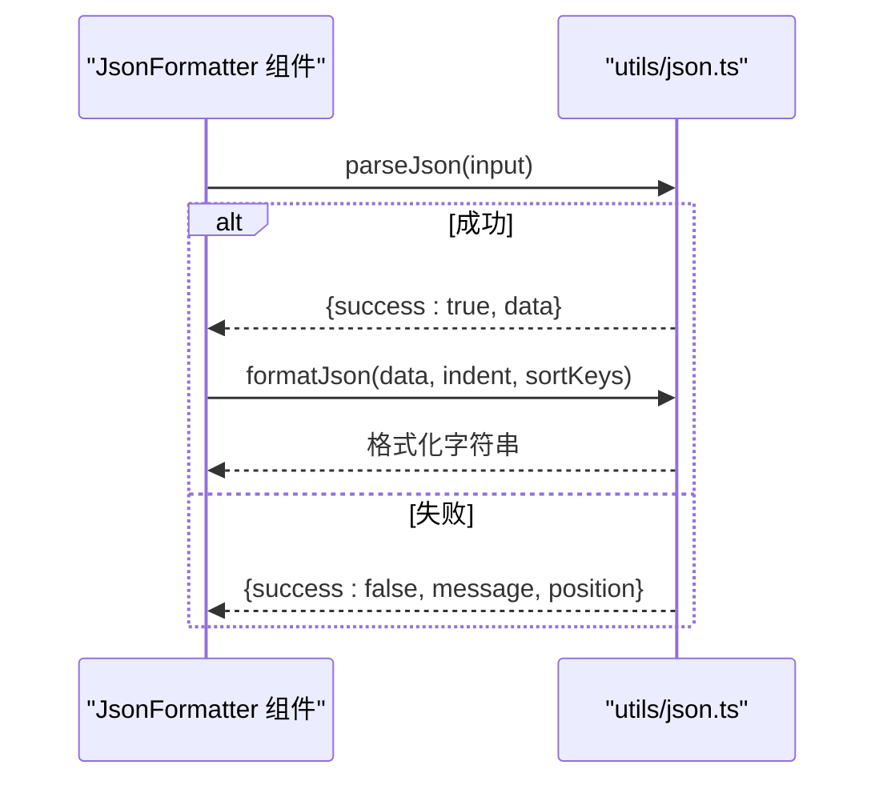
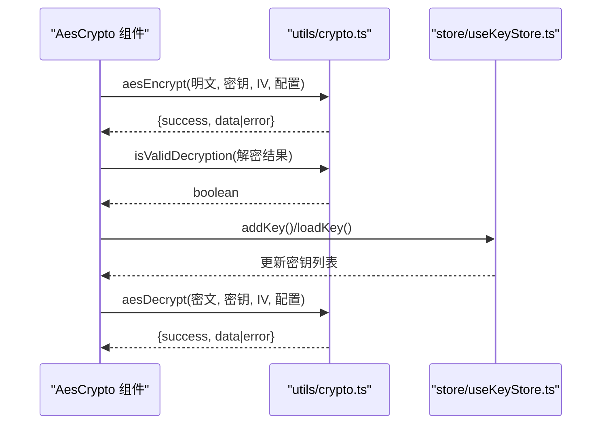
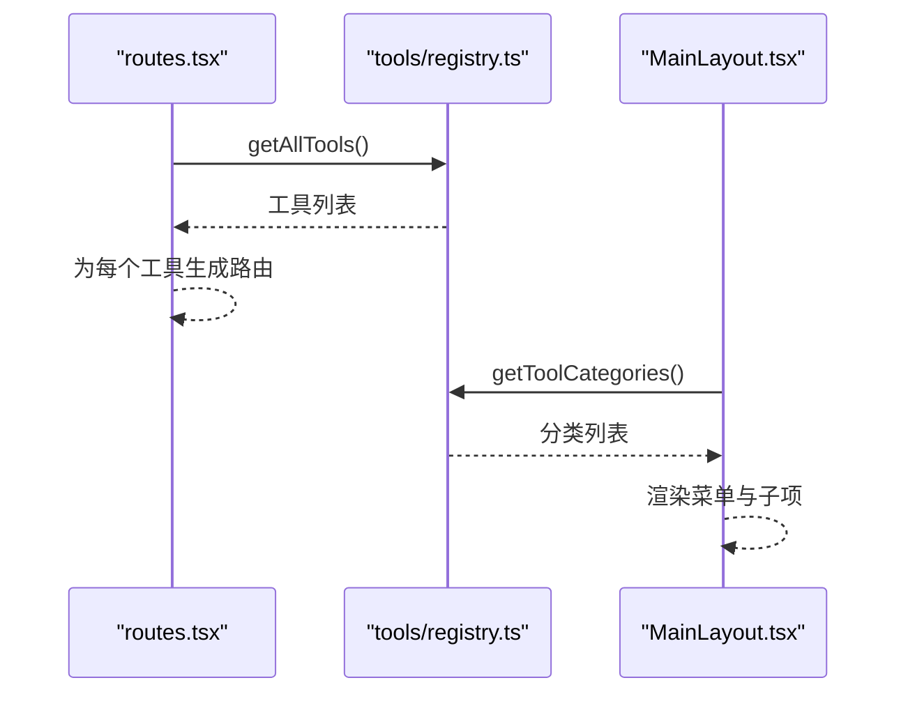
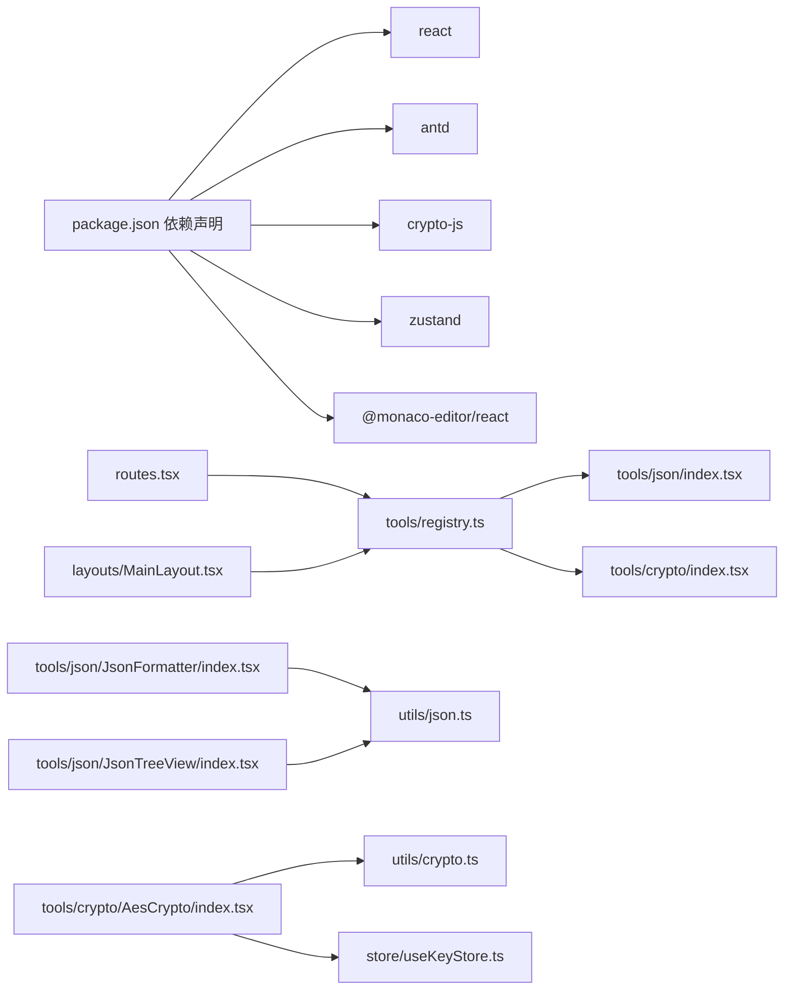

# 工具系统

<cite>
**本文引用的文件**
- [src/tools/registry.ts](file://src/tools/registry.ts)
- [src/tools/types.ts](file://src/tools/types.ts)
- [src/tools/json/index.tsx](file://src/tools/json/index.tsx)
- [src/tools/crypto/index.tsx](file://src/tools/crypto/index.tsx)
- [src/utils/crypto.ts](file://src/utils/crypto.ts)
- [src/utils/json.ts](file://src/utils/json.ts)
- [src/tools/json/JsonFormatter/index.tsx](file://src/tools/json/JsonFormatter/index.tsx)
- [src/tools/json/JsonTreeView/index.tsx](file://src/tools/json/JsonTreeView/index.tsx)
- [src/tools/crypto/AesCrypto/index.tsx](file://src/tools/crypto/AesCrypto/index.tsx)
- [src/routes.tsx](file://src/routes.tsx)
- [src/layouts/MainLayout.tsx](file://src/layouts/MainLayout.tsx)
- [src/App.tsx](file://src/App.tsx)
- [src/store/useKeyStore.ts](file://src/store/useKeyStore.ts)
- [package.json](file://package.json)
</cite>

## 目录
1. [简介](#简介)
2. [项目结构](#项目结构)
3. [核心组件](#核心组件)
4. [架构总览](#架构总览)
5. [详细组件分析](#详细组件分析)
6. [依赖分析](#依赖分析)
7. [性能考虑](#性能考虑)
8. [故障排查指南](#故障排查指南)
9. [结论](#结论)
10. [附录](#附录)

## 简介
本文件为 XKUtil 工具系统的技术文档，围绕工具注册表机制、工具分类与动态注册流程、工具接口规范、JSON 工具与加密工具两大模块的架构与实现进行深入解析，并提供工具开发规范、扩展指南、API 文档与集成示例，帮助开发者快速理解与扩展该工具平台。

## 项目结构
XKUtil 采用前端单页应用架构，工具系统位于 src/tools 下，按功能域划分为 JSON 工具与加密工具两类；通用工具函数位于 src/utils；路由与侧边菜单由布局组件负责渲染；状态管理通过 Zustand 的轻量 store 实现。

**图表来源**
- [src/App.tsx:1-24](file://src/App.tsx#L1-L24)
- [src/layouts/MainLayout.tsx:1-168](file://src/layouts/MainLayout.tsx#L1-L168)
- [src/routes.tsx:1-29](file://src/routes.tsx#L1-L29)
- [src/tools/registry.ts:1-39](file://src/tools/registry.ts#L1-L39)
- [src/tools/types.ts:1-20](file://src/tools/types.ts#L1-L20)
- [src/tools/json/index.tsx:1-27](file://src/tools/json/index.tsx#L1-L27)
- [src/tools/json/JsonFormatter/index.tsx:1-267](file://src/tools/json/JsonFormatter/index.tsx#L1-L267)
- [src/tools/json/JsonTreeView/index.tsx:1-248](file://src/tools/json/JsonTreeView/index.tsx#L1-L248)
- [src/tools/crypto/index.tsx:1-17](file://src/tools/crypto/index.tsx#L1-L17)
- [src/tools/crypto/AesCrypto/index.tsx:1-310](file://src/tools/crypto/AesCrypto/index.tsx#L1-L310)
- [src/utils/json.ts:1-116](file://src/utils/json.ts#L1-L116)
- [src/utils/crypto.ts:1-222](file://src/utils/crypto.ts#L1-L222)
- [src/store/useKeyStore.ts:1-47](file://src/store/useKeyStore.ts#L1-L47)

**章节来源**
- [src/App.tsx:1-24](file://src/App.tsx#L1-L24)
- [src/layouts/MainLayout.tsx:1-168](file://src/layouts/MainLayout.tsx#L1-L168)
- [src/routes.tsx:1-29](file://src/routes.tsx#L1-L29)
- [src/tools/registry.ts:1-39](file://src/tools/registry.ts#L1-L39)
- [src/tools/types.ts:1-20](file://src/tools/types.ts#L1-L20)

## 核心组件
- 工具注册表：统一聚合所有工具，生成分类列表与全量工具清单，支持国际化分类名映射。
- 工具类型定义：标准化工具元数据（id、name、description、category、icon、path、component、keywords）。
- 路由与布局：根据注册表动态生成路由与侧边菜单项，实现导航与页面切换。
- JSON 工具集：提供 JSON 解析、格式化、压缩、统计与树形视图能力。
- 加密工具集：提供 AES 加密/解密、密钥/IV 生成、密钥库持久化与暴力破解辅助。
- 状态存储：应用设置与密钥库持久化，基于 Zustand 与本地持久化中间件。

**章节来源**
- [src/tools/registry.ts:1-39](file://src/tools/registry.ts#L1-L39)
- [src/tools/types.ts:1-20](file://src/tools/types.ts#L1-L20)
- [src/routes.tsx:1-29](file://src/routes.tsx#L1-L29)
- [src/layouts/MainLayout.tsx:1-168](file://src/layouts/MainLayout.tsx#L1-L168)
- [src/utils/json.ts:1-116](file://src/utils/json.ts#L1-L116)
- [src/utils/crypto.ts:1-222](file://src/utils/crypto.ts#L1-L222)
- [src/store/useKeyStore.ts:1-47](file://src/store/useKeyStore.ts#L1-L47)

## 架构总览
工具系统采用“注册表驱动 + 动态路由 + 组件懒加载”的架构：
- 注册表将各模块工具汇总，构建分类树，供布局组件渲染菜单。
- 路由层根据注册表动态挂载工具组件，实现按需加载。
- 工具组件内部封装业务逻辑与 UI，复用通用工具函数。

**图表来源**
- [src/App.tsx:1-24](file://src/App.tsx#L1-L24)
- [src/layouts/MainLayout.tsx:1-168](file://src/layouts/MainLayout.tsx#L1-L168)
- [src/routes.tsx:1-29](file://src/routes.tsx#L1-L29)
- [src/tools/registry.ts:1-39](file://src/tools/registry.ts#L1-L39)

## 详细组件分析

### 工具注册表与分类系统
- 职责：聚合 JSON 与加密工具，按 category 构建分类树，提供分类与全量工具查询。
- 关键点：
  - 使用 Map 去重与聚合，确保分类唯一性与工具列表完整性。
  - 分类名映射函数支持中文化显示。
  - 工具路径与组件懒加载结合，保证首屏性能。

**图表来源**
- [src/tools/registry.ts:5-23](file://src/tools/registry.ts#L5-L23)

**章节来源**
- [src/tools/registry.ts:1-39](file://src/tools/registry.ts#L1-L39)
- [src/tools/types.ts:1-20](file://src/tools/types.ts#L1-L20)

### 工具类型定义与接口规范
- ToolDefinition：描述工具元数据，包含 id、name、description、category、icon、path、component、keywords。
- ToolCategory：描述分类，包含 id、name、icon、tools 列表。
- 规范要点：
  - id 唯一且稳定，用于路由与状态标识。
  - path 作为路由路径，应与工具组件注册一致。
  - keywords 用于后续搜索扩展（当前未实现，但已预留）。
  - component 使用 React.lazy 按需加载，提升性能。

**图表来源**
- [src/tools/types.ts:3-19](file://src/tools/types.ts#L3-L19)

**章节来源**
- [src/tools/types.ts:1-20](file://src/tools/types.ts#L1-L20)

### JSON 工具模块
- 工具清单：
  - JSON 格式化：美化、压缩、校验、排序键、统计信息。
  - JSON 树形视图：可视化树结构、复制节点路径、展开/折叠控制。
- 关键实现：
  - 解析与错误定位：解析异常时计算行列位置，便于用户修正。
  - 格式化与压缩：支持缩进与键排序，压缩去除空白。
  - 统计信息：类型、键数、深度、大小等指标。
  - 树形转换：递归构建树节点，支持数组与对象分支。

**图表来源**
- [src/tools/json/JsonFormatter/index.tsx:53-78](file://src/tools/json/JsonFormatter/index.tsx#L53-L78)
- [src/utils/json.ts:14-38](file://src/utils/json.ts#L14-L38)

**章节来源**
- [src/tools/json/index.tsx:1-27](file://src/tools/json/index.tsx#L1-L27)
- [src/tools/json/JsonFormatter/index.tsx:1-267](file://src/tools/json/JsonFormatter/index.tsx#L1-L267)
- [src/tools/json/JsonTreeView/index.tsx:1-248](file://src/tools/json/JsonTreeView/index.tsx#L1-L248)
- [src/utils/json.ts:1-116](file://src/utils/json.ts#L1-L116)

### 加密工具模块（AES）
- 工具清单：AES 加解密，支持多种模式与填充，密钥/IV 生成，密钥库管理，暴力破解辅助。
- 关键实现：
  - 配置体系：模式、填充、输出格式、密钥格式与长度。
  - 参数校验：密钥与 IV 长度检查，Hex/UTF-8 格式校验。
  - 安全性：随机密钥与 IV 生成，解密有效性判断（可打印字符比例与替换字符检测）。
  - 交互：配置面板、密钥面板、密钥库抽屉、保存/加载密钥、暴力破解流程。

**图表来源**
- [src/tools/crypto/AesCrypto/index.tsx:55-112](file://src/tools/crypto/AesCrypto/index.tsx#L55-L112)
- [src/utils/crypto.ts:59-162](file://src/utils/crypto.ts#L59-L162)
- [src/store/useKeyStore.ts:22-46](file://src/store/useKeyStore.ts#L22-L46)

**章节来源**
- [src/tools/crypto/index.tsx:1-17](file://src/tools/crypto/index.tsx#L1-L17)
- [src/tools/crypto/AesCrypto/index.tsx:1-310](file://src/tools/crypto/AesCrypto/index.tsx#L1-L310)
- [src/utils/crypto.ts:1-222](file://src/utils/crypto.ts#L1-L222)
- [src/store/useKeyStore.ts:1-47](file://src/store/useKeyStore.ts#L1-L47)

### 路由与布局
- 路由：根据注册表动态生成工具路由，未命中时跳转至首个工具。
- 布局：根据注册表生成分类菜单，支持主题切换与侧边栏折叠。

**图表来源**
- [src/routes.tsx:6-28](file://src/routes.tsx#L6-L28)
- [src/layouts/MainLayout.tsx:29-39](file://src/layouts/MainLayout.tsx#L29-L39)
- [src/tools/registry.ts:25-38](file://src/tools/registry.ts#L25-L38)

**章节来源**
- [src/routes.tsx:1-29](file://src/routes.tsx#L1-L29)
- [src/layouts/MainLayout.tsx:1-168](file://src/layouts/MainLayout.tsx#L1-L168)
- [src/tools/registry.ts:1-39](file://src/tools/registry.ts#L1-L39)

## 依赖分析
- 外部依赖：React、Ant Design、crypto-js、Zustand、Monaco Editor 等。
- 内部依赖：工具注册表聚合 JSON 与加密工具；路由与布局依赖注册表；工具组件依赖各自工具函数与状态存储。

**图表来源**
- [package.json:12-25](file://package.json#L12-L25)
- [src/tools/registry.ts:1-3](file://src/tools/registry.ts#L1-L3)
- [src/routes.tsx:4](file://src/routes.tsx#L4)
- [src/layouts/MainLayout.tsx:12](file://src/layouts/MainLayout.tsx#L12)
- [src/tools/json/JsonFormatter/index.tsx:28](file://src/tools/json/JsonFormatter/index.tsx#L28)
- [src/tools/json/JsonTreeView/index.tsx:20](file://src/tools/json/JsonTreeView/index.tsx#L20)
- [src/tools/crypto/AesCrypto/index.tsx:29](file://src/tools/crypto/AesCrypto/index.tsx#L29)
- [src/store/useKeyStore.ts:3](file://src/store/useKeyStore.ts#L3)

**章节来源**
- [package.json:1-36](file://package.json#L1-L36)
- [src/tools/registry.ts:1-39](file://src/tools/registry.ts#L1-L39)
- [src/routes.tsx:1-29](file://src/routes.tsx#L1-L29)
- [src/layouts/MainLayout.tsx:1-168](file://src/layouts/MainLayout.tsx#L1-L168)

## 性能考虑
- 懒加载：工具组件通过 React.lazy 按需加载，减少初始包体与首屏渲染压力。
- 分类聚合：注册表一次性构建分类树，避免重复计算。
- 状态持久化：应用设置与密钥库使用持久化中间件，减少重复初始化成本。
- JSON 处理：格式化与压缩操作在内存中进行，建议对超大 JSON 使用压缩或分块策略。

[本节为通用性能建议，无需特定文件引用]

## 故障排查指南
- AES 加密/解密失败：
  - 检查密钥与 IV 长度是否符合配置（Hex/UTF-8），模式非 ECB 时 IV 必须提供且长度正确。
  - 输出格式需与输入一致（Hex/Base64）。
  - 使用解密有效性判断辅助定位无效解密。
- JSON 解析错误：
  - 查看错误中的行列位置，定位语法问题。
  - 确认输入为合法 JSON，避免尾逗号、注释等非法字符。
- 路由与菜单异常：
  - 确认工具 path 与注册表一致，未命中时会跳转至首个工具。
  - 检查分类图标与名称映射是否正确。

**章节来源**
- [src/utils/crypto.ts:65-104](file://src/utils/crypto.ts#L65-L104)
- [src/utils/crypto.ts:113-161](file://src/utils/crypto.ts#L113-L161)
- [src/utils/json.ts:14-38](file://src/utils/json.ts#L14-L38)
- [src/routes.tsx:21-24](file://src/routes.tsx#L21-L24)

## 结论
XKUtil 工具系统通过注册表驱动的分类与动态路由机制，实现了清晰的模块划分与良好的扩展性。JSON 与加密两大模块分别提供了实用的数据处理与安全能力，配合懒加载与状态持久化，兼顾了性能与用户体验。未来可在现有基础上完善关键字搜索、工具权限与审计日志等能力，进一步增强企业级可用性。

[本节为总结性内容，无需特定文件引用]

## 附录

### 工具开发规范与扩展指南
- 新增工具步骤
  1. 在对应目录下创建工具组件与配置文件，导出 ToolDefinition 数组。
  2. 在 tools/registry.ts 中引入新增工具集合，确保被 allTools 合并。
  3. 在 routes.tsx 中确认 getAllTools() 被调用以动态生成路由。
  4. 在 MainLayout.tsx 中确认 getToolCategories() 被调用以生成菜单。
- 最佳实践
  - 工具 id 唯一且语义化，path 与组件注册保持一致。
  - keywords 字段可用于未来搜索功能扩展。
  - 组件内使用懒加载与错误提示，提升稳定性与可维护性。
  - 对敏感操作（如暴力破解）提供明确的安全提示与确认流程。

**章节来源**
- [src/tools/registry.ts:1-39](file://src/tools/registry.ts#L1-L39)
- [src/tools/json/index.tsx:1-27](file://src/tools/json/index.tsx#L1-L27)
- [src/tools/crypto/index.tsx:1-17](file://src/tools/crypto/index.tsx#L1-L17)
- [src/routes.tsx:1-29](file://src/routes.tsx#L1-L29)
- [src/layouts/MainLayout.tsx:1-168](file://src/layouts/MainLayout.tsx#L1-L168)

### 工具系统 API 文档
- 工具注册表
  - getToolCategories(): 返回分类列表，包含 id、name、icon、tools。
  - getAllTools(): 返回全量工具定义列表。
- JSON 工具函数
  - parseJson(input): 解析 JSON，返回成功或错误及行列位置。
  - formatJson(data, indent, sortKeys): 格式化 JSON。
  - compressJson(data): 压缩 JSON。
  - getJsonStats(data): 统计类型、键数、深度、大小。
- 加密工具函数
  - aesEncrypt(明文, 密钥, IV, 配置): 加密，返回结果或错误。
  - aesDecrypt(密文, 密钥, IV, 配置): 解密，返回结果或错误。
  - generateRandomKey(size, format): 生成随机密钥。
  - generateRandomIV(format): 生成随机 IV。
  - isValidDecryption(output): 判断解密结果是否有效。
- 状态存储
  - useKeyStore: 提供密钥对的增删改查与持久化。

**章节来源**
- [src/tools/registry.ts:7-27](file://src/tools/registry.ts#L7-L27)
- [src/utils/json.ts:14-116](file://src/utils/json.ts#L14-L116)
- [src/utils/crypto.ts:59-222](file://src/utils/crypto.ts#L59-L222)
- [src/store/useKeyStore.ts:15-46](file://src/store/useKeyStore.ts#L15-L46)

### 集成示例
- 在新工具中使用 AES 工具
  - 引入 aesEncrypt、aesDecrypt、isValidDecryption。
  - 从 useKeyStore 读取/写入密钥对。
  - 在 UI 中提供配置面板与操作按钮，调用上述函数并处理返回结果。
- 在新工具中使用 JSON 工具
  - 引入 parseJson、formatJson、compressJson、getJsonStats。
  - 在 UI 中提供输入输出面板，调用函数并展示统计信息与错误提示。

**章节来源**
- [src/tools/crypto/AesCrypto/index.tsx:24-29](file://src/tools/crypto/AesCrypto/index.tsx#L24-L29)
- [src/store/useKeyStore.ts:22-46](file://src/store/useKeyStore.ts#L22-L46)
- [src/tools/json/JsonFormatter/index.tsx:23-28](file://src/tools/json/JsonFormatter/index.tsx#L23-L28)