# 工具系统

<cite>
**本文引用的文件**
- [src/tools/registry.ts](file://src/tools/registry.ts)
- [src/tools/types.ts](file://src/tools/types.ts)
- [src/tools/json/index.tsx](file://src/tools/json/index.tsx)
- [src/tools/crypto/index.tsx](file://src/tools/crypto/index.tsx)
- [src/tools/text/index.tsx](file://src/tools/text/index.tsx)
- [src/tools/convert/index.tsx](file://src/tools/convert/index.tsx)
- [src/tools/convert/DocxToHtml/index.tsx](file://src/tools/convert/DocxToHtml/index.tsx)
- [src/tools/crypto/HashCode/index.tsx](file://src/tools/crypto/HashCode/index.tsx)
- [src/tools/crypto/EventMapping/index.tsx](file://src/tools/crypto/EventMapping/index.tsx)
- [src/tools/text/ConfigGenerator/index.tsx](file://src/tools/text/ConfigGenerator/index.tsx)
- [src/tools/text/Translate/index.tsx](file://src/tools/text/Translate/index.tsx)
- [src/tools/text/Translate/SettingsDrawer.tsx](file://src/tools/text/Translate/SettingsDrawer.tsx)
- [src/utils/translate/index.ts](file://src/utils/translate/index.ts)
- [src/utils/translate/providers/baidu.ts](file://src/utils/translate/providers/baidu.ts)
- [src/utils/translate/providers/youdao.ts](file://src/utils/translate/providers/youdao.ts)
- [src/utils/translate/providers/alibaba.ts](file://src/utils/translate/providers/alibaba.ts)
- [src/utils/translate/providers/tencent.ts](file://src/utils/translate/providers/tencent.ts)
- [src/utils/translate/languages.ts](file://src/utils/translate/languages.ts)
- [src/utils/translate/types.ts](file://src/utils/translate/types.ts)
- [src/store/useTranslateStore.ts](file://src/store/useTranslateStore.ts)
- [src/utils/crypto.ts](file://src/utils/crypto.ts)
- [src/utils/json.ts](file://src/utils/json.ts)
- [src/utils/config-generator.ts](file://src/utils/config-generator.ts)
- [src/utils/docx.ts](file://src/utils/docx.ts)
- [src/tools/json/JsonFormatter/index.tsx](file://src/tools/json/JsonFormatter/index.tsx)
- [src/tools/json/JsonTreeView/index.tsx](file://src/tools/json/JsonTreeView/index.tsx)
- [src/tools/crypto/AesCrypto/index.tsx](file://src/tools/crypto/AesCrypto/index.tsx)
- [src/routes.tsx](file://src/routes.tsx)
- [src/layouts/MainLayout.tsx](file://src/layouts/MainLayout.tsx)
- [src/App.tsx](file://src/App.tsx)
- [src/store/useKeyStore.ts](file://src/store/useKeyStore.ts)
- [package.json](file://package.json)
</cite>

## 更新摘要
**变更内容**
- 新增格式转换工具模块，包含DocxToHtml工具，支持Word文档转换为HTML
- 新增convert分类，扩展工具注册表的分类映射
- 新增mammoth库依赖，用于DOCX文档解析
- 版本升级至 0.5.0，显著增强了工具系统的文档处理能力

## 目录
1. [简介](#简介)
2. [项目结构](#项目结构)
3. [核心组件](#核心组件)
4. [架构总览](#架构总览)
5. [详细组件分析](#详细组件分析)
6. [依赖分析](#依赖分析)
7. [性能考虑](#性能考虑)
8. [故障排查指南](#故障排查指南)
9. [结论](#结论)
10. [附录](#附录)

## 简介
本文件为 XKUtil 工具系统的技术文档，围绕工具注册表机制、工具分类与动态注册流程、工具接口规范、JSON 工具、加密工具、格式转换工具与文本处理四大模块的架构与实现进行深入解析，并提供工具开发规范、扩展指南、API 文档与集成示例，帮助开发者快速理解与扩展该工具平台。

**更新** 版本 0.5.0 新增了格式转换工具模块，特别包含DocxToHtml工具，支持Word文档转换为HTML，进一步完善了工具系统的文档处理能力，新增了mammoth库依赖用于DOCX文档解析。

## 项目结构
XKUtil 采用前端单页应用架构，工具系统位于 src/tools 下，按功能域划分为 JSON 工具、加密工具、格式转换与文本处理四类；通用工具函数位于 src/utils；路由与侧边菜单由布局组件负责渲染；状态管理通过 Zustand 的轻量 store 实现。

```mermaid
graph TB
subgraph "应用层"
App["App.tsx"]
Layout["MainLayout.tsx"]
Routes["routes.tsx"]
end
subgraph "工具注册与类型"
Registry["tools/registry.ts"]
Types["tools/types.ts"]
end
subgraph "JSON 工具"
JsonIndex["tools/json/index.tsx"]
JsonFormatter["tools/json/JsonFormatter/index.tsx"]
JsonTreeView["tools/json/JsonTreeView/index.tsx"]
JsonUtils["utils/json.ts"]
end
subgraph "加密工具"
CryptoIndex["tools/crypto/index.tsx"]
AesCrypto["tools/crypto/AesCrypto/index.tsx"]
HashCode["tools/crypto/HashCode/index.tsx"]
EventMapping["tools/crypto/EventMapping/index.tsx"]
CryptoUtils["utils/crypto.ts"]
KeyStore["store/useKeyStore.ts"]
end
subgraph "格式转换工具"
ConvertIndex["tools/convert/index.tsx"]
DocxToHtml["tools/convert/DocxToHtml/index.tsx"]
DocxUtils["utils/docx.ts"]
end
subgraph "文本处理工具"
TextIndex["tools/text/index.tsx"]
ConfigGenerator["tools/text/ConfigGenerator/index.tsx"]
Translate["tools/text/Translate/index.tsx"]
TranslateStore["store/useTranslateStore.ts"]
ConfigUtils["utils/config-generator.ts"]
end
subgraph "翻译服务"
TranslateIndex["utils/translate/index.ts"]
BaiduProvider["utils/translate/providers/baidu.ts"]
YoudaoProvider["utils/translate/providers/youdao.ts"]
AlibabaProvider["utils/translate/providers/alibaba.ts"]
TencentProvider["utils/translate/providers/tencent.ts"]
TranslateLang["utils/translate/languages.ts"]
TranslateTypes["utils/translate/types.ts"]
end
App --> Layout
Layout --> Routes
Routes --> Registry
Registry --> JsonIndex
Registry --> CryptoIndex
Registry --> ConvertIndex
Registry --> TextIndex
JsonIndex --> JsonFormatter
JsonIndex --> JsonTreeView
JsonFormatter --> JsonUtils
JsonTreeView --> JsonUtils
CryptoIndex --> AesCrypto
CryptoIndex --> HashCode
CryptoIndex --> EventMapping
AesCrypto --> CryptoUtils
AesCrypto --> KeyStore
ConvertIndex --> DocxToHtml
DocxToHtml --> DocxUtils
TextIndex --> ConfigGenerator
TextIndex --> Translate
Translate --> TranslateStore
Translate --> TranslateIndex
TranslateIndex --> BaiduProvider
TranslateIndex --> YoudaoProvider
TranslateIndex --> AlibabaProvider
TranslateIndex --> TencentProvider
ConfigGenerator --> ConfigUtils
```

**图表来源**
- [src/App.tsx:1-24](file://src/App.tsx#L1-L24)
- [src/layouts/MainLayout.tsx:1-168](file://src/layouts/MainLayout.tsx#L1-L168)
- [src/routes.tsx:1-29](file://src/routes.tsx#L1-L29)
- [src/tools/registry.ts:1-47](file://src/tools/registry.ts#L1-L47)
- [src/tools/types.ts:1-20](file://src/tools/types.ts#L1-L20)
- [src/tools/json/index.tsx:1-27](file://src/tools/json/index.tsx#L1-L27)
- [src/tools/crypto/index.tsx:1-37](file://src/tools/crypto/index.tsx#L1-L37)
- [src/tools/convert/index.tsx:1-17](file://src/tools/convert/index.tsx#L1-L17)
- [src/tools/text/index.tsx:1-27](file://src/tools/text/index.tsx#L1-L27)
- [src/tools/json/JsonFormatter/index.tsx:1-267](file://src/tools/json/JsonFormatter/index.tsx#L1-L267)
- [src/tools/json/JsonTreeView/index.tsx:1-248](file://src/tools/json/JsonTreeView/index.tsx#L1-L248)
- [src/tools/crypto/AesCrypto/index.tsx:1-310](file://src/tools/crypto/AesCrypto/index.tsx#L1-L310)
- [src/tools/crypto/HashCode/index.tsx:1-79](file://src/tools/crypto/HashCode/index.tsx#L1-L79)
- [src/tools/crypto/EventMapping/index.tsx:1-130](file://src/tools/crypto/EventMapping/index.tsx#L1-L130)
- [src/tools/convert/DocxToHtml/index.tsx:1-228](file://src/tools/convert/DocxToHtml/index.tsx#L1-L228)
- [src/utils/docx.ts:1-48](file://src/utils/docx.ts#L1-L48)
- [src/tools/text/ConfigGenerator/index.tsx:1-228](file://src/tools/text/ConfigGenerator/index.tsx#L1-L228)
- [src/tools/text/Translate/index.tsx:1-217](file://src/tools/text/Translate/index.tsx#L1-L217)
- [src/tools/text/Translate/SettingsDrawer.tsx:1-165](file://src/tools/text/Translate/SettingsDrawer.tsx#L1-L165)
- [src/utils/translate/index.ts:1-40](file://src/utils/translate/index.ts#L1-L40)
- [src/utils/translate/providers/baidu.ts:1-79](file://src/utils/translate/providers/baidu.ts#L1-L79)
- [src/utils/translate/providers/youdao.ts:1-81](file://src/utils/translate/providers/youdao.ts#L1-L81)
- [src/utils/translate/providers/alibaba.ts:1-90](file://src/utils/translate/providers/alibaba.ts#L1-L90)
- [src/utils/translate/providers/tencent.ts:1-114](file://src/utils/translate/providers/tencent.ts#L1-L114)
- [src/utils/translate/languages.ts:1-43](file://src/utils/translate/languages.ts#L1-L43)
- [src/utils/translate/types.ts:1-13](file://src/utils/translate/types.ts#L1-L13)
- [src/store/useTranslateStore.ts:1-79](file://src/store/useTranslateStore.ts#L1-L79)
- [src/utils/json.ts:1-116](file://src/utils/json.ts#L1-L116)
- [src/utils/crypto.ts:1-222](file://src/utils/crypto.ts#L1-L222)
- [src/utils/config-generator.ts:1-117](file://src/utils/config-generator.ts#L1-L117)
- [src/store/useKeyStore.ts:1-47](file://src/store/useKeyStore.ts#L1-L47)

**章节来源**
- [src/App.tsx:1-24](file://src/App.tsx#L1-L24)
- [src/layouts/MainLayout.tsx:1-168](file://src/layouts/MainLayout.tsx#L1-L168)
- [src/routes.tsx:1-29](file://src/routes.tsx#L1-L29)
- [src/tools/registry.ts:1-47](file://src/tools/registry.ts#L1-L47)
- [src/tools/types.ts:1-20](file://src/tools/types.ts#L1-L20)

## 核心组件
- 工具注册表：统一聚合所有工具，生成分类列表与全量工具清单，支持国际化分类名映射。
- 工具类型定义：标准化工具元数据（id、name、description、category、icon、path、component、keywords）。
- 路由与布局：根据注册表动态生成路由与侧边菜单项，实现导航与页面切换。
- JSON 工具集：提供 JSON 解析、格式化、压缩、统计与树形视图能力。
- 加密工具集：提供 AES 加密/解密、Hash 计算、事件映射、密钥/IV 生成、密钥库持久化与暴力破解辅助。
- 格式转换工具集：提供DOCX文档转换为HTML的能力，支持图片处理与警告信息。
- 文本处理工具集：提供配置生成器、翻译工具和 HashCode 计算功能。
- 翻译服务系统：支持多平台翻译服务，包含配置管理、语言映射和错误处理。
- 状态存储：应用设置与密钥库持久化，基于 Zustand 与本地持久化中间件。

**更新** 新增了格式转换工具模块，包含DocxToHtml工具，支持Word文档转换为HTML，扩展了工具系统的文档处理能力。

**章节来源**
- [src/tools/registry.ts:1-47](file://src/tools/registry.ts#L1-L47)
- [src/tools/types.ts:1-20](file://src/tools/types.ts#L1-L20)
- [src/routes.tsx:1-29](file://src/routes.tsx#L1-L29)
- [src/layouts/MainLayout.tsx:1-168](file://src/layouts/MainLayout.tsx#L1-L168)
- [src/utils/json.ts:1-116](file://src/utils/json.ts#L1-L116)
- [src/utils/crypto.ts:1-222](file://src/utils/crypto.ts#L1-L222)
- [src/utils/docx.ts:1-48](file://src/utils/docx.ts#L1-L48)
- [src/utils/config-generator.ts:1-117](file://src/utils/config-generator.ts#L1-L117)
- [src/store/useKeyStore.ts:1-47](file://src/store/useKeyStore.ts#L1-L47)
- [src/store/useTranslateStore.ts:1-79](file://src/store/useTranslateStore.ts#L1-L79)

## 架构总览
工具系统采用"注册表驱动 + 动态路由 + 组件懒加载"的架构：
- 注册表将各模块工具汇总，构建分类树，供布局组件渲染菜单。
- 路由层根据注册表动态挂载工具组件，实现按需加载。
- 工具组件内部封装业务逻辑与 UI，复用通用工具函数。

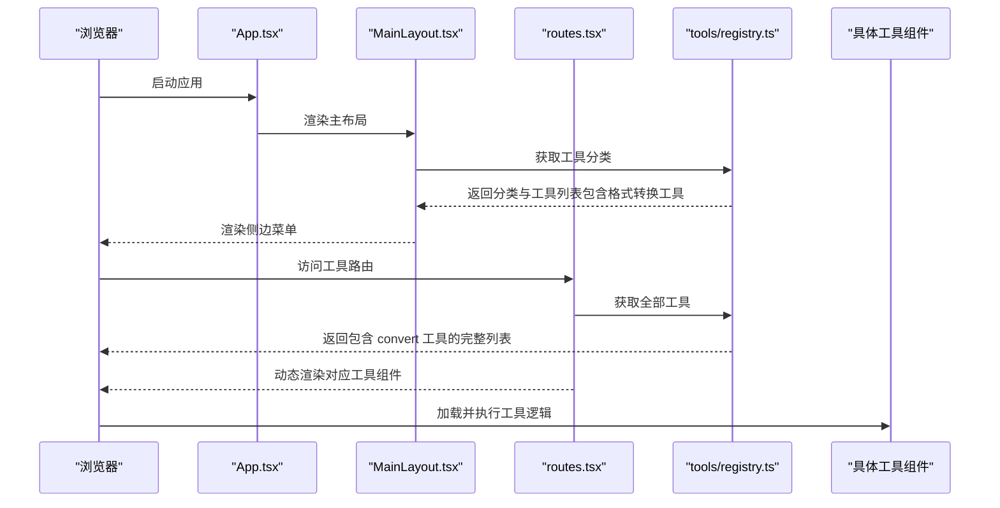

**图表来源**
- [src/App.tsx:1-24](file://src/App.tsx#L1-L24)
- [src/layouts/MainLayout.tsx:1-168](file://src/layouts/MainLayout.tsx#L1-L168)
- [src/routes.tsx:1-29](file://src/routes.tsx#L1-L29)
- [src/tools/registry.ts:1-47](file://src/tools/registry.ts#L1-L47)

## 详细组件分析

### 工具注册表与分类系统
- 职责：聚合 JSON、加密、格式转换与文本处理工具，按 category 构建分类树，提供分类与全量工具查询。
- 关键点：
  - 使用 Map 去重与聚合，确保分类唯一性与工具列表完整性。
  - 分类名映射函数支持中文化显示，包含 json、encoding、text、network、crypto、convert 类别。
  - 工具路径与组件懒加载结合，保证首屏性能。

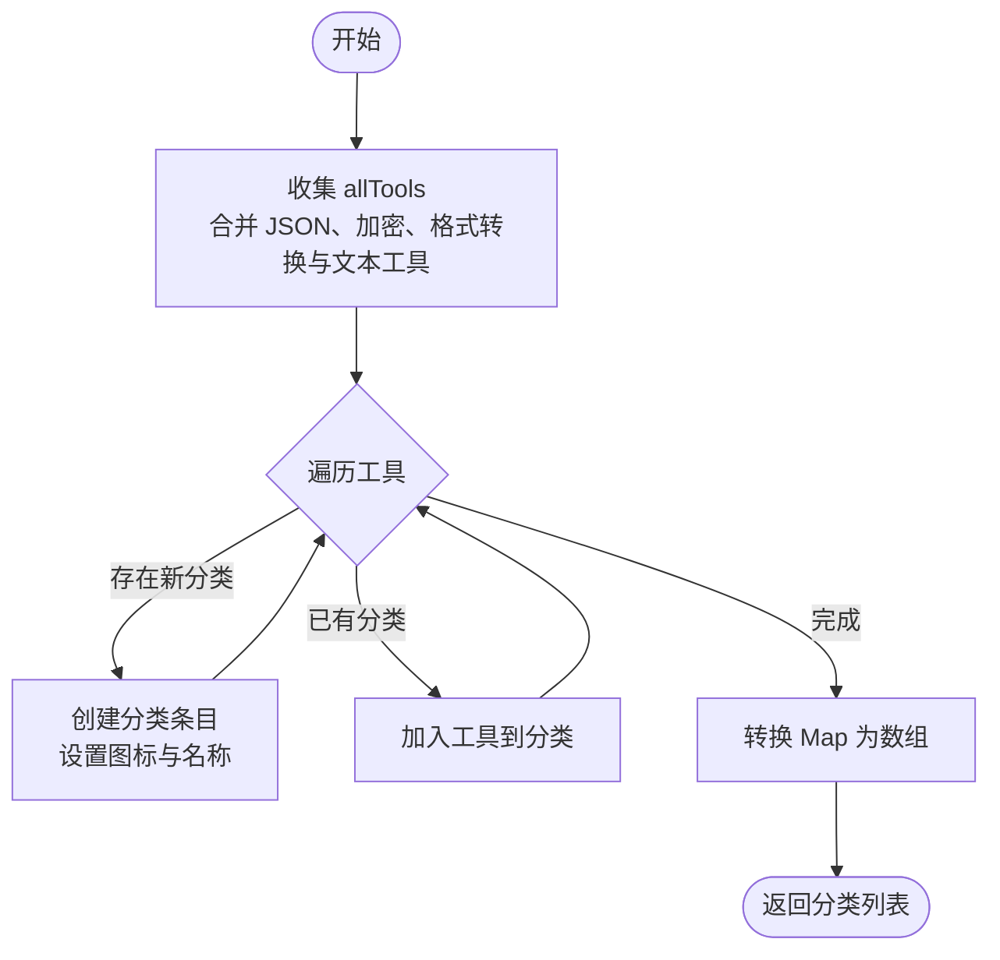

**图表来源**
- [src/tools/registry.ts:5-23](file://src/tools/registry.ts#L5-L23)

**章节来源**
- [src/tools/registry.ts:1-47](file://src/tools/registry.ts#L1-L47)
- [src/tools/types.ts:1-20](file://src/tools/types.ts#L1-L20)

### 工具类型定义与接口规范
- ToolDefinition：描述工具元数据，包含 id、name、description、category、icon、path、component、keywords。
- ToolCategory：描述分类，包含 id、name、icon、tools 列表。
- 规范要点：
  - id 唯一且稳定，用于路由与状态标识。
  - path 作为路由路径，应与工具组件注册一致。
  - keywords 用于后续搜索扩展（当前未实现，但已预留）。
  - component 使用 React.lazy 按需加载，提升性能。

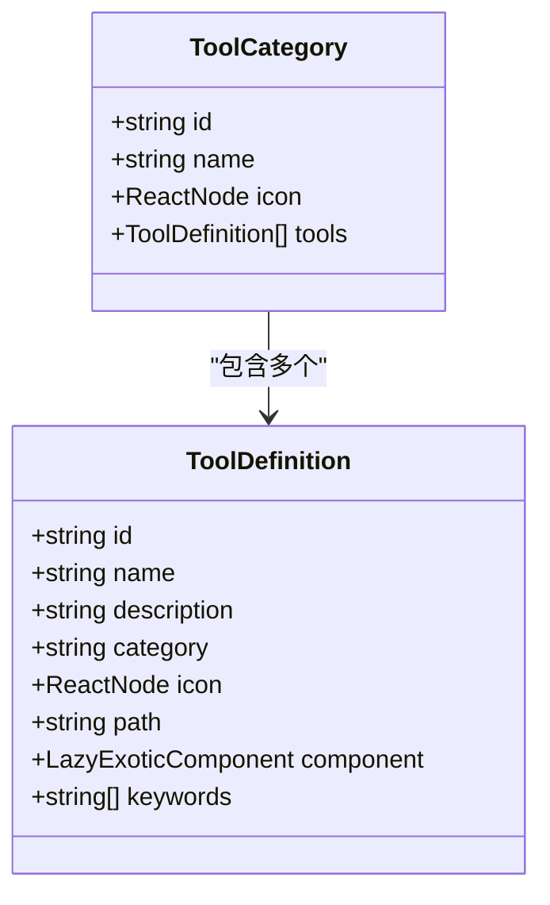

**图表来源**
- [src/tools/types.ts:3-19](file://src/tools/types.ts#L3-L19)

**章节来源**
- [src/tools/types.ts:1-20](file://src/tools/types.ts#L1-L20)

### JSON 工具模块
- 工具清单：
  - JSON 格式化：美化、压缩、校验、排序键、统计信息。
  - JSON 树形视图：可视化树结构、复制节点路径、展开/折叠控制。
- 关键实现：
  - 解析与错误定位：解析异常时计算行列位置，便于用户修正。
  - 格式化与压缩：支持缩进与键排序，压缩去除空白。
  - 统计信息：类型、键数、深度、大小等指标。
  - 树形转换：递归构建树节点，支持数组与对象分支。

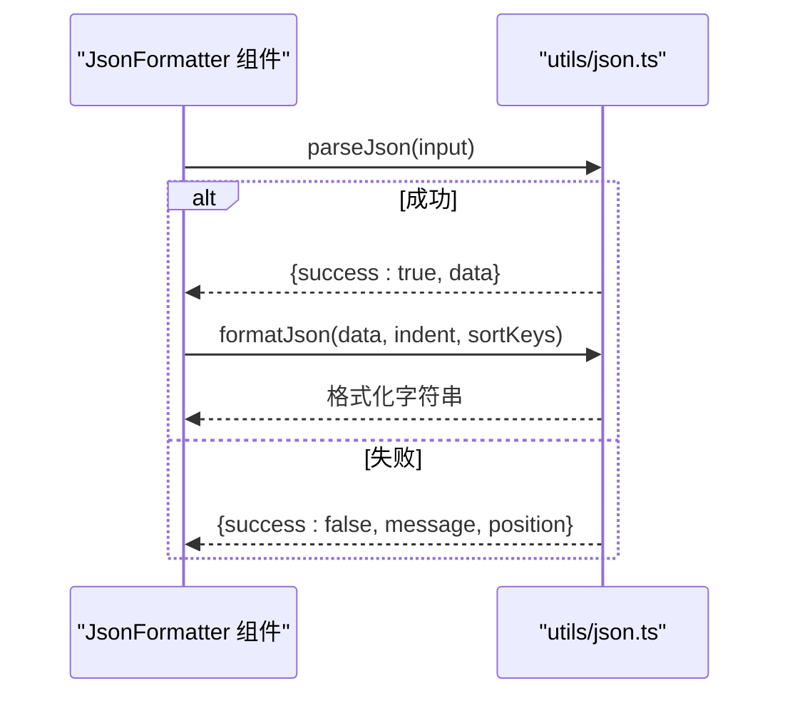

**图表来源**
- [src/tools/json/JsonFormatter/index.tsx:53-78](file://src/tools/json/JsonFormatter/index.tsx#L53-L78)
- [src/utils/json.ts:14-38](file://src/utils/json.ts#L14-L38)

**章节来源**
- [src/tools/json/index.tsx:1-27](file://src/tools/json/index.tsx#L1-L27)
- [src/tools/json/JsonFormatter/index.tsx:1-267](file://src/tools/json/JsonFormatter/index.tsx#L1-L267)
- [src/tools/json/JsonTreeView/index.tsx:1-248](file://src/tools/json/JsonTreeView/index.tsx#L1-L248)
- [src/utils/json.ts:1-116](file://src/utils/json.ts#L1-L116)

### 加密工具模块（AES、HashCode 与 EventMapping）
- 工具清单：
  - AES 加密/解密：支持多种模式与填充，密钥/IV 生成，密钥库管理，暴力破解辅助。
  - HashCode：Java 风格字符串 hashCode 计算。
  - 事件映射：基于 MD5 生成行为打点事件映射配置。
- 关键实现：
  - 配置体系：模式、填充、输出格式、密钥格式与长度。
  - 参数校验：密钥与 IV 长度检查，Hex/UTF-8 格式校验。
  - 安全性：随机密钥与 IV 生成，解密有效性判断（可打印字符比例与替换字符检测）。
  - Hash 计算：模拟 Java int 32位有符号溢出的字符串哈希算法。
  - 事件映射：使用默认词汇表生成 MD5 映射，支持自定义前缀和截取位数。
  - 交互：配置面板、密钥面板、密钥库抽屉、保存/加载密钥、暴力破解流程。

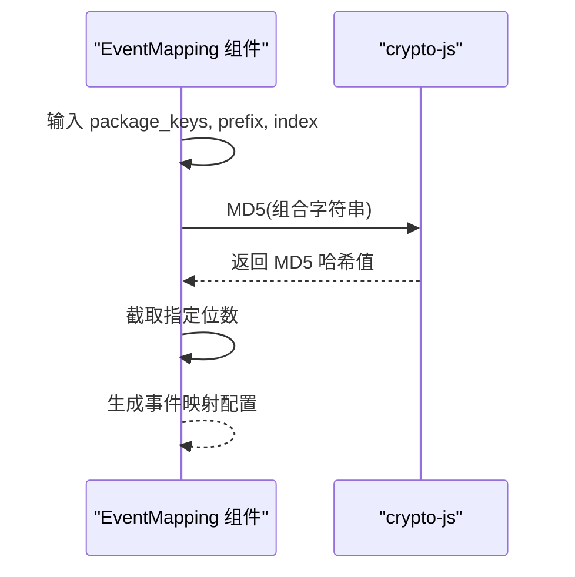

**图表来源**
- [src/tools/crypto/EventMapping/index.tsx:20-29](file://src/tools/crypto/EventMapping/index.tsx#L20-L29)

**章节来源**
- [src/tools/crypto/index.tsx:1-37](file://src/tools/crypto/index.tsx#L1-L37)
- [src/tools/crypto/AesCrypto/index.tsx:1-310](file://src/tools/crypto/AesCrypto/index.tsx#L1-L310)
- [src/tools/crypto/HashCode/index.tsx:1-79](file://src/tools/crypto/HashCode/index.tsx#L1-L79)
- [src/tools/crypto/EventMapping/index.tsx:1-130](file://src/tools/crypto/EventMapping/index.tsx#L1-L130)
- [src/utils/crypto.ts:1-222](file://src/utils/crypto.ts#L1-L222)
- [src/store/useKeyStore.ts:1-47](file://src/store/useKeyStore.ts#L1-L47)

### 格式转换工具模块（DocxToHtml）
- 工具清单：
  - Word 转 HTML：将 Word (.docx) 文档转换为 HTML，支持图片处理与警告信息。
- 关键实现：
  - DOCX解析：使用 mammoth 库解析 DOCX 文档，支持图片转换回调。
  - HTML生成：过滤空图片标签，清理HTML输出。
  - 图片处理：统计图片数量，忽略空源图片标签。
  - 警告信息：收集并展示转换过程中的警告消息。
  - 文件操作：集成 Tauri 插件进行文件选择、读取、保存与下载。
  - 预览功能：提供HTML代码编辑器与实时预览功能。
  - 用户交互：支持复制、下载、清空等操作。

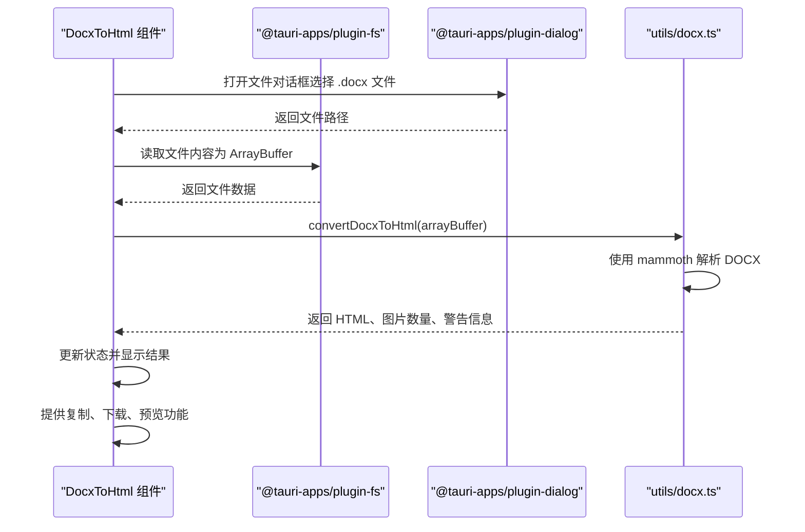

**图表来源**
- [src/tools/convert/DocxToHtml/index.tsx:32-72](file://src/tools/convert/DocxToHtml/index.tsx#L32-L72)
- [src/utils/docx.ts:11-47](file://src/utils/docx.ts#L11-L47)

**章节来源**
- [src/tools/convert/index.tsx:1-17](file://src/tools/convert/index.tsx#L1-L17)
- [src/tools/convert/DocxToHtml/index.tsx:1-228](file://src/tools/convert/DocxToHtml/index.tsx#L1-L228)
- [src/utils/docx.ts:1-48](file://src/utils/docx.ts#L1-L48)

### 文本处理工具模块（配置生成器、翻译工具与 HashCode）
- 工具清单：
  - 配置生成器：从结构化文本解析生成 key=value 配置，支持域名解析。
  - 翻译工具：多平台翻译服务，支持百度、有道、阿里、腾讯翻译。
  - HashCode：Java 风格字符串 hashCode 计算。
- 关键实现：
  - 配置生成器：支持从复杂配置文本中提取服务器地址、密钥配置、包名等信息，自动解析域名 IP 并格式化输出。
  - 翻译工具：统一翻译接口，支持多服务商配置管理、语言代码映射、错误处理。
  - 正则表达式解析：提供 getFirstMatch 和 getSubValue 辅助函数，支持层级配置提取。
  - 域名解析：通过阿里 DNS API 获取真实 IP 地址。
  - Hash 计算：模拟 Java int 32位有符号溢出的字符串哈希算法。
  - 翻译服务：实现各平台签名算法、请求参数构造和响应解析。

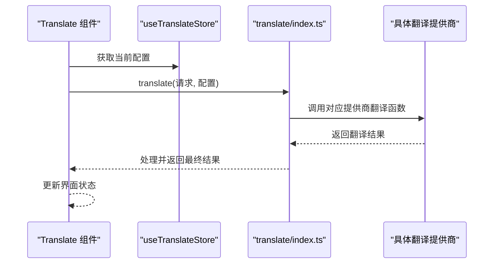

**图表来源**
- [src/tools/text/Translate/index.tsx:52-75](file://src/tools/text/Translate/index.tsx#L52-L75)
- [src/utils/translate/index.ts:11-32](file://src/utils/translate/index.ts#L11-L32)

**章节来源**
- [src/tools/text/index.tsx:1-27](file://src/tools/text/index.tsx#L1-L27)
- [src/tools/text/ConfigGenerator/index.tsx:1-228](file://src/tools/text/ConfigGenerator/index.tsx#L1-L228)
- [src/tools/text/Translate/index.tsx:1-217](file://src/tools/text/Translate/index.tsx#L1-L217)
- [src/tools/text/Translate/SettingsDrawer.tsx:1-165](file://src/tools/text/Translate/SettingsDrawer.tsx#L1-L165)
- [src/utils/translate/index.ts:1-40](file://src/utils/translate/index.ts#L1-L40)
- [src/utils/translate/providers/baidu.ts:1-79](file://src/utils/translate/providers/baidu.ts#L1-L79)
- [src/utils/translate/providers/youdao.ts:1-81](file://src/utils/translate/providers/youdao.ts#L1-L81)
- [src/utils/translate/providers/alibaba.ts:1-90](file://src/utils/translate/providers/alibaba.ts#L1-L90)
- [src/utils/translate/providers/tencent.ts:1-114](file://src/utils/translate/providers/tencent.ts#L1-L114)
- [src/utils/translate/languages.ts:1-43](file://src/utils/translate/languages.ts#L1-L43)
- [src/utils/translate/types.ts:1-13](file://src/utils/translate/types.ts#L1-L13)
- [src/store/useTranslateStore.ts:1-79](file://src/store/useTranslateStore.ts#L1-L79)
- [src/utils/config-generator.ts:1-117](file://src/utils/config-generator.ts#L1-L117)

### 翻译服务系统架构
- 系统组成：
  - 翻译接口层：统一 translate 函数，根据提供商类型分发请求。
  - 语言映射层：各平台语言代码转换，支持自动检测。
  - 提供商实现层：百度、有道、阿里、腾讯翻译的具体实现。
  - 配置管理层：Zustand 状态管理，支持配置持久化。
- 关键特性：
  - 多服务商支持：统一接口适配不同平台的签名算法和请求格式。
  - 错误处理：详细的错误码映射和用户友好的错误提示。
  - 语言支持：支持中文、英语、泰语、印尼语、西班牙语、越南语、缅甸语等。
  - 配置持久化：使用 localStorage 持久化翻译配置，提升用户体验。

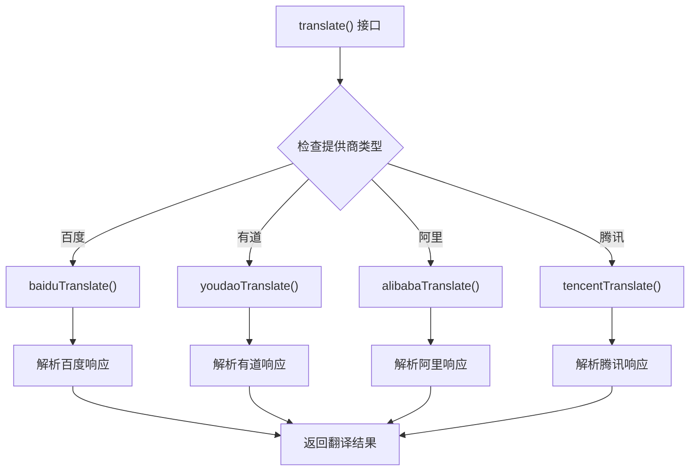

**图表来源**
- [src/utils/translate/index.ts:20-32](file://src/utils/translate/index.ts#L20-L32)
- [src/utils/translate/providers/baidu.ts:7-64](file://src/utils/translate/providers/baidu.ts#L7-L64)
- [src/utils/translate/providers/youdao.ts:12-65](file://src/utils/translate/providers/youdao.ts#L12-L65)
- [src/utils/translate/providers/alibaba.ts:7-89](file://src/utils/translate/providers/alibaba.ts#L7-L89)
- [src/utils/translate/providers/tencent.ts:20-113](file://src/utils/translate/providers/tencent.ts#L20-L113)

**章节来源**
- [src/utils/translate/index.ts:1-40](file://src/utils/translate/index.ts#L1-L40)
- [src/utils/translate/providers/baidu.ts:1-79](file://src/utils/translate/providers/baidu.ts#L1-L79)
- [src/utils/translate/providers/youdao.ts:1-81](file://src/utils/translate/providers/youdao.ts#L1-L81)
- [src/utils/translate/providers/alibaba.ts:1-90](file://src/utils/translate/providers/alibaba.ts#L1-L90)
- [src/utils/translate/providers/tencent.ts:1-114](file://src/utils/translate/providers/tencent.ts#L1-L114)
- [src/utils/translate/languages.ts:1-43](file://src/utils/translate/languages.ts#L1-L43)
- [src/utils/translate/types.ts:1-13](file://src/utils/translate/types.ts#L1-L13)
- [src/store/useTranslateStore.ts:1-79](file://src/store/useTranslateStore.ts#L1-L79)

### 路由与布局
- 路由：根据注册表动态生成工具路由，未命中时跳转至首个工具。
- 布局：根据注册表生成分类菜单，支持主题切换与侧边栏折叠。

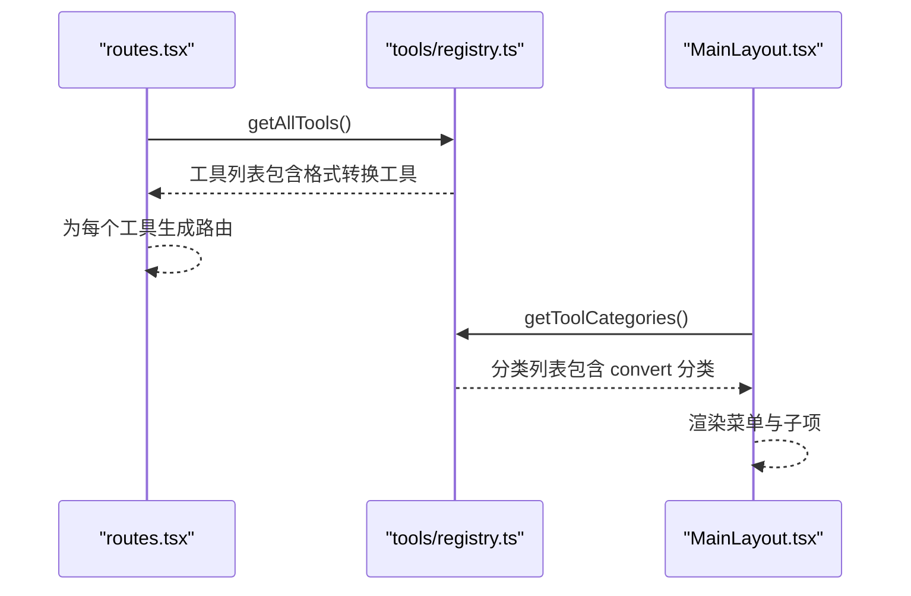

**图表来源**
- [src/routes.tsx:6-28](file://src/routes.tsx#L6-L28)
- [src/layouts/MainLayout.tsx:29-39](file://src/layouts/MainLayout.tsx#L29-L39)
- [src/tools/registry.ts:25-38](file://src/tools/registry.ts#L25-L38)

**章节来源**
- [src/routes.tsx:1-29](file://src/routes.tsx#L1-L29)
- [src/layouts/MainLayout.tsx:1-168](file://src/layouts/MainLayout.tsx#L1-L168)
- [src/tools/registry.ts:1-47](file://src/tools/registry.ts#L1-L47)

## 依赖分析
- 外部依赖：React、Ant Design、crypto-js、Zustand、@tauri-apps/plugin-http、mammoth 等。
- 内部依赖：工具注册表聚合 JSON、加密、格式转换与文本工具；路由与布局依赖注册表；工具组件依赖各自工具函数与状态存储。

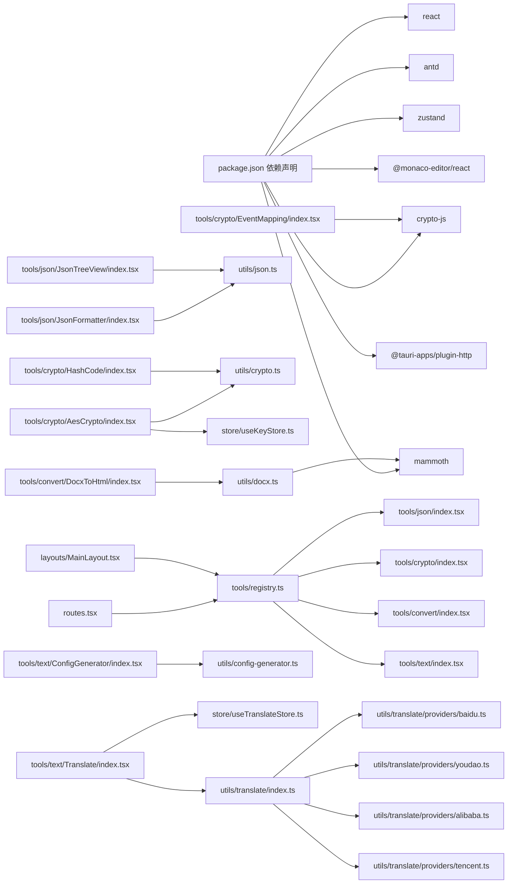

**图表来源**
- [package.json:12-28](file://package.json#L12-L28)
- [src/tools/registry.ts:1-6](file://src/tools/registry.ts#L1-L6)
- [src/routes.tsx:4](file://src/routes.tsx#L4)
- [src/layouts/MainLayout.tsx:12](file://src/layouts/MainLayout.tsx#L12)
- [src/tools/json/JsonFormatter/index.tsx:28](file://src/tools/json/JsonFormatter/index.tsx#L28)
- [src/tools/json/JsonTreeView/index.tsx:20](file://src/tools/json/JsonTreeView/index.tsx#L20)
- [src/tools/crypto/AesCrypto/index.tsx:29](file://src/tools/crypto/AesCrypto/index.tsx#L29)
- [src/tools/crypto/HashCode/index.tsx:1](file://src/tools/crypto/HashCode/index.tsx#L1)
- [src/tools/crypto/EventMapping/index.tsx:4](file://src/tools/crypto/EventMapping/index.tsx#L4)
- [src/tools/convert/DocxToHtml/index.tsx:17-20](file://src/tools/convert/DocxToHtml/index.tsx#L17-L20)
- [src/utils/docx.ts:1](file://src/utils/docx.ts#L1)
- [src/tools/text/ConfigGenerator/index.tsx:17](file://src/tools/text/ConfigGenerator/index.tsx#L17)
- [src/tools/text/Translate/index.tsx:18](file://src/tools/text/Translate/index.tsx#L18)
- [src/utils/translate/index.ts:2](file://src/utils/translate/index.ts#L2)
- [src/store/useKeyStore.ts:3](file://src/store/useKeyStore.ts#L3)

**章节来源**
- [package.json:1-40](file://package.json#L1-L40)
- [src/tools/registry.ts:1-47](file://src/tools/registry.ts#L1-L47)
- [src/routes.tsx:1-29](file://src/routes.tsx#L1-L29)
- [src/layouts/MainLayout.tsx:1-168](file://src/layouts/MainLayout.tsx#L1-L168)

## 性能考虑
- 懒加载：工具组件通过 React.lazy 按需加载，减少初始包体与首屏渲染压力。
- 分类聚合：注册表一次性构建分类树，避免重复计算。
- 状态持久化：应用设置与密钥库使用持久化中间件，减少重复初始化成本。
- JSON 处理：格式化与压缩操作在内存中进行，建议对超大 JSON 使用压缩或分块策略。
- 文本处理：配置生成器使用正则表达式解析，对于超大文本建议分块处理。
- 翻译服务：网络请求采用异步处理，支持加载状态显示和错误恢复机制。
- 事件映射：MD5 计算在客户端完成，支持批量词汇处理和结果缓存。
- DOCX转换：使用mammoth库进行文档解析，支持图片处理回调，建议对大文件进行进度提示。
- 文件操作：Tauri插件提供原生文件系统访问，注意异步操作的错误处理。

[本节为通用性能建议，无需特定文件引用]

## 故障排查指南
- AES 加密/解密失败：
  - 检查密钥与 IV 长度是否符合配置（Hex/UTF-8），模式非 ECB 时 IV 必须提供且长度正确。
  - 输出格式需与输入一致（Hex/Base64）。
  - 使用解密有效性判断辅助定位无效解密。
- JSON 解析错误：
  - 查看错误中的行列位置，定位语法问题。
  - 确认输入为合法 JSON，避免尾逗号、注释等非法字符。
- 配置生成器解析失败：
  - 检查输入格式是否符合预期，确保包含必要的配置字段。
  - 确认域名解析服务可用，网络连接正常。
  - 查看错误信息中的具体失败原因。
- 翻译工具故障：
  - 检查翻译配置是否正确填写，各服务商密钥不能为空。
  - 确认网络连接正常，API 服务可达。
  - 查看错误码映射，根据具体错误采取相应措施。
  - 检查语言代码映射，确保目标语言受支持。
- 事件映射生成失败：
  - 确认 package_keys 输入不为空。
  - 检查截取位数范围（1-32）。
  - 验证默认词汇表完整性。
- 格式转换工具故障：
  - 确认选择的文件为有效的DOCX格式。
  - 检查文件大小限制，避免超大文件导致内存不足。
  - 查看转换警告信息，了解转换过程中的问题。
  - 确认mammoth库正常加载，检查依赖安装。
  - 检查浏览器兼容性，确保支持WebAssembly。
- HashCode 计算异常：
  - 确认输入字符串不为空。
  - 注意 Java 风格哈希的 32 位有符号整数限制。
- 路由与菜单异常：
  - 确认工具 path 与注册表一致，未命中时会跳转至首个工具。
  - 检查分类图标与名称映射是否正确。

**章节来源**
- [src/utils/crypto.ts:65-104](file://src/utils/crypto.ts#L65-L104)
- [src/utils/crypto.ts:113-161](file://src/utils/crypto.ts#L113-L161)
- [src/utils/json.ts:14-38](file://src/utils/json.ts#L14-L38)
- [src/utils/config-generator.ts:51-107](file://src/utils/config-generator.ts#L51-L107)
- [src/utils/translate/providers/baidu.ts:66-79](file://src/utils/translate/providers/baidu.ts#L66-L79)
- [src/utils/translate/providers/youdao.ts:67-81](file://src/utils/translate/providers/youdao.ts#L67-L81)
- [src/utils/translate/providers/alibaba.ts:8](file://src/utils/translate/providers/alibaba.ts#L8)
- [src/utils/translate/providers/tencent.ts:20](file://src/utils/translate/providers/tencent.ts#L20)
- [src/tools/crypto/EventMapping/index.tsx:37-48](file://src/tools/crypto/EventMapping/index.tsx#L37-L48)
- [src/tools/convert/DocxToHtml/index.tsx:65-72](file://src/tools/convert/DocxToHtml/index.tsx#L65-L72)
- [src/utils/docx.ts:40-47](file://src/utils/docx.ts#L40-L47)
- [src/routes.tsx:21-24](file://src/routes.tsx#L21-L24)

## 结论
XKUtil 工具系统通过注册表驱动的分类与动态路由机制，实现了清晰的模块划分与良好的扩展性。JSON、加密、格式转换与文本处理四大模块分别提供了实用的数据处理、安全能力、文档转换与配置生成能力，配合懒加载与状态持久化，兼顾了性能与用户体验。版本 0.5.0 新增的格式转换工具模块进一步完善了工具系统的文档处理能力，特别包含DocxToHtml工具，支持Word文档转换为HTML，新增了mammoth库依赖用于DOCX文档解析。未来可在现有基础上完善关键字搜索、工具权限与审计日志等能力，进一步增强企业级可用性。

[本节为总结性内容，无需特定文件引用]

## 附录

### 工具开发规范与扩展指南
- 新增工具步骤
  1. 在对应目录下创建工具组件与配置文件，导出 ToolDefinition 数组。
  2. 在 tools/registry.ts 中引入新增工具集合，确保被 allTools 合并。
  3. 在 routes.tsx 中确认 getAllTools() 被调用以动态生成路由。
  4. 在 MainLayout.tsx 中确认 getToolCategories() 被调用以生成菜单。
- 最佳实践
  - 工具 id 唯一且语义化，path 与组件注册保持一致。
  - keywords 字段可用于未来搜索功能扩展。
  - 组件内使用懒加载与错误提示，提升稳定性与可维护性。
  - 对敏感操作（如暴力破解）提供明确的安全提示与确认流程。
  - 文本处理工具建议提供格式验证和错误恢复机制。
  - 翻译工具需考虑多语言支持和错误码处理。
  - 事件映射工具需注意性能优化和结果缓存。
  - 格式转换工具需考虑文件大小限制与进度提示。
  - DOCX转换工具需处理图片资源与警告信息。

**章节来源**
- [src/tools/registry.ts:1-47](file://src/tools/registry.ts#L1-L47)
- [src/tools/json/index.tsx:1-27](file://src/tools/json/index.tsx#L1-L27)
- [src/tools/crypto/index.tsx:1-37](file://src/tools/crypto/index.tsx#L1-L37)
- [src/tools/convert/index.tsx:1-17](file://src/tools/convert/index.tsx#L1-L17)
- [src/tools/text/index.tsx:1-27](file://src/tools/text/index.tsx#L1-L27)
- [src/routes.tsx:1-29](file://src/routes.tsx#L1-L29)
- [src/layouts/MainLayout.tsx:1-168](file://src/layouts/MainLayout.tsx#L1-L168)

### 工具系统 API 文档
- 工具注册表
  - getToolCategories(): 返回分类列表，包含 id、name、icon、tools。
  - getAllTools(): 返回全量工具定义列表。
- JSON 工具函数
  - parseJson(input): 解析 JSON，返回成功或错误及行列位置。
  - formatJson(data, indent, sortKeys): 格式化 JSON。
  - compressJson(data): 压缩 JSON。
  - getJsonStats(data): 统计类型、键数、深度、大小。
- 加密工具函数
  - aesEncrypt(明文, 密钥, IV, 配置): 加密，返回结果或错误。
  - aesDecrypt(密文, 密钥, IV, 配置): 解密，返回结果或错误。
  - generateRandomKey(size, format): 生成随机密钥。
  - generateRandomIV(format): 生成随机 IV。
  - isValidDecryption(output): 判断解密结果是否有效。
  - javaHashCode(str): 计算 Java 风格字符串 hashCode。
  - generateEventMapping(packageKeys, prefix, index): 生成事件映射配置。
- 格式转换工具函数
  - convertDocxToHtml(arrayBuffer): DOCX转HTML，返回结果或错误。
  - DocxConversionResult: 转换结果接口，包含success、html、imageCount、messages、error。
- 配置生成器函数
  - generateConfig(content): 从结构化文本生成配置，返回结果或错误。
  - formatOutput(data): 格式化为 key=value 字符串。
  - getRealIpViaApi(host): 通过 DNS API 获取域名 IP。
  - getFirstMatch(content, regex): 提取单行属性。
  - getSubValue(content, section, key): 提取缩进级属性。
- 翻译工具函数
  - translate(provider, request, configs): 统一翻译接口，返回结果或错误。
  - baiduTranslate(request, config): 百度翻译实现。
  - youdaoTranslate(request, config): 有道翻译实现。
  - alibabaTranslate(request, config): 阿里翻译实现。
  - tencentTranslate(request, config): 腾讯翻译实现。
  - LANGUAGES: 支持的语言列表。
  - getProviderLangCode(provider, key): 获取平台特定语言代码。
- 状态存储
  - useKeyStore: 提供密钥对的增删改查与持久化。
  - useTranslateStore: 翻译配置管理与状态持久化。

**章节来源**
- [src/tools/registry.ts:7-27](file://src/tools/registry.ts#L7-L27)
- [src/utils/json.ts:14-116](file://src/utils/json.ts#L14-L116)
- [src/utils/crypto.ts:59-222](file://src/utils/crypto.ts#L59-L222)
- [src/utils/docx.ts:3-48](file://src/utils/docx.ts#L3-L48)
- [src/utils/config-generator.ts:1-117](file://src/utils/config-generator.ts#L1-L117)
- [src/utils/translate/index.ts:11-40](file://src/utils/translate/index.ts#L11-L40)
- [src/utils/translate/providers/baidu.ts:7-79](file://src/utils/translate/providers/baidu.ts#L7-L79)
- [src/utils/translate/providers/youdao.ts:12-81](file://src/utils/translate/providers/youdao.ts#L12-L81)
- [src/utils/translate/providers/alibaba.ts:7-90](file://src/utils/translate/providers/alibaba.ts#L7-L90)
- [src/utils/translate/providers/tencent.ts:20-114](file://src/utils/translate/providers/tencent.ts#L20-L114)
- [src/utils/translate/languages.ts:1-43](file://src/utils/translate/languages.ts#L1-L43)
- [src/utils/translate/types.ts:1-13](file://src/utils/translate/types.ts#L1-L13)
- [src/store/useKeyStore.ts:15-46](file://src/store/useKeyStore.ts#L15-L46)
- [src/store/useTranslateStore.ts:33-79](file://src/store/useTranslateStore.ts#L33-L79)

### 集成示例
- 在新工具中使用 AES 工具
  - 引入 aesEncrypt、aesDecrypt、isValidDecryption。
  - 从 useKeyStore 读取/写入密钥对。
  - 在 UI 中提供配置面板与操作按钮，调用上述函数并处理返回结果。
- 在新工具中使用 JSON 工具
  - 引入 parseJson、formatJson、compressJson、getJsonStats。
  - 在 UI 中提供输入输出面板，调用函数并展示统计信息与错误提示。
- 在新工具中使用配置生成器
  - 引入 generateConfig、formatOutput、getRealIpViaApi。
  - 在 UI 中提供配置文本输入框，调用 generateConfig 处理输入并格式化输出。
  - 实现域名解析功能，支持一键复制生成的配置。
- 在新工具中使用 HashCode 工具
  - 引入 javaHashCode 函数。
  - 在 UI 中提供字符串输入和结果展示，支持复制功能。
- 在新工具中使用翻译工具
  - 引入 translate 函数和 LANGUAGES。
  - 从 useTranslateStore 获取配置和状态。
  - 实现翻译界面，支持多服务商切换和配置管理。
  - 处理翻译结果和错误状态，提供用户友好的反馈。
- 在新工具中使用事件映射工具
  - 引入 generateEventMapping 函数。
  - 在 UI 中提供输入参数配置，调用函数生成映射结果。
  - 支持复制生成的配置，提供批量处理能力。
- 在新工具中使用格式转换工具
  - 引入 convertDocxToHtml 函数。
  - 在 UI 中提供文件选择与拖拽上传功能。
  - 处理转换进度与结果，支持复制HTML代码与下载文件。
  - 展示图片处理统计与转换警告信息。

**章节来源**
- [src/tools/crypto/AesCrypto/index.tsx:24-29](file://src/tools/crypto/AesCrypto/index.tsx#L24-L29)
- [src/store/useKeyStore.ts:22-46](file://src/store/useKeyStore.ts#L22-L46)
- [src/tools/json/JsonFormatter/index.tsx:23-28](file://src/tools/json/JsonFormatter/index.tsx#L23-L28)
- [src/tools/text/ConfigGenerator/index.tsx:50-68](file://src/tools/text/ConfigGenerator/index.tsx#L50-L68)
- [src/tools/crypto/HashCode/index.tsx:24-31](file://src/tools/crypto/HashCode/index.tsx#L24-L31)
- [src/tools/text/Translate/index.tsx:52-75](file://src/tools/text/Translate/index.tsx#L52-L75)
- [src/store/useTranslateStore.ts:33-79](file://src/store/useTranslateStore.ts#L33-L79)
- [src/tools/crypto/EventMapping/index.tsx:37-48](file://src/tools/crypto/EventMapping/index.tsx#L37-L48)
- [src/tools/convert/DocxToHtml/index.tsx:32-108](file://src/tools/convert/DocxToHtml/index.tsx#L32-L108)
- [src/utils/docx.ts:11-47](file://src/utils/docx.ts#L11-L47)