# 翻译系统

<cite>
**本文档引用的文件**
- [src/utils/translate/index.ts](file://src/utils/translate/index.ts)
- [src/utils/translate/types.ts](file://src/utils/translate/types.ts)
- [src/utils/translate/languages.ts](file://src/utils/translate/languages.ts)
- [src/store/useTranslateStore.ts](file://src/store/useTranslateStore.ts)
- [src/tools/text/Translate/index.tsx](file://src/tools/text/Translate/index.tsx)
- [src/utils/translate/providers/baidu.ts](file://src/utils/translate/providers/baidu.ts)
- [src/utils/translate/providers/youdao.ts](file://src/utils/translate/providers/youdao.ts)
- [src/utils/translate/providers/alibaba.ts](file://src/utils/translate/providers/alibaba.ts)
- [src/utils/translate/providers/tencent.ts](file://src/utils/translate/providers/tencent.ts)
- [src/tools/text/Translate/SettingsDrawer.tsx](file://src/tools/text/Translate/SettingsDrawer.tsx)
- [src/main.tsx](file://src/main.tsx)
- [src/App.tsx](file://src/App.tsx)
- [src/routes.tsx](file://src/routes.tsx)
- [package.json](file://package.json)
- [doc/translate-api-guide.md](file://doc/translate-api-guide.md)
</cite>

## 目录
1. [简介](#简介)
2. [项目结构](#项目结构)
3. [核心组件](#核心组件)
4. [架构概览](#架构概览)
5. [详细组件分析](#详细组件分析)
6. [依赖关系分析](#依赖关系分析)
7. [性能考虑](#性能考虑)
8. [故障排除指南](#故障排除指南)
9. [结论](#结论)
10. [附录](#附录)

## 简介

这是一个基于 React 和 Tauri 的桌面翻译工具系统，集成了多家主流翻译服务提供商。该系统提供了现代化的桌面应用程序界面，支持实时翻译、多语言切换、配置管理和错误处理等功能。

系统的核心特性包括：
- 支持百度、有道、阿里、腾讯四大翻译服务提供商
- 实时翻译功能，支持多种语言对
- 用户友好的图形界面
- 配置持久化存储
- 错误处理和状态管理

## 项目结构

项目采用模块化的组织结构，主要分为以下几个部分：

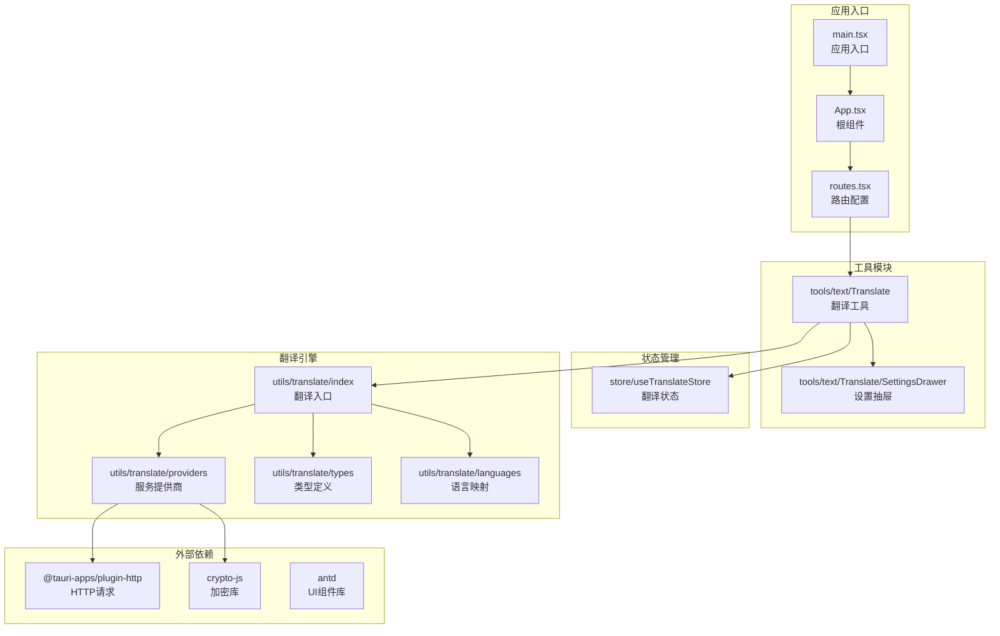

**图表来源**
- [src/main.tsx:1-11](file://src/main.tsx#L1-L11)
- [src/App.tsx:1-24](file://src/App.tsx#L1-L24)
- [src/routes.tsx:1-29](file://src/routes.tsx#L1-L29)

**章节来源**
- [src/main.tsx:1-11](file://src/main.tsx#L1-L11)
- [src/App.tsx:1-24](file://src/App.tsx#L1-L24)
- [src/routes.tsx:1-29](file://src/routes.tsx#L1-L29)

## 核心组件

### 翻译状态管理

系统使用 Zustand 进行状态管理，提供统一的状态存储和更新机制：

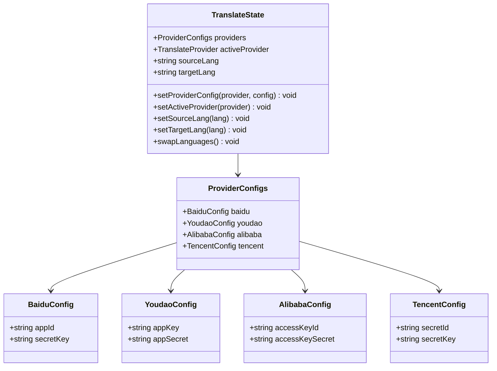

**图表来源**
- [src/store/useTranslateStore.ts:33-79](file://src/store/useTranslateStore.ts#L33-L79)

### 翻译服务接口

翻译系统通过统一的接口抽象，支持多个翻译服务提供商：

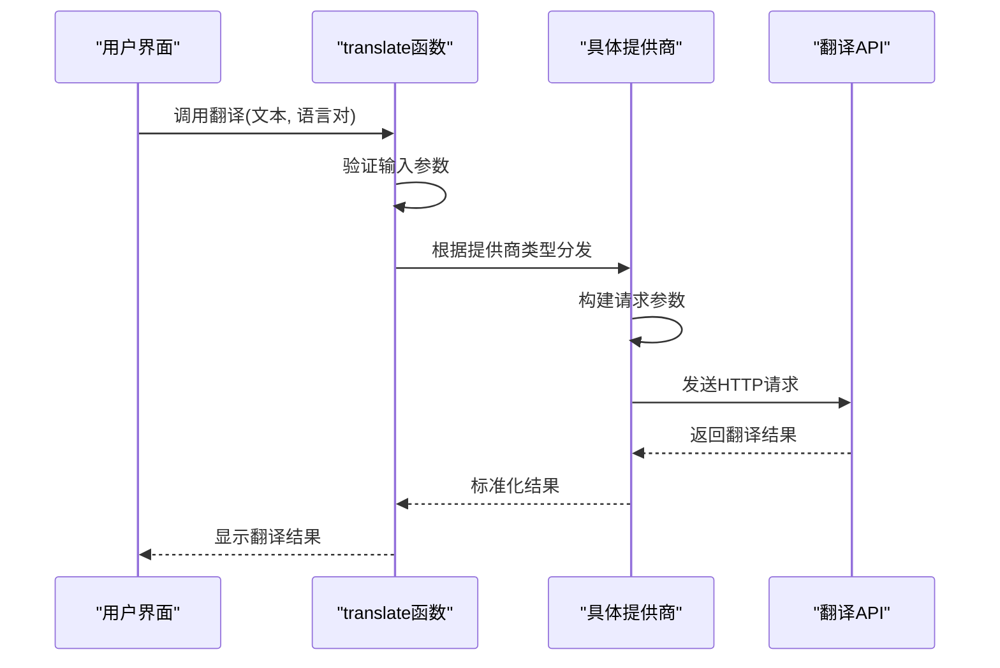

**图表来源**
- [src/utils/translate/index.ts:11-32](file://src/utils/translate/index.ts#L11-L32)
- [src/tools/text/Translate/index.tsx:52-75](file://src/tools/text/Translate/index.tsx#L52-L75)

**章节来源**
- [src/store/useTranslateStore.ts:1-79](file://src/store/useTranslateStore.ts#L1-L79)
- [src/utils/translate/index.ts:1-40](file://src/utils/translate/index.ts#L1-L40)

## 架构概览

系统采用分层架构设计，清晰分离了表现层、业务逻辑层和数据访问层：

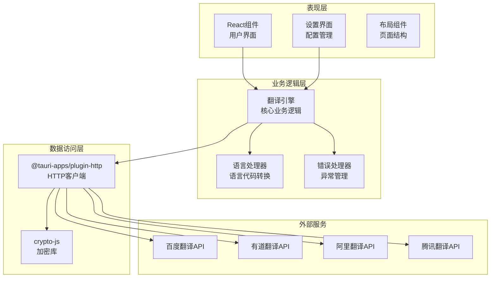

**图表来源**
- [src/utils/translate/providers/baidu.ts:1-79](file://src/utils/translate/providers/baidu.ts#L1-L79)
- [src/utils/translate/providers/youdao.ts:1-81](file://src/utils/translate/providers/youdao.ts#L1-L81)
- [src/utils/translate/providers/alibaba.ts:1-90](file://src/utils/translate/providers/alibaba.ts#L1-L90)
- [src/utils/translate/providers/tencent.ts:1-114](file://src/utils/translate/providers/tencent.ts#L1-L114)

## 详细组件分析

### 翻译工具组件

翻译工具是用户交互的主要界面，提供了完整的翻译功能：

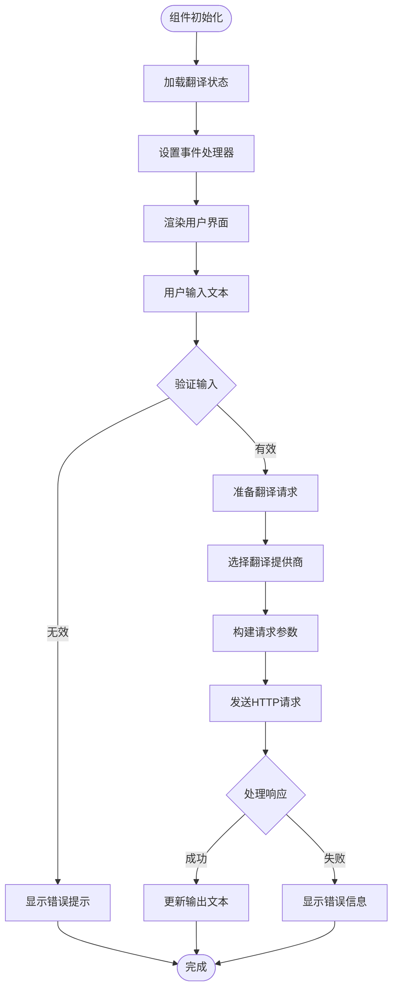

**图表来源**
- [src/tools/text/Translate/index.tsx:34-217](file://src/tools/text/Translate/index.tsx#L34-L217)

#### 组件功能特性

1. **实时翻译**: 支持即时翻译功能，用户输入文本后可立即获得翻译结果
2. **多语言支持**: 提供8种语言的翻译能力，包括中文、英语、泰语、印尼语等
3. **语言交换**: 支持源语言和目标语言的快速交换
4. **配置管理**: 通过抽屉式界面管理各翻译服务的配置信息
5. **错误处理**: 完善的错误处理机制，提供友好的用户反馈

**章节来源**
- [src/tools/text/Translate/index.tsx:1-217](file://src/tools/text/Translate/index.tsx#L1-L217)

### 翻译提供者实现

系统实现了四个主要翻译服务提供商的具体实现：

#### 百度翻译集成

百度翻译提供了最全面的语言支持，但存在一些限制：

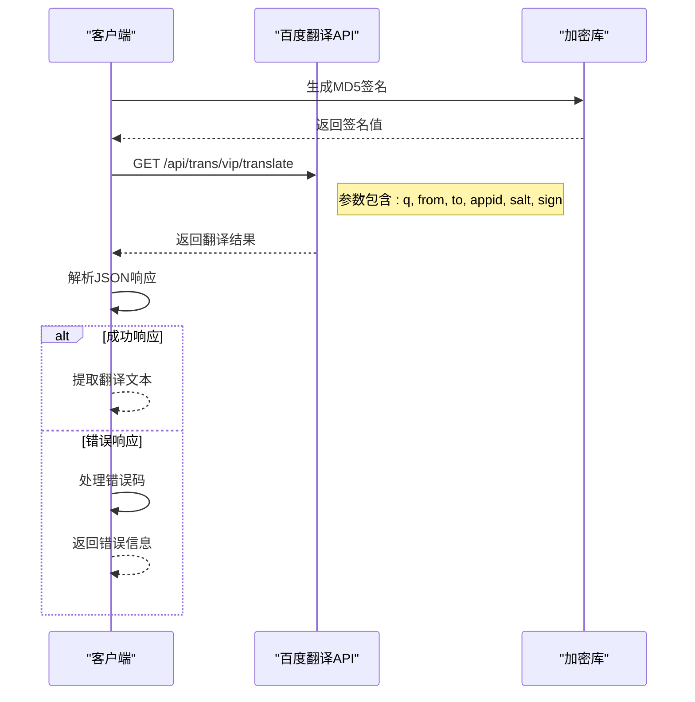

**图表来源**
- [src/utils/translate/providers/baidu.ts:7-64](file://src/utils/translate/providers/baidu.ts#L7-L64)

#### 有道翻译集成

有道翻译提供了更丰富的语言支持，特别是对印尼语和缅甸语的支持：

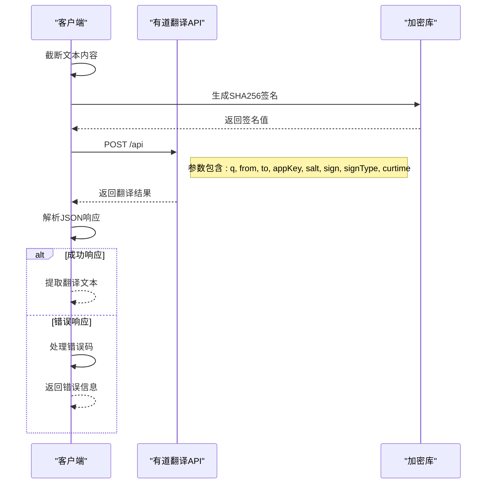

**图表来源**
- [src/utils/translate/providers/youdao.ts:12-65](file://src/utils/translate/providers/youdao.ts#L12-L65)

#### 阿里翻译集成

阿里翻译采用了复杂的ROA签名机制：

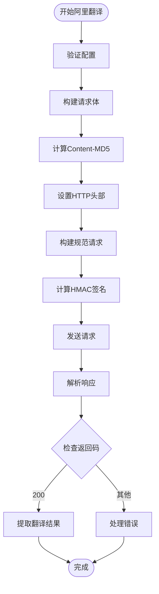

**图表来源**
- [src/utils/translate/providers/alibaba.ts:7-90](file://src/utils/translate/providers/alibaba.ts#L7-L90)

#### 腾讯翻译集成

腾讯翻译实现了TC3-HMAC-SHA256签名算法：

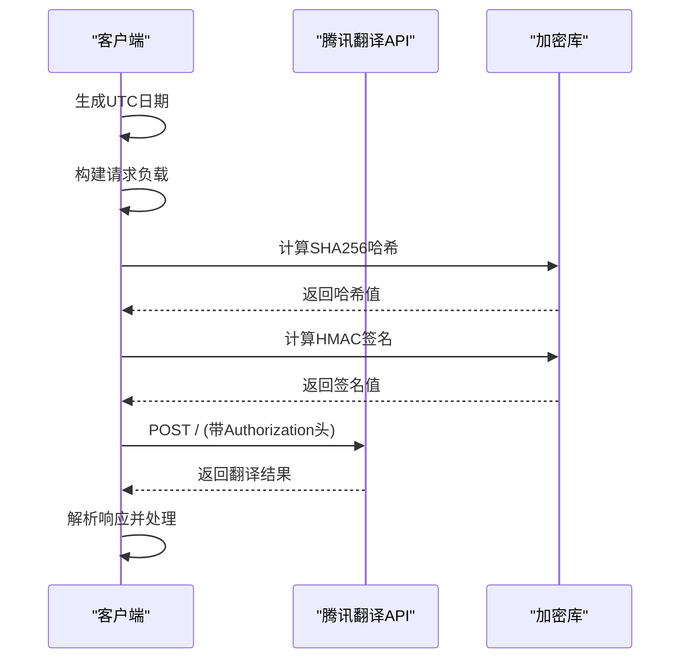

**图表来源**
- [src/utils/translate/providers/tencent.ts:20-114](file://src/utils/translate/providers/tencent.ts#L20-L114)

**章节来源**
- [src/utils/translate/providers/baidu.ts:1-79](file://src/utils/translate/providers/baidu.ts#L1-L79)
- [src/utils/translate/providers/youdao.ts:1-81](file://src/utils/translate/providers/youdao.ts#L1-L81)
- [src/utils/translate/providers/alibaba.ts:1-90](file://src/utils/translate/providers/alibaba.ts#L1-L90)
- [src/utils/translate/providers/tencent.ts:1-114](file://src/utils/translate/providers/tencent.ts#L1-L114)

### 设置管理组件

设置抽屉提供了统一的配置管理界面：

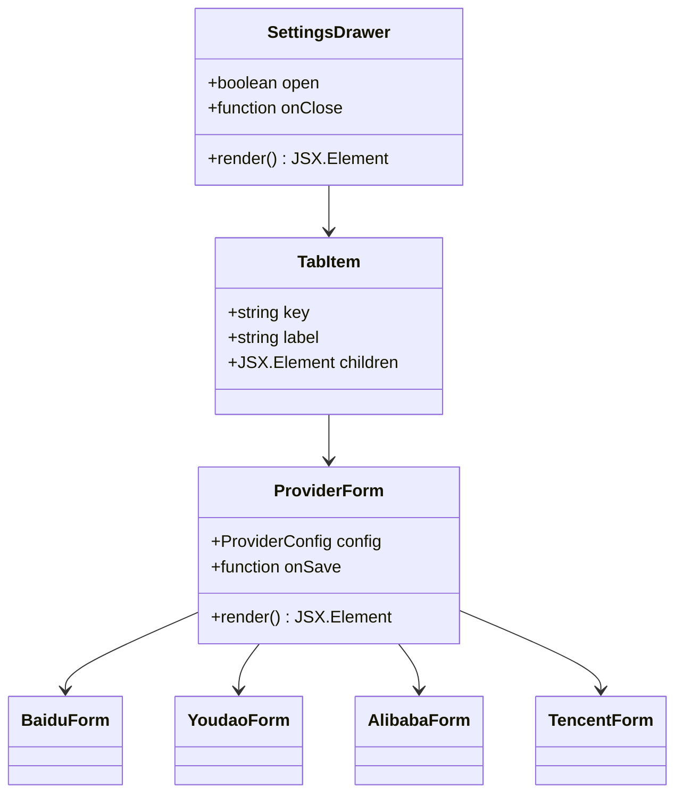

**图表来源**
- [src/tools/text/Translate/SettingsDrawer.tsx:9-72](file://src/tools/text/Translate/SettingsDrawer.tsx#L9-L72)

**章节来源**
- [src/tools/text/Translate/SettingsDrawer.tsx:1-165](file://src/tools/text/Translate/SettingsDrawer.tsx#L1-L165)

## 依赖关系分析

系统使用了现代化的前端技术栈，主要依赖关系如下：

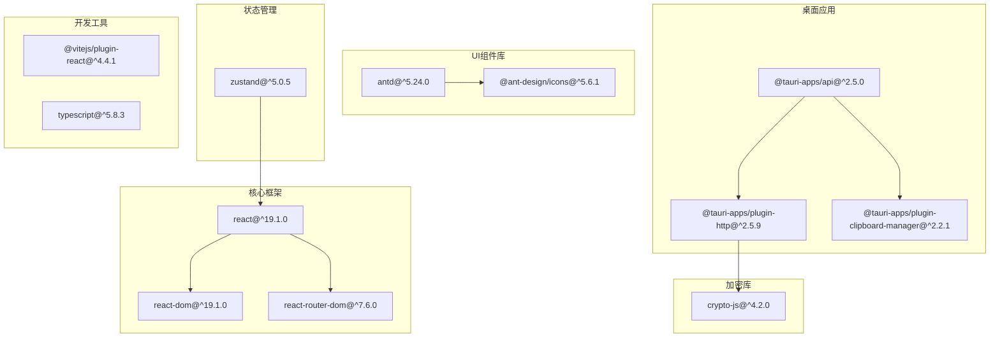

**图表来源**
- [package.json:12-37](file://package.json#L12-L37)

**章节来源**
- [package.json:1-39](file://package.json#L1-L39)

## 性能考虑

### 网络请求优化

1. **请求缓存**: 可以考虑添加请求结果缓存机制，避免重复翻译相同文本
2. **并发控制**: 限制同时进行的翻译请求数量，防止API限流
3. **连接复用**: 利用Tauri的HTTP插件特性，复用网络连接

### 内存管理

1. **状态清理**: 及时清理翻译历史记录，避免内存泄漏
2. **组件卸载**: 在组件卸载时取消正在进行的网络请求
3. **大文本处理**: 对于超长文本，考虑分段翻译策略

### 用户体验优化

1. **加载状态**: 提供更精确的加载状态反馈
2. **错误恢复**: 实现自动重试机制和错误恢复策略
3. **离线支持**: 考虑添加离线翻译能力

## 故障排除指南

### 常见问题及解决方案

#### 翻译服务配置问题

**问题**: 翻译失败，提示需要配置API密钥
**解决方案**: 
1. 点击"设置"按钮打开配置界面
2. 在对应的服务标签页中填写正确的API凭据
3. 点击"保存"按钮确认配置

#### 语言支持限制

**问题**: 某些语言无法翻译或出现错误
**解决方案**:
1. 检查所选翻译服务的语言支持范围
2. 考虑升级到更高版本的服务套餐
3. 选择其他支持该语言的翻译服务

#### 网络连接问题

**问题**: 请求超时或网络错误
**解决方案**:
1. 检查网络连接状态
2. 确认防火墙设置允许出站连接
3. 尝试重新发起翻译请求

**章节来源**
- [src/utils/translate/providers/baidu.ts:11-22](file://src/utils/translate/providers/baidu.ts#L11-L22)
- [src/utils/translate/providers/youdao.ts:15-18](file://src/utils/translate/providers/youdao.ts#L15-L18)
- [src/utils/translate/providers/alibaba.ts:10-13](file://src/utils/translate/providers/alibaba.ts#L10-L13)
- [src/utils/translate/providers/tencent.ts:23-26](file://src/utils/translate/providers/tencent.ts#L23-L26)

## 结论

这个翻译系统展现了现代桌面应用开发的最佳实践，具有以下优势：

1. **模块化设计**: 清晰的分层架构和模块化组织
2. **扩展性强**: 易于添加新的翻译服务提供商
3. **用户体验**: 直观的界面设计和流畅的交互体验
4. **技术先进**: 采用最新的React和Tauri技术栈
5. **功能完整**: 提供了从基础翻译到高级配置的完整功能

系统目前主要完成了百度和有道翻译服务的集成，为后续集成阿里和腾讯翻译服务奠定了良好的基础。通过合理的架构设计和完善的错误处理机制，该系统能够为用户提供稳定可靠的翻译服务。

## 附录

### 支持的语言列表

系统支持以下8种语言的翻译：

| 语言代码 | 语言名称 | 百度支持 | 有道支持 | 阿里支持 | 腾讯支持 |
|---------|---------|---------|---------|---------|---------|
| auto | 自动检测 | ✓ | ✓ | ✓ | ✓ |
| zh | 中文 | ✓ | ✓ | ✓ | ✓ |
| en | 英语 | ✓ | ✓ | ✓ | ✓ |
| th | 泰语 | ✓ | ✓ | ✓ | ✓ |
| id | 印尼语 | 标准版不支持 | ✓ | ✓ | 待确认 |
| es | 西班牙语 | ✓ | ✓ | ✓ | ✓ |
| vi | 越南语 | ✓ | ✓ | ✓ | ✓ |
| my | 缅甸语 | 标准版不支持 | ✓ | ✓ | 待确认 |

### API服务对比

| 特性 | 百度翻译 | 有道翻译 | 阿里翻译 | 腾讯翻译 |
|------|---------|---------|---------|---------|
| 免费额度 | 高级版100万字符/月 | 新用户体验金 | 通用版100万字符/月 | 500万字符/月 |
| 支持语种 | 标准28种/尊享200+ | 100+种 | 200+种 | 70+种 |
| 印尼语支持 | 尊享版 | ✓ | ✓ | 待确认 |
| 缅甸语支持 | 尊享版 | ✓ | ✓ | 待确认 |
| QPS限制 | 标准版1 | 高级版10 | 未指定 | 未指定 |

**章节来源**
- [doc/translate-api-guide.md:91-106](file://doc/translate-api-guide.md#L91-L106)