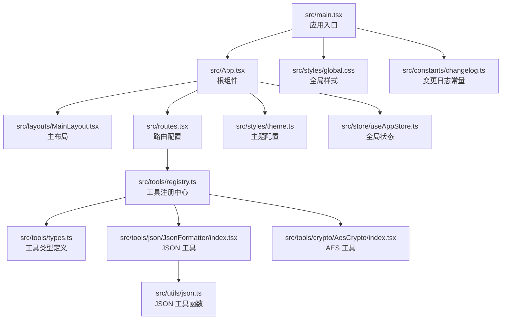
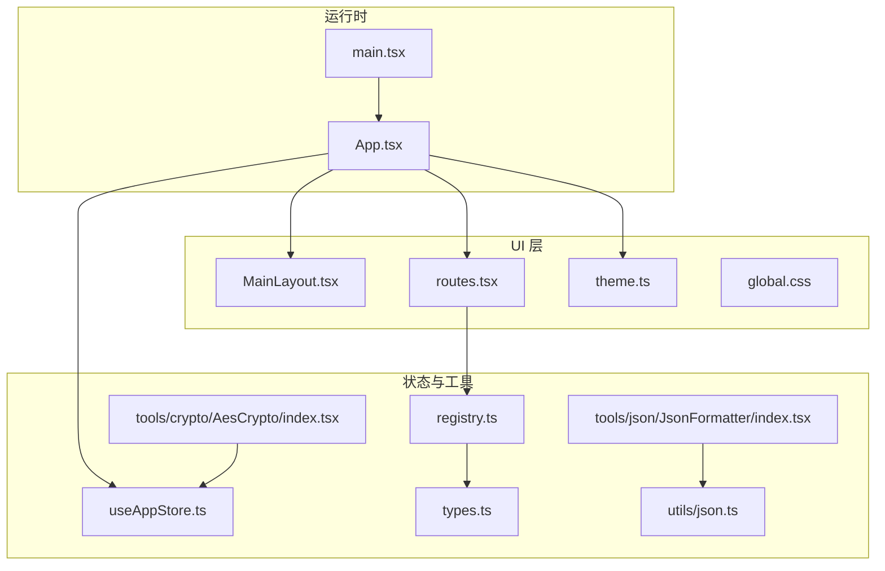
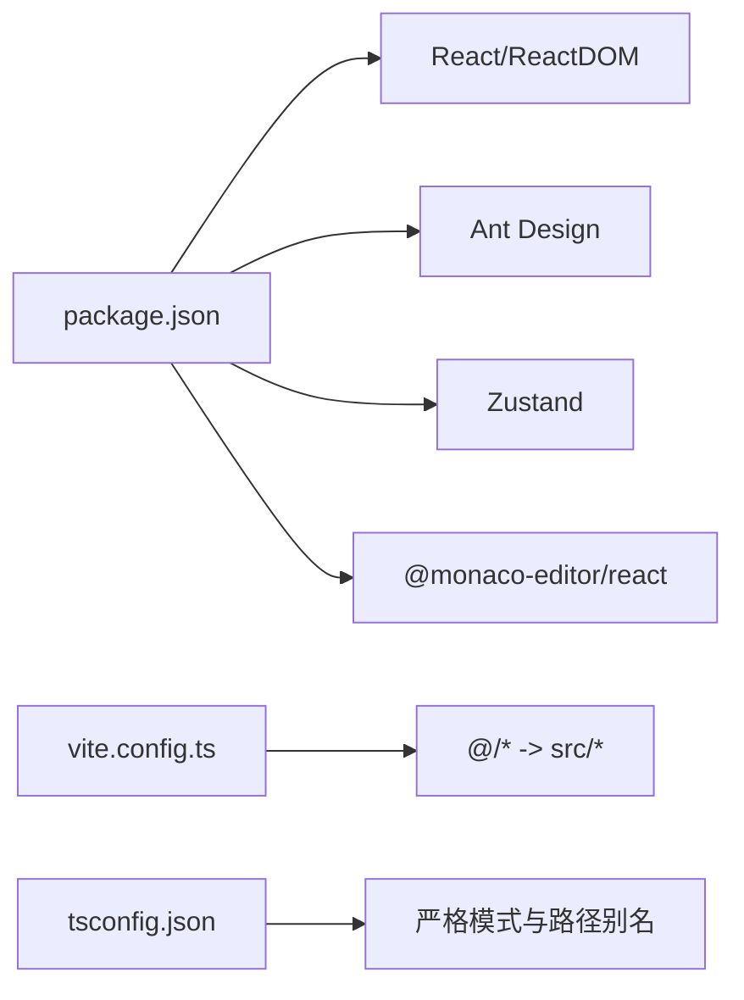
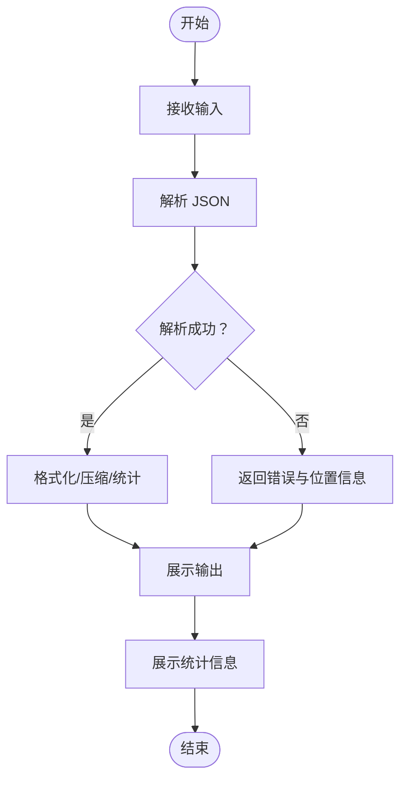

# 代码规范

<cite>
**本文引用的文件**
- [package.json](file://package.json)
- [tsconfig.json](file://tsconfig.json)
- [vite.config.ts](file://vite.config.ts)
- [src/main.tsx](file://src/main.tsx)
- [src/App.tsx](file://src/App.tsx)
- [src/styles/theme.ts](file://src/styles/theme.ts)
- [src/styles/global.css](file://src/styles/global.css)
- [src/layouts/MainLayout.tsx](file://src/layouts/MainLayout.tsx)
- [src/routes.tsx](file://src/routes.tsx)
- [src/store/useAppStore.ts](file://src/store/useAppStore.ts)
- [src/tools/types.ts](file://src/tools/types.ts)
- [src/tools/registry.ts](file://src/tools/registry.ts)
- [src/constants/changelog.ts](file://src/constants/changelog.ts)
- [src/utils/json.ts](file://src/utils/json.ts)
- [src/tools/json/JsonFormatter/index.tsx](file://src/tools/json/JsonFormatter/index.tsx)
- [src/tools/crypto/AesCrypto/index.tsx](file://src/tools/crypto/AesCrypto/index.tsx)
</cite>

## 目录
1. [引言](#引言)
2. [项目结构](#项目结构)
3. [核心组件](#核心组件)
4. [架构总览](#架构总览)
5. [详细组件分析](#详细组件分析)
6. [依赖关系分析](#依赖关系分析)
7. [性能考量](#性能考量)
8. [故障排查指南](#故障排查指南)
9. [结论](#结论)
10. [附录](#附录)

## 引言
本文件为 XKUtil 项目的代码规范文档，面向 TypeScript 编码、React 组件开发、CSS 与样式、文件组织与命名、Git 提交与分支管理、代码审查与质量检查等维度，结合仓库现有实现给出统一的规范建议与最佳实践。文档中的示例与反例均以仓库中现有文件为依据，避免凭空臆造。

## 项目结构
项目采用基于功能域的目录组织方式：components、layouts、store、styles、tools、utils、constants 等模块清晰划分职责；入口文件集中于 src 下，构建配置通过 Vite 与 TypeScript 共同完成。

图表来源
- [src/main.tsx:1-11](file://src/main.tsx#L1-L11)
- [src/App.tsx:1-24](file://src/App.tsx#L1-L24)
- [src/layouts/MainLayout.tsx:1-168](file://src/layouts/MainLayout.tsx#L1-L168)
- [src/routes.tsx:1-29](file://src/routes.tsx#L1-L29)
- [src/styles/theme.ts:1-12](file://src/styles/theme.ts#L1-L12)
- [src/store/useAppStore.ts:1-24](file://src/store/useAppStore.ts#L1-L24)
- [src/tools/registry.ts:1-39](file://src/tools/registry.ts#L1-L39)
- [src/tools/types.ts:1-20](file://src/tools/types.ts#L1-L20)
- [src/tools/json/JsonFormatter/index.tsx:1-267](file://src/tools/json/JsonFormatter/index.tsx#L1-L267)
- [src/tools/crypto/AesCrypto/index.tsx:1-310](file://src/tools/crypto/AesCrypto/index.tsx#L1-L310)
- [src/styles/global.css:1-31](file://src/styles/global.css#L1-L31)
- [src/constants/changelog.ts:1-34](file://src/constants/changelog.ts#L1-L34)
- [src/utils/json.ts:1-116](file://src/utils/json.ts#L1-L116)

章节来源
- [src/main.tsx:1-11](file://src/main.tsx#L1-L11)
- [src/App.tsx:1-24](file://src/App.tsx#L1-L24)
- [src/routes.tsx:1-29](file://src/routes.tsx#L1-L29)
- [src/layouts/MainLayout.tsx:1-168](file://src/layouts/MainLayout.tsx#L1-L168)
- [src/styles/global.css:1-31](file://src/styles/global.css#L1-L31)
- [src/styles/theme.ts:1-12](file://src/styles/theme.ts#L1-L12)
- [src/store/useAppStore.ts:1-24](file://src/store/useAppStore.ts#L1-L24)
- [src/tools/registry.ts:1-39](file://src/tools/registry.ts#L1-L39)
- [src/tools/types.ts:1-20](file://src/tools/types.ts#L1-L20)
- [src/constants/changelog.ts:1-34](file://src/constants/changelog.ts#L1-L34)
- [src/utils/json.ts:1-116](file://src/utils/json.ts#L1-L116)
- [src/tools/json/JsonFormatter/index.tsx:1-267](file://src/tools/json/JsonFormatter/index.tsx#L1-L267)
- [src/tools/crypto/AesCrypto/index.tsx:1-310](file://src/tools/crypto/AesCrypto/index.tsx#L1-L310)

## 核心组件
- 应用入口与根组件：负责初始化运行时、引入全局样式、配置国际化与主题，并挂载主布局与路由。
- 主布局：提供侧边菜单、头部操作区、内容区域与版本弹窗，使用 Ant Design 的 Layout 组件与主题 token。
- 路由系统：动态根据工具注册表生成路由，支持懒加载与骨架屏占位。
- 全局状态：使用 Zustand 管理折叠状态与主题切换，并持久化到本地存储。
- 工具注册中心：按类别聚合工具，提供工具与类别的映射。
- 工具类型：统一定义工具与类别的接口，确保类型安全。
- JSON 工具：提供解析、格式化、压缩、统计等能力，返回带位置信息的错误对象。
- AES 工具：提供加密、解密、暴力破解、密钥库管理等能力。

章节来源
- [src/main.tsx:1-11](file://src/main.tsx#L1-L11)
- [src/App.tsx:1-24](file://src/App.tsx#L1-L24)
- [src/layouts/MainLayout.tsx:1-168](file://src/layouts/MainLayout.tsx#L1-L168)
- [src/routes.tsx:1-29](file://src/routes.tsx#L1-L29)
- [src/store/useAppStore.ts:1-24](file://src/store/useAppStore.ts#L1-L24)
- [src/tools/registry.ts:1-39](file://src/tools/registry.ts#L1-L39)
- [src/tools/types.ts:1-20](file://src/tools/types.ts#L1-L20)
- [src/utils/json.ts:1-116](file://src/utils/json.ts#L1-L116)
- [src/tools/json/JsonFormatter/index.tsx:1-267](file://src/tools/json/JsonFormatter/index.tsx#L1-L267)
- [src/tools/crypto/AesCrypto/index.tsx:1-310](file://src/tools/crypto/AesCrypto/index.tsx#L1-L310)

## 架构总览
应用采用“入口 -> 根组件 -> 布局 -> 动态路由 -> 工具组件”的分层架构。工具组件通过工具注册中心统一接入，状态通过 Zustand 管理，主题通过 Ant Design 主题算法与自定义 token 驱动。

图表来源
- [src/main.tsx:1-11](file://src/main.tsx#L1-L11)
- [src/App.tsx:1-24](file://src/App.tsx#L1-L24)
- [src/layouts/MainLayout.tsx:1-168](file://src/layouts/MainLayout.tsx#L1-L168)
- [src/routes.tsx:1-29](file://src/routes.tsx#L1-L29)
- [src/styles/theme.ts:1-12](file://src/styles/theme.ts#L1-L12)
- [src/styles/global.css:1-31](file://src/styles/global.css#L1-L31)
- [src/store/useAppStore.ts:1-24](file://src/store/useAppStore.ts#L1-L24)
- [src/tools/registry.ts:1-39](file://src/tools/registry.ts#L1-L39)
- [src/tools/types.ts:1-20](file://src/tools/types.ts#L1-L20)
- [src/utils/json.ts:1-116](file://src/utils/json.ts#L1-L116)
- [src/tools/json/JsonFormatter/index.tsx:1-267](file://src/tools/json/JsonFormatter/index.tsx#L1-L267)
- [src/tools/crypto/AesCrypto/index.tsx:1-310](file://src/tools/crypto/AesCrypto/index.tsx#L1-L310)

## 详细组件分析

### TypeScript 编码规范
- 类型注解与接口
  - 使用明确的接口定义工具与类别，确保跨模块一致性。
  - 对工具组件的 Props 使用接口约束，避免任意类型污染。
- 可选属性与联合类型
  - 对可选字段使用可选链与守卫逻辑，避免未定义访问。
  - 对返回值使用联合类型区分成功与失败路径，便于上层处理。
- 模块导入导出
  - 优先使用命名导出与命名导入，保持语义清晰。
  - 对大型组件使用默认导出，但需在文件名与职责上保持一致。
  - 使用路径别名简化导入路径，提升可维护性。

章节来源
- [src/tools/types.ts:1-20](file://src/tools/types.ts#L1-L20)
- [src/utils/json.ts:1-116](file://src/utils/json.ts#L1-L116)
- [src/tools/json/JsonFormatter/index.tsx:1-267](file://src/tools/json/JsonFormatter/index.tsx#L1-L267)
- [src/tools/crypto/AesCrypto/index.tsx:1-310](file://src/tools/crypto/AesCrypto/index.tsx#L1-L310)
- [tsconfig.json:20-22](file://tsconfig.json#L20-L22)

### React 组件开发规范
- 函数组件命名
  - 文件名与导出组件名一致，使用帕斯卡命名，便于 IDE 识别与 Tree Shaking。
- Hook 使用规范
  - 将副作用逻辑封装为自定义 Hook（如工具函数），减少组件内部复杂度。
  - 对回调函数使用 useCallback 包裹，避免不必要的重渲染。
  - 对状态更新使用原子更新，避免并发更新导致的状态不一致。
- Props 与 State 设计
  - Props 仅用于向下传递数据，禁止在子组件内直接修改父组件状态。
  - 将可变状态集中在单一组件或合适的上下文中，避免跨层级传递。
  - 对复杂状态拆分为多个局部状态，降低耦合度。
- 组件结构
  - 使用 Fragment 或容器组件包裹，避免无意义的 DOM 结构。
  - 将 UI 与业务逻辑分离，保持组件职责单一。

章节来源
- [src/layouts/MainLayout.tsx:1-168](file://src/layouts/MainLayout.tsx#L1-L168)
- [src/tools/json/JsonFormatter/index.tsx:1-267](file://src/tools/json/JsonFormatter/index.tsx#L1-L267)
- [src/tools/crypto/AesCrypto/index.tsx:1-310](file://src/tools/crypto/AesCrypto/index.tsx#L1-L310)

### CSS 与样式编码规范
- 全局样式
  - 在全局样式中统一重置与基础排版，避免重复声明。
  - 使用 CSS 变量或主题 token 控制颜色与间距，便于主题切换。
- 主题系统
  - 通过主题配置函数根据模式返回不同算法与 token，保证视觉一致性。
  - 在组件中使用主题 token 动态计算样式，避免硬编码颜色。
- 响应式设计
  - 使用相对单位与 Flex/Grid 布局，适配不同屏幕尺寸。
  - 对滚动条进行统一美化，提升可用性。

章节来源
- [src/styles/global.css:1-31](file://src/styles/global.css#L1-L31)
- [src/styles/theme.ts:1-12](file://src/styles/theme.ts#L1-L12)
- [src/layouts/MainLayout.tsx:46-134](file://src/layouts/MainLayout.tsx#L46-L134)

### 文件组织与命名约定
- 组件文件夹结构
  - 工具组件以文件夹形式组织，内部 index.tsx 作为入口，子组件按功能拆分。
  - 示例：JSON 工具与 AES 工具分别位于独立文件夹下，子组件通过相对路径导入。
- 常量定义位置
  - 版本号与变更日志统一放置于 constants 目录，便于全局引用。
- 工具函数分类
  - 通用工具函数放置于 utils 目录，按领域细分（如 json、crypto）。
- 路径别名
  - 使用 @/* 作为 src 的别名，简化导入路径，提升可读性。

章节来源
- [src/tools/json/JsonFormatter/index.tsx:1-267](file://src/tools/json/JsonFormatter/index.tsx#L1-L267)
- [src/tools/crypto/AesCrypto/index.tsx:1-310](file://src/tools/crypto/AesCrypto/index.tsx#L1-L310)
- [src/constants/changelog.ts:1-34](file://src/constants/changelog.ts#L1-L34)
- [src/utils/json.ts:1-116](file://src/utils/json.ts#L1-L116)
- [vite.config.ts:9-13](file://vite.config.ts#L9-L13)
- [tsconfig.json:20-22](file://tsconfig.json#L20-L22)

### Git 提交规范与分支管理策略
- 分支命名
  - feature/功能点：新增功能
  - fix/问题修复：缺陷修复
  - refactor/重构：不影响行为的重构
  - docs/文档：仅文档改动
- 提交信息
  - 类型(scope): 描述
  - 类型包括：feat、fix、docs、style、refactor、perf、test、chore
  - scope 限定到模块或文件夹，如 tools/json、styles、store
  - 描述简洁明确，必要时补充动机与影响范围
- 合并与审核
  - 合并前要求通过构建与测试
  - 重要改动必须有代码审查与回归测试

[本节为通用规范建议，不直接分析具体文件，故无章节来源]

### 代码审查清单与质量检查标准
- 类型安全
  - 是否存在 any 或 unknown 的滥用
  - 接口字段是否完整覆盖使用场景
- 性能与内存
  - 是否存在不必要的重渲染
  - 是否使用了合理的缓存与去抖
- 可维护性
  - 导入路径是否使用别名
  - 组件职责是否单一
- 可测试性
  - 工具函数是否可被独立测试
  - 组件是否易于模拟外部依赖
- 安全性
  - 用户输入是否经过校验与清理
  - 敏感信息是否避免在前端打印

[本节为通用规范建议，不直接分析具体文件，故无章节来源]

## 依赖关系分析
- 运行时依赖
  - React、Ant Design、Zustand、Monaco Editor 等
- 开发依赖
  - TypeScript、Vite、@vitejs/plugin-react 等
- 构建与路径别名
  - Vite 配置启用路径别名与 HMR，tsconfig 配置严格模式与路径映射

图表来源
- [package.json:12-34](file://package.json#L12-L34)
- [vite.config.ts:9-13](file://vite.config.ts#L9-L13)
- [tsconfig.json:14-22](file://tsconfig.json#L14-L22)

章节来源
- [package.json:12-34](file://package.json#L12-L34)
- [vite.config.ts:1-31](file://vite.config.ts#L1-L31)
- [tsconfig.json:1-26](file://tsconfig.json#L1-L26)

## 性能考量
- 渲染优化
  - 使用 useCallback 包裹事件处理器与派生函数，减少子组件重渲染。
  - 将大列表渲染拆分为虚拟列表或分页，降低一次性渲染压力。
- 状态管理
  - 将全局状态与局部状态分离，避免无关状态触发重渲染。
  - 使用 Zustand 的选择器订阅，仅订阅所需字段。
- 资源加载
  - 路由懒加载与骨架屏结合，提升首屏体验。
  - 图标与第三方库按需引入，避免打包冗余。

[本节提供通用指导，不直接分析具体文件，故无章节来源]

## 故障排查指南
- 构建与运行
  - 若出现模块解析错误，检查 tsconfig 与 vite 的路径别名配置。
  - 若热更新异常，确认 HMR 配置与 host 环境变量。
- 样式问题
  - 若主题不生效，检查主题配置函数与 ConfigProvider 的注入顺序。
  - 若滚动条样式异常，核对全局样式与组件内样式的优先级。
- 状态异常
  - 若状态未持久化，检查 Zustand 的 persist 中间件配置与存储键名。
- 工具函数错误
  - JSON 解析报错时，利用返回值中的位置信息定位问题行与列。
  - AES 解密失败时，确认密钥格式、长度与填充方式是否一致。

章节来源
- [vite.config.ts:15-29](file://vite.config.ts#L15-L29)
- [src/styles/theme.ts:3-11](file://src/styles/theme.ts#L3-L11)
- [src/store/useAppStore.ts:11-23](file://src/store/useAppStore.ts#L11-L23)
- [src/utils/json.ts:14-38](file://src/utils/json.ts#L14-L38)
- [src/tools/crypto/AesCrypto/index.tsx:55-85](file://src/tools/crypto/AesCrypto/index.tsx#L55-L85)

## 结论
本规范以 XKUtil 项目现有实现为基础，从 TypeScript、React、CSS、文件组织、Git 与代码审查等维度提出统一标准，旨在提升代码一致性、可维护性与可扩展性。建议团队在日常开发中遵循上述规范，并在迭代过程中持续完善与落地。

[本节为总结性内容，不直接分析具体文件，故无章节来源]

## 附录
- 示例与反例对比
  - 正例：在工具组件中使用接口定义 Props，使用 useCallback 包裹事件处理函数，使用主题 token 动态计算样式。
  - 反例：在组件中直接使用字符串拼接样式，未使用接口约束 Props，未对回调函数进行缓存。
- 关键流程图与时序图
  - JSON 工具处理流程：输入 -> 解析 -> 成功/失败 -> 显示结果/错误信息 -> 统计信息
  - AES 工具处理流程：输入配置与密钥 -> 加密/解密 -> 暴力破解（可选）-> 输出结果/提示

图表来源
- [src/utils/json.ts:14-38](file://src/utils/json.ts#L14-L38)
- [src/tools/json/JsonFormatter/index.tsx:53-130](file://src/tools/json/JsonFormatter/index.tsx#L53-L130)