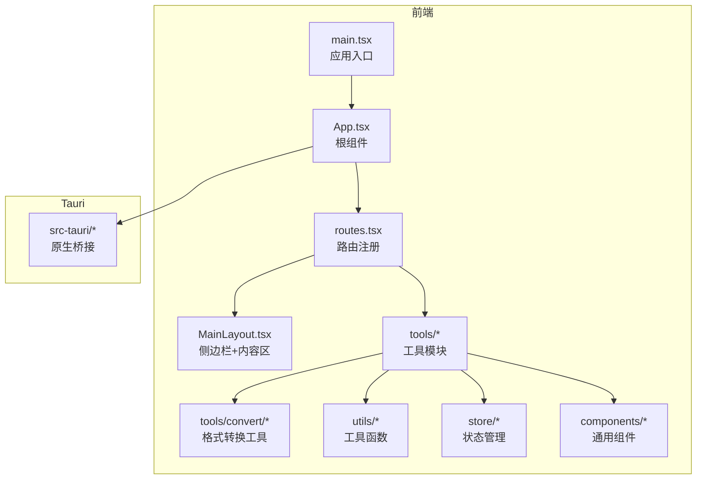
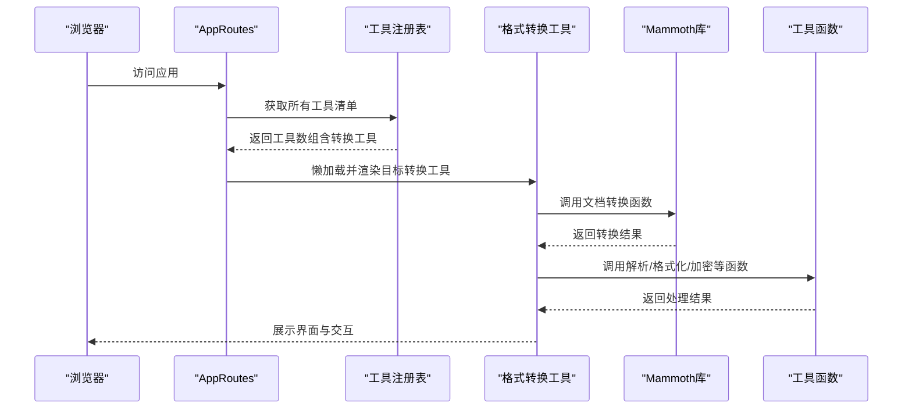
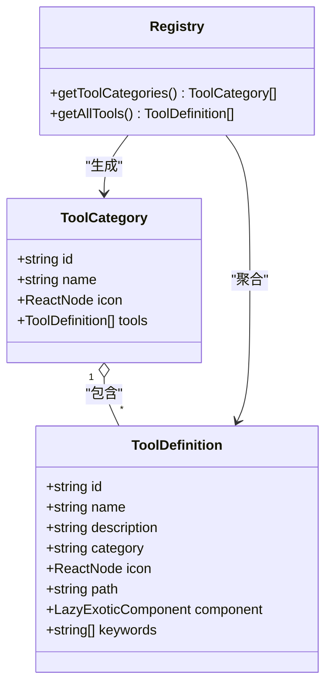
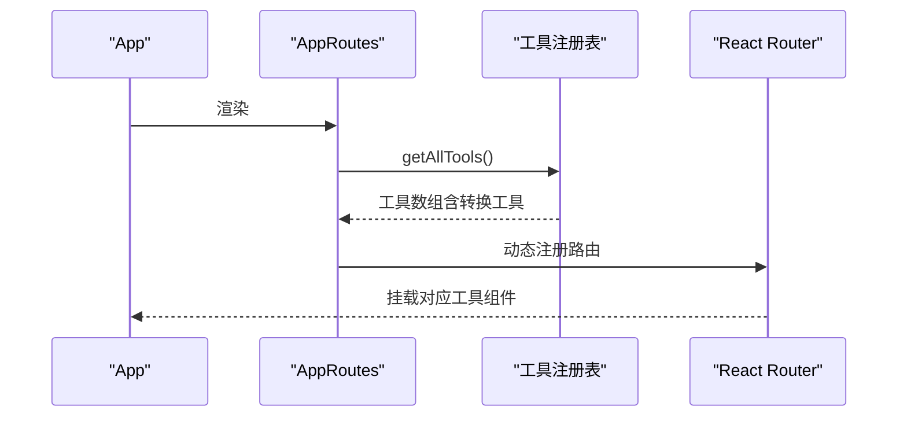
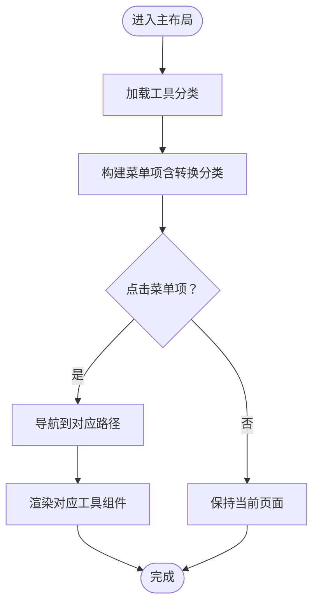
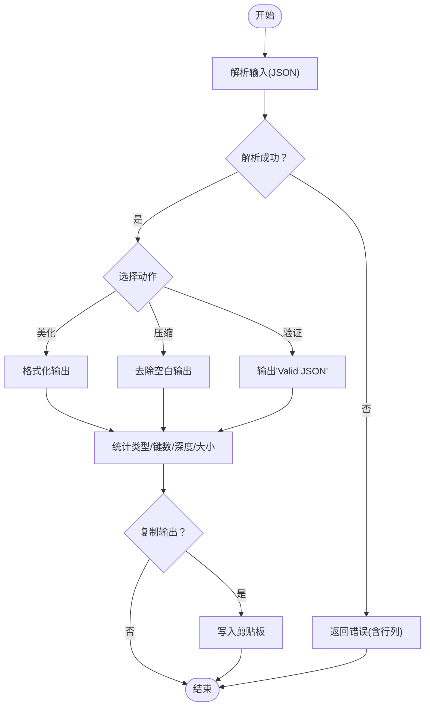
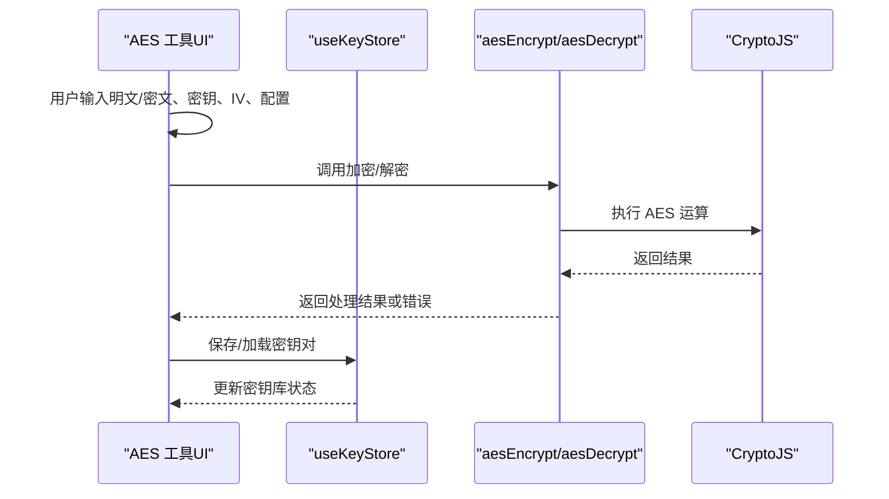
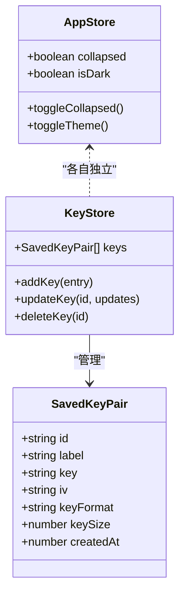
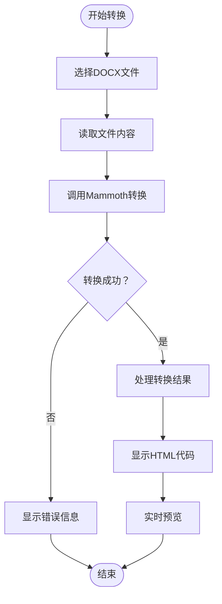
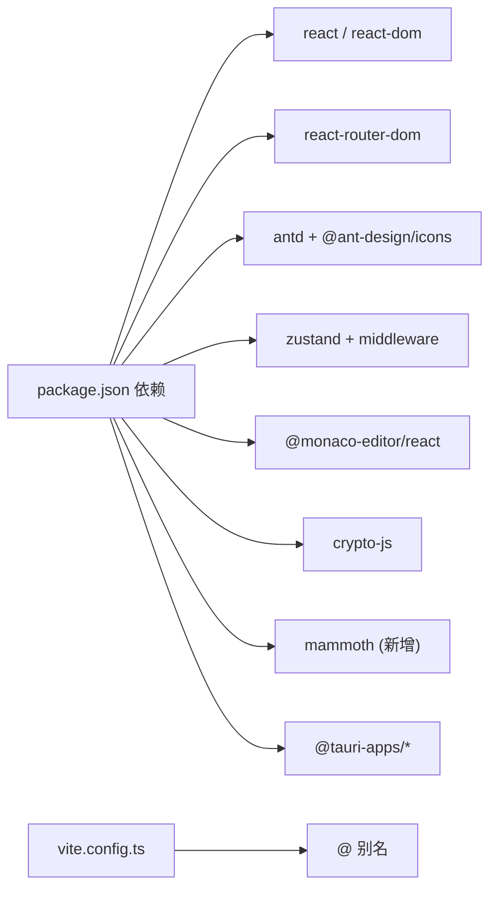

# 开发指南

<cite>
**本文引用的文件**
- [package.json](file://package.json)
- [vite.config.ts](file://vite.config.ts)
- [src/main.tsx](file://src/main.tsx)
- [src/App.tsx](file://src/App.tsx)
- [src/routes.tsx](file://src/routes.tsx)
- [src/layouts/MainLayout.tsx](file://src/layouts/MainLayout.tsx)
- [src/tools/registry.ts](file://src/tools/registry.ts)
- [src/tools/types.ts](file://src/tools/types.ts)
- [src/tools/json/index.tsx](file://src/tools/json/index.tsx)
- [src/tools/crypto/index.tsx](file://src/tools/crypto/index.tsx)
- [src/tools/crypto/AesCrypto/index.tsx](file://src/tools/crypto/AesCrypto/index.tsx)
- [src/tools/convert/DocxToHtml/index.tsx](file://src/tools/convert/DocxToHtml/index.tsx)
- [src/tools/convert/index.tsx](file://src/tools/convert/index.tsx)
- [src/utils/docx.ts](file://src/utils/docx.ts)
- [src/utils/json.ts](file://src/utils/json.ts)
- [src/utils/crypto.ts](file://src/utils/crypto.ts)
- [src/store/useAppStore.ts](file://src/store/useAppStore.ts)
- [src/store/useKeyStore.ts](file://src/store/useKeyStore.ts)
- [src/components/CodeEditor/index.tsx](file://src/components/CodeEditor/index.tsx)
- [src/constants/changelog.ts](file://src/constants/changelog.ts)
</cite>

## 更新摘要
**变更内容**
- 新增格式转换工具开发指南章节
- 添加DocxToHtml组件开发规范和最佳实践
- 增加Mammoth库集成和文档转换工具的详细说明
- 补充工具注册流程和分类体系的扩展说明

## 目录
1. [简介](#简介)
2. [项目结构](#项目结构)
3. [核心组件](#核心组件)
4. [架构总览](#架构总览)
5. [详细组件分析](#详细组件分析)
6. [格式转换工具开发](#格式转换工具开发)
7. [依赖分析](#依赖分析)
8. [性能考虑](#性能考虑)
9. [故障排查指南](#故障排查指南)
10. [结论](#结论)
11. [附录](#附录)

## 简介
本开发指南面向希望为 XKUtil 新增工具与功能的开发者，覆盖从工具开发规范、注册表集成、组件设计模式到调试测试、性能优化、版本管理与发布流程的完整实践路径。文档同时提供可操作的最佳实践、常见问题解决方案与代码级参考路径，帮助快速上手并高质量交付。**新增**格式转换工具开发指南，涵盖DocxToHtml组件开发、Mammoth库集成等新功能。

## 项目结构
XKUtil 采用前端单页应用与 Tauri 桌面桥接的混合架构，核心目录组织如下：
- src：前端源码
  - components：通用 UI 组件（如代码编辑器）
  - layouts：页面布局（主侧边栏导航）
  - store：状态管理（应用设置、密钥库）
  - styles：全局样式与主题
  - tools：工具模块（按类别划分，统一注册）
    - convert：格式转换工具（新增）
  - utils：纯函数工具（JSON、加密、文档转换等）
  - 入口：main.tsx、App.tsx、routes.tsx
- src-tauri：Tauri 应用桥接层（CLI、能力配置、平台原生能力）
- 根目录：构建脚本、依赖声明、Vite 配置

**图表来源**
- [src/main.tsx:1-11](file://src/main.tsx#L1-L11)
- [src/App.tsx:1-24](file://src/App.tsx#L1-L24)
- [src/routes.tsx:1-29](file://src/routes.tsx#L1-L29)
- [src/layouts/MainLayout.tsx:1-168](file://src/layouts/MainLayout.tsx#L1-L168)
- [src/tools/registry.ts:1-47](file://src/tools/registry.ts#L1-L47)
- [src/utils/json.ts:1-116](file://src/utils/json.ts#L1-L116)
- [src/utils/crypto.ts:1-222](file://src/utils/crypto.ts#L1-L222)
- [src/store/useAppStore.ts:1-24](file://src/store/useAppStore.ts#L1-L24)
- [src/store/useKeyStore.ts:1-47](file://src/store/useKeyStore.ts#L1-L47)
- [src/components/CodeEditor/index.tsx:1-57](file://src/components/CodeEditor/index.tsx#L1-L57)

**章节来源**
- [src/main.tsx:1-11](file://src/main.tsx#L1-L11)
- [src/App.tsx:1-24](file://src/App.tsx#L1-L24)
- [src/routes.tsx:1-29](file://src/routes.tsx#L1-L29)
- [src/layouts/MainLayout.tsx:1-168](file://src/layouts/MainLayout.tsx#L1-L168)

## 核心组件
- 路由系统：动态从注册表读取工具清单，按路径懒加载组件，支持回退到首个工具。
- 主布局：左侧分类菜单，右侧内容区；支持主题切换与版本更新日志弹窗。
- 工具注册表：聚合各工具包导出的工具定义，生成分类列表，**新增**convert分类支持。
- 状态管理：应用设置（折叠/主题）与密钥库持久化存储。
- 通用组件：代码编辑器基于 Monaco，自动适配主题与语言。

**章节来源**
- [src/routes.tsx:1-29](file://src/routes.tsx#L1-L29)
- [src/layouts/MainLayout.tsx:1-168](file://src/layouts/MainLayout.tsx#L1-L168)
- [src/tools/registry.ts:1-47](file://src/tools/registry.ts#L1-L47)
- [src/store/useAppStore.ts:1-24](file://src/store/useAppStore.ts#L1-L24)
- [src/store/useKeyStore.ts:1-47](file://src/store/useKeyStore.ts#L1-L47)
- [src/components/CodeEditor/index.tsx:1-57](file://src/components/CodeEditor/index.tsx#L1-L57)

## 架构总览
XKUtil 的运行时架构由"前端路由 + 动态注册 + 懒加载 + 状态持久化 + 通用组件"构成，工具通过注册表集中管理，路由按需加载，工具内部可复用通用组件与工具函数。**新增**格式转换工具支持，通过Mammoth库实现文档格式转换。

**图表来源**
- [src/routes.tsx:1-29](file://src/routes.tsx#L1-L29)
- [src/tools/registry.ts:1-47](file://src/tools/registry.ts#L1-L47)
- [src/utils/json.ts:1-116](file://src/utils/json.ts#L1-L116)
- [src/utils/crypto.ts:1-222](file://src/utils/crypto.ts#L1-L222)
- [src/utils/docx.ts:1-48](file://src/utils/docx.ts#L1-L48)

## 详细组件分析

### 工具注册与分类体系
- 注册表负责聚合各工具包导出的工具定义，并按分类生成分类列表，提供"获取全部工具"和"获取分类"的查询接口。
- 分类名映射为中文，便于 UI 展示，**新增**convert分类支持格式转换工具。
- 工具定义包含：标识、名称、描述、分类、图标、路由路径、组件（懒加载）、关键词等字段。

**图表来源**
- [src/tools/types.ts:1-20](file://src/tools/types.ts#L1-L20)
- [src/tools/registry.ts:1-47](file://src/tools/registry.ts#L1-L47)

**章节来源**
- [src/tools/types.ts:1-20](file://src/tools/types.ts#L1-L20)
- [src/tools/registry.ts:1-47](file://src/tools/registry.ts#L1-L47)

### 路由与动态加载
- 路由在挂载时从注册表读取工具清单，为每个工具生成路由项，使用 Suspense 提供加载占位。
- 未匹配路径重定向至第一个工具路径，保证默认入口稳定。

**图表来源**
- [src/App.tsx:1-24](file://src/App.tsx#L1-L24)
- [src/routes.tsx:1-29](file://src/routes.tsx#L1-L29)
- [src/tools/registry.ts:1-47](file://src/tools/registry.ts#L1-L47)

**章节来源**
- [src/App.tsx:1-24](file://src/App.tsx#L1-L24)
- [src/routes.tsx:1-29](file://src/routes.tsx#L1-L29)

### 主布局与菜单
- 主布局包含侧边栏菜单（按分类展开），顶部工具栏按钮（折叠/主题切换），底部版本号点击打开更新日志。
- 菜单项点击直接跳转到对应工具路径，实现无刷新导航。

**图表来源**
- [src/layouts/MainLayout.tsx:1-168](file://src/layouts/MainLayout.tsx#L1-L168)
- [src/tools/registry.ts:1-47](file://src/tools/registry.ts#L1-L47)

**章节来源**
- [src/layouts/MainLayout.tsx:1-168](file://src/layouts/MainLayout.tsx#L1-L168)

### JSON 工具链
- JSON 工具提供"美化、压缩、验证"三大能力，配合统计信息与剪贴板交互。
- 使用 CodeEditor 作为输入输出容器，支持语言高亮与只读模式切换。
- 解析错误携带行列位置信息，提升用户定位问题效率。

**图表来源**
- [src/tools/json/index.tsx:1-27](file://src/tools/json/index.tsx#L1-L27)
- [src/utils/json.ts:1-116](file://src/utils/json.ts#L1-L116)
- [src/components/CodeEditor/index.tsx:1-57](file://src/components/CodeEditor/index.tsx#L1-L57)

**章节来源**
- [src/tools/json/index.tsx:1-27](file://src/tools/json/index.tsx#L1-L27)
- [src/utils/json.ts:1-116](file://src/utils/json.ts#L1-L116)
- [src/components/CodeEditor/index.tsx:1-57](file://src/components/CodeEditor/index.tsx#L1-L57)

### AES 加解密工具
- 支持多种模式、填充、输出格式与密钥长度；提供暴力破解（遍历密钥库尝试解密）。
- 内置密钥库持久化，支持保存、加载、编辑与删除密钥对。
- 通过状态管理与工具函数协作，实现安全可靠的加解密体验。

**图表来源**
- [src/tools/crypto/AesCrypto/index.tsx:1-310](file://src/tools/crypto/AesCrypto/index.tsx#L1-L310)
- [src/store/useKeyStore.ts:1-47](file://src/store/useKeyStore.ts#L1-L47)
- [src/utils/crypto.ts:1-222](file://src/utils/crypto.ts#L1-L222)

**章节来源**
- [src/tools/crypto/AesCrypto/index.tsx:1-310](file://src/tools/crypto/AesCrypto/index.tsx#L1-L310)
- [src/store/useKeyStore.ts:1-47](file://src/store/useKeyStore.ts#L1-L47)
- [src/utils/crypto.ts:1-222](file://src/utils/crypto.ts#L1-L222)

### 状态管理与持久化
- 应用设置（折叠/主题）与密钥库均使用 Zustand + persist 实现本地持久化。
- 设置项命名清晰，避免跨模块耦合，便于扩展与维护。

**图表来源**
- [src/store/useAppStore.ts:1-24](file://src/store/useAppStore.ts#L1-L24)
- [src/store/useKeyStore.ts:1-47](file://src/store/useKeyStore.ts#L1-L47)

**章节来源**
- [src/store/useAppStore.ts:1-24](file://src/store/useAppStore.ts#L1-L24)
- [src/store/useKeyStore.ts:1-47](file://src/store/useKeyStore.ts#L1-L47)

## 格式转换工具开发

### DocxToHtml组件开发规范
- **文件结构**：位于 `src/tools/convert/DocxToHtml/index.tsx`，采用函数组件模式，使用React Hooks管理状态。
- **功能特性**：
  - 支持选择Word文档(.docx)文件
  - 使用Mammoth库进行文档转换
  - 提供HTML代码编辑器和实时预览
  - 支持复制、下载、清空等操作
  - 错误处理和警告信息展示

**图表来源**
- [src/tools/convert/DocxToHtml/index.tsx:32-72](file://src/tools/convert/DocxToHtml/index.tsx#L32-L72)
- [src/utils/docx.ts:11-47](file://src/utils/docx.ts#L11-L47)

### Mammoth库集成与文档转换
- **库集成**：通过npm安装mammoth库，版本1.12.0，支持Node.js 12+。
- **转换实现**：使用`mammoth.convertToHtml()`方法进行文档转换，自定义图片处理逻辑。
- **结果处理**：
  - 清理空的img标签
  - 提取警告信息
  - 统计图片数量
  - 错误处理和降级方案

**章节来源**
- [src/tools/convert/DocxToHtml/index.tsx:1-228](file://src/tools/convert/DocxToHtml/index.tsx#L1-L228)
- [src/tools/convert/index.tsx:1-17](file://src/tools/convert/index.tsx#L1-L17)
- [src/utils/docx.ts:1-48](file://src/utils/docx.ts#L1-L48)
- [package.json:22](file://package.json#L22)

### 工具注册流程扩展
- **工具定义**：在`src/tools/convert/index.tsx`中定义DocxToHtml工具，指定分类为"convert"。
- **注册集成**：在`src/tools/registry.ts`中导入convertTools并合并到allTools数组。
- **分类映射**：在getCategoryName函数中添加"convert"到"格式转换"的映射。

**章节来源**
- [src/tools/convert/index.tsx:1-17](file://src/tools/convert/index.tsx#L1-L17)
- [src/tools/registry.ts:1-47](file://src/tools/registry.ts#L1-L47)

### Tauri插件集成
- **文件选择**：使用`@tauri-apps/plugin-dialog`的open方法选择文件。
- **文件读取**：使用`@tauri-apps/plugin-fs`的readFile方法读取文件内容。
- **文件保存**：使用writeTextFile方法保存HTML文件。
- **权限配置**：在Tauri配置中启用必要的文件系统权限。

**章节来源**
- [src/tools/convert/DocxToHtml/index.tsx:17-18](file://src/tools/convert/DocxToHtml/index.tsx#L17-L18)

## 依赖分析
- 前端框架与生态：React、React Router、Ant Design、Zustand、Monaco Editor。
- 加解密：crypto-js。
- **新增**文档转换：mammoth（1.12.0），用于DOCX到HTML转换。
- Tauri：桌面桥接、插件（剪贴板、对话框、文件系统）。
- 构建：Vite + React 插件，支持别名与热更新。

**图表来源**
- [package.json:1-40](file://package.json#L1-L40)
- [vite.config.ts:1-31](file://vite.config.ts#L1-L31)

**章节来源**
- [package.json:1-40](file://package.json#L1-L40)
- [vite.config.ts:1-31](file://vite.config.ts#L1-L31)

## 性能考虑
- 懒加载与按需渲染：工具组件通过 lazy 与 Suspense 实现首屏优化，减少初始包体。
- 状态分层：应用设置与密钥库分离，避免无关状态影响渲染。
- 编辑器优化：关闭 minimap、启用自动布局与行高亮，兼顾可读性与性能。
- 工具函数纯函数化：JSON/加密/文档转换逻辑无副作用，便于缓存与测试。
- **新增**转换性能：Mammoth库异步处理，避免阻塞主线程；图片转换采用占位符减少DOM复杂度。
- 资源隔离：Vite 忽略 src-tauri 目录监听，避免不必要的文件系统扫描。

**章节来源**
- [src/routes.tsx:1-29](file://src/routes.tsx#L1-L29)
- [src/components/CodeEditor/index.tsx:1-57](file://src/components/CodeEditor/index.tsx#L1-L57)
- [src/utils/docx.ts:11-47](file://src/utils/docx.ts#L11-L47)
- [vite.config.ts:1-31](file://vite.config.ts#L1-L31)

## 故障排查指南
- 路由不生效或空白页
  - 检查工具是否正确注册到注册表，路径与组件是否一致。
  - 确认路由 Suspense 占位与回退逻辑。
- 加密/解密失败
  - 校验密钥与 IV 长度与格式（Hex/UTF-8），确认模式与填充配置。
  - 使用暴力破解辅助定位密钥库中的匹配项。
- **新增**文档转换问题
  - 检查Mammoth库版本兼容性，确保Node.js版本满足要求。
  - 验证DOCX文件格式有效性，某些复杂格式可能转换失败。
  - 确认Tauri文件系统权限配置，避免文件读取失败。
- 剪贴板读写异常
  - 浏览器权限与 HTTPS 环境要求；捕获异常并提示用户。
- 主题不生效
  - 检查 ConfigProvider 主题注入与 CodeEditor 主题适配逻辑。
- 版本更新日志不显示
  - 确认常量与弹窗触发逻辑，检查 Modal 宽度与滚动区域。

**章节来源**
- [src/tools/registry.ts:1-47](file://src/tools/registry.ts#L1-L47)
- [src/routes.tsx:1-29](file://src/routes.tsx#L1-L29)
- [src/utils/crypto.ts:1-222](file://src/utils/crypto.ts#L1-L222)
- [src/tools/crypto/AesCrypto/index.tsx:1-310](file://src/tools/crypto/AesCrypto/index.tsx#L1-L310)
- [src/components/CodeEditor/index.tsx:1-57](file://src/components/CodeEditor/index.tsx#L1-L57)
- [src/constants/changelog.ts:1-34](file://src/constants/changelog.ts#L1-L34)
- [src/utils/docx.ts:11-47](file://src/utils/docx.ts#L11-L47)

## 结论
XKUtil 以"注册表 + 懒加载 + 纯函数工具 + 状态持久化"为核心设计，既保证了工具扩展的灵活性，也确保了用户体验与性能。**新增**格式转换工具开发指南为开发者提供了完整的DocxToHtml组件开发规范、Mammoth库集成方案和工具注册流程。遵循本文档的开发规范与最佳实践，可高效地新增高质量工具并维持长期可维护性。

## 附录

### 新工具开发流程（从零到一）
- 创建工具目录与组件
  - 在 tools/<category>/ 下新建子目录，实现工具组件与必要 UI。
  - 参考现有工具的结构与命名约定，**新增**格式转换工具可参考DocxToHtml组件模式。
- 定义工具元数据
  - 在 tools/<category>/index.tsx 中导出 ToolDefinition 数组，包含 id、name、description、category、icon、path、component、keywords 等。
  - **新增**convert分类工具需在getCategoryName中添加中文映射。
- 注册工具
  - 将新工具加入对应工具包导出集合（如 jsonTools、cryptoTools 或 convertTools）。
  - 在 registry.ts 中导入并合并到 allTools。
- 路由接入
  - 不需手动添加路由，AppRoutes 会自动从注册表读取并生成路由。
- 状态与持久化
  - 如需持久化，使用 Zustand + persist，避免跨模块强耦合。
- 通用组件复用
  - 优先使用 CodeEditor、Ant Design 组件，保持一致性。
- **新增**文档转换工具开发
  - 引入mammoth库进行文档格式转换
  - 实现异步转换函数和错误处理
  - 集成Tauri文件系统插件进行文件读写
- 测试与调试
  - 单元测试：针对工具函数（parseJson、aesEncrypt/aesDecrypt、convertDocxToHtml）编写断言。
  - 集成测试：在路由中验证组件渲染与交互。
  - 调试技巧：利用浏览器 DevTools、React DevTools Profiler、Vite HMR。
- 文档与变更
  - 更新更新日志与工具描述，确保用户可见。

**章节来源**
- [src/tools/json/index.tsx:1-27](file://src/tools/json/index.tsx#L1-L27)
- [src/tools/crypto/index.tsx:1-17](file://src/tools/crypto/index.tsx#L1-L17)
- [src/tools/convert/index.tsx:1-17](file://src/tools/convert/index.tsx#L1-L17)
- [src/tools/registry.ts:1-47](file://src/tools/registry.ts#L1-L47)
- [src/routes.tsx:1-29](file://src/routes.tsx#L1-L29)
- [src/store/useKeyStore.ts:1-47](file://src/store/useKeyStore.ts#L1-L47)
- [src/components/CodeEditor/index.tsx:1-57](file://src/components/CodeEditor/index.tsx#L1-L57)
- [src/utils/docx.ts:1-48](file://src/utils/docx.ts#L1-L48)

### 调试与测试方法
- 开发环境调试
  - Vite HMR：修改代码即时生效；通过环境变量控制主机与端口。
  - React DevTools：定位组件层级与状态变化。
  - 浏览器 Network：观察懒加载资源与请求。
- 单元测试
  - JSON 工具：断言 parseJson 的错误位置、formatJson 的排序与缩进、compressJson 的体积。
  - 加密工具：断言 aesEncrypt/aesDecrypt 的长度校验、模式/填充/输出格式组合、暴力破解命中率。
  - **新增**文档转换工具：断言convertDocxToHtml的转换结果、错误处理、图片统计准确性。
- 性能优化
  - 按需加载与分割代码块；避免在渲染路径中执行重型计算。
  - 对频繁调用的回调使用 useCallback/useState 合理拆分状态。
  - **新增**异步处理：确保Mammoth转换不会阻塞UI线程。

**章节来源**
- [vite.config.ts:1-31](file://vite.config.ts#L1-L31)
- [src/utils/json.ts:1-116](file://src/utils/json.ts#L1-L116)
- [src/utils/crypto.ts:1-222](file://src/utils/crypto.ts#L1-L222)
- [src/utils/docx.ts:1-48](file://src/utils/docx.ts#L1-L48)

### 代码结构与命名约定
- 文件命名：工具目录使用名词短语（如 JsonFormatter、DocxToHtml），组件文件使用 PascalCase（index.tsx）。
- 类型定义：统一在 types.ts 中声明，避免分散。
- 路由路径：使用前缀区分工具类别（如 /json/*、/crypto/*、/convert/*）。
- 组件导出：默认导出工具组件，命名导出工具定义集合（如 jsonTools、convertTools）。
- 状态命名：useXStore 形式，职责单一，避免跨域污染。
- **新增**工具分类：convert分类专门用于格式转换工具，遵循统一的开发模式。

**章节来源**
- [src/tools/types.ts:1-20](file://src/tools/types.ts#L1-L20)
- [src/tools/json/index.tsx:1-27](file://src/tools/json/index.tsx#L1-L27)
- [src/tools/crypto/index.tsx:1-17](file://src/tools/crypto/index.tsx#L1-L17)
- [src/tools/convert/index.tsx:1-17](file://src/tools/convert/index.tsx#L1-L17)

### 贡献指南与代码审查标准
- 提交规范
  - 使用清晰的提交信息，描述变更目的与范围。
- 代码审查
  - 关注点：可读性、可测试性、性能影响、安全性（尤其是加密相关）、**新增**文档转换的错误处理。
  - 通过性：最小化变更、充分测试、文档同步更新。
- 版本与发布
  - 版本号：遵循语义化版本；更新 CHANGELOG。
  - 发布流程：本地构建预览 -> 自动化测试 -> 提交 PR -> 合并 -> 打标签 -> 产物发布。

**章节来源**
- [src/constants/changelog.ts:1-34](file://src/constants/changelog.ts#L1-L34)
- [package.json:1-40](file://package.json#L1-L40)

### 版本管理与发布流程
- 版本号与变更记录：在常量中维护版本与变更历史，发布时同步更新。
- 构建与预览：使用 Vite 脚本进行开发与预览；Tauri CLI 用于桌面端打包。
- 发布策略：根据功能与修复选择主/次/补丁版本，确保向后兼容性。
- **新增**格式转换工具发布：确保mammoth库版本兼容性和文档转换功能稳定性。

**章节来源**
- [src/constants/changelog.ts:1-34](file://src/constants/changelog.ts#L1-L34)
- [package.json:1-40](file://package.json#L1-L40)
- [vite.config.ts:1-31](file://vite.config.ts#L1-L31)