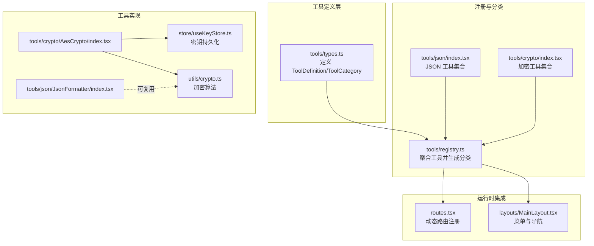
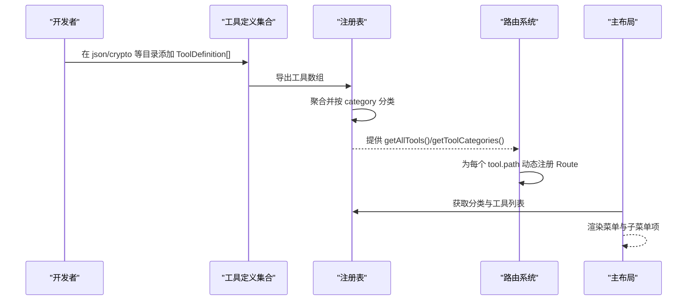
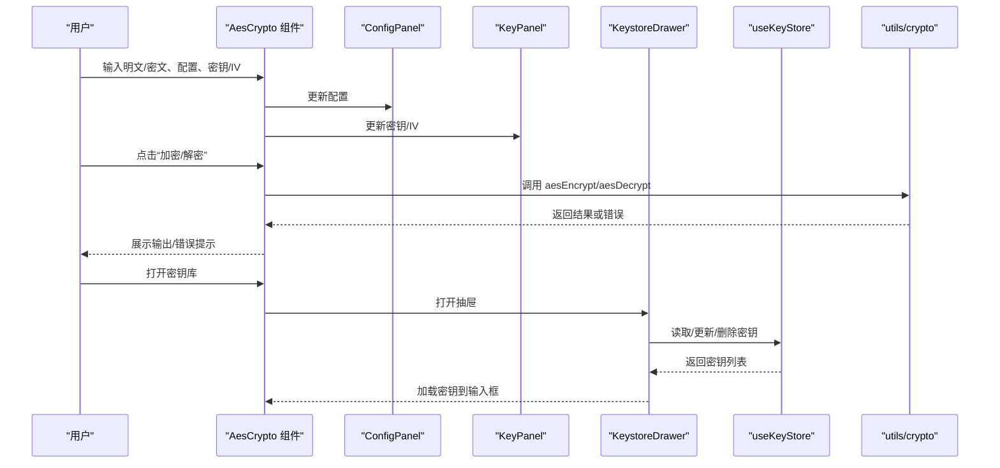
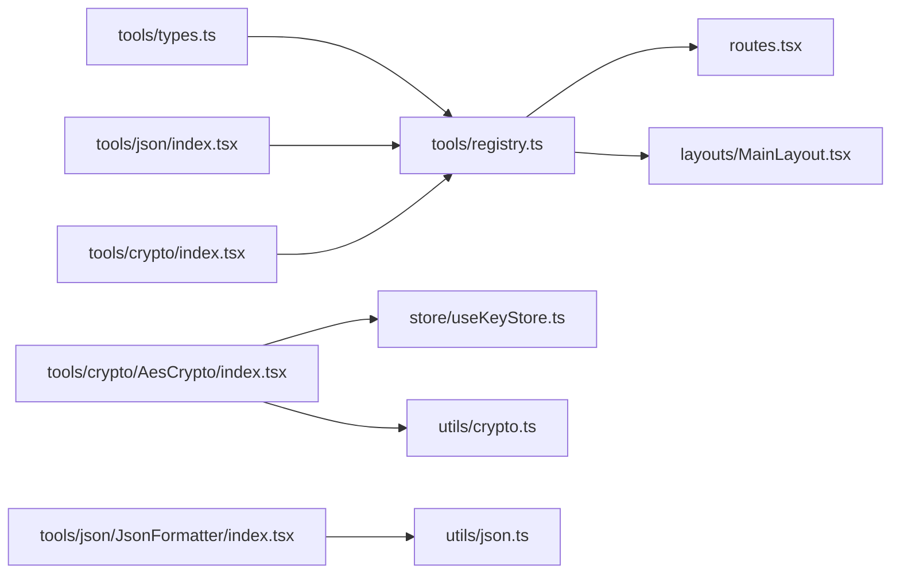

# 新工具开发

<cite>
**本文引用的文件**
- [src/tools/types.ts](file://src/tools/types.ts)
- [src/tools/registry.ts](file://src/tools/registry.ts)
- [src/tools/json/index.tsx](file://src/tools/json/index.tsx)
- [src/tools/crypto/index.tsx](file://src/tools/crypto/index.tsx)
- [src/routes.tsx](file://src/routes.tsx)
- [src/layouts/MainLayout.tsx](file://src/layouts/MainLayout.tsx)
- [src/tools/crypto/AesCrypto/index.tsx](file://src/tools/crypto/AesCrypto/index.tsx)
- [src/tools/crypto/AesCrypto/ConfigPanel.tsx](file://src/tools/crypto/AesCrypto/ConfigPanel.tsx)
- [src/tools/crypto/AesCrypto/KeyPanel.tsx](file://src/tools/crypto/AesCrypto/KeyPanel.tsx)
- [src/tools/crypto/AesCrypto/KeystoreDrawer.tsx](file://src/tools/crypto/AesCrypto/KeystoreDrawer.tsx)
- [src/store/useKeyStore.ts](file://src/store/useKeyStore.ts)
- [src/utils/crypto.ts](file://src/utils/crypto.ts)
- [src/utils/json.ts](file://src/utils/json.ts)
- [package.json](file://package.json)
</cite>

## 目录
1. [简介](#简介)
2. [项目结构](#项目结构)
3. [核心组件](#核心组件)
4. [架构总览](#架构总览)
5. [详细组件分析](#详细组件分析)
6. [依赖关系分析](#依赖关系分析)
7. [性能考虑](#性能考虑)
8. [故障排查指南](#故障排查指南)
9. [结论](#结论)
10. [附录：新工具开发模板与规范](#附录新工具开发模板与规范)

## 简介
本指南面向希望在现有系统中新增“工具”的开发者，覆盖从接口规范、注册表集成、组件设计模式到生命周期与状态传递的全流程。文档基于仓库中的工具体系进行深入解析，并提供可直接套用的模板与最佳实践，确保新工具与现有系统保持一致的架构风格与用户体验。

## 项目结构
工具系统采用“按功能域分目录 + 注册表聚合 + 路由动态注入”的组织方式：
- 工具定义与类型：位于 tools/types.ts
- 工具注册与分类：位于 tools/registry.ts
- 具体工具集合：位于 tools/json 与 tools/crypto 下
- 路由与菜单：通过注册表动态生成，位于 routes.tsx 与 layouts/MainLayout.tsx
- 工具组件：以 React 组件形式存在，部分工具包含子组件与状态管理模块

图表来源
- [src/tools/types.ts:1-20](file://src/tools/types.ts#L1-L20)
- [src/tools/registry.ts:1-39](file://src/tools/registry.ts#L1-L39)
- [src/tools/json/index.tsx:1-27](file://src/tools/json/index.tsx#L1-L27)
- [src/tools/crypto/index.tsx:1-17](file://src/tools/crypto/index.tsx#L1-L17)
- [src/routes.tsx:1-29](file://src/routes.tsx#L1-L29)
- [src/layouts/MainLayout.tsx:1-168](file://src/layouts/MainLayout.tsx#L1-L168)
- [src/tools/crypto/AesCrypto/index.tsx:1-310](file://src/tools/crypto/AesCrypto/index.tsx#L1-L310)
- [src/store/useKeyStore.ts:1-47](file://src/store/useKeyStore.ts#L1-L47)
- [src/utils/crypto.ts:1-222](file://src/utils/crypto.ts#L1-L222)

章节来源
- [src/tools/types.ts:1-20](file://src/tools/types.ts#L1-L20)
- [src/tools/registry.ts:1-39](file://src/tools/registry.ts#L1-L39)
- [src/tools/json/index.tsx:1-27](file://src/tools/json/index.tsx#L1-L27)
- [src/tools/crypto/index.tsx:1-17](file://src/tools/crypto/index.tsx#L1-L17)
- [src/routes.tsx:1-29](file://src/routes.tsx#L1-L29)
- [src/layouts/MainLayout.tsx:1-168](file://src/layouts/MainLayout.tsx#L1-L168)

## 核心组件
- 工具定义接口 ToolDefinition：用于描述单个工具的元数据与实现入口
- 工具分类接口 ToolCategory：用于将多个工具按类别聚合
- 注册表函数：将分散的工具集合统一为分类列表与全量列表
- 动态路由与菜单：根据注册表生成路由与侧边菜单项

章节来源
- [src/tools/types.ts:3-19](file://src/tools/types.ts#L3-L19)
- [src/tools/registry.ts:7-38](file://src/tools/registry.ts#L7-L38)

## 架构总览
工具系统遵循“声明式定义 + 运行时装配”的模式：
- 开发者在各功能域目录下声明工具数组
- 注册表统一收集并按 category 聚合
- 路由层根据全量工具动态生成页面路由
- 布局层根据分类生成菜单，点击跳转对应路径

图表来源
- [src/tools/registry.ts:5-27](file://src/tools/registry.ts#L5-L27)
- [src/routes.tsx:6-28](file://src/routes.tsx#L6-L28)
- [src/layouts/MainLayout.tsx:29-39](file://src/layouts/MainLayout.tsx#L29-L39)

## 详细组件分析

### 工具接口规范：ToolDefinition 字段详解
- id：工具唯一标识，用于路由与菜单定位
- name：工具名称，用于菜单显示
- description：工具描述，用于提示与搜索
- category：工具分类键，决定归属哪一类
- icon：Ant Design 图标节点，用于菜单图标
- path：工具页面路由路径，需全局唯一
- component：React 组件（懒加载），作为页面主体
- keywords：可选，用于搜索增强

章节来源
- [src/tools/types.ts:3-12](file://src/tools/types.ts#L3-L12)

### 工具分类系统：category 与 icon 的工作原理
- category 决定工具归类与菜单分组
- 注册表会将相同 category 的工具聚合为 ToolCategory，并复用首个工具的 icon 作为分类图标
- 主布局读取分类列表，生成带子菜单的导航

章节来源
- [src/tools/registry.ts:7-23](file://src/tools/registry.ts#L7-L23)
- [src/layouts/MainLayout.tsx:31-39](file://src/layouts/MainLayout.tsx#L31-L39)

### 动态路由与菜单集成
- 路由层调用注册表获取全量工具，为每个工具生成一个独立路由
- 未命中任何路由时自动跳转到第一个工具的路径
- 主布局调用注册表生成菜单，点击即跳转至对应 path

章节来源
- [src/routes.tsx:6-28](file://src/routes.tsx#L6-L28)
- [src/layouts/MainLayout.tsx:29-43](file://src/layouts/MainLayout.tsx#L29-L43)

### AES 工具组件：生命周期与状态传递范式
AES 工具展示了完整的组件生命周期与状态管理模式：
- 状态初始化：配置、密钥、IV、输入输出、错误与提示信息
- 用户交互：加密、解密、暴力破解、复制输出、清空
- 子组件协作：ConfigPanel 负责配置变更；KeyPanel 负责密钥/IV 输入与生成；KeystoreDrawer 负责密钥库管理
- 状态持久化：密钥库使用 Zustand + persist 持久化存储
- 算法封装：加密/解密逻辑集中在 utils/crypto.ts 中，便于复用与测试

图表来源
- [src/tools/crypto/AesCrypto/index.tsx:33-309](file://src/tools/crypto/AesCrypto/index.tsx#L33-L309)
- [src/tools/crypto/AesCrypto/ConfigPanel.tsx:39-94](file://src/tools/crypto/AesCrypto/ConfigPanel.tsx#L39-L94)
- [src/tools/crypto/AesCrypto/KeyPanel.tsx:23-113](file://src/tools/crypto/AesCrypto/KeyPanel.tsx#L23-L113)
- [src/tools/crypto/AesCrypto/KeystoreDrawer.tsx:26-184](file://src/tools/crypto/AesCrypto/KeystoreDrawer.tsx#L26-L184)
- [src/store/useKeyStore.ts:22-46](file://src/store/useKeyStore.ts#L22-L46)
- [src/utils/crypto.ts:59-162](file://src/utils/crypto.ts#L59-L162)

章节来源
- [src/tools/crypto/AesCrypto/index.tsx:33-309](file://src/tools/crypto/AesCrypto/index.tsx#L33-L309)
- [src/tools/crypto/AesCrypto/ConfigPanel.tsx:39-94](file://src/tools/crypto/AesCrypto/ConfigPanel.tsx#L39-L94)
- [src/tools/crypto/AesCrypto/KeyPanel.tsx:23-113](file://src/tools/crypto/AesCrypto/KeyPanel.tsx#L23-L113)
- [src/tools/crypto/AesCrypto/KeystoreDrawer.tsx:26-184](file://src/tools/crypto/AesCrypto/KeystoreDrawer.tsx#L26-L184)
- [src/store/useKeyStore.ts:22-46](file://src/store/useKeyStore.ts#L22-L46)
- [src/utils/crypto.ts:59-162](file://src/utils/crypto.ts#L59-L162)

### JSON 工具：简洁实现范式
- 使用 CodeEditor 作为输入输出容器
- 通过 utils/json.ts 提供解析、格式化、压缩与统计能力
- 通过 Ant Design 组件组合实现操作按钮与提示信息

章节来源
- [src/tools/json/JsonFormatter/index.tsx:45-266](file://src/tools/json/JsonFormatter/index.tsx#L45-L266)
- [src/utils/json.ts:14-116](file://src/utils/json.ts#L14-L116)

### 工具注册表与分类聚合
- 将来自不同域的工具数组合并为全量工具列表
- 依据 category 构建分类映射，首次出现时写入分类名与图标，后续同类工具追加到 tools 数组
- 提供分类列表与全量列表两个访问入口

章节来源
- [src/tools/registry.ts:5-38](file://src/tools/registry.ts#L5-L38)

## 依赖关系分析
- 工具定义依赖 Ant Design 图标与 React 类型
- 注册表依赖具体工具集合导出
- 路由与布局依赖注册表提供的工具与分类
- 工具组件依赖自身业务工具库与状态管理

图表来源
- [src/tools/types.ts:1-20](file://src/tools/types.ts#L1-L20)
- [src/tools/registry.ts:1-39](file://src/tools/registry.ts#L1-L39)
- [src/tools/json/index.tsx:1-27](file://src/tools/json/index.tsx#L1-L27)
- [src/tools/crypto/index.tsx:1-17](file://src/tools/crypto/index.tsx#L1-L17)
- [src/routes.tsx:1-29](file://src/routes.tsx#L1-L29)
- [src/layouts/MainLayout.tsx:1-168](file://src/layouts/MainLayout.tsx#L1-L168)
- [src/tools/crypto/AesCrypto/index.tsx:1-310](file://src/tools/crypto/AesCrypto/index.tsx#L1-L310)
- [src/store/useKeyStore.ts:1-47](file://src/store/useKeyStore.ts#L1-L47)
- [src/utils/crypto.ts:1-222](file://src/utils/crypto.ts#L1-L222)
- [src/utils/json.ts:1-116](file://src/utils/json.ts#L1-L116)

章节来源
- [package.json:12-25](file://package.json#L12-L25)

## 性能考虑
- 组件懒加载：工具页面通过 React.lazy 按需加载，减少首屏体积
- 菜单与路由按需生成：仅在渲染时计算一次分类与路由，避免重复遍历
- 状态持久化：密钥库使用持久化存储，避免频繁重新输入
- 算法封装：加密/解密逻辑集中于工具库，便于优化与缓存

## 故障排查指南
- 路由不生效：检查工具的 path 是否唯一且与注册表一致
- 菜单不显示：确认 category 是否存在于注册表的分类映射中
- 组件空白：确认 component 是懒加载组件并正确导入
- 状态异常：检查 Zustand 持久化命名是否冲突，以及 key 格式与长度是否符合要求
- 加密/解密报错：核对密钥/IV 长度与格式，以及输出格式与模式配置

章节来源
- [src/routes.tsx:18-24](file://src/routes.tsx#L18-L24)
- [src/layouts/MainLayout.tsx:31-39](file://src/layouts/MainLayout.tsx#L31-L39)
- [src/tools/crypto/AesCrypto/index.tsx:55-112](file://src/tools/crypto/AesCrypto/index.tsx#L55-L112)
- [src/utils/crypto.ts:64-105](file://src/utils/crypto.ts#L64-L105)
- [src/utils/crypto.ts:112-162](file://src/utils/crypto.ts#L112-L162)

## 结论
该工具系统以清晰的接口定义、可扩展的注册表与动态路由为核心，辅以组件化与状态持久化的最佳实践，能够高效地支撑新工具的快速接入与维护。遵循本文模板与规范，即可在不破坏现有架构的前提下，稳定地交付高质量工具。

## 附录：新工具开发模板与规范

### 一、创建工具定义
- 在对应功能域目录（如 tools/mydomain）创建工具定义数组，参考现有 JSON 与加密工具的写法
- 字段填写要点
  - id：全局唯一，建议使用短横线分隔的英文标识
  - name：简短易懂的中文名称
  - description：简要说明用途与特性
  - category：选择已有分类键或新增分类键
  - icon：使用 Ant Design 图标组件
  - path：以斜杠开头的唯一路径，与 id 保持语义关联
  - component：使用 React.lazy 包裹组件导入
  - keywords：补充关键词，提升可发现性

章节来源
- [src/tools/json/index.tsx:5-26](file://src/tools/json/index.tsx#L5-L26)
- [src/tools/crypto/index.tsx:5-16](file://src/tools/crypto/index.tsx#L5-L16)

### 二、注册工具到系统
- 将新工具数组导出并在注册表中引入
- 确保注册表导出 getAllTools 与 getToolCategories
- 如需新增分类，可在注册表中扩展分类名称映射

章节来源
- [src/tools/registry.ts:1-6](file://src/tools/registry.ts#L1-L6)
- [src/tools/registry.ts:29-38](file://src/tools/registry.ts#L29-L38)

### 三、创建工具组件
- 组件职责单一，聚焦于工具的输入、处理与输出
- 合理拆分子组件（如配置面板、参数面板、抽屉等）
- 使用 Ant Design 组件与图标，保持一致的交互体验
- 对外暴露必要的事件回调（如 onXXX），内部状态尽量局部化

章节来源
- [src/tools/crypto/AesCrypto/ConfigPanel.tsx:39-94](file://src/tools/crypto/AesCrypto/ConfigPanel.tsx#L39-L94)
- [src/tools/crypto/AesCrypto/KeyPanel.tsx:23-113](file://src/tools/crypto/AesCrypto/KeyPanel.tsx#L23-L113)
- [src/tools/crypto/AesCrypto/KeystoreDrawer.tsx:26-184](file://src/tools/crypto/AesCrypto/KeystoreDrawer.tsx#L26-L184)

### 四、集成路由与菜单
- 不需要手动在路由文件中添加新路由，注册表会自动生成
- 确保工具的 path 与菜单项 key 一致，以便点击导航

章节来源
- [src/routes.tsx:18-20](file://src/routes.tsx#L18-L20)
- [src/layouts/MainLayout.tsx:35-42](file://src/layouts/MainLayout.tsx#L35-L42)

### 五、状态管理与持久化
- 对于需要跨页面保留的状态（如密钥库），使用 Zustand 并启用持久化
- 明确状态边界，避免过度共享导致的耦合

章节来源
- [src/store/useKeyStore.ts:22-46](file://src/store/useKeyStore.ts#L22-L46)

### 六、算法与工具库
- 将可复用的算法封装到 utils 目录，提供明确的输入输出与错误处理
- 在组件中只负责 UI 与交互，不直接处理复杂逻辑

章节来源
- [src/utils/crypto.ts:59-162](file://src/utils/crypto.ts#L59-L162)
- [src/utils/json.ts:14-116](file://src/utils/json.ts#L14-L116)

### 七、生命周期与状态传递
- 组件内状态初始化在挂载时完成
- 通过 props 与回调向下/向上传递状态
- 对外部依赖（如剪贴板、对话框）使用异步处理与错误提示

章节来源
- [src/tools/crypto/AesCrypto/index.tsx:33-129](file://src/tools/crypto/AesCrypto/index.tsx#L33-L129)

### 八、兼容性与一致性
- 遵循 Ant Design 设计语言与图标规范
- 路由与菜单的 key/路径保持一致
- 工具描述与关键词有助于搜索与可发现性

章节来源
- [src/tools/types.ts:3-12](file://src/tools/types.ts#L3-L12)
- [src/tools/json/index.tsx:14-14](file://src/tools/json/index.tsx#L14-L14)
- [src/tools/crypto/index.tsx:14-14](file://src/tools/crypto/index.tsx#L14-L14)