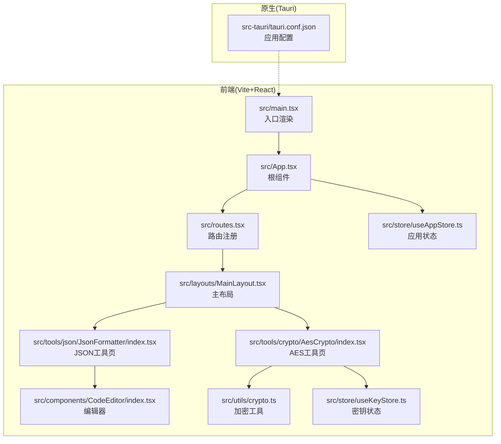
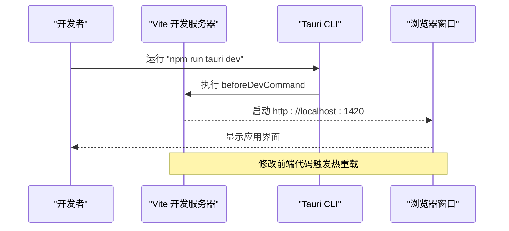
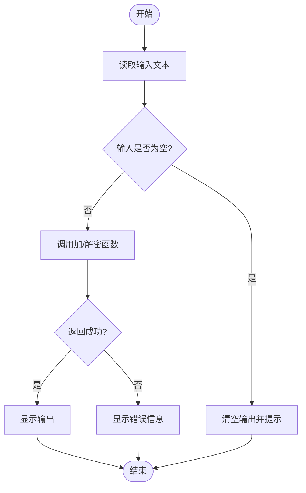
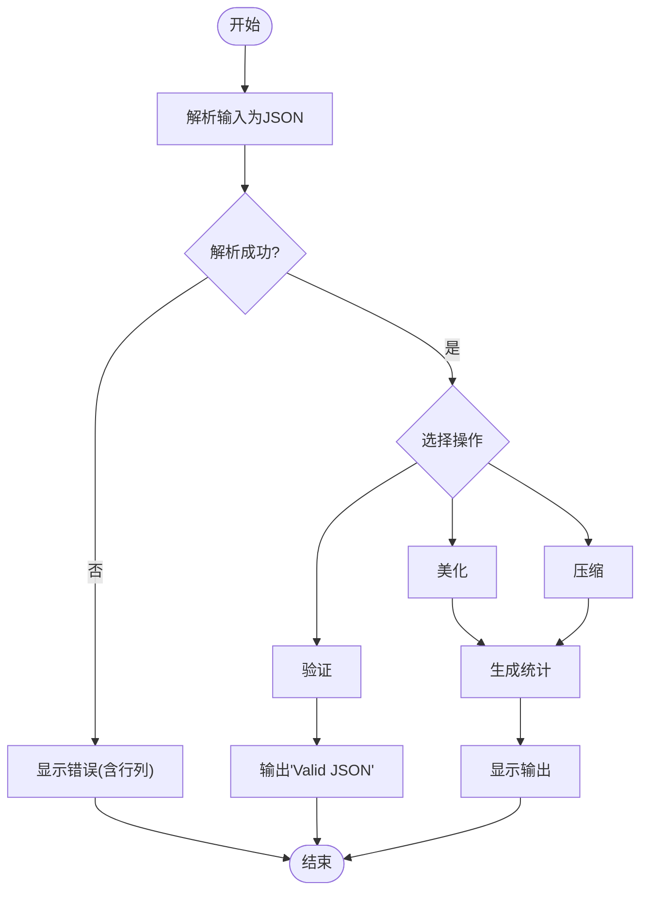
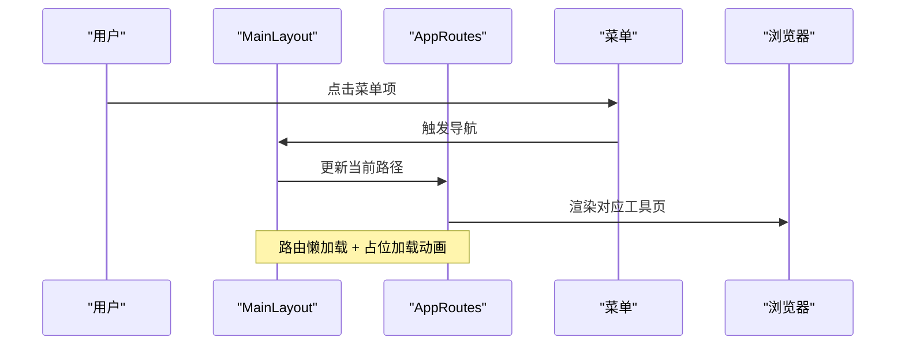
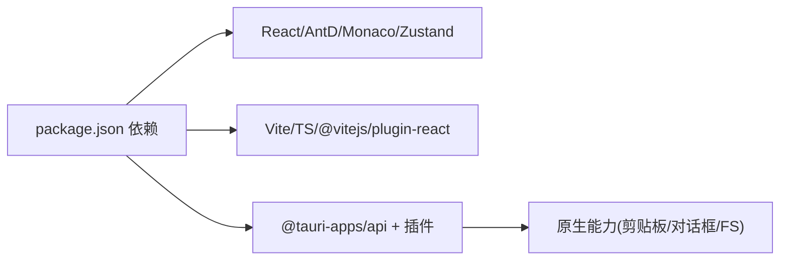

# 调试与测试

<cite>
**本文引用的文件**
- [package.json](file://package.json)
- [vite.config.ts](file://vite.config.ts)
- [tauri.conf.json](file://src-tauri/tauri.conf.json)
- [main.tsx](file://src/main.tsx)
- [App.tsx](file://src/App.tsx)
- [MainLayout.tsx](file://src/layouts/MainLayout.tsx)
- [routes.tsx](file://src/routes.tsx)
- [useAppStore.ts](file://src/store/useAppStore.ts)
- [useKeyStore.ts](file://src/store/useKeyStore.ts)
- [crypto.ts](file://src/utils/crypto.ts)
- [AesCrypto/index.tsx](file://src/tools/crypto/AesCrypto/index.tsx)
- [JsonFormatter/index.tsx](file://src/tools/json/JsonFormatter/index.tsx)
- [CodeEditor/index.tsx](file://src/components/CodeEditor/index.tsx)
</cite>

## 目录
1. [简介](#简介)
2. [项目结构](#项目结构)
3. [核心组件](#核心组件)
4. [架构总览](#架构总览)
5. [详细组件分析](#详细组件分析)
6. [依赖分析](#依赖分析)
7. [性能考虑](#性能考虑)
8. [故障排除指南](#故障排除指南)
9. [结论](#结论)
10. [附录](#附录)

## 简介
本指南面向XKUtil项目的开发者与测试工程师，提供从开发环境到端到端测试的完整调试与测试方法论。内容覆盖：
- Vite热重载与跨设备联调配置
- React DevTools与浏览器开发者工具调试
- 断点调试Tauri原生代码与前端代码
- 单元测试与组件测试最佳实践（Jest/Vitest + React Testing Library）
- 集成测试策略（含Tauri API调用）
- 性能测试与内存泄漏检测
- 常见问题与排障

## 项目结构
XKUtil采用Vite + React + Tauri架构，前端通过Vite开发服务器运行，Tauri负责打包与系统能力访问。关键目录与职责如下：
- src：前端源码，包含布局、路由、状态管理、工具模块与通用组件
- src-tauri：Tauri原生侧配置与构建脚本，包含应用窗口、安全策略与打包图标等
- 构建与脚本：通过package.json中的脚本驱动开发与构建流程

**图表来源**
- [main.tsx:1-11](file://src/main.tsx#L1-L11)
- [App.tsx:1-24](file://src/App.tsx#L1-L24)
- [routes.tsx:1-29](file://src/routes.tsx#L1-L29)
- [MainLayout.tsx:1-168](file://src/layouts/MainLayout.tsx#L1-L168)
- [CodeEditor/index.tsx:1-57](file://src/components/CodeEditor/index.tsx#L1-L57)
- [crypto.ts:1-222](file://src/utils/crypto.ts#L1-L222)
- [useAppStore.ts:1-24](file://src/store/useAppStore.ts#L1-L24)
- [useKeyStore.ts:1-47](file://src/store/useKeyStore.ts#L1-L47)
- [AesCrypto/index.tsx:1-310](file://src/tools/crypto/AesCrypto/index.tsx#L1-L310)
- [JsonFormatter/index.tsx:1-267](file://src/tools/json/JsonFormatter/index.tsx#L1-L267)
- [tauri.conf.json:1-39](file://src-tauri/tauri.conf.json#L1-L39)

**章节来源**
- [package.json:1-36](file://package.json#L1-L36)
- [vite.config.ts:1-31](file://vite.config.ts#L1-L31)
- [tauri.conf.json:1-39](file://src-tauri/tauri.conf.json#L1-L39)

## 核心组件
- 应用入口与根组件：负责渲染与主题配置
- 主布局：侧边菜单、头部操作、版本弹窗
- 路由系统：动态注册工具页
- 状态管理：Zustand应用设置与密钥存储
- 工具页：AES加解密与JSON格式化/压缩/校验
- 编辑器：基于Monaco的代码编辑器

**章节来源**
- [main.tsx:1-11](file://src/main.tsx#L1-L11)
- [App.tsx:1-24](file://src/App.tsx#L1-L24)
- [MainLayout.tsx:1-168](file://src/layouts/MainLayout.tsx#L1-L168)
- [routes.tsx:1-29](file://src/routes.tsx#L1-L29)
- [useAppStore.ts:1-24](file://src/store/useAppStore.ts#L1-L24)
- [useKeyStore.ts:1-47](file://src/store/useKeyStore.ts#L1-L47)
- [AesCrypto/index.tsx:1-310](file://src/tools/crypto/AesCrypto/index.tsx#L1-L310)
- [JsonFormatter/index.tsx:1-267](file://src/tools/json/JsonFormatter/index.tsx#L1-L267)
- [CodeEditor/index.tsx:1-57](file://src/components/CodeEditor/index.tsx#L1-L57)

## 架构总览
前端通过Vite提供开发服务器，Tauri在启动前执行前端开发脚本，实现“前端热重载 + 原生窗口”的一体化开发体验。

**图表来源**
- [package.json:6-11](file://package.json#L6-L11)
- [vite.config.ts:15-29](file://vite.config.ts#L15-L29)
- [tauri.conf.json:5-10](file://src-tauri/tauri.conf.json#L5-L10)

## 详细组件分析

### AES工具组件调试要点
- 关键交互：配置面板、密钥面板、暴力破解、复制/清空
- 数据流：输入文本 → 加/解密函数 → 输出展示 → 可选复制
- 状态：本地useState与Zustand密钥存储联动
- 边界：密钥/IV长度校验、输出格式选择、错误提示

**图表来源**
- [AesCrypto/index.tsx:55-112](file://src/tools/crypto/AesCrypto/index.tsx#L55-L112)
- [crypto.ts:59-162](file://src/utils/crypto.ts#L59-L162)

**章节来源**
- [AesCrypto/index.tsx:1-310](file://src/tools/crypto/AesCrypto/index.tsx#L1-L310)
- [crypto.ts:1-222](file://src/utils/crypto.ts#L1-L222)
- [useKeyStore.ts:1-47](file://src/store/useKeyStore.ts#L1-L47)

### JSON工具组件调试要点
- 功能：美化、压缩、验证、统计、复制/粘贴
- 数据流：输入JSON → 解析 → 格式化/压缩/验证 → 统计信息 → 输出
- 交互：缩进选项、按键排序、粘贴/复制、清空

**图表来源**
- [JsonFormatter/index.tsx:53-130](file://src/tools/json/JsonFormatter/index.tsx#L53-L130)

**章节来源**
- [JsonFormatter/index.tsx:1-267](file://src/tools/json/JsonFormatter/index.tsx#L1-L267)

### 主布局与路由调试要点
- 菜单导航：根据工具分类与工具项生成菜单，点击跳转
- 布局切换：折叠/展开侧边栏、切换主题
- 版本弹窗：展示更新日志时间线

**图表来源**
- [MainLayout.tsx:41-43](file://src/layouts/MainLayout.tsx#L41-L43)
- [routes.tsx:6-28](file://src/routes.tsx#L6-L28)

**章节来源**
- [MainLayout.tsx:1-168](file://src/layouts/MainLayout.tsx#L1-L168)
- [routes.tsx:1-29](file://src/routes.tsx#L1-L29)

## 依赖分析
- 前端依赖：React、Ant Design、Zustand、Monaco Editor、React Router等
- 开发依赖：Vite、@vitejs/plugin-react、TypeScript
- Tauri依赖：@tauri-apps/api、各插件（剪贴板、对话框、文件系统）

**图表来源**
- [package.json:12-34](file://package.json#L12-L34)

**章节来源**
- [package.json:1-36](file://package.json#L1-L36)

## 性能考虑
- 前端性能
  - 使用Splitter与受控编辑器避免不必要的重渲染
  - 将计算型逻辑（如JSON统计）延迟到解析成功后再执行
  - 合理使用消息提示与告警，减少重复渲染
- 原生侧性能
  - 仅在必要时调用系统能力（如剪贴板），避免频繁IO
  - 对大文本处理采用分块或异步方式，避免阻塞UI线程

[本节为通用指导，无需特定文件引用]

## 故障排除指南
- 热重载无效
  - 检查Vite服务端口与主机绑定配置
  - 确认未监听原生目录导致的文件变更风暴
- 跨设备联调失败
  - 设置环境变量以启用WebSocket热重载
- Tauri开发模式无法访问前端
  - 确认beforeDevCommand与devUrl一致
- AES/JSON功能异常
  - 校验密钥/IV长度与格式
  - 检查输出格式与解密算法参数一致性
- 剪贴板/对话框无响应
  - 确认Tauri权限与插件已正确声明

**章节来源**
- [vite.config.ts:5-29](file://vite.config.ts#L5-L29)
- [tauri.conf.json:5-10](file://src-tauri/tauri.conf.json#L5-L10)
- [AesCrypto/index.tsx:55-112](file://src/tools/crypto/AesCrypto/index.tsx#L55-L112)
- [JsonFormatter/index.tsx:105-130](file://src/tools/json/JsonFormatter/index.tsx#L105-L130)
- [package.json:12-25](file://package.json#L12-L25)

## 结论
通过合理的开发环境配置、清晰的组件边界与完善的调试策略，XKUtil能够在前端与原生侧协同高效开发。建议在日常开发中结合热重载、React DevTools与浏览器开发者工具进行快速迭代，并在关键路径补充单元与组件测试，确保功能稳定与可维护性。

[本节为总结，无需特定文件引用]

## 附录

### 开发环境调试技巧
- Vite热重载与跨设备联调
  - 在宿主机上设置环境变量以启用WebSocket热重载
  - 避免监听原生目录，防止文件变更风暴
- React DevTools
  - 安装React DevTools扩展，定位组件树与状态变化
  - 使用Profiler分析渲染性能热点
- 浏览器开发者工具
  - Network检查资源加载与跨域策略
  - Console观察错误堆栈与警告
  - Elements/Styles调试UI布局与主题

**章节来源**
- [vite.config.ts:5-29](file://vite.config.ts#L5-L29)
- [App.tsx:10-21](file://src/App.tsx#L10-L21)

### 断点调试：前端与Tauri原生
- 前端断点
  - 在组件事件回调与工具函数中设置断点
  - 使用React DevTools的Sources面板逐步执行
- Tauri原生断点
  - 使用Rust IDE（如VS Code + rust-analyzer）附加调试
  - 在Tauri命令处理函数与系统能力调用处设置断点
  - 注意：开发模式下需确保原生侧与前端端口一致

**章节来源**
- [tauri.conf.json:5-10](file://src-tauri/tauri.conf.json#L5-L10)

### 单元测试与组件测试最佳实践
- Jest/Vitest配置建议
  - 使用Vitest作为默认测试运行器，兼容Jest语法
  - 配置别名映射与React相关环境
- 单元测试
  - 覆盖加密/解密边界条件（长度、格式、输出格式）
  - 覆盖JSON解析/格式化/压缩/统计的错误分支
- 组件测试
  - 使用React Testing Library断言UI行为
  - 模拟用户交互（点击、输入、粘贴），断言状态与输出
  - 使用Mock拦截系统能力（如剪贴板），隔离外部依赖

**章节来源**
- [crypto.ts:59-162](file://src/utils/crypto.ts#L59-L162)
- [JsonFormatter/index.tsx:53-130](file://src/tools/json/JsonFormatter/index.tsx#L53-L130)

### 集成测试策略（含Tauri API）
- 场景设计
  - 前端调用Tauri API（如读写剪贴板、打开对话框）
  - 验证原生能力返回值与前端状态同步
- 方法
  - 使用Mock或Fake实现原生API，保证测试可重复
  - 在真实窗口中运行端到端测试，验证交互链路
- 注意
  - 避免在测试中实际触发系统级动作，优先使用模拟

[本节为通用指导，无需特定文件引用]

### 性能测试与内存泄漏检测
- 性能测试
  - 使用浏览器性能面板记录长列表渲染与大文本处理
  - 使用React Profiler测量组件渲染次数与耗时
- 内存泄漏检测
  - 使用浏览器内存面板快照对比，定位未释放对象
  - 检查事件监听器、定时器与全局状态订阅是否清理

[本节为通用指导，无需特定文件引用]