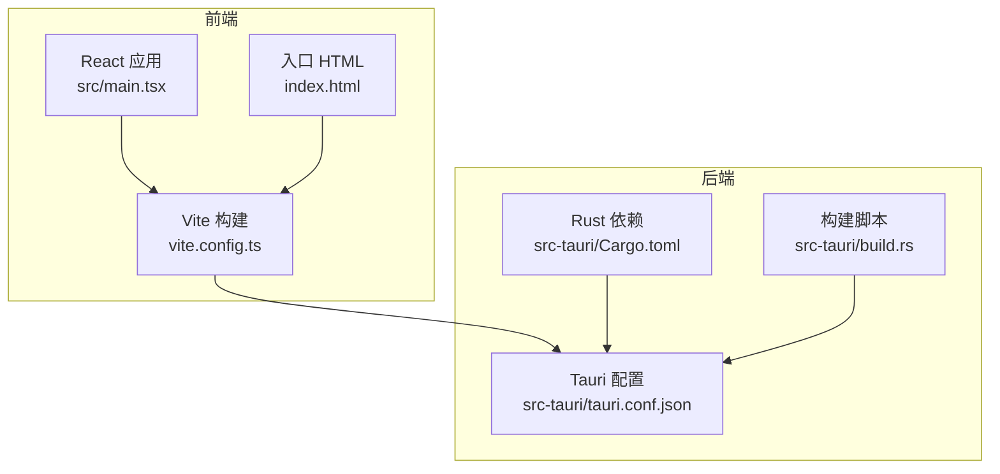
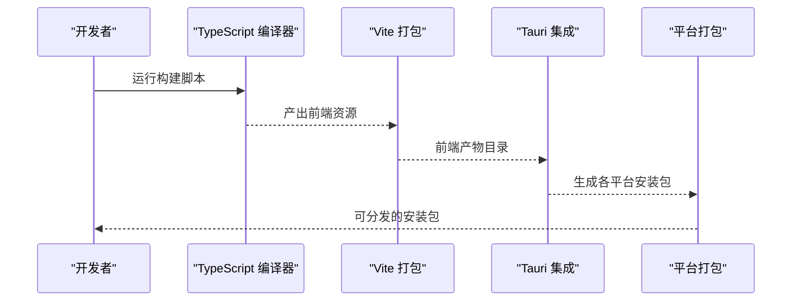
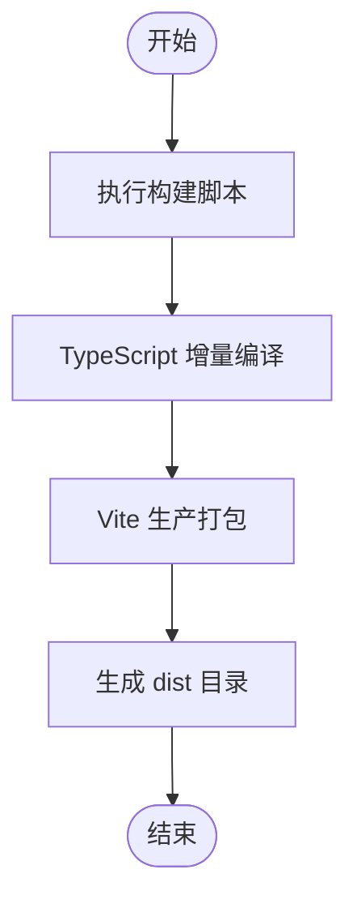
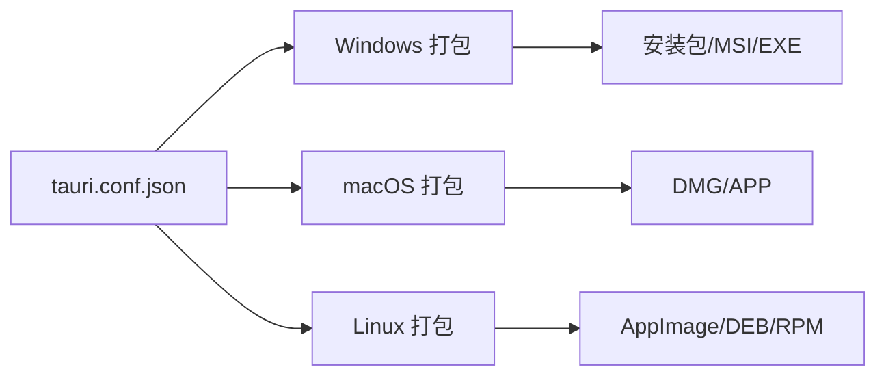
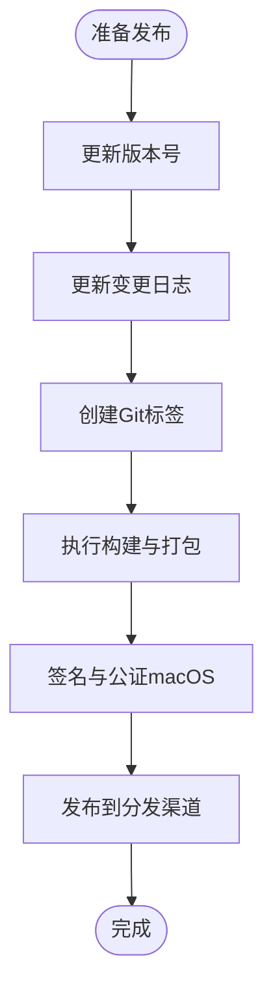
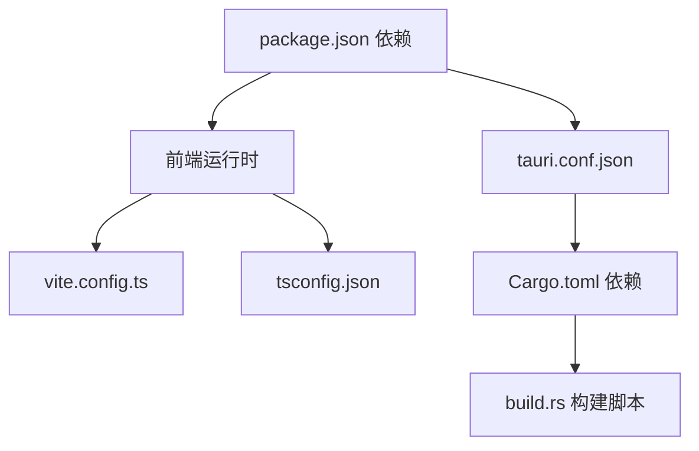

# 部署与发布

<cite>
**本文引用的文件**
- [package.json](file://package.json)
- [vite.config.ts](file://vite.config.ts)
- [tsconfig.json](file://tsconfig.json)
- [src-tauri/tauri.conf.json](file://src-tauri/tauri.conf.json)
- [src-tauri/Cargo.toml](file://src-tauri/Cargo.toml)
- [src-tauri/build.rs](file://src-tauri/build.rs)
- [src/constants/changelog.ts](file://src/constants/changelog.ts)
- [index.html](file://index.html)
- [src/main.tsx](file://src/main.tsx)
</cite>

## 目录
1. [简介](#简介)
2. [项目结构](#项目结构)
3. [核心组件](#核心组件)
4. [架构总览](#架构总览)
5. [详细组件分析](#详细组件分析)
6. [依赖关系分析](#依赖关系分析)
7. [性能考虑](#性能考虑)
8. [故障排查指南](#故障排查指南)
9. [结论](#结论)
10. [附录](#附录)

## 简介
本指南面向XKUtil项目的部署与发布，覆盖生产构建流程、Vite构建配置与资源优化、代码分割策略、Tauri跨平台打包（Windows/macOS/Linux）、CI/CD流水线建议、应用签名与公证（macOS）、版本管理策略（语义化版本、变更日志、发布标签）、发布前检查清单与质量保障、常见问题与回滚策略。

## 项目结构
XKUtil采用前端React + Vite + TypeScript，后端逻辑通过Tauri桥接到Rust（src-tauri）。前端产物由Vite生成，Tauri在构建阶段集成前端产物为原生应用包。

**图表来源**
- [src/main.tsx:1-11](file://src/main.tsx#L1-L11)
- [vite.config.ts:1-31](file://vite.config.ts#L1-L31)
- [index.html:1-13](file://index.html#L1-L13)
- [src-tauri/tauri.conf.json:1-39](file://src-tauri/tauri.conf.json#L1-L39)
- [src-tauri/Cargo.toml:1-23](file://src-tauri/Cargo.toml#L1-L23)
- [src-tauri/build.rs:1-4](file://src-tauri/build.rs#L1-L4)

**章节来源**
- [package.json:1-36](file://package.json#L1-L36)
- [vite.config.ts:1-31](file://vite.config.ts#L1-L31)
- [tsconfig.json:1-26](file://tsconfig.json#L1-L26)
- [src-tauri/tauri.conf.json:1-39](file://src-tauri/tauri.conf.json#L1-L39)
- [src-tauri/Cargo.toml:1-23](file://src-tauri/Cargo.toml#L1-L23)
- [src-tauri/build.rs:1-4](file://src-tauri/build.rs#L1-L4)
- [index.html:1-13](file://index.html#L1-L13)
- [src/main.tsx:1-11](file://src/main.tsx#L1-L11)

## 核心组件
- 前端构建与开发服务器：Vite配置启用React插件、路径别名、开发服务器端口与热更新、忽略src-tauri目录监听。
- 应用入口与路由：React根节点挂载到index.html的#root，页面标题在HTML中定义。
- Tauri应用配置：产品名称、版本、窗口尺寸与最小尺寸、安全策略、打包目标与图标集合。
- Rust后端：Tauri 2、常用插件（剪贴板、对话框、文件系统），构建脚本调用tauri_build。

**章节来源**
- [vite.config.ts:1-31](file://vite.config.ts#L1-L31)
- [index.html:1-13](file://index.html#L1-L13)
- [src-tauri/tauri.conf.json:1-39](file://src-tauri/tauri.conf.json#L1-L39)
- [src-tauri/Cargo.toml:1-23](file://src-tauri/Cargo.toml#L1-L23)
- [src-tauri/build.rs:1-4](file://src-tauri/build.rs#L1-L4)

## 架构总览
下图展示从源码到可执行应用的关键步骤：TypeScript编译、Vite打包、Tauri集成、平台打包。

**图表来源**
- [package.json:6-11](file://package.json#L6-L11)
- [vite.config.ts:1-31](file://vite.config.ts#L1-L31)
- [src-tauri/tauri.conf.json:5-10](file://src-tauri/tauri.conf.json#L5-L10)

## 详细组件分析

### 生产构建流程与Vite配置
- 脚本命令
  - dev：启动开发服务器
  - build：先执行TypeScript增量构建，再执行Vite生产打包
  - preview：预览生产包
  - tauri：调用Tauri CLI
- Vite配置要点
  - 插件：React插件
  - 别名：@ 指向 src
  - 清屏关闭，便于CI输出整洁
  - 服务器：固定端口、严格端口、可选宿主地址用于远程调试
  - HMR：可按宿主参数启用WebSocket热更新
  - 监听排除：src-tauri目录避免误触发
- TypeScript配置
  - 模块解析：bundler
  - JSX：react-jsx
  - 路径映射：@/*

**图表来源**
- [package.json:6-11](file://package.json#L6-L11)
- [vite.config.ts:1-31](file://vite.config.ts#L1-L31)
- [tsconfig.json:1-26](file://tsconfig.json#L1-L26)

**章节来源**
- [package.json:6-11](file://package.json#L6-L11)
- [vite.config.ts:1-31](file://vite.config.ts#L1-L31)
- [tsconfig.json:1-26](file://tsconfig.json#L1-L26)

### 资源优化与代码分割策略
- 代码分割
  - Vite默认按需加载模块，结合React路由可实现页面级懒加载与动态导入，减少首屏体积。
  - 对大依赖（如Monaco Editor）建议使用动态导入以降低初始包体。
- 资源优化
  - 启用压缩与Tree-shaking（Vite默认开启）
  - 图标与静态资源放置于public或按需引入，避免无谓打包
  - CSS：按需引入Ant Design样式，避免全量引入
- 产物分析
  - 使用Vite内置分析工具或第三方可视化工具查看包体构成，定位大体积模块

[本节为通用实践说明，不直接分析具体文件，故无“章节来源”]

### Tauri跨平台打包（Windows/macOS/Linux）
- 配置概览
  - 产品名称与版本：与package.json保持一致
  - 开发与构建URL：devUrl指向本地Vite服务
  - 前端产物目录：frontendDist指向dist
  - 窗口属性：标题、尺寸、最小尺寸、居中
  - 安全策略：CSP设为null（开发期）
  - 打包目标：targets设为all，生成多平台包
  - 图标：包含多分辨率PNG与icns/ico
- 平台差异
  - Windows：注意图标尺寸与权限；确保管理员权限需求明确
  - macOS：需要签名与公证；应用需满足沙盒与权限要求
  - Linux：关注桌面文件与依赖打包；注意不同发行版兼容性

**图表来源**
- [src-tauri/tauri.conf.json:1-39](file://src-tauri/tauri.conf.json#L1-L39)

**章节来源**
- [src-tauri/tauri.conf.json:1-39](file://src-tauri/tauri.conf.json#L1-L39)

### CI/CD流水线设置（建议）
- 触发条件
  - 推送至main分支或打标签时触发
- 步骤建议
  - 安装依赖：npm ci
  - 类型检查与单元测试（如已添加）
  - 构建：npm run build
  - Tauri构建：tauri build（按平台矩阵）
  - 产物归档与上传
  - 发布：GitHub/Gitee Release，附带校验信息
- 注意事项
  - macOS签名与公证在CI中需妥善管理证书与密钥
  - Windows代码签名证书与时间戳服务器配置
  - Linux打包需在对应发行版容器内进行

[本节为通用实践说明，不直接分析具体文件，故无“章节来源”]

### 应用签名与公证（macOS）
- 必要材料
  - Apple Developer ID Application证书
  - Team ID与Apple登录账户
- 流程要点
  - 使用codesign对.app签名
  - 使用notarytool提交公证
  - 通过hardened runtime与必需权限声明
- Tauri侧配置
  - 在tauri.conf.json中配置签名与公证参数（如适用）
  - 确保图标与Info.plist符合要求

[本节为通用实践说明，不直接分析具体文件，故无“章节来源”]

### 版本管理策略
- 语义化版本
  - 主版本号：破坏性变更
  - 次版本号：向下兼容功能
  - 修订号：向下兼容修复
- 变更日志
  - 维护CHANGELOG数组，记录每个版本日期与变更点
  - 发布前更新版本号与日期
- 发布标签
  - Git标签与发布说明同步，便于溯源

**图表来源**
- [src/constants/changelog.ts:1-34](file://src/constants/changelog.ts#L1-L34)
- [package.json:2-4](file://package.json#L2-L4)
- [src-tauri/tauri.conf.json:2-4](file://src-tauri/tauri.conf.json#L2-L4)

**章节来源**
- [src/constants/changelog.ts:1-34](file://src/constants/changelog.ts#L1-L34)
- [package.json:2-4](file://package.json#L2-L4)
- [src-tauri/tauri.conf.json:2-4](file://src-tauri/tauri.conf.json#L2-L4)

### 发布前检查清单与质量保障
- 功能回归
  - 关键功能在Windows/macOS/Linux上验证
- 安全与合规
  - macOS签名与公证完成
  - Windows代码签名有效
- 包体与性能
  - 产物体积与加载时间评估
- 文档与元数据
  - 变更日志、版本号、图标、描述一致性

[本节为通用实践说明，不直接分析具体文件，故无“章节来源”]

### 常见问题与回滚策略
- 问题类型
  - 构建失败：检查Vite与TypeScript配置、依赖版本
  - 打包异常：确认前端产物存在且路径正确
  - macOS签名失败：核对证书、Team ID、权限
- 回滚策略
  - 保留上一版本发布包与Git标签
  - 快速回退到上一稳定版本标签
  - 发布新补丁版本替换问题版本

[本节为通用实践说明，不直接分析具体文件，故无“章节来源”]

## 依赖关系分析
- 前端依赖
  - React、Ant Design、Monaco Editor、Zustand等
  - Vite与React插件
- 后端依赖
  - Tauri 2、常用插件（剪贴板、对话框、文件系统）
  - Rust构建脚本集成
- 关系图

**图表来源**
- [package.json:12-34](file://package.json#L12-L34)
- [vite.config.ts:1-31](file://vite.config.ts#L1-L31)
- [tsconfig.json:1-26](file://tsconfig.json#L1-L26)
- [src-tauri/tauri.conf.json:1-39](file://src-tauri/tauri.conf.json#L1-L39)
- [src-tauri/Cargo.toml:15-23](file://src-tauri/Cargo.toml#L15-L23)
- [src-tauri/build.rs:1-4](file://src-tauri/build.rs#L1-L4)

**章节来源**
- [package.json:12-34](file://package.json#L12-L34)
- [src-tauri/Cargo.toml:15-23](file://src-tauri/Cargo.toml#L15-L23)

## 性能考虑
- 代码分割：按路由与功能模块拆分，配合动态导入
- 资源压缩：启用Vite默认压缩与Tree-shaking
- 静态资源：合理放置与按需引入，避免全量样式
- 首屏优化：延迟加载非关键资源，减少首屏阻塞

[本节为通用实践说明，不直接分析具体文件，故无“章节来源”]

## 故障排查指南
- 构建失败
  - 检查TypeScript与Vite配置是否匹配
  - 确认node_modules完整与版本兼容
- 开发服务器无法热更新
  - 核对host与端口配置，确认HMR参数
- 打包后应用空白
  - 确认frontendDist与实际dist一致
  - 检查index.html与入口脚本路径
- macOS签名/公证失败
  - 核对证书链、Team ID、权限与公证凭据

**章节来源**
- [vite.config.ts:15-29](file://vite.config.ts#L15-L29)
- [src-tauri/tauri.conf.json:5-10](file://src-tauri/tauri.conf.json#L5-L10)
- [index.html:8-10](file://index.html#L8-L10)

## 结论
XKUtil的部署与发布围绕“前端Vite构建 + Tauri原生打包”的模式展开。遵循本文的构建配置、资源优化、跨平台打包、签名公证、版本管理与质量保障流程，可稳定地交付高质量的多平台应用。

## 附录
- 关键文件索引
  - [package.json:1-36](file://package.json#L1-L36)
  - [vite.config.ts:1-31](file://vite.config.ts#L1-L31)
  - [tsconfig.json:1-26](file://tsconfig.json#L1-L26)
  - [src-tauri/tauri.conf.json:1-39](file://src-tauri/tauri.conf.json#L1-L39)
  - [src-tauri/Cargo.toml:1-23](file://src-tauri/Cargo.toml#L1-L23)
  - [src-tauri/build.rs:1-4](file://src-tauri/build.rs#L1-L4)
  - [src/constants/changelog.ts:1-34](file://src/constants/changelog.ts#L1-L34)
  - [index.html:1-13](file://index.html#L1-L13)
  - [src/main.tsx:1-11](file://src/main.tsx#L1-L11)