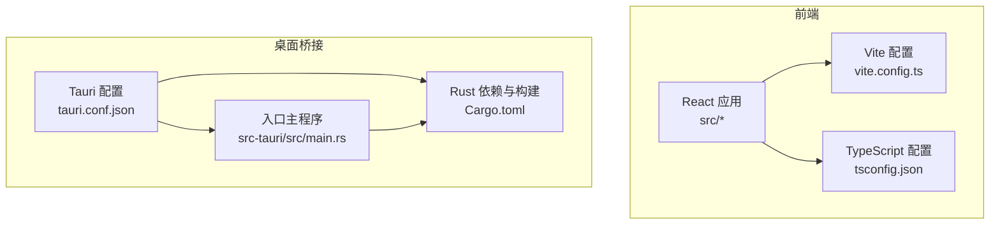
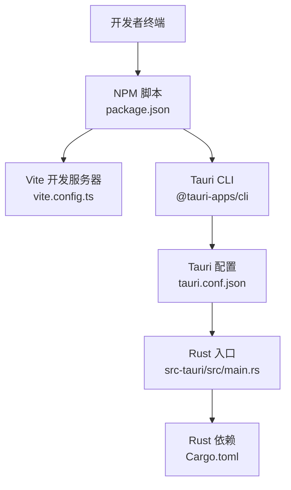
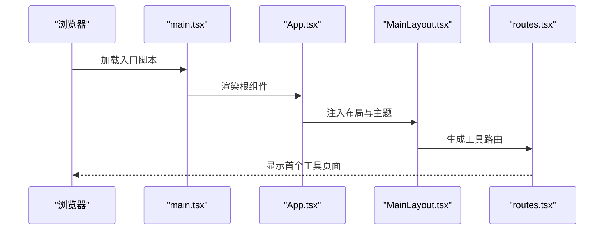
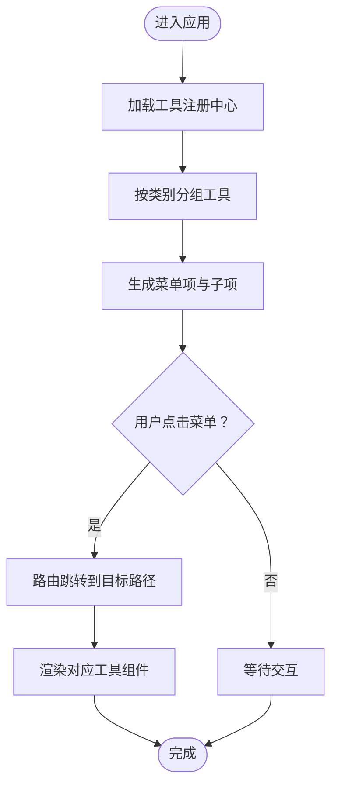
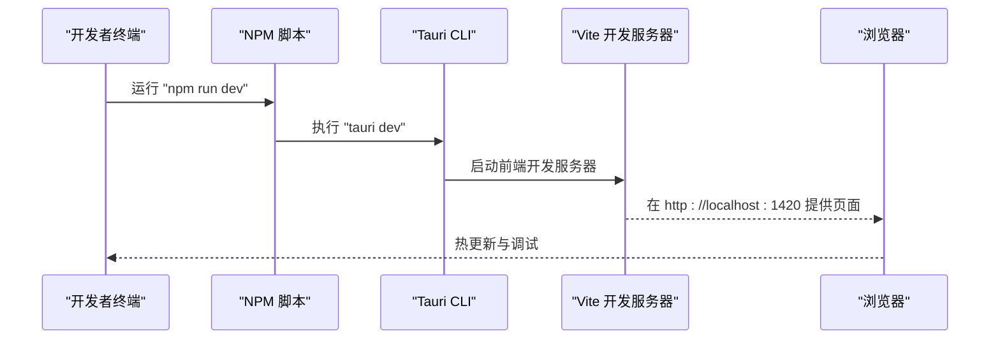

# 快速开始

<cite>
**本文引用的文件**
- [package.json](file://package.json)
- [vite.config.ts](file://vite.config.ts)
- [tsconfig.json](file://tsconfig.json)
- [src-tauri/Cargo.toml](file://src-tauri/Cargo.toml)
- [src-tauri/tauri.conf.json](file://src-tauri/tauri.conf.json)
- [src/main.tsx](file://src/main.tsx)
- [src/App.tsx](file://src/App.tsx)
- [src/layouts/MainLayout.tsx](file://src/layouts/MainLayout.tsx)
- [src/routes.tsx](file://src/routes.tsx)
- [src/store/useAppStore.ts](file://src/store/useAppStore.ts)
- [src/tools/registry.ts](file://src/tools/registry.ts)
- [src/tools/json/index.tsx](file://src/tools/json/index.tsx)
- [src/tools/crypto/index.tsx](file://src/tools/crypto/index.tsx)
- [src-tauri/src/main.rs](file://src-tauri/src/main.rs)
</cite>

## 目录
1. [简介](#简介)
2. [项目结构](#项目结构)
3. [核心组件](#核心组件)
4. [架构总览](#架构总览)
5. [详细组件分析](#详细组件分析)
6. [依赖分析](#依赖分析)
7. [性能考虑](#性能考虑)
8. [故障排除指南](#故障排除指南)
9. [结论](#结论)
10. [附录](#附录)

## 简介
本指南面向新手开发者，帮助你在本地快速搭建 XKUtil 项目的开发与运行环境，涵盖 Node.js、Rust 工具链与 Tauri CLI 的安装要求，依赖安装、开发服务器启动、生产构建与打包流程，并提供常见问题排查与环境配置验证方法。XKUtil 是一个基于 React + Vite 的前端应用，通过 Tauri v2 将其封装为跨平台桌面应用，内置 JSON 工具与加密工具等实用功能模块。

## 项目结构
XKUtil 采用“前端 + Rust 后端”的双层结构：
- 前端：React + TypeScript + Vite，位于根目录的 src 及相关配置文件中
- 桌面桥接：Tauri 应用位于 src-tauri，包含 Rust 侧主程序、Cargo 配置与 Tauri 配置
- 构建与脚本：通过 package.json 中的 npm scripts 调用 Vite 与 Tauri CLI

图表来源
- [vite.config.ts:1-31](file://vite.config.ts#L1-L31)
- [tsconfig.json:1-26](file://tsconfig.json#L1-L26)
- [src-tauri/tauri.conf.json:1-39](file://src-tauri/tauri.conf.json#L1-L39)
- [src-tauri/Cargo.toml:1-23](file://src-tauri/Cargo.toml#L1-L23)
- [src-tauri/src/main.rs:1-6](file://src-tauri/src/main.rs#L1-L6)

章节来源
- [package.json:1-36](file://package.json#L1-L36)
- [vite.config.ts:1-31](file://vite.config.ts#L1-L31)
- [tsconfig.json:1-26](file://tsconfig.json#L1-L26)
- [src-tauri/tauri.conf.json:1-39](file://src-tauri/tauri.conf.json#L1-L39)
- [src-tauri/Cargo.toml:1-23](file://src-tauri/Cargo.toml#L1-L23)
- [src-tauri/src/main.rs:1-6](file://src-tauri/src/main.rs#L1-L6)

## 核心组件
- 前端入口与渲染：React DOM 渲染入口负责挂载根组件
  - [src/main.tsx:1-11](file://src/main.tsx#L1-L11)
- 应用根组件：配置 Ant Design 国际化与主题，注入路由布局
  - [src/App.tsx:1-24](file://src/App.tsx#L1-L24)
- 主布局：左侧菜单导航、顶部工具栏、内容区与更新日志弹窗
  - [src/layouts/MainLayout.tsx:1-168](file://src/layouts/MainLayout.tsx#L1-L168)
- 路由系统：动态注册工具页面，支持懒加载与回退到首个工具页
  - [src/routes.tsx:1-29](file://src/routes.tsx#L1-L29)
- 应用状态：Zustand 管理侧边栏折叠与主题切换，并持久化到本地存储
  - [src/store/useAppStore.ts:1-24](file://src/store/useAppStore.ts#L1-L24)
- 工具注册中心：按分类聚合工具定义，供菜单与路由使用
  - [src/tools/registry.ts:1-39](file://src/tools/registry.ts#L1-L39)
- JSON 工具与加密工具：提供具体功能页面的定义与懒加载组件
  - [src/tools/json/index.tsx:1-27](file://src/tools/json/index.tsx#L1-L27)
  - [src/tools/crypto/index.tsx:1-17](file://src/tools/crypto/index.tsx#L1-L17)

章节来源
- [src/main.tsx:1-11](file://src/main.tsx#L1-L11)
- [src/App.tsx:1-24](file://src/App.tsx#L1-L24)
- [src/layouts/MainLayout.tsx:1-168](file://src/layouts/MainLayout.tsx#L1-L168)
- [src/routes.tsx:1-29](file://src/routes.tsx#L1-L29)
- [src/store/useAppStore.ts:1-24](file://src/store/useAppStore.ts#L1-L24)
- [src/tools/registry.ts:1-39](file://src/tools/registry.ts#L1-L39)
- [src/tools/json/index.tsx:1-27](file://src/tools/json/index.tsx#L1-L27)
- [src/tools/crypto/index.tsx:1-17](file://src/tools/crypto/index.tsx#L1-L17)

## 架构总览
XKUtil 的运行时架构由前端开发服务器与 Tauri 应用组成。开发模式下，Vite 提供热更新开发服务器；Tauri 通过配置在 dev 时自动启动前端开发服务器，并在构建时将产物打包进应用。

图表来源
- [package.json:6-11](file://package.json#L6-L11)
- [vite.config.ts:1-31](file://vite.config.ts#L1-L31)
- [src-tauri/tauri.conf.json:5-10](file://src-tauri/tauri.conf.json#L5-L10)
- [src-tauri/src/main.rs:1-6](file://src-tauri/src/main.rs#L1-L6)
- [src-tauri/Cargo.toml:15-23](file://src-tauri/Cargo.toml#L15-L23)

章节来源
- [package.json:6-11](file://package.json#L6-L11)
- [vite.config.ts:1-31](file://vite.config.ts#L1-L31)
- [src-tauri/tauri.conf.json:5-10](file://src-tauri/tauri.conf.json#L5-L10)
- [src-tauri/src/main.rs:1-6](file://src-tauri/src/main.rs#L1-L6)
- [src-tauri/Cargo.toml:15-23](file://src-tauri/Cargo.toml#L15-L23)

## 详细组件分析

### 组件 A 分析：应用启动与路由
该组件链路展示了从入口到路由渲染的关键调用序列，体现前端初始化、主题与国际化注入、菜单生成与路由挂载。

图表来源
- [src/main.tsx:6-10](file://src/main.tsx#L6-L10)
- [src/App.tsx:9-21](file://src/App.tsx#L9-L21)
- [src/layouts/MainLayout.tsx:22-43](file://src/layouts/MainLayout.tsx#L22-L43)
- [src/routes.tsx:6-28](file://src/routes.tsx#L6-L28)

章节来源
- [src/main.tsx:1-11](file://src/main.tsx#L1-L11)
- [src/App.tsx:1-24](file://src/App.tsx#L1-L24)
- [src/layouts/MainLayout.tsx:1-168](file://src/layouts/MainLayout.tsx#L1-L168)
- [src/routes.tsx:1-29](file://src/routes.tsx#L1-L29)

### 组件 B 分析：工具注册与菜单生成
该流程展示工具注册中心如何将不同类别的工具聚合为菜单项，以及菜单点击后如何导航到对应页面。

图表来源
- [src/tools/registry.ts:7-23](file://src/tools/registry.ts#L7-L23)
- [src/layouts/MainLayout.tsx:31-43](file://src/layouts/MainLayout.tsx#L31-L43)
- [src/routes.tsx:17-24](file://src/routes.tsx#L17-L24)

章节来源
- [src/tools/registry.ts:1-39](file://src/tools/registry.ts#L1-L39)
- [src/layouts/MainLayout.tsx:1-168](file://src/layouts/MainLayout.tsx#L1-L168)
- [src/routes.tsx:1-29](file://src/routes.tsx#L1-L29)

### 组件 C 分析：开发服务器启动流程
该流程展示开发模式下，Tauri 如何在 dev 时自动启动前端开发服务器，并在浏览器中访问指定端口。

图表来源
- [package.json:7](file://package.json#L7)
- [src-tauri/tauri.conf.json:6-7](file://src-tauri/tauri.conf.json#L6-L7)
- [vite.config.ts:15-29](file://vite.config.ts#L15-L29)

章节来源
- [package.json:6-11](file://package.json#L6-L11)
- [src-tauri/tauri.conf.json:5-10](file://src-tauri/tauri.conf.json#L5-L10)
- [vite.config.ts:1-31](file://vite.config.ts#L1-L31)

## 依赖分析
- 前端依赖与脚本
  - React 生态与 Ant Design UI：用于界面与主题
  - Vite 与 TypeScript：开发与构建工具
  - Tauri 插件：剪贴板、对话框、文件系统等原生能力
  - 参考：[package.json:12-34](file://package.json#L12-L34)
- Rust 依赖与构建
  - Tauri v2 与插件：窗口、文件系统、剪贴板、对话框等
  - serde 与 serde_json：数据序列化
  - 参考：[src-tauri/Cargo.toml:15-23](file://src-tauri/Cargo.toml#L15-L23)
- 构建与运行脚本
  - dev：启动 Vite 开发服务器
  - build：先执行 TypeScript 编译，再进行 Vite 构建
  - preview：预览构建产物
  - tauri：调用 Tauri CLI
  - 参考：[package.json:6-11](file://package.json#L6-L11)

章节来源
- [package.json:6-34](file://package.json#L6-L34)
- [src-tauri/Cargo.toml:15-23](file://src-tauri/Cargo.toml#L15-L23)

## 性能考虑
- Vite 热更新与严格端口：开发服务器端口固定，避免端口冲突带来的重连开销
  - 参考：[vite.config.ts:17-18](file://vite.config.ts#L17-L18)
- TypeScript 严格模式：提升类型安全，减少运行时错误
  - 参考：[tsconfig.json:14-18](file://tsconfig.json#L14-L18)
- 路由懒加载：工具页面按需加载，降低首屏负载
  - 参考：[src/tools/json/index.tsx:13](file://src/tools/json/index.tsx#L13), [src/tools/crypto/index.tsx:13](file://src/tools/crypto/index.tsx#L13)
- 状态持久化：主题与布局设置持久化，减少重复初始化
  - 参考：[src/store/useAppStore.ts:19-22](file://src/store/useAppStore.ts#L19-L22)

章节来源
- [vite.config.ts:15-29](file://vite.config.ts#L15-L29)
- [tsconfig.json:14-18](file://tsconfig.json#L14-L18)
- [src/tools/json/index.tsx:13](file://src/tools/json/index.tsx#L13)
- [src/tools/crypto/index.tsx:13](file://src/tools/crypto/index.tsx#L13)
- [src/store/useAppStore.ts:19-22](file://src/store/useAppStore.ts#L19-L22)

## 故障排除指南
- 端口占用或无法访问
  - 症状：浏览器无法打开开发地址或热更新不生效
  - 排查：确认开发服务器端口 1420 未被占用；若使用自定义主机，检查环境变量与 HMR 配置
  - 参考：[vite.config.ts:15-29](file://vite.config.ts#L15-L29)
- Tauri 开发命令未找到
  - 症状：执行 tauri dev 报错
  - 排查：确认已安装 Tauri CLI 并在 PATH 中可用；检查 package.json 中的脚本别名
  - 参考：[package.json:10](file://package.json#L10), [package.json:27](file://package.json#L27)
- 构建失败或产物缺失
  - 症状：构建后 dist 目录为空或报错
  - 排查：先执行 TypeScript 编译，再执行 Vite 构建；确认 Tauri 配置中的前端构建产物路径
  - 参考：[package.json:8](file://package.json#L8), [src-tauri/tauri.conf.json:8-9](file://src-tauri/tauri.conf.json#L8-L9)
- Rust 依赖或插件版本不匹配
  - 症状：编译报错或运行时功能异常
  - 排查：核对 Cargo.toml 中 Tauri 版本与插件版本；保持与 Tauri CLI 版本一致
  - 参考：[src-tauri/Cargo.toml:15-23](file://src-tauri/Cargo.toml#L15-L23), [package.json:27](file://package.json#L27)
- 菜单与路由不显示工具页
  - 症状：侧边栏无工具项或 404
  - 排查：确认工具已在注册中心聚合；检查路由是否正确映射到工具路径
  - 参考：[src/tools/registry.ts:5](file://src/tools/registry.ts#L5), [src/routes.tsx:17-24](file://src/routes.tsx#L17-L24)

章节来源
- [vite.config.ts:15-29](file://vite.config.ts#L15-L29)
- [package.json:8-11](file://package.json#L8-L11)
- [src-tauri/tauri.conf.json:8-9](file://src-tauri/tauri.conf.json#L8-L9)
- [src-tauri/Cargo.toml:15-23](file://src-tauri/Cargo.toml#L15-L23)
- [src/tools/registry.ts:5](file://src/tools/registry.ts#L5)
- [src/routes.tsx:17-24](file://src/routes.tsx#L17-L24)

## 结论
通过本快速开始指南，你可以在本地完成环境准备、依赖安装、开发服务器启动与生产构建，并掌握常见问题的排查方法。XKUtil 的前端与桌面桥接配置清晰，便于新手快速上手并扩展新的工具模块。

## 附录

### 环境与工具安装要求
- Node.js 与包管理器
  - 安装方式：官方安装包或版本管理器
  - 验证命令：node -v 与 npm -v
- Rust 工具链
  - 安装方式：rustup（推荐）
  - 验证命令：rustc --version 与 cargo --version
- Tauri CLI
  - 安装命令：npm install -g @tauri-apps/cli
  - 验证命令：tauri --version

章节来源
- [package.json:27](file://package.json#L27)
- [src-tauri/Cargo.toml:15-23](file://src-tauri/Cargo.toml#L15-L23)

### 依赖安装与开发服务器启动
- 安装依赖
  - 命令：npm install
  - 说明：安装前端与 Tauri CLI 依赖
- 启动开发服务器
  - 命令：npm run dev
  - 说明：启动 Vite 开发服务器并在浏览器中访问 http://localhost:1420
- 预览构建产物
  - 命令：npm run preview
  - 说明：本地预览生产构建结果

章节来源
- [package.json:6-11](file://package.json#L6-L11)
- [vite.config.ts:15-29](file://vite.config.ts#L15-L29)

### 生产构建与打包
- 构建前端与打包
  - 命令：npm run build
  - 说明：先执行 TypeScript 编译，再进行 Vite 构建，产物输出至 dist
- 打包桌面应用
  - 命令：tauri build
  - 说明：根据 tauri.conf.json 配置进行打包，生成多平台安装包

章节来源
- [package.json:8](file://package.json#L8)
- [src-tauri/tauri.conf.json:8-9](file://src-tauri/tauri.conf.json#L8-L9)

### 环境配置验证清单
- Node.js 与 npm
  - 验证：node -v 与 npm -v
- Rust 工具链
  - 验证：rustc --version 与 cargo --version
- Tauri CLI
  - 验证：tauri --version
- 开发服务器
  - 验证：浏览器访问 http://localhost:1420，确认页面可加载且热更新正常
- 构建产物
  - 验证：dist 目录存在且包含构建产物
- 打包产物
  - 验证：tauri 应用窗口可启动，工具页面可访问

章节来源
- [vite.config.ts:15-29](file://vite.config.ts#L15-L29)
- [src-tauri/tauri.conf.json:8-9](file://src-tauri/tauri.conf.json#L8-L9)