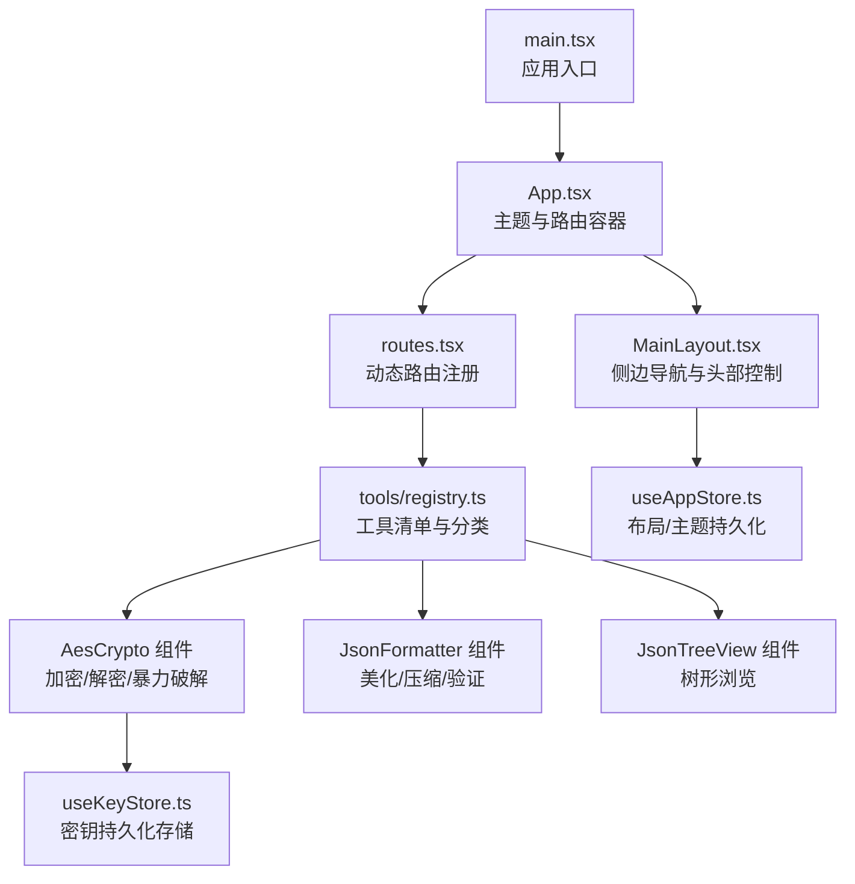
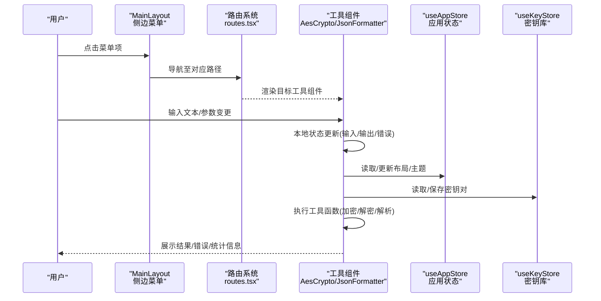
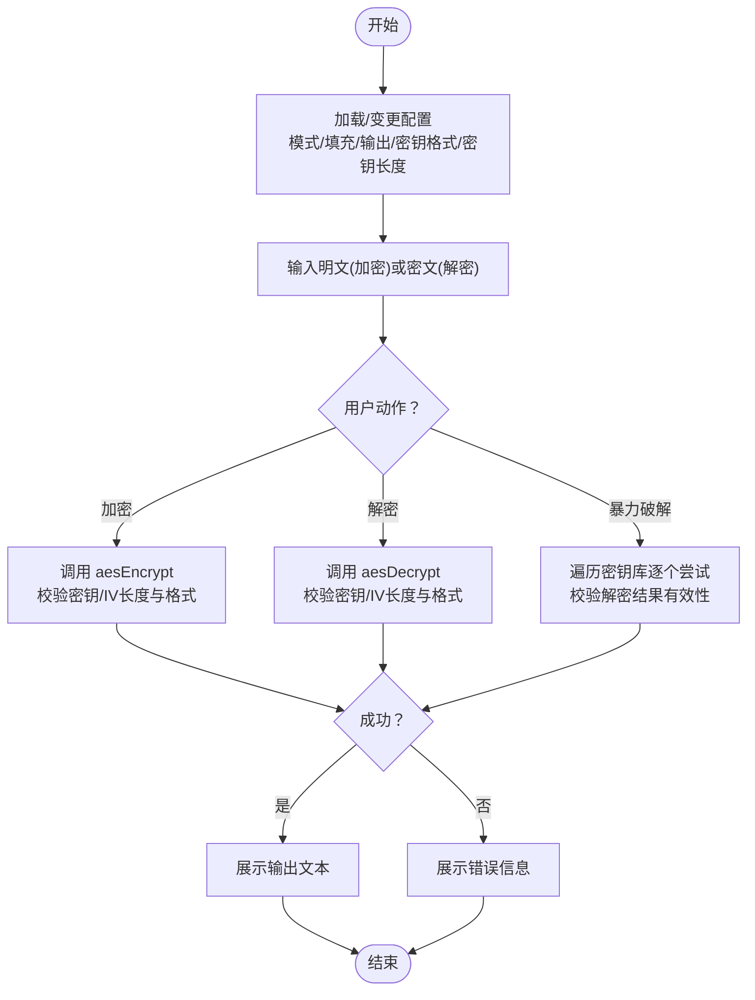
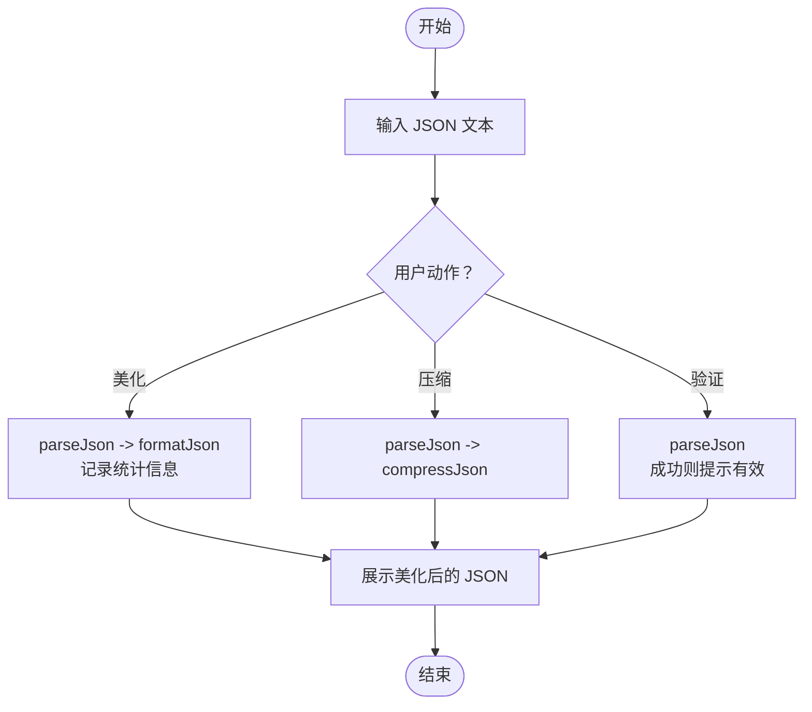
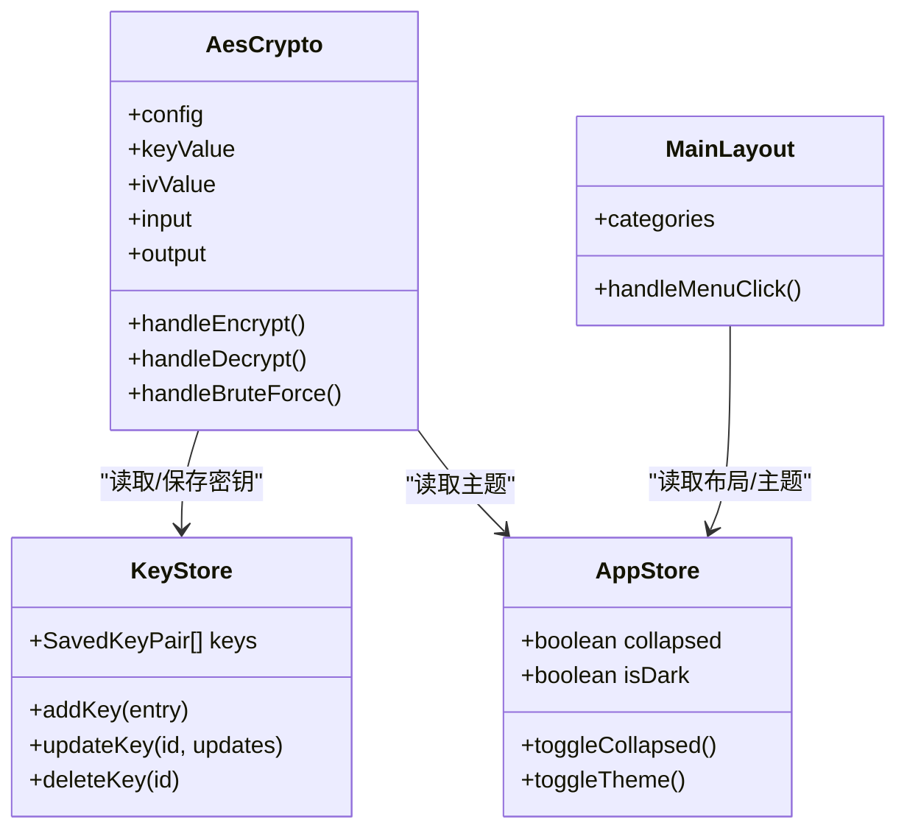
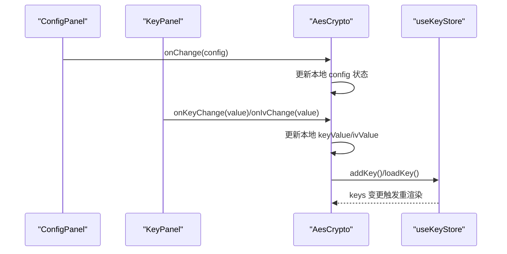
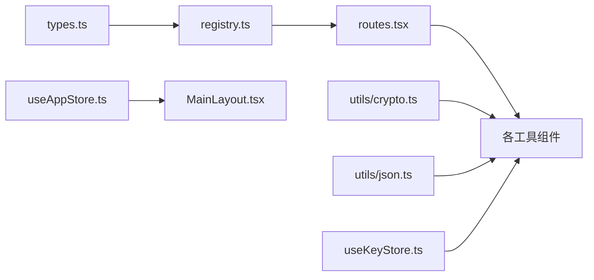

# 数据流设计

<cite>
**本文引用的文件**
- [src/App.tsx](file://src/App.tsx)
- [src/main.tsx](file://src/main.tsx)
- [src/routes.tsx](file://src/routes.tsx)
- [src/layouts/MainLayout.tsx](file://src/layouts/MainLayout.tsx)
- [src/store/useAppStore.ts](file://src/store/useAppStore.ts)
- [src/store/useKeyStore.ts](file://src/store/useKeyStore.ts)
- [src/tools/registry.ts](file://src/tools/registry.ts)
- [src/tools/types.ts](file://src/tools/types.ts)
- [src/utils/crypto.ts](file://src/utils/crypto.ts)
- [src/utils/json.ts](file://src/utils/json.ts)
- [src/tools/crypto/AesCrypto/index.tsx](file://src/tools/crypto/AesCrypto/index.tsx)
- [src/tools/crypto/AesCrypto/ConfigPanel.tsx](file://src/tools/crypto/AesCrypto/ConfigPanel.tsx)
- [src/tools/crypto/AesCrypto/KeyPanel.tsx](file://src/tools/crypto/AesCrypto/KeyPanel.tsx)
- [src/tools/json/JsonFormatter/index.tsx](file://src/tools/json/JsonFormatter/index.tsx)
- [src/tools/json/JsonTreeView/index.tsx](file://src/tools/json/JsonTreeView/index.tsx)
</cite>

## 目录
1. [简介](#简介)
2. [项目结构](#项目结构)
3. [核心组件](#核心组件)
4. [架构总览](#架构总览)
5. [详细组件分析](#详细组件分析)
6. [依赖关系分析](#依赖关系分析)
7. [性能考量](#性能考量)
8. [故障排查指南](#故障排查指南)
9. [结论](#结论)

## 简介
本文件面向开发者，系统性阐述 XKUtil 的数据流与状态管理设计。重点覆盖以下方面：
- 用户输入处理：从界面输入到工具函数的转换与校验
- 工具执行：加密/解密、JSON 解析/格式化/压缩等核心算法
- 状态更新：Zustand 状态管理在组件间的状态同步与持久化
- 界面渲染：基于 React 的响应式数据驱动渲染
- 异步数据处理：剪贴板读写、消息提示等异步操作的实现策略

## 项目结构
XKUtil 采用“路由驱动 + 工具分类 + Zustand 状态”的前端架构。入口通过路由动态注册所有工具，每个工具以独立组件形式存在，内部通过本地状态与全局状态协同工作。

图表来源
- [src/main.tsx:1-11](file://src/main.tsx#L1-L11)
- [src/App.tsx:1-24](file://src/App.tsx#L1-L24)
- [src/routes.tsx:1-29](file://src/routes.tsx#L1-L29)
- [src/layouts/MainLayout.tsx:1-168](file://src/layouts/MainLayout.tsx#L1-L168)
- [src/tools/registry.ts:1-39](file://src/tools/registry.ts#L1-L39)
- [src/store/useAppStore.ts:1-24](file://src/store/useAppStore.ts#L1-L24)
- [src/store/useKeyStore.ts:1-47](file://src/store/useKeyStore.ts#L1-L47)

章节来源
- [src/main.tsx:1-11](file://src/main.tsx#L1-L11)
- [src/App.tsx:1-24](file://src/App.tsx#L1-L24)
- [src/routes.tsx:1-29](file://src/routes.tsx#L1-L29)
- [src/layouts/MainLayout.tsx:1-168](file://src/layouts/MainLayout.tsx#L1-L168)
- [src/tools/registry.ts:1-39](file://src/tools/registry.ts#L1-L39)

## 核心组件
- 应用入口与主题配置：应用根节点负责注入 Ant Design 主题与国际化，并包裹 HashRouter 与主布局。
- 路由系统：根据工具注册表动态生成路由，支持懒加载组件与统一的加载占位。
- 主布局：包含侧边菜单（按类别聚合工具）、头部按钮（切换布局折叠与主题），以及版本更新弹窗。
- 工具组件：每个工具以独立组件存在，内部维护自身输入/输出状态，并可访问全局状态（如密钥库、应用设置）。
- 状态管理：
  - useAppStore：管理布局折叠状态与主题切换，并持久化到本地存储。
  - useKeyStore：管理 AES 密钥对集合，支持增删改查与持久化。

章节来源
- [src/App.tsx:1-24](file://src/App.tsx#L1-L24)
- [src/routes.tsx:1-29](file://src/routes.tsx#L1-L29)
- [src/layouts/MainLayout.tsx:1-168](file://src/layouts/MainLayout.tsx#L1-L168)
- [src/store/useAppStore.ts:1-24](file://src/store/useAppStore.ts#L1-L24)
- [src/store/useKeyStore.ts:1-47](file://src/store/useKeyStore.ts#L1-L47)

## 架构总览
下图展示从用户交互到界面渲染的端到端数据流，涵盖工具选择、参数配置、输入处理、算法执行与结果回显。

图表来源
- [src/layouts/MainLayout.tsx:1-168](file://src/layouts/MainLayout.tsx#L1-L168)
- [src/routes.tsx:1-29](file://src/routes.tsx#L1-L29)
- [src/tools/crypto/AesCrypto/index.tsx:1-310](file://src/tools/crypto/AesCrypto/index.tsx#L1-L310)
- [src/tools/json/JsonFormatter/index.tsx:1-267](file://src/tools/json/JsonFormatter/index.tsx#L1-L267)
- [src/store/useAppStore.ts:1-24](file://src/store/useAppStore.ts#L1-L24)
- [src/store/useKeyStore.ts:1-47](file://src/store/useKeyStore.ts#L1-L47)

## 详细组件分析

### 加密工具（AES）数据流
该组件负责 AES 加密、解密与暴力破解，配合密钥库进行密钥管理与自动匹配。

图表来源
- [src/tools/crypto/AesCrypto/index.tsx:55-112](file://src/tools/crypto/AesCrypto/index.tsx#L55-L112)
- [src/utils/crypto.ts:59-162](file://src/utils/crypto.ts#L59-L162)

章节来源
- [src/tools/crypto/AesCrypto/index.tsx:1-310](file://src/tools/crypto/AesCrypto/index.tsx#L1-L310)
- [src/utils/crypto.ts:1-222](file://src/utils/crypto.ts#L1-L222)

### JSON 工具数据流
该组件提供 JSON 美化、压缩与校验功能，并展示统计信息；同时支持复制/粘贴与键排序。

图表来源
- [src/tools/json/JsonFormatter/index.tsx:53-130](file://src/tools/json/JsonFormatter/index.tsx#L53-L130)
- [src/utils/json.ts:14-48](file://src/utils/json.ts#L14-L48)

章节来源
- [src/tools/json/JsonFormatter/index.tsx:1-267](file://src/tools/json/JsonFormatter/index.tsx#L1-L267)
- [src/utils/json.ts:1-116](file://src/utils/json.ts#L1-L116)

### 状态管理与数据传递
- Zustand 使用 create 定义状态切片，结合 persist 中间件实现本地持久化。
- 组件通过选择器订阅所需字段，避免无关重渲染。
- 工具组件与布局组件共享状态，形成“自顶向下”的数据流与“局部更新”的渲染优化。

图表来源
- [src/store/useAppStore.ts:1-24](file://src/store/useAppStore.ts#L1-L24)
- [src/store/useKeyStore.ts:1-47](file://src/store/useKeyStore.ts#L1-L47)
- [src/tools/crypto/AesCrypto/index.tsx:33-156](file://src/tools/crypto/AesCrypto/index.tsx#L33-L156)
- [src/layouts/MainLayout.tsx:22-43](file://src/layouts/MainLayout.tsx#L22-L43)

章节来源
- [src/store/useAppStore.ts:1-24](file://src/store/useAppStore.ts#L1-L24)
- [src/store/useKeyStore.ts:1-47](file://src/store/useKeyStore.ts#L1-L47)
- [src/tools/crypto/AesCrypto/index.tsx:1-310](file://src/tools/crypto/AesCrypto/index.tsx#L1-L310)
- [src/layouts/MainLayout.tsx:1-168](file://src/layouts/MainLayout.tsx#L1-L168)

### 配置面板与密钥面板
- 配置面板：通过受控 Select 控件更新 AES 配置，影响后续加密/解密行为。
- 密钥面板：支持密钥/IV 的手动输入与随机生成，提供长度校验与占位提示，并与密钥库交互。

图表来源
- [src/tools/crypto/AesCrypto/ConfigPanel.tsx:39-94](file://src/tools/crypto/AesCrypto/ConfigPanel.tsx#L39-L94)
- [src/tools/crypto/AesCrypto/KeyPanel.tsx:23-113](file://src/tools/crypto/AesCrypto/KeyPanel.tsx#L23-L113)
- [src/tools/crypto/AesCrypto/index.tsx:33-156](file://src/tools/crypto/AesCrypto/index.tsx#L33-L156)
- [src/store/useKeyStore.ts:22-46](file://src/store/useKeyStore.ts#L22-L46)

章节来源
- [src/tools/crypto/AesCrypto/ConfigPanel.tsx:1-95](file://src/tools/crypto/AesCrypto/ConfigPanel.tsx#L1-L95)
- [src/tools/crypto/AesCrypto/KeyPanel.tsx:1-114](file://src/tools/crypto/AesCrypto/KeyPanel.tsx#L1-L114)
- [src/tools/crypto/AesCrypto/index.tsx:1-310](file://src/tools/crypto/AesCrypto/index.tsx#L1-L310)
- [src/store/useKeyStore.ts:1-47](file://src/store/useKeyStore.ts#L1-L47)

## 依赖关系分析
- 工具注册：工具定义集中于 types.ts，注册表 registry.ts 按类别聚合并导出工具清单。
- 路由依赖：routes.tsx 通过 getAllTools 动态生成路由，确保新增工具无需修改路由文件。
- 组件依赖：工具组件依赖工具函数（utils/crypto.ts、utils/json.ts）与状态存储（useAppStore、useKeyStore）。

图表来源
- [src/tools/types.ts:1-20](file://src/tools/types.ts#L1-L20)
- [src/tools/registry.ts:1-39](file://src/tools/registry.ts#L1-L39)
- [src/routes.tsx:1-29](file://src/routes.tsx#L1-L29)
- [src/utils/crypto.ts:1-222](file://src/utils/crypto.ts#L1-L222)
- [src/utils/json.ts:1-116](file://src/utils/json.ts#L1-L116)
- [src/store/useAppStore.ts:1-24](file://src/store/useAppStore.ts#L1-L24)
- [src/store/useKeyStore.ts:1-47](file://src/store/useKeyStore.ts#L1-L47)
- [src/layouts/MainLayout.tsx:1-168](file://src/layouts/MainLayout.tsx#L1-L168)

章节来源
- [src/tools/types.ts:1-20](file://src/tools/types.ts#L1-L20)
- [src/tools/registry.ts:1-39](file://src/tools/registry.ts#L1-L39)
- [src/routes.tsx:1-29](file://src/routes.tsx#L1-L29)
- [src/utils/crypto.ts:1-222](file://src/utils/crypto.ts#L1-L222)
- [src/utils/json.ts:1-116](file://src/utils/json.ts#L1-L116)
- [src/store/useAppStore.ts:1-24](file://src/store/useAppStore.ts#L1-L24)
- [src/store/useKeyStore.ts:1-47](file://src/store/useKeyStore.ts#L1-L47)
- [src/layouts/MainLayout.tsx:1-168](file://src/layouts/MainLayout.tsx#L1-L168)

## 性能考量
- 渲染优化
  - 使用局部状态（useState）管理组件内输入/输出，避免跨组件重渲染。
  - 使用选择器订阅 Zustand 状态，仅在相关字段变化时触发重渲染。
- 计算优化
  - JSON 统计与树形转换使用 useMemo 缓存中间结果，减少重复计算。
- I/O 优化
  - 剪贴板读写使用异步 API，避免阻塞主线程。
- 存储优化
  - 使用 persist 中间件将应用设置与密钥库持久化，减少初始化成本。

## 故障排查指南
- 加密/解密失败
  - 检查密钥与 IV 长度是否符合所选密钥格式与密钥长度。
  - 确认模式为 ECB 时无需 IV。
  - 若使用暴力破解，确认密钥库中存在可用密钥对。
- JSON 解析错误
  - 查看错误信息中的行列位置，定位语法问题。
  - 确保输入为合法 JSON，必要时启用键排序或压缩后再解析。
- 界面无响应
  - 检查是否存在大量数据导致渲染卡顿，考虑分页或延迟渲染。
  - 确认剪贴板权限与浏览器兼容性。

章节来源
- [src/tools/crypto/AesCrypto/index.tsx:55-112](file://src/tools/crypto/AesCrypto/index.tsx#L55-L112)
- [src/utils/crypto.ts:59-162](file://src/utils/crypto.ts#L59-L162)
- [src/tools/json/JsonFormatter/index.tsx:53-130](file://src/tools/json/JsonFormatter/index.tsx#L53-L130)
- [src/utils/json.ts:14-38](file://src/utils/json.ts#L14-L38)

## 结论
XKUtil 的数据流以“路由驱动 + 工具组件 + Zustand 状态”为核心，实现了清晰的用户输入—工具执行—状态更新—界面渲染闭环。通过局部状态与选择器订阅相结合，既保证了组件的高内聚，又避免了全局状态带来的过度重渲染。工具函数与状态存储分离的设计，使得扩展新工具与维护现有功能更加便捷。