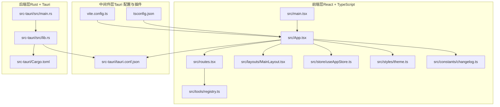
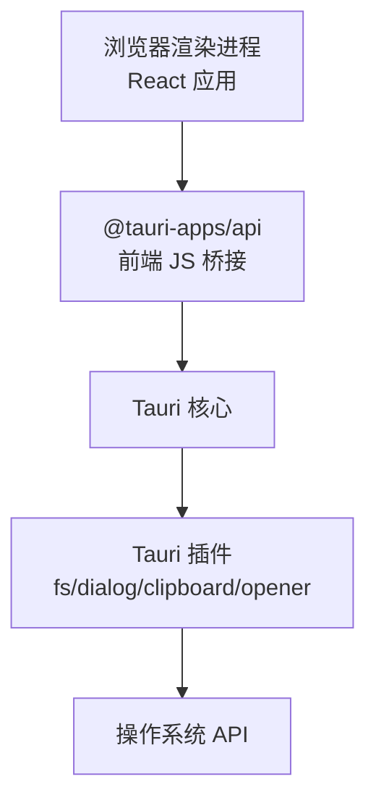
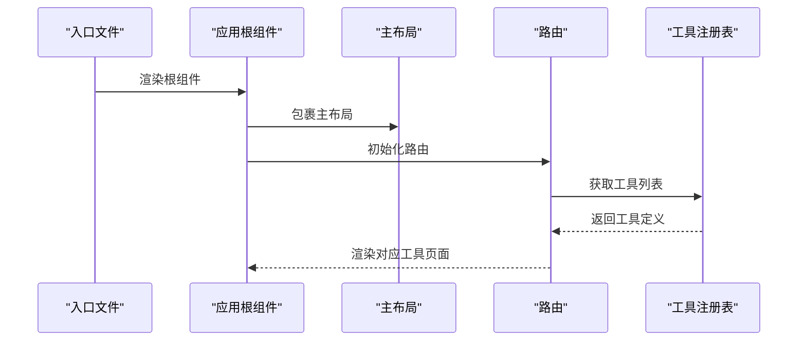
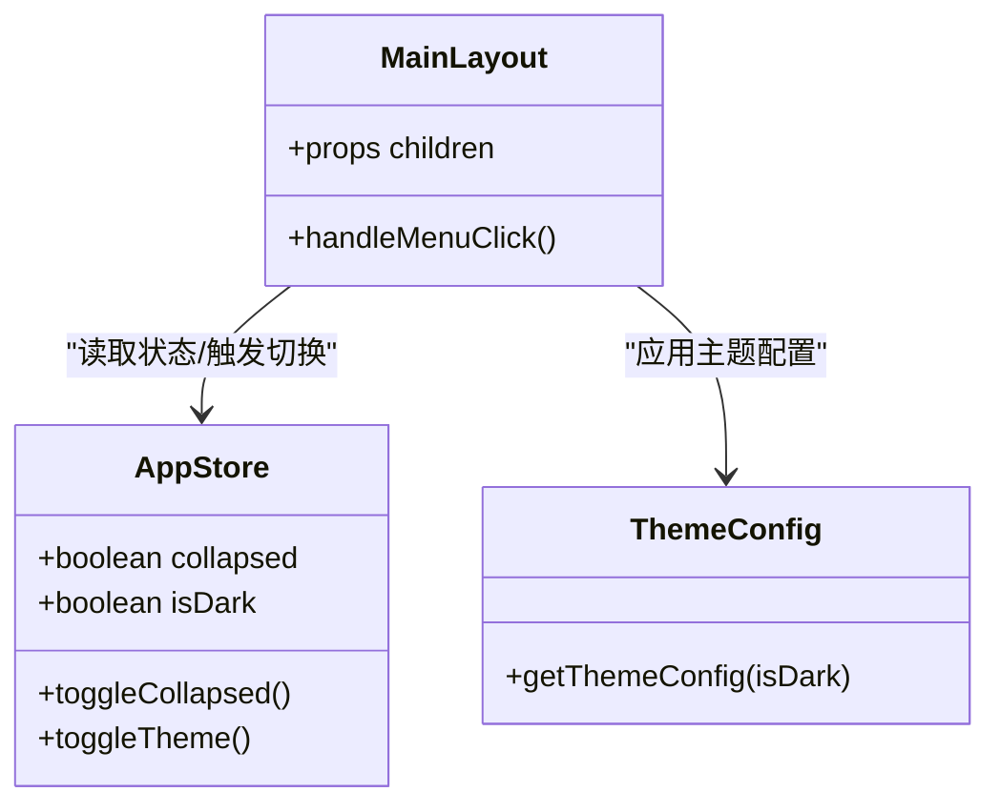
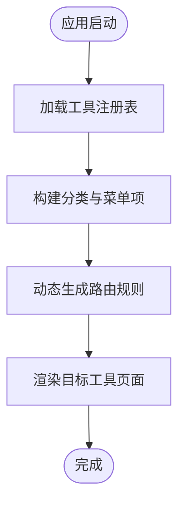
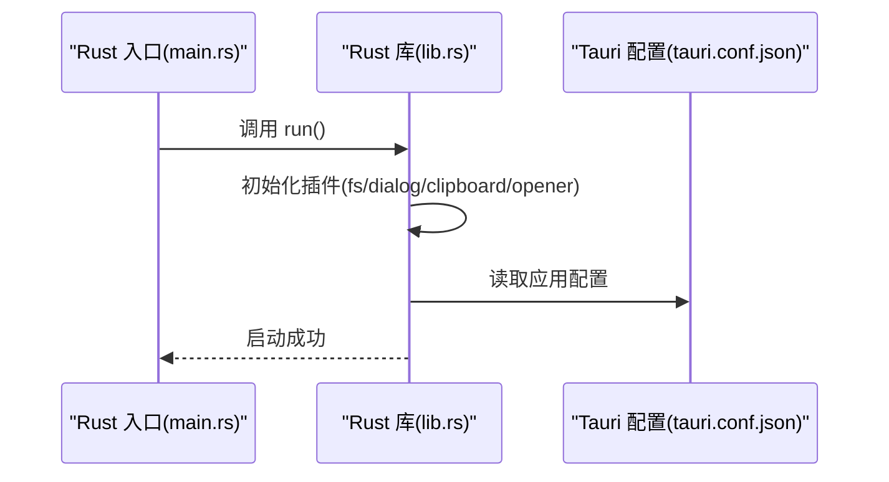
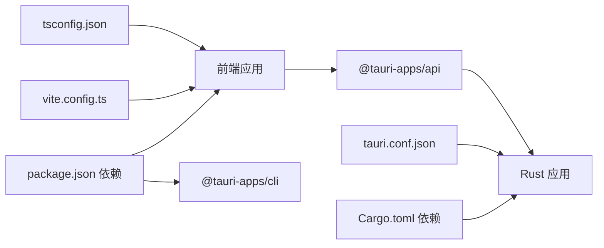

# 整体架构概览

<cite>
**本文档引用的文件**
- [package.json](file://package.json)
- [Cargo.toml](file://src-tauri/Cargo.toml)
- [tauri.conf.json](file://src-tauri/tauri.conf.json)
- [main.tsx](file://src/main.tsx)
- [App.tsx](file://src/App.tsx)
- [routes.tsx](file://src/routes.tsx)
- [MainLayout.tsx](file://src/layouts/MainLayout.tsx)
- [useAppStore.ts](file://src/store/useAppStore.ts)
- [registry.ts](file://src/tools/registry.ts)
- [theme.ts](file://src/styles/theme.ts)
- [changelog.ts](file://src/constants/changelog.ts)
- [main.rs](file://src-tauri/src/main.rs)
- [lib.rs](file://src-tauri/src/lib.rs)
- [vite.config.ts](file://vite.config.ts)
- [tsconfig.json](file://tsconfig.json)
</cite>

## 目录
1. [简介](#简介)
2. [项目结构](#项目结构)
3. [核心组件](#核心组件)
4. [架构总览](#架构总览)
5. [详细组件分析](#详细组件分析)
6. [依赖分析](#依赖分析)
7. [性能考虑](#性能考虑)
8. [故障排除指南](#故障排除指南)
9. [结论](#结论)

## 简介
本项目是一个基于 Tauri + React 的跨平台桌面应用，旨在为开发者提供一个集“工具箱”功能于一体的桌面工具集合。前端采用 React + TypeScript 构建用户界面与状态管理，后端 Rust 层通过 Tauri 提供原生能力（文件系统、对话框、剪贴板、打开外部链接等），中间件层由 Tauri 配置与插件体系构成，负责桥接前端与系统能力。

该架构的核心优势在于：
- 前后端分离：前端专注 UI 与业务逻辑，后端专注系统级能力与安全边界控制。
- 跨平台原生体验：借助 Tauri 将 Web 技术封装为原生应用，获得更小体积与更高性能。
- 可扩展工具体系：通过工具注册表动态加载工具模块，便于后续扩展新工具。

## 项目结构
项目采用“前端 React 应用 + 后端 Rust 应用 + 中间件配置”的分层组织方式，目录划分清晰，职责明确：

- 前端层（src/）
  - 应用入口与路由：main.tsx、App.tsx、routes.tsx
  - 布局与主题：MainLayout.tsx、theme.ts
  - 状态管理：useAppStore.ts（Zustand + 持久化）
  - 工具模块：tools/registry.ts 动态注册工具；具体工具在子目录中实现
  - 常量与配置：constants/changelog.ts
  - 样式与主题：styles/global.css、styles/theme.ts
- 后端层（src-tauri/）
  - 应用入口与库导出：src/main.rs、src/lib.rs
  - 依赖与构建：Cargo.toml、tauri.conf.json
  - 插件与能力：capabilities/default.json（未在当前上下文展开）
- 构建与开发配置
  - Vite 配置：vite.config.ts
  - TypeScript 配置：tsconfig.json
  - 包管理：package.json

**图表来源**
- [main.tsx:1-11](file://src/main.tsx#L1-L11)
- [App.tsx:1-24](file://src/App.tsx#L1-L24)
- [routes.tsx:1-29](file://src/routes.tsx#L1-L29)
- [MainLayout.tsx:1-168](file://src/layouts/MainLayout.tsx#L1-L168)
- [useAppStore.ts:1-24](file://src/store/useAppStore.ts#L1-L24)
- [registry.ts:1-39](file://src/tools/registry.ts#L1-L39)
- [theme.ts:1-12](file://src/styles/theme.ts#L1-L12)
- [changelog.ts:1-34](file://src/constants/changelog.ts#L1-L34)
- [tauri.conf.json:1-39](file://src-tauri/tauri.conf.json#L1-L39)
- [vite.config.ts:1-31](file://vite.config.ts#L1-L31)
- [tsconfig.json:1-26](file://tsconfig.json#L1-L26)
- [main.rs:1-6](file://src-tauri/src/main.rs#L1-L6)
- [lib.rs:1-11](file://src-tauri/src/lib.rs#L1-L11)
- [Cargo.toml:1-23](file://src-tauri/Cargo.toml#L1-L23)

**章节来源**
- [package.json:1-36](file://package.json#L1-L36)
- [tauri.conf.json:1-39](file://src-tauri/tauri.conf.json#L1-L39)
- [vite.config.ts:1-31](file://vite.config.ts#L1-L31)
- [tsconfig.json:1-26](file://tsconfig.json#L1-L26)

## 核心组件
- 前端应用入口与渲染
  - 入口文件负责挂载 React 应用根节点，引入全局样式。
  - 应用根组件负责注入国际化与主题配置、路由容器与主布局。
- 路由与工具注册
  - 路由根据工具注册表动态生成页面路径，实现工具的按需加载与导航。
  - 注册表聚合 JSON 工具与加密工具，并按分类组织菜单项。
- 主布局与状态
  - 主布局包含侧边栏菜单、顶部工具栏与内容区，支持主题切换与折叠状态。
  - 应用状态使用 Zustand 管理，支持本地持久化，提升用户体验。
- 主题与常量
  - Ant Design 主题配置根据深色模式动态切换算法与基础 token。
  - 更新日志常量用于展示版本变更信息。
- 后端启动与插件
  - Rust 入口调用库函数初始化 Tauri，启用文件系统、对话框、剪贴板、打开器等插件。
- 构建与开发环境
  - Vite 提供开发服务器与热更新，TypeScript 提供类型检查与路径别名解析。
  - Tauri 配置定义窗口属性、构建流程与打包图标资源。

**章节来源**
- [main.tsx:1-11](file://src/main.tsx#L1-L11)
- [App.tsx:1-24](file://src/App.tsx#L1-L24)
- [routes.tsx:1-29](file://src/routes.tsx#L1-L29)
- [MainLayout.tsx:1-168](file://src/layouts/MainLayout.tsx#L1-L168)
- [useAppStore.ts:1-24](file://src/store/useAppStore.ts#L1-L24)
- [registry.ts:1-39](file://src/tools/registry.ts#L1-L39)
- [theme.ts:1-12](file://src/styles/theme.ts#L1-L12)
- [changelog.ts:1-34](file://src/constants/changelog.ts#L1-L34)
- [main.rs:1-6](file://src-tauri/src/main.rs#L1-L6)
- [lib.rs:1-11](file://src-tauri/src/lib.rs#L1-L11)
- [vite.config.ts:1-31](file://vite.config.ts#L1-L31)
- [tsconfig.json:1-26](file://tsconfig.json#L1-L26)

## 架构总览
下图展示了从前端到后端再到系统能力的整体交互流程。前端通过 Tauri 暴露的 API 与后端通信，后端以插件形式访问系统能力，最终形成跨平台桌面应用。

**图表来源**
- [lib.rs:1-11](file://src-tauri/src/lib.rs#L1-L11)
- [tauri.conf.json:1-39](file://src-tauri/tauri.conf.json#L1-L39)
- [package.json:12-25](file://package.json#L12-L25)

## 详细组件分析

### 组件一：前端应用生命周期与路由
- 入口文件负责创建根节点并渲染应用。
- 应用根组件注入 Ant Design 国际化与主题配置，包裹主布局与路由。
- 路由根据工具注册表动态生成页面路径，支持懒加载与回退到首个工具页。

**图表来源**
- [main.tsx:1-11](file://src/main.tsx#L1-L11)
- [App.tsx:1-24](file://src/App.tsx#L1-L24)
- [routes.tsx:1-29](file://src/routes.tsx#L1-L29)
- [registry.ts:1-39](file://src/tools/registry.ts#L1-L39)

**章节来源**
- [main.tsx:1-11](file://src/main.tsx#L1-L11)
- [App.tsx:1-24](file://src/App.tsx#L1-L24)
- [routes.tsx:1-29](file://src/routes.tsx#L1-L29)
- [registry.ts:1-39](file://src/tools/registry.ts#L1-L39)

### 组件二：主布局与状态管理
- 主布局包含侧边栏菜单（按分类组织）、顶部工具栏（折叠与主题切换）、内容区与更新日志弹窗。
- 应用状态使用 Zustand 管理折叠状态与主题状态，并持久化到本地存储。
- 主题配置根据深色模式切换 Ant Design 算法与基础 token。

**图表来源**
- [MainLayout.tsx:1-168](file://src/layouts/MainLayout.tsx#L1-L168)
- [useAppStore.ts:1-24](file://src/store/useAppStore.ts#L1-L24)
- [theme.ts:1-12](file://src/styles/theme.ts#L1-L12)

**章节来源**
- [MainLayout.tsx:1-168](file://src/layouts/MainLayout.tsx#L1-L168)
- [useAppStore.ts:1-24](file://src/store/useAppStore.ts#L1-L24)
- [theme.ts:1-12](file://src/styles/theme.ts#L1-L12)

### 组件三：工具注册与动态路由
- 工具注册表聚合各类工具，按分类构建菜单树，支持动态路由生成。
- 路由在运行时读取注册表，为每个工具创建对应的页面路径与组件映射。

**图表来源**
- [registry.ts:1-39](file://src/tools/registry.ts#L1-L39)
- [routes.tsx:1-29](file://src/routes.tsx#L1-L29)

**章节来源**
- [registry.ts:1-39](file://src/tools/registry.ts#L1-L39)
- [routes.tsx:1-29](file://src/routes.tsx#L1-L29)

### 组件四：后端启动与插件初始化
- Rust 入口调用库函数初始化 Tauri，启用多个系统能力插件（文件系统、对话框、剪贴板、打开器）。
- Tauri 配置定义窗口属性、开发与构建流程、打包图标等。

**图表来源**
- [main.rs:1-6](file://src-tauri/src/main.rs#L1-L6)
- [lib.rs:1-11](file://src-tauri/src/lib.rs#L1-L11)
- [tauri.conf.json:1-39](file://src-tauri/tauri.conf.json#L1-L39)

**章节来源**
- [main.rs:1-6](file://src-tauri/src/main.rs#L1-L6)
- [lib.rs:1-11](file://src-tauri/src/lib.rs#L1-L11)
- [tauri.conf.json:1-39](file://src-tauri/tauri.conf.json#L1-L39)

## 依赖分析
- 前端依赖
  - React 生态与 Ant Design 提供 UI 与组件库；Zustand 管理轻量状态；@tauri-apps/api 提供与后端通信接口。
  - @tauri-apps 插件用于文件系统、对话框、剪贴板、打开器等能力。
- 后端依赖
  - Tauri 2 作为核心框架；tauri-plugin-* 系列插件提供系统能力；Serde 用于序列化。
- 构建与开发
  - Vite 提供开发服务器与打包；TypeScript 进行类型检查与路径别名；Tauri 配置连接前端构建产物。

**图表来源**
- [package.json:12-34](file://package.json#L12-L34)
- [Cargo.toml:15-23](file://src-tauri/Cargo.toml#L15-L23)
- [vite.config.ts:1-31](file://vite.config.ts#L1-L31)
- [tsconfig.json:1-26](file://tsconfig.json#L1-L26)
- [tauri.conf.json:1-39](file://src-tauri/tauri.conf.json#L1-L39)

**章节来源**
- [package.json:12-34](file://package.json#L12-L34)
- [Cargo.toml:15-23](file://src-tauri/Cargo.toml#L15-L23)
- [vite.config.ts:1-31](file://vite.config.ts#L1-L31)
- [tsconfig.json:1-26](file://tsconfig.json#L1-L26)
- [tauri.conf.json:1-39](file://src-tauri/tauri.conf.json#L1-L39)

## 性能考虑
- 前端性能
  - 使用 React.lazy/Suspense 实现工具页面的懒加载，减少首屏负载。
  - Ant Design 的按需加载与主题算法切换避免不必要的重绘。
- 后端性能
  - Rust 插件以静态库形式集成，减少运行时开销；插件按需启用，避免不必要能力。
- 构建与开发
  - Vite 的 HMR 与严格端口配置提升开发效率；TypeScript 的 bundler 解析减少打包体积。
- 跨平台优化
  - Tauri 将 Web 技术封装为原生应用，避免浏览器兼容性问题，同时保持较小的应用体积与更快的启动速度。

## 故障排除指南
- 开发环境无法热更新
  - 检查 Vite 配置中的 host 与 HMR 设置，确保未监听 src-tauri 目录。
- 打包后窗口尺寸或图标异常
  - 检查 tauri.conf.json 中的窗口属性与图标路径配置。
- 插件调用失败
  - 确认 Cargo.toml 中插件版本与 Tauri 版本匹配，且已在 lib.rs 中正确初始化。
- 路由跳转无效
  - 检查工具注册表是否正确返回工具定义，路由是否根据注册表生成。

**章节来源**
- [vite.config.ts:14-29](file://vite.config.ts#L14-L29)
- [tauri.conf.json:12-37](file://src-tauri/tauri.conf.json#L12-L37)
- [lib.rs:4-8](file://src-tauri/src/lib.rs#L4-L8)
- [registry.ts:25-27](file://src/tools/registry.ts#L25-L27)

## 结论
XKUtil 采用“前端 React + 后端 Rust + 中间件 Tauri”的分层架构，实现了跨平台桌面应用的高效开发与部署。前端专注于用户体验与工具功能，后端通过插件体系提供系统级能力，中间件负责桥接与配置。该架构具备良好的可扩展性与维护性，适合持续迭代开发者工具集合。