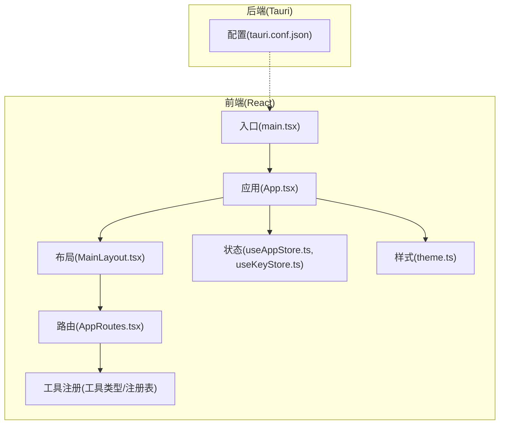
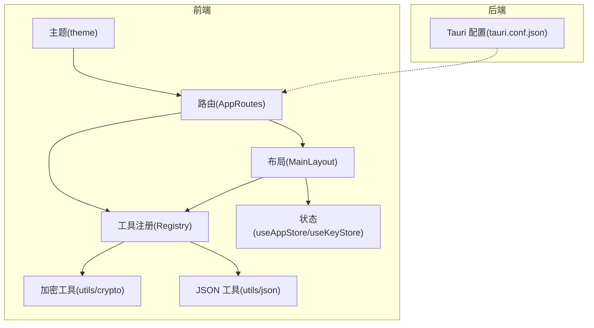
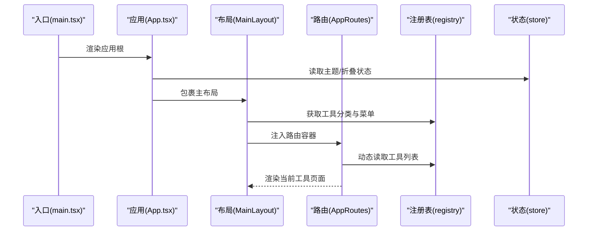
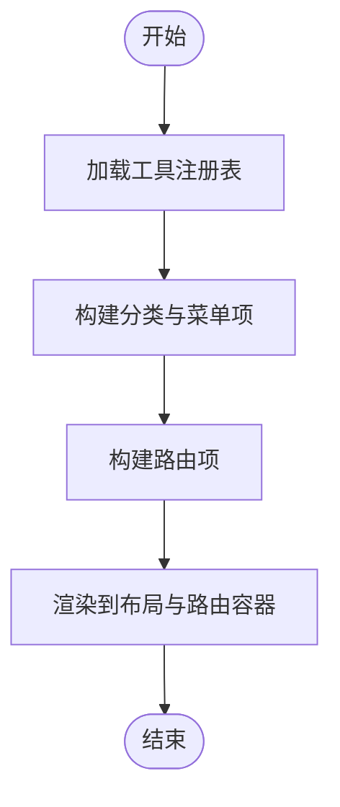
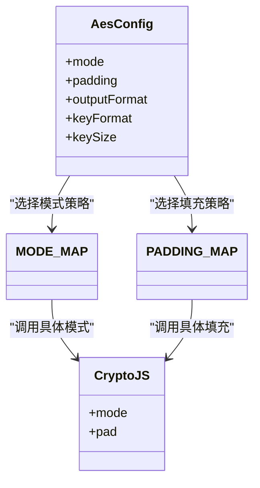
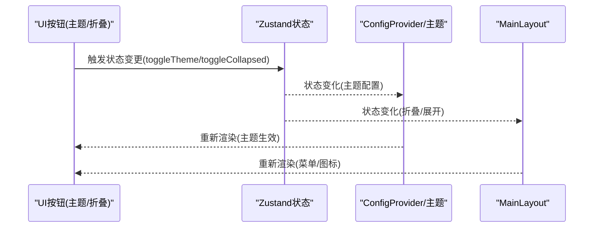
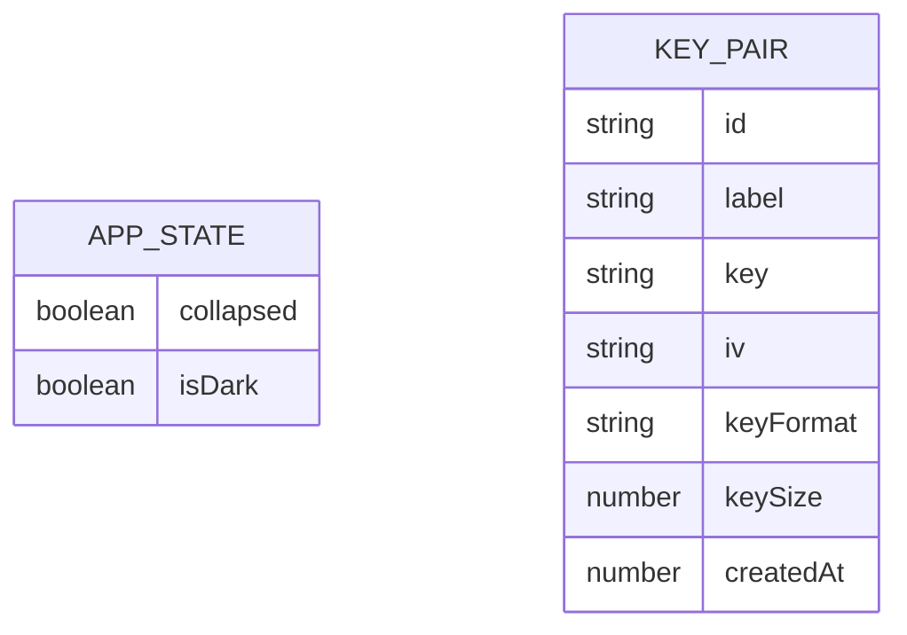
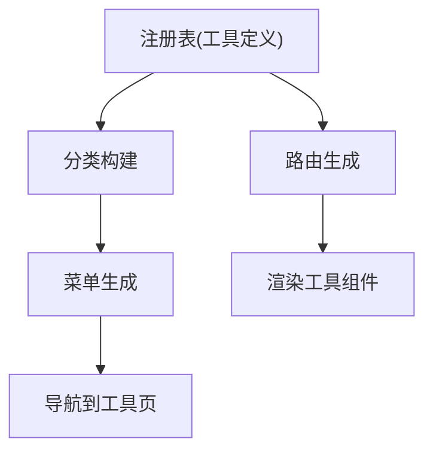
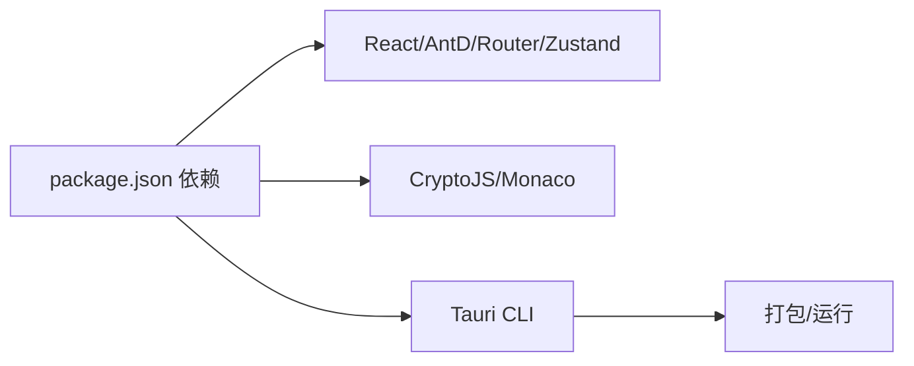

# 架构设计

<cite>
**本文引用的文件**
- [src/main.tsx](file://src/main.tsx)
- [src/App.tsx](file://src/App.tsx)
- [src/routes.tsx](file://src/routes.tsx)
- [src/layouts/MainLayout.tsx](file://src/layouts/MainLayout.tsx)
- [src/store/useAppStore.ts](file://src/store/useAppStore.ts)
- [src/store/useKeyStore.ts](file://src/store/useKeyStore.ts)
- [src/tools/registry.ts](file://src/tools/registry.ts)
- [src/tools/types.ts](file://src/tools/types.ts)
- [src/utils/crypto.ts](file://src/utils/crypto.ts)
- [src/utils/json.ts](file://src/utils/json.ts)
- [src/styles/theme.ts](file://src/styles/theme.ts)
- [package.json](file://package.json)
- [src-tauri/tauri.conf.json](file://src-tauri/tauri.conf.json)
</cite>

## 目录
1. [引言](#引言)
2. [项目结构](#项目结构)
3. [核心组件](#核心组件)
4. [架构总览](#架构总览)
5. [详细组件分析](#详细组件分析)
6. [依赖分析](#依赖分析)
7. [性能考虑](#性能考虑)
8. [故障排查指南](#故障排查指南)
9. [结论](#结论)
10. [附录](#附录)

## 引言
本文件为 XKUtil 的架构设计文档，面向前端 React 应用与 Tauri 后端集成的整体设计。重点阐述模块化架构、状态管理、路由系统、工具注册机制、以及在实际组件中体现的设计模式（工厂、策略、观察者）。文档同时给出架构图、组件关系图与数据流示意，并提供性能与可扩展性建议。

## 项目结构
XKUtil 采用前后端一体化的 Tauri 架构：前端使用 Vite + React + TypeScript，后端使用 Rust + Tauri，通过 CLI 与配置桥接开发与构建流程。前端代码位于 src 目录，后端位于 src-tauri 目录；工具以“功能域”组织，便于扩展与维护。

**图表来源**
- [src/main.tsx:1-11](file://src/main.tsx#L1-L11)
- [src/App.tsx:1-24](file://src/App.tsx#L1-L24)
- [src/layouts/MainLayout.tsx:1-168](file://src/layouts/MainLayout.tsx#L1-L168)
- [src/routes.tsx:1-29](file://src/routes.tsx#L1-L29)
- [src/store/useAppStore.ts:1-24](file://src/store/useAppStore.ts#L1-L24)
- [src/store/useKeyStore.ts:1-47](file://src/store/useKeyStore.ts#L1-L47)
- [src/styles/theme.ts:1-12](file://src/styles/theme.ts#L1-L12)
- [src/tools/registry.ts:1-39](file://src/tools/registry.ts#L1-L39)
- [src-tauri/tauri.conf.json:1-39](file://src-tauri/tauri.conf.json#L1-L39)

**章节来源**
- [src/main.tsx:1-11](file://src/main.tsx#L1-L11)
- [src/App.tsx:1-24](file://src/App.tsx#L1-L24)
- [src/routes.tsx:1-29](file://src/routes.tsx#L1-L29)
- [src/layouts/MainLayout.tsx:1-168](file://src/layouts/MainLayout.tsx#L1-L168)
- [src/store/useAppStore.ts:1-24](file://src/store/useAppStore.ts#L1-L24)
- [src/store/useKeyStore.ts:1-47](file://src/store/useKeyStore.ts#L1-L47)
- [src/styles/theme.ts:1-12](file://src/styles/theme.ts#L1-L12)
- [src/tools/registry.ts:1-39](file://src/tools/registry.ts#L1-L39)
- [package.json:1-36](file://package.json#L1-L36)
- [src-tauri/tauri.conf.json:1-39](file://src-tauri/tauri.conf.json#L1-L39)

## 核心组件
- 入口与应用根
  - 入口负责挂载 React 应用，引入全局样式。
  - 应用根负责主题配置、国际化、路由容器与主布局包裹。
- 路由系统
  - 基于 React Router 的 HashRouter，动态从注册表生成路由项，支持懒加载与统一兜底。
- 状态管理
  - 使用 Zustand 提供轻量级状态：应用设置（主题/侧边栏折叠）与密钥存储（持久化）。
- 布局与导航
  - 主布局包含侧边栏菜单、顶部工具栏与内容区，菜单项来自工具注册表分类。
- 工具注册与类型
  - 工具定义与分类通过注册表聚合，统一暴露给路由与菜单。
- 工具能力
  - 加密工具与 JSON 工具分别提供算法封装与解析统计等能力。
- 主题系统
  - 基于 Ant Design 主题算法切换明暗主题。

**章节来源**
- [src/main.tsx:1-11](file://src/main.tsx#L1-L11)
- [src/App.tsx:1-24](file://src/App.tsx#L1-L24)
- [src/routes.tsx:1-29](file://src/routes.tsx#L1-L29)
- [src/layouts/MainLayout.tsx:1-168](file://src/layouts/MainLayout.tsx#L1-L168)
- [src/store/useAppStore.ts:1-24](file://src/store/useAppStore.ts#L1-L24)
- [src/store/useKeyStore.ts:1-47](file://src/store/useKeyStore.ts#L1-L47)
- [src/tools/registry.ts:1-39](file://src/tools/registry.ts#L1-L39)
- [src/tools/types.ts:1-20](file://src/tools/types.ts#L1-L20)
- [src/utils/crypto.ts:1-222](file://src/utils/crypto.ts#L1-L222)
- [src/utils/json.ts:1-116](file://src/utils/json.ts#L1-L116)
- [src/styles/theme.ts:1-12](file://src/styles/theme.ts#L1-L12)

## 架构总览
XKUtil 采用“前端模块化 + 后端原生能力”的混合架构。前端通过 Vite 构建，运行于 Tauri 窗口中；后端通过 CLI 与配置桥接开发与打包流程。工具以“功能域”组织，注册表统一管理，路由按工具动态生成，状态通过 Zustand 管理并在本地持久化。

**图表来源**
- [src/routes.tsx:1-29](file://src/routes.tsx#L1-L29)
- [src/layouts/MainLayout.tsx:1-168](file://src/layouts/MainLayout.tsx#L1-L168)
- [src/store/useAppStore.ts:1-24](file://src/store/useAppStore.ts#L1-L24)
- [src/store/useKeyStore.ts:1-47](file://src/store/useKeyStore.ts#L1-L47)
- [src/styles/theme.ts:1-12](file://src/styles/theme.ts#L1-L12)
- [src/tools/registry.ts:1-39](file://src/tools/registry.ts#L1-L39)
- [src/utils/crypto.ts:1-222](file://src/utils/crypto.ts#L1-L222)
- [src/utils/json.ts:1-116](file://src/utils/json.ts#L1-L116)
- [src-tauri/tauri.conf.json:1-39](file://src-tauri/tauri.conf.json#L1-L39)

## 详细组件分析

### 组件关系与交互
- 应用启动链路
  - 入口渲染应用根，应用根初始化主题与国际化，注入路由容器与主布局。
  - 主布局读取工具注册表生成菜单，响应用户点击导航到对应工具页面。
  - 路由根据注册表动态生成路径与组件，支持统一兜底与加载态。
- 状态与主题
  - 应用设置（主题/折叠）与密钥列表（持久化）通过 Zustand 管理，跨组件共享。
  - 主题配置基于 Ant Design 的算法切换，影响全局 UI 渲染。
- 工具注册与路由
  - 注册表聚合所有工具，按分类构建菜单；路由按工具定义生成路径与组件。
  - 工具内部可复用通用编辑器、对话框等 UI 组件，保持一致性。

**图表来源**
- [src/main.tsx:1-11](file://src/main.tsx#L1-L11)
- [src/App.tsx:1-24](file://src/App.tsx#L1-L24)
- [src/layouts/MainLayout.tsx:1-168](file://src/layouts/MainLayout.tsx#L1-L168)
- [src/routes.tsx:1-29](file://src/routes.tsx#L1-L29)
- [src/tools/registry.ts:1-39](file://src/tools/registry.ts#L1-L39)
- [src/store/useAppStore.ts:1-24](file://src/store/useAppStore.ts#L1-L24)

**章节来源**
- [src/main.tsx:1-11](file://src/main.tsx#L1-L11)
- [src/App.tsx:1-24](file://src/App.tsx#L1-L24)
- [src/layouts/MainLayout.tsx:1-168](file://src/layouts/MainLayout.tsx#L1-L168)
- [src/routes.tsx:1-29](file://src/routes.tsx#L1-L29)
- [src/tools/registry.ts:1-39](file://src/tools/registry.ts#L1-L39)
- [src/store/useAppStore.ts:1-24](file://src/store/useAppStore.ts#L1-L24)

### 设计模式应用

#### 工厂模式
- 工具组件的动态生成体现了“工厂模式”思想：注册表集中声明工具元信息，路由工厂根据元信息创建路由项与菜单项，避免硬编码路径与组件映射。
- 关键点
  - 工具定义集中于注册表，新增工具只需扩展定义，无需修改路由与菜单逻辑。
  - 路由工厂通过遍历工具集合生成路由，保证一致性与可扩展性。

**图表来源**
- [src/tools/registry.ts:1-39](file://src/tools/registry.ts#L1-L39)
- [src/routes.tsx:1-29](file://src/routes.tsx#L1-L29)
- [src/layouts/MainLayout.tsx:1-168](file://src/layouts/MainLayout.tsx#L1-L168)

**章节来源**
- [src/tools/registry.ts:1-39](file://src/tools/registry.ts#L1-L39)
- [src/routes.tsx:1-29](file://src/routes.tsx#L1-L29)
- [src/layouts/MainLayout.tsx:1-168](file://src/layouts/MainLayout.tsx#L1-L168)

#### 策略模式
- 加密工具中的 AES 模式与填充策略通过映射表进行选择，形成“策略对象”，在运行时根据配置切换不同模式/填充，实现算法参数化。
- 关键点
  - 模式映射与填充映射作为策略表，避免在业务函数中分散判断。
  - 配置对象统一传递策略参数，提升可测试性与可维护性。

**图表来源**
- [src/utils/crypto.ts:1-222](file://src/utils/crypto.ts#L1-L222)

**章节来源**
- [src/utils/crypto.ts:1-222](file://src/utils/crypto.ts#L1-L222)

#### 观察者模式
- 主题切换与侧边栏折叠通过状态驱动 UI 更新，体现“观察者模式”：状态变更触发订阅组件重新渲染，无需手动广播。
- 关键点
  - Zustand store 中的状态变化自动通知订阅者。
  - 主题配置与菜单项选择均受状态驱动，保持 UI 一致性。

**图表来源**
- [src/store/useAppStore.ts:1-24](file://src/store/useAppStore.ts#L1-L24)
- [src/App.tsx:1-24](file://src/App.tsx#L1-L24)
- [src/layouts/MainLayout.tsx:1-168](file://src/layouts/MainLayout.tsx#L1-L168)
- [src/styles/theme.ts:1-12](file://src/styles/theme.ts#L1-L12)

**章节来源**
- [src/store/useAppStore.ts:1-24](file://src/store/useAppStore.ts#L1-L24)
- [src/App.tsx:1-24](file://src/App.tsx#L1-L24)
- [src/layouts/MainLayout.tsx:1-168](file://src/layouts/MainLayout.tsx#L1-L168)
- [src/styles/theme.ts:1-12](file://src/styles/theme.ts#L1-L12)

### 数据模型与数据流

#### 状态模型
- 应用状态
  - 折叠状态、主题状态、切换动作。
- 密钥存储状态
  - 密钥对列表、增删改操作、持久化存储。

**图表来源**
- [src/store/useAppStore.ts:1-24](file://src/store/useAppStore.ts#L1-L24)
- [src/store/useKeyStore.ts:1-47](file://src/store/useKeyStore.ts#L1-L47)

**章节来源**
- [src/store/useAppStore.ts:1-24](file://src/store/useAppStore.ts#L1-L24)
- [src/store/useKeyStore.ts:1-47](file://src/store/useKeyStore.ts#L1-L47)

#### 工具注册与路由数据流
- 注册表聚合工具定义，路由按工具生成路径与组件，菜单按分类展开。
- 菜单点击触发导航，路由渲染对应工具页面。

**图表来源**
- [src/tools/registry.ts:1-39](file://src/tools/registry.ts#L1-L39)
- [src/routes.tsx:1-29](file://src/routes.tsx#L1-L29)
- [src/layouts/MainLayout.tsx:1-168](file://src/layouts/MainLayout.tsx#L1-L168)

**章节来源**
- [src/tools/registry.ts:1-39](file://src/tools/registry.ts#L1-L39)
- [src/routes.tsx:1-29](file://src/routes.tsx#L1-L29)
- [src/layouts/MainLayout.tsx:1-168](file://src/layouts/MainLayout.tsx#L1-L168)

## 依赖分析
- 前端依赖
  - React 生态、Ant Design UI、路由、状态管理、加密库、Monaco 编辑器等。
- 后端依赖
  - Tauri CLI、插件（剪贴板、对话框、文件系统）等。
- 构建与运行
  - Vite 构建前端产物，Tauri 打包并注入前端静态资源；开发时通过 CLI 自动同步。

**图表来源**
- [package.json:1-36](file://package.json#L1-L36)
- [src-tauri/tauri.conf.json:1-39](file://src-tauri/tauri.conf.json#L1-L39)

**章节来源**
- [package.json:1-36](file://package.json#L1-L36)
- [src-tauri/tauri.conf.json:1-39](file://src-tauri/tauri.conf.json#L1-L39)

## 性能考虑
- 路由与渲染
  - 使用 Suspense 与按需加载，减少首屏压力；路由按工具动态生成，避免冗余路由。
- 状态管理
  - Zustand 无样板代码，按需订阅，避免全局重渲染；持久化仅保存必要字段。
- 图标与主题
  - Ant Design 主题算法按需切换，避免重复计算；图标按需引入。
- 加密与 JSON
  - 加密前进行长度校验，减少无效计算；JSON 解析与统计递归处理注意大数据量场景的栈深限制。
- 可扩展性
  - 工具注册表与类型定义清晰，新增工具只需扩展定义与实现，不影响现有路由与布局。
- Tauri 集成
  - 通过 CLI 与配置桥接开发与构建，便于多平台打包与权限控制。

[本节为通用指导，无需列出章节来源]

## 故障排查指南
- 路由无法跳转
  - 检查工具注册表是否包含目标工具；确认路径与组件定义一致。
- 主题切换无效
  - 检查主题配置是否正确传入 ConfigProvider；确认状态变更是否触发重新渲染。
- 加密/解密失败
  - 校验密钥与 IV 长度格式；检查输出格式与模式/填充配置是否匹配。
- JSON 解析报错
  - 查看错误位置信息定位问题；确认输入是否为合法 JSON。
- Tauri 开发调试
  - 确认开发命令与前端端口一致；检查打包路径与前端产物目录。

**章节来源**
- [src/routes.tsx:1-29](file://src/routes.tsx#L1-L29)
- [src/App.tsx:1-24](file://src/App.tsx#L1-L24)
- [src/utils/crypto.ts:1-222](file://src/utils/crypto.ts#L1-L222)
- [src/utils/json.ts:1-116](file://src/utils/json.ts#L1-L116)
- [src-tauri/tauri.conf.json:1-39](file://src-tauri/tauri.conf.json#L1-L39)

## 结论
XKUtil 采用模块化与注册表驱动的架构，结合工厂、策略与观察者模式，实现了高内聚、低耦合且易于扩展的前端应用。通过 Zustand 管理状态与持久化，配合 Ant Design 主题系统，提供了良好的用户体验。Tauri 的集成使应用具备跨平台与原生能力的潜力。未来可在工具能力上进一步抽象公共组件与服务层，完善错误边界与性能监控，持续提升可维护性与稳定性。

[本节为总结性内容，无需列出章节来源]

## 附录
- 关键实现参考路径
  - 应用入口与根组件：[src/main.tsx:1-11](file://src/main.tsx#L1-L11)、[src/App.tsx:1-24](file://src/App.tsx#L1-L24)
  - 路由与菜单：[src/routes.tsx:1-29](file://src/routes.tsx#L1-L29)、[src/layouts/MainLayout.tsx:1-168](file://src/layouts/MainLayout.tsx#L1-L168)
  - 状态与主题：[src/store/useAppStore.ts:1-24](file://src/store/useAppStore.ts#L1-L24)、[src/styles/theme.ts:1-12](file://src/styles/theme.ts#L1-L12)
  - 工具注册与类型：[src/tools/registry.ts:1-39](file://src/tools/registry.ts#L1-L39)、[src/tools/types.ts:1-20](file://src/tools/types.ts#L1-L20)
  - 加密与 JSON 工具：[src/utils/crypto.ts:1-222](file://src/utils/crypto.ts#L1-L222)、[src/utils/json.ts:1-116](file://src/utils/json.ts#L1-L116)
  - Tauri 配置：[src-tauri/tauri.conf.json:1-39](file://src-tauri/tauri.conf.json#L1-L39)

[本节为补充信息，无需列出章节来源]