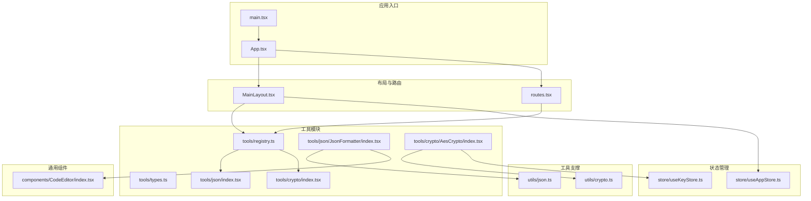
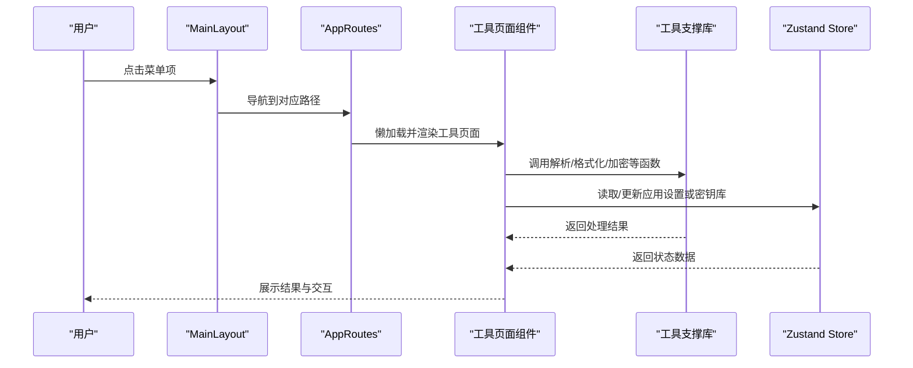
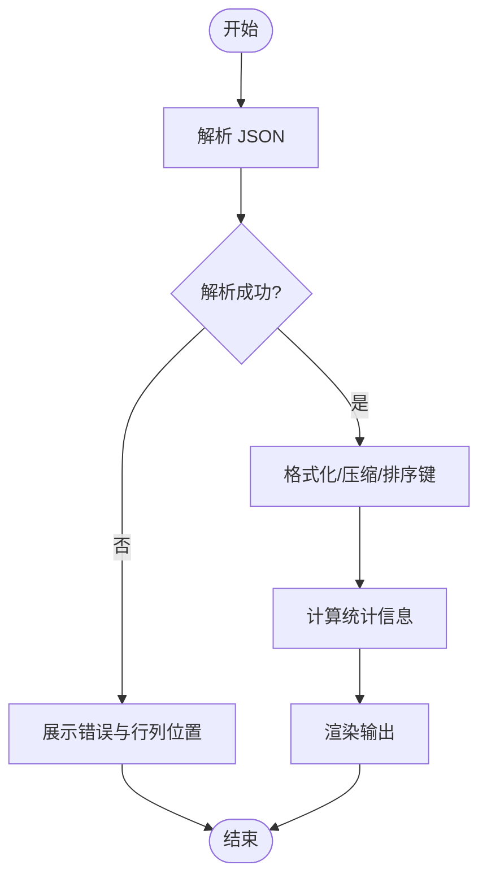
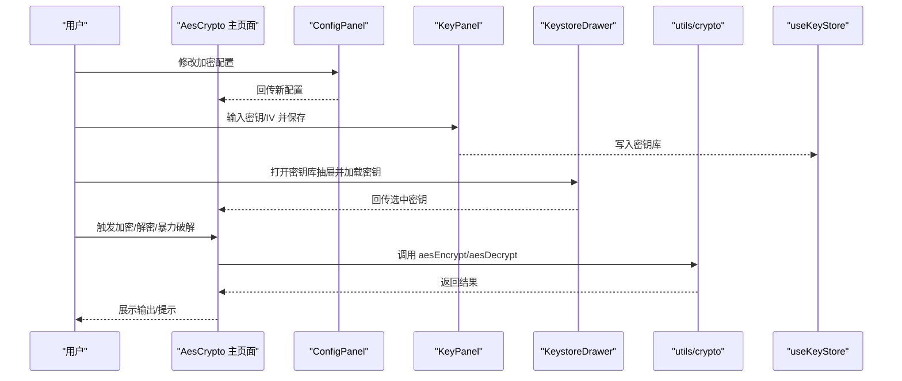
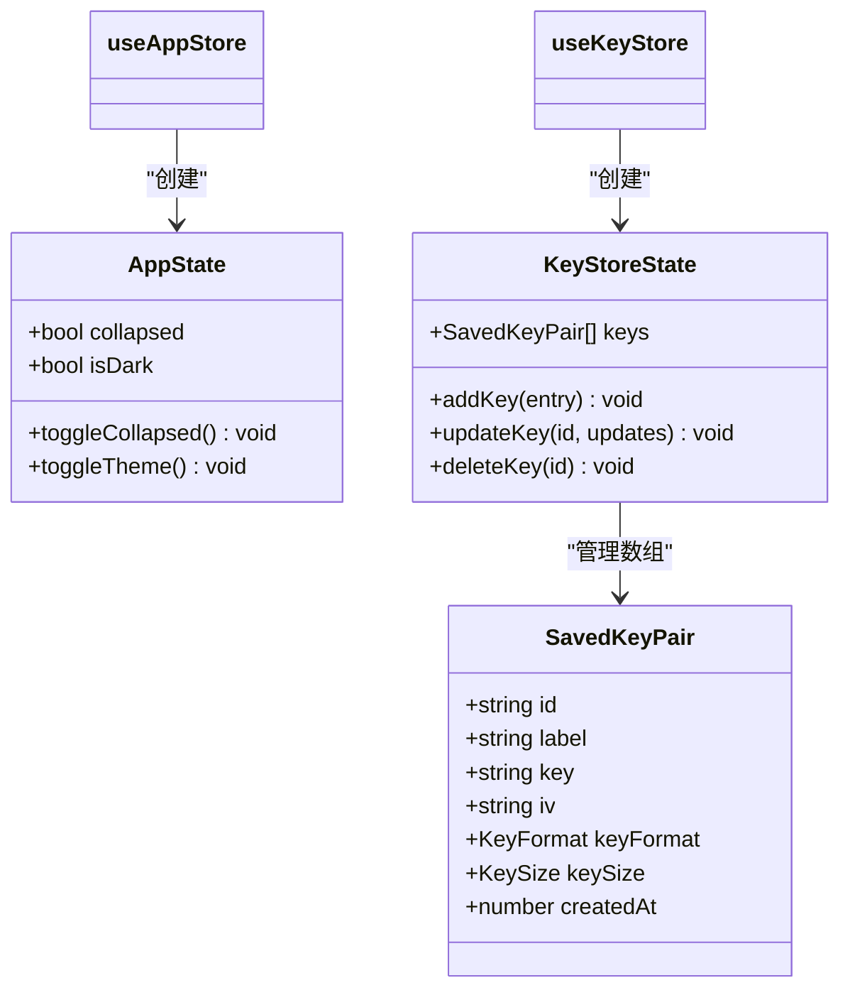
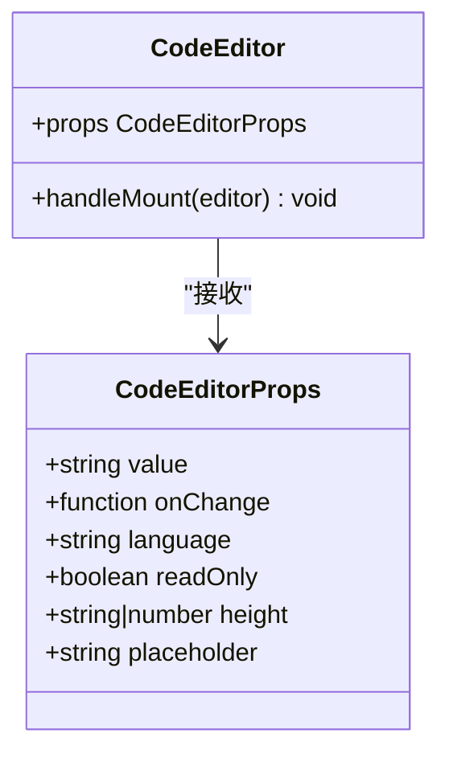
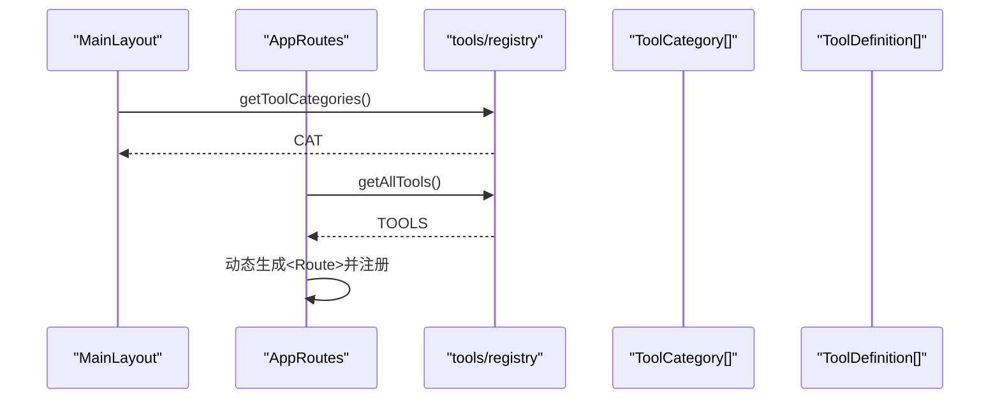
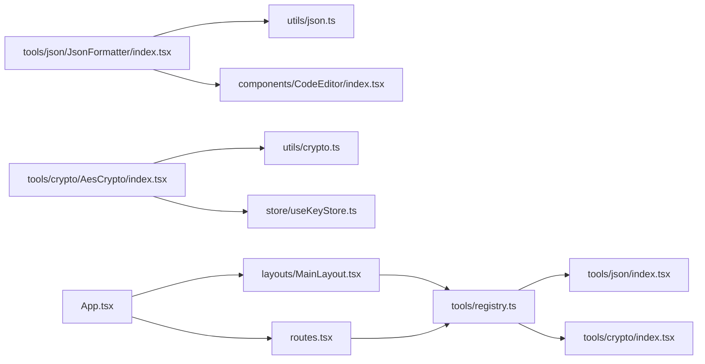

# 模块化设计

<cite>
**本文引用的文件**
- [src/tools/registry.ts](file://src/tools/registry.ts)
- [src/tools/types.ts](file://src/tools/types.ts)
- [src/tools/json/index.tsx](file://src/tools/json/index.tsx)
- [src/tools/crypto/index.tsx](file://src/tools/crypto/index.tsx)
- [src/utils/crypto.ts](file://src/utils/crypto.ts)
- [src/utils/json.ts](file://src/utils/json.ts)
- [src/store/useAppStore.ts](file://src/store/useAppStore.ts)
- [src/store/useKeyStore.ts](file://src/store/useKeyStore.ts)
- [src/components/CodeEditor/index.tsx](file://src/components/CodeEditor/index.tsx)
- [src/layouts/MainLayout.tsx](file://src/layouts/MainLayout.tsx)
- [src/routes.tsx](file://src/routes.tsx)
- [src/App.tsx](file://src/App.tsx)
- [src/main.tsx](file://src/main.tsx)
- [src/tools/crypto/AesCrypto/index.tsx](file://src/tools/crypto/AesCrypto/index.tsx)
- [src/tools/crypto/AesCrypto/ConfigPanel.tsx](file://src/tools/crypto/AesCrypto/ConfigPanel.tsx)
- [src/tools/crypto/AesCrypto/KeystoreDrawer.tsx](file://src/tools/crypto/AesCrypto/KeystoreDrawer.tsx)
- [src/tools/json/JsonFormatter/index.tsx](file://src/tools/json/JsonFormatter/index.tsx)
- [package.json](file://package.json)
</cite>

## 目录
1. [引言](#引言)
2. [项目结构](#项目结构)
3. [核心组件](#核心组件)
4. [架构总览](#架构总览)
5. [详细组件分析](#详细组件分析)
6. [依赖分析](#依赖分析)
7. [性能考虑](#性能考虑)
8. [故障排查指南](#故障排查指南)
9. [结论](#结论)
10. [附录](#附录)

## 引言
本设计文档围绕 XKUtil 的模块化架构展开，系统性阐述工具模块、状态管理模块与组件模块的划分原则、设计思路与职责边界，并通过模块依赖图与交互示例展示如何实现松耦合与高内聚。同时给出命名规范与扩展最佳实践，帮助开发者在现有架构上安全地新增工具与功能。

## 项目结构
XKUtil 采用“按功能域分层”的模块组织方式：
- 工具模块：位于 src/tools 下，按领域拆分（如 JSON、加密），每个工具以独立目录承载其页面组件与子功能组件。
- 工具支撑模块：位于 src/utils，封装纯函数与算法，如 JSON 解析/格式化、AES 加密/解密等。
- 状态管理模块：位于 src/store，使用 Zustand 管理应用设置与密钥库数据。
- 组件模块：位于 src/components，提供可复用 UI 组件（如代码编辑器）。
- 布局与路由：位于 src/layouts 与 src/routes.tsx，负责导航菜单生成与页面路由注册。
- 应用入口：src/main.tsx 与 src/App.tsx 负责初始化与主题配置。

图表来源
- [src/main.tsx:1-11](file://src/main.tsx#L1-L11)
- [src/App.tsx:1-24](file://src/App.tsx#L1-L24)
- [src/layouts/MainLayout.tsx:1-168](file://src/layouts/MainLayout.tsx#L1-L168)
- [src/routes.tsx:1-29](file://src/routes.tsx#L1-L29)
- [src/tools/registry.ts:1-39](file://src/tools/registry.ts#L1-L39)
- [src/tools/types.ts:1-20](file://src/tools/types.ts#L1-L20)
- [src/tools/json/index.tsx:1-27](file://src/tools/json/index.tsx#L1-L27)
- [src/tools/crypto/index.tsx:1-17](file://src/tools/crypto/index.tsx#L1-L17)
- [src/tools/json/JsonFormatter/index.tsx:1-267](file://src/tools/json/JsonFormatter/index.tsx#L1-L267)
- [src/tools/crypto/AesCrypto/index.tsx:1-310](file://src/tools/crypto/AesCrypto/index.tsx#L1-L310)
- [src/utils/json.ts:1-116](file://src/utils/json.ts#L1-L116)
- [src/utils/crypto.ts:1-222](file://src/utils/crypto.ts#L1-L222)
- [src/store/useAppStore.ts:1-24](file://src/store/useAppStore.ts#L1-L24)
- [src/store/useKeyStore.ts:1-47](file://src/store/useKeyStore.ts#L1-L47)
- [src/components/CodeEditor/index.tsx:1-57](file://src/components/CodeEditor/index.tsx#L1-L57)

章节来源
- [src/main.tsx:1-11](file://src/main.tsx#L1-L11)
- [src/App.tsx:1-24](file://src/App.tsx#L1-L24)
- [src/layouts/MainLayout.tsx:1-168](file://src/layouts/MainLayout.tsx#L1-L168)
- [src/routes.tsx:1-29](file://src/routes.tsx#L1-L29)

## 核心组件
- 工具注册中心：集中收集与分类所有工具，提供分类聚合与全量查询能力，避免路由与菜单硬编码。
- 工具定义模型：统一工具元数据结构，包含标识、名称、描述、分类、图标、路径与懒加载组件。
- 工具集合：按领域拆分（JSON、加密），每个领域导出该领域的工具清单。
- 工具支撑库：纯函数与算法封装，如 JSON 解析/格式化、AES 加密/解密、密钥校验与随机生成。
- 状态管理：应用设置（侧边栏折叠、主题）、密钥库（增删改查、持久化）。
- 通用组件：代码编辑器，提供统一的 Monaco 编辑器配置与暗色/亮色主题适配。
- 布局与路由：主布局负责菜单生成与主题切换；路由根据工具清单动态注册页面。

章节来源
- [src/tools/registry.ts:1-39](file://src/tools/registry.ts#L1-L39)
- [src/tools/types.ts:1-20](file://src/tools/types.ts#L1-L20)
- [src/tools/json/index.tsx:1-27](file://src/tools/json/index.tsx#L1-L27)
- [src/tools/crypto/index.tsx:1-17](file://src/tools/crypto/index.tsx#L1-L17)
- [src/utils/json.ts:1-116](file://src/utils/json.ts#L1-L116)
- [src/utils/crypto.ts:1-222](file://src/utils/crypto.ts#L1-L222)
- [src/store/useAppStore.ts:1-24](file://src/store/useAppStore.ts#L1-L24)
- [src/store/useKeyStore.ts:1-47](file://src/store/useKeyStore.ts#L1-L47)
- [src/components/CodeEditor/index.tsx:1-57](file://src/components/CodeEditor/index.tsx#L1-L57)

## 架构总览
XKUtil 的模块化架构遵循“自顶向下”设计：
- 应用入口负责初始化与主题配置。
- 布局层负责菜单生成与主题切换，菜单项来源于工具注册中心。
- 路由层根据工具清单动态渲染页面，页面组件按需懒加载。
- 工具页面组件通过工具支撑库完成业务逻辑，必要时访问状态管理模块。
- 通用组件被工具页面复用，降低重复开发成本。

图表来源
- [src/layouts/MainLayout.tsx:41-43](file://src/layouts/MainLayout.tsx#L41-L43)
- [src/routes.tsx:17-25](file://src/routes.tsx#L17-L25)
- [src/tools/json/JsonFormatter/index.tsx:53-78](file://src/tools/json/JsonFormatter/index.tsx#L53-L78)
- [src/tools/crypto/AesCrypto/index.tsx:55-85](file://src/tools/crypto/AesCrypto/index.tsx#L55-L85)
- [src/utils/json.ts:14-38](file://src/utils/json.ts#L14-L38)
- [src/utils/crypto.ts:59-105](file://src/utils/crypto.ts#L59-L105)
- [src/store/useAppStore.ts:11-23](file://src/store/useAppStore.ts#L11-L23)
- [src/store/useKeyStore.ts:22-46](file://src/store/useKeyStore.ts#L22-L46)

## 详细组件分析

### 工具模块（JSON 工具）
- 职责边界：提供 JSON 解析、美化、压缩、验证与统计等能力，面向工具页面组件暴露纯函数。
- 设计要点：输入输出以纯函数形式传递，便于测试与复用；错误位置信息用于提升用户体验。
- 交互示例：JsonFormatter 页面调用解析/格式化/压缩函数，结合 CodeEditor 组件进行输入输出展示。

图表来源
- [src/tools/json/JsonFormatter/index.tsx:53-130](file://src/tools/json/JsonFormatter/index.tsx#L53-L130)
- [src/utils/json.ts:14-38](file://src/utils/json.ts#L14-L38)
- [src/utils/json.ts:40-52](file://src/utils/json.ts#L40-L52)
- [src/utils/json.ts:71-115](file://src/utils/json.ts#L71-L115)

章节来源
- [src/tools/json/index.tsx:1-27](file://src/tools/json/index.tsx#L1-L27)
- [src/tools/json/JsonFormatter/index.tsx:1-267](file://src/tools/json/JsonFormatter/index.tsx#L1-L267)
- [src/utils/json.ts:1-116](file://src/utils/json.ts#L1-L116)

### 工具模块（加密工具）
- 职责边界：提供 AES 加密/解密、密钥/IV 校验、暴力破解辅助、密钥库管理等能力。
- 设计要点：配置面板集中管理模式、填充、输出格式、密钥格式与长度；密钥库持久化存储；暴力破解基于密钥库逐个尝试。
- 交互示例：AesCrypto 主页面组合配置面板、密钥面板、密钥库抽屉与输入输出区域，调用工具支撑库执行加解密。

图表来源
- [src/tools/crypto/AesCrypto/index.tsx:33-155](file://src/tools/crypto/AesCrypto/index.tsx#L33-L155)
- [src/tools/crypto/AesCrypto/ConfigPanel.tsx:39-94](file://src/tools/crypto/AesCrypto/ConfigPanel.tsx#L39-L94)
- [src/tools/crypto/AesCrypto/KeystoreDrawer.tsx:26-140](file://src/tools/crypto/AesCrypto/KeystoreDrawer.tsx#L26-L140)
- [src/utils/crypto.ts:59-162](file://src/utils/crypto.ts#L59-L162)
- [src/store/useKeyStore.ts:22-46](file://src/store/useKeyStore.ts#L22-L46)

章节来源
- [src/tools/crypto/index.tsx:1-17](file://src/tools/crypto/index.tsx#L1-L17)
- [src/tools/crypto/AesCrypto/index.tsx:1-310](file://src/tools/crypto/AesCrypto/index.tsx#L1-L310)
- [src/tools/crypto/AesCrypto/ConfigPanel.tsx:1-95](file://src/tools/crypto/AesCrypto/ConfigPanel.tsx#L1-L95)
- [src/tools/crypto/AesCrypto/KeystoreDrawer.tsx:1-185](file://src/tools/crypto/AesCrypto/KeystoreDrawer.tsx#L1-L185)
- [src/utils/crypto.ts:1-222](file://src/utils/crypto.ts#L1-L222)
- [src/store/useKeyStore.ts:1-47](file://src/store/useKeyStore.ts#L1-L47)

### 状态管理模块
- 应用设置（useAppStore）：维护侧边栏折叠状态与主题切换，并持久化到本地存储。
- 密钥库（useKeyStore）：维护密钥对列表，支持增删改查与持久化，提供随机密钥/IV 生成与长度校验。

图表来源
- [src/store/useAppStore.ts:4-9](file://src/store/useAppStore.ts#L4-L9)
- [src/store/useAppStore.ts:11-23](file://src/store/useAppStore.ts#L11-L23)
- [src/store/useKeyStore.ts:5-13](file://src/store/useKeyStore.ts#L5-L13)
- [src/store/useKeyStore.ts:15-20](file://src/store/useKeyStore.ts#L15-L20)
- [src/store/useKeyStore.ts:22-46](file://src/store/useKeyStore.ts#L22-L46)

章节来源
- [src/store/useAppStore.ts:1-24](file://src/store/useAppStore.ts#L1-L24)
- [src/store/useKeyStore.ts:1-47](file://src/store/useKeyStore.ts#L1-L47)

### 组件模块（通用组件）
- CodeEditor：封装 Monaco 编辑器的基础配置与主题适配，提供只读、语言、高度等属性，供工具页面复用。

图表来源
- [src/components/CodeEditor/index.tsx:4-11](file://src/components/CodeEditor/index.tsx#L4-L11)
- [src/components/CodeEditor/index.tsx:13-34](file://src/components/CodeEditor/index.tsx#L13-L34)

章节来源
- [src/components/CodeEditor/index.tsx:1-57](file://src/components/CodeEditor/index.tsx#L1-L57)

### 布局与路由
- MainLayout：从工具注册中心读取分类与工具，生成菜单；与应用设置状态联动控制主题与侧边栏。
- AppRoutes：从工具注册中心读取全量工具，动态注册路由并提供兜底跳转。

图表来源
- [src/layouts/MainLayout.tsx:29-39](file://src/layouts/MainLayout.tsx#L29-L39)
- [src/tools/registry.ts:7-23](file://src/tools/registry.ts#L7-L23)
- [src/routes.tsx:6-25](file://src/routes.tsx#L6-L25)
- [src/tools/registry.ts:25-27](file://src/tools/registry.ts#L25-L27)

章节来源
- [src/layouts/MainLayout.tsx:1-168](file://src/layouts/MainLayout.tsx#L1-L168)
- [src/routes.tsx:1-29](file://src/routes.tsx#L1-L29)
- [src/tools/registry.ts:1-39](file://src/tools/registry.ts#L1-L39)

## 依赖分析
- 模块内聚：工具模块内部仅依赖工具支撑库与通用组件；状态管理模块仅被需要的页面组件依赖。
- 松耦合：工具注册中心作为唯一聚合点，路由与布局通过它间接依赖具体工具；工具页面通过工具支撑库与状态管理模块交互。
- 外部依赖：Zustand（状态管理）、Ant Design（UI 组件与主题）、Monaco Editor（代码编辑）、crypto-js（加密算法）。

图表来源
- [src/tools/registry.ts:1-39](file://src/tools/registry.ts#L1-L39)
- [src/tools/json/index.tsx:1-27](file://src/tools/json/index.tsx#L1-L27)
- [src/tools/crypto/index.tsx:1-17](file://src/tools/crypto/index.tsx#L1-L17)
- [src/tools/json/JsonFormatter/index.tsx:1-267](file://src/tools/json/JsonFormatter/index.tsx#L1-L267)
- [src/tools/crypto/AesCrypto/index.tsx:1-310](file://src/tools/crypto/AesCrypto/index.tsx#L1-L310)
- [src/utils/json.ts:1-116](file://src/utils/json.ts#L1-L116)
- [src/utils/crypto.ts:1-222](file://src/utils/crypto.ts#L1-L222)
- [src/components/CodeEditor/index.tsx:1-57](file://src/components/CodeEditor/index.tsx#L1-L57)
- [src/layouts/MainLayout.tsx:1-168](file://src/layouts/MainLayout.tsx#L1-L168)
- [src/routes.tsx:1-29](file://src/routes.tsx#L1-L29)
- [src/App.tsx:1-24](file://src/App.tsx#L1-L24)

章节来源
- [package.json:12-24](file://package.json#L12-L24)

## 性能考虑
- 懒加载与分割：工具页面通过懒加载与 Suspense 提升首屏性能，减少初始包体。
- 状态粒度：将应用设置与密钥库分离，避免无关状态变更触发重渲染。
- 计算优化：JSON 统计与 AES 校验在必要时才执行，避免重复计算。
- 编辑器优化：Monaco 编辑器启用自动布局与行高亮，兼顾可读性与性能。

## 故障排查指南
- JSON 工具
  - 症状：解析报错且无行列信息。
  - 排查：确认输入是否为合法 JSON；查看返回的错误位置信息定位问题。
  - 参考路径：[src/tools/json/JsonFormatter/index.tsx:60-78](file://src/tools/json/JsonFormatter/index.tsx#L60-L78)，[src/utils/json.ts:14-38](file://src/utils/json.ts#L14-L38)
- 加密工具
  - 症状：解密失败或输出为空。
  - 排查：检查密钥/IV 长度与格式；确认输出格式与模式；使用暴力破解辅助尝试密钥库中的密钥。
  - 参考路径：[src/tools/crypto/AesCrypto/index.tsx:71-112](file://src/tools/crypto/AesCrypto/index.tsx#L71-L112)，[src/utils/crypto.ts:107-162](file://src/utils/crypto.ts#L107-L162)
- 菜单与路由
  - 症状：新增工具后菜单未显示或页面无法访问。
  - 排查：确认工具已在对应领域清单中导出；确保工具定义包含正确 id/path/component；检查路由是否注册。
  - 参考路径：[src/tools/json/index.tsx:5-26](file://src/tools/json/index.tsx#L5-L26)，[src/tools/crypto/index.tsx:5-16](file://src/tools/crypto/index.tsx#L5-L16)，[src/routes.tsx:17-25](file://src/routes.tsx#L17-L25)

章节来源
- [src/tools/json/JsonFormatter/index.tsx:53-130](file://src/tools/json/JsonFormatter/index.tsx#L53-L130)
- [src/utils/json.ts:14-38](file://src/utils/json.ts#L14-L38)
- [src/tools/crypto/AesCrypto/index.tsx:71-112](file://src/tools/crypto/AesCrypto/index.tsx#L71-L112)
- [src/utils/crypto.ts:107-162](file://src/utils/crypto.ts#L107-L162)
- [src/routes.tsx:17-25](file://src/routes.tsx#L17-L25)

## 结论
XKUtil 的模块化设计通过“工具注册中心—工具清单—动态路由—页面组件—支撑库—状态管理”的链路实现了清晰的职责边界与松耦合。工具模块按领域拆分，支撑库提供纯函数能力，状态管理模块与通用组件分别承担跨页面共享状态与可复用 UI 的职责。该架构易于扩展与维护，适合持续迭代与功能拓展。

## 附录

### 命名规范
- 工具清单：领域目录下导出常量数组（如 jsonTools、cryptoTools）。
- 工具定义：统一使用 ToolDefinition 类型，包含 id、name、description、category、icon、path、component、keywords。
- 状态存储：以 useXStore 命名（如 useAppStore、useKeyStore），导出 Zustand 创建函数。
- 通用组件：以 PascalCase 命名（如 CodeEditor），导出函数式组件。
- 路由与布局：AppRoutes、MainLayout 等采用功能语义命名。

### 模块扩展最佳实践
- 新增工具步骤
  1) 在对应领域目录新增页面组件与子组件。
  2) 在领域 index 中导出新的 ToolDefinition。
  3) 在 tools/registry.ts 中合并到 allTools 并确保分类正确。
  4) 如需状态，新增对应的 Zustand 存储并在页面中按需订阅。
  5) 如需通用组件，优先复用现有组件或在 components 下新增。
- 保持纯函数与可测试性：工具支撑库尽量以纯函数形式提供能力，便于单元测试。
- 懒加载与性能：页面组件使用懒加载，避免一次性加载过多资源。
- 错误处理：在工具页面中统一展示错误信息与位置提示，提升可用性。