# 设计模式应用

<cite>
**本文档引用的文件**
- [src/tools/registry.ts](file://src/tools/registry.ts)
- [src/tools/types.ts](file://src/tools/types.ts)
- [src/tools/crypto/index.tsx](file://src/tools/crypto/index.tsx)
- [src/tools/json/index.tsx](file://src/tools/json/index.tsx)
- [src/store/useAppStore.ts](file://src/store/useAppStore.ts)
- [src/store/useKeyStore.ts](file://src/store/useKeyStore.ts)
- [src/utils/crypto.ts](file://src/utils/crypto.ts)
- [src/utils/json.ts](file://src/utils/json.ts)
- [src/App.tsx](file://src/App.tsx)
- [src/layouts/MainLayout.tsx](file://src/layouts/MainLayout.tsx)
- [src/routes.tsx](file://src/routes.tsx)
- [src/tools/crypto/AesCrypto/index.tsx](file://src/tools/crypto/AesCrypto/index.tsx)
- [src/tools/json/JsonFormatter/index.tsx](file://src/tools/json/JsonFormatter/index.tsx)
- [package.json](file://package.json)
</cite>

## 目录
1. [简介](#简介)
2. [项目结构](#项目结构)
3. [核心组件](#核心组件)
4. [架构概览](#架构概览)
5. [详细组件分析](#详细组件分析)
6. [依赖分析](#依赖分析)
7. [性能考虑](#性能考虑)
8. [故障排除指南](#故障排除指南)
9. [结论](#结论)

## 简介

XKUtil是一个基于React和Tauri构建的开发者工具箱应用，集成了多种实用工具功能。该项目在设计上充分体现了多种经典设计模式的应用，包括工厂模式、策略模式、观察者模式等，为开发者提供了良好的学习参考。

本项目通过模块化的架构设计，将不同的工具功能进行分类管理，实现了高度的可扩展性和维护性。每个工具都遵循统一的接口规范，便于添加新的工具类型和功能扩展。

## 项目结构

XKUtil采用清晰的分层架构设计，主要分为以下几个层次：

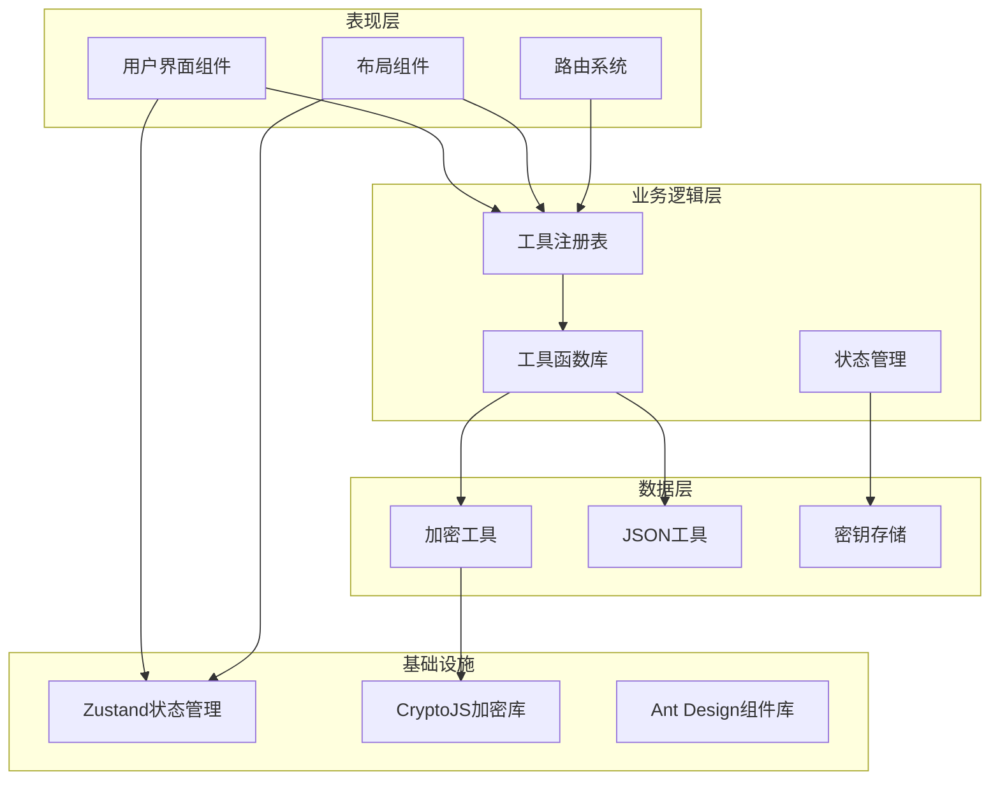

**图表来源**
- [src/App.tsx:1-24](file://src/App.tsx#L1-L24)
- [src/layouts/MainLayout.tsx:1-168](file://src/layouts/MainLayout.tsx#L1-L168)
- [src/routes.tsx:1-29](file://src/routes.tsx#L1-L29)

**章节来源**
- [src/App.tsx:1-24](file://src/App.tsx#L1-L24)
- [src/layouts/MainLayout.tsx:1-168](file://src/layouts/MainLayout.tsx#L1-L168)
- [src/routes.tsx:1-29](file://src/routes.tsx#L1-L29)

## 核心组件

### 工具注册表系统

工具注册表是整个应用的核心基础设施，采用了工厂模式的设计思想，负责统一管理和组织各类工具。

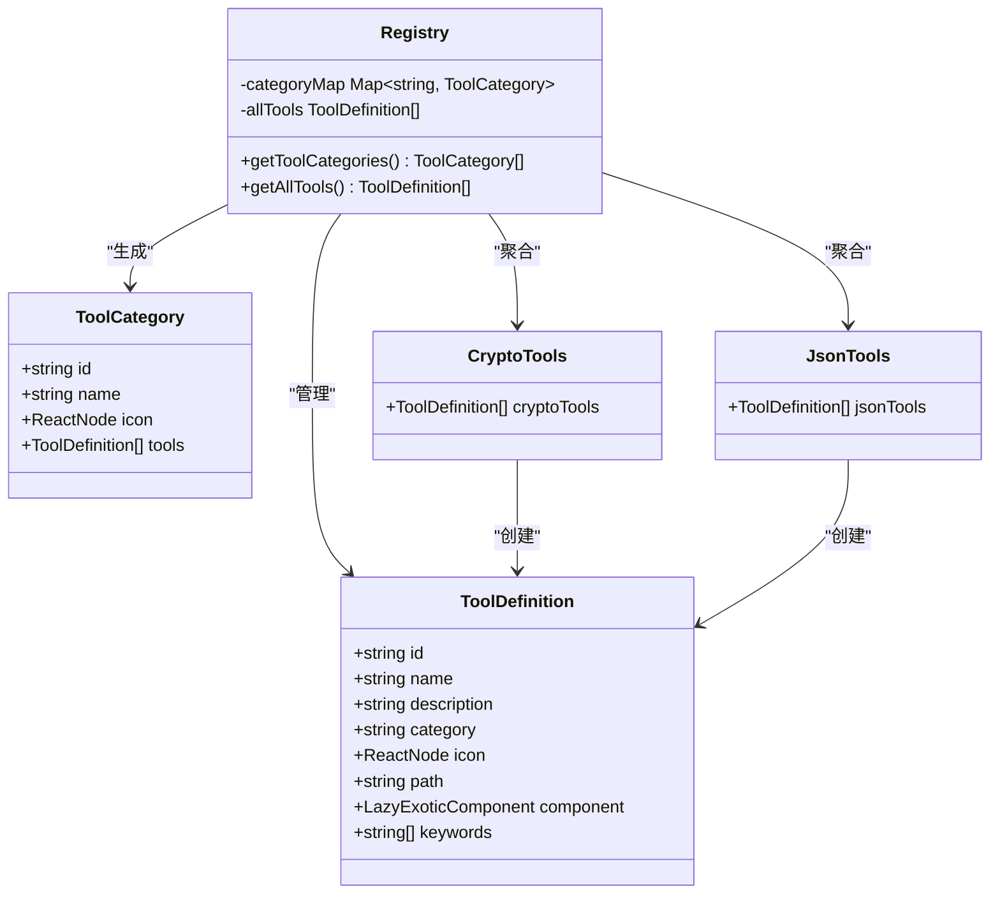

**图表来源**
- [src/tools/registry.ts:1-39](file://src/tools/registry.ts#L1-L39)
- [src/tools/types.ts:1-20](file://src/tools/types.ts#L1-L20)
- [src/tools/crypto/index.tsx:1-17](file://src/tools/crypto/index.tsx#L1-L17)
- [src/tools/json/index.tsx:1-27](file://src/tools/json/index.tsx#L1-L27)

### 状态管理系统

应用采用Zustand作为状态管理解决方案，实现了观察者模式的简化版本，提供了响应式的状态更新机制。

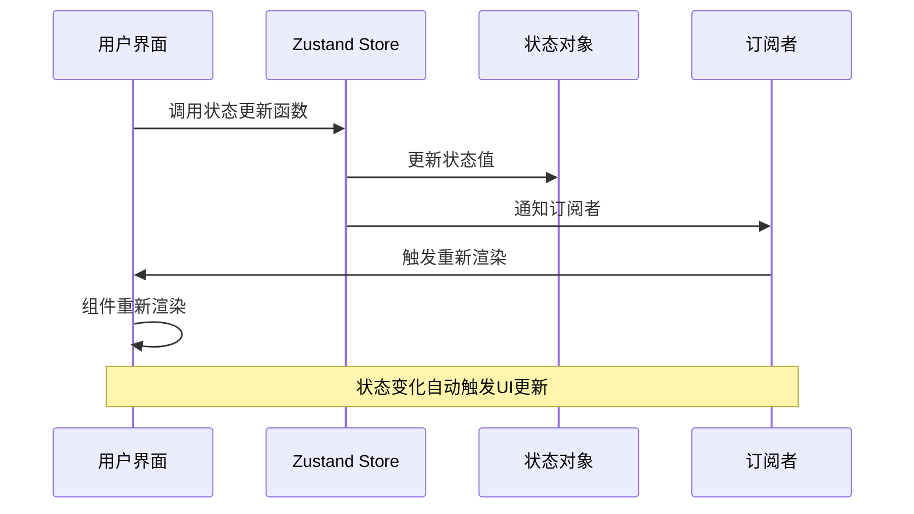

**图表来源**
- [src/store/useAppStore.ts:1-24](file://src/store/useAppStore.ts#L1-L24)
- [src/store/useKeyStore.ts:1-47](file://src/store/useKeyStore.ts#L1-L47)

**章节来源**
- [src/tools/registry.ts:1-39](file://src/tools/registry.ts#L1-L39)
- [src/tools/types.ts:1-20](file://src/tools/types.ts#L1-L20)
- [src/store/useAppStore.ts:1-24](file://src/store/useAppStore.ts#L1-L24)
- [src/store/useKeyStore.ts:1-47](file://src/store/useKeyStore.ts#L1-L47)

## 架构概览

XKUtil的整体架构体现了现代前端应用的最佳实践，通过清晰的职责分离和模块化设计，实现了高内聚低耦合的系统结构。

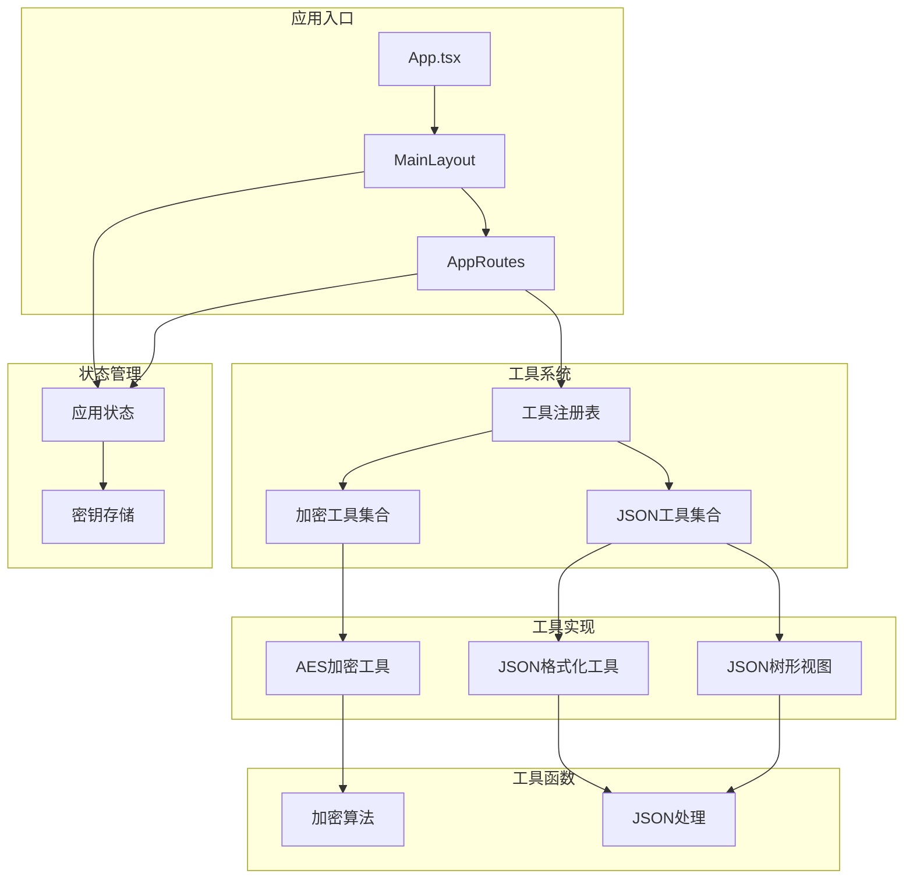

**图表来源**
- [src/App.tsx:1-24](file://src/App.tsx#L1-L24)
- [src/layouts/MainLayout.tsx:1-168](file://src/layouts/MainLayout.tsx#L1-L168)
- [src/routes.tsx:1-29](file://src/routes.tsx#L1-L29)
- [src/tools/registry.ts:1-39](file://src/tools/registry.ts#L1-L39)

## 详细组件分析

### 工厂模式：工具注册表系统

工具注册表系统是XKUtil中工厂模式的典型应用，它负责创建和管理各种工具实例。

#### 设计模式应用场景

工厂模式在以下场景中发挥重要作用：
- **工具动态加载**：通过工厂方法动态创建工具组件
- **工具分类管理**：统一管理不同类别的工具
- **配置参数封装**：将工具的配置参数封装在定义对象中

#### 实现细节分析

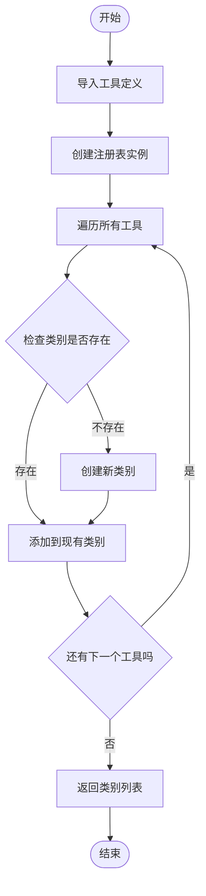

**图表来源**
- [src/tools/registry.ts:5-23](file://src/tools/registry.ts#L5-L23)

#### 工具定义接口

工具定义采用统一的接口规范，确保了工具的一致性和可扩展性：

| 属性名 | 类型 | 描述 | 必需 |
|--------|------|------|------|
| id | string | 工具唯一标识符 | 是 |
| name | string | 工具显示名称 | 是 |
| description | string | 工具功能描述 | 是 |
| category | string | 工具分类标识 | 是 |
| icon | ReactNode | 工具图标组件 | 是 |
| path | string | 路由路径 | 是 |
| component | LazyExoticComponent | 工具组件 | 是 |
| keywords | string[] | 关键词数组 | 否 |

**章节来源**
- [src/tools/registry.ts:1-39](file://src/tools/registry.ts#L1-L39)
- [src/tools/types.ts:1-20](file://src/tools/types.ts#L1-L20)

### 策略模式：工具接口实现

策略模式在XKUtil中体现为工具接口的统一抽象，使得不同的工具可以采用不同的实现策略。

#### AES加密策略实现

AES加密工具展示了策略模式的典型应用：

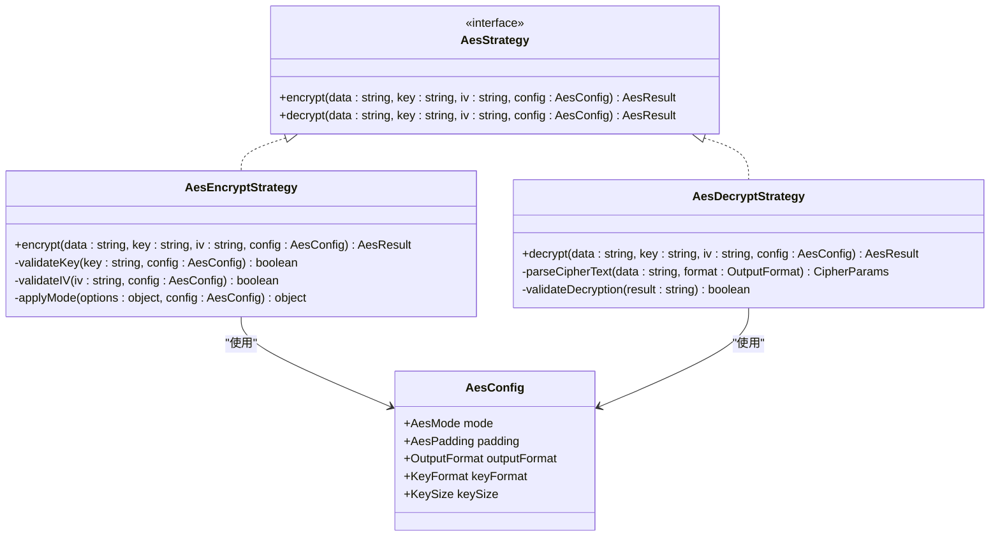

**图表来源**
- [src/utils/crypto.ts:59-162](file://src/utils/crypto.ts#L59-L162)
- [src/tools/crypto/AesCrypto/index.tsx:55-112](file://src/tools/crypto/AesCrypto/index.tsx#L55-L112)

#### JSON处理策略实现

JSON工具同样采用了策略模式的设计：

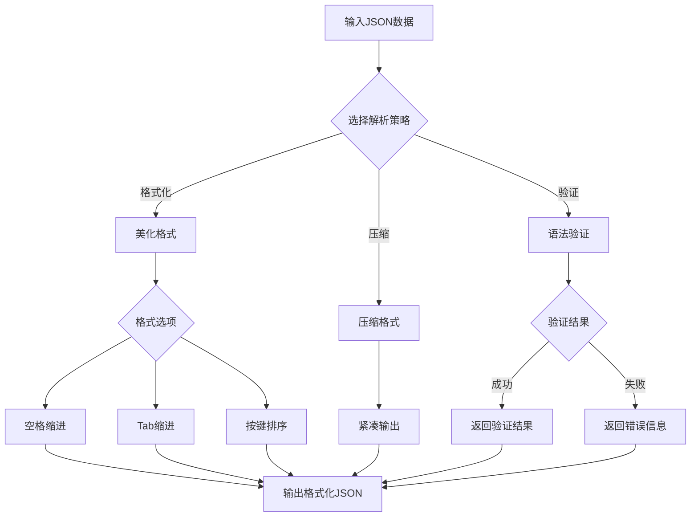

**图表来源**
- [src/utils/json.ts:14-70](file://src/utils/json.ts#L14-L70)
- [src/tools/json/JsonFormatter/index.tsx:53-130](file://src/tools/json/JsonFormatter/index.tsx#L53-L130)

**章节来源**
- [src/utils/crypto.ts:1-222](file://src/utils/crypto.ts#L1-L222)
- [src/utils/json.ts:1-116](file://src/utils/json.ts#L1-L116)
- [src/tools/crypto/AesCrypto/index.tsx:1-310](file://src/tools/crypto/AesCrypto/index.tsx#L1-L310)
- [src/tools/json/JsonFormatter/index.tsx:1-267](file://src/tools/json/JsonFormatter/index.tsx#L1-L267)

### 观察者模式：Zustand状态管理

Zustand在XKUtil中实现了观察者模式，提供了响应式的状态管理机制。

#### 应用状态管理

应用状态管理涵盖了主题切换、侧边栏折叠等功能：

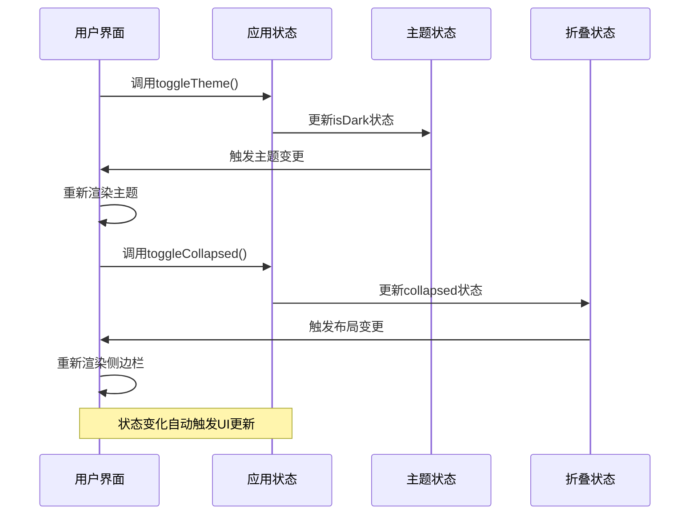

**图表来源**
- [src/store/useAppStore.ts:11-23](file://src/store/useAppStore.ts#L11-L23)
- [src/App.tsx:9-21](file://src/App.tsx#L9-L21)

#### 密钥存储状态管理

密钥存储功能展示了复杂状态管理的实现：

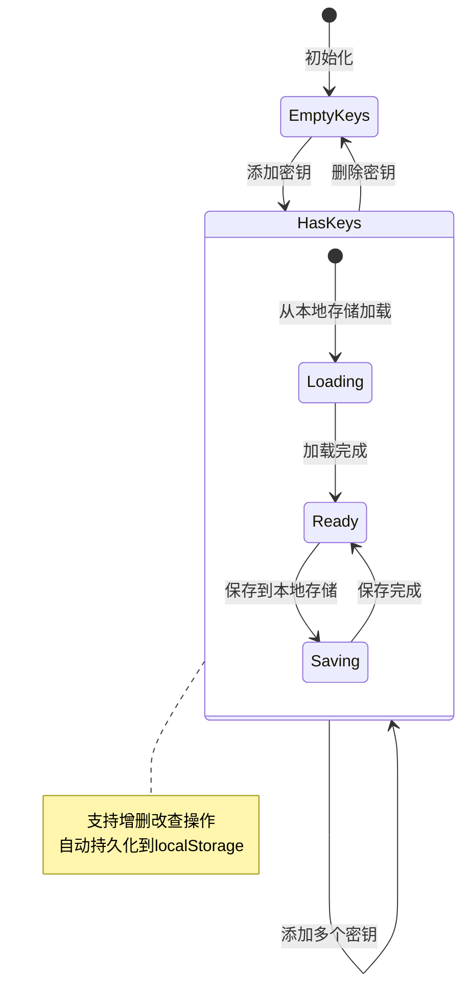

**图表来源**
- [src/store/useKeyStore.ts:22-46](file://src/store/useKeyStore.ts#L22-L46)

**章节来源**
- [src/store/useAppStore.ts:1-24](file://src/store/useAppStore.ts#L1-L24)
- [src/store/useKeyStore.ts:1-47](file://src/store/useKeyStore.ts#L1-L47)
- [src/App.tsx:1-24](file://src/App.tsx#L1-L24)

### 路由系统与动态加载

路由系统采用了懒加载和动态路由映射的设计模式：

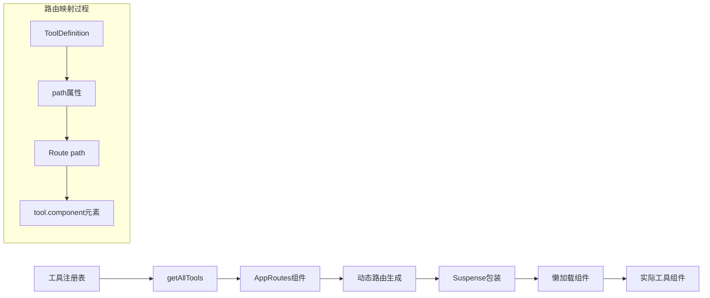

**图表来源**
- [src/routes.tsx:6-28](file://src/routes.tsx#L6-L28)
- [src/tools/registry.ts:25-27](file://src/tools/registry.ts#L25-L27)

**章节来源**
- [src/routes.tsx:1-29](file://src/routes.tsx#L1-L29)
- [src/tools/registry.ts:1-39](file://src/tools/registry.ts#L1-L39)

## 依赖分析

XKUtil的依赖关系体现了现代前端开发的最佳实践，各模块之间的耦合度较低，便于维护和扩展。

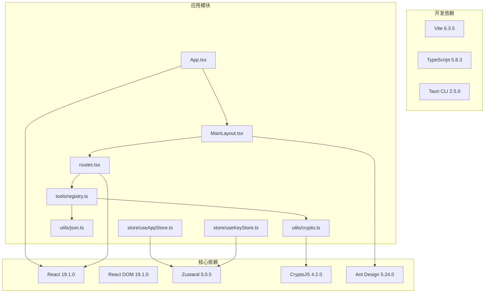

**图表来源**
- [package.json:12-34](file://package.json#L12-L34)
- [src/App.tsx:1-24](file://src/App.tsx#L1-L24)
- [src/layouts/MainLayout.tsx:1-168](file://src/layouts/MainLayout.tsx#L1-L168)

**章节来源**
- [package.json:1-36](file://package.json#L1-L36)

## 性能考虑

### 懒加载优化

项目采用了React.lazy和Suspense实现组件懒加载，有效减少了初始包体积：

- **按需加载**：工具组件仅在访问对应路由时才加载
- **预加载策略**：通过路由预加载提升用户体验
- **缓存机制**：浏览器缓存已加载的组件资源

### 状态管理优化

Zustand提供了轻量级的状态管理方案，相比Redux具有更好的性能表现：

- **原子化状态**：将状态拆分为独立的原子状态
- **选择器优化**：通过selector减少不必要的重渲染
- **持久化中间件**：自动处理状态的本地存储

### 加密算法优化

AES加密算法实现了多种优化策略：

- **内存优化**：避免重复创建WordArray对象
- **格式转换优化**：减少字符串格式转换开销
- **错误处理优化**：提前验证输入参数，避免无效计算

## 故障排除指南

### 常见问题及解决方案

#### 工具加载失败

**问题现象**：工具页面无法正常显示
**可能原因**：
- 组件懒加载失败
- 路由配置错误
- 依赖包版本冲突

**解决步骤**：
1. 检查工具组件的导出是否正确
2. 验证路由路径配置
3. 确认依赖包版本兼容性

#### 状态同步问题

**问题现象**：主题切换或布局变化不生效
**可能原因**：
- 状态订阅未正确设置
- 状态更新函数调用错误
- 组件未正确订阅状态

**解决步骤**：
1. 检查useAppStore的使用方式
2. 验证状态更新函数的调用
3. 确认组件的订阅逻辑

#### 加密解密异常

**问题现象**：AES加密解密结果异常
**可能原因**：
- 密钥格式不匹配
- IV参数错误
- 输出格式不一致

**解决步骤**：
1. 验证密钥和IV的格式
2. 检查加密配置参数
3. 确认输出格式设置

**章节来源**
- [src/tools/crypto/AesCrypto/index.tsx:55-112](file://src/tools/crypto/AesCrypto/index.tsx#L55-L112)
- [src/store/useAppStore.ts:11-23](file://src/store/useAppStore.ts#L11-L23)

## 结论

XKUtil项目成功地将多种经典设计模式应用于实际的前端开发中，展现了良好的架构设计和代码组织能力。通过工厂模式实现的工具注册表系统、策略模式的工具接口设计、以及观察者模式的状态管理，共同构成了一个高度模块化和可扩展的应用框架。

### 主要设计模式总结

1. **工厂模式**：工具注册表系统提供了统一的工具创建和管理机制
2. **策略模式**：工具接口的统一抽象支持多种实现策略
3. **观察者模式**：Zustand状态管理实现响应式状态更新
4. **懒加载模式**：组件的按需加载优化了应用性能

### 应用价值

这些设计模式的应用为开发者带来了以下价值：
- **提高代码复用性**：统一的接口规范便于代码复用
- **增强可维护性**：清晰的职责分离便于维护和修改
- **提升扩展性**：模块化设计支持功能扩展
- **优化性能**：合理的架构设计提升了应用性能

通过深入理解和应用这些设计模式，开发者可以构建更加健壮、可维护和高性能的前端应用。