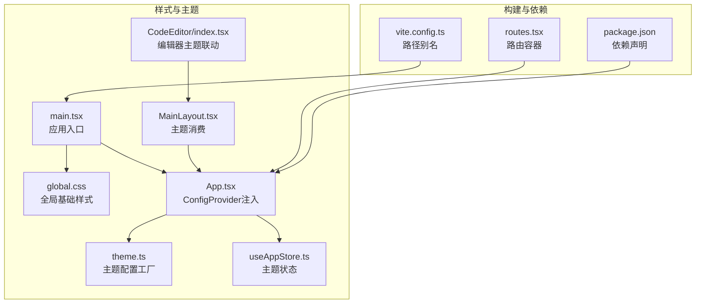
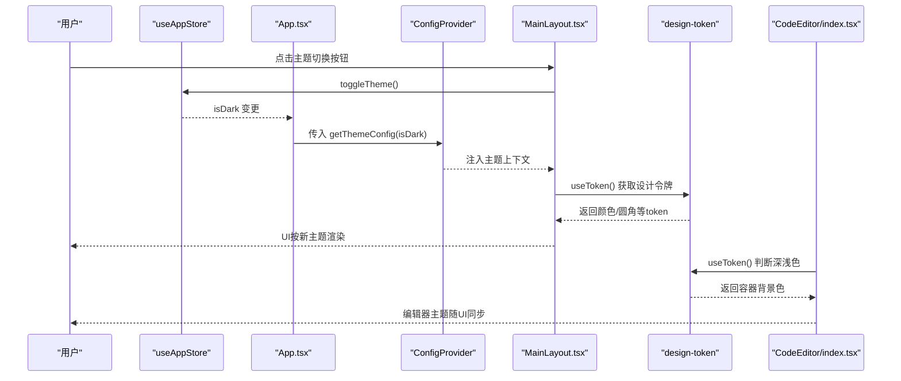
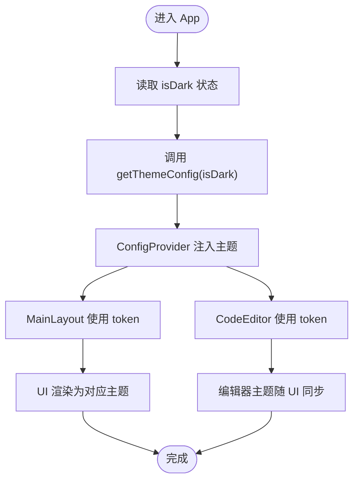
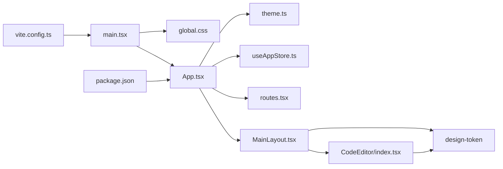

# 样式与主题系统

<cite>
**本文引用的文件**
- [global.css](file://src/styles/global.css)
- [theme.ts](file://src/styles/theme.ts)
- [App.tsx](file://src/App.tsx)
- [useAppStore.ts](file://src/store/useAppStore.ts)
- [MainLayout.tsx](file://src/layouts/MainLayout.tsx)
- [CodeEditor/index.tsx](file://src/components/CodeEditor/index.tsx)
- [main.tsx](file://src/main.tsx)
- [vite.config.ts](file://vite.config.ts)
- [package.json](file://package.json)
- [routes.tsx](file://src/routes.tsx)
- [JsonFormatter/index.tsx](file://src/tools/json/JsonFormatter/index.tsx)
</cite>

## 目录
1. [简介](#简介)
2. [项目结构](#项目结构)
3. [核心组件](#核心组件)
4. [架构总览](#架构总览)
5. [详细组件分析](#详细组件分析)
6. [依赖关系分析](#依赖关系分析)
7. [性能考量](#性能考量)
8. [故障排查指南](#故障排查指南)
9. [结论](#结论)
10. [附录](#附录)

## 简介
本文件面向XKUtil的样式与主题系统，系统性阐述全局样式、Ant Design主题定制（含暗色/亮色切换）、主题变量管理、样式组织与命名规范、主题定制指南与最佳实践、样式覆盖方法与自定义组件样式开发指导，并提供可直接参考的实现路径与示例。

## 项目结构
样式与主题相关的核心文件分布如下：
- 全局样式：src/styles/global.css
- 主题配置：src/styles/theme.ts
- 应用入口与主题注入：src/App.tsx、src/main.tsx
- 主题状态管理：src/store/useAppStore.ts
- 主题消费与UI使用：src/layouts/MainLayout.tsx、src/components/CodeEditor/index.tsx
- 构建别名与开发服务器：vite.config.ts
- 依赖声明：package.json
- 路由与页面容器：src/routes.tsx
- 工具组件示例：src/tools/json/JsonFormatter/index.tsx

**图表来源**
- [global.css:1-31](file://src/styles/global.css#L1-L31)
- [theme.ts:1-12](file://src/styles/theme.ts#L1-L12)
- [main.tsx:1-11](file://src/main.tsx#L1-L11)
- [App.tsx:1-24](file://src/App.tsx#L1-L24)
- [useAppStore.ts:1-24](file://src/store/useAppStore.ts#L1-L24)
- [MainLayout.tsx:1-168](file://src/layouts/MainLayout.tsx#L1-L168)
- [CodeEditor/index.tsx:1-57](file://src/components/CodeEditor/index.tsx#L1-L57)
- [vite.config.ts:1-31](file://vite.config.ts#L1-L31)
- [package.json:1-36](file://package.json#L1-L36)
- [routes.tsx:1-29](file://src/routes.tsx#L1-L29)

**章节来源**
- [global.css:1-31](file://src/styles/global.css#L1-L31)
- [theme.ts:1-12](file://src/styles/theme.ts#L1-L12)
- [main.tsx:1-11](file://src/main.tsx#L1-L11)
- [App.tsx:1-24](file://src/App.tsx#L1-L24)
- [useAppStore.ts:1-24](file://src/store/useAppStore.ts#L1-L24)
- [MainLayout.tsx:1-168](file://src/layouts/MainLayout.tsx#L1-L168)
- [CodeEditor/index.tsx:1-57](file://src/components/CodeEditor/index.tsx#L1-L57)
- [vite.config.ts:1-31](file://vite.config.ts#L1-L31)
- [package.json:1-36](file://package.json#L1-L36)
- [routes.tsx:1-29](file://src/routes.tsx#L1-L29)

## 核心组件
- 全局样式层：统一重置、滚动条、字体与根元素尺寸约束，确保一致的视觉基线与交互体验。
- Ant Design主题层：通过ConfigProvider注入主题配置，支持算法切换与token覆盖，实现暗/亮主题一体化管理。
- 主题状态层：基于Zustand的状态存储，持久化用户偏好，驱动主题切换。
- 主题消费层：在布局与编辑器中使用design-token，动态适配背景、边框、主色等视觉属性。
- 构建与别名：Vite别名简化导入路径，便于样式与组件的模块化组织。

**章节来源**
- [global.css:1-31](file://src/styles/global.css#L1-L31)
- [theme.ts:1-12](file://src/styles/theme.ts#L1-L12)
- [App.tsx:1-24](file://src/App.tsx#L1-L24)
- [useAppStore.ts:1-24](file://src/store/useAppStore.ts#L1-L24)
- [MainLayout.tsx:1-168](file://src/layouts/MainLayout.tsx#L1-L168)
- [CodeEditor/index.tsx:1-57](file://src/components/CodeEditor/index.tsx#L1-L57)
- [vite.config.ts:1-31](file://vite.config.ts#L1-L31)

## 架构总览
下图展示从入口到主题消费的完整链路，包括主题状态变更、ConfigProvider注入、设计令牌消费与编辑器主题联动。

**图表来源**
- [App.tsx:1-24](file://src/App.tsx#L1-L24)
- [useAppStore.ts:1-24](file://src/store/useAppStore.ts#L1-L24)
- [MainLayout.tsx:1-168](file://src/layouts/MainLayout.tsx#L1-L168)
- [CodeEditor/index.tsx:1-57](file://src/components/CodeEditor/index.tsx#L1-L57)
- [theme.ts:1-12](file://src/styles/theme.ts#L1-L12)

## 详细组件分析

### 全局样式与基础样式规则
- 统一盒模型与滚动条样式，避免跨组件差异。
- 根元素高度/宽度与溢出控制，保证布局一致性。
- 字体族设置，兼顾系统字体与回退方案。
- 建议扩展：为表单控件、表格、卡片等补充默认样式，形成“最小可用样式集”。

**章节来源**
- [global.css:1-31](file://src/styles/global.css#L1-L31)

### Ant Design主题定制与切换机制
- 主题配置工厂：根据isDark选择算法，并设置主色与圆角等token。
- 应用注入：App组件通过ConfigProvider注入locale与主题配置。
- 状态驱动：useAppStore维护isDark并提供toggleTheme，触发重新渲染。
- 消费方式：MainLayout与CodeEditor通过design-token读取颜色与边框等值，自动适配主题。

**图表来源**
- [App.tsx:1-24](file://src/App.tsx#L1-L24)
- [theme.ts:1-12](file://src/styles/theme.ts#L1-L12)
- [useAppStore.ts:1-24](file://src/store/useAppStore.ts#L1-L24)
- [MainLayout.tsx:1-168](file://src/layouts/MainLayout.tsx#L1-L168)
- [CodeEditor/index.tsx:1-57](file://src/components/CodeEditor/index.tsx#L1-L57)

**章节来源**
- [theme.ts:1-12](file://src/styles/theme.ts#L1-L12)
- [App.tsx:1-24](file://src/App.tsx#L1-L24)
- [useAppStore.ts:1-24](file://src/store/useAppStore.ts#L1-L24)
- [MainLayout.tsx:1-168](file://src/layouts/MainLayout.tsx#L1-L168)
- [CodeEditor/index.tsx:1-57](file://src/components/CodeEditor/index.tsx#L1-L57)

### 主题状态管理与持久化
- 状态字段：collapsed、isDark、toggleCollapsed、toggleTheme。
- 持久化：使用persist中间件将用户偏好保存至本地存储。
- 使用建议：新增主题变量时，优先通过ConfigProvider的token进行集中管理；如需跨会话记忆，再考虑持久化。

**章节来源**
- [useAppStore.ts:1-24](file://src/store/useAppStore.ts#L1-L24)

### 主题消费与UI适配
- 布局侧：Sider/Header/Content等区域使用token.colorBgContainer、token.colorBgLayout、token.colorBorderSecondary等，确保深浅主题下的对比度与层次感。
- 编辑器侧：根据容器背景判断当前主题，选择Monaco编辑器的主题（vs-dark/light），实现视觉一致。

**章节来源**
- [MainLayout.tsx:1-168](file://src/layouts/MainLayout.tsx#L1-L168)
- [CodeEditor/index.tsx:1-57](file://src/components/CodeEditor/index.tsx#L1-L57)

### 样式组织结构与命名规范
- 文件组织：按功能域分层，样式集中于src/styles，组件样式就近存放于组件目录。
- 命名建议：采用语义化命名（如 layout-header、editor-container），避免过度依赖层级选择器；必要时使用BEM或类似约定。
- 变量与常量：将常用尺寸、颜色、阴影等抽象为常量，减少重复与维护成本。

（本节为通用规范说明，不直接分析具体文件）

### 主题定制指南与最佳实践
- 优先通过ConfigProvider的token进行定制，避免直接覆盖类名导致的脆弱样式。
- 将主题变量集中在theme.ts中，便于集中管理与版本演进。
- 在消费端统一使用design-token，确保组件间风格一致。
- 对第三方库（如Monaco）的主题联动，通过token推导或条件判断实现自动切换。

（本节为通用实践说明，不直接分析具体文件）

### 样式覆盖方法与自定义组件样式开发
- 覆盖策略：优先使用ConfigProvider的token覆盖；对局部微调，使用内联style或className组合；避免全局污染。
- 自定义组件：在组件内部读取design-token，结合props决定最终样式；对外暴露最小化的样式接口。
- 示例参考：JsonFormatter组件通过Card、Splitter、Typography等AntD组件组合，内部使用内联style实现布局与间距控制，体现了“以组件为主、少量内联样式”的组织方式。

**章节来源**
- [JsonFormatter/index.tsx:1-267](file://src/tools/json/JsonFormatter/index.tsx#L1-L267)

### 主题切换实现代码路径
- 切换入口：MainLayout中的按钮触发toggleTheme。
- 状态变更：useAppStore更新isDark。
- 主题生效：App.tsx基于isDark生成主题配置并注入ConfigProvider。
- 视觉反馈：MainLayout与CodeEditor消费token，UI自动适配。

**章节来源**
- [MainLayout.tsx:1-168](file://src/layouts/MainLayout.tsx#L1-L168)
- [useAppStore.ts:1-24](file://src/store/useAppStore.ts#L1-L24)
- [App.tsx:1-24](file://src/App.tsx#L1-L24)
- [theme.ts:1-12](file://src/styles/theme.ts#L1-L12)

## 依赖关系分析
- 样式依赖：main.tsx引入global.css，确保全局样式在应用启动时加载。
- 组件依赖：App.tsx依赖ConfigProvider与主题配置工厂；MainLayout与CodeEditor依赖design-token；路由容器负责页面级懒加载与骨架。
- 构建依赖：vite.config.ts提供路径别名，简化导入；package.json声明Ant Design与Monaco等依赖。

**图表来源**
- [main.tsx:1-11](file://src/main.tsx#L1-L11)
- [global.css:1-31](file://src/styles/global.css#L1-L31)
- [App.tsx:1-24](file://src/App.tsx#L1-L24)
- [theme.ts:1-12](file://src/styles/theme.ts#L1-L12)
- [useAppStore.ts:1-24](file://src/store/useAppStore.ts#L1-L24)
- [routes.tsx:1-29](file://src/routes.tsx#L1-L29)
- [MainLayout.tsx:1-168](file://src/layouts/MainLayout.tsx#L1-L168)
- [CodeEditor/index.tsx:1-57](file://src/components/CodeEditor/index.tsx#L1-L57)
- [vite.config.ts:1-31](file://vite.config.ts#L1-L31)
- [package.json:1-36](file://package.json#L1-L36)

**章节来源**
- [main.tsx:1-11](file://src/main.tsx#L1-L11)
- [App.tsx:1-24](file://src/App.tsx#L1-L24)
- [theme.ts:1-12](file://src/styles/theme.ts#L1-L12)
- [useAppStore.ts:1-24](file://src/store/useAppStore.ts#L1-L24)
- [MainLayout.tsx:1-168](file://src/layouts/MainLayout.tsx#L1-L168)
- [CodeEditor/index.tsx:1-57](file://src/components/CodeEditor/index.tsx#L1-L57)
- [vite.config.ts:1-31](file://vite.config.ts#L1-L31)
- [package.json:1-36](file://package.json#L1-L36)
- [routes.tsx:1-29](file://src/routes.tsx#L1-L29)

## 性能考量
- 主题切换为轻量操作，主要影响CSS变量与组件重绘范围，通常无明显性能负担。
- 建议：避免在主题切换时强制全量重载页面；保持组件粒度细、样式计算简单，有助于提升渲染效率。
- Monaco编辑器主题切换仅影响编辑器实例，不会阻塞主线程。

（本节为通用性能建议，不直接分析具体文件）

## 故障排查指南
- 主题未生效
  - 检查App.tsx是否正确传入ConfigProvider的theme配置。
  - 确认useAppStore的isDark状态是否被正确更新。
  - 参考路径：[App.tsx:1-24](file://src/App.tsx#L1-L24)、[useAppStore.ts:1-24](file://src/store/useAppStore.ts#L1-L24)
- 编辑器主题未随UI切换
  - 确认CodeEditor是否正确读取design-token并据此选择编辑器主题。
  - 参考路径：[CodeEditor/index.tsx:1-57](file://src/components/CodeEditor/index.tsx#L1-L57)
- 样式冲突或覆盖失效
  - 优先通过token覆盖，避免直接写死类名；必要时使用更精确的选择器或CSS模块。
  - 参考路径：[MainLayout.tsx:1-168](file://src/layouts/MainLayout.tsx#L1-L168)
- 构建别名导致的导入问题
  - 检查vite.config.ts中的alias配置是否正确。
  - 参考路径：[vite.config.ts:1-31](file://vite.config.ts#L1-L31)

**章节来源**
- [App.tsx:1-24](file://src/App.tsx#L1-L24)
- [useAppStore.ts:1-24](file://src/store/useAppStore.ts#L1-L24)
- [CodeEditor/index.tsx:1-57](file://src/components/CodeEditor/index.tsx#L1-L57)
- [MainLayout.tsx:1-168](file://src/layouts/MainLayout.tsx#L1-L168)
- [vite.config.ts:1-31](file://vite.config.ts#L1-L31)

## 结论
XKUtil的样式与主题系统以Ant Design为核心，通过ConfigProvider集中注入主题配置，结合Zustand的状态管理实现暗/亮主题的即时切换。全局样式提供一致的视觉基线，design-token贯穿UI消费，编辑器主题与UI保持联动。整体架构清晰、易于扩展，适合在后续迭代中持续优化主题变量与样式组织。

## 附录
- 快速定位实现路径
  - 主题配置工厂：[theme.ts:1-12](file://src/styles/theme.ts#L1-L12)
  - 应用注入与切换：[App.tsx:1-24](file://src/App.tsx#L1-L24)、[useAppStore.ts:1-24](file://src/store/useAppStore.ts#L1-L24)
  - 主题消费示例：[MainLayout.tsx:1-168](file://src/layouts/MainLayout.tsx#L1-L168)、[CodeEditor/index.tsx:1-57](file://src/components/CodeEditor/index.tsx#L1-L57)
  - 全局样式：[global.css:1-31](file://src/styles/global.css#L1-L31)
  - 构建与依赖：[vite.config.ts:1-31](file://vite.config.ts#L1-L31)、[package.json:1-36](file://package.json#L1-L36)
  - 页面容器与路由：[routes.tsx:1-29](file://src/routes.tsx#L1-L29)