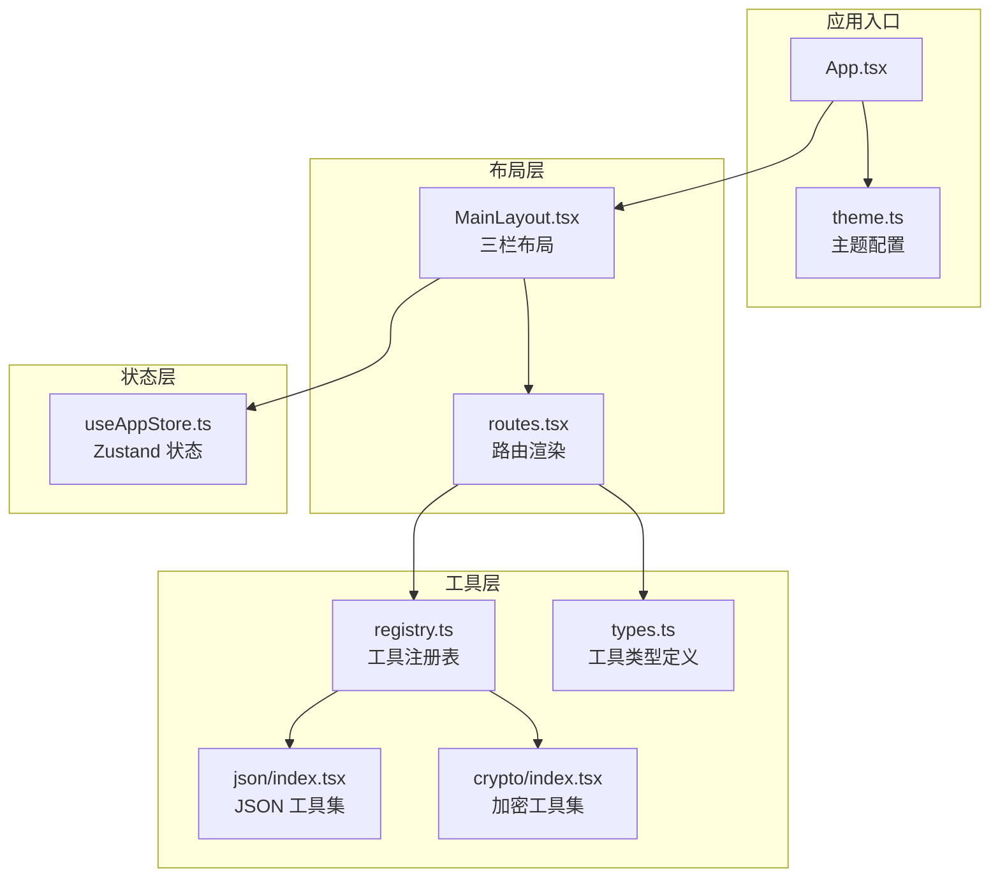
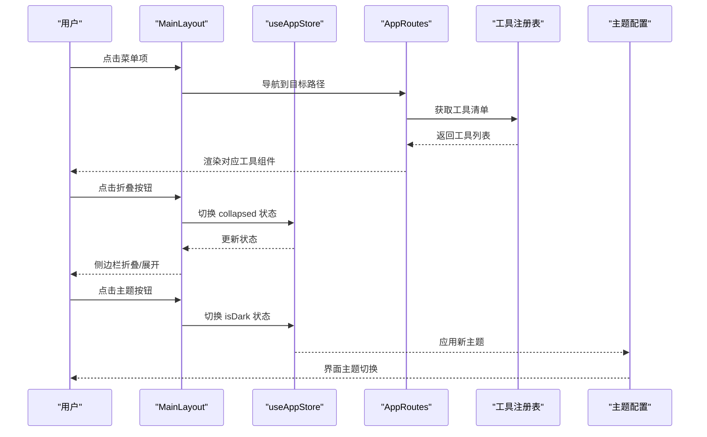
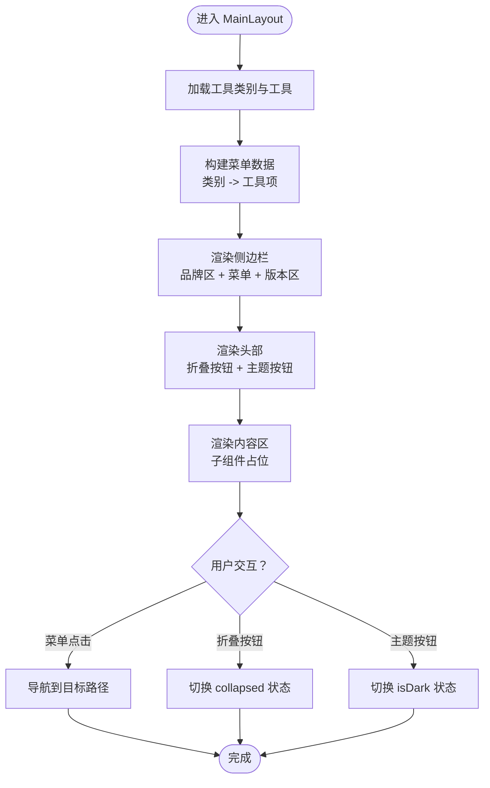
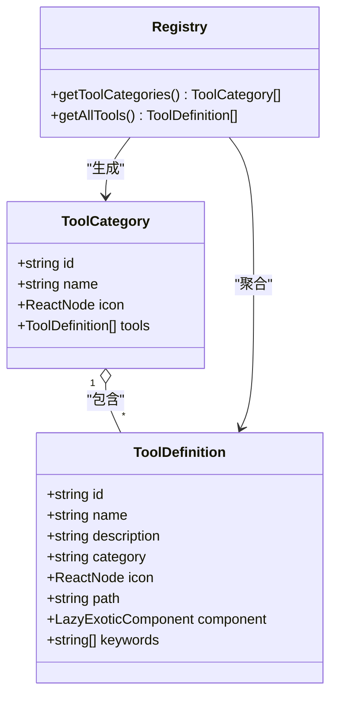
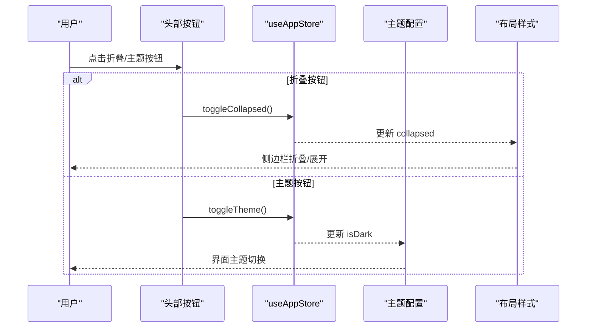
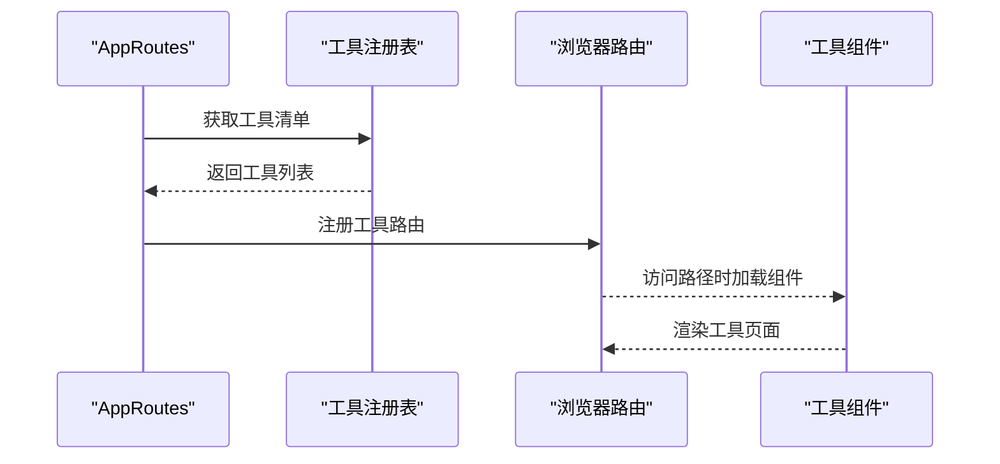
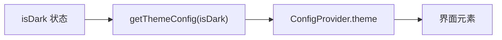
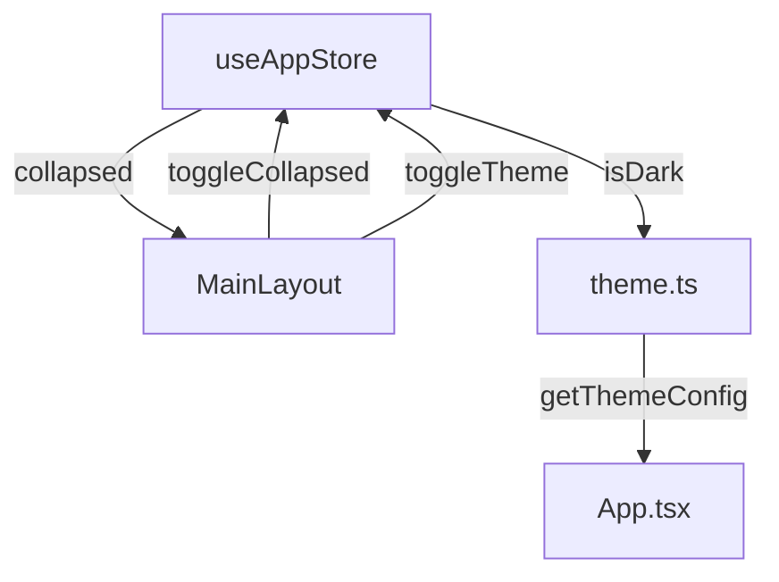
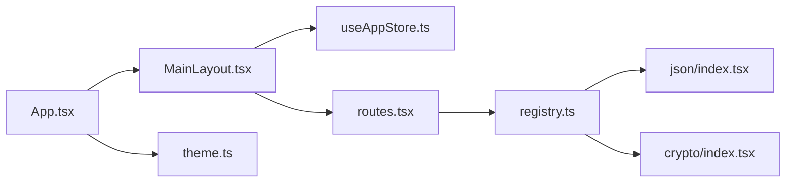

# 布局系统

<cite>
**本文引用的文件**
- [src/layouts/MainLayout.tsx](file://src/layouts/MainLayout.tsx)
- [src/store/useAppStore.ts](file://src/store/useAppStore.ts)
- [src/tools/registry.ts](file://src/tools/registry.ts)
- [src/tools/types.ts](file://src/tools/types.ts)
- [src/routes.tsx](file://src/routes.tsx)
- [src/styles/theme.ts](file://src/styles/theme.ts)
- [src/App.tsx](file://src/App.tsx)
- [src/constants/changelog.ts](file://src/constants/changelog.ts)
- [src/tools/json/index.tsx](file://src/tools/json/index.tsx)
- [src/tools/crypto/index.tsx](file://src/tools/crypto/index.tsx)
</cite>

## 目录
1. [简介](#简介)
2. [项目结构](#项目结构)
3. [核心组件](#核心组件)
4. [架构总览](#架构总览)
5. [详细组件分析](#详细组件分析)
6. [依赖关系分析](#依赖关系分析)
7. [性能考虑](#性能考虑)
8. [故障排查指南](#故障排查指南)
9. [结论](#结论)
10. [附录](#附录)

## 简介
本文件系统性解析 XKUtil 的布局系统，重点围绕 MainLayout 组件的设计与实现，涵盖三栏布局（侧边栏、头部、内容区）的结构与交互、基于工具注册表的动态菜单生成机制、头部工具栏的侧边栏折叠与主题切换功能、响应式与主题系统、组件属性与事件、以及布局组件间的状态管理与通信模式。

## 项目结构
XKUtil 采用“按功能域分层”的组织方式：布局层负责页面骨架与导航；工具层提供可扩展的功能模块；状态层通过轻量状态库进行全局状态管理；样式层提供主题算法与全局样式。

图表来源
- [src/App.tsx:1-24](file://src/App.tsx#L1-L24)
- [src/styles/theme.ts:1-12](file://src/styles/theme.ts#L1-L12)
- [src/layouts/MainLayout.tsx:1-168](file://src/layouts/MainLayout.tsx#L1-L168)
- [src/routes.tsx:1-29](file://src/routes.tsx#L1-L29)
- [src/store/useAppStore.ts:1-24](file://src/store/useAppStore.ts#L1-L24)
- [src/tools/registry.ts:1-39](file://src/tools/registry.ts#L1-L39)
- [src/tools/types.ts:1-20](file://src/tools/types.ts#L1-L20)
- [src/tools/json/index.tsx:1-27](file://src/tools/json/index.tsx#L1-L27)
- [src/tools/crypto/index.tsx:1-17](file://src/tools/crypto/index.tsx#L1-L17)

章节来源
- [src/App.tsx:1-24](file://src/App.tsx#L1-L24)
- [src/layouts/MainLayout.tsx:1-168](file://src/layouts/MainLayout.tsx#L1-L168)
- [src/routes.tsx:1-29](file://src/routes.tsx#L1-L29)
- [src/store/useAppStore.ts:1-24](file://src/store/useAppStore.ts#L1-L24)
- [src/tools/registry.ts:1-39](file://src/tools/registry.ts#L1-L39)
- [src/tools/types.ts:1-20](file://src/tools/types.ts#L1-L20)
- [src/tools/json/index.tsx:1-27](file://src/tools/json/index.tsx#L1-L27)
- [src/tools/crypto/index.tsx:1-17](file://src/tools/crypto/index.tsx#L1-L17)

## 核心组件
- MainLayout：三栏布局容器，负责侧边栏菜单、头部工具栏、内容区渲染，并承载更新日志弹窗。
- App：应用根组件，注入 Ant Design 主题与语言包，包裹 MainLayout 与路由。
- useAppStore：Zustand 状态存储，维护侧边栏折叠与主题状态，并持久化到本地存储。
- 工具注册表：从各工具模块聚合工具清单，按类别生成菜单数据源。
- 路由系统：根据工具清单动态生成路由，实现按路径懒加载工具页面。

章节来源
- [src/layouts/MainLayout.tsx:22-168](file://src/layouts/MainLayout.tsx#L22-L168)
- [src/App.tsx:9-21](file://src/App.tsx#L9-L21)
- [src/store/useAppStore.ts:11-23](file://src/store/useAppStore.ts#L11-L23)
- [src/tools/registry.ts:7-27](file://src/tools/registry.ts#L7-L27)
- [src/routes.tsx:6-28](file://src/routes.tsx#L6-L28)

## 架构总览
MainLayout 作为页面骨架，通过状态钩子与路由系统协作，完成菜单驱动的导航与内容渲染。工具注册表提供“类别-工具”两级数据模型，路由系统据此动态挂载页面组件。主题系统在应用入口统一注入，随状态切换即时生效。

图表来源
- [src/layouts/MainLayout.tsx:41-43](file://src/layouts/MainLayout.tsx#L41-L43)
- [src/store/useAppStore.ts:16-17](file://src/store/useAppStore.ts#L16-L17)
- [src/routes.tsx:4-7](file://src/routes.tsx#L4-L7)
- [src/tools/registry.ts:5-6](file://src/tools/registry.ts#L5-L6)
- [src/styles/theme.ts:3-11](file://src/styles/theme.ts#L3-L11)

## 详细组件分析

### MainLayout 组件
- 结构组成
  - 侧边栏（Sider）：包含品牌区、动态菜单、底部版本信息。
  - 头部（Header）：包含侧边栏折叠按钮与主题切换按钮。
  - 内容区（Content）：渲染当前选中的工具页面。
- 动态菜单生成
  - 通过工具注册表聚合工具清单，按类别构建“类别-工具”树。
  - 使用 Ant Design Menu 组件渲染，支持内联模式与默认展开。
- 交互行为
  - 菜单点击触发路由跳转。
  - 折叠按钮切换侧边栏宽度与文字显示。
  - 主题按钮在亮/暗主题之间切换。
- 版本与更新日志
  - 底部版本信息在折叠状态下显示精简版本号，在展开时显示完整版本号。
  - 点击版本信息打开更新日志弹窗，展示版本变更时间线。

图表来源
- [src/layouts/MainLayout.tsx:29-43](file://src/layouts/MainLayout.tsx#L29-L43)
- [src/layouts/MainLayout.tsx:74-81](file://src/layouts/MainLayout.tsx#L74-L81)
- [src/layouts/MainLayout.tsx:114-123](file://src/layouts/MainLayout.tsx#L114-L123)
- [src/layouts/MainLayout.tsx:136-164](file://src/layouts/MainLayout.tsx#L136-L164)

章节来源
- [src/layouts/MainLayout.tsx:22-168](file://src/layouts/MainLayout.tsx#L22-L168)

### 工具注册表与动态菜单
- 注册表职责
  - 聚合所有工具清单，按类别分组，生成类别对象与工具数组。
  - 提供类别名称映射与工具全量列表查询接口。
- 菜单数据结构
  - 类别对象包含 id、name、icon、tools 数组。
  - 工具对象包含 id、name、description、category、icon、path、component 等字段。
- 菜单渲染
  - 将类别映射为菜单项，工具映射为子菜单项，形成两级菜单树。
  - 默认展开所有类别，选中当前路径对应的菜单项。

图表来源
- [src/tools/types.ts:3-19](file://src/tools/types.ts#L3-L19)
- [src/tools/registry.ts:7-27](file://src/tools/registry.ts#L7-L27)

章节来源
- [src/tools/registry.ts:1-39](file://src/tools/registry.ts#L1-L39)
- [src/tools/types.ts:1-20](file://src/tools/types.ts#L1-L20)

### 头部工具栏与状态联动
- 折叠控制
  - 头部按钮图标随 collapsed 状态变化，点击触发状态切换。
  - 状态来自全局状态存储，影响侧边栏宽度与品牌区文字显示。
- 主题切换
  - 头部按钮图标随 isDark 状态变化，点击触发主题切换。
  - 主题配置由应用入口统一注入，随状态变化即时生效。

图表来源
- [src/layouts/MainLayout.tsx:114-123](file://src/layouts/MainLayout.tsx#L114-L123)
- [src/store/useAppStore.ts:16-17](file://src/store/useAppStore.ts#L16-L17)
- [src/styles/theme.ts:3-11](file://src/styles/theme.ts#L3-L11)

章节来源
- [src/layouts/MainLayout.tsx:103-124](file://src/layouts/MainLayout.tsx#L103-L124)
- [src/store/useAppStore.ts:11-23](file://src/store/useAppStore.ts#L11-L23)

### 路由与懒加载
- 动态路由生成
  - 依据工具清单生成路由，每个工具对应一个路径与懒加载组件。
  - 未匹配到具体工具时重定向至第一个工具路径。
- 懒加载与骨架屏
  - 工具组件使用动态导入实现懒加载。
  - 路由容器包裹骨架屏，提升首屏体验。

图表来源
- [src/routes.tsx:6-28](file://src/routes.tsx#L6-L28)
- [src/tools/registry.ts:25-27](file://src/tools/registry.ts#L25-L27)

章节来源
- [src/routes.tsx:1-29](file://src/routes.tsx#L1-L29)
- [src/tools/json/index.tsx:5-26](file://src/tools/json/index.tsx#L5-L26)
- [src/tools/crypto/index.tsx:5-16](file://src/tools/crypto/index.tsx#L5-L16)

### 主题系统与样式
- 主题算法
  - 根据 isDark 状态选择暗色或默认算法，统一主色与圆角等基础 token。
- 全局注入
  - 应用根组件通过 ConfigProvider 注入主题与语言包，确保全局一致。
- 样式一致性
  - 布局各区域使用 Ant Design Token，保证在不同主题下视觉一致。

图表来源
- [src/styles/theme.ts:3-11](file://src/styles/theme.ts#L3-L11)
- [src/App.tsx:10-13](file://src/App.tsx#L10-L13)

章节来源
- [src/styles/theme.ts:1-12](file://src/styles/theme.ts#L1-L12)
- [src/App.tsx:1-24](file://src/App.tsx#L1-L24)

### 响应式设计与样式主题
- 布局适配
  - 侧边栏宽度固定，配合折叠状态在窄屏下释放空间。
  - 头部与内容区高度固定，配合滚动条处理长内容。
- 主题适配
  - 暗色/亮色主题自动切换背景与边框颜色，保持对比度与可读性。
- 版本信息适配
  - 折叠状态下显示精简版本号，避免遮挡菜单项。

章节来源
- [src/layouts/MainLayout.tsx:47-57](file://src/layouts/MainLayout.tsx#L47-L57)
- [src/layouts/MainLayout.tsx:83-100](file://src/layouts/MainLayout.tsx#L83-L100)
- [src/styles/theme.ts:3-11](file://src/styles/theme.ts#L3-L11)

### 组件属性、事件与自定义配置
- MainLayout 属性
  - children：内容区插槽，用于承载工具页面。
- 事件处理
  - 菜单点击：导航到目标路径。
  - 折叠按钮：切换 collapsed 状态。
  - 主题按钮：切换 isDark 状态。
  - 版本区点击：打开更新日志弹窗。
- 自定义配置
  - 工具注册表支持新增工具与类别，无需修改布局代码。
  - 主题配置可通过主题函数扩展 token 与算法。

章节来源
- [src/layouts/MainLayout.tsx:18-20](file://src/layouts/MainLayout.tsx#L18-L20)
- [src/layouts/MainLayout.tsx:41-43](file://src/layouts/MainLayout.tsx#L41-L43)
- [src/layouts/MainLayout.tsx:114-123](file://src/layouts/MainLayout.tsx#L114-L123)
- [src/layouts/MainLayout.tsx:136-164](file://src/layouts/MainLayout.tsx#L136-L164)
- [src/tools/registry.ts:7-27](file://src/tools/registry.ts#L7-L27)
- [src/styles/theme.ts:3-11](file://src/styles/theme.ts#L3-L11)

### 布局组件间通信与状态管理
- 状态来源
  - useAppStore 提供 collapsed 与 isDark 状态及切换方法。
- 通信模式
  - 头部按钮直接调用状态方法，实现布局折叠与主题切换。
  - 菜单点击通过路由导航，间接影响内容区渲染。
- 状态持久化
  - Zustand 的 persist 中间件将状态保存到本地存储，刷新后恢复。

图表来源
- [src/store/useAppStore.ts:11-23](file://src/store/useAppStore.ts#L11-L23)
- [src/layouts/MainLayout.tsx:25-26](file://src/layouts/MainLayout.tsx#L25-L26)
- [src/styles/theme.ts:3-11](file://src/styles/theme.ts#L3-L11)
- [src/App.tsx:10-13](file://src/App.tsx#L10-L13)

章节来源
- [src/store/useAppStore.ts:1-24](file://src/store/useAppStore.ts#L1-L24)
- [src/layouts/MainLayout.tsx:22-168](file://src/layouts/MainLayout.tsx#L22-L168)

## 依赖关系分析
- 组件耦合
  - MainLayout 依赖状态存储与工具注册表，但不直接依赖具体工具实现，具备良好扩展性。
  - App 仅负责主题与路由包裹，耦合度低。
- 外部依赖
  - Ant Design 提供布局、菜单、按钮、模态框等 UI 组件。
  - Zustand 提供轻量状态管理与持久化。
  - React Router DOM 负责路由导航与懒加载。
- 可能的循环依赖
  - 当前结构无循环依赖风险，工具清单通过注册表集中管理。

图表来源
- [src/App.tsx:1-24](file://src/App.tsx#L1-L24)
- [src/layouts/MainLayout.tsx:1-168](file://src/layouts/MainLayout.tsx#L1-L168)
- [src/store/useAppStore.ts:1-24](file://src/store/useAppStore.ts#L1-L24)
- [src/routes.tsx:1-29](file://src/routes.tsx#L1-L29)
- [src/tools/registry.ts:1-39](file://src/tools/registry.ts#L1-L39)
- [src/tools/json/index.tsx:1-27](file://src/tools/json/index.tsx#L1-L27)
- [src/tools/crypto/index.tsx:1-17](file://src/tools/crypto/index.tsx#L1-L17)
- [src/styles/theme.ts:1-12](file://src/styles/theme.ts#L1-L12)

章节来源
- [src/App.tsx:1-24](file://src/App.tsx#L1-L24)
- [src/layouts/MainLayout.tsx:1-168](file://src/layouts/MainLayout.tsx#L1-L168)
- [src/store/useAppStore.ts:1-24](file://src/store/useAppStore.ts#L1-L24)
- [src/tools/registry.ts:1-39](file://src/tools/registry.ts#L1-L39)

## 性能考虑
- 懒加载与分割包
  - 工具组件采用动态导入，减少首屏体积，提升加载速度。
- 状态持久化
  - 使用持久化中间件避免频繁手动保存，降低副作用开销。
- 主题切换
  - 通过全局注入的主题配置即时生效，避免重复渲染。
- 菜单渲染
  - 仅渲染当前可见区域，滚动容器限制高度，避免长列表卡顿。

## 故障排查指南
- 菜单不显示或空白
  - 检查工具注册表是否正确导出工具清单，确认类别与路径唯一。
  - 确认路由已注册对应路径。
- 路由无法跳转
  - 检查工具路径与菜单 key 是否一致，确保 onClick 导航逻辑正常。
- 折叠状态异常
  - 检查状态存储是否持久化成功，确认 toggleCollapsed 方法被调用。
- 主题切换无效
  - 检查主题配置函数是否返回正确算法，确认 App 中已注入主题。
- 更新日志弹窗不出现
  - 检查版本常量与变更记录是否正确，确认弹窗开关状态逻辑。

章节来源
- [src/tools/registry.ts:5-6](file://src/tools/registry.ts#L5-L6)
- [src/routes.tsx:17-25](file://src/routes.tsx#L17-L25)
- [src/store/useAppStore.ts:16-17](file://src/store/useAppStore.ts#L16-L17)
- [src/styles/theme.ts:3-11](file://src/styles/theme.ts#L3-L11)
- [src/constants/changelog.ts:1-34](file://src/constants/changelog.ts#L1-L34)

## 结论
XKUtil 的布局系统以 MainLayout 为核心，结合工具注册表与动态路由，实现了高扩展性的工具导航体系。通过 Zustand 管理布局状态并与 Ant Design 主题系统无缝集成，提供了良好的用户体验与开发扩展性。未来可在菜单搜索、快捷键导航、主题定制等方面进一步增强。

## 附录
- 工具清单示例
  - JSON 工具：格式化、树形视图。
  - 加密工具：AES 加解密。
- 常用配置
  - 新增工具：在对应目录导出工具定义，注册表会自动聚合。
  - 自定义主题：扩展主题配置函数，调整 token 与算法。

章节来源
- [src/tools/json/index.tsx:5-26](file://src/tools/json/index.tsx#L5-L26)
- [src/tools/crypto/index.tsx:5-16](file://src/tools/crypto/index.tsx#L5-L16)
- [src/styles/theme.ts:3-11](file://src/styles/theme.ts#L3-L11)