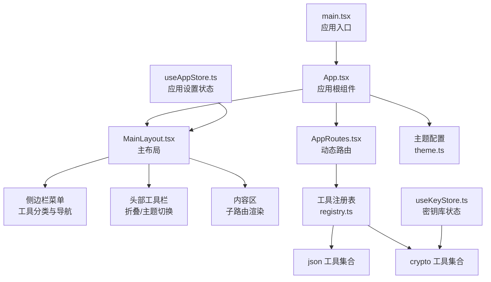
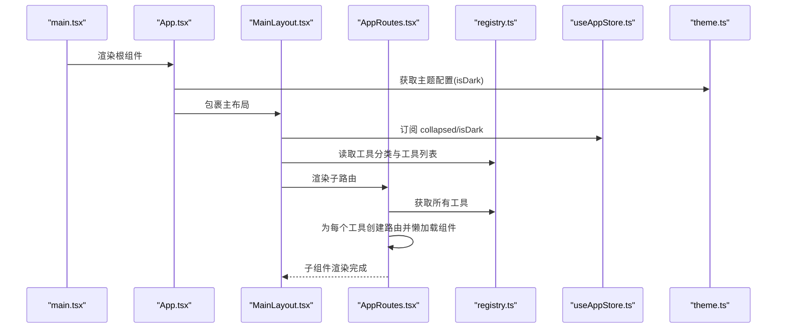
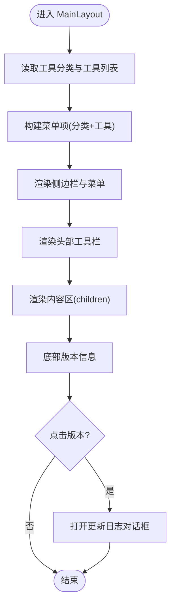
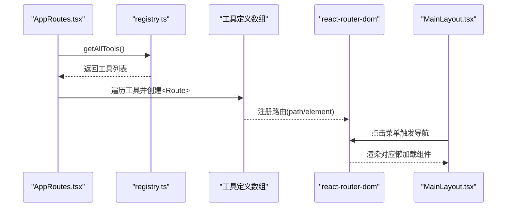
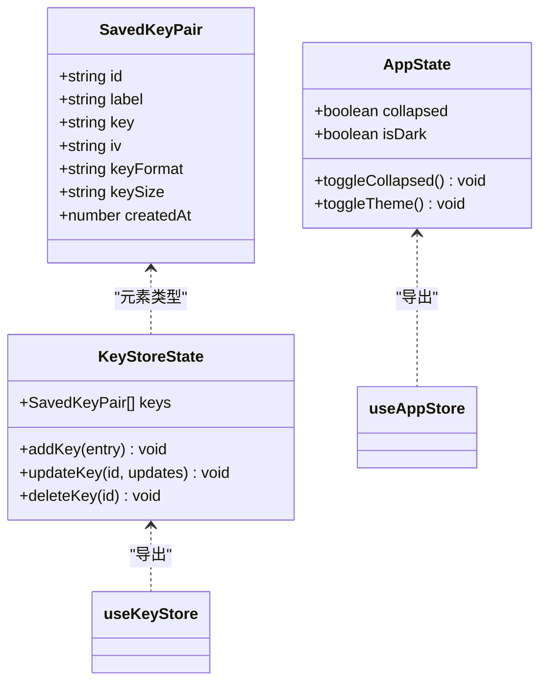
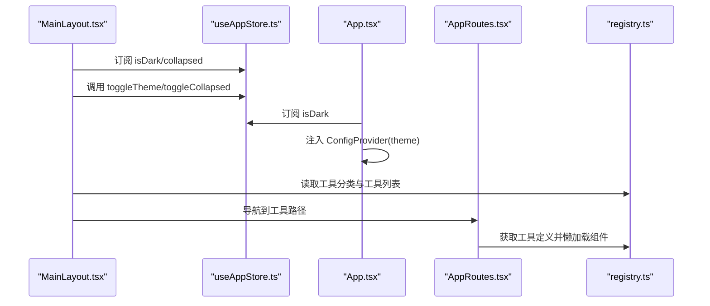
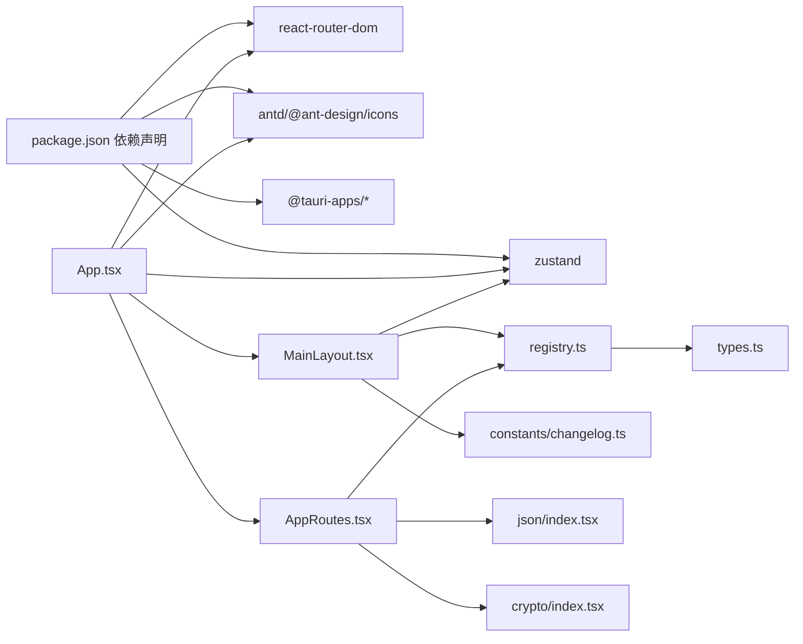

# 核心组件

<cite>
**本文引用的文件**
- [src/layouts/MainLayout.tsx](file://src/layouts/MainLayout.tsx)
- [src/routes.tsx](file://src/routes.tsx)
- [src/store/useAppStore.ts](file://src/store/useAppStore.ts)
- [src/store/useKeyStore.ts](file://src/store/useKeyStore.ts)
- [src/App.tsx](file://src/App.tsx)
- [src/tools/registry.ts](file://src/tools/registry.ts)
- [src/tools/types.ts](file://src/tools/types.ts)
- [src/tools/json/index.tsx](file://src/tools/json/index.tsx)
- [src/tools/crypto/index.tsx](file://src/tools/crypto/index.tsx)
- [src/constants/changelog.ts](file://src/constants/changelog.ts)
- [src/styles/theme.ts](file://src/styles/theme.ts)
- [src/main.tsx](file://src/main.tsx)
- [package.json](file://package.json)
</cite>

## 目录
1. [简介](#简介)
2. [项目结构](#项目结构)
3. [核心组件](#核心组件)
4. [架构总览](#架构总览)
5. [详细组件分析](#详细组件分析)
6. [依赖分析](#依赖分析)
7. [性能考虑](#性能考虑)
8. [故障排查指南](#故障排查指南)
9. [结论](#结论)
10. [附录](#附录)

## 简介
本文件聚焦于 XKUtil 的核心组件与运行机制，围绕以下目标展开：
- 主布局组件 MainLayout 的设计与实现：侧边栏菜单、内容区域与头部工具栏的功能与交互。
- 动态路由系统：基于工具注册表的路由生成、组件懒加载策略与导航管理。
- Zustand 状态管理：应用设置状态与密钥库状态的架构设计与持久化。
- 组件 API 文档、属性说明与使用示例。
- 组件间通信模式与数据传递机制。

## 项目结构
项目采用“按功能域分层”的组织方式：
- 布局层：MainLayout 提供统一的侧边栏、头部与内容区容器。
- 路由层：AppRoutes 根据工具注册表动态生成路由，并通过 Suspense 实现懒加载占位。
- 状态层：useAppStore 管理应用设置（如侧边栏折叠、主题），useKeyStore 管理密钥库数据。
- 工具层：tools 下按类别组织工具，每个工具定义包含路径、图标、名称、描述与懒加载组件。
- 配置层：theme.ts 提供 Ant Design 主题配置；App.tsx 将主题与路由注入根组件。

图表来源
- [src/main.tsx:1-11](file://src/main.tsx#L1-L11)
- [src/App.tsx:1-24](file://src/App.tsx#L1-L24)
- [src/layouts/MainLayout.tsx:1-168](file://src/layouts/MainLayout.tsx#L1-L168)
- [src/routes.tsx:1-29](file://src/routes.tsx#L1-L29)
- [src/tools/registry.ts:1-39](file://src/tools/registry.ts#L1-L39)
- [src/styles/theme.ts:1-12](file://src/styles/theme.ts#L1-L12)
- [src/store/useAppStore.ts:1-24](file://src/store/useAppStore.ts#L1-L24)
- [src/store/useKeyStore.ts:1-47](file://src/store/useKeyStore.ts#L1-L47)

章节来源
- [src/main.tsx:1-11](file://src/main.tsx#L1-L11)
- [src/App.tsx:1-24](file://src/App.tsx#L1-L24)
- [src/layouts/MainLayout.tsx:1-168](file://src/layouts/MainLayout.tsx#L1-L168)
- [src/routes.tsx:1-29](file://src/routes.tsx#L1-L29)
- [src/tools/registry.ts:1-39](file://src/tools/registry.ts#L1-L39)
- [src/styles/theme.ts:1-12](file://src/styles/theme.ts#L1-L12)
- [src/store/useAppStore.ts:1-24](file://src/store/useAppStore.ts#L1-L24)
- [src/store/useKeyStore.ts:1-47](file://src/store/useKeyStore.ts#L1-L47)

## 核心组件
- MainLayout：提供侧边栏、头部工具栏与内容区，负责主题切换、侧边栏折叠状态与工具导航。
- AppRoutes：根据工具注册表动态生成路由，使用 Suspense 与 lazy 实现懒加载。
- useAppStore：Zustand 应用设置状态，包含 collapsed 与 isDark，以及对应的切换函数。
- useKeyStore：Zustand 密钥库状态，提供增删改查操作与持久化存储。
- 工具注册表与类型：定义工具元信息（id、name、path、component 等），并按类别聚合为菜单项。

章节来源
- [src/layouts/MainLayout.tsx:18-168](file://src/layouts/MainLayout.tsx#L18-L168)
- [src/routes.tsx:6-29](file://src/routes.tsx#L6-L29)
- [src/store/useAppStore.ts:4-24](file://src/store/useAppStore.ts#L4-L24)
- [src/store/useKeyStore.ts:5-47](file://src/store/useKeyStore.ts#L5-L47)
- [src/tools/types.ts:1-20](file://src/tools/types.ts#L1-L20)
- [src/tools/registry.ts:7-39](file://src/tools/registry.ts#L7-L39)

## 架构总览
下图展示了从入口到路由渲染、状态管理与主题配置的整体流程：

图表来源
- [src/main.tsx:6-10](file://src/main.tsx#L6-L10)
- [src/App.tsx:9-21](file://src/App.tsx#L9-L21)
- [src/styles/theme.ts:3-11](file://src/styles/theme.ts#L3-L11)
- [src/layouts/MainLayout.tsx:22-43](file://src/layouts/MainLayout.tsx#L22-L43)
- [src/tools/registry.ts:7-27](file://src/tools/registry.ts#L7-L27)
- [src/routes.tsx:6-28](file://src/routes.tsx#L6-L28)
- [src/store/useAppStore.ts:11-23](file://src/store/useAppStore.ts#L11-L23)

## 详细组件分析

### MainLayout 组件分析
- 角色定位：提供全局布局骨架，承载侧边栏菜单、头部工具栏与内容区。
- 侧边栏菜单：
  - 通过工具注册表生成分类与工具项，支持多级菜单。
  - 使用 Ant Design Menu，选中态与默认展开键来自当前路径与分类 ID。
  - 点击菜单项触发导航跳转。
- 头部工具栏：
  - 提供侧边栏折叠/展开按钮与主题切换按钮，调用 useAppStore 中的切换函数。
- 内容区：
  - 透传 children，用于渲染当前路由对应组件。
- 版本信息与更新日志：
  - 底部显示版本号，点击弹出更新日志对话框，使用 CHANGELOG 常量渲染时间线。

图表来源
- [src/layouts/MainLayout.tsx:29-100](file://src/layouts/MainLayout.tsx#L29-L100)
- [src/layouts/MainLayout.tsx:114-124](file://src/layouts/MainLayout.tsx#L114-L124)
- [src/layouts/MainLayout.tsx:125-134](file://src/layouts/MainLayout.tsx#L125-L134)
- [src/constants/changelog.ts:9-33](file://src/constants/changelog.ts#L9-L33)

章节来源
- [src/layouts/MainLayout.tsx:18-168](file://src/layouts/MainLayout.tsx#L18-L168)
- [src/constants/changelog.ts:1-34](file://src/constants/changelog.ts#L1-L34)

### 动态路由系统分析
- 路由生成：
  - AppRoutes 读取工具注册表中的所有工具，为每个工具创建一个路由。
  - 路由 path 来自工具定义，element 使用工具的懒加载组件。
- 懒加载策略：
  - 工具组件通过 lazy 引入，结合 Suspense 在加载时显示加载指示器。
- 导航管理：
  - 侧边栏菜单点击后通过 useNavigate 进行页面跳转。
  - 通配符路由将未匹配路径重定向至第一个可用工具的路径。

图表来源
- [src/routes.tsx:6-28](file://src/routes.tsx#L6-L28)
- [src/tools/registry.ts:25-27](file://src/tools/registry.ts#L25-L27)
- [src/tools/json/index.tsx:5-26](file://src/tools/json/index.tsx#L5-L26)
- [src/tools/crypto/index.tsx:5-16](file://src/tools/crypto/index.tsx#L5-L16)

章节来源
- [src/routes.tsx:1-29](file://src/routes.tsx#L1-L29)
- [src/tools/registry.ts:1-39](file://src/tools/registry.ts#L1-L39)
- [src/tools/types.ts:1-20](file://src/tools/types.ts#L1-L20)
- [src/tools/json/index.tsx:1-27](file://src/tools/json/index.tsx#L1-L27)
- [src/tools/crypto/index.tsx:1-17](file://src/tools/crypto/index.tsx#L1-L17)

### Zustand 状态管理分析
- 应用设置状态（useAppStore）：
  - 状态字段：collapsed（侧边栏折叠）、isDark（是否暗色主题）。
  - 行为方法：toggleCollapsed、toggleTheme。
  - 持久化：通过 persist 中间件将设置保存在本地存储，键名为 xkutil-app-settings。
- 密钥库状态（useKeyStore）：
  - 状态字段：keys（SavedKeyPair 数组）。
  - 行为方法：addKey、updateKey、deleteKey。
  - 数据模型：SavedKeyPair 包含 id、label、key、iv、keyFormat、keySize、createdAt。
  - 持久化：通过 persist 中间件保存在本地存储，键名为 xkutil-aes-keystore。

图表来源
- [src/store/useAppStore.ts:4-24](file://src/store/useAppStore.ts#L4-L24)
- [src/store/useKeyStore.ts:5-47](file://src/store/useKeyStore.ts#L5-L47)

章节来源
- [src/store/useAppStore.ts:1-24](file://src/store/useAppStore.ts#L1-L24)
- [src/store/useKeyStore.ts:1-47](file://src/store/useKeyStore.ts#L1-L47)

### 组件 API 文档与使用示例
- MainLayout
  - 属性
    - children: ReactNode，内容区渲染插槽。
  - 用途
    - 作为应用的主布局容器，内部包含侧边栏、头部工具栏与内容区。
  - 示例
    - 在 App.tsx 中包裹 AppRoutes 即可启用主布局。

- AppRoutes
  - 属性：无
  - 用途
    - 根据工具注册表动态生成路由，支持懒加载与错误回退。
  - 示例
    - 在 MainLayout 内部直接渲染 AppRoutes。

- useAppStore
  - 属性
    - collapsed: boolean
    - isDark: boolean
    - toggleCollapsed(): void
    - toggleTheme(): void
  - 用途
    - 管理应用级别的布局与主题状态，并持久化保存。
  - 示例
    - 在 MainLayout 中订阅 isDark 与 collapsed，并调用 toggleTheme/toggleCollapsed。

- useKeyStore
  - 属性
    - keys: SavedKeyPair[]
    - addKey(entry): void
    - updateKey(id, updates): void
    - deleteKey(id): void
  - 用途
    - 管理密钥库数据，提供增删改查能力。
  - 示例
    - 在 AES 工具中调用 addKey/updateKey/deleteKey 管理密钥对。

章节来源
- [src/layouts/MainLayout.tsx:18-20](file://src/layouts/MainLayout.tsx#L18-L20)
- [src/routes.tsx:6-28](file://src/routes.tsx#L6-L28)
- [src/store/useAppStore.ts:4-18](file://src/store/useAppStore.ts#L4-L18)
- [src/store/useKeyStore.ts:15-43](file://src/store/useKeyStore.ts#L15-L43)

### 组件间通信与数据传递
- 路由与布局通信
  - MainLayout 通过 useLocation 获取当前路径，驱动菜单选中态与默认展开。
  - 侧边栏菜单点击后通过 useNavigate 导航到对应路径，AppRoutes 根据路径懒加载对应组件。
- 状态与 UI 通信
  - App.tsx 订阅 useAppStore 的 isDark 并将其注入 ConfigProvider，实现主题切换。
  - MainLayout 订阅 collapsed/isDark 并提供切换按钮，实现布局与主题控制。
- 工具注册与菜单通信
  - registry.ts 将工具按类别聚合，MainLayout 读取分类与工具列表构建菜单。
  - 工具定义中的 path 与 component 决定路由与渲染行为。

图表来源
- [src/App.tsx:9-21](file://src/App.tsx#L9-L21)
- [src/layouts/MainLayout.tsx:22-43](file://src/layouts/MainLayout.tsx#L22-L43)
- [src/tools/registry.ts:7-27](file://src/tools/registry.ts#L7-L27)
- [src/routes.tsx:6-28](file://src/routes.tsx#L6-L28)
- [src/store/useAppStore.ts:11-23](file://src/store/useAppStore.ts#L11-L23)

## 依赖分析
- 外部依赖
  - react-router-dom：提供路由与导航能力。
  - antd 与 @ant-design/icons：提供 UI 组件与图标。
  - zustand：提供轻量级状态管理与持久化中间件。
  - @tauri-apps/*：提供桌面端能力（文件系统、剪贴板等，具体在工具组件中使用）。
- 内部依赖
  - App.tsx 依赖 MainLayout、AppRoutes、useAppStore、theme.ts。
  - MainLayout 依赖 useAppStore、registry.ts、constants/changelog.ts。
  - AppRoutes 依赖 registry.ts 与工具懒加载组件。
  - 工具组件依赖 types.ts 定义的 ToolDefinition 类型。

图表来源
- [package.json:12-24](file://package.json#L12-L24)
- [src/App.tsx:4-7](file://src/App.tsx#L4-L7)
- [src/layouts/MainLayout.tsx:11-13](file://src/layouts/MainLayout.tsx#L11-L13)
- [src/routes.tsx:4](file://src/routes.tsx#L4)
- [src/tools/types.ts:1-20](file://src/tools/types.ts#L1-L20)
- [src/tools/json/index.tsx:1-27](file://src/tools/json/index.tsx#L1-L27)
- [src/tools/crypto/index.tsx:1-17](file://src/tools/crypto/index.tsx#L1-L17)

章节来源
- [package.json:1-36](file://package.json#L1-L36)
- [src/App.tsx:1-24](file://src/App.tsx#L1-L24)
- [src/layouts/MainLayout.tsx:1-168](file://src/layouts/MainLayout.tsx#L1-L168)
- [src/routes.tsx:1-29](file://src/routes.tsx#L1-L29)
- [src/tools/types.ts:1-20](file://src/tools/types.ts#L1-L20)
- [src/tools/json/index.tsx:1-27](file://src/tools/json/index.tsx#L1-L27)
- [src/tools/crypto/index.tsx:1-17](file://src/tools/crypto/index.tsx#L1-L17)

## 性能考虑
- 懒加载与分割包
  - 工具组件通过 lazy 与 Suspense 实现按需加载，减少首屏体积与初次渲染时间。
- 状态粒度
  - useAppStore 仅包含布局与主题相关状态，避免无关状态导致的重渲染。
- 菜单构建
  - 侧边栏菜单基于工具注册表一次性构建，点击事件仅触发导航，不重复计算。
- 主题切换
  - 主题配置通过 ConfigProvider 注入，避免在组件内频繁创建主题对象。

## 故障排查指南
- 路由无法跳转或空白页
  - 检查工具定义中的 path 是否正确，以及是否存在对应的懒加载组件导出。
  - 确认 AppRoutes 是否正确读取工具列表并创建路由。
- 侧边栏不响应折叠/展开
  - 检查 useAppStore 的 collapsed 状态与 toggleCollapsed 方法是否被调用。
  - 确认 MainLayout 的 Sider 组件是否绑定 collapsed 与 onCollapse。
- 主题切换无效
  - 检查 App.tsx 是否订阅 isDark 并注入 ConfigProvider。
  - 确认 theme.ts 的算法选择与 token 设置是否符合预期。
- 更新日志不显示
  - 检查 CHANGELOG 常量是否包含条目，确认 Modal 的 open 状态与事件绑定。
- 密钥库数据丢失
  - 检查浏览器本地存储中持久化键名是否与 useKeyStore 的 persist 配置一致。

章节来源
- [src/routes.tsx:17-25](file://src/routes.tsx#L17-L25)
- [src/layouts/MainLayout.tsx:47-58](file://src/layouts/MainLayout.tsx#L47-L58)
- [src/App.tsx:9-21](file://src/App.tsx#L9-L21)
- [src/constants/changelog.ts:9-33](file://src/constants/changelog.ts#L9-L33)
- [src/store/useKeyStore.ts:22-46](file://src/store/useKeyStore.ts#L22-L46)

## 结论
XKUtil 的核心组件以清晰的职责划分实现了高内聚低耦合的架构：
- MainLayout 提供统一布局与导航骨架；
- 动态路由系统通过工具注册表与懒加载策略实现灵活扩展；
- Zustand 状态管理将应用设置与密钥库数据进行模块化管理并持久化；
- 组件间通过状态订阅与路由导航实现松耦合通信。
该设计便于后续新增工具与功能模块，同时保持良好的用户体验与开发效率。

## 附录
- 工具类型定义
  - ToolDefinition：包含 id、name、description、category、icon、path、component、keywords。
  - ToolCategory：包含 id、name、icon、tools 列表。
- 工具注册
  - jsonTools 与 cryptoTools 分别定义了 JSON 工具与加密工具的集合，供 registry 聚合。
- 主题配置
  - getThemeConfig 根据 isDark 选择算法与 token，注入 ConfigProvider。

章节来源
- [src/tools/types.ts:3-19](file://src/tools/types.ts#L3-L19)
- [src/tools/json/index.tsx:5-26](file://src/tools/json/index.tsx#L5-L26)
- [src/tools/crypto/index.tsx:5-16](file://src/tools/crypto/index.tsx#L5-L16)
- [src/styles/theme.ts:3-11](file://src/styles/theme.ts#L3-L11)