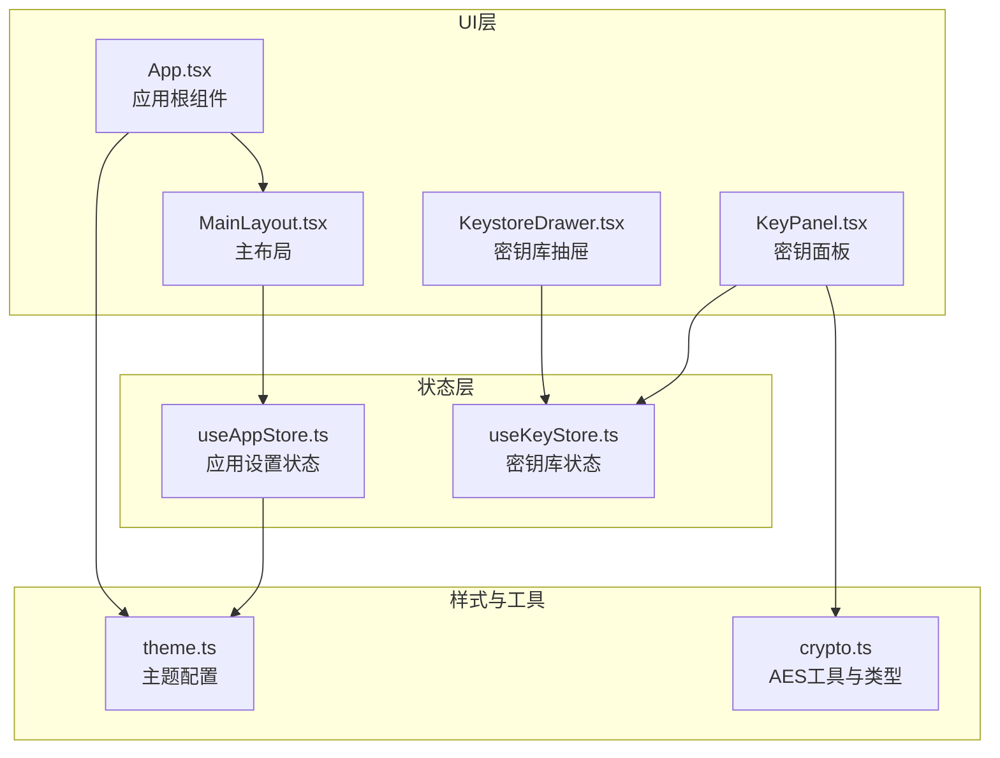
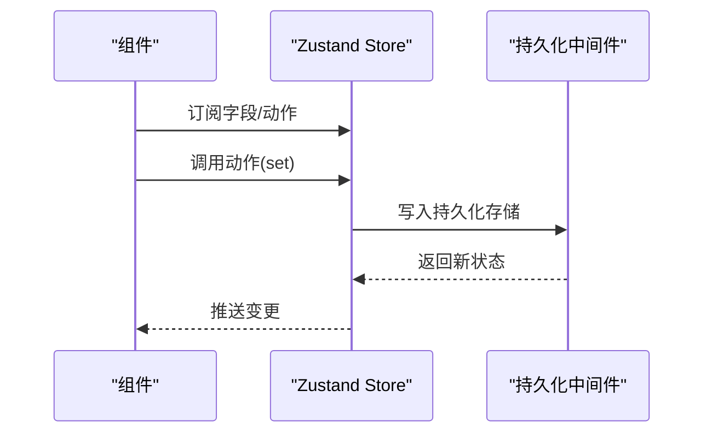
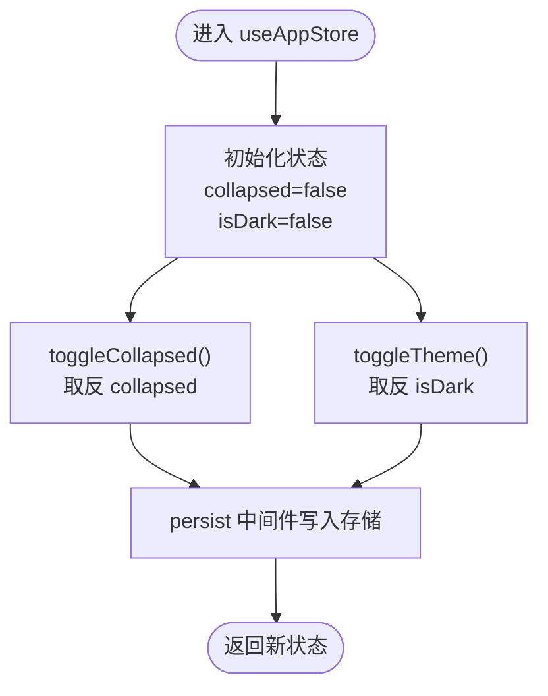
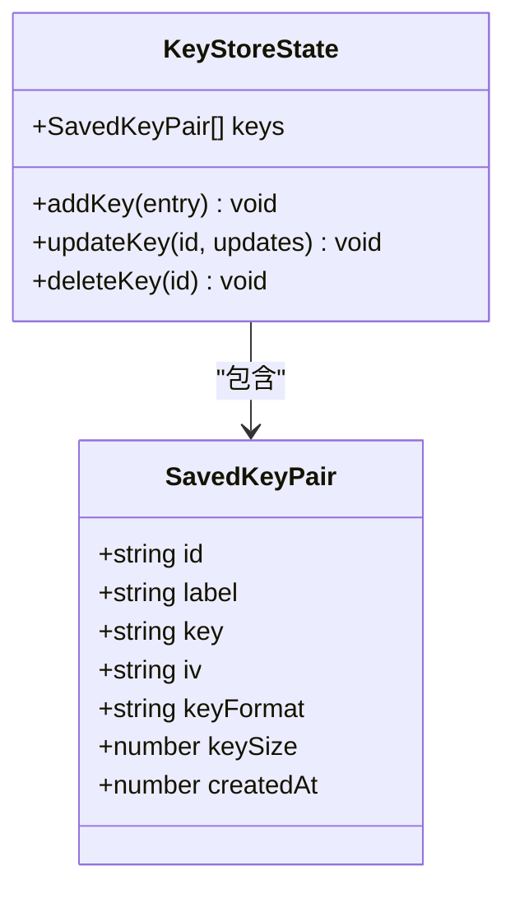
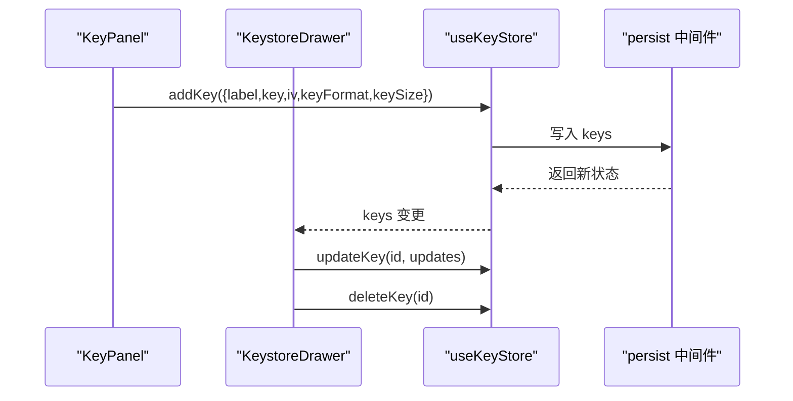
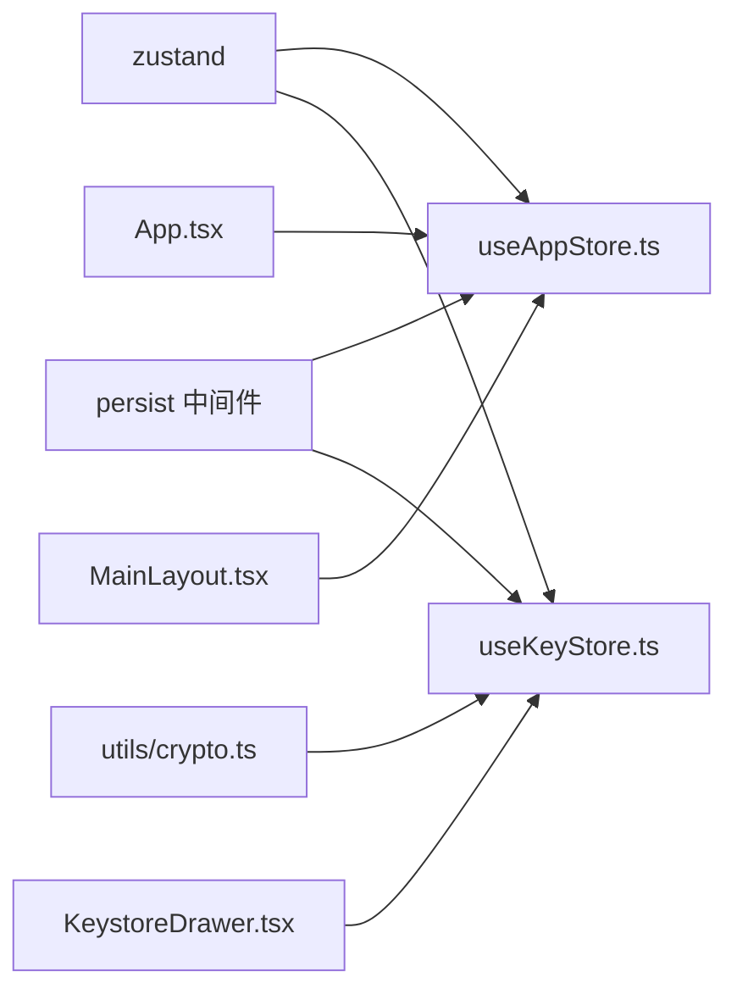

# 状态管理

<cite>
**本文引用的文件**
- [src/store/useAppStore.ts](file://src/store/useAppStore.ts)
- [src/store/useKeyStore.ts](file://src/store/useKeyStore.ts)
- [src/App.tsx](file://src/App.tsx)
- [src/layouts/MainLayout.tsx](file://src/layouts/MainLayout.tsx)
- [src/styles/theme.ts](file://src/styles/theme.ts)
- [src/tools/crypto/AesCrypto/KeystoreDrawer.tsx](file://src/tools/crypto/AesCrypto/KeystoreDrawer.tsx)
- [src/tools/crypto/AesCrypto/KeyPanel.tsx](file://src/tools/crypto/AesCrypto/KeyPanel.tsx)
- [src/utils/crypto.ts](file://src/utils/crypto.ts)
- [package.json](file://package.json)
</cite>

## 目录
1. [简介](#简介)
2. [项目结构](#项目结构)
3. [核心组件](#核心组件)
4. [架构总览](#架构总览)
5. [详细组件分析](#详细组件分析)
6. [依赖分析](#依赖分析)
7. [性能考虑](#性能考虑)
8. [故障排查指南](#故障排查指南)
9. [结论](#结论)
10. [附录：状态管理API与最佳实践](#附录状态管理api与最佳实践)

## 简介
本文件系统性梳理 XKUtil 的状态管理体系，重点围绕 Zustand 的架构设计与实现模式，详解两类状态：
- 应用设置状态（useAppStore）：主题切换、侧边栏折叠等全局状态的管理与持久化。
- 密钥库状态（useKeyStore）：密钥对的增删改查、数据持久化与状态同步。

同时覆盖状态订阅机制与组件响应式更新原理、状态调试工具使用、性能优化建议以及最佳实践与常见陷阱。

## 项目结构
状态管理相关代码主要位于 src/store 目录，并在应用入口与布局组件中被消费；加密工具链通过 utils/crypto 提供类型与算法能力，供 AES 工具模块使用。

图表来源
- [src/store/useAppStore.ts:1-24](file://src/store/useAppStore.ts#L1-L24)
- [src/store/useKeyStore.ts:1-47](file://src/store/useKeyStore.ts#L1-L47)
- [src/App.tsx:1-24](file://src/App.tsx#L1-L24)
- [src/layouts/MainLayout.tsx:1-168](file://src/layouts/MainLayout.tsx#L1-L168)
- [src/tools/crypto/AesCrypto/KeystoreDrawer.tsx:1-185](file://src/tools/crypto/AesCrypto/KeystoreDrawer.tsx#L1-L185)
- [src/tools/crypto/AesCrypto/KeyPanel.tsx:1-114](file://src/tools/crypto/AesCrypto/KeyPanel.tsx#L1-L114)
- [src/styles/theme.ts:1-12](file://src/styles/theme.ts#L1-L12)
- [src/utils/crypto.ts:1-222](file://src/utils/crypto.ts#L1-L222)

章节来源
- [src/store/useAppStore.ts:1-24](file://src/store/useAppStore.ts#L1-L24)
- [src/store/useKeyStore.ts:1-47](file://src/store/useKeyStore.ts#L1-L47)
- [src/App.tsx:1-24](file://src/App.tsx#L1-L24)
- [src/layouts/MainLayout.tsx:1-168](file://src/layouts/MainLayout.tsx#L1-L168)
- [src/styles/theme.ts:1-12](file://src/styles/theme.ts#L1-L12)
- [src/utils/crypto.ts:1-222](file://src/utils/crypto.ts#L1-L222)

## 核心组件
- 应用设置状态（useAppStore）
  - 状态字段：collapsed（侧边栏折叠）、isDark（主题深色模式）
  - 动作函数：toggleCollapsed、toggleTheme
  - 持久化键名：xkutil-app-settings
- 密钥库状态（useKeyStore）
  - 状态字段：keys（SavedKeyPair 数组）
  - 动作函数：addKey、updateKey、deleteKey
  - 持久化键名：xkutil-aes-keystore
  - 数据模型 SavedKeyPair 包含 id、label、key、iv、keyFormat、keySize、createdAt

章节来源
- [src/store/useAppStore.ts:4-23](file://src/store/useAppStore.ts#L4-L23)
- [src/store/useKeyStore.ts:5-20](file://src/store/useKeyStore.ts#L5-L20)
- [src/store/useKeyStore.ts:22-46](file://src/store/useKeyStore.ts#L22-L46)

## 架构总览
Zustand 在本项目中的使用遵循“函数式 Store 定义 + 中间件持久化”的模式。应用设置与密钥库分别独立维护，通过 React 组件订阅所需字段，实现细粒度的响应式更新。

图表来源
- [src/store/useAppStore.ts:11-23](file://src/store/useAppStore.ts#L11-L23)
- [src/store/useKeyStore.ts:22-46](file://src/store/useKeyStore.ts#L22-L46)

## 详细组件分析

### 应用设置状态（useAppStore）
- 设计要点
  - 使用 persist 中间件将 collapsed 与 isDark 持久化到本地存储，键名为 xkutil-app-settings。
  - toggleCollapsed/toggleTheme 以函数式 set 更新状态，避免不必要的重渲染。
- 订阅与更新
  - App 根组件订阅 isDark 并传递给 ConfigProvider，实现主题动态切换。
  - MainLayout 订阅 collapsed 与 isDark，并通过按钮触发 toggleCollapsed/toggleTheme。
- 状态结构
  - collapsed: boolean
  - isDark: boolean
  - toggleCollapsed(): void
  - toggleTheme(): void

图表来源
- [src/store/useAppStore.ts:11-23](file://src/store/useAppStore.ts#L11-L23)

章节来源
- [src/store/useAppStore.ts:4-23](file://src/store/useAppStore.ts#L4-L23)
- [src/App.tsx:9-21](file://src/App.tsx#L9-L21)
- [src/layouts/MainLayout.tsx:22-124](file://src/layouts/MainLayout.tsx#L22-L124)
- [src/styles/theme.ts:3-11](file://src/styles/theme.ts#L3-L11)

### 密钥库状态（useKeyStore）
- 设计要点
  - 使用 persist 中间件将 keys 持久化到本地存储，键名为 xkutil-aes-keystore。
  - addKey 自动生成 id 与 createdAt，updateKey 支持部分更新，deleteKey 基于 id 过滤。
- 订阅与更新
  - KeystoreDrawer 订阅 keys 并提供编辑、删除、加载密钥对的能力。
  - KeyPanel 与 KeystoreDrawer 协同，负责密钥输入、校验与保存到密钥库。
- 数据模型 SavedKeyPair
  - id: string
  - label: string
  - key: string
  - iv: string
  - keyFormat: KeyFormat
  - keySize: KeySize
  - createdAt: number

图表来源
- [src/store/useKeyStore.ts:5-20](file://src/store/useKeyStore.ts#L5-L20)

图表来源
- [src/tools/crypto/AesCrypto/KeyPanel.tsx:1-114](file://src/tools/crypto/AesCrypto/KeyPanel.tsx#L1-L114)
- [src/tools/crypto/AesCrypto/KeystoreDrawer.tsx:26-185](file://src/tools/crypto/AesCrypto/KeystoreDrawer.tsx#L26-L185)
- [src/store/useKeyStore.ts:22-46](file://src/store/useKeyStore.ts#L22-L46)

章节来源
- [src/store/useKeyStore.ts:5-46](file://src/store/useKeyStore.ts#L5-L46)
- [src/tools/crypto/AesCrypto/KeystoreDrawer.tsx:26-185](file://src/tools/crypto/AesCrypto/KeystoreDrawer.tsx#L26-L185)
- [src/tools/crypto/AesCrypto/KeyPanel.tsx:1-114](file://src/tools/crypto/AesCrypto/KeyPanel.tsx#L1-L114)
- [src/utils/crypto.ts:1-222](file://src/utils/crypto.ts#L1-L222)

### 状态订阅机制与组件响应式更新
- 订阅方式
  - App 通过选择器订阅 isDark，仅当 isDark 变化时触发重渲染。
  - MainLayout 同时订阅 collapsed 与 isDark，并绑定按钮点击事件调用对应动作。
  - KeystoreDrawer 订阅 keys，表格与弹窗基于 keys 渲染。
- 响应式更新原理
  - Zustand 基于浅比较进行状态分发，仅当被订阅字段发生引用变化时才通知组件。
  - 动作函数内部通过 set 返回的新对象触发订阅者更新。
- 注意事项
  - 避免在动作中直接修改旧数组/对象，应返回全新引用以确保订阅生效。
  - 对于复杂对象更新，推荐使用函数式 set 或浅拷贝策略。

章节来源
- [src/App.tsx:9-21](file://src/App.tsx#L9-L21)
- [src/layouts/MainLayout.tsx:22-124](file://src/layouts/MainLayout.tsx#L22-L124)
- [src/tools/crypto/AesCrypto/KeystoreDrawer.tsx:26-185](file://src/tools/crypto/AesCrypto/KeystoreDrawer.tsx#L26-L185)

## 依赖分析
- 外部依赖
  - zustand：状态管理核心库
  - zustand/middleware/persist：持久化中间件
  - crypto-js：AES 加密/解密与随机数生成
- 内部依赖关系
  - useKeyStore 依赖 utils/crypto 类型与工具函数（KeyFormat、KeySize、generateRandomKey、generateRandomIV 等）
  - App 与 MainLayout 依赖 useAppStore
  - KeystoreDrawer 依赖 useKeyStore

图表来源
- [package.json:12-24](file://package.json#L12-L24)
- [src/store/useAppStore.ts:1-2](file://src/store/useAppStore.ts#L1-L2)
- [src/store/useKeyStore.ts:1-2](file://src/store/useKeyStore.ts#L1-L2)
- [src/utils/crypto.ts:1-222](file://src/utils/crypto.ts#L1-L222)
- [src/App.tsx:6](file://src/App.tsx#L6)
- [src/layouts/MainLayout.tsx:11](file://src/layouts/MainLayout.tsx#L11)
- [src/tools/crypto/AesCrypto/KeystoreDrawer.tsx:16](file://src/tools/crypto/AesCrypto/KeystoreDrawer.tsx#L16)

章节来源
- [package.json:12-24](file://package.json#L12-L24)

## 性能考虑
- 状态拆分与订阅粒度
  - 将应用设置与密钥库拆分为独立 store，避免无关状态变更导致的组件重渲染。
- 函数式 set 与不可变更新
  - 使用 set(state => ...) 返回全新对象/数组，确保浅比较有效。
- 持久化策略
  - 仅对必要字段启用持久化，减少存储体积与序列化开销。
- 组件层面
  - 使用 React.memo、useMemo/useCallback 缓存昂贵计算与子组件。
  - 表格类组件按需分页或虚拟化（如 keys 较大时）。

## 故障排查指南
- 主题不生效
  - 检查 App 是否正确订阅 isDark 并传入 ConfigProvider theme。
  - 确认 useAppStore 的 isDark 初始值与持久化是否一致。
- 侧边栏折叠无效
  - 检查 MainLayout 中 toggleCollapsed 是否被调用，以及 collapsed 是否被正确订阅。
- 密钥库无法读取/保存
  - 检查浏览器本地存储中键名是否为 xkutil-aes-keystore。
  - 确认 addKey/updateKey/deleteKey 是否被调用且返回了新状态。
- AES 加解密报错
  - 检查密钥与 IV 长度格式是否符合预期（Hex/UTF-8、KeySize、ECB/非 ECB 模式下的 IV）。
  - 使用 isValidDecryption 判断解密结果可读性。

章节来源
- [src/App.tsx:9-21](file://src/App.tsx#L9-L21)
- [src/layouts/MainLayout.tsx:22-124](file://src/layouts/MainLayout.tsx#L22-L124)
- [src/store/useKeyStore.ts:22-46](file://src/store/useKeyStore.ts#L22-L46)
- [src/utils/crypto.ts:59-162](file://src/utils/crypto.ts#L59-L162)

## 结论
XKUtil 的状态管理以 Zustand 为核心，采用“store + persist 中间件”的轻量模式，实现了应用设置与密钥库的清晰分离与高效持久化。通过细粒度订阅与函数式更新，保证了组件响应式的稳定性与性能。配合合理的调试与优化策略，可在保持开发体验的同时获得良好的运行效率。

## 附录：状态管理API与最佳实践

### API 文档

- useAppStore
  - 状态字段
    - collapsed: boolean
    - isDark: boolean
  - 动作函数
    - toggleCollapsed(): void
    - toggleTheme(): void
  - 持久化键名
    - xkutil-app-settings

- useKeyStore
  - 状态字段
    - keys: SavedKeyPair[]
  - 动作函数
    - addKey(entry: Omit<SavedKeyPair, "id" | "createdAt">): void
    - updateKey(id: string, updates: Partial<Omit<SavedKeyPair, "id" | "createdAt">>): void
    - deleteKey(id: string): void
  - 持久化键名
    - xkutil-aes-keystore

- SavedKeyPair
  - id: string
  - label: string
  - key: string
  - iv: string
  - keyFormat: KeyFormat
  - keySize: KeySize
  - createdAt: number

章节来源
- [src/store/useAppStore.ts:4-23](file://src/store/useAppStore.ts#L4-L23)
- [src/store/useKeyStore.ts:5-46](file://src/store/useKeyStore.ts#L5-L46)

### 最佳实践
- 将全局状态与局部状态分离，避免跨组件共享过多无关状态。
- 使用函数式 set 返回全新引用，确保订阅生效。
- 对需要持久化的状态，明确键名与版本迁移策略。
- 在组件中按需订阅，减少不必要的重渲染。
- 对于大型列表或复杂对象，考虑分页、虚拟化与缓存策略。

### 常见陷阱
- 直接修改旧数组/对象而非返回新引用，导致订阅不触发。
- 在动作中执行副作用（如网络请求）未处理异常，影响状态一致性。
- 忽略密钥与 IV 的长度与格式校验，导致加解密失败。
- 将所有状态放入单一 store，造成过度重渲染与调试困难。