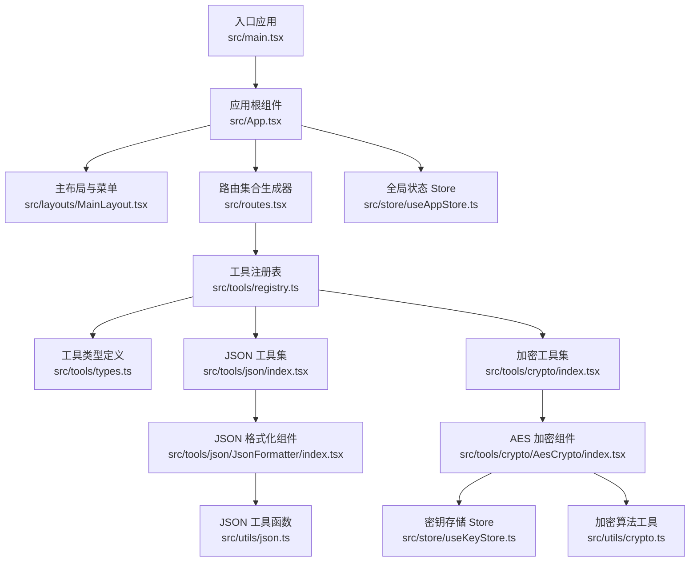
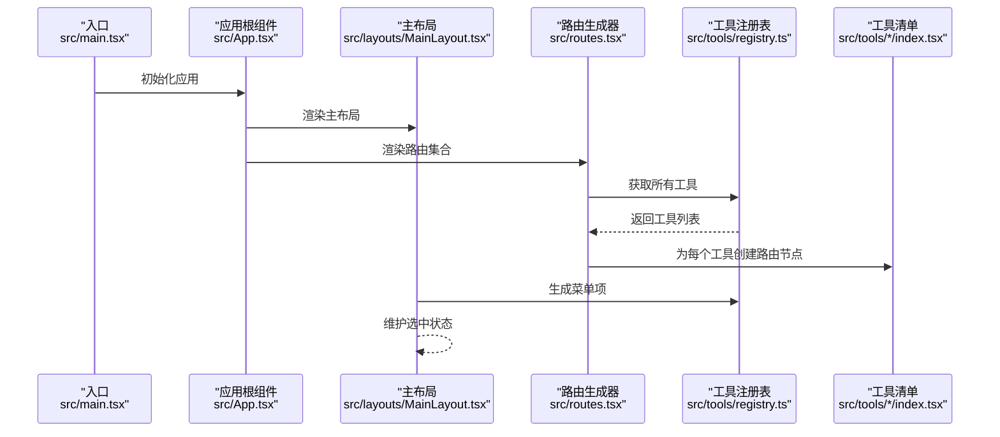
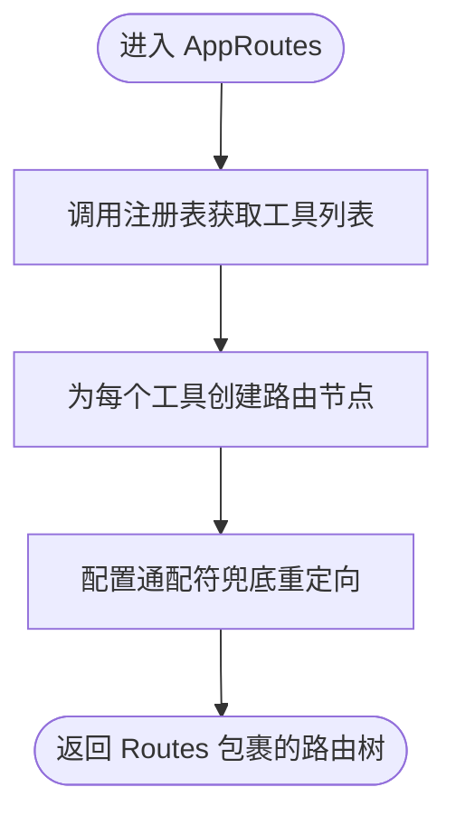
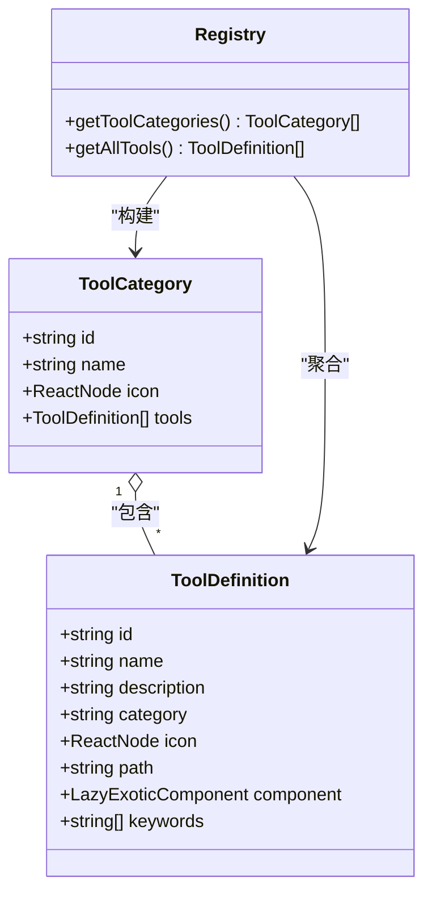
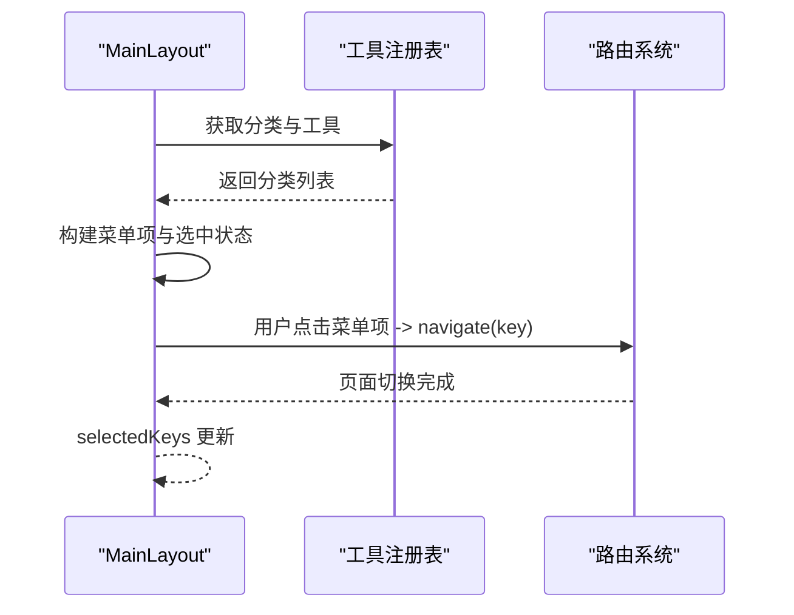
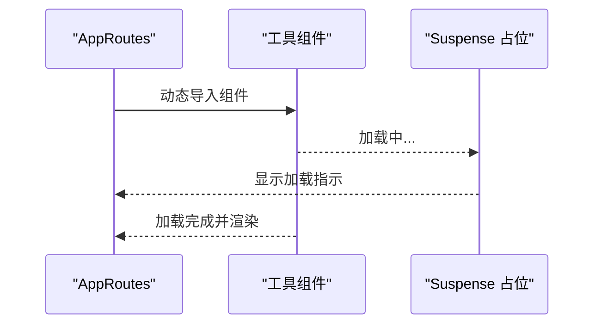
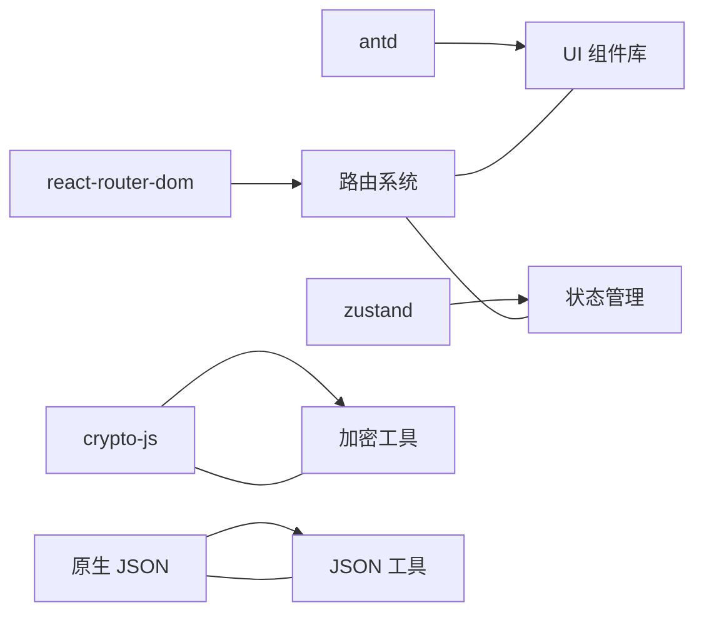

# 路由系统

<cite>
**本文引用的文件**
- [src/routes.tsx](file://src/routes.tsx)
- [src/App.tsx](file://src/App.tsx)
- [src/main.tsx](file://src/main.tsx)
- [src/tools/registry.ts](file://src/tools/registry.ts)
- [src/tools/types.ts](file://src/tools/types.ts)
- [src/tools/json/index.tsx](file://src/tools/json/index.tsx)
- [src/tools/crypto/index.tsx](file://src/tools/crypto/index.tsx)
- [src/layouts/MainLayout.tsx](file://src/layouts/MainLayout.tsx)
- [src/store/useAppStore.ts](file://src/store/useAppStore.ts)
- [src/store/useKeyStore.ts](file://src/store/useKeyStore.ts)
- [src/utils/crypto.ts](file://src/utils/crypto.ts)
- [src/utils/json.ts](file://src/utils/json.ts)
- [package.json](file://package.json)
- [vite.config.ts](file://vite.config.ts)
</cite>

## 目录
1. [简介](#简介)
2. [项目结构](#项目结构)
3. [核心组件](#核心组件)
4. [架构总览](#架构总览)
5. [详细组件分析](#详细组件分析)
6. [依赖分析](#依赖分析)
7. [性能考虑](#性能考虑)
8. [故障排查指南](#故障排查指南)
9. [结论](#结论)
10. [附录](#附录)

## 简介
本文件系统性梳理 XKUtil 的路由体系与动态路由配置机制，重点覆盖以下方面：
- 基于工具注册表的路由自动生成功能
- 组件懒加载与代码分割策略
- 路由导航管理、面包屑与活动状态跟踪
- 路由守卫与权限控制机制现状与建议
- 路由配置选项、参数传递与状态同步方案
- 性能优化技巧与最佳实践
- 扩展性设计与未来功能规划

## 项目结构
XKUtil 采用“工具即路由”的设计理念：每个工具通过注册表统一声明，运行时自动生成路由配置，从而实现零样板代码的动态路由。

图表来源
- [src/main.tsx:1-11](file://src/main.tsx#L1-L11)
- [src/App.tsx:1-24](file://src/App.tsx#L1-L24)
- [src/routes.tsx:1-29](file://src/routes.tsx#L1-L29)
- [src/tools/registry.ts:1-39](file://src/tools/registry.ts#L1-L39)
- [src/tools/types.ts:1-20](file://src/tools/types.ts#L1-L20)
- [src/tools/json/index.tsx:1-27](file://src/tools/json/index.tsx#L1-L27)
- [src/tools/crypto/index.tsx:1-17](file://src/tools/crypto/index.tsx#L1-L17)
- [src/layouts/MainLayout.tsx:1-168](file://src/layouts/MainLayout.tsx#L1-L168)
- [src/store/useAppStore.ts:1-24](file://src/store/useAppStore.ts#L1-L24)
- [src/store/useKeyStore.ts:1-47](file://src/store/useKeyStore.ts#L1-L47)
- [src/utils/crypto.ts:1-222](file://src/utils/crypto.ts#L1-L222)
- [src/utils/json.ts:1-116](file://src/utils/json.ts#L1-L116)

章节来源
- [src/main.tsx:1-11](file://src/main.tsx#L1-L11)
- [src/App.tsx:1-24](file://src/App.tsx#L1-L24)
- [src/routes.tsx:1-29](file://src/routes.tsx#L1-L29)
- [src/tools/registry.ts:1-39](file://src/tools/registry.ts#L1-L39)
- [src/tools/types.ts:1-20](file://src/tools/types.ts#L1-L20)
- [src/tools/json/index.tsx:1-27](file://src/tools/json/index.tsx#L1-L27)
- [src/tools/crypto/index.tsx:1-17](file://src/tools/crypto/index.tsx#L1-L17)
- [src/layouts/MainLayout.tsx:1-168](file://src/layouts/MainLayout.tsx#L1-L168)
- [src/store/useAppStore.ts:1-24](file://src/store/useAppStore.ts#L1-L24)
- [src/store/useKeyStore.ts:1-47](file://src/store/useKeyStore.ts#L1-L47)
- [src/utils/crypto.ts:1-222](file://src/utils/crypto.ts#L1-L222)
- [src/utils/json.ts:1-116](file://src/utils/json.ts#L1-L116)

## 核心组件
- 动态路由生成器：根据注册表动态构建路由节点，支持回退到首个工具路径。
- 工具注册表：集中管理工具分类与工具清单，提供分类聚合与工具列表查询。
- 工具类型定义：统一描述工具元数据（id、name、path、component 等），确保类型安全。
- 主布局与菜单：基于注册表生成侧边菜单，结合路由状态维护选中项。
- 全局状态与密钥存储：为应用主题、侧边栏折叠等提供持久化状态；为 AES 工具提供密钥持久化。

章节来源
- [src/routes.tsx:6-28](file://src/routes.tsx#L6-L28)
- [src/tools/registry.ts:25-38](file://src/tools/registry.ts#L25-L38)
- [src/tools/types.ts:3-19](file://src/tools/types.ts#L3-L19)
- [src/layouts/MainLayout.tsx:22-82](file://src/layouts/MainLayout.tsx#L22-L82)
- [src/store/useAppStore.ts:11-23](file://src/store/useAppStore.ts#L11-L23)
- [src/store/useKeyStore.ts:22-46](file://src/store/useKeyStore.ts#L22-L46)

## 架构总览
XKUtil 的路由系统围绕“工具即资源”展开：工具在注册表中声明，运行时由路由生成器遍历注册表，为每个工具创建对应的路由节点；同时，主布局从注册表派生菜单项，实现导航与活动状态的一致性。

图表来源
- [src/main.tsx:6-10](file://src/main.tsx#L6-L10)
- [src/App.tsx:14-18](file://src/App.tsx#L14-L18)
- [src/layouts/MainLayout.tsx:29-82](file://src/layouts/MainLayout.tsx#L29-L82)
- [src/routes.tsx:6-28](file://src/routes.tsx#L6-L28)
- [src/tools/registry.ts:25-27](file://src/tools/registry.ts#L25-L27)
- [src/tools/json/index.tsx:5-26](file://src/tools/json/index.tsx#L5-L26)
- [src/tools/crypto/index.tsx:5-16](file://src/tools/crypto/index.tsx#L5-L16)

## 详细组件分析

### 动态路由生成器（AppRoutes）
- 自动扫描工具注册表，为每个工具生成路由节点
- 使用 Suspense 提供加载占位，提升用户体验
- 通配符路由重定向至首个工具路径，保证兜底访问

图表来源
- [src/routes.tsx:6-28](file://src/routes.tsx#L6-L28)
- [src/tools/registry.ts:25-27](file://src/tools/registry.ts#L25-L27)

章节来源
- [src/routes.tsx:6-28](file://src/routes.tsx#L6-L28)

### 工具注册表与类型系统
- 注册表聚合各工具模块，按分类构建分类列表，并为每个分类填充工具
- 类型定义约束工具元数据，确保 path、component、keywords 等字段一致可用
- 分类名称映射函数提供本地化显示名

图表来源
- [src/tools/types.ts:3-19](file://src/tools/types.ts#L3-L19)
- [src/tools/registry.ts:7-38](file://src/tools/registry.ts#L7-L38)

章节来源
- [src/tools/registry.ts:7-38](file://src/tools/registry.ts#L7-L38)
- [src/tools/types.ts:3-19](file://src/tools/types.ts#L3-L19)

### 菜单与导航（MainLayout）
- 基于注册表生成菜单树，支持分组与子项
- 使用 selectedKeys 与当前路径保持一致，实现活动状态跟踪
- 点击菜单项触发导航，切换到对应工具页面

图表来源
- [src/layouts/MainLayout.tsx:29-82](file://src/layouts/MainLayout.tsx#L29-L82)
- [src/tools/registry.ts:25-27](file://src/tools/registry.ts#L25-L27)

章节来源
- [src/layouts/MainLayout.tsx:22-82](file://src/layouts/MainLayout.tsx#L22-L82)
- [src/tools/registry.ts:25-27](file://src/tools/registry.ts#L25-L27)

### 懒加载与代码分割
- 工具组件通过 React.lazy 延迟加载，配合 Suspense 提供加载态
- Vite 默认支持动态导入的代码分割，无需额外配置
- 通过路由级 Suspense，避免单个工具加载阻塞整体渲染

图表来源
- [src/routes.tsx:10-16](file://src/routes.tsx#L10-L16)
- [src/tools/json/index.tsx:13](file://src/tools/json/index.tsx#L13)
- [src/tools/crypto/index.tsx:13](file://src/tools/crypto/index.tsx#L13)

章节来源
- [src/routes.tsx:10-16](file://src/routes.tsx#L10-L16)
- [src/tools/json/index.tsx:13](file://src/tools/json/index.tsx#L13)
- [src/tools/crypto/index.tsx:13](file://src/tools/crypto/index.tsx#L13)
- [vite.config.ts:1-31](file://vite.config.ts#L1-L31)

### 路由守卫与权限控制
- 当前实现未引入路由守卫或鉴权逻辑
- 建议在 AppRoutes 或路由生成器层增加守卫钩子，用于：
  - 认证检查
  - 角色/权限校验
  - 动态路由权限过滤
- 可结合全局状态 store 维护用户会话与权限矩阵

章节来源
- [src/routes.tsx:6-28](file://src/routes.tsx#L6-L28)
- [src/store/useAppStore.ts:11-23](file://src/store/useAppStore.ts#L11-L23)

### 参数传递与状态同步
- 工具间无跨页参数传递需求，当前通过全局状态与工具内部状态管理数据
- 若需跨页参数传递，可考虑：
  - URL 查询参数传递简单配置
  - 全局状态 store 同步复杂状态
  - 工具内部状态持久化（如 AES 工具的密钥存储）

章节来源
- [src/store/useKeyStore.ts:22-46](file://src/store/useKeyStore.ts#L22-L46)
- [src/utils/crypto.ts:59-162](file://src/utils/crypto.ts#L59-L162)

### 路由配置选项
- 路由基础配置：HashRouter、Suspense 占位、通配符兜底
- 工具路径与组件：由注册表统一声明，确保 path 与 component 一一对应
- 菜单与路由联动：selectedKeys 与 location.pathname 保持一致

章节来源
- [src/App.tsx:14](file://src/App.tsx#L14)
- [src/routes.tsx:10-16](file://src/routes.tsx#L10-L16)
- [src/layouts/MainLayout.tsx:76](file://src/layouts/MainLayout.tsx#L76)

## 依赖分析
- 路由与导航：react-router-dom 提供路由与导航能力
- UI 与主题：Ant Design 提供菜单、布局与主题配置
- 状态管理：Zustand 提供轻量状态管理与持久化
- 加密与 JSON 工具：crypto-js 与原生 JSON API 支撑工具功能

图表来源
- [package.json:12-25](file://package.json#L12-L25)

章节来源
- [package.json:12-25](file://package.json#L12-L25)

## 性能考虑
- 代码分割：利用 React.lazy 与动态导入，按需加载工具组件，降低首屏体积
- Suspense 占位：在路由切换时提供加载反馈，改善感知性能
- 菜单预构建：在布局层一次性构建菜单，避免重复计算
- 状态持久化：应用设置与密钥存储使用持久化中间件，减少重复初始化开销
- Vite HMR：开发阶段启用热更新，提升迭代效率

章节来源
- [src/routes.tsx:10-16](file://src/routes.tsx#L10-L16)
- [src/layouts/MainLayout.tsx:29-82](file://src/layouts/MainLayout.tsx#L29-L82)
- [src/store/useAppStore.ts:11-23](file://src/store/useAppStore.ts#L11-L23)
- [src/store/useKeyStore.ts:22-46](file://src/store/useKeyStore.ts#L22-L46)
- [vite.config.ts:15-29](file://vite.config.ts#L15-L29)

## 故障排查指南
- 路由无法跳转
  - 检查工具 path 是否唯一且与注册表一致
  - 确认 AppRoutes 中是否正确渲染了工具路由
- 组件未加载
  - 确认组件导出方式与 lazy 导入路径一致
  - 检查 Suspense 占位是否正常显示
- 菜单未高亮
  - 确认 selectedKeys 与当前路径一致
  - 检查菜单项 key 是否与工具 path 对应
- 密钥加载异常（AES 工具）
  - 校验密钥与 IV 长度与格式要求
  - 确认输出格式与解密输入格式一致

章节来源
- [src/routes.tsx:18-24](file://src/routes.tsx#L18-L24)
- [src/tools/json/index.tsx:13](file://src/tools/json/index.tsx#L13)
- [src/tools/crypto/index.tsx:13](file://src/tools/crypto/index.tsx#L13)
- [src/layouts/MainLayout.tsx:76](file://src/layouts/MainLayout.tsx#L76)
- [src/utils/crypto.ts:59-162](file://src/utils/crypto.ts#L59-L162)

## 结论
XKUtil 的路由系统以“工具注册表”为核心，实现了零样板代码的动态路由生成与菜单联动。通过懒加载与代码分割，兼顾了首屏性能与功能扩展性。当前未内置路由守卫与权限控制，建议在未来版本中引入守卫钩子与权限矩阵，以满足更复杂的业务场景。

## 附录
- 扩展性设计建议
  - 引入路由守卫与权限控制
  - 支持嵌套路由与动态子路由
  - 增加面包屑导航与页面标题管理
  - 提供路由参数与查询参数的标准化处理
- 未来功能规划
  - 权限驱动的路由过滤与菜单渲染
  - 路由缓存与预加载策略
  - 多语言路由与国际化导航
  - 路由审计与访问统计