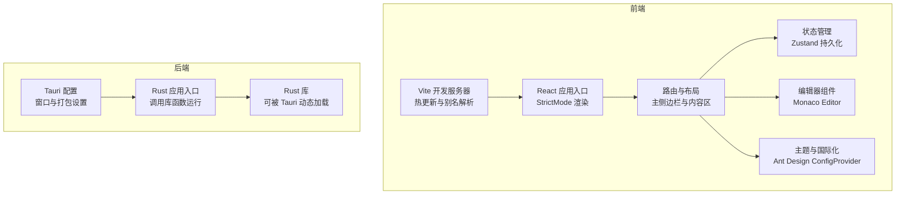
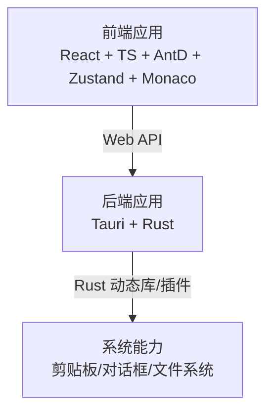
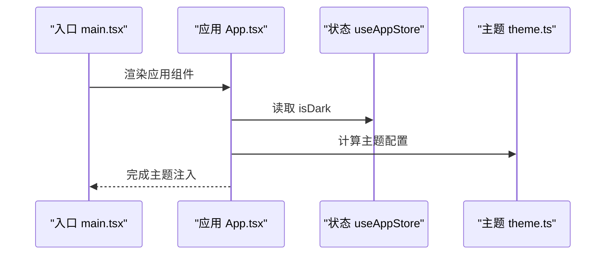
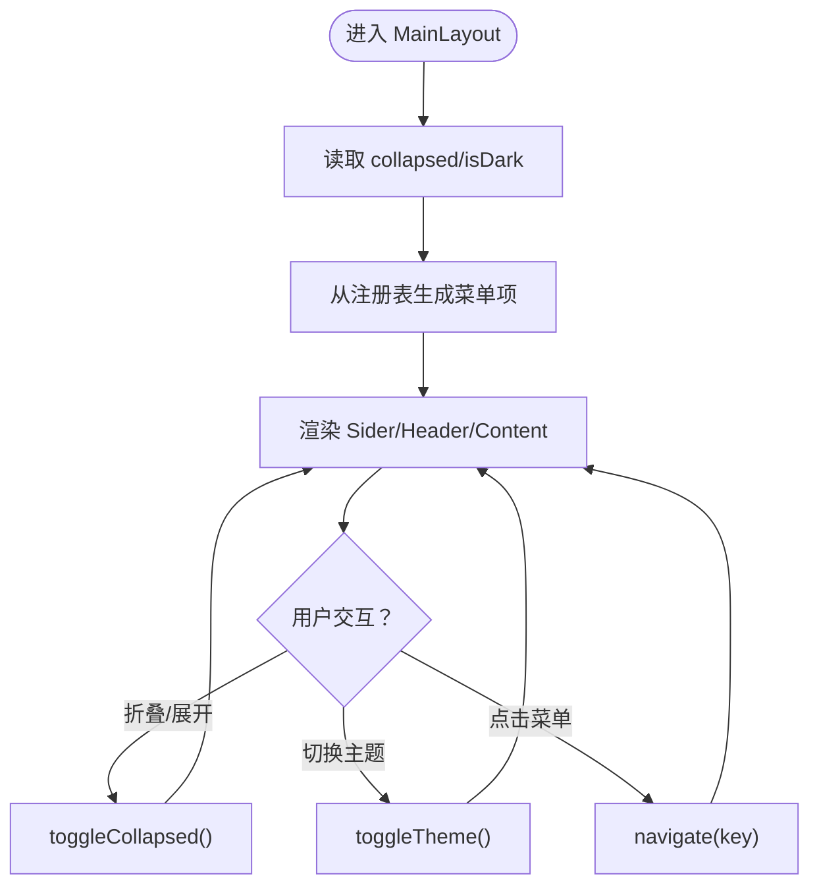
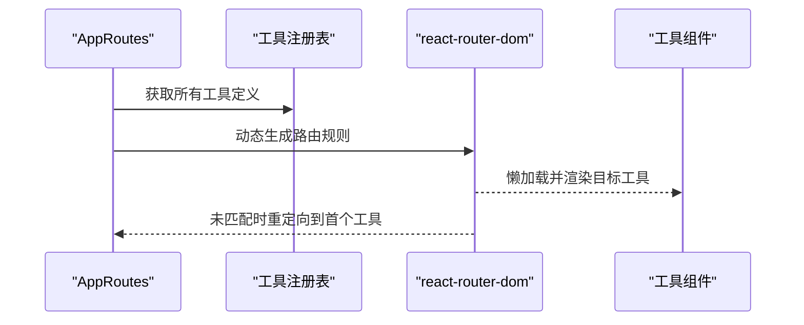
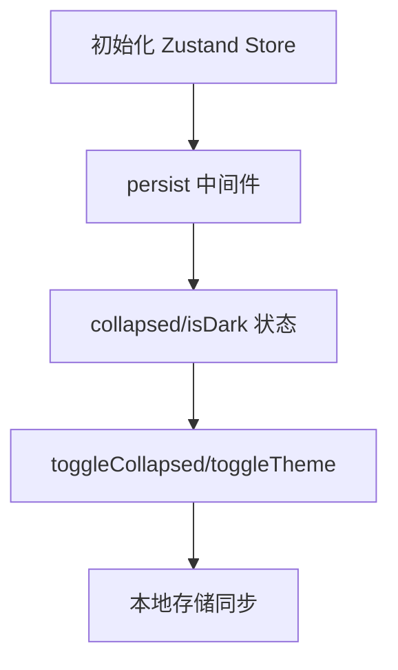
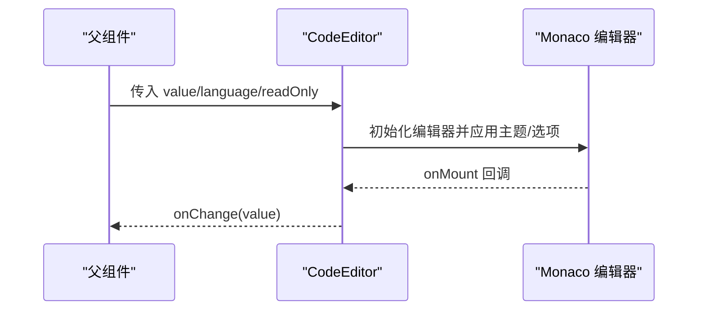
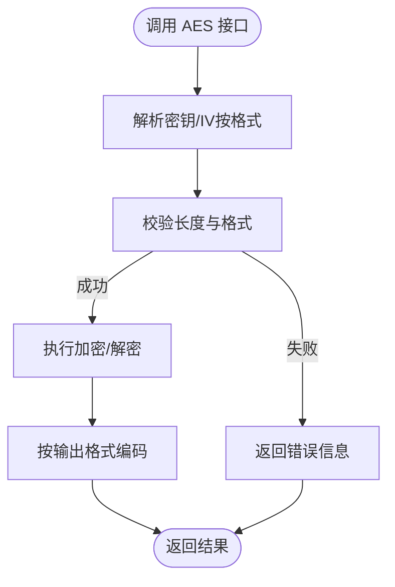
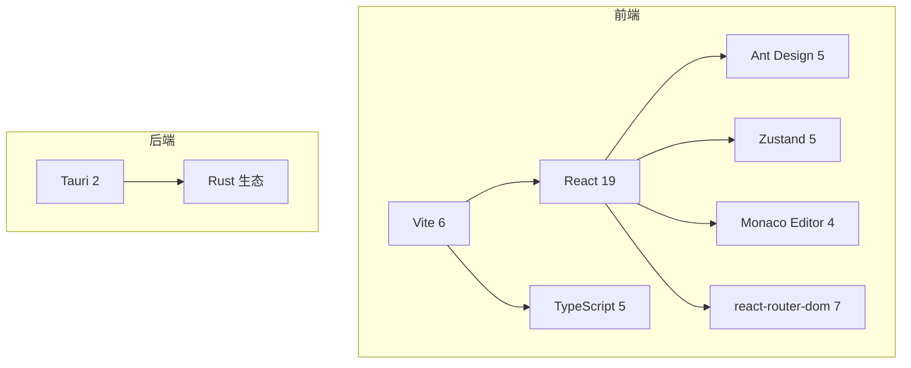

# 技术栈

<cite>
**本文引用的文件**
- [package.json](file://package.json)
- [vite.config.ts](file://vite.config.ts)
- [tsconfig.json](file://tsconfig.json)
- [src/main.tsx](file://src/main.tsx)
- [src/App.tsx](file://src/App.tsx)
- [src/layouts/MainLayout.tsx](file://src/layouts/MainLayout.tsx)
- [src/routes.tsx](file://src/routes.tsx)
- [src/components/CodeEditor/index.tsx](file://src/components/CodeEditor/index.tsx)
- [src/store/useAppStore.ts](file://src/store/useAppStore.ts)
- [src/styles/theme.ts](file://src/styles/theme.ts)
- [src/utils/crypto.ts](file://src/utils/crypto.ts)
- [src-tauri/Cargo.toml](file://src-tauri/Cargo.toml)
- [src-tauri/src/main.rs](file://src-tauri/src/main.rs)
- [src-tauri/tauri.conf.json](file://src-tauri/tauri.conf.json)
</cite>

## 目录
1. [简介](#简介)
2. [项目结构](#项目结构)
3. [核心组件](#核心组件)
4. [架构总览](#架构总览)
5. [详细组件分析](#详细组件分析)
6. [依赖关系分析](#依赖关系分析)
7. [性能与安全考量](#性能与安全考量)
8. [故障排查指南](#故障排查指南)
9. [结论](#结论)
10. [附录：版本兼容性与升级建议](#附录版本兼容性与升级建议)

## 简介
本文件系统化梳理 XKUtil 的技术栈与实现细节，覆盖前端（React、TypeScript、Ant Design、Zustand、Monaco Editor）与后端（Rust、Tauri、Vite）的关键选型、架构设计、数据与控制流、依赖关系、性能与安全考量，并给出版本兼容性与升级注意事项，帮助开发者快速理解与维护该跨平台桌面应用。

## 项目结构
项目采用“前端 Vite + React + TypeScript + Ant Design + Zustand + Monaco Editor”与“后端 Rust + Tauri”的分层架构。前端通过 Vite 提供开发服务器与构建能力；Tauri 将前端产物打包为原生桌面应用，Rust 负责系统级能力与安全逻辑。

图表来源
- [vite.config.ts:1-31](file://vite.config.ts#L1-L31)
- [src/main.tsx:1-11](file://src/main.tsx#L1-L11)
- [src/App.tsx:1-24](file://src/App.tsx#L1-L24)
- [src/layouts/MainLayout.tsx:1-168](file://src/layouts/MainLayout.tsx#L1-L168)
- [src/components/CodeEditor/index.tsx:1-57](file://src/components/CodeEditor/index.tsx#L1-L57)
- [src/store/useAppStore.ts:1-24](file://src/store/useAppStore.ts#L1-L24)
- [src/styles/theme.ts:1-12](file://src/styles/theme.ts#L1-L12)
- [src-tauri/tauri.conf.json:1-39](file://src-tauri/tauri.conf.json#L1-L39)
- [src-tauri/src/main.rs:1-6](file://src-tauri/src/main.rs#L1-L6)

章节来源
- [package.json:1-36](file://package.json#L1-L36)
- [vite.config.ts:1-31](file://vite.config.ts#L1-L31)
- [tsconfig.json:1-26](file://tsconfig.json#L1-L26)
- [src/main.tsx:1-11](file://src/main.tsx#L1-L11)
- [src/App.tsx:1-24](file://src/App.tsx#L1-L24)
- [src-tauri/tauri.conf.json:1-39](file://src-tauri/tauri.conf.json#L1-L39)
- [src-tauri/Cargo.toml:1-23](file://src-tauri/Cargo.toml#L1-L23)

## 核心组件
- 前端框架与类型系统
  - React 19.1.0：用于声明式 UI 构建与组件化组织。
  - TypeScript 5.8.3：严格类型检查，提升开发效率与可维护性。
  - Ant Design 5.24.0：提供企业级 UI 组件与设计体系。
- 状态管理
  - Zustand 5.0.5：轻量、易用的状态容器，结合持久化中间件实现设置记忆。
- 代码编辑
  - @monaco-editor/react 4.7.0：在浏览器中提供高性能代码编辑体验。
- 路由与布局
  - react-router-dom 7.6.0：支持动态路由与懒加载工具页。
- 构建与开发体验
  - Vite 6.3.5：快速冷启动与热更新，配合 @vitejs/plugin-react。
- 后端与系统集成
  - Tauri 2：跨平台桌面应用框架，Rust 作为系统能力实现语言。
  - @tauri-apps/api 及插件：剪贴板、对话框、文件系统等系统能力。
- 工具与加密
  - crypto-js 4.2.0：提供 AES 加密解密与随机数生成等实用工具。

章节来源
- [package.json:12-34](file://package.json#L12-L34)
- [src/store/useAppStore.ts:1-24](file://src/store/useAppStore.ts#L1-L24)
- [src/components/CodeEditor/index.tsx:1-57](file://src/components/CodeEditor/index.tsx#L1-L57)
- [src/routes.tsx:1-29](file://src/routes.tsx#L1-L29)
- [src-tauri/Cargo.toml:15-23](file://src-tauri/Cargo.toml#L15-L23)

## 架构总览
前端通过 Vite 提供开发与构建服务，React 应用在入口处完成渲染与主题注入；路由与布局负责工具页导航与内容展示；状态管理集中于 Zustand；Monaco Editor 提供代码编辑能力；Ant Design 提供统一的 UI 与交互规范。后端以 Tauri 为桥梁，Rust 实现系统能力并通过插件暴露给前端使用。

图表来源
- [src/main.tsx:1-11](file://src/main.tsx#L1-L11)
- [src/App.tsx:1-24](file://src/App.tsx#L1-L24)
- [src-tauri/tauri.conf.json:1-39](file://src-tauri/tauri.conf.json#L1-L39)
- [src-tauri/Cargo.toml:15-23](file://src-tauri/Cargo.toml#L15-L23)

## 详细组件分析

### 前端应用入口与主题
- 入口文件负责创建根节点并启用 React.StrictMode，确保开发期更早发现潜在问题。
- 应用顶层通过 Ant Design 的 ConfigProvider 注入语言与主题配置，主题根据 Zustand 中的 isDark 切换算法与 token。

图表来源
- [src/main.tsx:1-11](file://src/main.tsx#L1-L11)
- [src/App.tsx:1-24](file://src/App.tsx#L1-L24)
- [src/store/useAppStore.ts:1-24](file://src/store/useAppStore.ts#L1-L24)
- [src/styles/theme.ts:1-12](file://src/styles/theme.ts#L1-L12)

章节来源
- [src/main.tsx:1-11](file://src/main.tsx#L1-L11)
- [src/App.tsx:1-24](file://src/App.tsx#L1-L24)
- [src/styles/theme.ts:1-12](file://src/styles/theme.ts#L1-L12)

### 主布局与侧边导航
- 使用 Ant Design Layout/Sider/Header/Content 构建三段式布局。
- 侧边菜单基于工具分类与工具注册表动态生成，点击跳转至对应路由。
- 顶部包含折叠切换与主题切换按钮，联动 Zustand 状态与主题计算。

图表来源
- [src/layouts/MainLayout.tsx:1-168](file://src/layouts/MainLayout.tsx#L1-L168)
- [src/store/useAppStore.ts:1-24](file://src/store/useAppStore.ts#L1-L24)

章节来源
- [src/layouts/MainLayout.tsx:1-168](file://src/layouts/MainLayout.tsx#L1-L168)
- [src/routes.tsx:1-29](file://src/routes.tsx#L1-L29)

### 路由与工具页加载
- 使用 react-router-dom 的 Routes/Route 动态注册所有工具页。
- 工具页采用 Suspense 与 Spin 提供加载占位，避免首屏闪烁。
- 未匹配路径自动重定向到首个工具页，保证可用性。

图表来源
- [src/routes.tsx:1-29](file://src/routes.tsx#L1-L29)

章节来源
- [src/routes.tsx:1-29](file://src/routes.tsx#L1-L29)

### 状态管理（Zustand）
- 使用 create/persist 创建带持久化的应用状态，包含 collapsed 与 isDark 等字段。
- 通过命名空间存储（xkutil-app-settings）实现跨会话记忆。

图表来源
- [src/store/useAppStore.ts:1-24](file://src/store/useAppStore.ts#L1-L24)

章节来源
- [src/store/useAppStore.ts:1-24](file://src/store/useAppStore.ts#L1-L24)

### 代码编辑器（Monaco Editor）
- 封装 CodeEditor 组件，支持语言、只读、高度、占位符等参数。
- 自动适配 Ant Design 的深色/浅色主题，设置编辑器基础选项（字体、行高亮、自动布局等）。
- 与上层组件通过 onChange 回调进行数据双向绑定。

图表来源
- [src/components/CodeEditor/index.tsx:1-57](file://src/components/CodeEditor/index.tsx#L1-L57)

章节来源
- [src/components/CodeEditor/index.tsx:1-57](file://src/components/CodeEditor/index.tsx#L1-L57)

### 加密工具（AES）
- 提供 AES 加密/解密、随机密钥与 IV 生成、输入校验与输出有效性判断。
- 支持多种模式（ECB/CBC/CFB/OFB/CTR）、填充方式、输出格式与密钥格式。
- 对异常进行捕获并返回结构化结果，便于 UI 层提示。

图表来源
- [src/utils/crypto.ts:1-222](file://src/utils/crypto.ts#L1-L222)

章节来源
- [src/utils/crypto.ts:1-222](file://src/utils/crypto.ts#L1-L222)

### 后端与系统集成（Tauri + Rust）
- Tauri 配置定义窗口尺寸、最小尺寸、图标与构建前后钩子。
- Rust 应用入口调用库函数运行，库以静态库/动态库形式被 Tauri 加载。
- Cargo.toml 声明 Tauri 与常用插件依赖，Serde 用于序列化。

图表来源
- [src-tauri/tauri.conf.json:1-39](file://src-tauri/tauri.conf.json#L1-L39)
- [src-tauri/src/main.rs:1-6](file://src-tauri/src/main.rs#L1-L6)
- [src-tauri/Cargo.toml:1-23](file://src-tauri/Cargo.toml#L1-L23)

章节来源
- [src-tauri/tauri.conf.json:1-39](file://src-tauri/tauri.conf.json#L1-L39)
- [src-tauri/src/main.rs:1-6](file://src-tauri/src/main.rs#L1-L6)
- [src-tauri/Cargo.toml:1-23](file://src-tauri/Cargo.toml#L1-L23)

## 依赖关系分析
- 前端依赖
  - React 生态与 Ant Design：提供 UI 与路由能力。
  - Zustand：极简状态管理，减少样板代码。
  - Monaco Editor：高质量代码编辑体验。
  - Vite：开发与构建工具链。
- 后端依赖
  - Tauri 2：跨平台桌面应用框架。
  - Rust 生态：Serde、插件生态提供系统能力。
- 版本耦合
  - React 19 与 react-router-dom 7、Ant Design 5、Zustand 5、Monaco Editor 4、Vite 6、TypeScript 5 在当前配置下协同工作。
  - Tauri 2 与 Rust crate 版本保持一致，避免 ABI 不匹配。

图表来源
- [package.json:12-34](file://package.json#L12-L34)
- [src-tauri/Cargo.toml:15-23](file://src-tauri/Cargo.toml#L15-L23)

章节来源
- [package.json:12-34](file://package.json#L12-L34)
- [src-tauri/Cargo.toml:15-23](file://src-tauri/Cargo.toml#L15-L23)

## 性能与安全考量
- 性能
  - Vite 的快速冷启动与按需模块解析显著提升开发体验；生产构建开启压缩与 Tree-shaking。
  - Monaco Editor 通过最小化配置与自动布局减少重绘开销；深色/浅色主题切换仅影响渲染，不触发全量重绘。
  - Zustand 无中间件时内存占用低，持久化中间件仅在必要时写入存储。
- 安全
  - Tauri 2 默认沙箱与权限模型，结合能力 JSON 控制插件访问范围；当前配置未设置 CSP，建议在生产环境评估并配置。
  - Rust 语言的内存安全与零成本抽象为系统能力提供底层保障；Serde 的 derive 特性降低序列化错误风险。
  - 加密工具对密钥长度、IV 长度与输出格式进行严格校验，避免弱配置导致的安全隐患。

[本节为通用指导，无需列出具体文件来源]

## 故障排查指南
- 开发服务器无法热更新或端口冲突
  - 检查 Vite 配置中的端口与 HMR 设置，确认未被占用。
  - 关注忽略目录配置，避免监听到后端源码导致误触发。
- 主题切换无效
  - 确认 Zustand 中 isDark 状态已变更，且主题计算函数返回预期算法。
- Monaco 编辑器主题不生效
  - 检查编辑器初始化时的主题选择逻辑是否与当前主题一致。
- 路由懒加载白屏
  - 确保 Suspense 的 fallback 正常显示，检查工具注册表是否正确导出组件。
- Tauri 打包后窗口尺寸异常
  - 检查 tauri.conf.json 中窗口尺寸与最小尺寸配置，确保与实际需求一致。
- Rust 插件加载失败
  - 确认 Cargo.toml 中插件版本与 Tauri 版本匹配，清理构建缓存后重新构建。

章节来源
- [vite.config.ts:14-30](file://vite.config.ts#L14-L30)
- [src/styles/theme.ts:1-12](file://src/styles/theme.ts#L1-L12)
- [src/components/CodeEditor/index.tsx:23-34](file://src/components/CodeEditor/index.tsx#L23-L34)
- [src/routes.tsx:10-16](file://src/routes.tsx#L10-L16)
- [src-tauri/tauri.conf.json:12-22](file://src-tauri/tauri.conf.json#L12-L22)
- [src-tauri/Cargo.toml:15-23](file://src-tauri/Cargo.toml#L15-L23)

## 结论
XKUtil 采用现代前端技术栈与 Rust/Tauri 后端组合，兼顾开发效率、性能与安全性。前端通过 React + TypeScript + Ant Design + Zustand + Monaco Editor 构建高效可维护的桌面工具集；后端以 Tauri 2 + Rust 提供跨平台与系统能力。整体架构清晰、模块职责明确，适合持续迭代与扩展。

[本节为总结性内容，无需列出具体文件来源]

## 附录：版本兼容性与升级建议
- 前端版本与兼容性
  - React 19 与 react-router-dom 7、Ant Design 5、Zustand 5、Monaco Editor 4、Vite 6、TypeScript 5 在当前配置下协同稳定。
  - 升级建议：遵循语义化版本，优先升级补丁版本；大版本升级前先在分支验证兼容性与性能回归。
- 后端版本与兼容性
  - Tauri 2 与 Rust crate 版本保持一致，避免 ABI 不匹配；Serde 的 derive 特性与插件生态需同步升级。
  - 升级建议：先升级 Tauri CLI 与 Tauri 2，再升级相关插件；验证打包与运行时行为。
- 开发与构建
  - Vite 与 @vitejs/plugin-react 的组合在当前仓库中已稳定；如升级 Vite，请关注插件生态与配置迁移。
  - TypeScript 5.8.3 与 bundler 模块解析策略配合良好；升级时注意严格模式下的新增检查项。
- 安全与合规
  - 当前未配置 CSP，建议在生产环境评估并添加 CSP；同时定期审计依赖与插件的安全公告。

[本节为通用指导，无需列出具体文件来源]