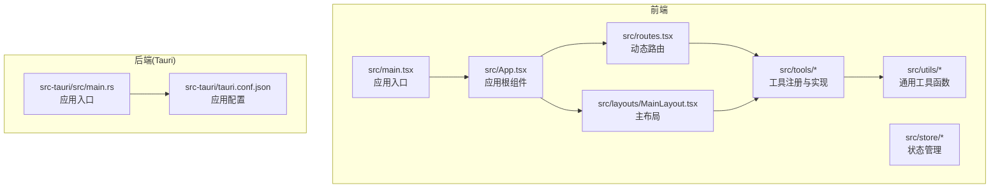
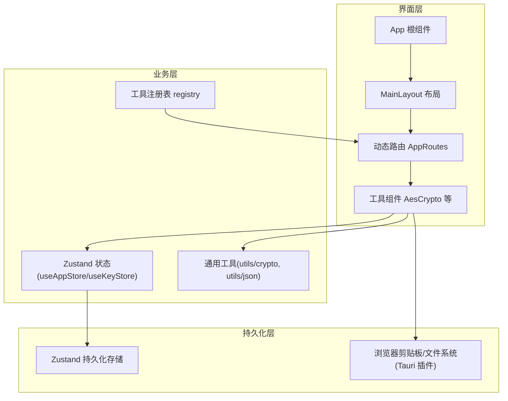
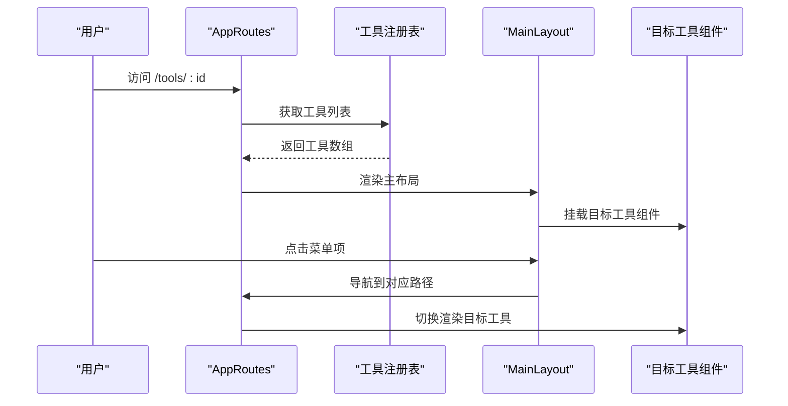
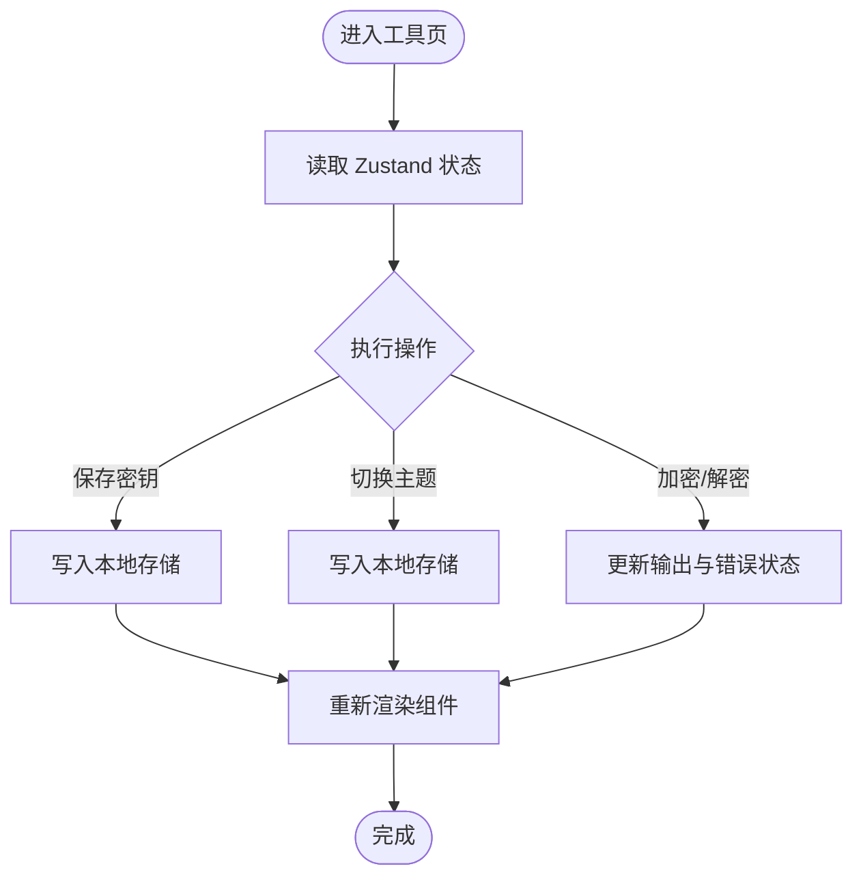
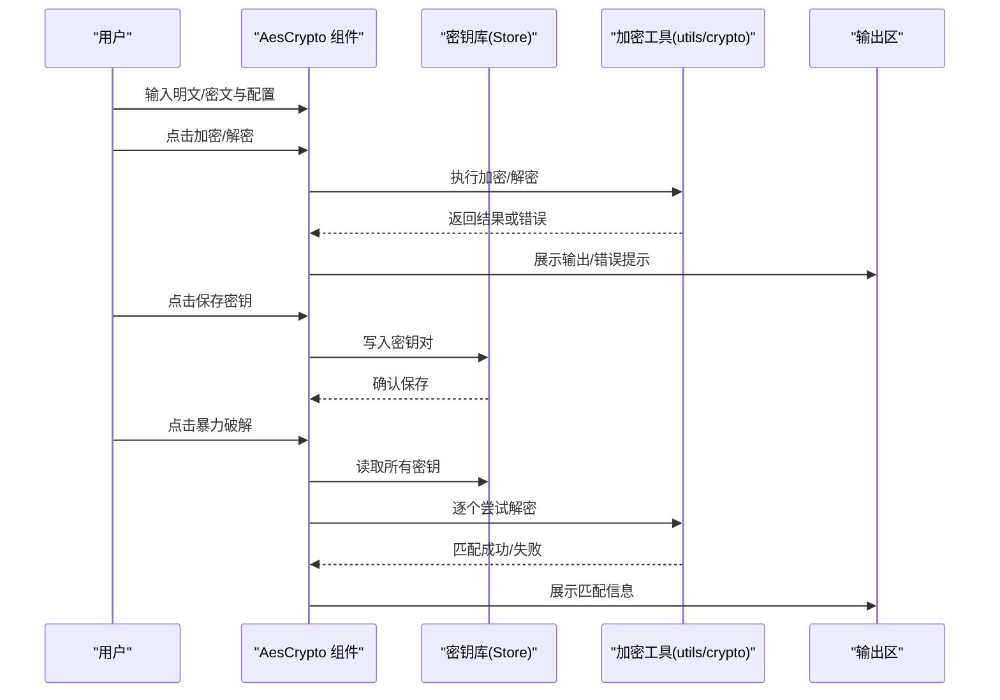
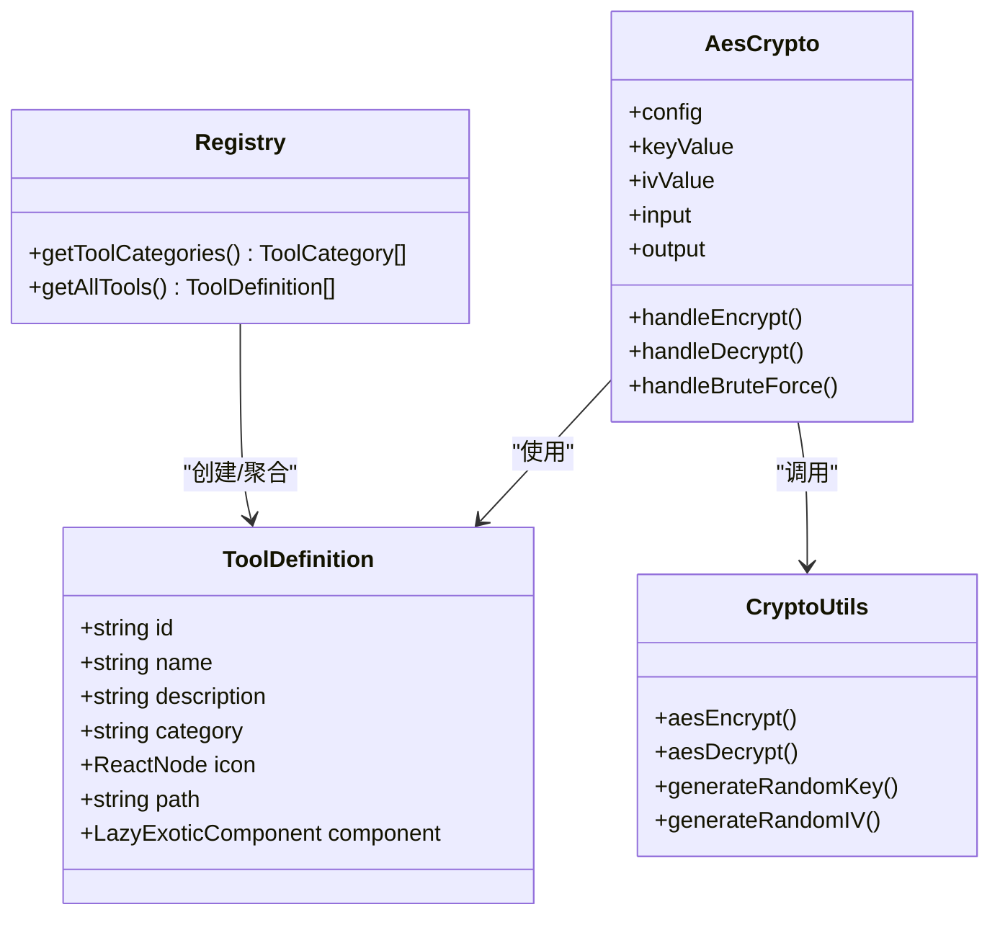
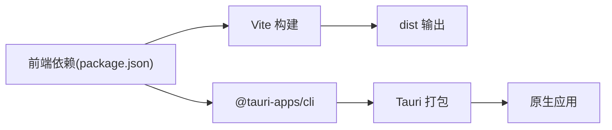

# 架构概览

<cite>
**本文档引用的文件**
- [src/main.tsx](file://src/main.tsx)
- [src/App.tsx](file://src/App.tsx)
- [src/routes.tsx](file://src/routes.tsx)
- [src/layouts/MainLayout.tsx](file://src/layouts/MainLayout.tsx)
- [src/store/useAppStore.ts](file://src/store/useAppStore.ts)
- [src/store/useKeyStore.ts](file://src/store/useKeyStore.ts)
- [src/tools/registry.ts](file://src/tools/registry.ts)
- [src/tools/types.ts](file://src/tools/types.ts)
- [src/tools/crypto/AesCrypto/index.tsx](file://src/tools/crypto/AesCrypto/index.tsx)
- [src/utils/crypto.ts](file://src/utils/crypto.ts)
- [src/utils/json.ts](file://src/utils/json.ts)
- [package.json](file://package.json)
- [src-tauri/src/main.rs](file://src-tauri/src/main.rs)
- [src-tauri/tauri.conf.json](file://src-tauri/tauri.conf.json)
</cite>

## 目录
1. [简介](#简介)
2. [项目结构](#项目结构)
3. [核心组件](#核心组件)
4. [架构总览](#架构总览)
5. [详细组件分析](#详细组件分析)
6. [依赖分析](#依赖分析)
7. [性能考虑](#性能考虑)
8. [故障排除指南](#故障排除指南)
9. [结论](#结论)

## 简介
本项目为一个基于 React 的桌面工具箱应用，采用 Tauri 将前端打包为原生应用。系统通过模块化设计将工具功能以“工具”为单位进行组织，配合集中式状态管理与动态路由，实现可扩展的功能集合。前端负责用户界面与交互，后端（Tauri）提供系统级能力（文件系统、剪贴板、对话框等），二者通过 IPC 进行协作。

## 项目结构
项目采用按功能域分层的目录组织方式：
- 前端核心：入口、应用根组件、路由与布局、状态管理、工具注册与类型定义、通用工具函数
- 工具模块：按类别组织的工具实现，每个工具为独立的 React 组件
- 后端集成：Tauri 应用入口与配置，负责窗口、安全策略与打包

**图表来源**
- [src/main.tsx:1-11](file://src/main.tsx#L1-L11)
- [src/App.tsx:1-24](file://src/App.tsx#L1-L24)
- [src/routes.tsx:1-29](file://src/routes.tsx#L1-L29)
- [src/layouts/MainLayout.tsx:1-168](file://src/layouts/MainLayout.tsx#L1-L168)
- [src/store/useAppStore.ts:1-24](file://src/store/useAppStore.ts#L1-L24)
- [src/store/useKeyStore.ts:1-47](file://src/store/useKeyStore.ts#L1-L47)
- [src/tools/registry.ts:1-39](file://src/tools/registry.ts#L1-L39)
- [src/utils/crypto.ts:1-222](file://src/utils/crypto.ts#L1-L222)
- [src-tauri/src/main.rs:1-6](file://src-tauri/src/main.rs#L1-L6)
- [src-tauri/tauri.conf.json:1-39](file://src-tauri/tauri.conf.json#L1-L39)

**章节来源**
- [src/main.tsx:1-11](file://src/main.tsx#L1-L11)
- [src/App.tsx:1-24](file://src/App.tsx#L1-L24)
- [src/routes.tsx:1-29](file://src/routes.tsx#L1-L29)
- [src/layouts/MainLayout.tsx:1-168](file://src/layouts/MainLayout.tsx#L1-L168)
- [src/store/useAppStore.ts:1-24](file://src/store/useAppStore.ts#L1-L24)
- [src/store/useKeyStore.ts:1-47](file://src/store/useKeyStore.ts#L1-L47)
- [src/tools/registry.ts:1-39](file://src/tools/registry.ts#L1-L39)
- [src/utils/crypto.ts:1-222](file://src/utils/crypto.ts#L1-L222)
- [src-tauri/src/main.rs:1-6](file://src-tauri/src/main.rs#L1-L6)
- [src-tauri/tauri.conf.json:1-39](file://src-tauri/tauri.conf.json#L1-L39)

## 核心组件
- 应用入口与根组件：负责初始化 UI、主题与路由容器
- 动态路由系统：根据工具注册表生成页面路由，支持懒加载与回退
- 主布局：侧边菜单导航、头部控制、内容区域与更新日志弹窗
- 状态管理：应用设置（主题、折叠）与密钥存储（Zustand + 持久化）
- 工具注册与类型：统一描述工具元数据，按分类聚合
- 通用工具：加密与 JSON 处理等跨工具复用能力

**章节来源**
- [src/main.tsx:1-11](file://src/main.tsx#L1-L11)
- [src/App.tsx:1-24](file://src/App.tsx#L1-L24)
- [src/routes.tsx:1-29](file://src/routes.tsx#L1-L29)
- [src/layouts/MainLayout.tsx:1-168](file://src/layouts/MainLayout.tsx#L1-L168)
- [src/store/useAppStore.ts:1-24](file://src/store/useAppStore.ts#L1-L24)
- [src/store/useKeyStore.ts:1-47](file://src/store/useKeyStore.ts#L1-L47)
- [src/tools/registry.ts:1-39](file://src/tools/registry.ts#L1-L39)
- [src/tools/types.ts:1-20](file://src/tools/types.ts#L1-L20)

## 架构总览
系统采用三层职责划分：
- 用户界面层：React 组件树、Ant Design UI、路由与布局
- 业务逻辑层：工具组件内的状态与行为、工具间共享的通用工具函数
- 数据持久化层：Zustand Store（本地持久化）、浏览器剪贴板与文件系统（通过 Tauri 插件）

前端与后端通过 Tauri 的 IPC 协作，前端负责渲染与交互，后端提供系统能力与安全边界。

**图表来源**
- [src/App.tsx:1-24](file://src/App.tsx#L1-L24)
- [src/layouts/MainLayout.tsx:1-168](file://src/layouts/MainLayout.tsx#L1-L168)
- [src/routes.tsx:1-29](file://src/routes.tsx#L1-L29)
- [src/tools/crypto/AesCrypto/index.tsx:1-310](file://src/tools/crypto/AesCrypto/index.tsx#L1-L310)
- [src/store/useAppStore.ts:1-24](file://src/store/useAppStore.ts#L1-L24)
- [src/store/useKeyStore.ts:1-47](file://src/store/useKeyStore.ts#L1-L47)
- [src/utils/crypto.ts:1-222](file://src/utils/crypto.ts#L1-L222)
- [src/utils/json.ts:1-116](file://src/utils/json.ts#L1-L116)

## 详细组件分析

### 路由与布局系统
- 动态路由：从工具注册表读取工具列表，按工具路径生成路由；未命中时重定向至首个工具
- 布局：左侧菜单按工具分类展开，点击跳转对应工具页；顶部提供主题切换与侧边折叠控制

**图表来源**
- [src/routes.tsx:1-29](file://src/routes.tsx#L1-L29)
- [src/tools/registry.ts:1-39](file://src/tools/registry.ts#L1-L39)
- [src/layouts/MainLayout.tsx:1-168](file://src/layouts/MainLayout.tsx#L1-L168)

**章节来源**
- [src/routes.tsx:1-29](file://src/routes.tsx#L1-L29)
- [src/tools/registry.ts:1-39](file://src/tools/registry.ts#L1-L39)
- [src/layouts/MainLayout.tsx:1-168](file://src/layouts/MainLayout.tsx#L1-L168)

### 状态管理与持久化
- 应用设置：主题与侧边栏折叠状态，持久化到本地存储
- 密钥存储：AES 密钥与 IV 的增删改查，持久化到本地存储

**图表来源**
- [src/store/useAppStore.ts:1-24](file://src/store/useAppStore.ts#L1-L24)
- [src/store/useKeyStore.ts:1-47](file://src/store/useKeyStore.ts#L1-L47)
- [src/tools/crypto/AesCrypto/index.tsx:1-310](file://src/tools/crypto/AesCrypto/index.tsx#L1-L310)

**章节来源**
- [src/store/useAppStore.ts:1-24](file://src/store/useAppStore.ts#L1-L24)
- [src/store/useKeyStore.ts:1-47](file://src/store/useKeyStore.ts#L1-L47)
- [src/tools/crypto/AesCrypto/index.tsx:1-310](file://src/tools/crypto/AesCrypto/index.tsx#L1-L310)

### 工具实现与数据流（以 AES 工具为例）
- 配置面板：选择算法模式、填充方式、输出格式、密钥格式与长度
- 密钥面板：输入密钥与 IV，支持从密钥库加载与保存
- 输入输出：单向加密/解密、暴力破解（遍历密钥库尝试解密）
- 状态同步：组件内部状态与全局状态联动，错误与提示信息即时反馈

**图表来源**
- [src/tools/crypto/AesCrypto/index.tsx:1-310](file://src/tools/crypto/AesCrypto/index.tsx#L1-L310)
- [src/utils/crypto.ts:1-222](file://src/utils/crypto.ts#L1-L222)
- [src/store/useKeyStore.ts:1-47](file://src/store/useKeyStore.ts#L1-L47)

**章节来源**
- [src/tools/crypto/AesCrypto/index.tsx:1-310](file://src/tools/crypto/AesCrypto/index.tsx#L1-L310)
- [src/utils/crypto.ts:1-222](file://src/utils/crypto.ts#L1-L222)
- [src/store/useKeyStore.ts:1-47](file://src/store/useKeyStore.ts#L1-L47)

### 设计模式应用
- 工厂模式：工具注册表集中声明工具，返回标准化的工具定义对象，便于扩展新工具
- 策略模式：加密工具通过配置对象切换不同算法模式与填充策略，运行时组合不同策略
- 观察者模式：Zustand Store 订阅状态变化，组件订阅局部状态，实现响应式更新

**图表来源**
- [src/tools/types.ts:1-20](file://src/tools/types.ts#L1-L20)
- [src/tools/registry.ts:1-39](file://src/tools/registry.ts#L1-L39)
- [src/tools/crypto/AesCrypto/index.tsx:1-310](file://src/tools/crypto/AesCrypto/index.tsx#L1-L310)
- [src/utils/crypto.ts:1-222](file://src/utils/crypto.ts#L1-L222)

**章节来源**
- [src/tools/registry.ts:1-39](file://src/tools/registry.ts#L1-L39)
- [src/tools/types.ts:1-20](file://src/tools/types.ts#L1-L20)
- [src/tools/crypto/AesCrypto/index.tsx:1-310](file://src/tools/crypto/AesCrypto/index.tsx#L1-L310)
- [src/utils/crypto.ts:1-222](file://src/utils/crypto.ts#L1-L222)

## 依赖分析
- 前端依赖：React、React Router、Ant Design、Zustand、Monaco Editor、CryptoJS 等
- 后端依赖：Tauri CLI、平台插件（剪贴板、对话框、文件系统）
- 构建链路：Vite 打包前端，Tauri 打包为原生应用

**图表来源**
- [package.json:1-36](file://package.json#L1-L36)
- [src-tauri/tauri.conf.json:1-39](file://src-tauri/tauri.conf.json#L1-L39)

**章节来源**
- [package.json:1-36](file://package.json#L1-L36)
- [src-tauri/tauri.conf.json:1-39](file://src-tauri/tauri.conf.json#L1-L39)

## 性能考虑
- 路由懒加载：工具组件通过懒加载减少首屏体积
- 状态粒度：Zustand 分离应用设置与密钥存储，避免无关重渲染
- 计算优化：加密/解密在工具组件内缓存配置，批量更新输出
- UI 渲染：Ant Design 组件按需渲染，布局使用 Flex 与分割器提升体验

## 故障排除指南
- 加密/解密失败：检查密钥与 IV 长度是否符合配置；确认输出格式与解析方式一致
- 暴力破解无结果：确认密钥库中存在有效密钥对；检查算法模式与密钥长度匹配
- 状态未持久化：确认浏览器允许本地存储；检查存储键名是否被意外清理
- 路由异常：检查工具注册表是否正确导出；确认路径与菜单项一致

**章节来源**
- [src/utils/crypto.ts:1-222](file://src/utils/crypto.ts#L1-L222)
- [src/tools/crypto/AesCrypto/index.tsx:1-310](file://src/tools/crypto/AesCrypto/index.tsx#L1-L310)
- [src/store/useKeyStore.ts:1-47](file://src/store/useKeyStore.ts#L1-L47)
- [src/routes.tsx:1-29](file://src/routes.tsx#L1-L29)

## 结论
该系统通过模块化工具与集中式状态管理实现了清晰的职责分离与良好的可扩展性。前端与后端通过 Tauri 协作，既保证了桌面应用的原生体验，又保持了开发效率。建议后续在以下方面持续演进：完善工具间共享逻辑抽象、引入更细粒度的状态切片、增强错误边界与日志追踪，并探索工具热插拔机制以进一步降低耦合。