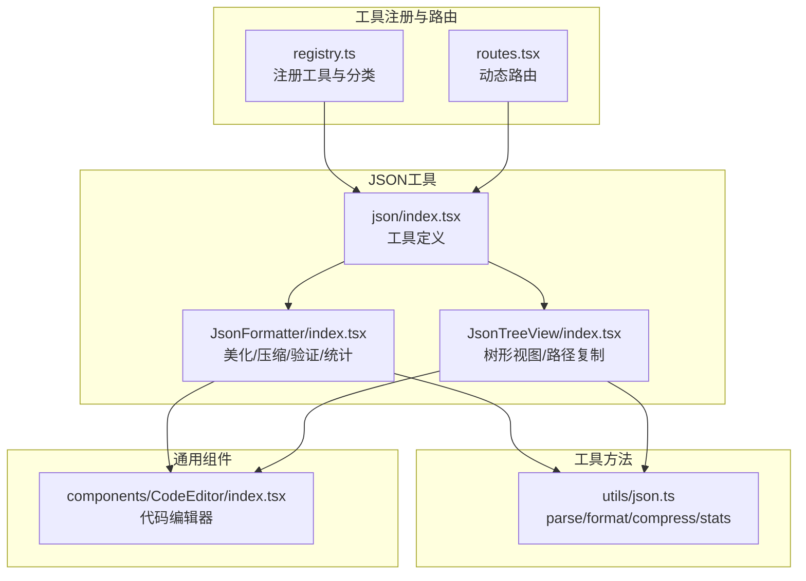
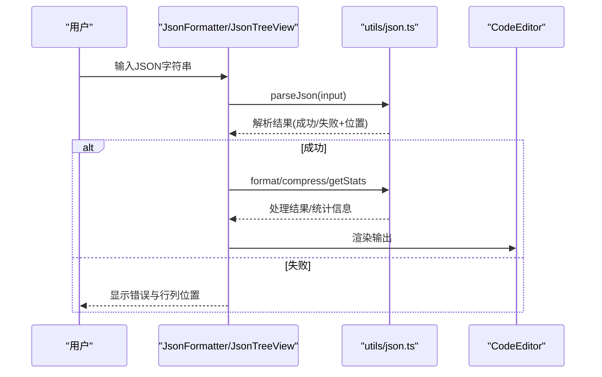
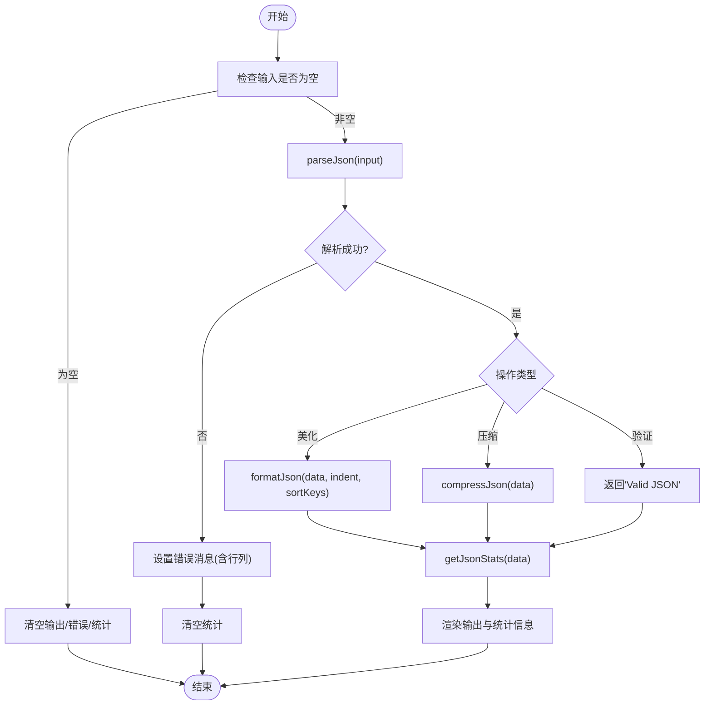
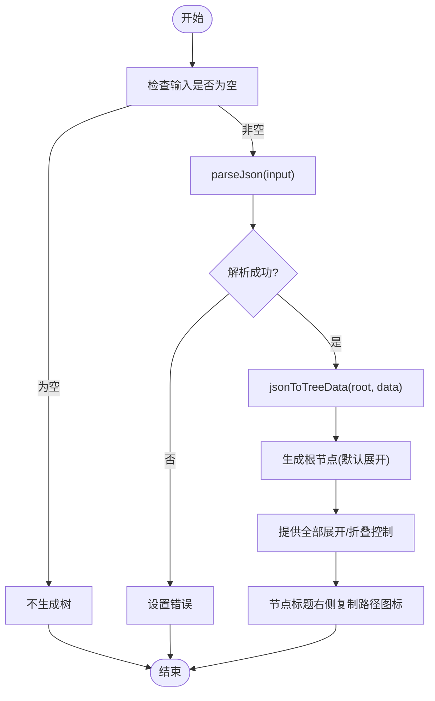
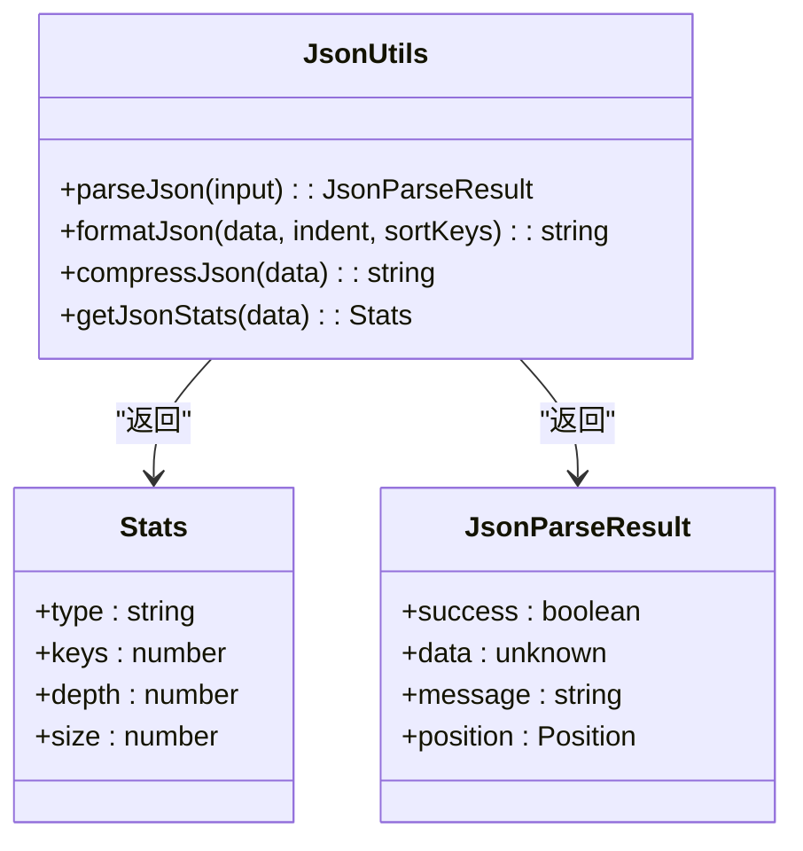
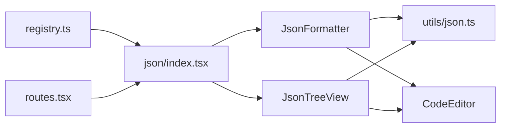

# JSON 工具系列

<cite>
**本文引用的文件**
- [src/tools/json/index.tsx](file://src/tools/json/index.tsx)
- [src/tools/json/JsonFormatter/index.tsx](file://src/tools/json/JsonFormatter/index.tsx)
- [src/tools/json/JsonTreeView/index.tsx](file://src/tools/json/JsonTreeView/index.tsx)
- [src/utils/json.ts](file://src/utils/json.ts)
- [src/components/CodeEditor/index.tsx](file://src/components/CodeEditor/index.tsx)
- [src/tools/types.ts](file://src/tools/types.ts)
- [src/tools/registry.ts](file://src/tools/registry.ts)
- [src/routes.tsx](file://src/routes.tsx)
</cite>

## 目录
1. [简介](#简介)
2. [项目结构](#项目结构)
3. [核心组件](#核心组件)
4. [架构总览](#架构总览)
5. [详细组件分析](#详细组件分析)
6. [依赖关系分析](#依赖关系分析)
7. [性能考量](#性能考量)
8. [故障排查指南](#故障排查指南)
9. [结论](#结论)
10. [附录](#附录)

## 简介
本文件面向XKUtil项目中的“JSON工具系列”，系统性说明两大功能模块：
- JSON格式化器：提供美化、压缩、验证与统计信息能力，显著提升JSON可读性与数据洞察力
- JSON树形视图：以树形结构可视化JSON数据，支持节点展开/折叠、路径复制与类型标签显示

通过本文档，您将理解每个功能的实现原理、交互流程、使用场景与最佳实践。

## 项目结构
JSON工具位于src/tools/json目录下，采用按功能分层组织：
- 工具注册：src/tools/json/index.tsx声明两个子工具（格式化器、树形视图）
- 工具实现：分别在JsonFormatter与JsonTreeView中实现具体UI与逻辑
- 工具方法：src/utils/json.ts提供解析、格式化、压缩、统计等底层能力
- 编辑器组件：src/components/CodeEditor/index.tsx提供通用代码编辑器封装
- 路由与注册：src/routes.tsx与src/tools/registry.ts负责工具路由与分类注册

图表来源
- [src/tools/registry.ts:1-39](file://src/tools/registry.ts#L1-L39)
- [src/routes.tsx:1-29](file://src/routes.tsx#L1-L29)
- [src/tools/json/index.tsx:1-27](file://src/tools/json/index.tsx#L1-L27)
- [src/tools/json/JsonFormatter/index.tsx:1-267](file://src/tools/json/JsonFormatter/index.tsx#L1-L267)
- [src/tools/json/JsonTreeView/index.tsx:1-248](file://src/tools/json/JsonTreeView/index.tsx#L1-L248)
- [src/utils/json.ts:1-116](file://src/utils/json.ts#L1-L116)
- [src/components/CodeEditor/index.tsx:1-57](file://src/components/CodeEditor/index.tsx#L1-L57)

章节来源
- [src/tools/json/index.tsx:1-27](file://src/tools/json/index.tsx#L1-L27)
- [src/tools/registry.ts:1-39](file://src/tools/registry.ts#L1-L39)
- [src/routes.tsx:1-29](file://src/routes.tsx#L1-L29)

## 核心组件
- JSON格式化器（JsonFormatter）
  - 功能：美化、压缩、验证、统计信息
  - 关键点：支持2空格/4空格/TAB缩进、键排序、错误定位、统计信息展示、复制/粘贴/清空
- JSON树形视图（JsonTreeView）
  - 功能：树形可视化、全部展开/折叠、路径复制、类型标签
  - 关键点：递归构建树、自动展开根节点、路径前缀处理、类型标签颜色区分

章节来源
- [src/tools/json/JsonFormatter/index.tsx:45-267](file://src/tools/json/JsonFormatter/index.tsx#L45-L267)
- [src/tools/json/JsonTreeView/index.tsx:117-248](file://src/tools/json/JsonTreeView/index.tsx#L117-L248)

## 架构总览
JSON工具的运行时架构围绕“输入 -> 解析 -> 处理 -> 输出”的流水线展开，同时提供统计与可视化增强。

图表来源
- [src/tools/json/JsonFormatter/index.tsx:53-130](file://src/tools/json/JsonFormatter/index.tsx#L53-L130)
- [src/tools/json/JsonTreeView/index.tsx:122-132](file://src/tools/json/JsonTreeView/index.tsx#L122-L132)
- [src/utils/json.ts:14-38](file://src/utils/json.ts#L14-L38)

## 详细组件分析

### JSON格式化器（美化/压缩/验证/统计）
- 美化（Beautify）
  - 实现要点：调用解析器确认格式正确；对对象键进行可选排序；根据缩进策略生成字符串；计算统计信息
  - 统计信息：类型、键总数、最大深度、原始大小（字节）
- 压缩（Minify）
  - 实现要点：解析通过后直接序列化，去除空白字符，得到更紧凑的字符串；统计压缩后的长度
- 验证（Validate）
  - 实现要点：仅做解析校验，成功时提示“Valid JSON”并展示统计信息，失败时返回错误与行列位置
- 交互与辅助
  - 支持粘贴/复制/清空；错误信息带行列定位；统计信息实时更新

图表来源
- [src/tools/json/JsonFormatter/index.tsx:53-130](file://src/tools/json/JsonFormatter/index.tsx#L53-L130)
- [src/utils/json.ts:40-91](file://src/utils/json.ts#L40-L91)

章节来源
- [src/tools/json/JsonFormatter/index.tsx:45-267](file://src/tools/json/JsonFormatter/index.tsx#L45-L267)
- [src/utils/json.ts:14-116](file://src/utils/json.ts#L14-L116)

### JSON树形视图（可视化/路径复制/类型标签）
- 树形结构生成算法
  - 递归遍历：对叶子值直接生成叶子节点；对数组/对象分别递归其元素/键值对
  - 路径生成：使用“根.键”或“根.[索引]”的路径表达，便于定位
- 展开/折叠交互
  - 默认展开根节点；提供“全部展开/全部折叠”按钮；支持点击树节点展开/折叠
- 路径复制
  - 在节点标题右侧提供复制图标；点击后复制对应路径（去除根前缀，保留$表示根）
- 类型标签显示
  - 使用Ant Design Tag组件，按类型着色：null、Array、string、number、boolean、Object
  - 对Array与Object显示元素个数或键数量，直观反映结构规模

图表来源
- [src/tools/json/JsonTreeView/index.tsx:54-101](file://src/tools/json/JsonTreeView/index.tsx#L54-L101)
- [src/tools/json/JsonTreeView/index.tsx:117-248](file://src/tools/json/JsonTreeView/index.tsx#L117-L248)

章节来源
- [src/tools/json/JsonTreeView/index.tsx:117-248](file://src/tools/json/JsonTreeView/index.tsx#L117-L248)

### 工具方法与数据模型
- 解析与错误定位
  - parseJson：捕获JSON.parse异常，从错误消息中提取位置信息（行/列），返回统一的解析结果
- 格式化与压缩
  - formatJson：支持2/4空格与Tab缩进，可选键排序
  - compressJson：移除空白字符，得到最紧凑的JSON字符串
- 统计信息
  - getJsonStats：返回类型、键总数、最大深度、字符串化大小
  - countKeys：递归统计所有键的数量（包括嵌套）
  - getDepth：递归计算最大嵌套深度

图表来源
- [src/utils/json.ts:1-116](file://src/utils/json.ts#L1-L116)

章节来源
- [src/utils/json.ts:1-116](file://src/utils/json.ts#L1-L116)

## 依赖关系分析
- 工具注册与路由
  - registry.ts将jsonTools与cryptoTools合并，按类别分组
  - routes.tsx基于getAllTools动态生成路由
- 工具与通用组件
  - JsonFormatter/JsonTreeView均依赖CodeEditor组件提供代码编辑体验
- 工具与工具方法
  - 两者均依赖utils/json.ts提供的解析、格式化、压缩、统计能力

图表来源
- [src/tools/registry.ts:1-39](file://src/tools/registry.ts#L1-L39)
- [src/routes.tsx:1-29](file://src/routes.tsx#L1-L29)
- [src/tools/json/index.tsx:1-27](file://src/tools/json/index.tsx#L1-L27)
- [src/tools/json/JsonFormatter/index.tsx:1-267](file://src/tools/json/JsonFormatter/index.tsx#L1-L267)
- [src/tools/json/JsonTreeView/index.tsx:1-248](file://src/tools/json/JsonTreeView/index.tsx#L1-L248)
- [src/utils/json.ts:1-116](file://src/utils/json.ts#L1-L116)
- [src/components/CodeEditor/index.tsx:1-57](file://src/components/CodeEditor/index.tsx#L1-L57)

章节来源
- [src/tools/registry.ts:1-39](file://src/tools/registry.ts#L1-L39)
- [src/routes.tsx:1-29](file://src/routes.tsx#L1-L29)
- [src/tools/json/index.tsx:1-27](file://src/tools/json/index.tsx#L1-L27)

## 性能考量
- 解析与统计
  - parseJson与getJsonStats均为O(n)复杂度，其中n为JSON节点数；countKeys与getDepth递归遍历，避免额外内存分配
- 格式化与压缩
  - formatJson与compressJson基于原生JSON.stringify，时间复杂度与数据规模线性相关；键排序在对象较多时会增加常数开销
- UI渲染
  - CodeEditor使用Monaco Editor，具备智能布局与只读优化；Splitter面板最小尺寸限制保证可用性
- 交互响应
  - 使用useMemo缓存树形数据与键列表，减少不必要的重算；useCallback绑定事件处理器，降低重渲染成本

[本节为通用性能讨论，无需特定文件来源]

## 故障排查指南
- 输入为空
  - 行为：清空输出、错误与统计信息
  - 建议：先粘贴有效JSON再执行操作
- 解析失败（语法错误）
  - 行为：显示错误消息与行列位置；统计信息清空
  - 建议：根据行列位置修正JSON语法（逗号、括号、引号、注释等）
- 压缩后大小异常
  - 行为：统计信息显示压缩后长度
  - 建议：确认输入是否包含不可序列化的值（函数、undefined、Symbol等）
- 树形视图无输出
  - 行为：提示在左侧输入有效JSON
  - 建议：确保输入为合法JSON；首次加载自动展开根节点
- 路径复制问题
  - 行为：复制路径到剪贴板并提示
  - 建议：确认浏览器权限允许剪贴板访问

章节来源
- [src/tools/json/JsonFormatter/index.tsx:53-130](file://src/tools/json/JsonFormatter/index.tsx#L53-L130)
- [src/tools/json/JsonTreeView/index.tsx:117-248](file://src/tools/json/JsonTreeView/index.tsx#L117-L248)
- [src/utils/json.ts:14-38](file://src/utils/json.ts#L14-L38)

## 结论
JSON工具系列通过“解析-处理-可视化-统计”的闭环设计，为开发者提供了：
- 可读性增强：美化与键排序
- 体积优化：压缩与统计
- 质量保障：验证与错误定位
- 可视化洞察：树形视图与类型标签
- 交互效率：路径复制与展开/折叠

这些能力在日常开发调试、配置管理、接口联调与数据审计中具有广泛实用价值。

[本节为总结性内容，无需特定文件来源]

## 附录

### 使用场景与最佳实践
- 美化与键排序
  - 场景：团队协作时统一格式；对比配置差异
  - 最佳实践：开启键排序，选择合适的缩进风格
- 压缩与统计
  - 场景：传输或存储空间敏感的数据
  - 最佳实践：先验证格式，再压缩；关注压缩前后大小变化
- 验证与错误定位
  - 场景：接口调试、日志解析
  - 最佳实践：结合行列位置快速定位问题
- 树形视图
  - 场景：理解复杂结构、快速定位字段
  - 最佳实践：先全部展开，再逐步折叠；利用路径复制快速引用

### API与数据模型参考
- 工具定义
  - ToolDefinition：id、name、description、category、icon、path、component、keywords
- JSON解析结果
  - success: boolean
  - data: unknown（成功时）
  - message: string（失败时）
  - position: { line, column }（可选）

章节来源
- [src/tools/types.ts:1-20](file://src/tools/types.ts#L1-L20)
- [src/utils/json.ts:1-12](file://src/utils/json.ts#L1-L12)