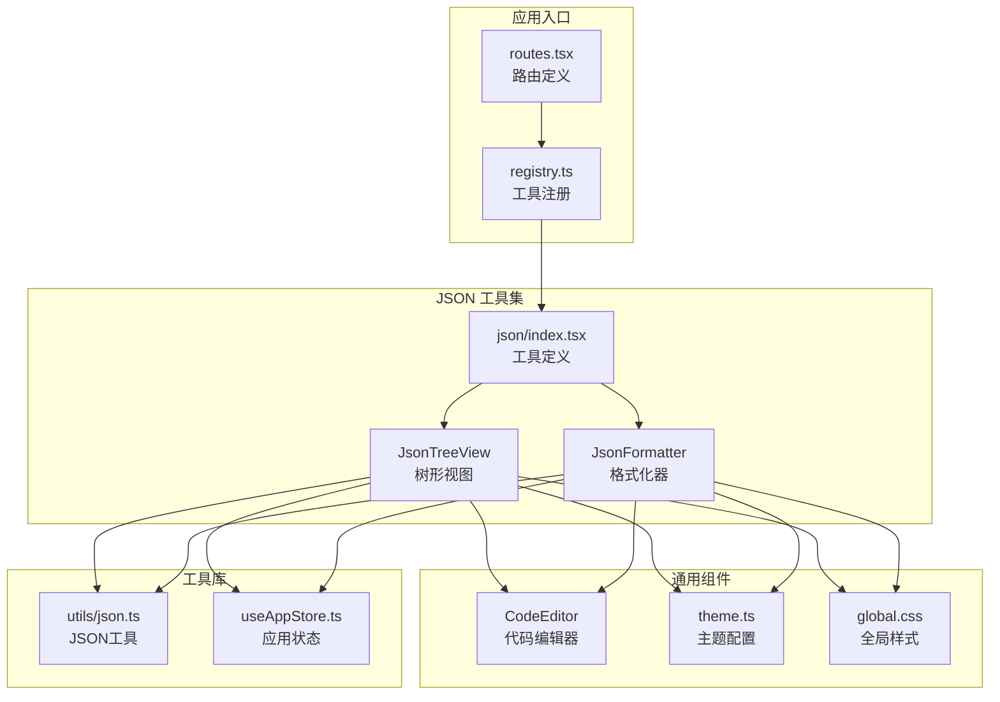
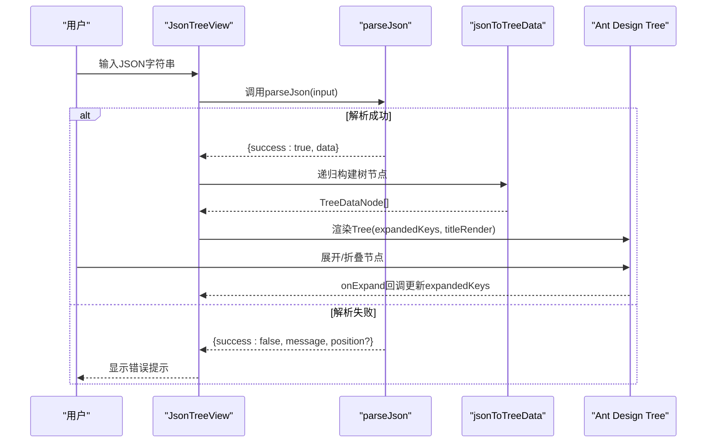
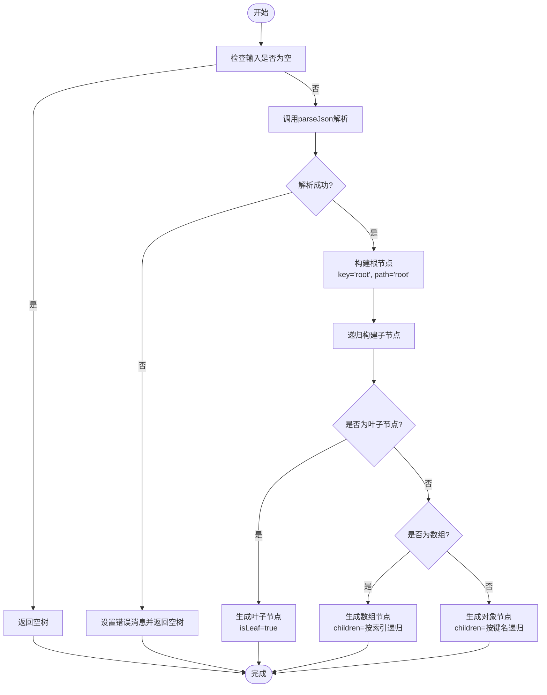
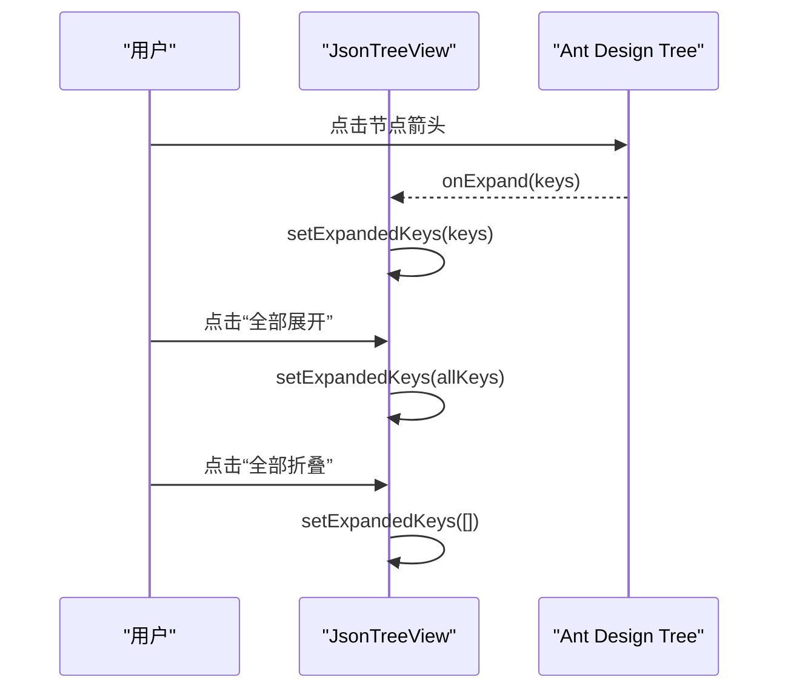
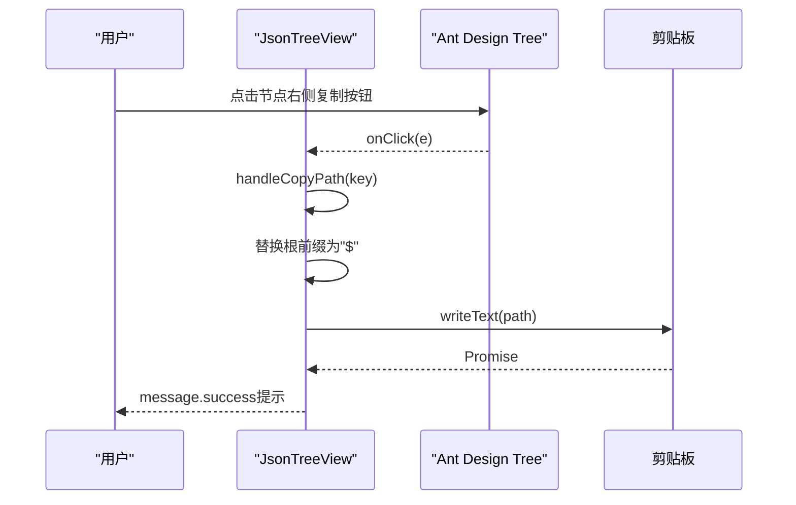
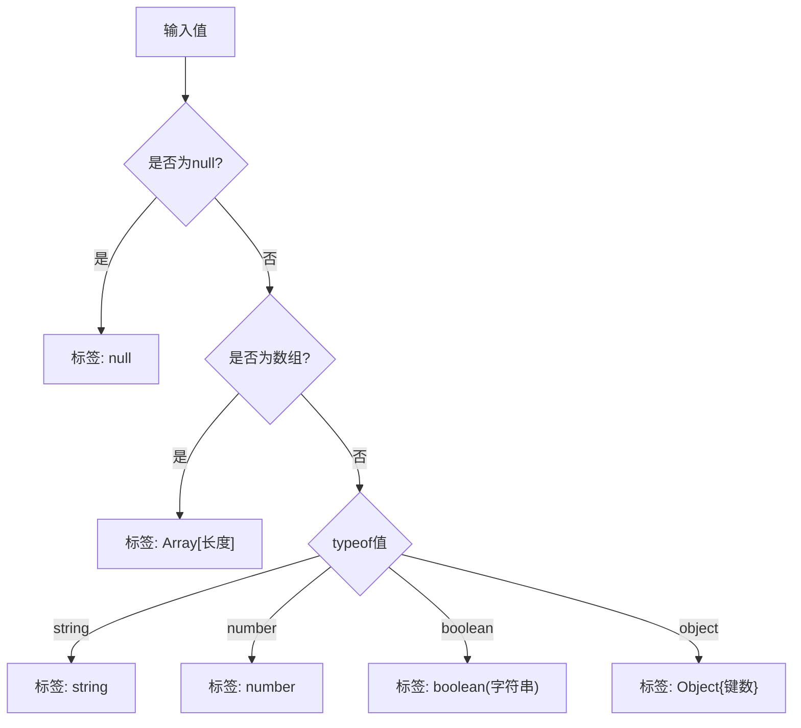
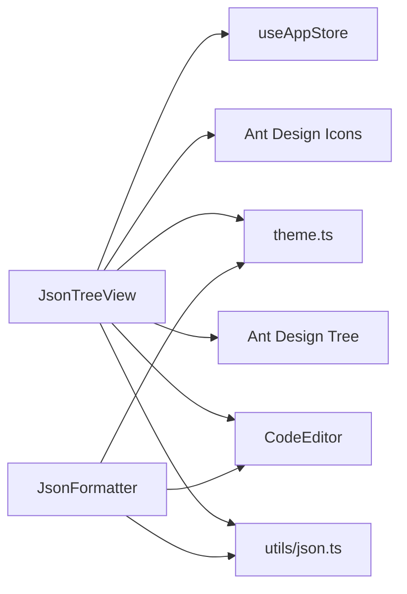

# JSON 树形视图

<cite>
**本文引用的文件列表**
- [src/tools/json/JsonTreeView/index.tsx](file://src/tools/json/JsonTreeView/index.tsx)
- [src/utils/json.ts](file://src/utils/json.ts)
- [src/tools/json/JsonFormatter/index.tsx](file://src/tools/json/JsonFormatter/index.tsx)
- [src/tools/json/index.tsx](file://src/tools/json/index.tsx)
- [src/tools/registry.ts](file://src/tools/registry.ts)
- [src/routes.tsx](file://src/routes.tsx)
- [src/components/CodeEditor/index.tsx](file://src/components/CodeEditor/index.tsx)
- [src/styles/theme.ts](file://src/styles/theme.ts)
- [src/styles/global.css](file://src/styles/global.css)
- [src/store/useAppStore.ts](file://src/store/useAppStore.ts)
- [package.json](file://package.json)
</cite>

## 目录
1. [简介](#简介)
2. [项目结构](#项目结构)
3. [核心组件](#核心组件)
4. [架构总览](#架构总览)
5. [详细组件分析](#详细组件分析)
6. [依赖关系分析](#依赖关系分析)
7. [性能考量](#性能考量)
8. [故障排查指南](#故障排查指南)
9. [结论](#结论)
10. [附录](#附录)

## 简介
本文件面向XKUtil项目的“JSON 树形视图”工具，系统性阐述其树形结构生成算法、节点层级计算、DOM元素动态生成与内存优化策略；详述节点展开/折叠的交互设计（点击事件处理、动画过渡、状态持久化、键盘快捷键支持）；全面解析路径复制功能（节点路径提取、剪贴板API集成、格式化输出、批量操作支持）；深入分析类型标签显示（数据类型识别、颜色编码、图标规范、可访问性）；并提供使用场景与实际代码示例路径，帮助开发者在复杂JSON数据中高效可视化与交互。

## 项目结构
该工具位于JSON工具集合中，通过路由与注册表进行统一管理，并与通用编辑器组件、主题系统、全局样式协同工作。

**图表来源**
- [src/routes.tsx:1-29](file://src/routes.tsx#L1-L29)
- [src/tools/registry.ts:1-39](file://src/tools/registry.ts#L1-L39)
- [src/tools/json/index.tsx:1-27](file://src/tools/json/index.tsx#L1-L27)
- [src/tools/json/JsonTreeView/index.tsx:1-248](file://src/tools/json/JsonTreeView/index.tsx#L1-L248)
- [src/tools/json/JsonFormatter/index.tsx:1-267](file://src/tools/json/JsonFormatter/index.tsx#L1-L267)
- [src/components/CodeEditor/index.tsx:1-57](file://src/components/CodeEditor/index.tsx#L1-L57)
- [src/utils/json.ts:1-116](file://src/utils/json.ts#L1-L116)
- [src/styles/theme.ts:1-12](file://src/styles/theme.ts#L1-L12)
- [src/styles/global.css:1-31](file://src/styles/global.css#L1-L31)
- [src/store/useAppStore.ts:1-24](file://src/store/useAppStore.ts#L1-L24)

**章节来源**
- [src/routes.tsx:1-29](file://src/routes.tsx#L1-L29)
- [src/tools/registry.ts:1-39](file://src/tools/registry.ts#L1-L39)
- [src/tools/json/index.tsx:1-27](file://src/tools/json/index.tsx#L1-L27)

## 核心组件
- JsonTreeView：负责将JSON解析为树形结构，渲染树节点，提供展开/折叠控制、路径复制、错误提示与布局分割。
- utils/json：提供JSON解析、格式化、压缩、统计等基础能力，支撑树形视图与格式化器。
- CodeEditor：通用代码编辑器组件，用于输入/输出面板的高亮与编辑体验。
- 主题与样式：Ant Design主题与全局滚动条样式，确保一致的视觉与交互体验。
- 应用状态：Zustand状态存储，支持主题切换与侧边栏折叠状态持久化。

**章节来源**
- [src/tools/json/JsonTreeView/index.tsx:117-248](file://src/tools/json/JsonTreeView/index.tsx#L117-L248)
- [src/utils/json.ts:14-116](file://src/utils/json.ts#L14-L116)
- [src/components/CodeEditor/index.tsx:13-56](file://src/components/CodeEditor/index.tsx#L13-L56)
- [src/styles/theme.ts:3-11](file://src/styles/theme.ts#L3-L11)
- [src/styles/global.css:18-30](file://src/styles/global.css#L18-L30)
- [src/store/useAppStore.ts:11-23](file://src/store/useAppStore.ts#L11-L23)

## 架构总览
树形视图采用“解析-建树-渲染”的三层架构：
- 解析层：使用通用JSON解析函数，捕获语法错误并返回位置信息。
- 建树层：递归遍历JSON对象/数组，构建Ant Design Tree所需的数据结构，同时生成节点路径与类型标签。
- 渲染层：基于Ant Design Tree组件渲染，结合自定义titleRender实现复制按钮与类型标签显示；Splitter布局分离输入与输出面板。

**图表来源**
- [src/tools/json/JsonTreeView/index.tsx:117-248](file://src/tools/json/JsonTreeView/index.tsx#L117-L248)
- [src/utils/json.ts:14-38](file://src/utils/json.ts#L14-L38)

## 详细组件分析

### 树形结构生成算法
- 递归解析与节点层级计算
  - 对于叶子节点（非对象/非数组），直接生成标题与类型标签，标记为叶子节点。
  - 对于数组：生成数组节点，子节点按索引递归构建，路径使用“根.数组索引”形式。
  - 对于对象：生成对象节点，子节点按键名递归构建，路径使用“根.键名”形式。
  - 类型标签：根据值类型与长度（数组/对象键数）生成带颜色的标签，便于快速识别。
- DOM元素动态生成
  - 使用Ant Design的Tree组件，titleRender自定义节点标题，包含键名、值、类型标签与复制按钮。
  - 根节点默认展开，首次有效解析时自动展开根节点，提升初始可见性。
- 内存优化策略
  - 使用useMemo缓存解析结果与树数据，避免重复解析与重建。
  - 仅在输入变化或依赖项变化时重新计算树数据。
  - 通过getAllKeys预收集所有可展开键，减少展开/折叠时的计算成本。

**图表来源**
- [src/tools/json/JsonTreeView/index.tsx:54-101](file://src/tools/json/JsonTreeView/index.tsx#L54-L101)
- [src/utils/json.ts:14-38](file://src/utils/json.ts#L14-L38)

**章节来源**
- [src/tools/json/JsonTreeView/index.tsx:54-101](file://src/tools/json/JsonTreeView/index.tsx#L54-L101)
- [src/tools/json/JsonTreeView/index.tsx:122-132](file://src/tools/json/JsonTreeView/index.tsx#L122-L132)
- [src/tools/json/JsonTreeView/index.tsx:103-115](file://src/tools/json/JsonTreeView/index.tsx#L103-L115)

### 节点展开/折叠交互设计
- 点击事件处理机制
  - Ant Design Tree的onExpand回调接收当前展开的keys，视图将其保存到expandedKeys状态。
  - 提供“全部展开/全部折叠”按钮，一键操作所有可展开节点。
- 动画过渡效果
  - Ant Design Tree自带展开/折叠动画，无需额外配置。
- 状态持久化
  - expandedKeys作为本地状态保存，随组件卸载而丢失；如需持久化，可在应用层引入状态存储（例如Zustand）。
- 键盘快捷键支持
  - 当前未实现键盘快捷键；建议扩展：Enter展开/折叠、方向键导航、Esc重置等。

**图表来源**
- [src/tools/json/JsonTreeView/index.tsx:136-142](file://src/tools/json/JsonTreeView/index.tsx#L136-L142)
- [src/tools/json/JsonTreeView/index.tsx:217-237](file://src/tools/json/JsonTreeView/index.tsx#L217-L237)

**章节来源**
- [src/tools/json/JsonTreeView/index.tsx:136-142](file://src/tools/json/JsonTreeView/index.tsx#L136-L142)
- [src/tools/json/JsonTreeView/index.tsx:217-237](file://src/tools/json/JsonTreeView/index.tsx#L217-L237)

### 路径复制功能实现原理
- 节点路径提取算法
  - 路径由jsonToTreeData递归构建，数组使用“根.[索引]”，对象使用“根.键名”。
  - 复制时移除根前缀“root.”，保留“$”表示根节点。
- 剪贴板API集成
  - 使用navigator.clipboard.writeText写入剪贴板，成功后通过message提示。
- 格式化输出
  - 输出格式为“$”或“$.key”、“$[index]”等，便于在脚本或查询中直接使用。
- 批量操作支持
  - 可通过扩展在复制按钮上添加批量选择逻辑（例如多选节点后统一复制路径列表）。

**图表来源**
- [src/tools/json/JsonTreeView/index.tsx:144-152](file://src/tools/json/JsonTreeView/index.tsx#L144-L152)

**章节来源**
- [src/tools/json/JsonTreeView/index.tsx:144-152](file://src/tools/json/JsonTreeView/index.tsx#L144-L152)

### 类型标签显示技术细节
- 数据类型识别算法
  - null：默认标签。
  - Array：蓝色标签，显示长度。
  - string/number/boolean/object：对应颜色标签，布尔值以字符串形式显示。
- 颜色编码方案
  - null：default；Array：blue；string：green；number：orange；boolean：purple；object：cyan。
- 图标设计规范
  - 标签内不包含图标，仅使用颜色区分；复制按钮使用Ant Design的CopyOutlined图标。
- 可访问性考虑
  - 文本使用Ant Design的Typography组件，具备语义化与可读性；标签颜色满足基本对比度要求。

**图表来源**
- [src/tools/json/JsonTreeView/index.tsx:36-52](file://src/tools/json/JsonTreeView/index.tsx#L36-L52)

**章节来源**
- [src/tools/json/JsonTreeView/index.tsx:36-52](file://src/tools/json/JsonTreeView/index.tsx#L36-L52)

### 使用场景与示例
- 复杂JSON结构可视化
  - 示例路径：[src/tools/json/JsonTreeView/index.tsx:25-34](file://src/tools/json/JsonTreeView/index.tsx#L25-L34)
- 快速定位字段路径
  - 在树节点右侧点击复制按钮，获取“$”路径，便于在脚本或查询中使用。
- 与格式化器配合
  - 先用JsonFormatter美化/压缩/验证，再用JsonTreeView查看结构，提升调试效率。
  - 示例路径：[src/tools/json/JsonFormatter/index.tsx:53-78](file://src/tools/json/JsonFormatter/index.tsx#L53-L78)

**章节来源**
- [src/tools/json/JsonTreeView/index.tsx:25-34](file://src/tools/json/JsonTreeView/index.tsx#L25-L34)
- [src/tools/json/JsonFormatter/index.tsx:53-78](file://src/tools/json/JsonFormatter/index.tsx#L53-L78)

## 依赖关系分析
- 组件耦合
  - JsonTreeView依赖utils/json的parseJson与类型标签函数；依赖Ant Design Tree与Typography、Tag、Button等组件。
  - 与CodeEditor解耦，通过Splitter布局独立存在。
- 外部依赖
  - @ant-design/icons、antd、@monaco-editor/react、zustand等。
- 状态与持久化
  - expandedKeys为组件内部状态；主题与布局状态可通过useAppStore持久化。

**图表来源**
- [src/tools/json/JsonTreeView/index.tsx:14-23](file://src/tools/json/JsonTreeView/index.tsx#L14-L23)
- [src/utils/json.ts:14-38](file://src/utils/json.ts#L14-L38)
- [src/components/CodeEditor/index.tsx:13-56](file://src/components/CodeEditor/index.tsx#L13-L56)
- [src/styles/theme.ts:3-11](file://src/styles/theme.ts#L3-L11)
- [src/store/useAppStore.ts:11-23](file://src/store/useAppStore.ts#L11-L23)

**章节来源**
- [package.json:12-25](file://package.json#L12-L25)

## 性能考量
- 解析与建树
  - 使用useMemo缓存解析结果与树数据，避免重复计算。
  - 仅在输入变化时重建树，降低CPU与内存占用。
- 展开/折叠
  - 预计算allKeys，减少展开/折叠时的遍历成本。
- 渲染优化
  - Ant Design Tree支持虚拟滚动（在大量节点时），但当前实现未启用；如节点数量较多，可考虑分页或延迟加载。
- 剪贴板操作
  - 复制路径为轻量操作，无明显性能负担。

[本节为通用性能讨论，无需特定文件引用]

## 故障排查指南
- JSON解析错误
  - 若输入无效，parseJson会返回错误信息与位置（行/列）。视图显示错误提示，同时清空树数据。
  - 参考路径：[src/utils/json.ts:14-38](file://src/utils/json.ts#L14-L38)，[src/tools/json/JsonTreeView/index.tsx:124-128](file://src/tools/json/JsonTreeView/index.tsx#L124-L128)
- 剪贴板权限问题
  - 浏览器环境可能限制剪贴板访问；若复制失败，message会提示错误。
  - 参考路径：[src/tools/json/JsonTreeView/index.tsx:147-149](file://src/tools/json/JsonTreeView/index.tsx#L147-L149)
- 树节点过多导致卡顿
  - 建议拆分大对象或使用分页/搜索过滤；必要时启用虚拟滚动（当前未实现）。
- 样式与主题
  - 主题切换通过Ant Design主题算法与全局样式控制；若出现样式异常，检查theme.ts与global.css。
  - 参考路径：[src/styles/theme.ts:3-11](file://src/styles/theme.ts#L3-L11)，[src/styles/global.css:18-30](file://src/styles/global.css#L18-L30)

**章节来源**
- [src/utils/json.ts:14-38](file://src/utils/json.ts#L14-L38)
- [src/tools/json/JsonTreeView/index.tsx:124-128](file://src/tools/json/JsonTreeView/index.tsx#L124-L128)
- [src/tools/json/JsonTreeView/index.tsx:147-149](file://src/tools/json/JsonTreeView/index.tsx#L147-L149)
- [src/styles/theme.ts:3-11](file://src/styles/theme.ts#L3-L11)
- [src/styles/global.css:18-30](file://src/styles/global.css#L18-L30)

## 结论
JSON树形视图通过清晰的三层架构实现了从JSON到可视化的完整流程：解析层保证健壮性，建树层提供灵活的层级表达，渲染层提供直观的交互与可访问性。当前版本在易用性与性能之间取得平衡，适合日常调试与探索复杂JSON结构。未来可扩展的方向包括：键盘快捷键、路径批量复制、虚拟滚动、状态持久化（expandedKeys）、以及更丰富的类型可视化（图标与颜色增强）。

[本节为总结性内容，无需特定文件引用]

## 附录
- 路由与注册
  - 工具通过registry集中注册，routes统一挂载，便于扩展新工具。
  - 参考路径：[src/tools/registry.ts:25-27](file://src/tools/registry.ts#L25-L27)，[src/routes.tsx:17-24](file://src/routes.tsx#L17-L24)
- 代码编辑器
  - CodeEditor提供Monaco编辑器的封装，支持语言高亮、只读模式与暗色主题适配。
  - 参考路径：[src/components/CodeEditor/index.tsx:13-56](file://src/components/CodeEditor/index.tsx#L13-L56)
- 应用状态
  - useAppStore提供主题与布局状态的持久化，便于跨页面保持一致体验。
  - 参考路径：[src/store/useAppStore.ts:11-23](file://src/store/useAppStore.ts#L11-L23)

**章节来源**
- [src/tools/registry.ts:25-27](file://src/tools/registry.ts#L25-L27)
- [src/routes.tsx:17-24](file://src/routes.tsx#L17-L24)
- [src/components/CodeEditor/index.tsx:13-56](file://src/components/CodeEditor/index.tsx#L13-L56)
- [src/store/useAppStore.ts:11-23](file://src/store/useAppStore.ts#L11-L23)