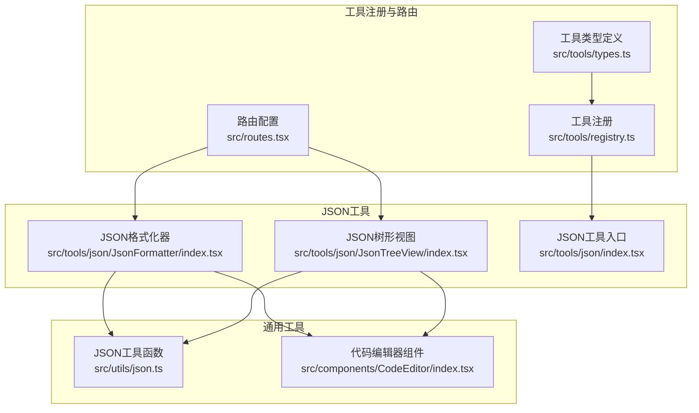
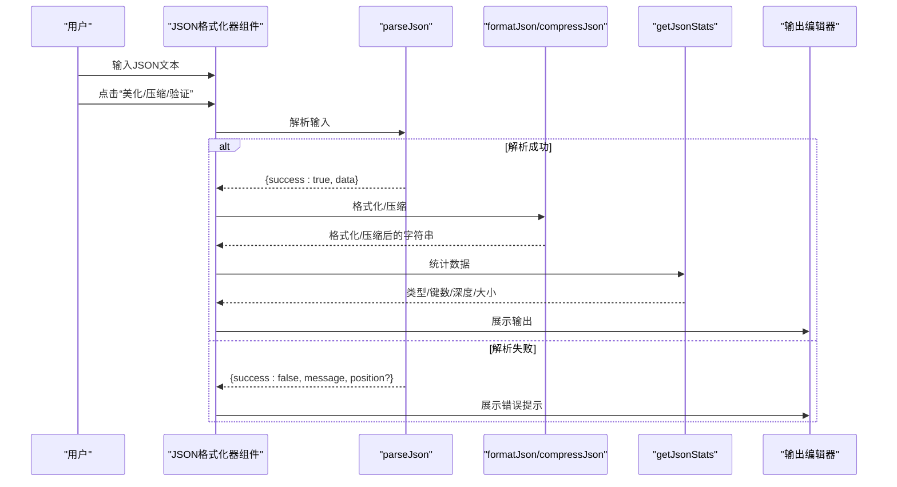
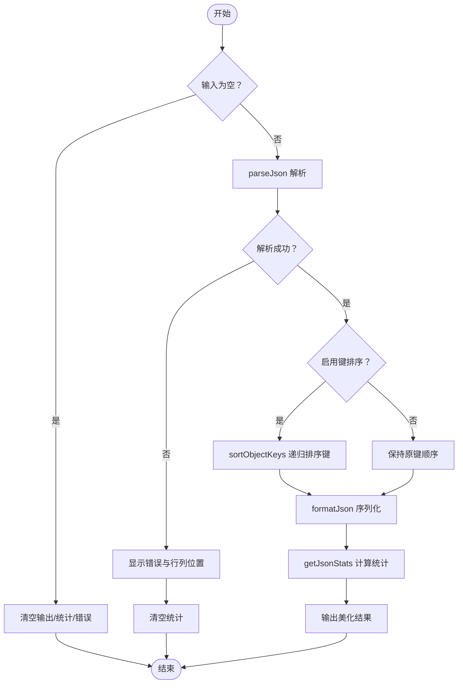
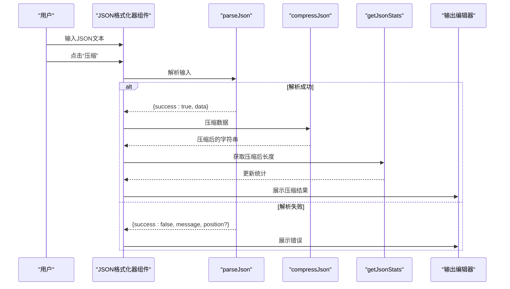
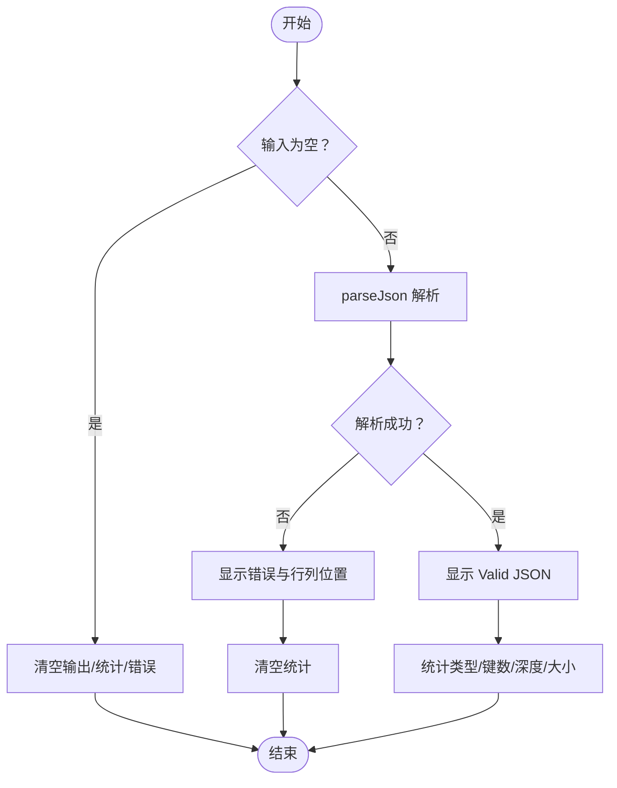
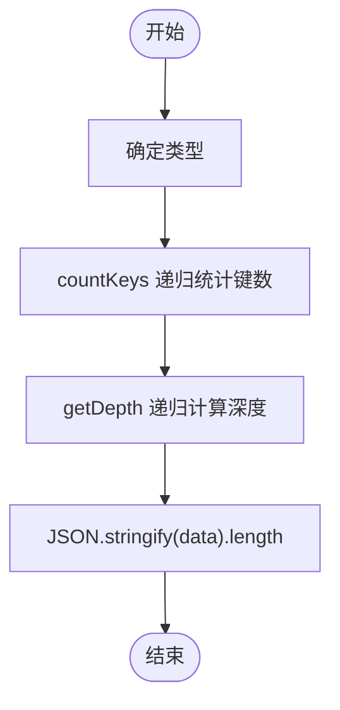
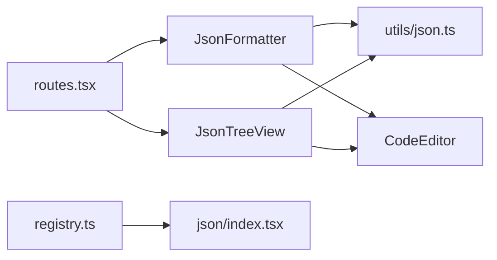

# JSON 格式化器

<cite>
**本文引用的文件列表**
- [src/tools/json/JsonFormatter/index.tsx](file://src/tools/json/JsonFormatter/index.tsx)
- [src/utils/json.ts](file://src/utils/json.ts)
- [src/components/CodeEditor/index.tsx](file://src/components/CodeEditor/index.tsx)
- [src/tools/json/JsonTreeView/index.tsx](file://src/tools/json/JsonTreeView/index.tsx)
- [src/tools/json/index.tsx](file://src/tools/json/index.tsx)
- [src/tools/registry.ts](file://src/tools/registry.ts)
- [src/tools/types.ts](file://src/tools/types.ts)
- [src/routes.tsx](file://src/routes.tsx)
- [package.json](file://package.json)
</cite>

## 目录
1. [简介](#简介)
2. [项目结构](#项目结构)
3. [核心组件](#核心组件)
4. [架构总览](#架构总览)
5. [详细组件分析](#详细组件分析)
6. [依赖关系分析](#依赖关系分析)
7. [性能考量](#性能考量)
8. [故障排查指南](#故障排查指南)
9. [结论](#结论)
10. [附录](#附录)

## 简介
本文件面向XKUtil项目的“JSON 格式化器”功能，系统性阐述以下能力：
- 美化（格式化）：缩进与换行策略、空白字符处理、大括号与方括号对齐规则
- 压缩：移除空白字符、注释过滤机制、体积优化策略
- 验证：语法检查、错误定位与提示、格式兼容性处理
- 统计：字符统计、层级深度、键数量、数据类型分布、体积监控
- 使用场景与最佳实践：在不同JSON结构下的表现与建议

该功能由前端React组件与通用工具函数协作完成，界面采用分屏编辑器，支持复制、粘贴、清空等常用操作，并提供树形视图辅助理解结构。

## 项目结构
与JSON格式化相关的核心模块如下：
- 工具注册与分类：工具清单、分类聚合、路由挂载
- JSON工具集：格式化器、树形视图
- 通用JSON工具函数：解析、美化、压缩、统计
- 代码编辑器组件：Monaco编辑器封装，支持主题、只读、自动布局等

图表来源
- [src/tools/registry.ts:1-39](file://src/tools/registry.ts#L1-L39)
- [src/tools/types.ts:1-20](file://src/tools/types.ts#L1-L20)
- [src/routes.tsx:1-29](file://src/routes.tsx#L1-L29)
- [src/tools/json/JsonFormatter/index.tsx:1-267](file://src/tools/json/JsonFormatter/index.tsx#L1-L267)
- [src/tools/json/JsonTreeView/index.tsx:1-248](file://src/tools/json/JsonTreeView/index.tsx#L1-L248)
- [src/tools/json/index.tsx:1-27](file://src/tools/json/index.tsx#L1-L27)
- [src/utils/json.ts:1-116](file://src/utils/json.ts#L1-L116)
- [src/components/CodeEditor/index.tsx:1-57](file://src/components/CodeEditor/index.tsx#L1-L57)

章节来源
- [src/tools/registry.ts:1-39](file://src/tools/registry.ts#L1-L39)
- [src/tools/types.ts:1-20](file://src/tools/types.ts#L1-L20)
- [src/routes.tsx:1-29](file://src/routes.tsx#L1-L29)
- [src/tools/json/index.tsx:1-27](file://src/tools/json/index.tsx#L1-L27)

## 核心组件
- JSON格式化器组件：提供美化、压缩、验证按钮，缩进类型选择（2空格/4空格/Tab）、键排序开关、粘贴/复制/清空、错误提示与统计信息展示、输入输出双编辑器。
- JSON树形视图组件：将JSON结构转为树形节点，支持展开/折叠、复制字段路径、类型标签显示。
- 通用JSON工具函数：解析JSON并定位错误位置；美化时支持键排序与缩进；压缩仅移除空白；统计包含类型、键数、深度、字符串长度。

章节来源
- [src/tools/json/JsonFormatter/index.tsx:45-267](file://src/tools/json/JsonFormatter/index.tsx#L45-L267)
- [src/tools/json/JsonTreeView/index.tsx:117-248](file://src/tools/json/JsonTreeView/index.tsx#L117-L248)
- [src/utils/json.ts:14-116](file://src/utils/json.ts#L14-L116)

## 架构总览
整体流程：用户在输入编辑器中粘贴或编写JSON，点击对应按钮触发工具函数，工具函数返回结果并在输出编辑器中展示；同时根据结果更新错误提示与统计信息。

图表来源
- [src/tools/json/JsonFormatter/index.tsx:53-130](file://src/tools/json/JsonFormatter/index.tsx#L53-L130)
- [src/utils/json.ts:14-52](file://src/utils/json.ts#L14-L52)

## 详细组件分析

### 美化（格式化）功能
- 缩进与换行策略
  - 通过传入缩进参数控制缩进字符：支持2空格、4空格、Tab三种模式。
  - 使用标准库序列化函数进行格式化，自动插入换行与缩进。
- 空白字符处理
  - 保留字符串中的空白字符，仅在结构层面添加必要的空白。
  - 键排序选项开启时，对象键按字典序排序，便于比较与版本控制。
- 对齐规则
  - 大括号与方括号与上层键对齐，数组元素与父级缩进一致。
  - 嵌套结构逐层递增缩进，保持视觉层次清晰。

图表来源
- [src/tools/json/JsonFormatter/index.tsx:53-78](file://src/tools/json/JsonFormatter/index.tsx#L53-L78)
- [src/utils/json.ts:40-69](file://src/utils/json.ts#L40-L69)
- [src/utils/json.ts:71-91](file://src/utils/json.ts#L71-L91)

章节来源
- [src/tools/json/JsonFormatter/index.tsx:53-78](file://src/tools/json/JsonFormatter/index.tsx#L53-L78)
- [src/utils/json.ts:40-69](file://src/utils/json.ts#L40-L69)
- [src/utils/json.ts:71-91](file://src/utils/json.ts#L71-L91)

### 压缩功能
- 实现原理
  - 仅移除不必要的空白字符（换行、空格、制表符），不改变语义。
  - 不包含注释过滤逻辑，因为标准JSON不支持注释；若输入包含注释，解析会失败。
- 体积优化策略
  - 通过序列化后字符串长度直接反映压缩效果，便于对比。
  - 适合传输与存储场景，减少带宽与存储占用。

图表来源
- [src/tools/json/JsonFormatter/index.tsx:80-103](file://src/tools/json/JsonFormatter/index.tsx#L80-L103)
- [src/utils/json.ts:50-52](file://src/utils/json.ts#L50-L52)

章节来源
- [src/tools/json/JsonFormatter/index.tsx:80-103](file://src/tools/json/JsonFormatter/index.tsx#L80-L103)
- [src/utils/json.ts:50-52](file://src/utils/json.ts#L50-L52)

### 验证功能
- 语法检查算法
  - 使用标准解析函数尝试解析输入，捕获异常并提取错误信息。
- 错误定位与提示
  - 若能从错误消息中提取位置索引，则转换为行/列坐标，用于更直观的提示。
- 格式兼容性处理
  - 支持标准JSON格式；非标准扩展（如注释、尾随逗号）会导致解析失败。
  - 成功时显示“Valid JSON”，并更新统计信息。

图表来源
- [src/tools/json/JsonFormatter/index.tsx:105-130](file://src/tools/json/JsonFormatter/index.tsx#L105-L130)
- [src/utils/json.ts:14-38](file://src/utils/json.ts#L14-L38)

章节来源
- [src/tools/json/JsonFormatter/index.tsx:105-130](file://src/tools/json/JsonFormatter/index.tsx#L105-L130)
- [src/utils/json.ts:14-38](file://src/utils/json.ts#L14-L38)

### 统计信息功能
- 数据收集与分析
  - 类型：区分Object、Array、Null与其他基础类型。
  - 键数：递归统计对象键数量，数组长度也计入键数。
  - 深度：递归计算最大嵌套层级，空容器深度为1。
  - 大小：以字符串长度表示JSON体积，便于比较美化前后差异。
- 性能指标监控
  - 统计函数为纯函数，复杂度与数据规模成正比；对大型JSON应关注渲染与计算开销。

图表来源
- [src/utils/json.ts:71-116](file://src/utils/json.ts#L71-L116)
- [src/utils/json.ts:93-115](file://src/utils/json.ts#L93-L115)

章节来源
- [src/utils/json.ts:71-116](file://src/utils/json.ts#L71-L116)

### 界面与交互
- 输入输出编辑器
  - 使用统一的代码编辑器组件，支持主题切换、只读输出、自动布局、行号等。
  - 输出编辑器在“验证”状态下切换为普通文本语言，避免语法高亮干扰。
- 操作按钮
  - 美化、压缩、验证、缩进类型切换、键排序、粘贴、复制、清空。
- 错误与统计展示
  - 错误信息包含位置信息；统计信息以紧凑文本形式展示关键指标。

章节来源
- [src/tools/json/JsonFormatter/index.tsx:158-267](file://src/tools/json/JsonFormatter/index.tsx#L158-L267)
- [src/components/CodeEditor/index.tsx:13-57](file://src/components/CodeEditor/index.tsx#L13-L57)

### 树形视图（辅助理解）
- 结构转换
  - 将任意JSON值转换为Ant Design树节点，叶子节点显示键名与值，非叶子节点显示类型与子项。
- 路径复制
  - 支持复制字段路径，便于在其他工具中引用。
- 展开/折叠
  - 提供一键展开/折叠，提升浏览效率。

章节来源
- [src/tools/json/JsonTreeView/index.tsx:54-101](file://src/tools/json/JsonTreeView/index.tsx#L54-L101)
- [src/tools/json/JsonTreeView/index.tsx:117-248](file://src/tools/json/JsonTreeView/index.tsx#L117-L248)

## 依赖关系分析
- 组件依赖
  - JSON格式化器依赖通用JSON工具函数与代码编辑器组件。
  - 树形视图同样依赖通用JSON工具函数。
- 工具注册与路由
  - 工具注册表聚合所有工具，路由根据注册表动态生成页面。
- 外部依赖
  - Ant Design UI组件库、Monaco编辑器、React Router等。

图表来源
- [src/tools/json/JsonFormatter/index.tsx:22-28](file://src/tools/json/JsonFormatter/index.tsx#L22-L28)
- [src/tools/json/JsonTreeView/index.tsx:20](file://src/tools/json/JsonTreeView/index.tsx#L20)
- [src/tools/registry.ts:1-39](file://src/tools/registry.ts#L1-L39)
- [src/routes.tsx:6-28](file://src/routes.tsx#L6-L28)

章节来源
- [src/tools/registry.ts:1-39](file://src/tools/registry.ts#L1-L39)
- [src/routes.tsx:1-29](file://src/routes.tsx#L1-L29)

## 性能考量
- 解析与序列化
  - parseJson与JSON.stringify均为O(n)，n为输入JSON的字符数或节点数。
- 递归统计
  - countKeys与getDepth为O(n)，对超大JSON应考虑异步化或分页展示。
- UI渲染
  - 大量节点的树形视图渲染可能较重，建议在大数据场景下限制展开层级或采用虚拟滚动。
- 缩进与键排序
  - 键排序会引入额外的排序成本，对超大对象有明显影响；仅在需要稳定输出时启用。

[本节为通用性能讨论，无需特定文件来源]

## 故障排查指南
- 输入为空
  - 清空输出、统计与错误，避免误报。
- 解析失败
  - 检查是否包含注释、尾随逗号等非标准内容；确认引号闭合与转义。
  - 错误信息包含行列位置，可快速定位问题。
- 输出为空
  - 确认输入有效且已点击相应按钮；验证按钮会显示“Valid JSON”而非空串。
- 统计异常
  - 确保输入为合法JSON；统计基于原始数据，压缩后长度以输出为准。

章节来源
- [src/tools/json/JsonFormatter/index.tsx:53-78](file://src/tools/json/JsonFormatter/index.tsx#L53-L78)
- [src/tools/json/JsonFormatter/index.tsx:80-103](file://src/tools/json/JsonFormatter/index.tsx#L80-L103)
- [src/tools/json/JsonFormatter/index.tsx:105-130](file://src/tools/json/JsonFormatter/index.tsx#L105-L130)
- [src/utils/json.ts:14-38](file://src/utils/json.ts#L14-L38)

## 结论
XKUtil的JSON格式化器以简洁的前端组件与通用工具函数为核心，实现了：
- 美化：灵活的缩进与键排序，清晰的层级对齐
- 压缩：无损移除空白，显著降低体积
- 验证：标准解析与精准错误定位
- 统计：类型、键数、深度、体积的多维指标
配合树形视图与编辑器组件，形成完整的JSON开发与调试体验。

[本节为总结，无需特定文件来源]

## 附录

### 使用场景与最佳实践
- 美化
  - 场景：阅读与分享JSON、调试接口响应
  - 最佳实践：选择合适的缩进（2空格更通用），必要时开启键排序以便版本管理
- 压缩
  - 场景：网络传输、数据库存储、缓存
  - 最佳实践：先验证再压缩；注意非标准扩展（注释）会导致失败
- 验证
  - 场景：自动化测试、配置校验
  - 最佳实践：结合错误位置信息快速修复；对生产环境增加边界用例
- 统计
  - 场景：容量规划、性能监控
  - 最佳实践：对比美化前后的大小变化；关注深度与键数趋势

[本节为概念性内容，无需特定文件来源]