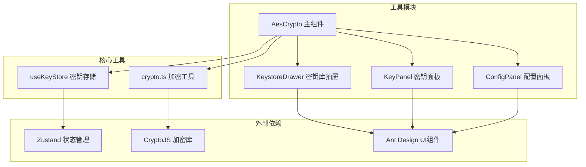
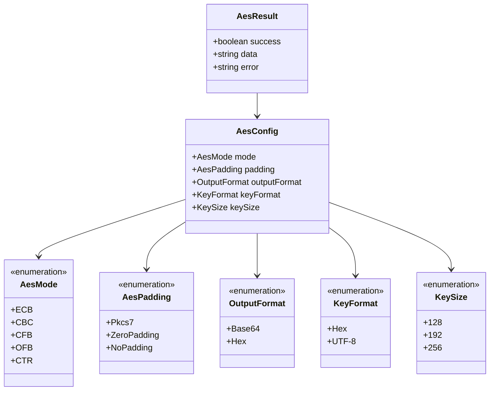
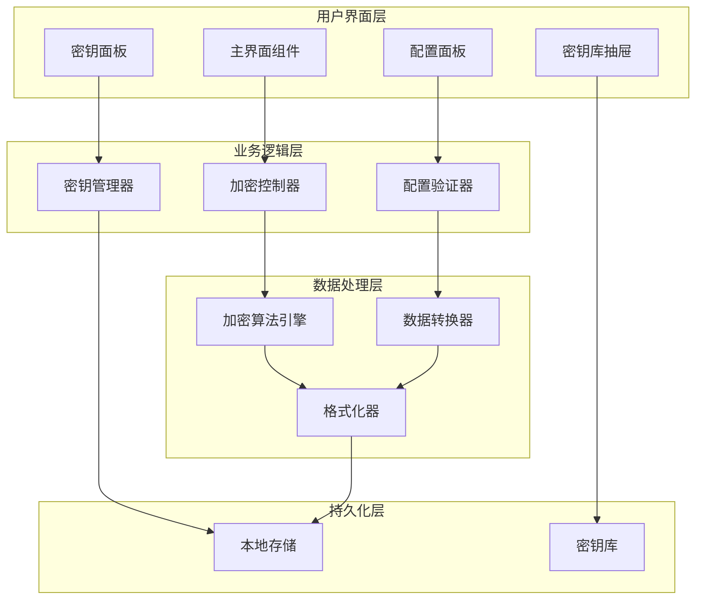
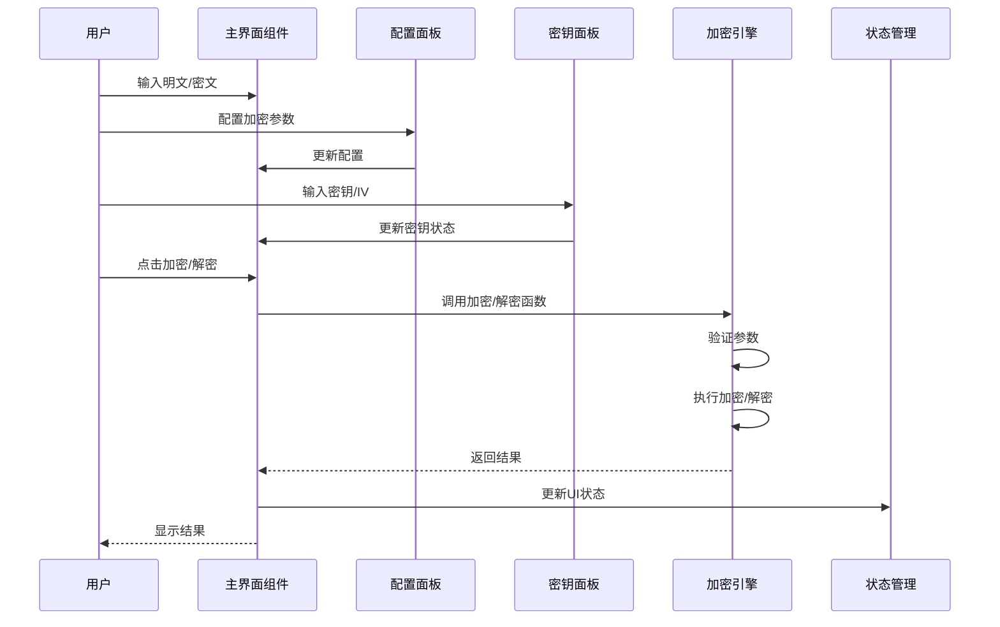
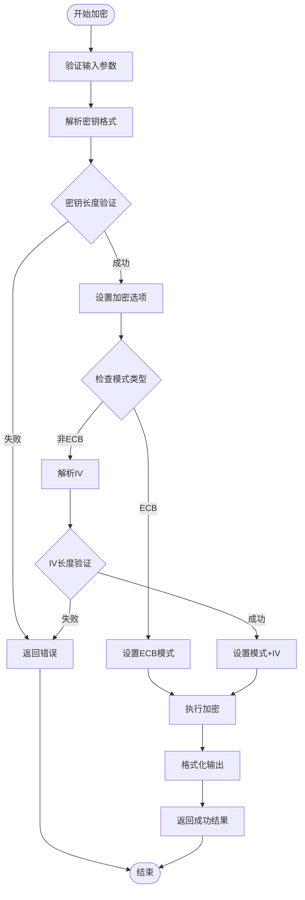
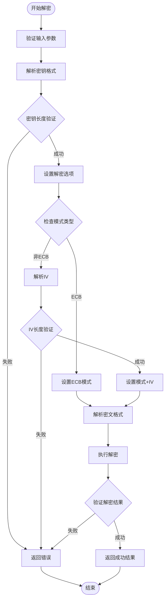
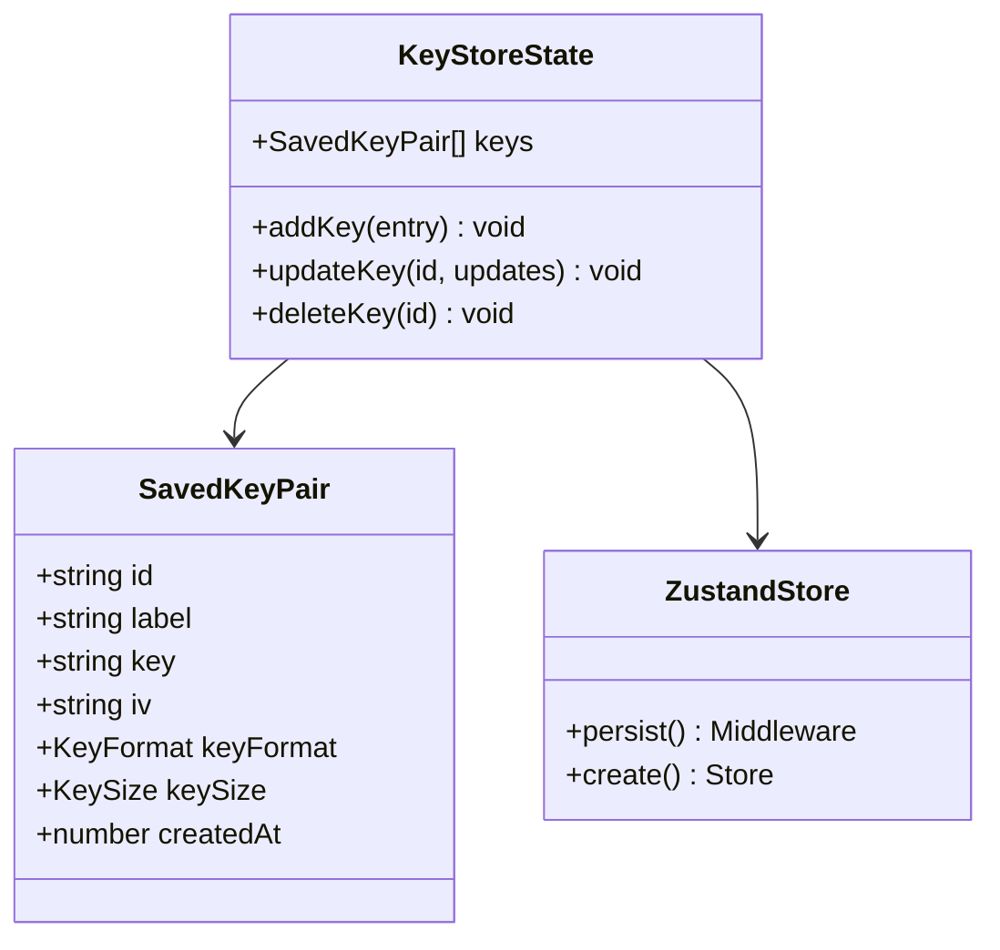
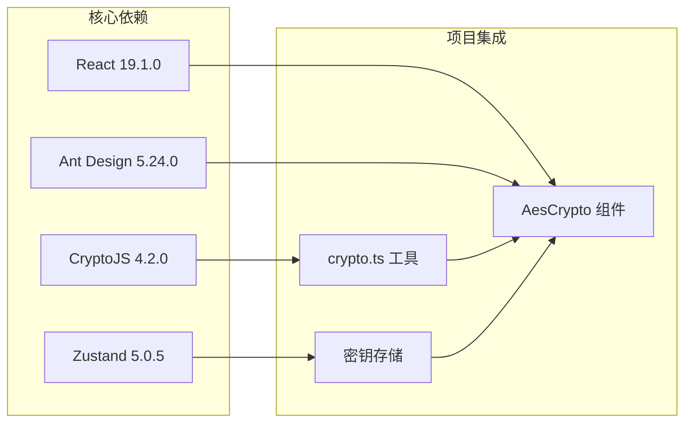
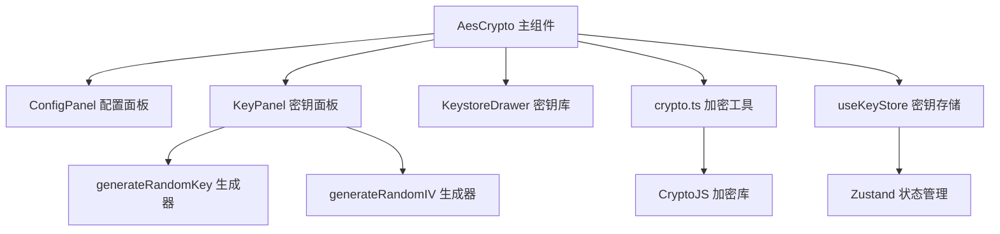

# AES 加密解密

<cite>
**本文档引用的文件**
- [src/utils/crypto.ts](file://src/utils/crypto.ts)
- [src/tools/crypto/AesCrypto/index.tsx](file://src/tools/crypto/AesCrypto/index.tsx)
- [src/tools/crypto/AesCrypto/ConfigPanel.tsx](file://src/tools/crypto/AesCrypto/ConfigPanel.tsx)
- [src/tools/crypto/AesCrypto/KeyPanel.tsx](file://src/tools/crypto/AesCrypto/KeyPanel.tsx)
- [src/tools/crypto/AesCrypto/KeystoreDrawer.tsx](file://src/tools/crypto/AesCrypto/KeystoreDrawer.tsx)
- [src/store/useKeyStore.ts](file://src/store/useKeyStore.ts)
- [package.json](file://package.json)
</cite>

## 目录
1. [简介](#简介)
2. [项目结构](#项目结构)
3. [核心组件](#核心组件)
4. [架构概览](#架构概览)
5. [详细组件分析](#详细组件分析)
6. [依赖关系分析](#依赖关系分析)
7. [性能考虑](#性能考虑)
8. [故障排除指南](#故障排除指南)
9. [结论](#结论)
10. [附录](#附录)

## 简介

XKUtil 是一个基于 React 和 Tauri 的多功能开发工具集，其中的 AES 加密解密功能提供了完整的对称加密解决方案。该功能基于 CryptoJS 库实现，支持多种加密模式、填充方式和输出格式，为开发者提供了灵活且安全的数据加密能力。

本技术文档深入解析了 AES 加密算法的实现原理，包括支持的加密模式（CBC、ECB、CFB、OFB、CTR）、填充方式（Pkcs7、ZeroPadding、NoPadding）、输出格式（Base64、Hex）、密钥格式（UTF-8、Hex）的具体实现细节。同时详细说明了加密参数配置机制、密钥处理流程、数据转换过程，并提供了完整的 API 接口文档、实际使用示例和最佳实践指导。

## 项目结构

AES 加密解密功能在项目中的组织结构如下：



**图表来源**
- [src/tools/crypto/AesCrypto/index.tsx:1-310](file://src/tools/crypto/AesCrypto/index.tsx#L1-L310)
- [src/utils/crypto.ts:1-222](file://src/utils/crypto.ts#L1-L222)
- [src/store/useKeyStore.ts:1-47](file://src/store/useKeyStore.ts#L1-L47)

**章节来源**
- [src/tools/crypto/AesCrypto/index.tsx:1-310](file://src/tools/crypto/AesCrypto/index.tsx#L1-L310)
- [src/utils/crypto.ts:1-222](file://src/utils/crypto.ts#L1-L222)
- [src/store/useKeyStore.ts:1-47](file://src/store/useKeyStore.ts#L1-L47)

## 核心组件

### 加密配置系统

AES 加密功能通过统一的配置对象来管理所有加密参数：



**图表来源**
- [src/utils/crypto.ts:3-21](file://src/utils/crypto.ts#L3-L21)

### 加密工具函数

核心加密工具函数提供了完整的加密和解密功能：

**章节来源**
- [src/utils/crypto.ts:59-162](file://src/utils/crypto.ts#L59-L162)

## 架构概览

AES 加密解密功能采用分层架构设计，确保了良好的可维护性和扩展性：



**图表来源**
- [src/tools/crypto/AesCrypto/index.tsx:33-309](file://src/tools/crypto/AesCrypto/index.tsx#L33-L309)
- [src/utils/crypto.ts:59-222](file://src/utils/crypto.ts#L59-L222)

## 详细组件分析

### 主界面组件分析

主界面组件 `AesCrypto` 作为整个 AES 功能的入口点，负责协调各个子组件的工作：



**图表来源**
- [src/tools/crypto/AesCrypto/index.tsx:55-112](file://src/tools/crypto/AesCrypto/index.tsx#L55-L112)
- [src/utils/crypto.ts:59-162](file://src/utils/crypto.ts#L59-L162)

**章节来源**
- [src/tools/crypto/AesCrypto/index.tsx:33-309](file://src/tools/crypto/AesCrypto/index.tsx#L33-L309)

### 加密算法实现

加密算法通过 CryptoJS 库实现，支持多种加密模式和填充方式：

#### 加密流程图



**图表来源**
- [src/utils/crypto.ts:59-105](file://src/utils/crypto.ts#L59-L105)

#### 解密流程图



**图表来源**
- [src/utils/crypto.ts:107-162](file://src/utils/crypto.ts#L107-L162)

**章节来源**
- [src/utils/crypto.ts:59-162](file://src/utils/crypto.ts#L59-L162)

### 配置面板组件

配置面板提供了用户友好的界面来设置加密参数：

#### 支持的配置选项

| 配置项 | 可选值 | 默认值 | 描述 |
|--------|--------|--------|------|
| 模式 | ECB, CBC, CFB, OFB, CTR | CBC | 加密模式选择 |
| 填充 | Pkcs7, ZeroPadding, NoPadding | Pkcs7 | 数据填充方式 |
| 输出格式 | Base64, Hex | Base64 | 密文输出格式 |
| 密钥格式 | UTF-8, Hex | UTF-8 | 密钥输入格式 |
| 密钥长度 | 128, 192, 256 | 128 | AES密钥长度 |

**章节来源**
- [src/tools/crypto/AesCrypto/ConfigPanel.tsx:9-37](file://src/tools/crypto/AesCrypto/ConfigPanel.tsx#L9-L37)

### 密钥面板组件

密钥面板负责密钥和初始化向量（IV）的输入管理：

#### 密钥长度计算规则

| 密钥长度 | Hex格式字符数 | UTF-8格式字符数 |
|----------|---------------|-----------------|
| 128位 | 32个字符 | 16个字符 |
| 192位 | 48个字符 | 24个字符 |
| 256位 | 64个字符 | 32个字符 |

**章节来源**
- [src/tools/crypto/AesCrypto/KeyPanel.tsx:35-59](file://src/tools/crypto/AesCrypto/KeyPanel.tsx#L35-L59)

### 密钥库功能

密钥库功能提供了密钥的持久化存储和管理：



**图表来源**
- [src/store/useKeyStore.ts:5-46](file://src/store/useKeyStore.ts#L5-L46)

**章节来源**
- [src/store/useKeyStore.ts:1-47](file://src/store/useKeyStore.ts#L1-L47)

## 依赖关系分析

### 外部依赖

AES 加密功能主要依赖以下外部库：



**图表来源**
- [package.json:12-25](file://package.json#L12-L25)

### 内部依赖关系



**图表来源**
- [src/tools/crypto/AesCrypto/index.tsx:20-29](file://src/tools/crypto/AesCrypto/index.tsx#L20-L29)
- [src/utils/crypto.ts:164-191](file://src/utils/crypto.ts#L164-L191)
- [src/store/useKeyStore.ts:22-46](file://src/store/useKeyStore.ts#L22-L46)

**章节来源**
- [package.json:12-25](file://package.json#L12-L25)

## 性能考虑

### 加密性能优化

1. **内存管理**: 使用 CryptoJS 的 WordArray 对象进行高效的数据处理
2. **缓存策略**: 配置面板的状态变化通过 React.memo 优化渲染
3. **异步处理**: 加密解密操作采用异步执行，避免阻塞主线程
4. **输入验证**: 在加密前进行参数验证，减少无效计算

### 存储性能

1. **本地存储**: 使用 localStorage 进行密钥持久化，支持快速读取
2. **状态管理**: Zustand 提供轻量级状态管理，避免不必要的重渲染
3. **数据压缩**: 密钥库中的密钥信息采用简化的显示格式

## 故障排除指南

### 常见错误及解决方案

#### 密钥长度错误

**错误信息**: `密钥长度错误: 期望 X 个字符 (Y 位), 实际 Z 个字符`

**原因分析**:
- 密钥格式与配置不匹配
- 密钥长度不符合指定的 AES 位数要求

**解决方法**:
1. 检查密钥格式设置（Hex 或 UTF-8）
2. 确认密钥长度符合要求：
   - 128位: 16个字符或32个十六进制字符
   - 192位: 24个字符或48个十六进制字符  
   - 256位: 32个字符或64个十六进制字符

#### IV 长度错误

**错误信息**: `IV 长度错误: 期望 16 字节 (32 个十六进制字符), 实际 N 个字符`

**原因分析**:
- IV 参数未正确设置
- IV 长度不符合 16 字节要求

**解决方法**:
1. 确保 IV 参数存在且非空
2. 检查 IV 格式与密钥格式一致
3. 确认 IV 长度为 16 字节（32 个十六进制字符）

#### 解密失败

**错误信息**: `解密失败: 结果为空，可能密钥或配置不正确`

**原因分析**:
- 密钥或配置不正确
- 密文格式与输出格式不匹配
- 加密和解密使用的参数不一致

**解决方法**:
1. 验证密钥和 IV 的正确性
2. 确认加密时使用的参数与解密时完全一致
3. 检查密文格式是否与输出格式设置匹配

**章节来源**
- [src/utils/crypto.ts:68-88](file://src/utils/crypto.ts#L68-L88)
- [src/utils/crypto.ts:116-136](file://src/utils/crypto.ts#L116-L136)
- [src/utils/crypto.ts:154-156](file://src/utils/crypto.ts#L154-L156)

## 结论

XKUtil 的 AES 加密解密功能提供了完整、灵活且安全的对称加密解决方案。通过合理的架构设计和完善的错误处理机制，该功能能够满足大多数应用场景的需求。

### 主要优势

1. **功能完整**: 支持多种加密模式、填充方式和输出格式
2. **用户友好**: 提供直观的图形界面和实时验证反馈
3. **安全性高**: 基于成熟的 CryptoJS 库实现，遵循加密标准
4. **易于使用**: 通过配置面板简化复杂的加密参数设置
5. **可扩展性强**: 模块化设计便于功能扩展和维护

### 技术特点

- 基于 CryptoJS 4.2.0 实现，确保加密算法的正确性和安全性
- 支持 ECB、CBC、CFB、OFB、CTR 五种加密模式
- 提供 PKCS7、ZeroPadding、NoPadding 三种填充方式
- 支持 Base64 和 Hex 两种输出格式
- 内置密钥库功能，支持密钥的持久化存储和管理

## 附录

### API 接口文档

#### 加密函数

**函数签名**: `aesEncrypt(plaintext: string, key: string, iv: string, config: AesConfig): AesResult`

**参数说明**:
- `plaintext`: 明文字符串
- `key`: 密钥字符串（支持 Hex 或 UTF-8 格式）
- `iv`: 初始化向量字符串（仅在非 ECB 模式下需要）
- `config`: 加密配置对象

**返回值**:
```typescript
interface AesResult {
  success: boolean;
  data?: string;
  error?: string;
}
```

#### 解密函数

**函数签名**: `aesDecrypt(ciphertext: string, key: string, iv: string, config: AesConfig): AesResult`

**参数说明**:
- `ciphertext`: 密文字符串
- `key`: 密钥字符串
- `iv`: 初始化向量字符串（仅在非 ECB 模式下需要）
- `config`: 解密配置对象

**返回值**: 同加密函数

#### 辅助函数

**随机密钥生成**: `generateRandomKey(size: KeySize, format: KeyFormat = "Hex"): string`
**随机 IV 生成**: `generateRandomIV(format: KeyFormat = "Hex"): string`
**密钥长度验证**: `validateKeyLength(key: string, expectedSize: KeySize): boolean`
**IV 验证**: `validateIV(iv: string): boolean`

### 最佳实践建议

1. **密钥管理**
   - 使用 256 位密钥以获得最高安全性
   - 定期轮换密钥，避免长期使用同一密钥
   - 将密钥存储在安全的地方，避免硬编码

2. **加密模式选择**
   - 优先使用 CBC 模式，提供良好的安全性
   - 避免使用 ECB 模式，容易受到统计分析攻击
   - CTR 模式适合流式数据加密

3. **填充方式选择**
   - 推荐使用 PKCS7 填充，兼容性最好
   - ZeroPadding 适用于已知长度的数据
   - NoPadding 仅适用于特殊场景

4. **输出格式选择**
   - Base64 格式便于传输和存储
   - Hex 格式便于调试和查看
   - 确保加密和解密使用相同的输出格式

5. **错误处理**
   - 始终检查返回的错误信息
   - 验证密钥和参数的有效性
   - 记录加密日志以便审计