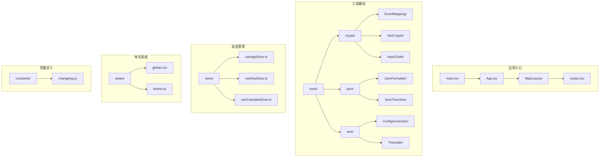
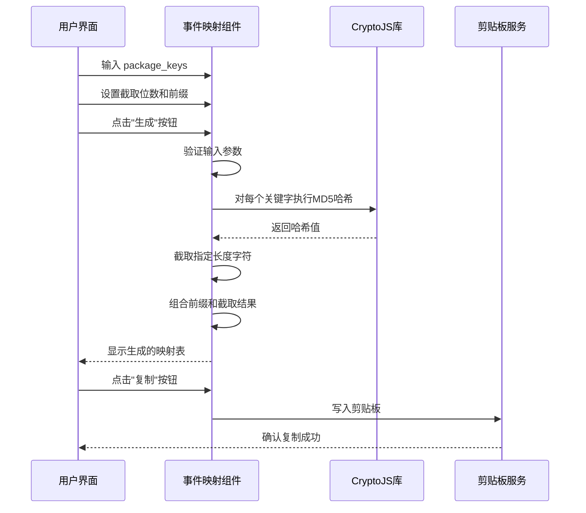
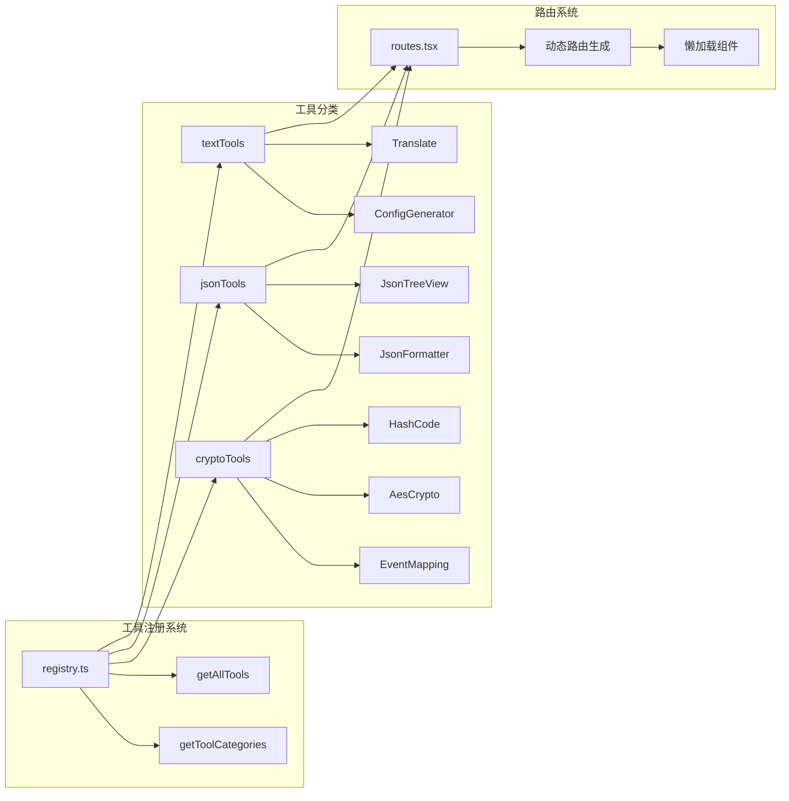
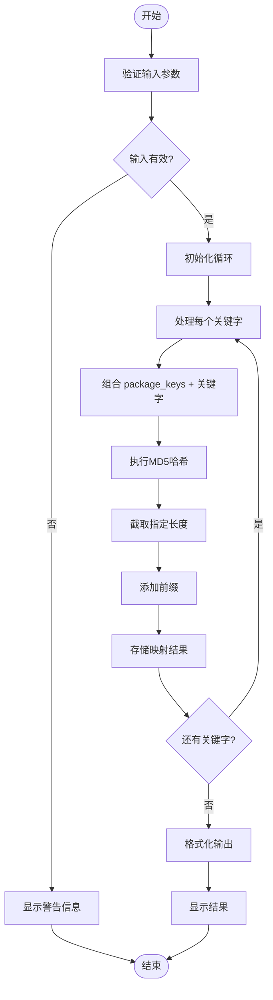
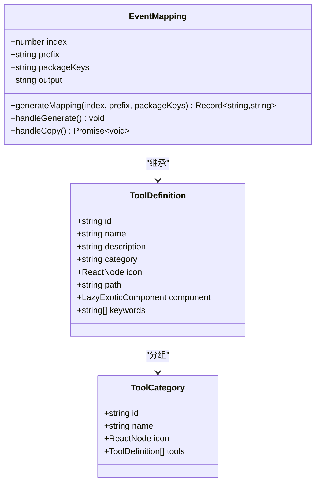
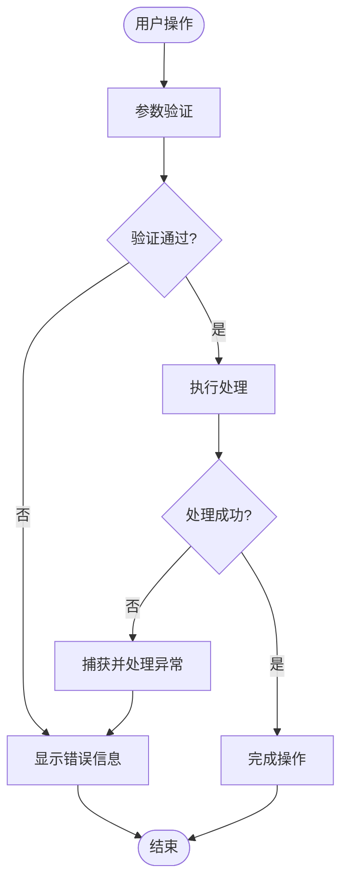

# 事件映射工具

<cite>
**本文档引用的文件**
- [src/tools/crypto/EventMapping/index.tsx](file://src/tools/crypto/EventMapping/index.tsx)
- [src/tools/registry.ts](file://src/tools/registry.ts)
- [src/tools/types.ts](file://src/tools/types.ts)
- [src/tools/crypto/index.tsx](file://src/tools/crypto/index.tsx)
- [src/tools/json/index.tsx](file://src/tools/json/index.tsx)
- [src/tools/text/index.tsx](file://src/tools/text/index.tsx)
- [src/layouts/MainLayout.tsx](file://src/layouts/MainLayout.tsx)
- [src/routes.tsx](file://src/routes.tsx)
- [src/App.tsx](file://src/App.tsx)
- [src/store/useAppStore.ts](file://src/store/useAppStore.ts)
- [package.json](file://package.json)
</cite>

## 目录
1. [简介](#简介)
2. [项目结构](#项目结构)
3. [核心组件](#核心组件)
4. [架构概览](#架构概览)
5. [详细组件分析](#详细组件分析)
6. [依赖关系分析](#依赖关系分析)
7. [性能考虑](#性能考虑)
8. [故障排除指南](#故障排除指南)
9. [结论](#结论)

## 简介

事件映射工具是 XKUtil 工具集中的一个专门功能模块，用于基于 MD5 哈希算法生成行为打点事件映射配置。该工具通过将预定义的关键字与用户提供的 package_keys 进行组合，然后对结果进行 MD5 哈希计算并截取指定长度，最终生成完整的事件映射表。

该工具主要面向移动应用开发场景，帮助开发者快速生成符合特定格式要求的行为追踪事件标识符，确保事件命名的一致性和可维护性。

## 项目结构

XKUtil 是一个基于 React 和 Tauri 的跨平台桌面应用程序，采用模块化的工具组织方式。项目结构清晰地分离了不同功能领域的工具模块：



**图表来源**
- [src/main.tsx:1-11](file://src/main.tsx#L1-L11)
- [src/App.tsx:1-24](file://src/App.tsx#L1-L24)
- [src/layouts/MainLayout.tsx:1-168](file://src/layouts/MainLayout.tsx#L1-L168)

**章节来源**
- [src/main.tsx:1-11](file://src/main.tsx#L1-L11)
- [src/App.tsx:1-24](file://src/App.tsx#L1-L24)
- [src/routes.tsx:1-29](file://src/routes.tsx#L1-L29)

## 核心组件

事件映射工具的核心实现位于 `src/tools/crypto/EventMapping/index.tsx` 文件中，包含以下关键组件：

### 主要功能特性

1. **MD5 哈希生成**: 使用 CryptoJS 库进行 MD5 哈希计算
2. **动态截取**: 支持自定义截取位数（1-32位）
3. **前缀定制**: 允许添加自定义前缀
4. **批量生成**: 为预定义关键字集合生成完整映射表
5. **结果导出**: 提供一键复制功能

### 默认关键字集合

工具内置了 40 个常用的行为追踪关键字，涵盖金融、电商、社交等领域的典型事件类型：

- 用户操作类：`click`, `tap`, `open`, `close`
- 表单交互类：`submit`, `cancel`, `confirm`
- 业务流程类：`apply`, `loan`, `repay`, `payment`
- 设备信息类：`camera`, `microphone`, `location`
- 用户认证类：`login`, `logout`, `register`, `verify`

**章节来源**
- [src/tools/crypto/EventMapping/index.tsx:8-18](file://src/tools/crypto/EventMapping/index.tsx#L8-L18)
- [src/tools/crypto/EventMapping/index.tsx:20-29](file://src/tools/crypto/EventMapping/index.tsx#L20-L29)

## 架构概览

事件映射工具采用模块化架构设计，遵循 React 组件化开发原则，并与整体应用框架无缝集成：



**图表来源**
- [src/tools/crypto/EventMapping/index.tsx:37-48](file://src/tools/crypto/EventMapping/index.tsx#L37-L48)
- [src/tools/crypto/EventMapping/index.tsx:50-58](file://src/tools/crypto/EventMapping/index.tsx#L50-L58)

### 工具注册机制

整个工具系统通过统一的注册机制进行管理，事件映射工具作为加密工具类别的一部分被自动发现和加载：



**图表来源**
- [src/tools/registry.ts:6](file://src/tools/registry.ts#L6)
- [src/tools/crypto/index.tsx:5-36](file://src/tools/crypto/index.tsx#L5-L36)
- [src/tools/json/index.tsx:5-26](file://src/tools/json/index.tsx#L5-L26)
- [src/tools/text/index.tsx:5-26](file://src/tools/text/index.tsx#L5-L26)

**章节来源**
- [src/tools/registry.ts:1-40](file://src/tools/registry.ts#L1-L40)
- [src/tools/crypto/index.tsx:1-37](file://src/tools/crypto/index.tsx#L1-L37)

## 详细组件分析

### 事件映射核心算法

事件映射工具的核心算法实现了以下数据处理流程：



**图表来源**
- [src/tools/crypto/EventMapping/index.tsx:20-29](file://src/tools/crypto/EventMapping/index.tsx#L20-L29)
- [src/tools/crypto/EventMapping/index.tsx:37-48](file://src/tools/crypto/EventMapping/index.tsx#L37-L48)

### 组件架构设计

事件映射组件采用了函数式组件设计，结合 React Hooks 实现状态管理和副作用处理：



**图表来源**
- [src/tools/crypto/EventMapping/index.tsx:31-130](file://src/tools/crypto/EventMapping/index.tsx#L31-L130)
- [src/tools/types.ts:3-19](file://src/tools/types.ts#L3-L19)

### 用户界面设计

组件提供了直观的用户界面，包含输入控件、操作按钮和结果显示区域：

| 组件元素 | 功能描述 | 配置选项 |
|---------|---------|---------|
| package_keys 输入框 | 用户输入自定义密钥 | 占位符：输入 package_keys |
| 前缀输入框 | 自定义事件标识符前缀 | 占位符：如 ev_ |
| 截取位数选择器 | 设置哈希值截取长度 | 范围：1-32，默认：8 |
| 生成按钮 | 触发映射表生成 | 图标：⚡️ |
| 复制按钮 | 导出生成结果 | 图标：📋️ |

**章节来源**
- [src/tools/crypto/EventMapping/index.tsx:60-128](file://src/tools/crypto/EventMapping/index.tsx#L60-L128)

## 依赖关系分析

事件映射工具的依赖关系体现了现代前端开发的最佳实践：

```mermaid
graph TB
subgraph "运行时依赖"
A[react@^19.1.0] --> B[React 核心库]
C[react-dom@^19.1.0] --> D[DOM 操作]
E[antd@^5.24.0] --> F[UI 组件库]
G[crypto-js@^4.2.0] --> H[加密算法库]
I[@ant-design/icons@^5.6.1] --> J[图标组件]
end
subgraph "开发时依赖"
K[@types/react@^19.1.0] --> L[React 类型定义]
M[@types/crypto-js@^4.2.2] --> N[CryptoJS 类型定义]
O[typescript@^5.8.3] --> P[类型检查]
Q[@vitejs/plugin-react@^4.4.1] --> R[Vite React 插件]
end
subgraph "应用特定依赖"
S[@tauri-apps/api@^2.5.0] --> T[Tauri 核心 API]
U[@tauri-apps/plugin-clipboard-manager@^2.2.1] --> V[剪贴板插件]
W[zustand@^5.0.5] --> X[状态管理]
end
```

**图表来源**
- [package.json:12-37](file://package.json#L12-L37)

### 版本兼容性

工具使用的主要依赖版本确保了稳定性和兼容性：

- **React 生态系统**: v19.1.0 确保最新的 React 特性支持
- **Ant Design**: v5.24.0 提供现代化的 UI 组件
- **CryptoJS**: v4.2.0 保证加密功能的可靠性
- **Tauri**: v2.5.0 支持跨平台桌面应用开发

**章节来源**
- [package.json:1-39](file://package.json#L1-L39)

## 性能考虑

事件映射工具在性能方面采用了多项优化策略：

### 算法复杂度分析

- **时间复杂度**: O(n)，其中 n 为默认关键字数量（40个）
- **空间复杂度**: O(n)，用于存储生成的映射结果
- **哈希计算**: 每个关键字执行一次 MD5 哈希运算
- **内存使用**: 由于关键字数量固定且较小，内存占用极低

### 性能优化措施

1. **懒加载机制**: 工具组件采用 React.lazy 实现按需加载
2. **状态管理**: 使用 Zustand 实现轻量级状态管理
3. **剪贴板操作**: 异步处理确保界面响应性
4. **输入验证**: 在客户端进行即时验证减少无效计算

### 扩展性考虑

工具设计具有良好的扩展性，可以轻松添加新的关键字或修改生成规则：

- **关键字扩展**: 可以通过修改默认数组添加更多关键字
- **算法定制**: 支持不同的哈希算法和截取策略
- **输出格式**: 可以扩展支持多种输出格式（JSON、CSV、YAML）

## 故障排除指南

### 常见问题及解决方案

| 问题类型 | 症状描述 | 解决方案 |
|---------|---------|---------|
| 输入验证错误 | 生成按钮无响应 | 检查 package_keys 是否为空，确认截取位数在有效范围内 |
| 剪贴板权限问题 | 复制按钮失效 | 确认浏览器或操作系统剪贴板权限设置 |
| 性能问题 | 生成过程缓慢 | 检查网络连接，避免同时运行多个重负载任务 |
| 样式异常 | 界面显示不正常 | 刷新页面，清除浏览器缓存 |

### 错误处理机制

事件映射工具实现了完善的错误处理机制：



**图表来源**
- [src/tools/crypto/EventMapping/index.tsx:37-58](file://src/tools/crypto/EventMapping/index.tsx#L37-L58)

### 调试建议

1. **控制台检查**: 查看浏览器开发者工具中的错误信息
2. **网络监控**: 确认外部依赖库的加载状态
3. **本地测试**: 在不同环境下测试工具的稳定性
4. **性能分析**: 使用性能分析工具检测潜在的性能瓶颈

**章节来源**
- [src/tools/crypto/EventMapping/index.tsx:37-58](file://src/tools/crypto/EventMapping/index.tsx#L37-L58)

## 结论

事件映射工具作为 XKUtil 工具集的重要组成部分，展现了现代前端开发的最佳实践。该工具通过简洁的用户界面和高效的算法实现，为开发者提供了一个可靠的事件映射生成解决方案。

### 主要优势

1. **易用性强**: 直观的界面设计和明确的功能指引
2. **性能优秀**: 优化的算法实现确保快速响应
3. **扩展灵活**: 模块化设计便于功能扩展和定制
4. **集成良好**: 与整体应用框架无缝集成

### 技术亮点

- 基于 React Hooks 的现代化组件设计
- 采用 CryptoJS 库确保加密算法的可靠性
- 实现了完整的输入验证和错误处理机制
- 支持多种输出格式和导出方式

该工具为移动应用开发中的行为追踪需求提供了标准化的解决方案，有助于提高开发效率和代码质量。随着功能的不断完善和扩展，它将成为开发者工具箱中不可或缺的重要工具。