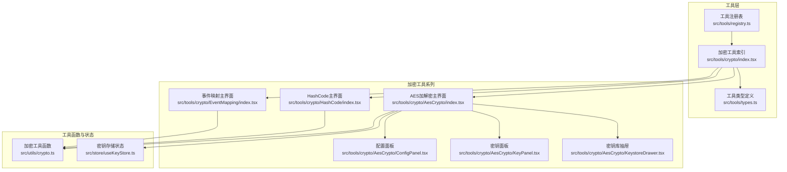
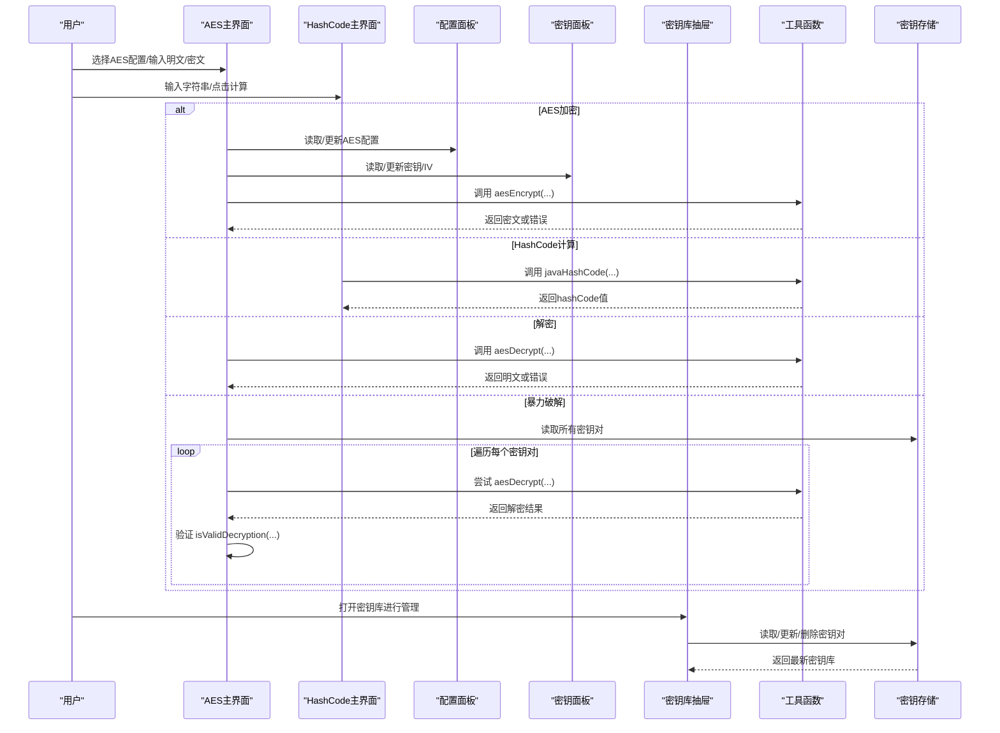
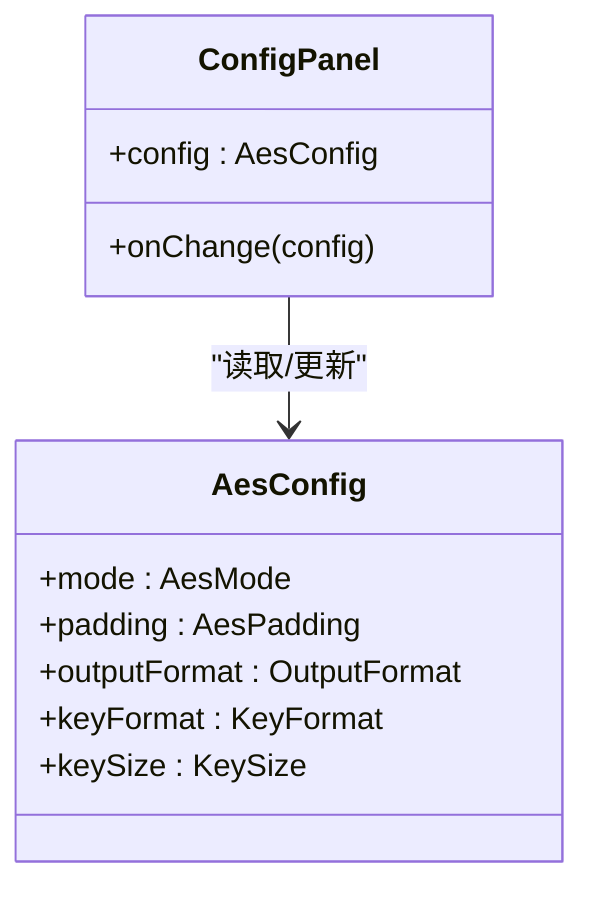
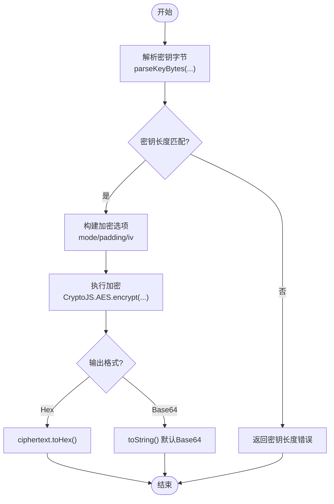
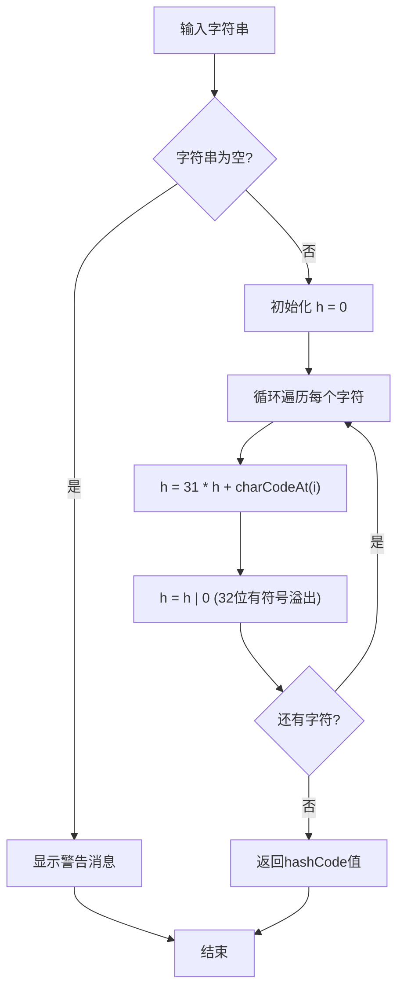
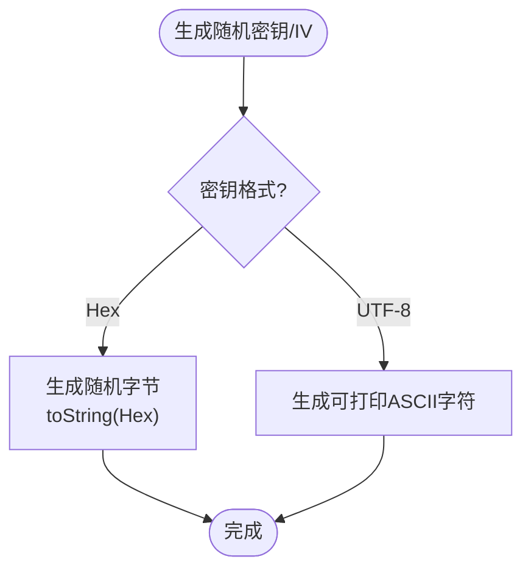
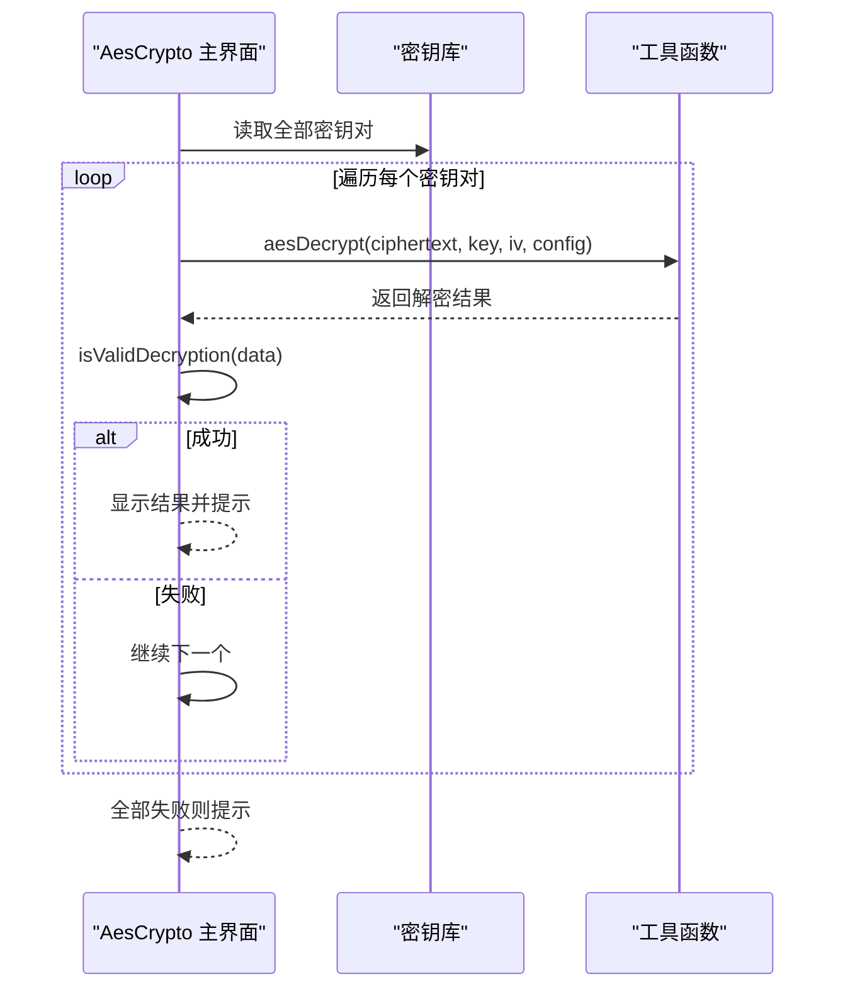
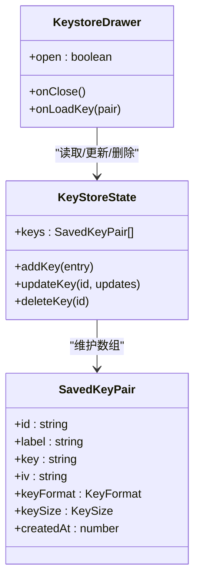
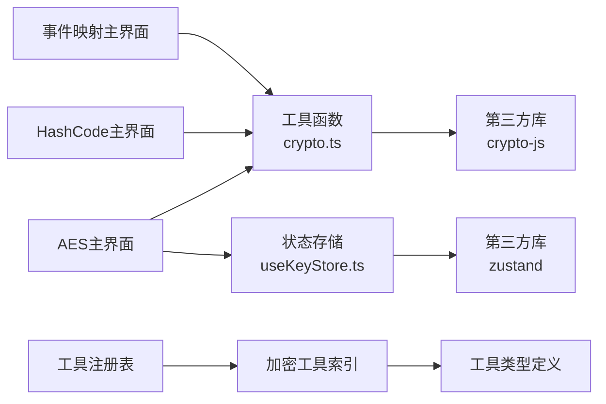

# 加密工具系列

<cite>
**本文引用的文件列表**
- [src/tools/crypto/AesCrypto/index.tsx](file://src/tools/crypto/AesCrypto/index.tsx)
- [src/tools/crypto/AesCrypto/ConfigPanel.tsx](file://src/tools/crypto/AesCrypto/ConfigPanel.tsx)
- [src/tools/crypto/AesCrypto/KeyPanel.tsx](file://src/tools/crypto/AesCrypto/KeyPanel.tsx)
- [src/tools/crypto/AesCrypto/KeystoreDrawer.tsx](file://src/tools/crypto/AesCrypto/KeystoreDrawer.tsx)
- [src/tools/crypto/HashCode/index.tsx](file://src/tools/crypto/HashCode/index.tsx)
- [src/tools/crypto/EventMapping/index.tsx](file://src/tools/crypto/EventMapping/index.tsx)
- [src/utils/crypto.ts](file://src/utils/crypto.ts)
- [src/store/useKeyStore.ts](file://src/store/useKeyStore.ts)
- [src/tools/registry.ts](file://src/tools/registry.ts)
- [src/tools/crypto/index.tsx](file://src/tools/crypto/index.tsx)
- [src/tools/types.ts](file://src/tools/types.ts)
- [package.json](file://package.json)
</cite>

## 更新摘要
**所做更改**
- 新增Java String HashCode计算工具的完整功能说明
- 更新工具注册表和分类系统，将HashCode工具集成到加密工具系列
- 添加HashCode工具的算法实现、用户界面和交互流程
- 更新架构图以反映新增的工具组件

## 目录
1. [简介](#简介)
2. [项目结构](#项目结构)
3. [核心组件](#核心组件)
4. [架构总览](#架构总览)
5. [详细组件分析](#详细组件分析)
6. [依赖关系分析](#依赖关系分析)
7. [性能考量](#性能考量)
8. [故障排查指南](#故障排查指南)
9. [结论](#结论)
10. [附录](#附录)

## 简介
本文件面向XKUtil项目的"加密工具系列"，现已扩展为包含多种加密相关工具的综合工具集，涵盖以下主题：
- AES支持的加密模式与填充方式、输出格式与密钥格式的技术实现
- Java风格字符串hashCode计算工具的算法实现与应用场景
- 密钥库管理的完整生命周期：保存、编辑、删除与持久化
- 暴力破解功能的安全设计：自动遍历策略、解密结果验证与用户体验
- 加密安全性最佳实践与实际使用示例

## 项目结构
加密工具系列现包含三个核心工具，均位于工具模块的"加密工具"分类下，采用按功能拆分的组件化组织方式：
- **AES加解密工具**：完整的AES加密/解密解决方案，支持多模式、密钥库管理、暴力破解
- **HashCode工具**：Java风格字符串hashCode计算，模拟Java int 32位有符号溢出算法
- **事件映射工具**：基于MD5生成行为打点事件映射配置

**图表来源**
- [src/tools/registry.ts:1-40](file://src/tools/registry.ts#L1-L40)
- [src/tools/crypto/index.tsx:1-37](file://src/tools/crypto/index.tsx#L1-L37)
- [src/tools/crypto/HashCode/index.tsx:1-79](file://src/tools/crypto/HashCode/index.tsx#L1-L79)
- [src/tools/types.ts:1-20](file://src/tools/types.ts#L1-L20)

**章节来源**
- [src/tools/registry.ts:1-40](file://src/tools/registry.ts#L1-L40)
- [src/tools/crypto/index.tsx:1-37](file://src/tools/crypto/index.tsx#L1-L37)
- [src/tools/crypto/HashCode/index.tsx:1-79](file://src/tools/crypto/HashCode/index.tsx#L1-L79)

## 核心组件
加密工具系列现包含以下核心组件：
- **AES主界面组件**：负责配置读取、输入输出处理、加密/解密/暴力破解调用、剪贴板复制与清空等交互
- **HashCode主界面组件**：提供Java风格字符串hashCode计算功能，支持输入、计算、复制等操作
- **事件映射主界面组件**：基于MD5生成行为打点事件映射配置
- **配置面板**：提供AES模式、填充方式、输出格式、密钥格式与密钥长度的选择
- **密钥面板**：支持密钥与IV输入、随机生成、保存与打开密钥库
- **密钥库抽屉**：展示、编辑、删除与加载密钥对
- **工具函数**：封装aesEncrypt、aesDecrypt、isValidDecryption、generateRandomKey/IV等
- **状态存储**：基于轻量状态库实现密钥对的增删改查与本地持久化

**章节来源**
- [src/tools/crypto/AesCrypto/index.tsx:33-310](file://src/tools/crypto/AesCrypto/index.tsx#L33-L310)
- [src/tools/crypto/HashCode/index.tsx:20-79](file://src/tools/crypto/HashCode/index.tsx#L20-L79)
- [src/tools/crypto/EventMapping/index.tsx](file://src/tools/crypto/EventMapping/index.tsx)
- [src/tools/crypto/AesCrypto/ConfigPanel.tsx:39-95](file://src/tools/crypto/AesCrypto/ConfigPanel.tsx#L39-L95)
- [src/tools/crypto/AesCrypto/KeyPanel.tsx:23-114](file://src/tools/crypto/AesCrypto/KeyPanel.tsx#L23-L114)
- [src/tools/crypto/AesCrypto/KeystoreDrawer.tsx:26-185](file://src/tools/crypto/AesCrypto/KeystoreDrawer.tsx#L26-L185)
- [src/utils/crypto.ts:59-222](file://src/utils/crypto.ts#L59-L222)
- [src/store/useKeyStore.ts:22-47](file://src/store/useKeyStore.ts#L22-L47)

## 架构总览
加密工具系列采用"界面-配置-工具函数-状态"的分层架构，现包含三种不同的工具类型：
- **界面层**：Ant Design组件组合，响应用户事件
- **配置层**：集中管理AES参数与UI状态
- **工具层**：封装加密/解密与校验逻辑，以及HashCode计算算法
- **状态层**：本地持久化密钥库，避免刷新丢失

**图表来源**
- [src/tools/crypto/AesCrypto/index.tsx:55-112](file://src/tools/crypto/AesCrypto/index.tsx#L55-L112)
- [src/tools/crypto/HashCode/index.tsx:24-41](file://src/tools/crypto/HashCode/index.tsx#L24-L41)
- [src/utils/crypto.ts:59-162](file://src/utils/crypto.ts#L59-L162)
- [src/store/useKeyStore.ts:22-47](file://src/store/useKeyStore.ts#L22-L47)

## 详细组件分析

### AES配置与参数
- 支持的加密模式：CBC、ECB、CFB、OFB、CTR
- 填充方式：Pkcs7、ZeroPadding、NoPadding
- 输出格式：Base64、Hex
- 密钥格式：UTF-8、Hex
- 密钥长度：128、192、256位

**图表来源**
- [src/utils/crypto.ts:9-15](file://src/utils/crypto.ts#L9-L15)
- [src/tools/crypto/AesCrypto/ConfigPanel.tsx:39-95](file://src/tools/crypto/AesCrypto/ConfigPanel.tsx#L39-L95)

**章节来源**
- [src/tools/crypto/AesCrypto/ConfigPanel.tsx:9-37](file://src/tools/crypto/AesCrypto/ConfigPanel.tsx#L9-L37)
- [src/utils/crypto.ts:3-7](file://src/utils/crypto.ts#L3-L7)

### 加密/解密实现与数据流
- 加密流程：解析密钥与IV（根据密钥格式），构造选项，调用加密函数，按输出格式编码
- 解密流程：解析密钥与IV，构造密文参数，调用解密函数，转回UTF-8字符串
- 参数校验：密钥/IV长度与格式校验，模式为ECB时忽略IV

**图表来源**
- [src/utils/crypto.ts:59-105](file://src/utils/crypto.ts#L59-L105)

**章节来源**
- [src/utils/crypto.ts:59-162](file://src/utils/crypto.ts#L59-L162)

### HashCode计算工具
**新增功能**：Java风格字符串hashCode计算工具，完全模拟Java语言的hashCode算法实现。

- **算法原理**：h = 31 * h + charCode，通过Math.imul实现32位有符号整数溢出
- **输入处理**：支持任意长度字符串，逐字符计算哈希值
- **输出格式**：32位有符号整数，支持复制到剪贴板
- **用户界面**：简洁的文本输入框、计算按钮、结果显示和复制功能

**图表来源**
- [src/tools/crypto/HashCode/index.tsx:11-18](file://src/tools/crypto/HashCode/index.tsx#L11-L18)
- [src/tools/crypto/HashCode/index.tsx:24-31](file://src/tools/crypto/HashCode/index.tsx#L24-L31)

**章节来源**
- [src/tools/crypto/HashCode/index.tsx:7-18](file://src/tools/crypto/HashCode/index.tsx#L7-L18)
- [src/tools/crypto/HashCode/index.tsx:20-79](file://src/tools/crypto/HashCode/index.tsx#L20-L79)

### 密钥与IV生成与校验
- 随机密钥生成：按位数生成随机字节，可输出为Hex或UTF-8（UTF-8模式下生成可打印ASCII）
- 随机IV生成：固定16字节，Hex或UTF-8两种格式
- 长度校验：Hex密钥长度为位数/8*2；Hex IV长度固定32字符

**图表来源**
- [src/utils/crypto.ts:164-191](file://src/utils/crypto.ts#L164-L191)

**章节来源**
- [src/utils/crypto.ts:164-200](file://src/utils/crypto.ts#L164-L200)

### 解密结果验证与暴力破解
- 验证策略：检查空结果、替换字符（无效UTF-8），统计可打印字符比例阈值
- 暴力破解流程：遍历密钥库中所有密钥对，逐个尝试解密，命中即停止并提示

**图表来源**
- [src/tools/crypto/AesCrypto/index.tsx:87-112](file://src/tools/crypto/AesCrypto/index.tsx#L87-L112)
- [src/utils/crypto.ts:202-222](file://src/utils/crypto.ts#L202-L222)

**章节来源**
- [src/tools/crypto/AesCrypto/index.tsx:87-112](file://src/tools/crypto/AesCrypto/index.tsx#L87-L112)
- [src/utils/crypto.ts:202-222](file://src/utils/crypto.ts#L202-L222)

### 密钥库管理生命周期
- 保存：从界面读取当前配置与输入，写入状态并持久化
- 编辑：弹出表单，更新指定密钥对字段
- 删除：确认后移除对应条目
- 加载：将密钥对内容填入界面并同步配置

**图表来源**
- [src/store/useKeyStore.ts:5-20](file://src/store/useKeyStore.ts#L5-L20)
- [src/store/useKeyStore.ts:22-47](file://src/store/useKeyStore.ts#L22-L47)
- [src/tools/crypto/AesCrypto/KeystoreDrawer.tsx:26-185](file://src/tools/crypto/AesCrypto/KeystoreDrawer.tsx#L26-L185)

**章节来源**
- [src/store/useKeyStore.ts:22-47](file://src/store/useKeyStore.ts#L22-L47)
- [src/tools/crypto/AesCrypto/KeystoreDrawer.tsx:26-185](file://src/tools/crypto/AesCrypto/KeystoreDrawer.tsx#L26-L185)

### 用户界面与交互
- **AES主界面**：包含配置面板、密钥面板、操作按钮、输入输出区域与密钥库抽屉
- **HashCode主界面**：包含文本输入框、计算按钮、结果显示和复制功能
- **事件映射界面**：提供MD5生成和配置导出功能
- 提供复制输出、清空、保存密钥对等便捷操作
- 暴力破解按钮在密钥库为空时禁用，失败时给出明确提示

**章节来源**
- [src/tools/crypto/AesCrypto/index.tsx:157-309](file://src/tools/crypto/AesCrypto/index.tsx#L157-L309)
- [src/tools/crypto/HashCode/index.tsx:43-77](file://src/tools/crypto/HashCode/index.tsx#L43-L77)

## 依赖关系分析
- **第三方依赖**：crypto-js用于AES实现；zustand用于状态管理；Ant Design用于UI组件
- **内部依赖**：工具函数与状态模块被主界面与抽屉组件共同依赖
- **持久化**：状态通过中间件实现本地持久化，键名固定
- **工具注册**：通过工具注册表统一管理所有工具的分类和路由

**图表来源**
- [src/tools/crypto/AesCrypto/index.tsx:23-29](file://src/tools/crypto/AesCrypto/index.tsx#L23-L29)
- [src/tools/crypto/HashCode/index.tsx](file://src/tools/crypto/HashCode/index.tsx)
- [src/utils/crypto.ts:1](file://src/utils/crypto.ts#L1)
- [src/tools/registry.ts:1-40](file://src/tools/registry.ts#L1-L40)
- [src/tools/crypto/index.tsx:1-37](file://src/tools/crypto/index.tsx#L1-L37)
- [src/tools/types.ts:1-20](file://src/tools/types.ts#L1-L20)

**章节来源**
- [package.json:12-25](file://package.json#L12-L25)
- [src/utils/crypto.ts:1](file://src/utils/crypto.ts#L1)
- [src/store/useKeyStore.ts:1-2](file://src/store/useKeyStore.ts#L1-L2)
- [src/tools/registry.ts:1-40](file://src/tools/registry.ts#L1-L40)
- [src/tools/crypto/index.tsx:1-37](file://src/tools/crypto/index.tsx#L1-L37)

## 性能考量
- **加密/解密复杂度**：主要受CryptoJS实现影响，通常为线性复杂度
- **HashCode计算复杂度**：O(n)时间复杂度，n为字符串长度，空间复杂度O(1)
- **暴力破解成本**：与密钥库规模成正比，建议限制密钥库大小或增加并发控制
- **UI渲染**：使用受控组件与状态分离，避免不必要的重渲染
- **存储**：本地持久化仅在必要时触发，减少频繁写入

## 故障排查指南
- **常见错误类型**
  - 密钥/IV长度不匹配：检查密钥格式与长度期望
  - 模式为ECB时仍提供IV：ECB模式不使用IV
  - 输出格式不一致导致解密失败：确保加密与解密使用相同输出格式
  - 解密结果为空：核对密钥、IV与配置是否一致
  - HashCode计算异常：检查字符串输入是否为空
- **安全提示**
  - 不要在日志中打印密钥或明文
  - 使用HTTPS传输，避免中间人攻击
  - 定期轮换密钥，避免长期使用同一密钥
  - HashCode仅用于标识目的，不应用于安全敏感场景
- **用户体验**
  - 暴力破解前确保密钥库非空
  - 使用"复制输出"功能快速导出结果
  - HashCode工具支持一键复制功能

**章节来源**
- [src/utils/crypto.ts:68-90](file://src/utils/crypto.ts#L68-L90)
- [src/utils/crypto.ts:116-138](file://src/utils/crypto.ts#L116-L138)
- [src/tools/crypto/AesCrypto/index.tsx:87-112](file://src/tools/crypto/AesCrypto/index.tsx#L87-L112)
- [src/tools/crypto/HashCode/index.tsx:24-41](file://src/tools/crypto/HashCode/index.tsx#L24-L41)

## 结论
XKUtil的加密工具系列通过清晰的组件划分与完善的参数体系，现已成为一个功能完整的加密工具集合。包括AES加解密、Java风格hashCode计算和事件映射在内的多种工具，为开发者提供了全面的加密相关功能。配合密钥库管理与暴力破解辅助功能，满足了日常开发与运维场景中的多种需求。建议在生产环境中遵循安全最佳实践，谨慎处理密钥与日志，定期评估与优化密钥库规模与访问策略。

## 附录
- **实际使用示例（步骤说明）**
  - **AES加密**：在配置面板选择模式/填充/输出格式/密钥格式/密钥长度；在密钥面板输入密钥与IV；在输入框粘贴明文；点击"加密"；复制输出
  - **AES解密**：在配置面板保持与加密一致的参数；在密钥面板输入密钥与IV；在输入框粘贴密文；点击"解密"
  - **HashCode计算**：在输入框输入字符串；点击"计算"；查看hashCode结果；点击"复制"导出
  - **保存密钥对**：在密钥面板点击"保存密钥对"，填写标签、密钥与IV；确认后可在密钥库中查看
  - **编辑/删除**：打开密钥库抽屉，点击"编辑"或"删除"；编辑后保存更新
  - **暴力破解**：准备多个候选密钥对，打开密钥库抽屉；在输入框粘贴密文；点击"暴力破解"等待结果
- **安全最佳实践**
  - 优先使用CBC/CTR模式，避免ECB
  - 使用PKCS7填充，避免NoPadding
  - 输出格式统一为Base64，便于跨平台传输
  - 密钥格式建议使用Hex，便于校验与传输
  - 定期轮换密钥，限制密钥库规模，避免暴力破解成本过高
  - HashCode仅用于标识和调试目的，不应用于安全敏感场景
  - 在生产环境中避免直接暴露hashCode计算结果