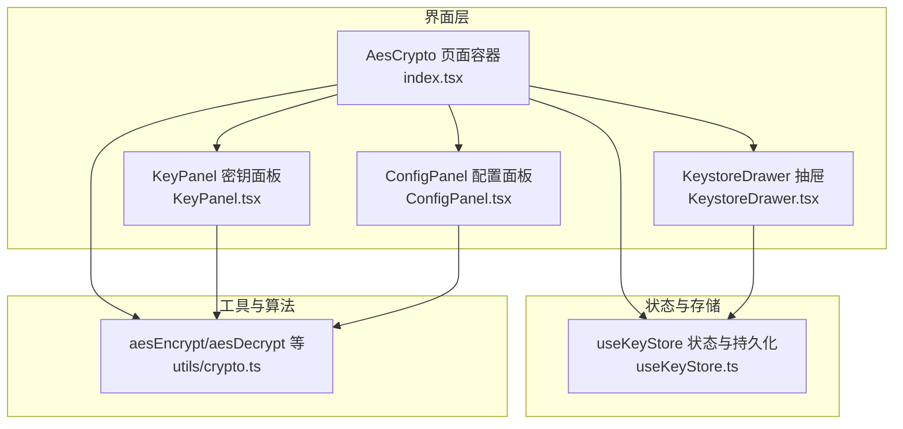
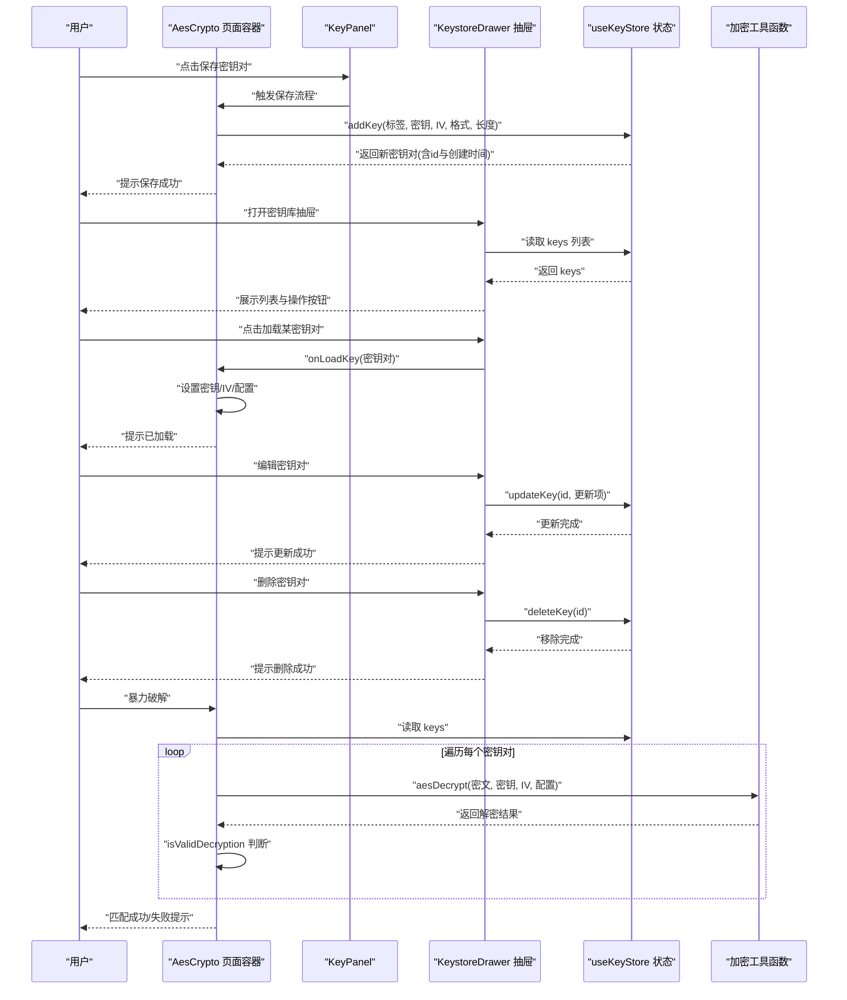
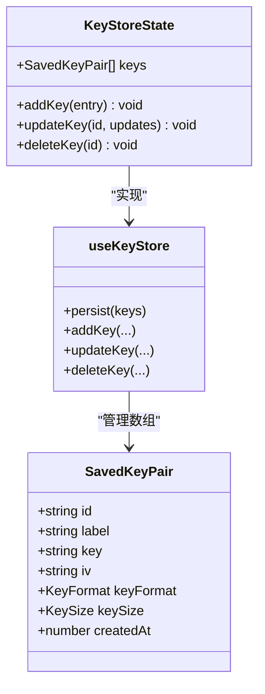
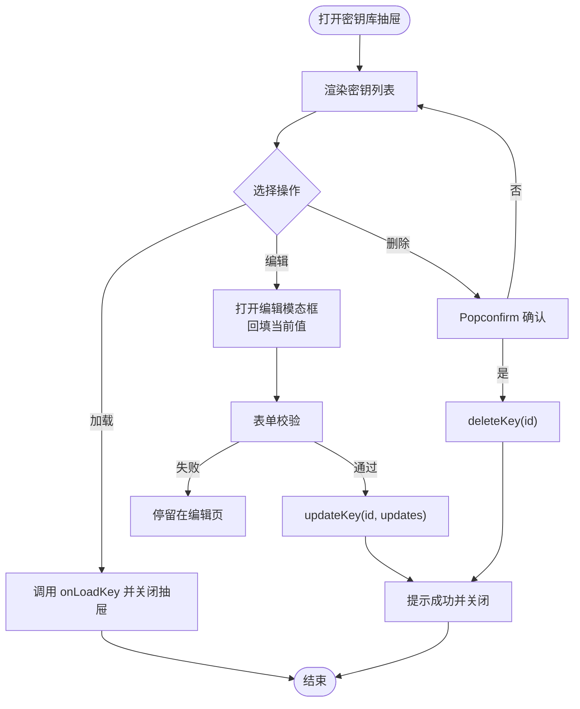
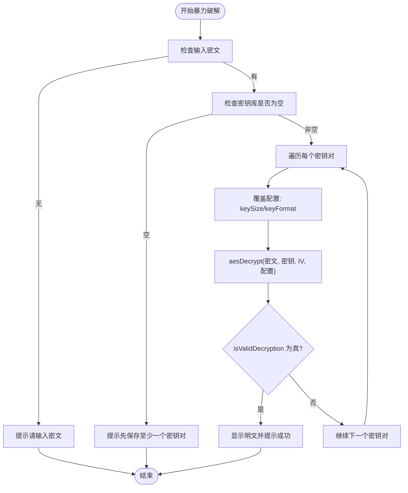
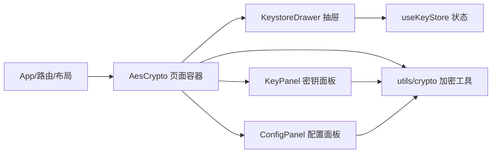

# 密钥库管理

<cite>
**本文引用的文件**
- [src/store/useKeyStore.ts](file://src/store/useKeyStore.ts)
- [src/tools/crypto/AesCrypto/index.tsx](file://src/tools/crypto/AesCrypto/index.tsx)
- [src/tools/crypto/AesCrypto/KeystoreDrawer.tsx](file://src/tools/crypto/AesCrypto/KeystoreDrawer.tsx)
- [src/tools/crypto/AesCrypto/KeyPanel.tsx](file://src/tools/crypto/AesCrypto/KeyPanel.tsx)
- [src/tools/crypto/AesCrypto/ConfigPanel.tsx](file://src/tools/crypto/AesCrypto/ConfigPanel.tsx)
- [src/utils/crypto.ts](file://src/utils/crypto.ts)
- [src/routes.tsx](file://src/routes.tsx)
- [src/layouts/MainLayout.tsx](file://src/layouts/MainLayout.tsx)
- [src/App.tsx](file://src/App.tsx)
- [package.json](file://package.json)
</cite>

## 目录
1. [简介](#简介)
2. [项目结构](#项目结构)
3. [核心组件](#核心组件)
4. [架构总览](#架构总览)
5. [详细组件分析](#详细组件分析)
6. [依赖关系分析](#依赖关系分析)
7. [性能与可用性考量](#性能与可用性考量)
8. [故障排查指南](#故障排查指南)
9. [结论](#结论)
10. [附录](#附录)

## 简介
本指南围绕“密钥库管理”功能，系统阐述 AES 密钥对的全生命周期管理：数据结构、编辑与删除流程、持久化存储、抽屉组件交互与状态管理、数据同步策略，以及导入/导出与备份恢复的最佳实践。读者可据此在应用中安全高效地管理密钥对，并通过暴力破解能力快速定位密钥。

## 项目结构
该功能位于加密工具模块内，采用“页面容器 + 抽屉 + 存储 + 工具函数”的分层组织方式：
- 页面容器负责配置、输入输出、操作按钮与抽屉的协调
- 抽屉承载密钥列表、编辑与删除等管理动作
- 存储层使用 Zustand + persist 将密钥对持久化到本地
- 工具函数封装 AES 加解密、随机密钥/IV 生成、长度校验与解密有效性判断

**图表来源**
- [src/tools/crypto/AesCrypto/index.tsx:1-310](file://src/tools/crypto/AesCrypto/index.tsx#L1-L310)
- [src/tools/crypto/AesCrypto/KeystoreDrawer.tsx:1-185](file://src/tools/crypto/AesCrypto/KeystoreDrawer.tsx#L1-L185)
- [src/tools/crypto/AesCrypto/KeyPanel.tsx:1-114](file://src/tools/crypto/AesCrypto/KeyPanel.tsx#L1-L114)
- [src/tools/crypto/AesCrypto/ConfigPanel.tsx:1-95](file://src/tools/crypto/AesCrypto/ConfigPanel.tsx#L1-L95)
- [src/store/useKeyStore.ts:1-47](file://src/store/useKeyStore.ts#L1-L47)
- [src/utils/crypto.ts:1-222](file://src/utils/crypto.ts#L1-L222)

**章节来源**
- [src/tools/crypto/AesCrypto/index.tsx:1-310](file://src/tools/crypto/AesCrypto/index.tsx#L1-L310)
- [src/tools/crypto/AesCrypto/KeystoreDrawer.tsx:1-185](file://src/tools/crypto/AesCrypto/KeystoreDrawer.tsx#L1-L185)
- [src/tools/crypto/AesCrypto/KeyPanel.tsx:1-114](file://src/tools/crypto/AesCrypto/KeyPanel.tsx#L1-L114)
- [src/tools/crypto/AesCrypto/ConfigPanel.tsx:1-95](file://src/tools/crypto/AesCrypto/ConfigPanel.tsx#L1-L95)
- [src/store/useKeyStore.ts:1-47](file://src/store/useKeyStore.ts#L1-L47)
- [src/utils/crypto.ts:1-222](file://src/utils/crypto.ts#L1-L222)

## 核心组件
- 密钥对数据结构：包含唯一标识、标签、密钥、IV、密钥格式、密钥长度、创建时间等字段，用于描述一次完整的 AES 配置与凭据。
- 状态与持久化：使用 Zustand 管理内存态，并通过 persist 中间件将密钥对数组持久化到本地存储，键名固定，避免跨版本冲突。
- 抽屉组件：提供密钥列表展示、加载、编辑、删除等操作；支持按标签筛选与简要预览。
- 配置面板：统一管理 AES 模式、填充、输出格式、密钥格式与密钥长度，确保加解密一致性。
- 密钥面板：输入密钥/IV，提供随机生成、保存、打开密钥库等入口；根据当前配置动态提示长度与占位符。
- 工具函数：封装 AES 加解密、随机密钥/IV 生成、长度校验、解密有效性判断等。

**章节来源**
- [src/store/useKeyStore.ts:5-20](file://src/store/useKeyStore.ts#L5-L20)
- [src/store/useKeyStore.ts:22-46](file://src/store/useKeyStore.ts#L22-L46)
- [src/tools/crypto/AesCrypto/KeystoreDrawer.tsx:20-24](file://src/tools/crypto/AesCrypto/KeystoreDrawer.tsx#L20-L24)
- [src/tools/crypto/AesCrypto/ConfigPanel.tsx:39-94](file://src/tools/crypto/AesCrypto/ConfigPanel.tsx#L39-L94)
- [src/tools/crypto/AesCrypto/KeyPanel.tsx:10-21](file://src/tools/crypto/AesCrypto/KeyPanel.tsx#L10-L21)
- [src/utils/crypto.ts:9-21](file://src/utils/crypto.ts#L9-L21)
- [src/utils/crypto.ts:59-162](file://src/utils/crypto.ts#L59-L162)
- [src/utils/crypto.ts:164-221](file://src/utils/crypto.ts#L164-L221)

## 架构总览
下图展示了从用户操作到状态持久化的端到端流程，包括保存、加载、编辑、删除与暴力破解的关键节点。

**图表来源**
- [src/tools/crypto/AesCrypto/index.tsx:131-155](file://src/tools/crypto/AesCrypto/index.tsx#L131-L155)
- [src/tools/crypto/AesCrypto/KeystoreDrawer.tsx:26-52](file://src/tools/crypto/AesCrypto/KeystoreDrawer.tsx#L26-L52)
- [src/store/useKeyStore.ts:22-46](file://src/store/useKeyStore.ts#L22-L46)
- [src/utils/crypto.ts:107-162](file://src/utils/crypto.ts#L107-L162)
- [src/utils/crypto.ts:202-221](file://src/utils/crypto.ts#L202-L221)

## 详细组件分析

### 数据结构与持久化
- 数据结构：密钥对包含 id、label、key、iv、keyFormat、keySize、createdAt 等字段，确保每次加解密所需的全部上下文信息被完整记录。
- 持久化策略：Zustand 的 persist 中间件将 keys 数组序列化并写入本地存储，键名为固定字符串，避免跨版本迁移问题；新增字段时需谨慎处理默认值以保证向后兼容。
- 原子性与幂等：addKey 自动生成唯一 id 并记录创建时间；updateKey 支持部分字段更新；deleteKey 基于 id 过滤，保证操作原子性。

**图表来源**
- [src/store/useKeyStore.ts:5-20](file://src/store/useKeyStore.ts#L5-L20)
- [src/store/useKeyStore.ts:22-46](file://src/store/useKeyStore.ts#L22-L46)

**章节来源**
- [src/store/useKeyStore.ts:5-20](file://src/store/useKeyStore.ts#L5-L20)
- [src/store/useKeyStore.ts:22-46](file://src/store/useKeyStore.ts#L22-L46)

### 抽屉组件交互与状态管理
- 打开与关闭：通过 props 控制 open/onClose，抽屉宽度适配密钥列表展示。
- 列表渲染：展示标签、密钥（截断显示）、长度、创建时间；支持空状态文案。
- 加载密钥：点击“加载”按钮回调 onLoadKey，页面容器据此设置密钥/IV/配置。
- 编辑流程：打开模态框，回填当前值，校验通过后调用 updateKey 完成更新。
- 删除流程：使用 Popconfirm 进行二次确认，确认后调用 deleteKey 并提示成功。

**图表来源**
- [src/tools/crypto/AesCrypto/KeystoreDrawer.tsx:26-122](file://src/tools/crypto/AesCrypto/KeystoreDrawer.tsx#L26-L122)
- [src/tools/crypto/AesCrypto/KeystoreDrawer.tsx:142-181](file://src/tools/crypto/AesCrypto/KeystoreDrawer.tsx#L142-L181)

**章节来源**
- [src/tools/crypto/AesCrypto/KeystoreDrawer.tsx:20-24](file://src/tools/crypto/AesCrypto/KeystoreDrawer.tsx#L20-L24)
- [src/tools/crypto/AesCrypto/KeystoreDrawer.tsx:32-52](file://src/tools/crypto/AesCrypto/KeystoreDrawer.tsx#L32-L52)
- [src/tools/crypto/AesCrypto/KeystoreDrawer.tsx:110-118](file://src/tools/crypto/AesCrypto/KeystoreDrawer.tsx#L110-L118)

### 编辑功能实现机制
- 表单绑定：使用 Ant Design Form 绑定编辑表单，初始值来自当前密钥对。
- 校验规则：必填校验，确保标签、密钥等关键字段非空。
- 提交逻辑：校验通过后调用 updateKey，更新指定 id 的条目，随后关闭模态框并清空编辑状态。

**章节来源**
- [src/tools/crypto/AesCrypto/KeystoreDrawer.tsx:142-181](file://src/tools/crypto/AesCrypto/KeystoreDrawer.tsx#L142-L181)
- [src/store/useKeyStore.ts:33-38](file://src/store/useKeyStore.ts#L33-L38)

### 删除操作的安全确认流程
- 二次确认：使用 Popconfirm 弹窗，防止误删。
- 确认后执行：调用 deleteKey 移除对应 id 的密钥对，并提示成功。

**章节来源**
- [src/tools/crypto/AesCrypto/KeystoreDrawer.tsx:110-118](file://src/tools/crypto/AesCrypto/KeystoreDrawer.tsx#L110-L118)
- [src/store/useKeyStore.ts:39-42](file://src/store/useKeyStore.ts#L39-L42)

### 数据持久化存储方案
- 存储介质：浏览器本地存储（localStorage/sessionStorage），由 persist 中间件自动处理。
- 键名：固定字符串，避免跨版本迁移带来的键冲突。
- 版本控制：建议在升级时提供迁移脚本或默认值策略，确保新增字段不影响旧数据。

**章节来源**
- [src/store/useKeyStore.ts:22-46](file://src/store/useKeyStore.ts#L22-L46)

### 密钥导入与导出使用说明
- 导入：在密钥库抽屉中点击“加载”，即可将选中的密钥对应用到当前配置，无需额外导入步骤。
- 导出：当前实现未提供专用的“导出”按钮。若需导出，可在密钥库抽屉中复制密钥/IV 或通过页面保存的密钥对进行备份。
- 安全注意事项：
  - 密钥与 IV 应妥善保管，避免泄露。
  - 不要在日志或错误信息中打印完整密钥。
  - 使用高强度密钥与合适的 AES 模式与填充。

**章节来源**
- [src/tools/crypto/AesCrypto/KeystoreDrawer.tsx:97-103](file://src/tools/crypto/AesCrypto/KeystoreDrawer.tsx#L97-L103)
- [src/tools/crypto/AesCrypto/index.tsx:150-155](file://src/tools/crypto/AesCrypto/index.tsx#L150-L155)

### 暴力破解流程与数据同步策略
- 触发条件：输入密文后点击“暴力破解”，若密钥库为空则提示先保存至少一个密钥对。
- 同步策略：每次暴力破解前从 store 读取 keys，确保与 UI 展示一致。
- 匹配逻辑：遍历密钥对，按其 keySize 与 keyFormat 覆盖配置后尝试解密，使用 isValidDecryption 判断是否为有效明文。
- 结果反馈：匹配成功则显示明文并提示，失败则汇总尝试数量并提示。

**图表来源**
- [src/tools/crypto/AesCrypto/index.tsx:87-112](file://src/tools/crypto/AesCrypto/index.tsx#L87-L112)
- [src/utils/crypto.ts:107-162](file://src/utils/crypto.ts#L107-L162)
- [src/utils/crypto.ts:202-221](file://src/utils/crypto.ts#L202-L221)

**章节来源**
- [src/tools/crypto/AesCrypto/index.tsx:87-112](file://src/tools/crypto/AesCrypto/index.tsx#L87-L112)
- [src/utils/crypto.ts:107-162](file://src/utils/crypto.ts#L107-L162)
- [src/utils/crypto.ts:202-221](file://src/utils/crypto.ts#L202-L221)

### 配置与密钥面板
- 配置面板：统一管理 AES 模式、填充、输出格式、密钥格式与密钥长度，变更即刻生效。
- 密钥面板：输入密钥/IV，提供随机生成按钮；根据当前配置计算预期长度并在占位符中提示；支持保存当前密钥对与打开密钥库。

**章节来源**
- [src/tools/crypto/AesCrypto/ConfigPanel.tsx:39-94](file://src/tools/crypto/AesCrypto/ConfigPanel.tsx#L39-L94)
- [src/tools/crypto/AesCrypto/KeyPanel.tsx:23-113](file://src/tools/crypto/AesCrypto/KeyPanel.tsx#L23-L113)

## 依赖关系分析
- 组件依赖：AesCrypto 页面容器依赖 KeystoreDrawer、KeyPanel、ConfigPanel；KeystoreDrawer 依赖 useKeyStore；页面容器与工具函数相互协作。
- 外部依赖：Zustand 用于状态管理，persist 用于持久化；Ant Design 用于 UI 组件；crypto-js 用于 AES 加解密；React Router 用于路由。

**图表来源**
- [src/tools/crypto/AesCrypto/index.tsx:1-310](file://src/tools/crypto/AesCrypto/index.tsx#L1-L310)
- [src/tools/crypto/AesCrypto/KeystoreDrawer.tsx:1-185](file://src/tools/crypto/AesCrypto/KeystoreDrawer.tsx#L1-L185)
- [src/tools/crypto/AesCrypto/KeyPanel.tsx:1-114](file://src/tools/crypto/AesCrypto/KeyPanel.tsx#L1-L114)
- [src/tools/crypto/AesCrypto/ConfigPanel.tsx:1-95](file://src/tools/crypto/AesCrypto/ConfigPanel.tsx#L1-L95)
- [src/store/useKeyStore.ts:1-47](file://src/store/useKeyStore.ts#L1-L47)
- [src/utils/crypto.ts:1-222](file://src/utils/crypto.ts#L1-L222)
- [src/App.tsx:1-24](file://src/App.tsx#L1-L24)
- [src/routes.tsx:1-29](file://src/routes.tsx#L1-L29)
- [src/layouts/MainLayout.tsx:1-168](file://src/layouts/MainLayout.tsx#L1-L168)

**章节来源**
- [package.json:12-25](file://package.json#L12-L25)
- [src/App.tsx:1-24](file://src/App.tsx#L1-L24)
- [src/routes.tsx:1-29](file://src/routes.tsx#L1-L29)
- [src/layouts/MainLayout.tsx:1-168](file://src/layouts/MainLayout.tsx#L1-L168)

## 性能与可用性考量
- 状态粒度：当前 keys 数组整体更新，对于大量密钥时建议考虑分页或虚拟滚动优化表格渲染。
- 计算开销：暴力破解会逐个尝试密钥对，建议限制尝试数量或提供中断机制。
- 用户体验：编辑与删除均提供即时反馈；输入/输出区域采用等宽字体便于比对；随机生成按钮提升易用性。
- 可靠性：持久化采用固定键名，避免跨版本迁移问题；建议在升级时提供默认值策略。

[本节为通用指导，无需特定文件引用]

## 故障排查指南
- 无法解密：检查密钥/IV 长度与格式是否符合当前配置；确认输出格式与密文一致；使用“暴力破解”功能快速定位。
- 解密结果为空：可能是密钥或配置不正确，或密文格式不匹配。
- 随机密钥/IV 生成异常：确认密钥格式与长度要求；Hex 模式下长度应为预期字节数的两倍。
- 暴力破解失败：确认密钥库中存在匹配的密钥对；检查密钥长度与格式是否与密文一致。
- 删除无效：确认已正确触发 Popconfirm；检查 id 是否存在且唯一。

**章节来源**
- [src/utils/crypto.ts:107-162](file://src/utils/crypto.ts#L107-L162)
- [src/utils/crypto.ts:164-200](file://src/utils/crypto.ts#L164-L200)
- [src/tools/crypto/AesCrypto/index.tsx:87-112](file://src/tools/crypto/AesCrypto/index.tsx#L87-L112)
- [src/tools/crypto/AesCrypto/KeystoreDrawer.tsx:110-118](file://src/tools/crypto/AesCrypto/KeystoreDrawer.tsx#L110-L118)

## 结论
本功能通过清晰的数据结构、可靠的持久化与直观的抽屉交互，实现了密钥对的全生命周期管理。结合暴力破解能力与随机生成工具，用户可以高效、安全地维护与使用密钥对。建议在生产环境中加强密钥保护与访问控制，并定期备份密钥库。

[本节为总结性内容，无需特定文件引用]

## 附录

### 密钥库备份与恢复最佳实践
- 备份：在应用外保存本地存储中的密钥库数据（注意敏感信息脱敏），或通过截图/复制的方式记录关键信息。
- 恢复：在相同版本或兼容版本的应用中，直接打开密钥库抽屉即可恢复；若跨版本升级，建议先验证配置兼容性再恢复。
- 安全：备份文件应加密存储，传输过程中使用可信渠道；删除备份时确保彻底清除。

[本节为通用指导，无需特定文件引用]