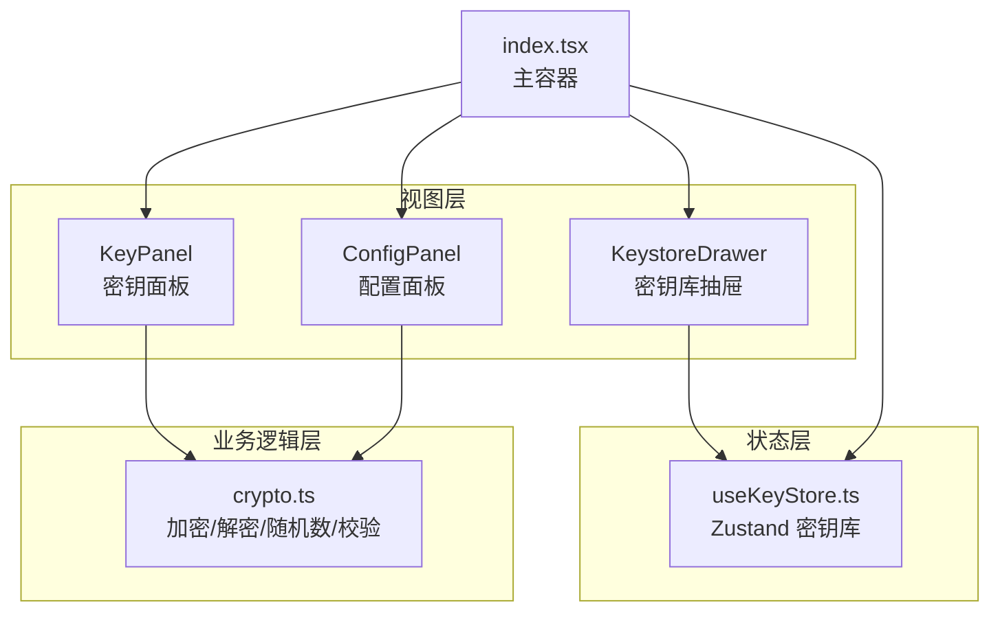
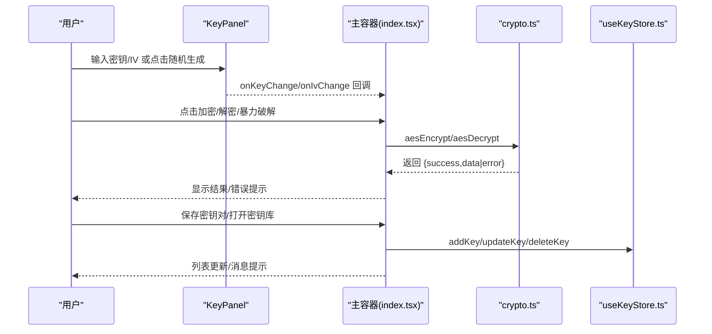
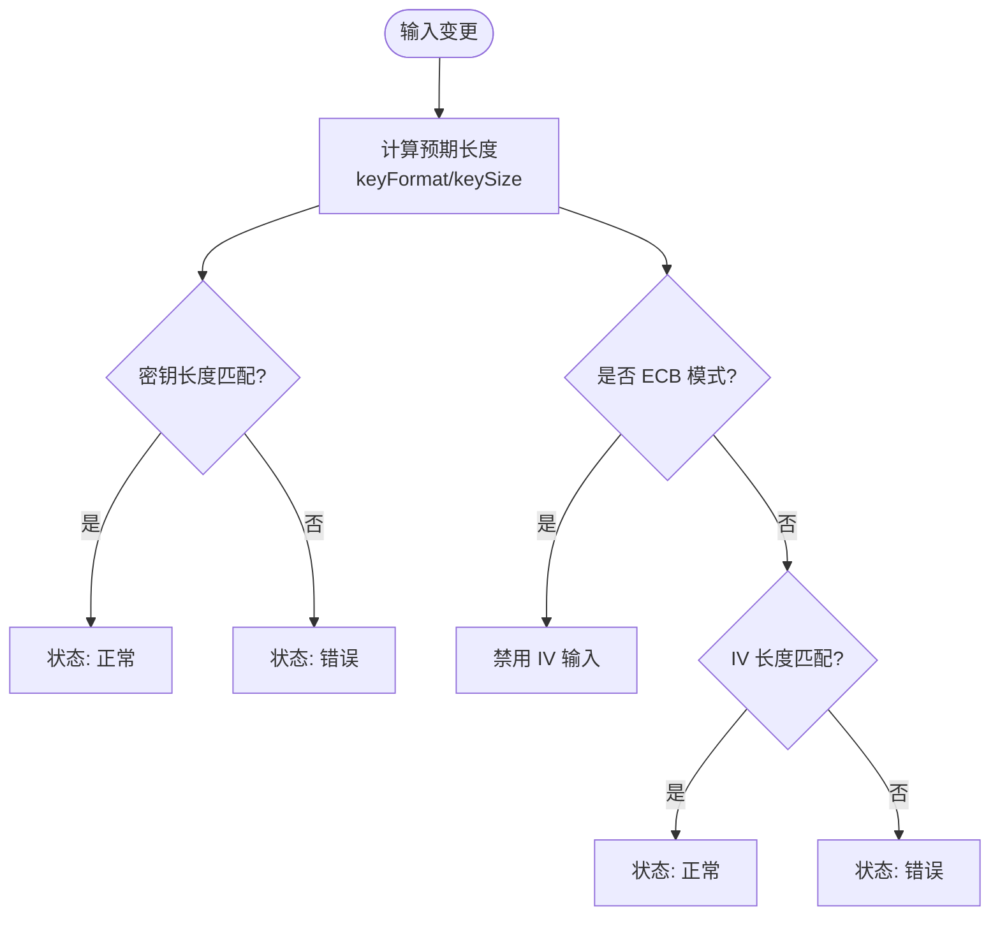
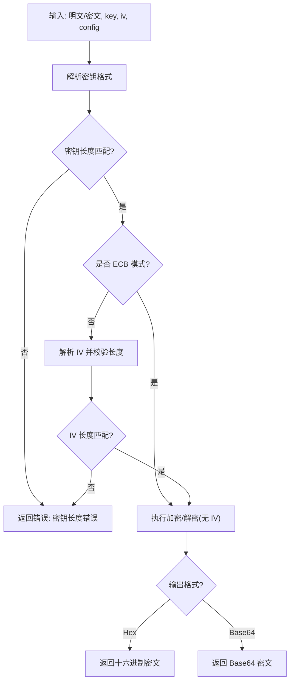
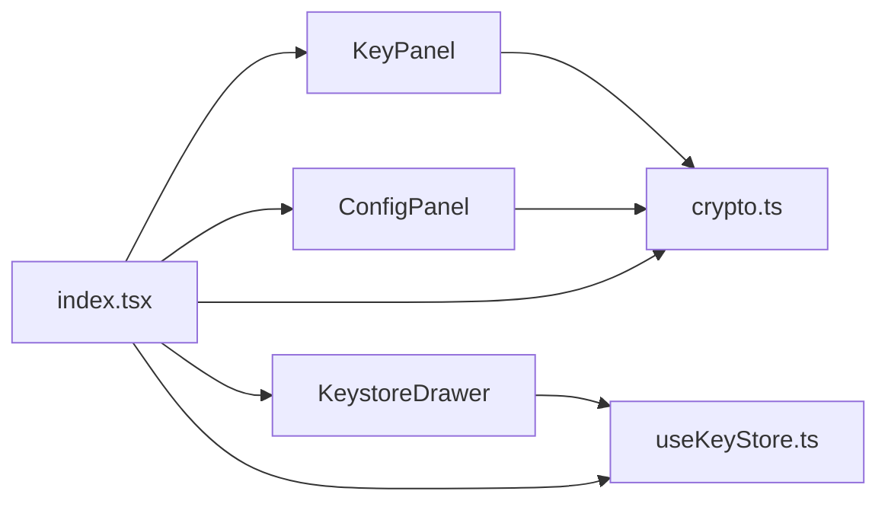

# 密钥面板

<cite>
**本文引用的文件列表**
- [KeyPanel.tsx](file://src/tools/crypto/AesCrypto/KeyPanel.tsx)
- [useKeyStore.ts](file://src/store/useKeyStore.ts)
- [crypto.ts](file://src/utils/crypto.ts)
- [ConfigPanel.tsx](file://src/tools/crypto/AesCrypto/ConfigPanel.tsx)
- [KeystoreDrawer.tsx](file://src/tools/crypto/AesCrypto/KeystoreDrawer.tsx)
- [index.tsx](file://src/tools/crypto/AesCrypto/index.tsx)
- [types.ts](file://src/tools/types.ts)
- [changelog.ts](file://src/constants/changelog.ts)
</cite>

## 目录
1. [简介](#简介)
2. [项目结构](#项目结构)
3. [核心组件](#核心组件)
4. [架构总览](#架构总览)
5. [详细组件分析](#详细组件分析)
6. [依赖关系分析](#依赖关系分析)
7. [性能考量](#性能考量)
8. [故障排查指南](#故障排查指南)
9. [结论](#结论)
10. [附录](#附录)

## 简介
本指南围绕“密钥面板”功能，系统阐述密钥输入处理的实现机制与使用方法，包括：
- 密钥文本框的输入验证与实时反馈
- IV 向量的管理方式与长度校验
- 随机密钥与 IV 的生成算法
- 密钥长度与格式的验证规则
- 用户交互设计与错误提示机制
- 密钥格式转换、导入导出与安全存储
- 安全最佳实践与常见问题解决方案

## 项目结构
密钥面板位于 AES 加密工具模块中，采用分层设计：
- 视图层：密钥面板、配置面板、密钥库抽屉
- 业务逻辑层：加解密与随机数生成工具函数
- 状态层：密钥对持久化存储（Zustand + localStorage）

图表来源
- [KeyPanel.tsx:1-114](file://src/tools/crypto/AesCrypto/KeyPanel.tsx#L1-L114)
- [ConfigPanel.tsx:1-95](file://src/tools/crypto/AesCrypto/ConfigPanel.tsx#L1-L95)
- [KeystoreDrawer.tsx:1-185](file://src/tools/crypto/AesCrypto/KeystoreDrawer.tsx#L1-L185)
- [crypto.ts:1-222](file://src/utils/crypto.ts#L1-L222)
- [useKeyStore.ts:1-47](file://src/store/useKeyStore.ts#L1-L47)
- [index.tsx:1-310](file://src/tools/crypto/AesCrypto/index.tsx#L1-L310)

章节来源
- [index.tsx:1-310](file://src/tools/crypto/AesCrypto/index.tsx#L1-L310)
- [KeyPanel.tsx:1-114](file://src/tools/crypto/AesCrypto/KeyPanel.tsx#L1-L114)
- [ConfigPanel.tsx:1-95](file://src/tools/crypto/AesCrypto/ConfigPanel.tsx#L1-L95)
- [KeystoreDrawer.tsx:1-185](file://src/tools/crypto/AesCrypto/KeystoreDrawer.tsx#L1-L185)
- [useKeyStore.ts:1-47](file://src/store/useKeyStore.ts#L1-L47)
- [crypto.ts:1-222](file://src/utils/crypto.ts#L1-L222)

## 核心组件
- 密钥面板（KeyPanel）
  - 负责密钥与 IV 的输入、占位提示、长度状态、随机生成按钮与保存/打开密钥库按钮。
  - 根据密钥格式与密钥长度动态计算预期字符数，并进行实时状态反馈。
- 配置面板（ConfigPanel）
  - 提供 AES 模式、填充、输出格式、密钥格式与密钥长度的选择。
- 密钥库抽屉（KeystoreDrawer）
  - 展示、编辑、删除、加载保存的密钥对；支持从密钥库直接加载到密钥面板。
- 工具函数（crypto.ts）
  - 实现 AES 加解密、随机密钥/IV 生成、密钥长度与 IV 长度校验、解密结果有效性判断。
- 状态存储（useKeyStore.ts）
  - 使用 Zustand + persist 在本地持久化保存密钥对，支持增删改查。

章节来源
- [KeyPanel.tsx:1-114](file://src/tools/crypto/AesCrypto/KeyPanel.tsx#L1-L114)
- [ConfigPanel.tsx:1-95](file://src/tools/crypto/AesCrypto/ConfigPanel.tsx#L1-L95)
- [KeystoreDrawer.tsx:1-185](file://src/tools/crypto/AesCrypto/KeystoreDrawer.tsx#L1-L185)
- [crypto.ts:1-222](file://src/utils/crypto.ts#L1-L222)
- [useKeyStore.ts:1-47](file://src/store/useKeyStore.ts#L1-L47)

## 架构总览
密钥面板通过主容器协调视图与逻辑，形成如下调用链路：
- 用户在密钥面板输入密钥/IV，触发状态更新
- 主容器根据当前配置调用加密/解密工具函数
- 工具函数执行严格的长度与格式校验，返回统一的结果对象
- 错误信息通过主容器的 Alert 组件展示
- 密钥对通过密钥库抽屉进行管理与持久化

图表来源
- [KeyPanel.tsx:1-114](file://src/tools/crypto/AesCrypto/KeyPanel.tsx#L1-L114)
- [index.tsx:1-310](file://src/tools/crypto/AesCrypto/index.tsx#L1-L310)
- [crypto.ts:1-222](file://src/utils/crypto.ts#L1-L222)
- [useKeyStore.ts:1-47](file://src/store/useKeyStore.ts#L1-L47)

## 详细组件分析

### 密钥面板 KeyPanel
- 输入验证与实时反馈
  - 密钥长度：根据密钥格式（Hex/UTF-8）与密钥长度（128/192/256），计算预期字符数，实时以状态字段反馈是否符合要求。
  - IV 长度：在非 ECB 模式下启用校验，按格式计算预期长度；ECB 模式禁用 IV 输入。
  - 占位提示：根据格式与长度动态生成占位符，指导用户输入。
- 随机生成
  - 密钥：调用工具函数生成指定长度的随机字节，再按格式编码为 Hex 或 UTF-8 字符串。
  - IV：固定 16 字节长度，按格式编码。
- 交互按钮
  - 随机生成密钥/IV
  - 保存当前密钥对至密钥库
  - 打开密钥库抽屉查看与管理

图表来源
- [KeyPanel.tsx:35-51](file://src/tools/crypto/AesCrypto/KeyPanel.tsx#L35-L51)

章节来源
- [KeyPanel.tsx:1-114](file://src/tools/crypto/AesCrypto/KeyPanel.tsx#L1-L114)

### 配置面板 ConfigPanel
- 可选参数
  - 模式：CBC/ECB/CFB/OFB/CTR
  - 填充：PKCS7/ZeroPadding/NoPadding
  - 输出格式：Base64/Hex
  - 密钥格式：UTF-8/Hex
  - 密钥长度：128/192/256
- 交互行为
  - 下拉选择改变时，回调通知主容器更新全局配置，影响后续加密/解密与密钥/IV 的长度与格式预期。

章节来源
- [ConfigPanel.tsx:1-95](file://src/tools/crypto/AesCrypto/ConfigPanel.tsx#L1-L95)

### 工具函数 crypto.ts
- 加密/解密流程
  - 密钥解析：根据密钥格式解析为 WordArray
  - 长度校验：严格检查密钥字节数与预期一致
  - IV 校验：仅在非 ECB 模式下校验 IV 字节数
  - 输出格式：根据配置选择 Hex 或 Base64
- 随机密钥/IV 生成
  - 密钥：使用安全随机源生成指定长度字节，Hex 格式直接转字符串；UTF-8 格式使用可打印字符集生成等长字符串
  - IV：固定 16 字节，Hex 格式直接转字符串；UTF-8 格式使用可打印字符集生成 16 字符串
- 验证与健壮性
  - 密钥长度校验：Hex 格式且长度等于预期字节×2
  - IV 校验：Hex 格式且长度固定为 32
  - 解密结果有效性：排除空值与替换字符，统计可打印字符比例以判断是否为有效明文

图表来源
- [crypto.ts:59-162](file://src/utils/crypto.ts#L59-L162)

章节来源
- [crypto.ts:1-222](file://src/utils/crypto.ts#L1-L222)

### 密钥库抽屉 KeystoreDrawer
- 功能
  - 展示已保存的密钥对列表（标签、Key、长度、创建时间）
  - 支持编辑（修改标签、Key、IV、密钥长度）、删除、从密钥库加载到当前密钥面板
- 数据持久化
  - 使用 Zustand 的 persist 中间件，键名为固定字符串，数据保存在浏览器本地存储
- 表单校验
  - 编辑与保存时对必填项进行校验，确保标签与密钥存在

章节来源
- [KeystoreDrawer.tsx:1-185](file://src/tools/crypto/AesCrypto/KeystoreDrawer.tsx#L1-L185)
- [useKeyStore.ts:1-47](file://src/store/useKeyStore.ts#L1-L47)

### 主容器 index.tsx
- 协调逻辑
  - 维护配置与输入输出状态
  - 调用工具函数执行加密/解密/暴力破解
  - 处理错误与成功提示
  - 保存密钥对至密钥库
  - 从密钥库加载密钥对到当前界面
- 暴力破解
  - 遍历密钥库中的密钥对，尝试解密输入的密文，使用解密结果有效性判断是否匹配

章节来源
- [index.tsx:1-310](file://src/tools/crypto/AesCrypto/index.tsx#L1-L310)

## 依赖关系分析
- 组件耦合
  - KeyPanel 依赖工具函数进行随机生成与长度/格式校验
  - ConfigPanel 仅影响后续加密/解密的预期长度与格式
  - KeystoreDrawer 依赖 Zustand 存储进行 CRUD 操作
  - 主容器作为协调者，连接视图与工具函数、存储
- 外部依赖
  - 使用第三方加密库进行 AES 加解密
  - 使用 Ant Design 组件库构建 UI
  - 使用 Zustand 进行状态管理与持久化

图表来源
- [KeyPanel.tsx:1-114](file://src/tools/crypto/AesCrypto/KeyPanel.tsx#L1-L114)
- [ConfigPanel.tsx:1-95](file://src/tools/crypto/AesCrypto/ConfigPanel.tsx#L1-L95)
- [KeystoreDrawer.tsx:1-185](file://src/tools/crypto/AesCrypto/KeystoreDrawer.tsx#L1-L185)
- [index.tsx:1-310](file://src/tools/crypto/AesCrypto/index.tsx#L1-L310)
- [crypto.ts:1-222](file://src/utils/crypto.ts#L1-L222)
- [useKeyStore.ts:1-47](file://src/store/useKeyStore.ts#L1-L47)

章节来源
- [index.tsx:1-310](file://src/tools/crypto/AesCrypto/index.tsx#L1-L310)
- [crypto.ts:1-222](file://src/utils/crypto.ts#L1-L222)
- [useKeyStore.ts:1-47](file://src/store/useKeyStore.ts#L1-L47)

## 性能考量
- 随机生成
  - 密钥与 IV 使用安全随机源生成，时间复杂度近似 O(n)，其中 n 为字节长度
- 校验与解密
  - 长度校验与 IV 校验为 O(1) 操作
  - 加解密过程受所选模式与填充影响，通常为线性复杂度
- UI 响应
  - 密钥面板采用实时状态反馈，避免不必要的重渲染
  - 暴力破解遍历密钥库，建议控制密钥库规模以提升体验

[本节为通用性能讨论，无需特定文件引用]

## 故障排查指南
- 密钥长度错误
  - 现象：密钥输入框状态标红
  - 原因：密钥长度与当前配置不匹配（Hex/UTF-8 与位数）
  - 处理：调整配置或重新生成密钥
- IV 长度错误
  - 现象：IV 输入框状态标红
  - 原因：IV 长度不符合预期（Hex/UTF-8 与 16 字节）
  - 处理：在非 ECB 模式下生成或手动修正 IV
- ECB 模式下 IV 不可用
  - 现象：IV 输入框被禁用
  - 原因：ECB 模式不需要 IV
  - 处理：切换到 CBC/CFB/OFB/CTR 模式
- 解密失败或结果为空
  - 现象：解密返回错误或空结果
  - 原因：密钥/IV/配置不正确，或密文格式不符
  - 处理：核对配置与密钥格式，确认输出格式（Hex/Base64）
- 暴力破解未匹配
  - 现象：尝试多个密钥后仍失败
  - 原因：密钥库中无匹配密钥或密文非该工具生成
  - 处理：检查密文来源与密钥库完整性

章节来源
- [crypto.ts:68-88](file://src/utils/crypto.ts#L68-L88)
- [crypto.ts:116-136](file://src/utils/crypto.ts#L116-L136)
- [index.tsx:87-112](file://src/tools/crypto/AesCrypto/index.tsx#L87-L112)

## 结论
密钥面板通过清晰的输入验证、直观的占位提示与随机生成能力，结合严格的长度与格式校验，为用户提供可靠的密钥输入体验。配合密钥库的持久化管理与暴力破解辅助功能，进一步提升了工具的实用性与安全性。遵循本文的安全最佳实践与故障排查建议，可有效降低误用风险并提高问题定位效率。

[本节为总结性内容，无需特定文件引用]

## 附录

### 密钥输入处理与验证规则
- 密钥长度
  - Hex 格式：期望长度为 (密钥位数 ÷ 8) × 2 个十六进制字符
  - UTF-8 格式：期望长度为 (密钥位数 ÷ 8) 个字符
- IV 长度
  - Hex 格式：固定 32 个字符
  - UTF-8 格式：固定 16 个字符
- 模式差异
  - ECB：不使用 IV，输入框禁用
  - 其他模式：必须提供有效 IV

章节来源
- [KeyPanel.tsx:35-51](file://src/tools/crypto/AesCrypto/KeyPanel.tsx#L35-L51)
- [crypto.ts:44-57](file://src/utils/crypto.ts#L44-L57)

### 随机密钥与 IV 生成算法
- 密钥生成
  - Hex：使用安全随机源生成指定字节数，直接转为十六进制字符串
  - UTF-8：使用可打印字符集生成等长字符串
- IV 生成
  - 固定 16 字节，Hex：十六进制字符串；UTF-8：可打印字符集生成 16 字符串

章节来源
- [crypto.ts:164-191](file://src/utils/crypto.ts#L164-L191)

### 密钥格式转换与导入导出
- 导入
  - 在密钥库抽屉中编辑或保存新的密钥对，支持设置标签、密钥（Hex）、IV（Hex）与密钥长度
- 导出
  - 通过密钥库抽屉的加载功能将密钥对应用到当前密钥面板
- 格式转换
  - 工具函数支持将密钥与 IV 在 Hex 与 UTF-8 之间解析与生成

章节来源
- [KeystoreDrawer.tsx:142-181](file://src/tools/crypto/AesCrypto/KeystoreDrawer.tsx#L142-L181)
- [index.tsx:131-155](file://src/tools/crypto/AesCrypto/index.tsx#L131-L155)
- [crypto.ts:37-42](file://src/utils/crypto.ts#L37-L42)

### 密钥安全存储与最佳实践
- 存储位置
  - 使用 Zustand 的 persist 中间件，数据保存在浏览器本地存储
- 最佳实践
  - 优先使用 Hex 格式存储密钥，便于校验与传输
  - 保持密钥库最小化，仅保存必要密钥对
  - 定期轮换密钥，避免长期使用同一密钥
  - 对敏感信息进行最小暴露，避免在日志或共享环境中泄露
  - 使用强随机源生成密钥与 IV，避免弱口令与重复 IV

章节来源
- [useKeyStore.ts:22-46](file://src/store/useKeyStore.ts#L22-L46)
- [crypto.ts:164-191](file://src/utils/crypto.ts#L164-L191)

### 版本与功能演进
- 新增 AES 加密工具，支持多种模式与填充，提供密钥库与暴力破解功能

章节来源
- [changelog.ts:9-21](file://src/constants/changelog.ts#L9-L21)