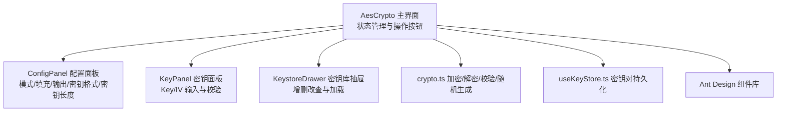
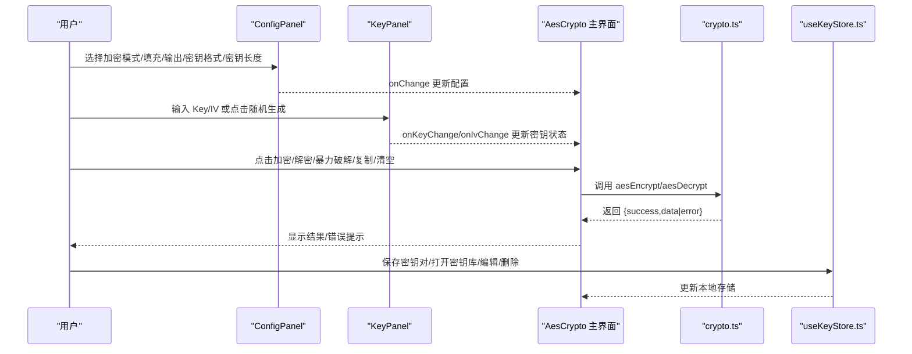
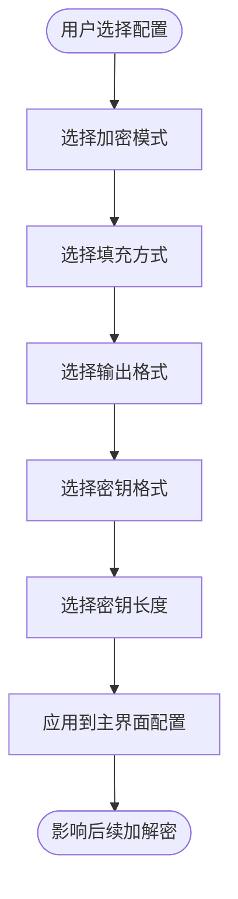
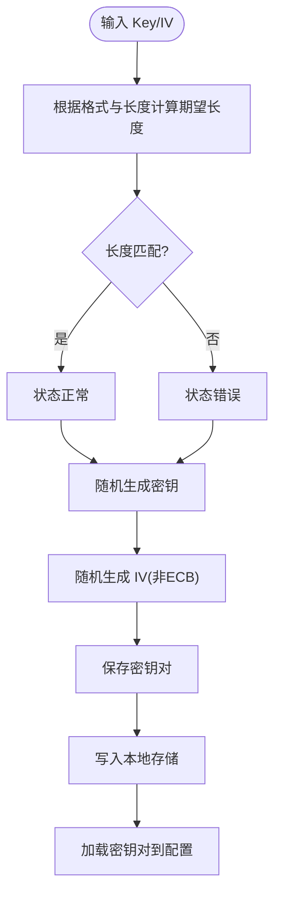
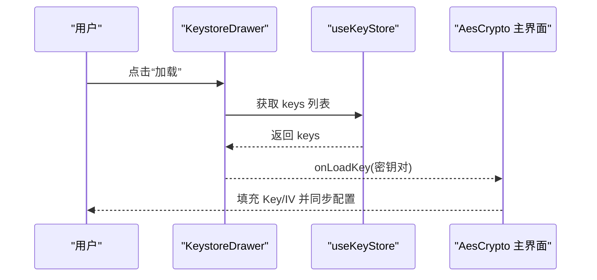
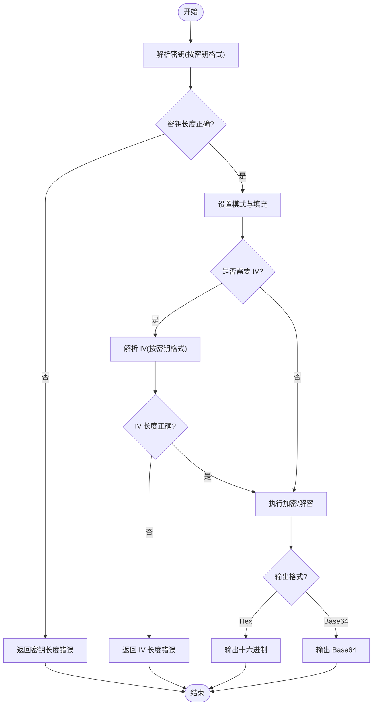
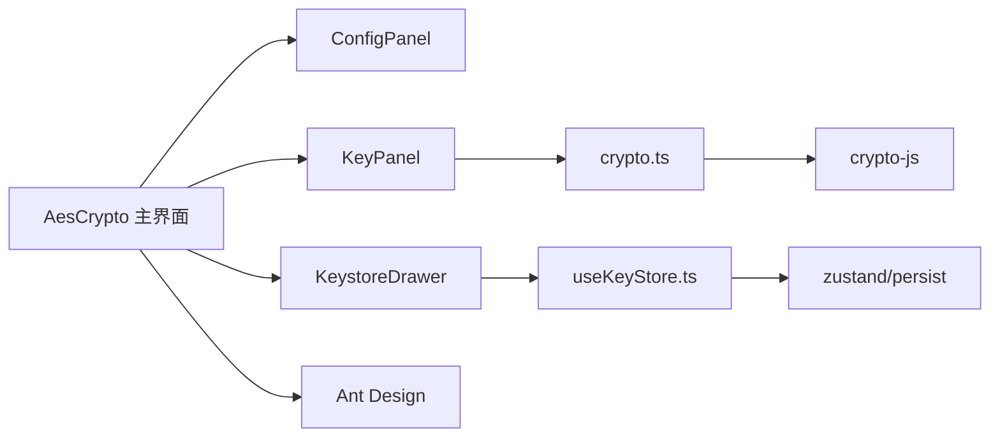

# 配置面板

<cite>
**本文引用的文件**
- [ConfigPanel.tsx](file://src/tools/crypto/AesCrypto/ConfigPanel.tsx)
- [KeyPanel.tsx](file://src/tools/crypto/AesCrypto/KeyPanel.tsx)
- [KeystoreDrawer.tsx](file://src/tools/crypto/AesCrypto/KeystoreDrawer.tsx)
- [index.tsx](file://src/tools/crypto/AesCrypto/index.tsx)
- [crypto.ts](file://src/utils/crypto.ts)
- [useKeyStore.ts](file://src/store/useKeyStore.ts)
- [theme.ts](file://src/styles/theme.ts)
- [routes.tsx](file://src/routes.tsx)
- [package.json](file://package.json)
</cite>

## 目录
1. [简介](#简介)
2. [项目结构](#项目结构)
3. [核心组件](#核心组件)
4. [架构总览](#架构总览)
5. [详细组件分析](#详细组件分析)
6. [依赖关系分析](#依赖关系分析)
7. [性能考量](#性能考量)
8. [故障排除指南](#故障排除指南)
9. [结论](#结论)
10. [附录](#附录)

## 简介
本文件面向“配置面板”功能，提供从界面设计到交互逻辑的完整使用说明与技术解析。内容涵盖：
- 加密模式选择器、填充方式配置、输出格式设置、密钥格式选择、密钥长度配置的界面与行为
- 参数验证机制、默认值设定、用户偏好持久化
- 自定义选项与高级设置的使用指导
- 常见配置场景示例与故障排除方法

## 项目结构
配置面板位于 AES 加密工具模块中，采用分层组织：
- 工具入口与主界面：AesCrypto 主组件负责状态管理、按钮操作、输入输出面板与抽屉式密钥库
- 配置面板：ConfigPanel 提供加密模式、填充方式、输出格式、密钥格式、密钥长度的选择器
- 密钥面板：KeyPanel 负责密钥与 IV 的输入、占位提示、长度校验、随机生成与保存
- 密钥库：KeystoreDrawer 提供密钥对的增删改查与批量加载
- 工具函数：crypto.ts 提供加密/解密、长度校验、随机生成等核心逻辑
- 状态存储：useKeyStore.ts 使用 Zustand + persist 实现密钥对本地持久化

图表来源
- [index.tsx:33-310](file://src/tools/crypto/AesCrypto/index.tsx#L33-L310)
- [ConfigPanel.tsx:39-95](file://src/tools/crypto/AesCrypto/ConfigPanel.tsx#L39-L95)
- [KeyPanel.tsx:23-114](file://src/tools/crypto/AesCrypto/KeyPanel.tsx#L23-L114)
- [KeystoreDrawer.tsx:26-185](file://src/tools/crypto/AesCrypto/KeystoreDrawer.tsx#L26-L185)
- [crypto.ts:59-162](file://src/utils/crypto.ts#L59-L162)
- [useKeyStore.ts:22-47](file://src/store/useKeyStore.ts#L22-L47)

章节来源
- [index.tsx:33-310](file://src/tools/crypto/AesCrypto/index.tsx#L33-L310)
- [ConfigPanel.tsx:39-95](file://src/tools/crypto/AesCrypto/ConfigPanel.tsx#L39-L95)
- [KeyPanel.tsx:23-114](file://src/tools/crypto/AesCrypto/KeyPanel.tsx#L23-L114)
- [KeystoreDrawer.tsx:26-185](file://src/tools/crypto/AesCrypto/KeystoreDrawer.tsx#L26-L185)
- [crypto.ts:59-162](file://src/utils/crypto.ts#L59-L162)
- [useKeyStore.ts:22-47](file://src/store/useKeyStore.ts#L22-L47)

## 核心组件
- 配置面板（ConfigPanel）
  - 功能：提供加密模式、填充方式、输出格式、密钥格式、密钥长度的下拉选择器
  - 默认值：在主界面初始化时设定为 CBC、Pkcs7、Base64、UTF-8、128 位
  - 交互：onChange 回调触发父级状态更新，影响后续加密/解密流程
- 密钥面板（KeyPanel）
  - 功能：输入密钥与 IV，动态占位提示与长度状态提示；支持随机生成；保存与打开密钥库
  - 校验：根据当前密钥格式与密钥长度计算期望长度，实时反馈输入状态
  - ECB 模式：禁用 IV 输入与随机生成
- 密钥库（KeystoreDrawer）
  - 功能：以表格形式展示已保存的密钥对，支持加载、编辑、删除
  - 数据持久化：基于 Zustand 的持久化中间件，自动保存到本地存储
- 加密/解密与校验（crypto.ts）
  - 功能：aesEncrypt/aesDecrypt 执行加解密；parseKeyBytes/getExpectedKeyLength 等辅助函数；isValidDecryption 输出合理性判断
  - 验证：密钥/IV 长度校验、异常捕获与错误返回
- 状态与存储（useKeyStore.ts）
  - 功能：add/update/delete 操作；随机 ID 与创建时间；持久化命名空间

章节来源
- [ConfigPanel.tsx:39-95](file://src/tools/crypto/AesCrypto/ConfigPanel.tsx#L39-L95)
- [KeyPanel.tsx:23-114](file://src/tools/crypto/AesCrypto/KeyPanel.tsx#L23-L114)
- [KeystoreDrawer.tsx:26-185](file://src/tools/crypto/AesCrypto/KeystoreDrawer.tsx#L26-L185)
- [crypto.ts:59-162](file://src/utils/crypto.ts#L59-L162)
- [useKeyStore.ts:22-47](file://src/store/useKeyStore.ts#L22-L47)

## 架构总览
配置面板与密钥面板通过受控组件与回调驱动主界面状态，主界面再调用工具函数执行加解密，并通过消息提示与错误弹窗反馈结果。

图表来源
- [index.tsx:55-129](file://src/tools/crypto/AesCrypto/index.tsx#L55-L129)
- [ConfigPanel.tsx:44-90](file://src/tools/crypto/AesCrypto/ConfigPanel.tsx#L44-L90)
- [KeyPanel.tsx:64-95](file://src/tools/crypto/AesCrypto/KeyPanel.tsx#L64-L95)
- [crypto.ts:59-162](file://src/utils/crypto.ts#L59-L162)
- [useKeyStore.ts:22-47](file://src/store/useKeyStore.ts#L22-L47)

## 详细组件分析

### 配置面板（ConfigPanel）
- 选项与默认值
  - 模式：CBC、ECB、CFB、OFB、CTR
  - 填充：Pkcs7、ZeroPadding、NoPadding
  - 输出：Base64、Hex
  - 密钥格式：UTF-8、Hex
  - 密钥长度：128、192、256 位
- 交互逻辑
  - 下拉选择器直接更新配置对象，保持不可变更新策略
  - 小尺寸与紧凑布局，适合快速切换
- 与加密/解密的关系
  - 配置决定加密算法模式、填充方式、输出编码以及密钥/IV 解析格式
  - ECB 模式下不使用 IV，KeyPanel 中 IV 输入被禁用

图表来源
- [ConfigPanel.tsx:9-37](file://src/tools/crypto/AesCrypto/ConfigPanel.tsx#L9-L37)
- [ConfigPanel.tsx:44-90](file://src/tools/crypto/AesCrypto/ConfigPanel.tsx#L44-L90)

章节来源
- [ConfigPanel.tsx:39-95](file://src/tools/crypto/AesCrypto/ConfigPanel.tsx#L39-L95)

### 密钥面板（KeyPanel）
- 占位提示与长度校验
  - 根据密钥格式与密钥长度动态计算期望字符数，实时显示输入状态
  - Hex 格式：密钥长度为 keySize/8*2；IV 长度固定为 32
  - UTF-8 格式：密钥长度为 keySize/8；IV 长度固定为 16
- ECB 模式的特殊处理
  - IV 输入禁用且不参与长度校验
- 随机生成
  - 支持一键生成符合当前格式与长度的随机密钥与 IV
- 保存与打开
  - 触发保存对话框，填写标签后写入密钥库
  - 打开密钥库抽屉进行批量管理

图表来源
- [KeyPanel.tsx:35-59](file://src/tools/crypto/AesCrypto/KeyPanel.tsx#L35-L59)
- [KeyPanel.tsx:72-95](file://src/tools/crypto/AesCrypto/KeyPanel.tsx#L72-L95)
- [crypto.ts:164-191](file://src/utils/crypto.ts#L164-L191)

章节来源
- [KeyPanel.tsx:23-114](file://src/tools/crypto/AesCrypto/KeyPanel.tsx#L23-L114)

### 密钥库（KeystoreDrawer）
- 功能
  - 展示标签、密钥片段、密钥长度、创建时间
  - 加载：将选中的密钥对回填到主界面配置与密钥输入
  - 编辑：修改标签、密钥、IV、密钥长度
  - 删除：确认删除
- 数据持久化
  - 使用 Zustand 的 persist 中间件，键名为 xkutil-aes-keystore
- 与主界面联动
  - 通过 onLoadKey 回调将密钥对注入主界面状态

图表来源
- [KeystoreDrawer.tsx:26-122](file://src/tools/crypto/AesCrypto/KeystoreDrawer.tsx#L26-L122)
- [useKeyStore.ts:22-47](file://src/store/useKeyStore.ts#L22-L47)
- [index.tsx:150-155](file://src/tools/crypto/AesCrypto/index.tsx#L150-L155)

章节来源
- [KeystoreDrawer.tsx:26-185](file://src/tools/crypto/AesCrypto/KeystoreDrawer.tsx#L26-L185)
- [useKeyStore.ts:22-47](file://src/store/useKeyStore.ts#L22-L47)

### 加密/解密与参数验证（crypto.ts）
- 加密流程
  - 解析密钥与 IV（按密钥格式）
  - 校验密钥/IV 长度
  - 设置模式与填充
  - ECB 模式不使用 IV
  - 选择输出编码（Base64/Hex）
- 解密流程
  - 解析密钥与 IV（按密钥格式）
  - 根据输出格式构造 CipherParams
  - 执行解密并转码为 UTF-8
  - 使用 isValidDecryption 判断输出合理性
- 验证规则
  - 密钥长度：按 keySize/8 计算期望长度，Hex 格式需为 16 进制字符串
  - IV 长度：固定 16 字节（32 个十六进制字符），ECB 模式不适用
  - 异常捕获：统一返回 {success, data|error}

图表来源
- [crypto.ts:59-162](file://src/utils/crypto.ts#L59-L162)
- [crypto.ts:164-191](file://src/utils/crypto.ts#L164-L191)
- [crypto.ts:202-221](file://src/utils/crypto.ts#L202-L221)

章节来源
- [crypto.ts:59-162](file://src/utils/crypto.ts#L59-L162)
- [crypto.ts:164-191](file://src/utils/crypto.ts#L164-L191)
- [crypto.ts:193-200](file://src/utils/crypto.ts#L193-L200)
- [crypto.ts:202-221](file://src/utils/crypto.ts#L202-L221)

### 用户偏好与默认值
- 默认配置
  - 在主界面初始化时设定：模式=CBC、填充=Pkcs7、输出=Base64、密钥格式=UTF-8、密钥长度=128
- 偏好保存
  - 密钥对通过 useKeyStore 持久化，便于下次直接加载
  - 主界面未对配置项做全局持久化，建议在业务扩展中增加配置持久化

章节来源
- [index.tsx:34-40](file://src/tools/crypto/AesCrypto/index.tsx#L34-L40)
- [useKeyStore.ts:22-47](file://src/store/useKeyStore.ts#L22-L47)

## 依赖关系分析
- 组件依赖
  - AesCrypto 主界面依赖 ConfigPanel、KeyPanel、KeystoreDrawer
  - KeyPanel 依赖 crypto.ts 的随机生成函数
  - KeystoreDrawer 依赖 useKeyStore 的状态与操作
- 外部依赖
  - Ant Design 提供 Select、Input、Button、Modal、Alert 等 UI 组件
  - crypto-js 提供 AES 加密/解密与编码转换
  - zustand/persist 提供状态管理与本地持久化

图表来源
- [index.tsx:20-29](file://src/tools/crypto/AesCrypto/index.tsx#L20-L29)
- [KeyPanel.tsx](file://src/tools/crypto/AesCrypto/KeyPanel.tsx#L8)
- [KeystoreDrawer.tsx](file://src/tools/crypto/AesCrypto/KeystoreDrawer.tsx#L16)
- [crypto.ts](file://src/utils/crypto.ts#L1)
- [useKeyStore.ts:1-2](file://src/store/useKeyStore.ts#L1-L2)
- [package.json:12-25](file://package.json#L12-L25)

章节来源
- [package.json:12-25](file://package.json#L12-L25)

## 性能考量
- 加密/解密复杂度
  - AES 加密/解密为线性复杂度，主要受输入数据大小与模式影响
  - ECB 模式无 IV，理论上更简单但安全性较低
- UI 交互
  - 受控组件频繁 setState，建议在高频输入场景下避免不必要的重渲染
  - 使用 useCallback 包裹事件处理器，减少子组件重渲染
- 存储与网络
  - 密钥库使用本地存储，注意避免存储超大文本导致性能下降
  - 如需跨设备同步，可考虑扩展为云端同步方案

## 故障排除指南
- 常见错误与定位
  - 密钥长度错误：检查密钥格式与密钥长度是否匹配，Hex 格式需为期望长度的 16 进制字符串
  - IV 长度错误：确保 IV 为 16 字节（32 个十六进制字符），ECB 模式不适用 IV
  - 解密失败：检查密钥/配置是否一致，输出格式是否与加密时一致
  - 输出为空：可能是密钥或配置不正确，建议使用暴力破解功能尝试密钥库中的密钥对
- 排错步骤
  1) 确认配置：模式、填充、输出格式、密钥格式、密钥长度
  2) 校验密钥与 IV：长度与格式是否正确
  3) 尝试暴力破解：加载密钥库中的密钥对逐一尝试
  4) 检查输出合理性：使用 isValidDecryption 判断输出是否为可读文本
- 建议
  - 对于生产环境，优先使用 Hex 格式与固定长度密钥，便于自动化与一致性
  - 使用密钥库管理多套密钥对，避免手动输入错误

章节来源
- [crypto.ts:68-73](file://src/utils/crypto.ts#L68-L73)
- [crypto.ts:83-88](file://src/utils/crypto.ts#L83-L88)
- [crypto.ts:131-136](file://src/utils/crypto.ts#L131-L136)
- [crypto.ts:154-156](file://src/utils/crypto.ts#L154-L156)
- [index.tsx:87-112](file://src/tools/crypto/AesCrypto/index.tsx#L87-L112)
- [crypto.ts:202-221](file://src/utils/crypto.ts#L202-L221)

## 结论
配置面板提供了直观、可控的 AES 加密参数设置能力，结合密钥面板与密钥库，形成完整的密钥管理闭环。通过严格的参数验证与合理的默认值，降低了误用风险；通过随机生成与暴力破解功能，提升了易用性与调试效率。建议在实际部署中进一步完善配置持久化与密钥轮换策略，以满足更高安全与合规要求。

## 附录

### 常见配置场景示例
- Web 应用后端密钥管理
  - 模式：CBC；填充：Pkcs7；输出：Base64；密钥格式：UTF-8；密钥长度：256
  - 说明：便于与服务端通用接口对接，Base64 输出便于传输
- 移动端本地加密
  - 模式：CTR；填充：NoPadding；输出：Hex；密钥格式：Hex；密钥长度：128
  - 说明：CTR 模式适合流式数据，Hex 输出便于二进制处理
- 安全审计与兼容性测试
  - 模式：ECB；填充：NoPadding；输出：Hex；密钥格式：Hex；密钥长度：128
  - 说明：仅用于教学与测试，不建议用于生产

### 高级设置与自定义选项
- 配置持久化（扩展建议）
  - 在主界面增加配置持久化逻辑，将当前配置写入本地存储
  - 提供“恢复默认配置”按钮，一键恢复到初始默认值
- 密钥轮换与版本管理
  - 在密钥库中增加“版本号”字段，支持多版本密钥并存
  - 提供“导出/导入”功能，便于迁移与备份
- 批量操作
  - 批量生成密钥对并导出到 CSV
  - 批量加载密钥对并进行一致性校验