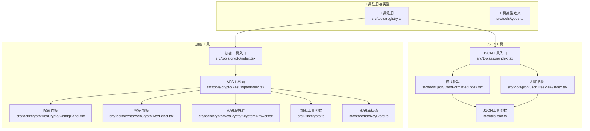
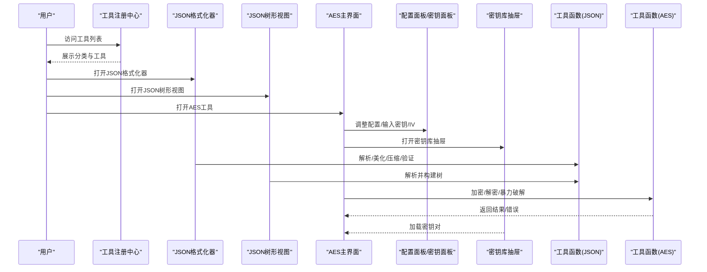
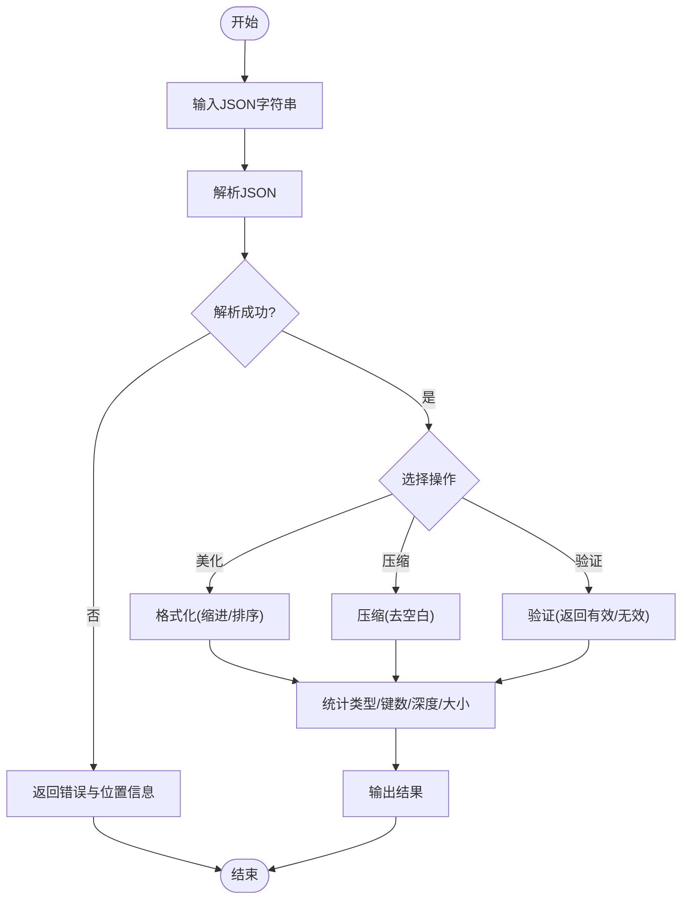
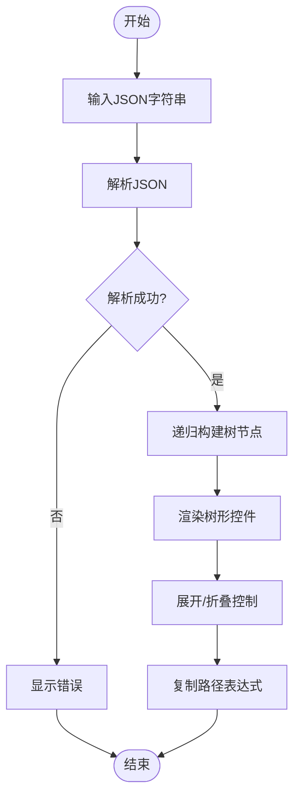
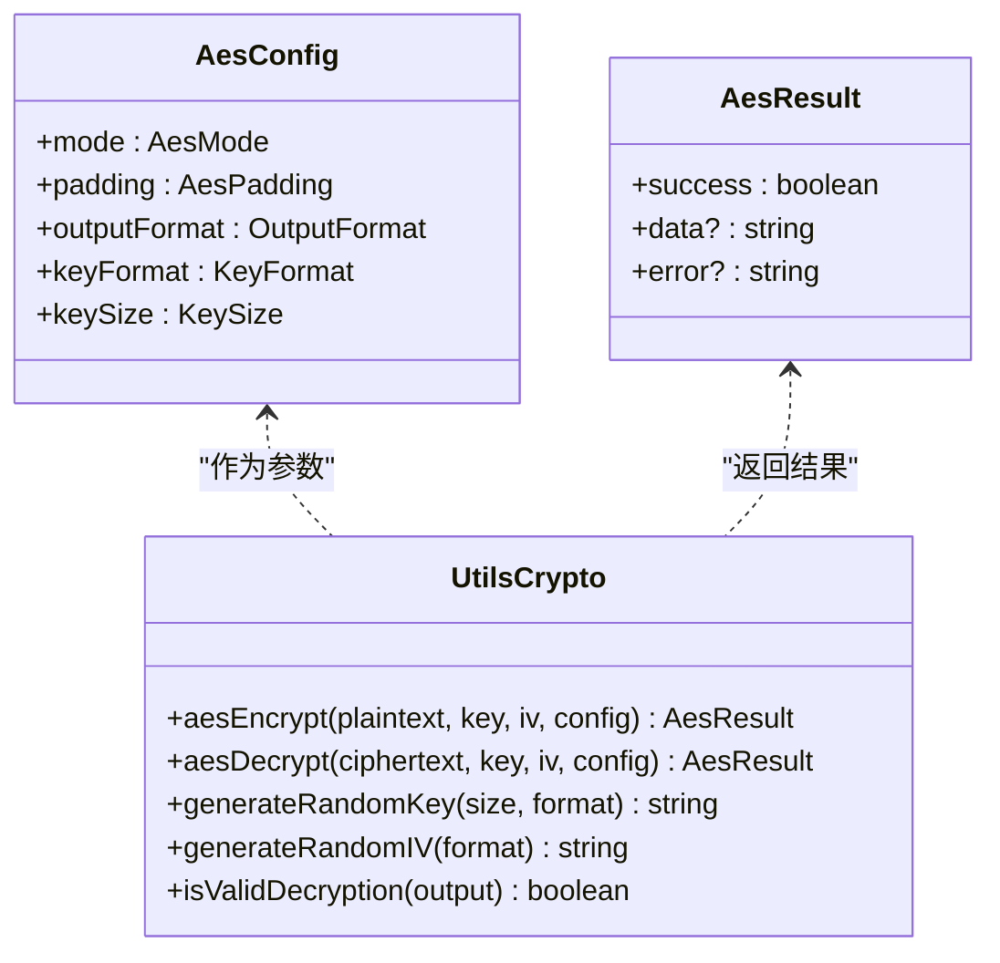
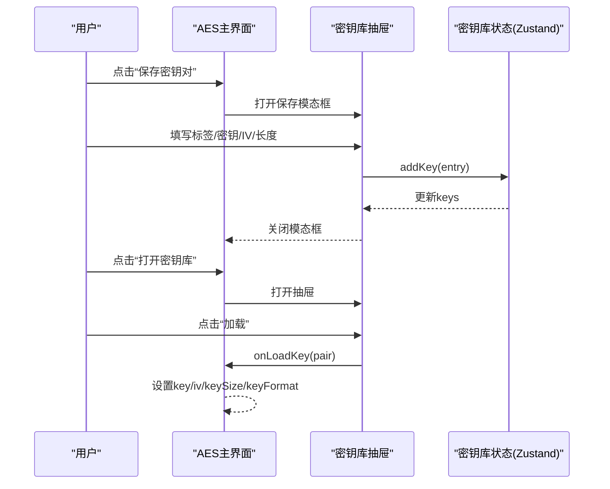
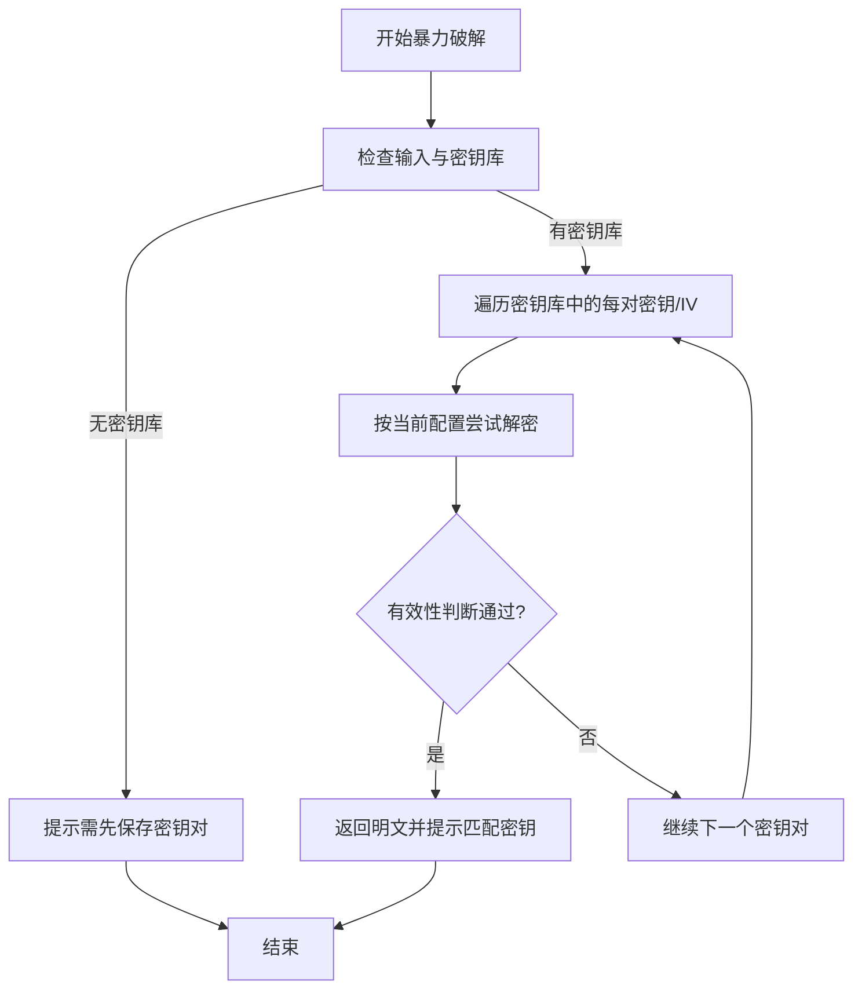
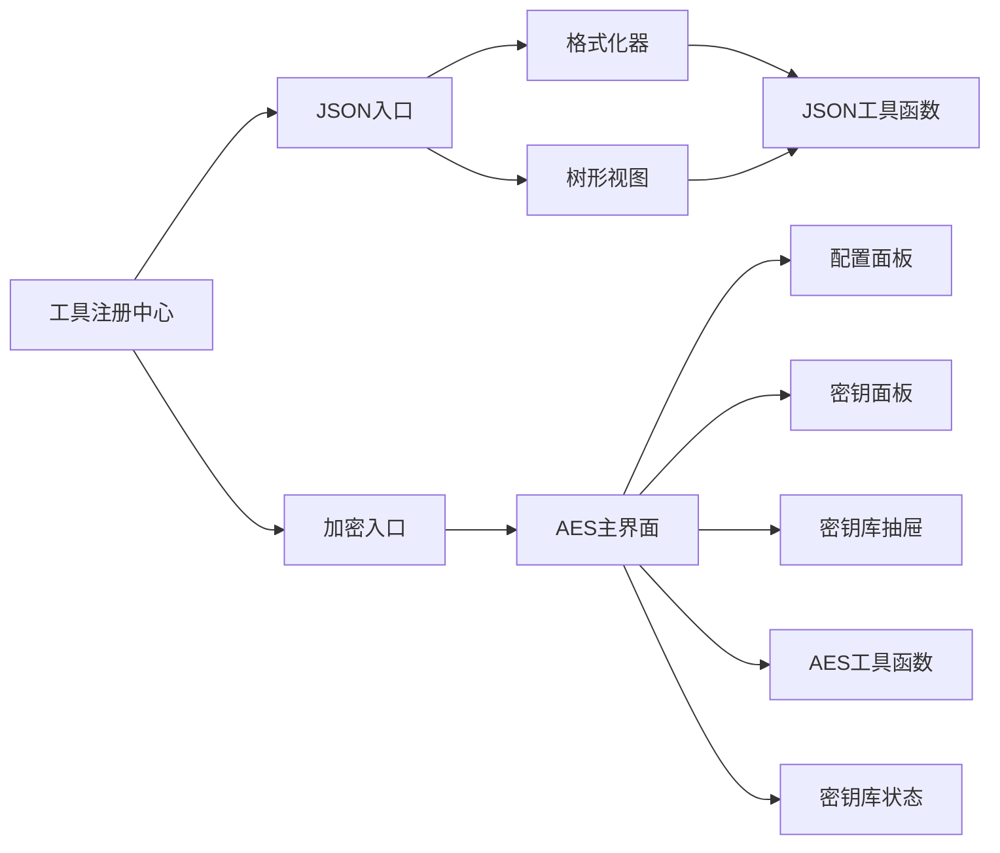

# 核心功能

<cite>
**本文引用的文件列表**
- [src/tools/json/index.tsx](file://src/tools/json/index.tsx)
- [src/tools/crypto/index.tsx](file://src/tools/crypto/index.tsx)
- [src/utils/json.ts](file://src/utils/json.ts)
- [src/utils/crypto.ts](file://src/utils/crypto.ts)
- [src/tools/registry.ts](file://src/tools/registry.ts)
- [src/tools/types.ts](file://src/tools/types.ts)
- [src/tools/json/JsonFormatter/index.tsx](file://src/tools/json/JsonFormatter/index.tsx)
- [src/tools/json/JsonTreeView/index.tsx](file://src/tools/json/JsonTreeView/index.tsx)
- [src/tools/crypto/AesCrypto/index.tsx](file://src/tools/crypto/AesCrypto/index.tsx)
- [src/tools/crypto/AesCrypto/ConfigPanel.tsx](file://src/tools/crypto/AesCrypto/ConfigPanel.tsx)
- [src/tools/crypto/AesCrypto/KeyPanel.tsx](file://src/tools/crypto/AesCrypto/KeyPanel.tsx)
- [src/tools/crypto/AesCrypto/KeystoreDrawer.tsx](file://src/tools/crypto/AesCrypto/KeystoreDrawer.tsx)
- [src/store/useKeyStore.ts](file://src/store/useKeyStore.ts)
- [package.json](file://package.json)
</cite>

## 目录
1. [简介](#简介)
2. [项目结构](#项目结构)
3. [核心组件](#核心组件)
4. [架构总览](#架构总览)
5. [详细组件分析](#详细组件分析)
6. [依赖关系分析](#依赖关系分析)
7. [性能与安全考量](#性能与安全考量)
8. [故障排查指南](#故障排查指南)
9. [结论](#结论)
10. [附录：功能对比表](#附录功能对比表)

## 简介
本文件聚焦于XKUtil项目的核心功能模块，系统性阐述以下两大系列工具：
- JSON工具系列：包括JSON格式化器（美化、压缩、验证）、JSON树形视图（可视化展示）。
- 加密工具系列：AES加解密（多模式支持、填充与输出格式）、密钥库管理（增删改查、持久化）、暴力破解流程（基于密钥库的自动尝试与有效性校验）。

文档从设计理念、使用场景、实现原理、数据流与交互流程、性能与安全考量等方面进行深入解析，并提供功能对比表与最佳实践建议，帮助不同背景的用户快速掌握与高效使用。

## 项目结构
XKUtil采用“工具注册+按功能拆分”的前端组织方式：
- 工具注册中心负责聚合各类工具并按分类组织，便于路由与导航。
- JSON与加密工具各自在独立目录下维护入口、子组件与工具函数。
- 工具函数集中在utils目录，提供纯逻辑能力，便于复用与测试。
- AES工具配套使用状态管理（Zustand）实现密钥库的本地持久化。

图表来源
- [src/tools/registry.ts:1-39](file://src/tools/registry.ts#L1-L39)
- [src/tools/json/index.tsx:1-27](file://src/tools/json/index.tsx#L1-L27)
- [src/tools/crypto/index.tsx:1-17](file://src/tools/crypto/index.tsx#L1-L17)
- [src/tools/json/JsonFormatter/index.tsx:1-267](file://src/tools/json/JsonFormatter/index.tsx#L1-L267)
- [src/tools/json/JsonTreeView/index.tsx:1-248](file://src/tools/json/JsonTreeView/index.tsx#L1-L248)
- [src/tools/crypto/AesCrypto/index.tsx:1-310](file://src/tools/crypto/AesCrypto/index.tsx#L1-L310)
- [src/utils/json.ts:1-116](file://src/utils/json.ts#L1-L116)
- [src/utils/crypto.ts:1-222](file://src/utils/crypto.ts#L1-L222)
- [src/store/useKeyStore.ts:1-47](file://src/store/useKeyStore.ts#L1-L47)

章节来源
- [src/tools/registry.ts:1-39](file://src/tools/registry.ts#L1-L39)
- [src/tools/json/index.tsx:1-27](file://src/tools/json/index.tsx#L1-L27)
- [src/tools/crypto/index.tsx:1-17](file://src/tools/crypto/index.tsx#L1-L17)

## 核心组件
本节概述两大工具系列的功能定位与职责边界：
- JSON工具系列
  - JSON格式化器：提供美化、压缩、验证能力，并统计类型、键数、深度、大小等信息。
  - JSON树形视图：将JSON结构可视化为树，支持展开/折叠、复制路径、类型标签等。
- 加密工具系列
  - AES加解密：支持多种模式（ECB/CBC/CFB/OFB/CTR）、填充（PKCS7/ZeroPadding/NoPadding）、输出格式（Base64/Hex）、密钥格式（UTF-8/Hex）、密钥长度（128/192/256）。
  - 密钥库管理：提供增删改查、持久化、导入导出（UI中体现为加载/编辑/删除），并支持随机生成密钥与IV。
  - 暴力破解：基于密钥库逐个尝试解密，结合有效性判断（可打印字符比例、替换字符检测）提升成功率与安全性。

章节来源
- [src/tools/json/index.tsx:5-26](file://src/tools/json/index.tsx#L5-L26)
- [src/tools/crypto/index.tsx:5-16](file://src/tools/crypto/index.tsx#L5-L16)
- [src/utils/json.ts:14-116](file://src/utils/json.ts#L14-L116)
- [src/utils/crypto.ts:9-222](file://src/utils/crypto.ts#L9-L222)
- [src/store/useKeyStore.ts:5-47](file://src/store/useKeyStore.ts#L5-L47)

## 架构总览
整体架构遵循“工具注册—页面组件—工具函数—状态存储”的分层设计：
- 工具注册中心根据工具定义动态生成分类与导航。
- 页面组件负责交互与状态管理，调用工具函数执行具体任务。
- 工具函数提供纯逻辑能力，避免UI耦合。
- 状态存储通过Zustand实现密钥库的本地持久化，确保跨会话可用。

图表来源
- [src/tools/registry.ts:25-39](file://src/tools/registry.ts#L25-L39)
- [src/tools/json/JsonFormatter/index.tsx:53-130](file://src/tools/json/JsonFormatter/index.tsx#L53-L130)
- [src/tools/json/JsonTreeView/index.tsx:117-132](file://src/tools/json/JsonTreeView/index.tsx#L117-L132)
- [src/tools/crypto/AesCrypto/index.tsx:55-112](file://src/tools/crypto/AesCrypto/index.tsx#L55-L112)
- [src/utils/json.ts:14-116](file://src/utils/json.ts#L14-L116)
- [src/utils/crypto.ts:59-162](file://src/utils/crypto.ts#L59-L162)

## 详细组件分析

### JSON工具系列

#### JSON格式化器（美化、压缩、验证）
- 功能要点
  - 解析：使用工具函数解析输入，捕获语法错误并定位行列。
  - 美化：支持自定义缩进（2空格/4空格/Tab）与键排序。
  - 压缩：去除空白字符，输出紧凑字符串。
  - 验证：仅返回“有效”或错误信息，配合统计信息展示类型、键数、深度、大小。
  - 统计：计算类型、键总数、最大嵌套深度、字符串化后的字节数。
- 设计理念
  - 将UI与逻辑分离，解析与格式化由工具函数完成，组件只负责交互与展示。
  - 提供错误位置信息，提升调试体验。
- 使用场景
  - 开发者调试接口响应、优化日志可读性、批量压缩配置文件。
- 性能与复杂度
  - 解析与美化/压缩均为O(n)，键排序在对象层级上递归，最坏情况下与节点数量线性相关。
- 最佳实践
  - 对大体量JSON优先使用压缩；对调试场景使用美化并开启键排序以便比对。
  - 若出现解析错误，优先检查错误位置信息，再逐步修正。

图表来源
- [src/tools/json/JsonFormatter/index.tsx:53-130](file://src/tools/json/JsonFormatter/index.tsx#L53-L130)
- [src/utils/json.ts:14-116](file://src/utils/json.ts#L14-L116)

章节来源
- [src/tools/json/JsonFormatter/index.tsx:45-267](file://src/tools/json/JsonFormatter/index.tsx#L45-L267)
- [src/utils/json.ts:14-116](file://src/utils/json.ts#L14-L116)

#### JSON树形视图（可视化展示）
- 功能要点
  - 将任意JSON转换为树形结构，叶子节点显示值与类型标签，非叶子节点显示类型与子节点。
  - 支持全部展开/全部折叠，点击节点标题可复制其路径表达式（$根路径）。
  - 输入为空或解析失败时，右侧提示错误或引导输入。
- 设计理念
  - 通过树形结构直观呈现嵌套关系，辅助定位字段与路径。
- 使用场景
  - 快速浏览复杂JSON结构、生成路径表达式、排查字段缺失或类型异常。
- 性能与复杂度
  - 构建树为O(n)，遍历所有键用于展开控制也为O(n)。
- 最佳实践
  - 对超大对象先进行压缩或筛选，再使用树形视图定位目标字段。

图表来源
- [src/tools/json/JsonTreeView/index.tsx:117-132](file://src/tools/json/JsonTreeView/index.tsx#L117-L132)
- [src/utils/json.ts:14-116](file://src/utils/json.ts#L14-L116)

章节来源
- [src/tools/json/JsonTreeView/index.tsx:117-248](file://src/tools/json/JsonTreeView/index.tsx#L117-L248)
- [src/utils/json.ts:14-116](file://src/utils/json.ts#L14-L116)

### 加密工具系列（AES）

#### AES加解密（多模式、填充、输出格式、密钥格式、密钥长度）
- 功能要点
  - 模式：ECB、CBC、CFB、OFB、CTR。
  - 填充：PKCS7、ZeroPadding、NoPadding。
  - 输出格式：Base64、Hex。
  - 密钥格式：UTF-8、Hex。
  - 密钥长度：128、192、256位。
  - 输入校验：密钥与IV长度严格校验，不符合预期直接报错。
  - 输出校验：解密后进行有效性判断（可打印字符比例与替换字符检测）。
- 设计理念
  - 通过映射表将枚举值映射到底层库常量，统一配置入口，降低使用门槛。
  - 明确的长度与格式约束，减少误用导致的安全问题。
- 使用场景
  - 配置文件加密、日志脱敏、传输前压缩与加密。
- 安全与性能
  - 不同模式与填充影响安全性与性能，CBC/PKCS7通常更通用。
  - 随机生成密钥与IV，避免硬编码。
- 最佳实践
  - 优先使用CBC+PKCS7，密钥长度建议256位。
  - IV必须随机且每次加密不同，避免重复使用相同IV。

图表来源
- [src/utils/crypto.ts:9-222](file://src/utils/crypto.ts#L9-L222)

章节来源
- [src/utils/crypto.ts:9-222](file://src/utils/crypto.ts#L9-L222)

#### 密钥库管理（生命周期与持久化）
- 功能要点
  - 增：保存密钥对（标签、密钥、IV、密钥格式、密钥长度）。
  - 删：删除指定密钥对。
  - 改：编辑标签、密钥、IV、密钥长度。
  - 查：查看列表、按标签筛选、加载到当前配置。
  - 持久化：基于Zustand持久化中间件，本地存储密钥库。
- 设计理念
  - 将密钥库抽象为状态，提供简单API，便于在AES主界面中直接调用。
- 使用场景
  - 多环境密钥管理、团队共享密钥清单、快速切换配置。
- 最佳实践
  - 为每个密钥对设置清晰标签，定期轮换密钥与IV。
  - 仅在受信任设备上保存密钥库。

图表来源
- [src/tools/crypto/AesCrypto/index.tsx:131-155](file://src/tools/crypto/AesCrypto/index.tsx#L131-L155)
- [src/tools/crypto/AesCrypto/KeystoreDrawer.tsx:26-122](file://src/tools/crypto/AesCrypto/KeystoreDrawer.tsx#L26-L122)
- [src/store/useKeyStore.ts:22-46](file://src/store/useKeyStore.ts#L22-L46)

章节来源
- [src/tools/crypto/AesCrypto/KeystoreDrawer.tsx:26-185](file://src/tools/crypto/AesCrypto/KeystoreDrawer.tsx#L26-L185)
- [src/store/useKeyStore.ts:5-47](file://src/store/useKeyStore.ts#L5-L47)

#### 暴力破解流程（基于密钥库的自动尝试与有效性判断）
- 功能要点
  - 遍历密钥库中的每一对密钥/IV，按当前配置尝试解密。
  - 使用有效性判断函数过滤无效结果（空、包含替换字符、可打印字符比例过低）。
  - 成功后停止并提示匹配的密钥标签与长度。
- 设计理念
  - 在保证安全的前提下，提供便捷的“一键尝试”能力，避免手动逐一试错。
- 安全考虑
  - 仅限于本地密钥库内的密钥对，不会发起外部攻击。
  - 通过有效性判断降低误判概率，提高成功率。
- 使用场景
  - 忘记密钥配置或需要快速恢复历史密文。
- 最佳实践
  - 仅在可控范围内使用，避免滥用导致密钥泄露风险。

图表来源
- [src/tools/crypto/AesCrypto/index.tsx:87-112](file://src/tools/crypto/AesCrypto/index.tsx#L87-L112)
- [src/utils/crypto.ts:202-222](file://src/utils/crypto.ts#L202-L222)

章节来源
- [src/tools/crypto/AesCrypto/index.tsx:87-112](file://src/tools/crypto/AesCrypto/index.tsx#L87-L112)
- [src/utils/crypto.ts:202-222](file://src/utils/crypto.ts#L202-L222)

## 依赖关系分析
- 工具注册中心依赖工具入口文件，将工具定义转换为分类与导航项。
- JSON工具入口依赖两个子组件与工具函数。
- AES工具入口依赖配置面板、密钥面板、密钥库抽屉与工具函数、状态存储。
- 工具函数与状态存储相互独立，分别承担纯逻辑与状态持久化职责。

图表来源
- [src/tools/registry.ts:1-39](file://src/tools/registry.ts#L1-L39)
- [src/tools/json/index.tsx:1-27](file://src/tools/json/index.tsx#L1-L27)
- [src/tools/crypto/index.tsx:1-17](file://src/tools/crypto/index.tsx#L1-L17)
- [src/utils/json.ts:1-116](file://src/utils/json.ts#L1-L116)
- [src/utils/crypto.ts:1-222](file://src/utils/crypto.ts#L1-L222)
- [src/store/useKeyStore.ts:1-47](file://src/store/useKeyStore.ts#L1-L47)

章节来源
- [src/tools/registry.ts:1-39](file://src/tools/registry.ts#L1-L39)
- [package.json:12-25](file://package.json#L12-L25)

## 性能与安全考量
- 性能
  - JSON解析与格式化/压缩为线性复杂度，适合大多数日常使用场景。
  - 树形视图构建与渲染在大数据量时可能成为瓶颈，建议先压缩或筛选。
  - AES加密/解密性能主要取决于底层库与硬件，建议在生产环境使用256位密钥与CBC+PKCS7。
- 安全
  - AES工具提供严格的密钥与IV长度校验，避免常见误用导致的安全问题。
  - 暴力破解仅限于本地密钥库，不涉及外部攻击，但仍需谨慎使用。
  - 有效性判断有助于识别解密失败或错误配置，减少误判。
- 最佳实践
  - 优先使用CBC+PKCS7+256位密钥；IV必须随机且唯一。
  - 密钥库应本地持久化，避免明文泄露；定期轮换密钥。
  - 对敏感数据进行压缩后再加密，减少冗余信息暴露。

[本节为通用指导，无需特定文件引用]

## 故障排查指南
- JSON格式化器
  - 解析失败：检查错误位置信息，确认括号、引号、逗号是否匹配。
  - 美化/压缩后体积异常：确认是否启用了键排序或去空白。
- JSON树形视图
  - 无法展开：确认输入是否为有效JSON；检查是否有空对象或数组。
  - 路径复制无效：确认节点存在且非叶子节点。
- AES工具
  - 加密/解密报错：检查密钥/IV长度与格式是否符合当前配置。
  - 暴力破解失败：确认密钥库中是否存在匹配的密钥对；尝试调整有效性判断阈值。
  - 无法复制输出：确认浏览器权限与剪贴板API可用性。

章节来源
- [src/tools/json/JsonFormatter/index.tsx:217-226](file://src/tools/json/JsonFormatter/index.tsx#L217-L226)
- [src/tools/json/JsonTreeView/index.tsx:174-183](file://src/tools/json/JsonTreeView/index.tsx#L174-L183)
- [src/tools/crypto/AesCrypto/index.tsx:208-219](file://src/tools/crypto/AesCrypto/index.tsx#L208-L219)

## 结论
XKUtil通过清晰的模块划分与工具函数抽象，实现了JSON与AES两大类高频开发工具的高可用与易用性。JSON工具侧重“可读性与可视化”，AES工具强调“灵活性与安全性”。配合密钥库与暴力破解流程，既满足日常开发需求，又兼顾安全与效率。

[本节为总结性内容，无需特定文件引用]

## 附录：功能对比表
- JSON工具系列
  - JSON格式化器：支持美化、压缩、验证，提供统计信息。
  - JSON树形视图：可视化展示JSON结构，支持展开/折叠与路径复制。
- 加密工具系列
  - AES加解密：支持多模式、多填充、多输出格式、多密钥格式与多密钥长度。
  - 密钥库管理：增删改查、持久化、随机生成、加载。
  - 暴力破解：基于密钥库自动尝试并进行有效性判断。

章节来源
- [src/tools/json/index.tsx:5-26](file://src/tools/json/index.tsx#L5-L26)
- [src/tools/crypto/index.tsx:5-16](file://src/tools/crypto/index.tsx#L5-L16)
- [src/utils/json.ts:14-116](file://src/utils/json.ts#L14-L116)
- [src/utils/crypto.ts:9-222](file://src/utils/crypto.ts#L9-L222)
- [src/store/useKeyStore.ts:5-47](file://src/store/useKeyStore.ts#L5-L47)